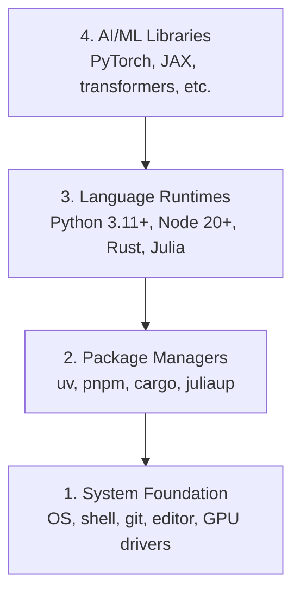

# 开发环境

> 你的工具塑造你的思维。只需一次，正确设置。

**类型：** 构建  
**语言：** Python、Node.js、Rust  
**先决条件：** 无  
**时间：** ~45 分钟

## 学习目标

- 从零开始设置 Python 3.11+、Node.js 20+ 和 Rust 工具链
- 配置虚拟环境（virtual environments）和包管理器（package managers）以实现可复现的构建
- 验证 GPU 访问权限（使用 CUDA/MPS）并运行测试张量操作
- 理解四层堆栈：系统、包、运行时、AI 库

## 问题

你即将通过 200 多节课程，使用 Python、TypeScript、Rust 和 Julia 学习 AI 工程。如果你的环境出问题，每一节课都会变成与工具的斗争，而不是学习。

大多数人会跳过环境设置，然后花几个小时调试导入错误、版本冲突和缺失的 CUDA 驱动。我们这次要做对，一劳永逸。

## 概念

AI 工程环境有四个层次：



我们从底层往上安装。每一层都依赖其下一层。

## 构建它

### 第 1 步：系统基础（System Foundation）

检查你的系统并安装基础工具。

```bash
# macOS
xcode-select --install
brew install git curl wget

# Ubuntu/Debian
sudo apt update && sudo apt install -y build-essential git curl wget

# Windows（使用 WSL2）
wsl --install -d Ubuntu-24.04
```

### 第 2 步：使用 uv 安装 Python

我们使用 `uv` —— 它比 pip 快 10-100 倍，并自动管理虚拟环境（virtual environments）。

```bash
curl -LsSf https://astral.sh/uv/install.sh | sh

uv python install 3.12

uv venv
source .venv/bin/activate  # Windows 下则使用 .venv\Scripts\activate

uv pip install numpy matplotlib jupyter
```

验证：

```python
import sys
print(f"Python {sys.version}")

import numpy as np
print(f"NumPy {np.__version__}")
a = np.array([1, 2, 3])
print(f"向量: {a}, 自身点积: {np.dot(a, a)}")
```

### 第 3 步：使用 pnpm 安装 Node.js

用于 TypeScript 课程（代理、MCP 服务器、Web 应用）。

```bash
curl -fsSL https://fnm.vercel.app/install | bash
fnm install 22
fnm use 22

npm install -g pnpm

node -e "console.log('Node', process.version)"
```

### 第 4 步：Rust

用于性能关键课程（推理、系统）。

```bash
curl --proto '=https' --tlsv1.2 -sSf https://sh.rustup.rs | sh

rustc --version
cargo --version
```

### 第 5 步：Julia（可选）

用于数学密集型课程，Julia 在这方面很出色。

```bash
curl -fsSL https://install.julialang.org | sh

julia -e 'println("Julia ", VERSION)'
```

### 第 6 步：GPU 设置（如果你有）

```bash
# NVIDIA
nvidia-smi

# 安装带 CUDA 的 PyTorch
uv pip install torch torchvision torchaudio --index-url https://download.pytorch.org/whl/cu124
```

```python
import torch
print(f"CUDA 可用: {torch.cuda.is_available()}")
if torch.cuda.is_available():
    print(f"GPU: {torch.cuda.get_device_name(0)}")
```

没有 GPU？没问题。大多数课程都可以在 CPU 上运行。对于训练密集型课程，请使用 Google Colab 或云端 GPU。

### 第 7 步：验证一切

运行验证脚本：

```bash
python phases/00-setup-and-tooling/01-dev-environment/code/verify.py
```

## 使用它

你的环境现在已经为本课程中的所有课程做好准备。以下是各语言使用场景：

| 语言 | 使用于 | 包管理器 |
|------|--------|----------|
| Python | 第 1-12 阶段（机器学习、深度学习、自然语言处理、计算机视觉、音频、大型语言模型） | uv |
| TypeScript | 第 13-17 阶段（工具、代理、群集、基础设施） | pnpm |
| Rust | 第 12、15-17 阶段（性能关键系统） | cargo |
| Julia | 第 1 阶段（数学基础） | Pkg |

## 交付它

本课程产出一个任何人都可以运行的验证脚本，用以检查他们的环境设置。

查看 `outputs/prompt-env-check.md`，了解一个帮助 AI 助理诊断环境问题的提示。

## 练习

1. 运行验证脚本并修复所有失败项  
2. 为本课程创建一个 Python 虚拟环境并安装 PyTorch  
3. 用四种语言编写一个“hello world”程序并运行它们
