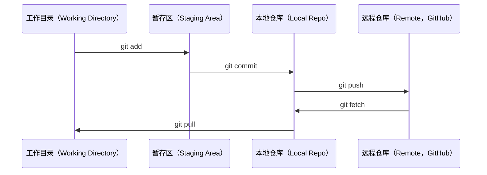

# Git 与协作

> 版本控制是必需的。这里构建的每个实验、每个模型、每节课程都会被追踪记录。

**类型:** 学习  
**语言:** --  
**先决条件:** 第0阶段，第1课  
**时间:** ~30分钟  

## 学习目标

- 配置 git 身份并使用日常工作流程：add、commit 和 push  
- 创建并合并分支以进行独立实验，且不影响主分支（main）  
- 编写 `.gitignore`，排除模型检查点和大型二进制文件  
- 使用 `git log` 浏览提交历史，了解项目演进  

## 问题

你将需要在20个阶段中编写数百个代码文件。没有版本控制，你会丢失工作，弄坏无法撤销的东西，也无法与他人协作。

Git 是工具，GitHub 是代码的托管地。本课只涵盖你完成本课程所需的内容。  

## 概念



记住三件事：  
1. 经常保存（`git commit`）  
2. 推送到远程（`git push`）  
3. 为实验创建分支（`git checkout -b experiment`）  

## 实践操作

### 第1步：配置 git

```bash
git config --global user.name "Your Name"
git config --global user.email "you@example.com"
```

### 第2步：日常工作流程

```bash
git status
git add file.py
git commit -m "Add perceptron implementation"
git push origin main
```

### 第3步：为实验创建分支

```bash
git checkout -b experiment/new-optimizer

# ... 进行更改，提交 ...

git checkout main
git merge experiment/new-optimizer
```

### 第4步：使用本课程仓库

```bash
git clone https://github.com/rohitg00/ai-engineering-from-scratch.git
cd ai-engineering-from-scratch

git checkout -b my-progress
# 按照课程进度学习，提交你的代码
git push origin my-progress
```

## 使用方法

对于本课程，你只需要以下命令：

| 命令 | 用途 |
|---------|------|
| `git clone` | 获取课程仓库 |
| `git add` + `git commit` | 保存你的工作 |
| `git push` | 备份到 GitHub |
| `git checkout -b` | 试验新东西，不破坏主分支 |
| `git log --oneline` | 查看你的提交记录 |

仅此而已。你不需要为本课程使用 rebase、cherry-pick 或子模块（submodules）等命令。  

## 练习

1. 克隆此仓库，创建一个名为 `my-progress` 的分支，创建文件，提交并推送  
2. 创建 `.gitignore`，排除模型检查点文件（`.pt`、`.pth`、`.safetensors`）  
3. 使用 `git log --oneline` 查看仓库提交历史，阅读课程是如何添加的  

## 关键词

| 术语 | 人们说 | 实际含义 |
|------|--------|----------|
| Commit（提交） | “保存” | 项目在某一时刻的快照 |
| Branch（分支） | “副本” | 一个指向提交的指针，随着工作向前移动 |
| Merge（合并） | “合并代码” | 将一个分支的更改应用到另一个分支 |
| Remote（远程仓库） | “云端” | 托管代码的远程副本（如 GitHub、GitLab） |
