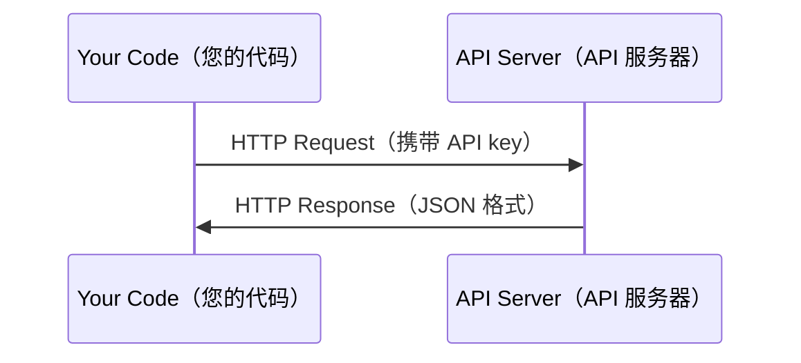

# APIs & Keys

> 每个 AI API 的工作方式都是相同的：发送请求，获取响应。细节会变化，但模式不变。

**类型：** Build（构建）  
**语言：** Python、TypeScript  
**先决条件：** Phase 0，Lesson 01  
**时间：** 约30分钟

## 学习目标

- 使用环境变量和 `.env` 文件安全存储 API keys（API 密钥）
- 使用 Anthropic Python SDK 和原生 HTTP 调用 LLM API（大语言模型 API）
- 比较基于 SDK 和原生 HTTP 的请求/响应格式以便调试
- 识别并处理常见的 API 错误，包括认证和速率限制

## 问题描述

从 Phase 11 开始，您将调用 LLM API（Anthropic、OpenAI、Google）。在 Phase 13-16 中您将构建使用这些 API 循环工作的 agents（代理）。您需要了解 API keys 是如何工作的，如何安全存储它们，以及如何发出您的第一个 API 请求。

## 概念



每个 API 调用包含：  
1. 一个端点（URL）  
2. 一个 API key（认证）  
3. 一个请求体（您想要的内容）  
4. 一个响应体（您收到的内容）

## 构建它

### 步骤1：安全存储 API key

切勿将 API keys 写入代码。使用环境变量。

```bash
export ANTHROPIC_API_KEY="sk-ant-..."
export OPENAI_API_KEY="sk-..."
```

或者使用 `.env` 文件（并将其加入 `.gitignore`）：

```text
ANTHROPIC_API_KEY=sk-ant-...
OPENAI_API_KEY=sk-...
```

### 步骤2：第一个 API 调用（Python）

```python
import anthropic

client = anthropic.Anthropic()

response = client.messages.create(
    model="claude-sonnet-4-20250514",
    max_tokens=256,
    messages=[{"role": "user", "content": "What is a neural network in one sentence?"}]
)

print(response.content[0].text)
```

### 步骤3：第一个 API 调用（TypeScript）

```typescript
import Anthropic from "@anthropic-ai/sdk";

const client = new Anthropic();

const response = await client.messages.create({
  model: "claude-sonnet-4-20250514",
  max_tokens: 256,
  messages: [{ role: "user", content: "What is a neural network in one sentence?" }],
});

console.log(response.content[0].text);
```

### 步骤4：原生 HTTP 调用（无 SDK）

```python
import os
import urllib.request
import json

url = "https://api.anthropic.com/v1/messages"
headers = {
    "Content-Type": "application/json",
    "x-api-key": os.environ["ANTHROPIC_API_KEY"],
    "anthropic-version": "2023-06-01",
}
body = json.dumps({
    "model": "claude-sonnet-4-20250514",
    "max_tokens": 256,
    "messages": [{"role": "user", "content": "What is a neural network in one sentence?"}],
}).encode()

req = urllib.request.Request(url, data=body, headers=headers, method="POST")
with urllib.request.urlopen(req) as resp:
    result = json.loads(resp.read())
    print(result["content"][0]["text"])
```

这正是 SDK 在底层所做的。理解原生 HTTP 调用有助于调试。

## 使用它

本课程中：

| API | 何时需要 | 免费额度 |
|-----|----------|----------|
| Anthropic（Claude） | Phases 11-16（agents、tools） | 注册即得 $5 额度 |
| OpenAI | Phase 11（对比） | 注册即得 $5 额度 |
| Hugging Face | Phases 4-10（模型、数据集） | 免费 |

您当前无需全部设置，根据课程需求逐步配置即可。

## 发布它

本课件产出：  
- `outputs/prompt-api-troubleshooter.md` - 诊断常见 API 错误

## 练习

1. 获取 Anthropic API key 并发出您的第一次 API 请求  
2. 试试原生 HTTP 版本，并将响应格式与 SDK 版本对比  
3. 故意使用错误的 API key，观察错误信息

## 关键词汇

| 词汇 | 常见说法 | 实际含义 |
|------|---------|----------|
| API key | “API 的密码” | 唯一标识账户且授权请求的字符串 |
| Rate limit | “被限制调用了” | 每分钟/小时允许的最大请求数，用于防止滥用并保证公平 |
| Token | “一个单词”（API 语境） | 计费单位：输入和输出的 token 数分别计费 |
| Streaming | “实时响应” | 逐字获取响应而非等待完整响应 |
