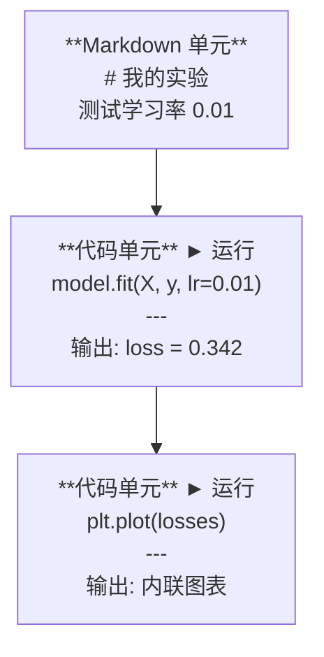
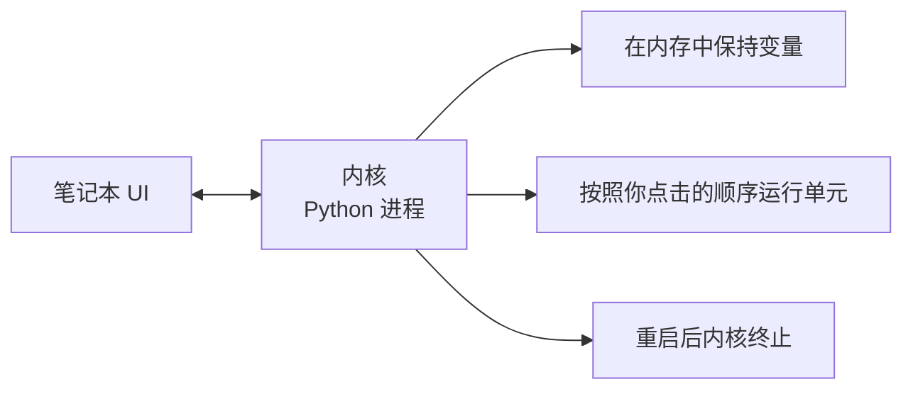

# Jupyter 笔记本（Jupyter Notebooks）

> 笔记本是AI工程师的实验台。在这里进行原型设计，然后将可用部分移植到生产环境。

**类型：** 构建  
**语言：** Python  
**先决条件：** 阶段 0，课程 01  
**时间：** 约 30 分钟

## 学习目标

- 安装并启动 JupyterLab、Jupyter Notebook 或带有 Jupyter 扩展的 VS Code
- 使用魔法命令（`%timeit`、`%%time`、`%matplotlib inline`）进行基准测试和内联可视化
- 区分何时使用笔记本（notebooks）与脚本（scripts），并应用“在笔记本中探索，在脚本中发布”的工作流程
- 识别并避免常见的笔记本陷阱：非顺序执行、隐藏状态和内存泄漏

## 问题所在

每篇 AI 论文、教程和 Kaggle 竞赛都使用 Jupyter 笔记本。它们允许你分块运行代码，在内部查看输出，将代码与说明混合，并快速迭代。如果你尝试在没有笔记本的情况下学习 AI，就像做数学作业时没有草稿纸一样。

但笔记本确实存在真实的陷阱。人们用它做所有事情，包括其不擅长的场景。知道何时使用笔记本、何时使用脚本，可以让你避免日后的调试噩梦。

## 概念说明

笔记本包含一系列单元（cells）。每个单元是代码或文本。



内核（kernel）是后台运行的 Python 进程。当你运行一个单元时，它会把代码发送给内核，内核执行代码并返回结果。所有单元共享同一个内核，所以变量在单元之间是持久的。



这里的“按照你点击的顺序”既是超能力，也是坑。

## 构建步骤

### 第 1 步：选择你的界面

三种选择，一个格式：

| 界面 | 安装方式 | 适用场景 |
|-------|---------|----------|
| JupyterLab | `pip install jupyterlab` 然后运行 `jupyter lab` | 完整 IDE 体验，多标签页，文件浏览器，终端 |
| Jupyter Notebook | `pip install notebook` 然后运行 `jupyter notebook` | 简单轻量，一次只能打开一个笔记本 |
| VS Code | 安装 “Jupyter” 扩展 | IDE 已具备，内置 Git 集成，调试功能 |

三者均支持读取和写入同一个 `.ipynb` 文件。选你喜欢的。JupyterLab 在 AI 领域最常用。

```bash
pip install jupyterlab
jupyter lab
```

### 第 2 步：重要的键盘快捷键

你在两种模式间操作。按 `Escape` 进入命令模式（左侧蓝条），按 `Enter` 进入编辑模式（绿色条）。

**命令模式（用得最多）：**

| 键 | 操作 |
|-----|--------|
| `Shift+Enter` | 运行单元，跳到下一个单元 |
| `A` | 在上方插入单元 |
| `B` | 在下方插入单元 |
| `DD` | 删除单元 |
| `M` | 转换为 Markdown 单元 |
| `Y` | 转换为代码单元 |
| `Z` | 撤销单元操作 |
| `Ctrl+Shift+H` | 显示全部快捷键 |

**编辑模式：**

| 键 | 操作 |
|-----|--------|
| `Tab` | 自动补全 |
| `Shift+Tab` | 显示函数签名 |
| `Ctrl+/` | 切换注释 |

`Shift+Enter` 是你每天会用千百次的快捷键。先学它。

### 第 3 步：单元类型

**代码单元** 运行 Python 并显示输出：

```python
import numpy as np
data = np.random.randn(1000)
data.mean(), data.std()
```

输出：`(0.0032, 0.9987)`

**Markdown 单元** 渲染格式化文本。用来说明你在做什么和为什么。支持标题、加粗、斜体、LaTeX 数学（`$E = mc^2$`）、表格和图片。

### 第 4 步：魔法命令（Magic commands）

这些不是 Python 代码，是 Jupyter 专用命令，以 `%`（行魔法）或 `%%`（单元魔法）开头。

**代码计时：**

```python
%timeit np.random.randn(10000)
```

输出：`45.2 us +/- 1.3 us per loop`

```python
%%time
model.fit(X_train, y_train, epochs=10)
```

输出：`Wall time: 2.34 s`

`%timeit` 多次执行取平均，`%%time` 执行一次。微基准用 `%timeit`，训练时用 `%%time`。

**启用内联绘图：**

```python
%matplotlib inline
```

运行后，每个 `plt.plot()` 或 `plt.show()` 直接在笔记本中显示。

**在笔记本内安装包：**

```python
!pip install scikit-learn
```

`!` 前缀允许你运行任意 shell 命令。

**检测环境变量：**

```python
%env CUDA_VISIBLE_DEVICES
```

### 第 5 步：在笔记本中显示丰富输出

笔记本自动显示单元最后一个表达式的结果，但你可以控制显示内容：

```python
import pandas as pd

df = pd.DataFrame({
    "model": ["Linear", "Random Forest", "Neural Net"],
    "accuracy": [0.72, 0.89, 0.94],
    "training_time": [0.1, 2.3, 45.6]
})
df
```

渲染成格式化 HTML 表格，而非文本转储。绘图同理：

```python
import matplotlib.pyplot as plt

plt.figure(figsize=(8, 4))
plt.plot([1, 2, 3, 4], [1, 4, 2, 3])
plt.title("内联图表")
plt.show()
```

图表直接显示在单元下方。这就是为什么笔记本主导 AI 工作。可以同时看到数据、图表和代码。

显示图片：

```python
from IPython.display import Image, display
display(Image(filename="architecture.png"))
```

### 第 6 步：Google Colab

Colab 是免费云端 Jupyter 笔记本。提供 GPU、预装库和 Google Drive 集成，无需任何配置。

1. 访问 [colab.research.google.com](https://colab.research.google.com)  
2. 上传本课程的任何 `.ipynb` 文件  
3. 运行时 > 更改运行时类型 > 选择 T4 GPU（免费）

Colab 与本地 Jupyter 的区别：

- 会话间文件不会保留（请保存到 Drive 或下载）
- 预装库有 numpy、pandas、matplotlib、torch、tensorflow、sklearn
- 使用 `from google.colab import files` 上传/下载文件
- 使用 `from google.colab import drive; drive.mount('/content/drive')` 挂载持久目录
- 会话闲置 90 分钟自动断开（免费版）

## 使用指南

### 笔记本与脚本：何时使用哪种？

| 适合用笔记本 | 适合用脚本 |
|-------------|-----------|
| 探索数据集 | 训练流水线 |
| 原型设计模型 | 可复用工具 |
| 结果可视化 | 任何带 `if __name__` 的 |
| 讲解你的工作 | 定期运行的代码 |
| 快速实验 | 生产代码 |
| 课程练习 | 软件包和库 |

原则：**在笔记本中探索，在脚本中发布**。

AI 中常见工作流程：  
1. 在笔记本中探索数据  
2. 在笔记本中原型设计模型  
3. 工作完成后，将代码转成 `.py` 文件  
4. 再把 `.py` 文件导入回笔记本做进一步实验

### 常见陷阱

**非顺序执行。** 你先运行第5单元，再运行第2单元，再运行第7单元。笔记本在你机器上正常，但别人从头到底运行时就会崩溃。解决：分享前使用 内核 > 重启并运行所有。

**隐藏状态。** 你删除了某个单元，但它创建的变量还在内存里。笔记本看起来干净，但实际上依赖“幽灵单元”。解决：定期重启内核。

**内存泄漏。** 载入一个 4GB 数据集，训练模型，再载入另一个数据集。内存却没有释放。解决：用 `del variable_name` 和 `gc.collect()`，或者重启内核。

## 交付成果

本课产物：  
- `outputs/prompt-notebook-helper.md` 供调试笔记本问题

## 练习

1. 打开 JupyterLab，创建一个笔记本，使用 `%timeit` 比较列表推导与 numpy 生成10万个随机数的速度  
2. 创建一个包含 markdown 和代码单元的笔记本，加载 CSV，显示 DataFrame，绘制图表。然后运行 内核 > 重启并运行所有，验证它能从头运行  
3. 将 `code/notebook_tips.py` 中的代码复制到 Colab 笔记本中，用免费 GPU 运行

## 关键词

| 术语 | 人们说 | 实际含义 |
|-------|---------|-----------|
| 内核（Kernel） | “运行我代码的东西” | 一个独立的 Python 进程，执行单元代码并在内存中保持变量 |
| 单元（Cell） | “一段代码块” | 笔记本中独立可运行单元，可为代码或 markdown |
| 魔法命令（Magic command） | “Jupyter 的技巧” | 以 `%` 或 `%%` 开头的特殊命令，控制笔记本环境 |
| `.ipynb` | “笔记本文件” | 包含单元、输出和元数据的 JSON 文件，是 IPython Notebook 文件格式 |

## 进一步阅读

- [JupyterLab 文档](https://jupyterlab.readthedocs.io/) 了解完整功能  
- [Google Colab 常见问题](https://research.google.com/colaboratory/faq.html) 了解 Colab 专属限制与特性  
- [28 个 Jupyter 笔记本技巧](https://www.dataquest.io/blog/jupyter-notebook-tips-tricks-shortcuts/) 获取高手快捷方式
