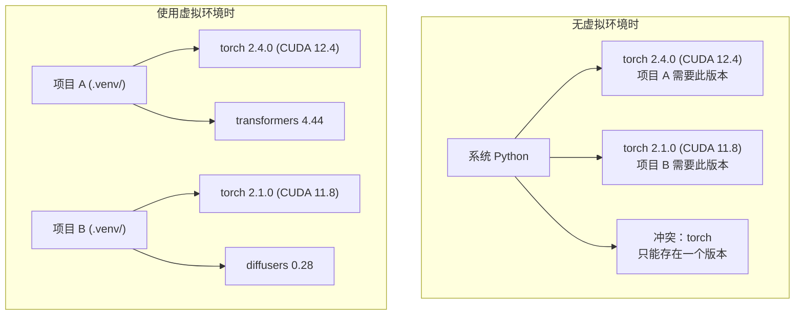

# Python 环境

> 依赖地狱是真实存在的。虚拟环境是解决方案。

**类型:** 构建  
**语言:** Shell  
**先决条件:** 第0阶，课程01  
**时间:** 约30分钟

## 学习目标

- 使用 `uv`、`venv` 或 `conda` 创建隔离的虚拟环境（virtual environments 虚拟环境）
- 编写带有可选依赖组的 `pyproject.toml` 并生成锁文件（lockfiles 锁文件）以保证可重复性
- 诊断并修复常见陷阱：全局安装、pip/conda 混用、CUDA 版本不匹配
- 为依赖冲突的项目实现按阶段划分的环境策略

## 问题描述

你为微调项目安装了 PyTorch 2.4。下周，另一个项目需要 PyTorch 2.1，因为它的 CUDA 构建被固定了版本。你在全局升级，结果第一个项目崩溃了。你降级，全局又导致第二个项目崩溃。

这就是依赖地狱。这种情况在 AI/ML 工作中经常发生，因为：

- PyTorch、JAX 和 TensorFlow 都附带各自的 CUDA 绑定
- 模型库固定了特定的框架版本
- 全局运行 `pip install` 会覆盖之前的安装
- CUDA 11.8 构建不能与 CUDA 12.x 驱动兼容（反之亦然）

解决方案：每个项目都有自己的隔离环境和专属包。

## 概念



## 构建它

### 选项1：uv venv（推荐）

`uv` 是最快的Python包管理工具（比 pip 快10到100倍）。它集成了虚拟环境管理、Python版本及依赖解析。

```bash
curl -LsSf https://astral.sh/uv/install.sh | sh

uv python install 3.12

cd your-project
uv venv
source .venv/bin/activate
```

安装包：

```bash
uv pip install torch numpy
```

一键创建带 `pyproject.toml` 的项目：

```bash
uv init my-ai-project
cd my-ai-project
uv add torch numpy matplotlib
```

### 选项2：venv（内置）

如果不能安装 `uv`，Python 自带了 `venv`：

```bash
python3 -m venv .venv
source .venv/bin/activate  # Linux/macOS
.venv\Scripts\activate     # Windows

pip install torch numpy
```

比 `uv` 慢，但在任何安装了 Python 的地方都可用。

### 选项3：conda（需要时使用）

Conda 管理非Python依赖，如 CUDA 工具包、cuDNN 和 C 库。当你：

- 需要指定版本的 CUDA 工具包但不想全局安装时
- 处于无法安装系统包的共享集群环境
- 某些库安装说明要求“使用 conda”

```bash
# 安装 miniconda（非完整 Anaconda）
curl -LsSf https://repo.anaconda.com/miniconda/Miniconda3-latest-Linux-x86_64.sh -o miniconda.sh
bash miniconda.sh -b

conda create -n myproject python=3.12
conda activate myproject

conda install pytorch torchvision torchaudio pytorch-cuda=12.4 -c pytorch -c nvidia
```

一条规则：如果某个环境使用了 conda，就用 conda 管理该环境内的所有包。混用 `pip install` 会导致依赖冲突，难以调试。

### 本课程策略：按阶段环境划分

你可以为整个课程创建一个环境，但不要这么做。不同阶段需要不同（有时冲突的）依赖。

策略示例：

```text
ai-engineering-from-scratch/
├── .venv/                    <-- 0-3阶共享轻量环境
├── phases/
│   ├── 04-neural-networks/
│   │   └── .venv/            <-- PyTorch 环境
│   ├── 05-cnns/
│   │   └── .venv/            <-- 相同 PyTorch 环境（符号链接或共享）
│   ├── 08-transformers/
│   │   └── .venv/            <-- 可能需要不同版本的 Transformer
│   └── 11-llm-apis/
│       └── .venv/            <-- API SDK，无需 torch
```

`code/env_setup.sh` 脚本会创建本课程的基础环境。

## pyproject.toml 基础

每个 Python 项目都应有 `pyproject.toml`。它取代了 `setup.py`、`setup.cfg` 和 `requirements.txt`，集成在一个文件中。

```toml
[project]
name = "ai-engineering-from-scratch"
version = "0.1.0"
requires-python = ">=3.11"
dependencies = [
    "numpy>=1.26",
    "matplotlib>=3.8",
    "jupyter>=1.0",
    "scikit-learn>=1.4",
]

[project.optional-dependencies]
torch = ["torch>=2.3", "torchvision>=0.18"]
llm = ["anthropic>=0.39", "openai>=1.50"]
```

安装命令：

```bash
uv pip install -e ".[torch]"    # 基础 + PyTorch
uv pip install -e ".[llm]"      # 基础 + LLM SDK
uv pip install -e ".[torch,llm]" # 全部
```

## 锁文件（Lockfiles）

锁文件锁定每个依赖及其传递依赖的具体版本，确保可重复安装：任何人使用锁文件安装都会得到相同的包版本。

```bash
# 使用 uv add 自动生成 uv.lock
uv add numpy

# pip-tools 方式
uv pip compile pyproject.toml -o requirements.lock
uv pip install -r requirements.lock
```

将锁文件提交到 git。别人克隆仓库，安装时会根据锁文件一致安装。

## 常见错误

### 1. 全局安装

```bash
pip install torch  # 错误：安装到系统 Python

source .venv/bin/activate
pip install torch  # 正确：安装到虚拟环境
```

检查包安装位置：

```bash
which python       # 应显示 .venv/bin/python，而非 /usr/bin/python
which pip          # 应显示 .venv/bin/pip
```

### 2. pip 与 conda 混用

```bash
conda create -n myenv python=3.12
conda activate myenv
conda install pytorch -c pytorch
pip install some-other-package   # 错误：可能破坏 conda 依赖管理
conda install some-other-package # 正确：让 conda 管理所有包
```

如确实需在 conda 环境用 pip（部分包仅 pip 提供），先安装所有 conda 包，再安装 pip 包。

### 3. 忘记激活环境

```bash
python train.py           # 使用系统 Python，缺少包
source .venv/bin/activate
python train.py           # 使用项目 Python，包加载成功
```

终端提示符应显示环境名称：

```text
(.venv) $ python train.py
```

### 4. 提交 .venv 到 git

```bash
echo ".venv/" >> .gitignore
```

虚拟环境占用 200MB-2GB，是本地私有不可跨机器移植，提交 `pyproject.toml` 和锁文件即可。

### 5. CUDA 版本不匹配

```bash
nvidia-smi                # 显示驱动 CUDA 版本，如 12.4
python -c "import torch; print(torch.version.cuda)"  # 显示 PyTorch CUDA 版本

# 两者必须兼容。
# PyTorch CUDA 版本必须 <= 驱动 CUDA 版本。
```

## 使用方法

运行安装脚本创建课程环境：

```bash
bash phases/00-setup-and-tooling/06-python-environments/code/env_setup.sh
```

该脚本将在仓库根目录创建 `.venv`，安装并验证核心依赖。

## 练习

1. 运行 `env_setup.sh` 并确认所有检查通过  
2. 创建第二个虚拟环境，安装不同版本的 numpy，确认两个环境隔离  
3. 编写一个同时需要 PyTorch 和 Anthropic SDK 的项目 `pyproject.toml`  
4. 故意不激活环境全局安装一个包，注意它安装位置，然后卸载它  

## 关键术语

| 术语 | 人们的说法 | 实际含义 |
|------|------------|----------|
| 虚拟环境（Virtual environment） | “一个 venv” | 包含 Python 解释器和包的独立目录，隔离于系统 Python |
| 锁文件（Lockfile） | “固定依赖” | 列出每个包及其精确版本的文件，确保多机器安装一致 |
| pyproject.toml | “新的 setup.py” | 标准 Python 项目配置文件，取代 setup.py/setup.cfg/requirements.txt |
| 传递依赖（Transitive dependency） | “依赖的依赖” | 包 B 依赖包 C；安装 A 时，A 依赖 B，B 依赖 C，那么 C 是 A 的传递依赖 |
| CUDA 版本不匹配（CUDA mismatch） | “我的 GPU 不工作” | PyTorch 编译的是另一版本 CUDA，与 GPU 驱动的 CUDA 不兼容 |
