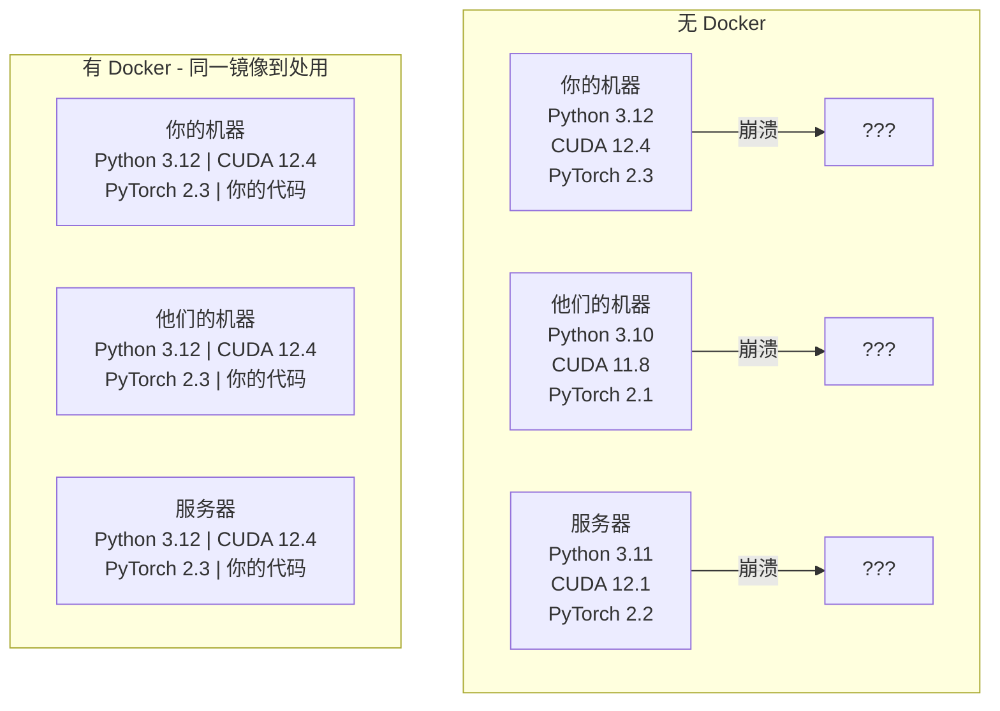

# Docker 用于 AI

> 容器让“在我机器上能运行”成为过去式。

**类型：** 构建  
**语言：** Docker  
**先决条件：** 阶段 0，课程 01 和 03  
**时间：** 约 60 分钟

## 学习目标

- 从 Dockerfile 构建带有 CUDA、PyTorch 和 AI 库的 GPU 版 Docker 镜像
- 挂载主机目录为卷以在容器重建间持久化模型、数据集和代码
- 配置 NVIDIA Container Toolkit（NVIDIA 容器工具包）以在容器内部暴露 GPU
- 使用 Docker Compose 协同管理多服务 AI 应用（推理服务器 + 向量数据库）

## 问题描述

你在笔记本电脑上用 PyTorch 2.3、CUDA 12.4 和 Python 3.12 训练了模型。你的同事有 PyTorch 2.1、CUDA 11.8 和 Python 3.10。你的模型在他们机器上崩溃。你的 Dockerfile 可以在两台机器上运行。

AI 项目是依赖的噩梦。典型栈包括 Python、PyTorch、CUDA 驱动、cuDNN、系统级 C 库，以及像 flash-attn 这种需要精确编译器版本的特殊包。Docker 将所有这些打包成一个统一镜像，在任意环境中表现一致。

## 概念

Docker 将代码、运行时、库和系统工具封装到一个隔离的单元中，称为容器。可以把它看作轻量级虚拟机，但它共享宿主操作系统内核，而不是运行自己的内核，因此启动时间是秒级而非分钟级。



### 为什么 AI 项目比其他更需要 Docker

1. **GPU 驱动脆弱。** CUDA 12.4 代码在 CUDA 11.8 上无法运行。Docker 在容器内隔离 CUDA 工具包，同时通过 NVIDIA Container Toolkit 共享宿主 GPU 驱动。

2. **模型权重庞大。** 一个 7B 参数模型在 fp16 下约 14GB。你不想每次重建都重新下载。Docker 卷允许你挂载主机模型目录。

3. **多服务架构普遍。** 真正的 AI 应用不仅仅是 Python 脚本，而是推理服务器、用于 RAG 的向量数据库，可能还有 Web 前端。Docker Compose 用一个命令协同管理这所有服务。

### 关键词汇

| 术语 | 含义 |
|------|------|
| Image（镜像） | 一个只读模板。你的配方。由 Dockerfile 构建。 |
| Container（容器） | 镜像的运行实例。你的厨房。 |
| Dockerfile | 构建镜像的指令。逐层构建。 |
| Volume（卷） | 容器重启后依然持久的存储。 |
| docker-compose | 用 YAML 定义多容器应用的工具。 |

### AI 中常见的容器模式

```text
开发容器（Dev Container）
  全套工具。编辑器支持。Jupyter。调试工具。
  用于开发和实验。

训练容器（Training Container）
  极简。只有训练脚本和依赖。
  运行于 GPU 集群。无编辑器，无 Jupyter。

推理容器（Inference Container）
  优化服务。镜像小。启动快。
  生产中通常部署于负载均衡后面。
```

## 构建它

### 第 1 步：安装 Docker

```bash
# macOS
brew install --cask docker
open /Applications/Docker.app

# Ubuntu
curl -fsSL https://get.docker.com | sh
sudo usermod -aG docker $USER
# 退出登录后重新登录使组更改生效
```

验证：

```bash
docker --version
docker run hello-world
```

### 第 2 步：安装 NVIDIA Container Toolkit（带 NVIDIA GPU 的 Linux）

该步骤让 Docker 容器访问 GPU。macOS 和 Windows（WSL2）用户可跳过，Docker Desktop 在这些平台上以不同方式处理 GPU 直通。

```bash
distribution=$(. /etc/os-release;echo $ID$VERSION_ID)
curl -fsSL https://nvidia.github.io/libnvidia-container/gpgkey | sudo gpg --dearmor -o /usr/share/keyrings/nvidia-container-toolkit-keyring.gpg
curl -s -L https://nvidia.github.io/libnvidia-container/$distribution/libnvidia-container.list | \
    sed 's#deb https://#deb [signed-by=/usr/share/keyrings/nvidia-container-toolkit-keyring.gpg] https://#g' | \
    sudo tee /etc/apt/sources.list.d/nvidia-container-toolkit.list

sudo apt-get update
sudo apt-get install -y nvidia-container-toolkit
sudo nvidia-ctk runtime configure --runtime=docker
sudo systemctl restart docker
```

测试容器内的 GPU 访问：

```bash
docker run --rm --gpus all nvidia/cuda:12.4.1-base-ubuntu22.04 nvidia-smi
```

若看到 GPU 信息，则工具包安装成功。

### 第 3 步：了解基础镜像

选对基础镜像能节省大量调试时间。

```text
nvidia/cuda:12.4.1-devel-ubuntu22.04
  全套 CUDA 工具包，包括编译器。
  用于：构建需要 nvcc 的包（flash-attn，bitsandbytes）
  大小：约 4 GB

nvidia/cuda:12.4.1-runtime-ubuntu22.04
  只有 CUDA 运行时，无编译器。
  用于：运行预构建代码
  大小：约 1.5 GB

pytorch/pytorch:2.3.1-cuda12.4-cudnn9-runtime
  CUDA 上预装 PyTorch。
  用于：跳过 PyTorch 安装步骤
  大小：约 6 GB

python:3.12-slim
  无 CUDA，仅 CPU。
  用于：CPU 推理，轻量工具
  大小：约 150 MB
```

### 第 4 步：编写 AI 开发用 Dockerfile

下面是 `code/Dockerfile` 中的 Dockerfile，逐步讲解：

```dockerfile
FROM nvidia/cuda:12.4.1-devel-ubuntu22.04

ENV DEBIAN_FRONTEND=noninteractive
ENV PYTHONUNBUFFERED=1

RUN apt-get update && apt-get install -y --no-install-recommends \
    python3.12 \
    python3.12-venv \
    python3.12-dev \
    python3-pip \
    git \
    curl \
    build-essential \
    && rm -rf /var/lib/apt/lists/*

RUN update-alternatives --install /usr/bin/python python /usr/bin/python3.12 1

RUN python -m pip install --no-cache-dir --upgrade pip setuptools wheel

RUN python -m pip install --no-cache-dir \
    torch==2.3.1 \
    torchvision==0.18.1 \
    torchaudio==2.3.1 \
    --index-url https://download.pytorch.org/whl/cu124

RUN python -m pip install --no-cache-dir \
    numpy \
    pandas \
    scikit-learn \
    matplotlib \
    jupyter \
    transformers \
    datasets \
    accelerate \
    safetensors

WORKDIR /workspace

VOLUME ["/workspace", "/models"]

EXPOSE 8888

CMD ["python"]
```

构建镜像：

```bash
docker build -t ai-dev -f phases/00-setup-and-tooling/07-docker-for-ai/code/Dockerfile .
```

首次构建较慢（下载 CUDA 基础镜像和 PyTorch）。后续构建使用缓存层。

运行镜像：

```bash
docker run --rm -it --gpus all \
    -v $(pwd):/workspace \
    -v ~/models:/models \
    ai-dev python -c "import torch; print(f'PyTorch {torch.__version__}, CUDA: {torch.cuda.is_available()}')"
```

在容器中运行 Jupyter：

```bash
docker run --rm -it --gpus all \
    -v $(pwd):/workspace \
    -v ~/models:/models \
    -p 8888:8888 \
    ai-dev jupyter notebook --ip=0.0.0.0 --port=8888 --no-browser --allow-root
```

### 第 5 步：为数据和模型挂载卷

卷挂载对于 AI 工作至关重要。不挂载时，你的 14 GB 模型下载在容器停止后会消失。

```bash
# 挂载代码目录
-v $(pwd):/workspace

# 挂载共享模型目录
-v ~/models:/models

# 挂载数据集目录
-v ~/datasets:/data
```

在训练脚本中从挂载路径加载：

```python
from transformers import AutoModel

model = AutoModel.from_pretrained("/models/llama-7b")
```

模型存放在主机文件系统中。容器可随意重建而无需重复下载。

### 第 6 步：用 Docker Compose 管理多服务 AI 应用

一个真正的 RAG 应用需要推理服务器和向量数据库。Docker Compose 用一条命令启动两者。

查看 `code/docker-compose.yml` 文件：

```yaml
services:
  ai-dev:
    build:
      context: .
      dockerfile: Dockerfile
    deploy:
      resources:
        reservations:
          devices:
            - driver: nvidia
              count: all
              capabilities: [gpu]
    volumes:
      - ../../../:/workspace
      - ~/models:/models
      - ~/datasets:/data
    ports:
      - "8888:8888"
    stdin_open: true
    tty: true
    command: jupyter notebook --ip=0.0.0.0 --port=8888 --no-browser --allow-root

  qdrant:
    image: qdrant/qdrant:v1.12.5
    ports:
      - "6333:6333"
      - "6334:6334"
    volumes:
      - qdrant_data:/qdrant/storage

volumes:
  qdrant_data:
```

启动服务：

```bash
cd phases/00-setup-and-tooling/07-docker-for-ai/code
docker compose up -d
```

现在你的 AI 开发容器可以通过服务名 `http://qdrant:6333` 访问向量数据库。Docker Compose 会自动创建共享网络。

在 AI 容器内测试连接：

```python
from qdrant_client import QdrantClient

client = QdrantClient(host="qdrant", port=6333)
print(client.get_collections())
```

停止所有服务：

```bash
docker compose down
```

加 `-v` 会同时删除 qdrant 数据卷：

```bash
docker compose down -v
```

### 第 7 步：AI 工作常用 Docker 命令

```bash
# 列出运行中的容器
docker ps

# 列出所有镜像及大小
docker images

# 删除未使用的镜像（释放磁盘空间）
docker system prune -a

# 查看运行中容器的 GPU 使用情况
docker exec -it <container_id> nvidia-smi

# 从容器复制文件到主机
docker cp <container_id>:/workspace/results.csv ./results.csv

# 查看容器日志
docker logs -f <container_id>
```

## 使用方法

你目前拥有一个可复现的 AI 开发环境。在本课程余下章节：

- 使用 `docker compose up` 同时启动开发环境和向量数据库
- 将代码、模型和数据挂载为卷，避免重建时丢失
- 课程需要新 Python 包时，在 Dockerfile 中添加并重建
- 将 Dockerfile 分享给团队成员，确保环境完全一致

### 没有 GPU？

去掉 `--gpus all` 参数和 NVIDIA 相关部署段。容器仍然支持基于 CPU 的课程，PyTorch 会自动检测无 CUDA 情况并退回 CPU。

## 练习

1. 构建 Dockerfile 并在容器内运行 `python -c "import torch; print(torch.__version__)"`  
2. 启动 docker-compose 栈，验证 AI 容器可访问 `http://qdrant:6333/collections` 中的 Qdrant  
3. 将 `flask` 添加至 Dockerfile，重建镜像，在端口 5000 上运行简单 API 服务器，用 `-p 5000:5000` 映射端口  
4. 用 `docker images` 查看镜像大小，尝试把基础镜像由 `devel` 改为 `runtime` 并比较大小差异

## 关键词

| 术语 | 常见说法 | 实际含义 |
|------|---------|----------|
| Container（容器） | “轻量级虚拟机” | 使用宿主内核的隔离进程，拥有独立文件系统和网络 |
| Image layer（镜像层） | “缓存步骤” | Dockerfile 每条指令形成一个层，不变层被缓存，重建快 |
| NVIDIA Container Toolkit | “Docker 里的 GPU” | 运行时钩子，通过 `--gpus` 选项暴露宿主 GPU 给容器 |
| Volume mount（卷挂载） | “共享文件夹” | 挂载主机目录到容器，数据变化容器停止后依然保留 |
| Base image（基础镜像） | “起点镜像” | Dockerfile 以此为起点构建，决定预装的环境内容 |
