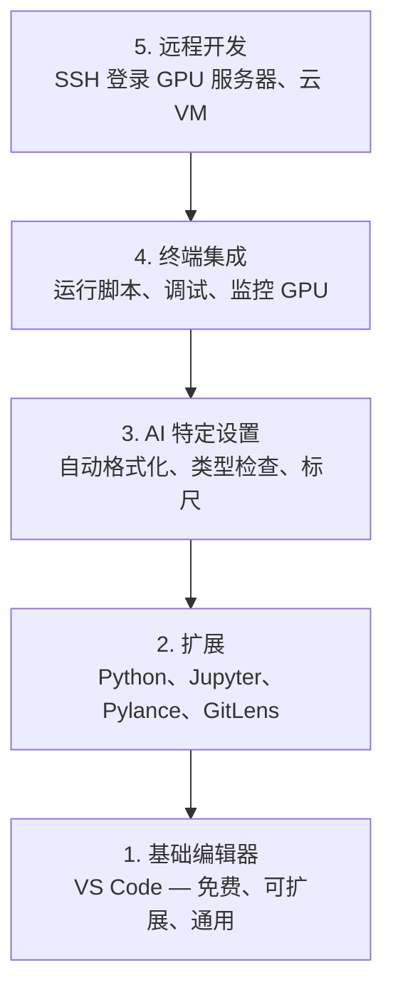

# 编辑器设置

> 你的编辑器是你的副驾驶。配置一次，让它远离你的干扰，开始发挥作用。

**类型：** 构建  
**语言：** --  
**先决条件：** 第0阶段，第01课  
**时间：** ~20分钟

## 学习目标

- 安装带有 Python、Jupyter、代码规范检查（linting）和远程 SSH 关键扩展的 VS Code  
- 配置保存时格式化、类型检查和笔记本输出滚动以支持 AI 工作流  
- 设置远程 SSH，像本地一样编辑和调试远程 GPU 机器上的代码  
- 评估编辑器替代方案（Cursor、Windsurf、Neovim）及其在 AI 工作中的权衡  

## 问题所在

你将在编辑器里花费数千小时编写 Python、运行笔记本、调试训练循环，以及通过 SSH 登录 GPU 服务器。配置错误的编辑器会让每次使用都充满阻力：没有自动补全，没有类型提示，没有内联错误，格式化全得手动，终端工作流程笨重。

正确的配置只需20分钟，跳过它每天都会让你多耗费20分钟。

## 概念

AI 工程编辑器设置需要五个要素：



## 搭建步骤

### 第1步：安装 VS Code

推荐使用 VS Code 编辑器。它是免费的、跨平台的、支持一流的 Jupyter 笔记本，并且扩展生态系统涵盖了 AI 工作所需的所有内容。

从 [code.visualstudio.com](https://code.visualstudio.com/) 下载。

在终端验证：

```bash
code --version
```

如果在 macOS 上找不到 `code` 命令，打开 VS Code，按 `Cmd+Shift+P`，输入 “Shell Command”，选择 “Install 'code' command in PATH”。

### 第2步：安装必备扩展

在 VS Code 中打开集成终端（`Ctrl+`` ` 或 `Cmd+`` `），安装 AI 工作必备扩展：

```bash
code --install-extension ms-python.python
code --install-extension ms-python.vscode-pylance
code --install-extension ms-toolsai.jupyter
code --install-extension eamodio.gitlens
code --install-extension ms-vscode-remote.remote-ssh
code --install-extension ms-python.debugpy
code --install-extension ms-python.black-formatter
code --install-extension charliermarsh.ruff
```

各扩展作用：

| 扩展 | 作用 |
|------|------|
| Python | 语言支持、虚拟环境检测、运行与调试 |
| Pylance | 快速类型检查、自动补全、导入解析 |
| Jupyter | 在 VS Code 内运行笔记本、变量浏览器 |
| GitLens | 查看代码变更作者、内联 git 责备信息 |
| Remote SSH | 以本地方式打开远程 GPU 机器上的文件夹 |
| Debugpy | Python 单步调试 |
| Black Formatter | 保存时自动格式化、风格统一 |
| Ruff | 快速代码规范检查，捕获常见错误 |

本课中的 `code/.vscode/extensions.json` 文件包含完整推荐列表。打开项目文件夹时，VS Code 会提示安装它们。

### 第3步：配置设置

复制本课的 `code/.vscode/settings.json` 文件中的设置，或通过 `Settings > Open Settings (JSON)` 手动应用。

AI 工作的关键设置：

```jsonc
{
    "python.analysis.typeCheckingMode": "basic",
    "editor.formatOnSave": true,
    "editor.rulers": [88, 120],
    "notebook.output.scrolling": true,
    "files.autoSave": "afterDelay"
}
```

设置重要原因：

- **基础类型检查**：运行前捕获错误参数类型。节省因张量形状错误和错误 API 参数的调试时间。  
- **保存时格式化**：再也不用担心格式化问题，Black 自动完成。  
- **标尺设置在 88 和 120**：Black 默认在88字符换行，120字符标尺显示文档字符串和注释是否过长。  
- **笔记本输出滚动**：训练循环打印成千上万行，没有滚动输出面板会炸开。  
- **自动保存**：你会忘记手动保存，训练脚本会运行过时代码，自动保存避免此问题。

### 第4步：终端集成

VS Code 的集成终端是运行训练脚本、监控 GPU 和管理环境的地方。

正确配置：

```jsonc
{
    "terminal.integrated.defaultProfile.osx": "zsh",
    "terminal.integrated.defaultProfile.linux": "bash",
    "terminal.integrated.fontSize": 13,
    "terminal.integrated.scrollback": 10000
}
```

实用快捷键：

| 操作 | macOS | Linux/Windows |
|------|-------|--------------|
| 切换终端 | `` Ctrl+` `` | `` Ctrl+` `` |
| 新建终端 | `Ctrl+Shift+`` ` | `Ctrl+Shift+`` ` |
| 分屏终端 | `Cmd+\` | `Ctrl+\` |

分屏终端很有用：一个运行脚本，一个用 `nvidia-smi -l 1` 或 `watch -n 1 nvidia-smi` 监控 GPU。

### 第5步：远程开发（远程 SSH 登录 GPU 机器）

这是 AI 工作最重要的扩展。你将在远程机器（云 VM、实验室服务器、Lambda、Vast.ai）上运行训练。远程 SSH 让你打开远程文件系统、编辑文件、运行终端和调试，就像本地一样。

设置步骤：

1. 安装远程 SSH 扩展（第2步已完成）。  
2. 按 `Ctrl+Shift+P`（或 `Cmd+Shift+P`），输入 “Remote-SSH: Connect to Host”。  
3. 输入 `user@your-gpu-box-ip`。  
4. VS Code 会自动在远程机器上安装服务器组件。

设置免密码访问，配置 SSH 密钥：

```bash
ssh-keygen -t ed25519 -C "your-email@example.com"
ssh-copy-id user@your-gpu-box-ip
```

为方便起见，将主机添加到 `~/.ssh/config`：

```text
Host gpu-box
    HostName 203.0.113.50
    User ubuntu
    IdentityFile ~/.ssh/id_ed25519
    ForwardAgent yes
```

之后使用 `Remote-SSH: Connect to Host > gpu-box` 立即连接。

## 替代方案

### Cursor

[cursor.com](https://cursor.com) 是基于 VS Code 的分支，内置 AI 代码生成，使用相同扩展生态和设置格式。使用 Cursor 时，本课所有配置仍适用。导入相同的 `settings.json` 和 `extensions.json` 即可。

### Windsurf

[windsurf.com](https://windsurf.com) 另一款 AI 优先的 VS Code 分支。情况类似：相同扩展示例，相同设置格式，同样支持远程 SSH。

### Vim/Neovim

若你已经使用 Vim 或 Neovim 并且高效，可以继续使用。AI Python 工作的最低配置如下：

- **pyright** 或 **pylsp** 用于类型检查（通过 Mason 或手动安装）  
- **nvim-lspconfig** 用于语言服务器集成  
- **jupyter-vim** 或 **molten-nvim** 提供类似笔记本的执行体验  
- **telescope.nvim** 用于文件/符号搜索  
- **none-ls.nvim** 并配合 black 和 ruff 进行格式化和代码规范检查  

如果你还没用 Vim，现阶段不要开始。学习曲线和学习 AI 工程竞争，推荐使用 VS Code。

## 使用指南

有此配置后，你的日常工作流如下：

1. 在 VS Code 中打开项目文件夹（或通过远程 SSH 连接到 GPU 机器）。  
2. 在编辑器里编写 Python，享受自动补全、类型提示和内联错误。  
3. 使用 Jupyter 扩展内联运行 Jupyter 笔记本。  
4. 利用集成终端运行训练脚本、`uv pip install` 命令和 GPU 监控。  
5. 使用 GitLens 审查变更，再提交代码。

## 练习

1. 安装 VS Code 及第2步中列出的所有扩展  
2. 将本课的 `settings.json` 复制到 VS Code 配置目录  
3. 打开一个 Python 文件，验证 Pylance 显示类型提示，Black 在保存时自动格式化  
4. 如果有远程机器权限，设置远程 SSH，打开远程文件夹  

## 关键术语

| 术语 | 俗称 | 实际含义 |
|-------|------|----------|
| LSP | “自动补全引擎” | 语言服务器协议：编辑器通过它从语言服务器获得类型信息、补全和诊断的标准 |
| Pylance | “Python 插件” | 微软的 Python 语言服务器，使用 Pyright 进行类型检查和 IntelliSense |
| Remote SSH | “在服务器上工作” | VS Code 扩展，在远程机器运行轻量服务器并将 UI 流式传输至本地编辑器 |
| Format on save | “自动 Prettier” | 编辑器每次保存运行格式化工具（Black、Ruff），自动保持代码风格一致 |
