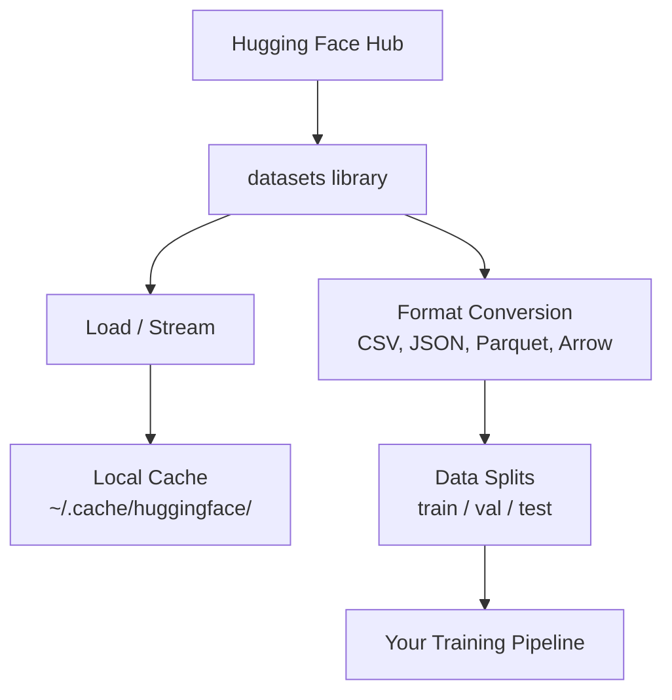

# 数据管理

> 数据是燃料。你如何管理它决定了你的速度。

**类型：** 构建  
**语言：** Python  
**先决条件：** 第0阶段，第01课  
**时间：** 约45分钟

## 学习目标

- 使用 Hugging Face `datasets` 库加载、流式传输和缓存数据集  
- 在 CSV、JSON、Parquet 和 Arrow 格式之间转换，并解释它们的权衡  
- 使用固定随机种子创建可复现的训练/验证/测试分割  
- 使用 `.gitignore`、Git LFS 或 DVC 管理大型模型和数据集文件  

## 问题

每个AI项目都从数据开始。你需要寻找数据集，下载它们，在格式之间转换，分割用于训练和评估，并进行版本控制以确保实验可复现。每次手动操作既慢又容易出错。你需要一套可重复的工作流程。

## 概念



Hugging Face `datasets`（数据集）库是加载AI工作数据的标准方式。它开箱即用地处理下载、缓存、格式转换和流式传输。

## 实践操作

### 步骤1：安装 datasets 库

```bash
pip install datasets huggingface_hub
```

### 步骤2：加载数据集

```python
from datasets import load_dataset

dataset = load_dataset("imdb")
print(dataset)
print(dataset["train"][0])
```

这会下载IMDB电影评论数据集。首次下载后，它会从 `~/.cache/huggingface/datasets/` 缓存中加载。

### 步骤3：流式传输大型数据集

某些数据集太大，无法全部存储在磁盘中。流式传输会逐行加载，而不下载整个数据集。

```python
dataset = load_dataset("wikimedia/wikipedia", "20220301.en", split="train", streaming=True)

for i, example in enumerate(dataset):
    print(example["title"])
    if i >= 4:
        break
```

流式传输会给你一个 `IterableDataset`（可迭代数据集）。你可以在数据到达时逐行处理，内存占用保持恒定，与数据集大小无关。

### 步骤4：数据集格式

`datasets` 库底层使用 Apache Arrow（Apache Arrow格式）。你可以根据管线需求转换为其他格式。

```python
dataset = load_dataset("imdb", split="train")

dataset.to_csv("imdb_train.csv")
dataset.to_json("imdb_train.json")
dataset.to_parquet("imdb_train.parquet")
```

格式比较：

| 格式    | 大小   | 读取速度 | 适用场景                            |
|---------|--------|----------|-----------------------------------|
| CSV     | 大     | 慢       | 人类可读性、电子表格               |
| JSON    | 大     | 慢       | API，嵌套数据                     |
| Parquet | 小     | 快       | 分析，列存查询                     |
| Arrow   | 小     | 最快     | 内存处理（`datasets` 内部使用）  |

对于AI工作，Parquet是最佳存储格式。Arrow用于内存中处理。CSV和JSON用于数据交换。

### 步骤5：数据分割

每个机器学习项目都需要三份分割：

- **训练集（Train）**：模型学习的部分（通常占80%）  
- **验证集（Validation）**：训练中检查模型进展（通常占10%）  
- **测试集（Test）**：训练完成后的最终评估（通常占10%）  

有些数据集自带分割，无分割时自己划分：

```python
dataset = load_dataset("imdb", split="train")

split = dataset.train_test_split(test_size=0.2, seed=42)
train_val = split["train"].train_test_split(test_size=0.125, seed=42)

train_ds = train_val["train"]
val_ds = train_val["test"]
test_ds = split["test"]

print(f"Train: {len(train_ds)}, Val: {len(val_ds)}, Test: {len(test_ds)}")
```

务必设置种子以确保复现。同一个种子每次产生相同分割。

### 步骤6：下载和缓存模型

模型文件很大，`huggingface_hub` 库负责下载和缓存。

```python
from huggingface_hub import hf_hub_download, snapshot_download

model_path = hf_hub_download(
    repo_id="sentence-transformers/all-MiniLM-L6-v2",
    filename="config.json"
)
print(f"Cached at: {model_path}")

model_dir = snapshot_download("sentence-transformers/all-MiniLM-L6-v2")
print(f"Full model at: {model_dir}")
```

模型缓存位置在 `~/.cache/huggingface/hub/`。下载后，下次运行加载迅速。

### 步骤7：处理大文件

模型权重和大型数据集不应直接放入 git。三种方案：

**选项A：.gitignore（最简单）**

```text
*.bin
*.safetensors
*.pt
*.onnx
data/*.parquet
data/*.csv
models/
```

**选项B：Git LFS（在 git 中跟踪大文件）**

```bash
git lfs install
git lfs track "*.bin"
git lfs track "*.safetensors"
git add .gitattributes
```

Git LFS在你的仓库中存储指针，实际文件存放在独立服务器。GitHub免费赠送1GB空间。

**选项C：DVC（数据版本控制）**

```bash
pip install dvc
dvc init
dvc add data/training_set.parquet
git add data/training_set.parquet.dvc data/.gitignore
git commit -m "Track training data with DVC"
```

DVC创建指向数据的 `.dvc` 小文件。数据本体存储在S3、GCS或其他远程存储后端。

| 方案       | 复杂度 | 适用场景                 |
|-----------|--------|--------------------------|
| .gitignore | 低     | 个人项目、可重新下载数据 |
| Git LFS   | 中     | 团队通过git共享模型权重  |
| DVC       | 高     | 可复现实验、大型数据集、团队 |

本课程只需用`.gitignore`即可。需要跨机器复现实验时用DVC。

### 步骤8：存储方案

**本地存储**适合10 GB以下数据集，HF缓存自动完成。

**云存储**用于更大数据或跨机器共享：

```python
import os

local_path = os.path.expanduser("~/.cache/huggingface/datasets/")

# s3_path = "s3://my-bucket/datasets/"
# gcs_path = "gs://my-bucket/datasets/"
```

DVC直接集成S3和GCS：

```bash
dvc remote add -d myremote s3://my-bucket/dvc-store
dvc push
```

本课程中本地存储足够。远程GPU实例微调时云存储才重要。

## 本课程使用的数据集

| 数据集         | 课程             | 大小     | 教学内容             |
|----------------|------------------|----------|----------------------|
| IMDB           | 分词、分类       | 84 MB    | 文本分类基础         |
| WikiText       | 语言建模         | 181 MB   | 下一个词预测         |
| SQuAD          | 问答系统         | 35 MB    | 问答与文本片段       |
| Common Crawl（子集） | 嵌入           | 大小不定 | 大规模文本处理       |
| MNIST          | 视觉基础         | 21 MB    | 图像分类基础         |
| COCO（子集）    | 多模态           | 大小不定 | 图文对               |

你无需现在下载全部。每课会说明所需数据。

## 使用方法

运行工具脚本验证一切是否正常：

```bash
python code/data_utils.py
```

它会下载小型数据集，转换格式，分割数据并打印摘要。

## 交付成果

本课产出：
- `code/data_utils.py` - 可复用的数据加载和缓存工具  
- `outputs/prompt-data-helper.md` - 用于寻找合适数据集的提示  

## 练习

1. 使用 `mrpc` 配置加载 `glue` 数据集，查看前5条示例  
2. 流式传输 `c4` 数据集，统计10秒内能处理的样本数  
3. 转换数据集为 Parquet 格式，并与 CSV 文件大小比较  
4. 用固定种子创建70/15/15的训练/验证/测试分割，验证大小  

## 关键词

| 术语        | 人们的说法       | 实际含义                                 |
|-------------|------------------|------------------------------------------|
| Dataset split（数据集分割） | “训练数据”       | 不同期机器学习生命周期阶段使用的子集（训练/验证/测试） |
| Streaming（流式传输）      | “懒加载”        | 不下载完整数据，边远程分批加载处理           |
| Parquet（Parquet格式）     | “压缩CSV”       | 针对分析查询和存储优化的列式文件格式         |
| Arrow（Arrow格式）         | “快速数据帧”     | datasets库内部使用的零拷贝内存列式格式       |
| Git LFS（Git LFS扩展）    | “大文件git化”   | 存储大文件在git外，但在版本控制中保留指针     |
| DVC（DVC数据版本控制）    | “数据的git”     | 支持云存储集成的数据集和模型版本控制系统      |
| Cache（缓存）              | “已下载数据”    | 之前下载数据的本地副本，默认存储在 ~/.cache/huggingface/  |
