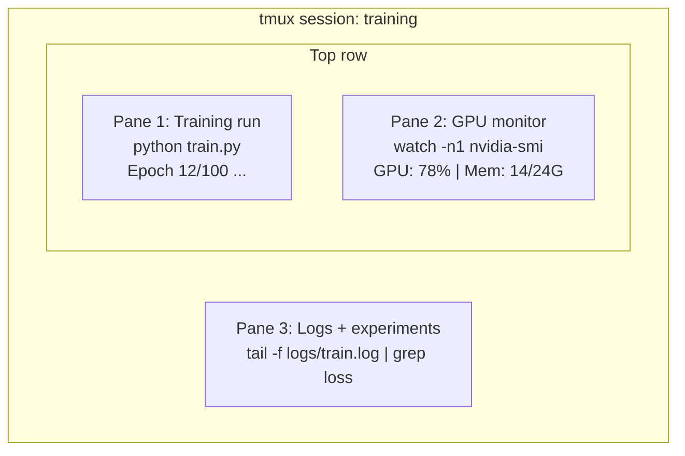

# Terminal & Shell（终端与 Shell）

> 终端（terminal）是 AI 工程师的工作场所。要让自己在这里如鱼得水。

**类型：** 学习  
**语言：** --  
**先决条件：** 第 0 阶段，第 01 课  
**时长：** ~35 分钟

## 学习目标

- 在命令行中使用管道（piping）、重定向（redirects）和 `grep` 来过滤与处理训练日志
- 使用 tmux 创建包含多个面板的持久化会话，以便同时进行训练与显卡监控
- 使用 `htop`、`nvtop` 和 `nvidia-smi` 监控系统与 GPU 资源
- 通过 SSH、`scp`、`rsync` 实现本地与远程机器间的文件传输

## 问题描述

你花在终端（terminal）里的时间会比任何编辑器都多。训练运行、GPU 监控、日志查看、远程 SSH 会话、环境管理，每个 AI 工作流都离不开 shell。如果你在这里效率低，你在任何地方都快不起来。

本节课涵盖了 AI 工作最重要的终端技能。不讲 Unix 历史，不深究 Bash 脚本，只学你需要的。

## 核心概念



三项任务同时运行。一个终端。你可以分离（detach）会话，回家，SSH 回连接，再恢复（reattach）。训练进程持续运行不中断。

## 实践操作

### 步骤 1：了解你的 shell

检查你当前使用的 shell：

```bash
echo $SHELL
```

大多数系统默认是 `bash` 或 `zsh`，都能正常工作。本课程中的命令两者皆适用。

必备知识：

```bash
# 跳转目录
cd ~/projects/ai-engineering-from-scratch
pwd
ls -la

# 历史命令搜索（你会用到的最实用快捷键）
# Ctrl+R，然后输入部分命令内容
# 再按一次 Ctrl+R 可循环查找

# 清屏
clear   # 或 Ctrl+L

# 取消正在运行的命令
# Ctrl+C

# 挂起正在运行的命令（用 fg 恢复）
# Ctrl+Z
```

### 步骤 2：管道与重定向

管道（piping）将命令连接起来。这是你处理日志、过滤输出、链式调用工具的方式，你会不断用到它。

```bash
# 统计日志中 "loss" 出现的次数
cat train.log | grep "loss" | wc -l

# 从训练输出中提取 loss 值
grep "loss:" train.log | awk '{print $NF}' > losses.txt

# 实时查看日志更新，并仅过滤错误
tail -f train.log | grep --line-buffered "ERROR"

# 按最终准确率排序实验
grep "final_accuracy" results/*.log | sort -t= -k2 -n -r

# 将标准输出和标准错误分别重定向到不同文件
python train.py > output.log 2> errors.log

# 将二者都重定向到同一个文件
python train.py > train_full.log 2>&1
```

三种常用重定向符号：

| 符号 | 作用 |
|--------|-------------|
| `>` | 将标准输出写入文件（覆盖原文件） |
| `>>` | 追加标准输出到文件 |
| `2>` | 将标准错误写入文件 |
| `2>&1` | 将标准错误发送到与标准输出相同的位置 |
| `|` | 将上一个命令的标准输出作为下一个命令的标准输入 |

### 步骤 3：后台进程

训练通常需要几个小时。你不会想一直开着终端（terminal）。

```bash
# 后台运行（输出仍显示在终端）
python train.py &

# 后台运行，抗挂断（关闭终端不会被杀掉）
nohup python train.py > train.log 2>&1 &

# 查看正在后台运行的任务
jobs
ps aux | grep train.py

# 将后台任务转到前台
fg %1

# 杀掉后台进程
kill %1
# 或查找其 PID 再杀掉
kill $(pgrep -f "train.py")
```

`&`、`nohup`、`screen`/`tmux` 的区别：

| 方法 | 能否在终端关闭后存活？ | 能否重新连接？ |
|--------|-------------------------|---------------|
| `command &` | 否 | 否 |
| `nohup command &` | 是 | 否（查看日志文件） |
| `screen` / `tmux` | 是 | 是 |

超过几分钟的工作，都建议用 tmux。

### 步骤 4：tmux

tmux 可以创建带有多个面板的持久化终端会话。这是管理训练任务最强大的工具之一。

```bash
# 安装
# macOS
brew install tmux
# Ubuntu
sudo apt install tmux

# 新建一个有名会话
tmux new -s training

# 横向分屏
# Ctrl+B 然后 "

# 纵向分屏
# Ctrl+B 然后 %

# 面板切换
# Ctrl+B 然后方向键

# 分离会话（训练继续运行）
# Ctrl+B 然后 d

# 重新连接
tmux attach -t training

# 列出所有会话
tmux ls

# 杀掉一个会话
tmux kill-session -t training
```

典型的 AI 工作流会话：

```bash
tmux new -s train

# 面板1：开始训练
python train.py --epochs 100 --lr 1e-4

# Ctrl+B, " 横向分屏，运行 GPU 监控
watch -n1 nvidia-smi

# Ctrl+B, % 纵向分屏，查看日志
tail -f logs/experiment.log

# 现在用 Ctrl+B, d 分离会话
# 退出 SSH，去歇会，回来后
# tmux attach -t train
```

### 步骤 5：使用 htop 和 nvtop 进行监控

```bash
# 查看系统进程（比 top 更好用）
htop

# 查看 GPU 进程（适用于 NVIDIA GPU）
# 安装：sudo apt install nvtop（Ubuntu）或 brew install nvtop（macOS）
nvtop

# 无 nvtop 时的简易 GPU 查看
nvidia-smi

# 实时刷新 GPU 使用率
watch -n1 nvidia-smi

# 查看哪些进程正在使用 GPU
nvidia-smi --query-compute-apps=pid,name,used_memory --format=csv
```

`htop` 常用快捷键：
- `F6` 或 `>` 按列排序（内存排序可查内存泄漏）
- `F5` 切换树视图（看子进程）
- `F9` 杀进程
- `/` 搜索进程名

### 步骤 6：远程 GPU 主机使用 SSH

当你租用云端 GPU（如 Lambda、RunPod、Vast.ai），你需要通过 SSH 连接。

```bash
# 基本连接
ssh user@gpu-box-ip

# 指定密钥连接
ssh -i ~/.ssh/my_gpu_key user@gpu-box-ip

# 文件上传到远程
scp model.pt user@gpu-box-ip:~/models/

# 文件从远程下载
scp user@gpu-box-ip:~/results/metrics.json ./

# 同步整个目录（适合大量文件）
rsync -avz ./data/ user@gpu-box-ip:~/data/

# 端口转发（在本地访问远程 Jupyter/TensorBoard）
ssh -L 8888:localhost:8888 user@gpu-box-ip
# 浏览器打开 localhost:8888

# SSH 配置简化
# 添加到 ~/.ssh/config：
# Host gpu
#     HostName 192.168.1.100
#     User ubuntu
#     IdentityFile ~/.ssh/gpu_key
#
# 之后只需：
# ssh gpu
```

### 步骤 7：AI 工作者常用 alias（别名）

将以下内容加到你的 `~/.bashrc` 或 `~/.zshrc`：

```bash
source phases/00-setup-and-tooling/10-terminal-and-shell/code/shell_aliases.sh
```

或拷贝你需要的别名。以下是关键别名：

```bash
# 一键查看 GPU 状态
alias gpu='nvidia-smi --query-gpu=index,name,utilization.gpu,memory.used,memory.total,temperature.gpu --format=csv,noheader'

# 杀死所有 Python 训练进程
alias killtraining='pkill -f "python.*train"'

# 快速激活虚拟环境（virtual environment）
alias ae='source .venv/bin/activate'

# 实时看训练 loss
alias watchloss='tail -f logs/*.log | grep --line-buffered "loss"'
```

完整别名请见 `code/shell_aliases.sh`。

### 步骤 8：常见 AI 终端模式

这些模式在实践中经常出现：

```bash
# 训练并记录日志，完成时邮件提醒
python train.py 2>&1 | tee train.log; echo "DONE" | mail -s "Training complete" you@email.com

# 并排比较两个实验日志的准确率
diff <(grep "accuracy" exp1.log) <(grep "accuracy" exp2.log)

# 找出体积最大的模型文件（清理磁盘）
find . -name "*.pt" -o -name "*.safetensors" | xargs du -h | sort -rh | head -20

# 从 Hugging Face 下载模型
wget https://huggingface.co/model/resolve/main/model.safetensors

# 解压数据集
tar xzf dataset.tar.gz -C ./data/

# 统计所有 Python 文件的代码行数（看项目规模）
find . -name "*.py" | xargs wc -l | tail -1

# 检查磁盘空间（训练数据很快填满磁盘）
df -h
du -sh ./data/*

# 训练前检查环境变量
env | grep -i cuda
env | grep -i torch
```

## 应用场景

以下是本课程各工具的使用时机：

| 工具 | 使用时机 |
|------|----------------|
| tmux | 每次训练运行（第 3 阶段及以后） |
| `tail -f` + `grep` | 监控训练日志 |
| `nohup` / `&` | 快速后台任务 |
| `htop` / `nvtop` | 调试训练慢、OOM 错误 |
| SSH + `rsync` | 云端 GPU 工作 |
| 管道 + 重定向 | 实验结果处理 |
| 别名（Aliases） | 重复命令节省时间 |

## 练习

1. 安装 tmux，新建 1 个三分屏会话，在 1 个面板运行 `htop`，另一个运行 `watch -n1 date`，第三个运行 Python 脚本。分离并重新连接会话。
2. 将 `code/shell_aliases.sh` 文件里的别名加入 shell 配置，重新加载 `source ~/.zshrc`（或 `~/.bashrc`）。
3. 用命令 `for i in $(seq 1 100); do echo "epoch $i loss: $(echo "scale=4; 1/$i" | bc)"; sleep 0.1; done > fake_train.log` 生成伪训练日志；再用 `grep`、`tail`、`awk` 等提取 loss 数值。
4. 配置 SSH config，给可用服务器（或用 `localhost` 练习语法）创建条目。

## 关键术语

| 术语 | 常用说法 | 实际含义 |
|------|----------------|----------------------|
| Shell | “the terminal” | 解释命令的程序（如 bash、zsh、fish） |
| tmux | “terminal multiplexer（终端多路复用器）” | 能在一个窗口内运行多个终端会话，可分离/再连接 |
| Pipe（管道） | “the bar thing” | 即 `|` 运算符，将一个命令的输出作为另一个的输入 |
| PID | “process ID（进程号）” | 系统中分配给每个进程的唯一编号，用于监控或杀死进程 |
| nohup | “no hangup（不挂断）” | 使命令免疫挂断信号，关闭终端不会杀掉它 |
| SSH | “connecting to the server（连服务器）” | Secure Shell，一种加密协议，可在远程主机运行命令 |
