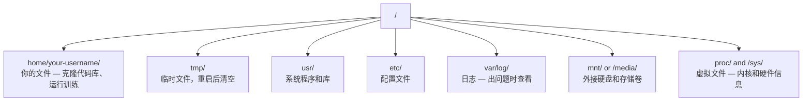

# AI 的 Linux 基础

> 大多数 AI 运行在 Linux 上。你需要掌握足够多的知识以避免卡壳。

**类型：** 学习
**编程语言：** 无
**先决条件：** 第 0 阶段，第 01 课
**时间：** ~30 分钟

## 学习目标

- 在命令行下浏览 Linux 文件系统并进行基本文件操作
- 使用 `chmod` 和 `chown` 管理文件权限，解决 “Permission denied（权限拒绝）” 错误
- 通过 `apt` 安装系统包，并为 AI 工作配置一台全新的 GPU 服务器
- 识别 macOS 与 Linux 之间易让开发者在远程机器上踩坑的差异

## 问题背景

你平时在 macOS 或 Windows 上开发。但当你 SSH 进入云端 GPU 服务器、租用 Lambda 实例或启动一台 EC2 机器时，你就进入了 Ubuntu 环境。终端成为你唯一的界面。没有 Finder，没有资源管理器（Explorer），没有 GUI。如果你不能在命令行下导航文件系统、安装软件包和管理进程，你就只能为空闲的 GPU 付费，同时百度“如何在 Linux 下解压文件”。

这是一份“生存手册”。它涵盖了你作为 AI 从业者在远程 Linux 机器上工作的所需基础技能，仅此而已。

## 文件系统结构

Linux 将一切都放在一个根目录 `/` 下。没有 `C:\` 或 `/Volumes`。你实际会用到的目录有：



你的主目录是 `~` 或 `/home/your-username`。几乎所有操作都在这里完成。

## 基本命令

下面这 15 个命令覆盖了你在远程 GPU 服务器上 95% 的操作。

### 路径与目录切换

```bash
pwd                         # 我在哪里？（显示当前目录）
ls                          # 这里有什么？
ls -la                      # 这里有什么？包含隐藏文件和详细信息
cd /path/to/dir             # 进入指定目录
cd ~                        # 回到主目录
cd ..                       # 返回上一级目录
```

### 文件与目录操作

```bash
mkdir my-project            # 创建一个目录
mkdir -p a/b/c              # 一次创建多级目录

cp file.txt backup.txt      # 复制文件
cp -r src/ src-backup/      # 复制目录（递归）

mv old.txt new.txt          # 重命名文件
mv file.txt /tmp/           # 移动文件

rm file.txt                 # 删除文件（无回收站，无法恢复）
rm -rf my-dir/              # 删除目录及其所有内容
```

`rm -rf` 是永久删除。无法撤销。按下回车前请仔细检查路径。

### 文件阅读

```bash
cat file.txt                # 输出整个文件内容
head -20 file.txt           # 查看前 20 行
tail -20 file.txt           # 查看后 20 行
tail -f log.txt             # 实时跟踪日志（Ctrl+C 停止）
less file.txt               # 分页浏览文件（q 退出）
```

### 搜索

```bash
grep "error" training.log           # 查找包含 "error" 的行
grep -r "learning_rate" .           # 在当前目录下所有文件中搜索
grep -i "cuda" config.yaml          # 忽略大小写搜索

find . -name "*.py"                 # 查找当前目录下所有 Python 文件
find . -name "*.ckpt" -size +1G     # 查找大于 1GB 的 checkpoint 文件
```

## 权限（Permissions）

Linux 中每个文件都有所有者和权限位。当脚本无法执行或目录无法写入时，通常就是遇到了权限问题。

```bash
ls -l train.py
# -rwxr-xr-- 1 user group 2048 Mar 19 10:00 train.py
#  ^^^             所有者权限：读，写，执行
#     ^^^          用户组权限：读，执行
#        ^^        其他人权限：只读
```

常用修复方法：

```bash
chmod +x train.sh           # 让脚本可执行
chmod 755 deploy.sh         # 所有者：全部权限，其他用户：读+执行
chmod 644 config.yaml       # 所有者：读+写，其他用户：只读

chown user:group file.txt   # 更改文件的所有者（需要 sudo）
```

出现 “Permission denied（权限拒绝）” 报错时，绝大多数是权限设置问题。多用 `chmod +x` 或 `sudo` 可以解决绝大多数情况。

## 软件包管理（apt）

Ubuntu 使用 `apt` 进行系统软件管理。你可以用它安装系统级软件包。

```bash
sudo apt update             # 刷新软件包列表（务必先做这步）
sudo apt install -y htop    # 安装软件包（-y 跳过确认）
sudo apt install -y build-essential  # C 编译器、make 等，许多 Python 模块依赖
sudo apt install -y tmux    # 终端多路复用器（断开后保留会话）

apt list --installed        # 已安装了什么？
sudo apt remove htop        # 卸载
```

新 GPU 服务器常用的基础包如下：

```bash
sudo apt update && sudo apt install -y \
    build-essential \
    git \
    curl \
    wget \
    tmux \
    htop \
    unzip \
    python3-venv
```

## 用户与 sudo

你通常以普通用户身份登录。部分操作需要 root（管理员）权限。

```bash
whoami                      # 当前用户名
sudo command                # 以 root 权限运行单条命令
sudo su                     # 切换为 root 用户（exit 退出，谨慎使用）
```

在云端 GPU 实例上，你通常是唯一用户并拥有 sudo 权限。不要所有操作都用 root，只在必要时用 sudo。

## 进程与 systemd

当你的训练进程卡住，或需要查看当前运行状况时：

```bash
htop                        # 交互式进程查看器（q 退出）
ps aux | grep python        # 查找正在运行的 Python 进程
kill 12345                  # 通过进程号优雅停止进程
kill -9 12345               # 强制杀死进程（当普通 kill 无效时使用）
nvidia-smi                  # 查看 GPU 进程和显存占用
```

systemd 管理系统服务（后台守护进程）。如果你要运行推理服务器时会用到它：

```bash
sudo systemctl start nginx          # 启动服务
sudo systemctl stop nginx           # 停止服务
sudo systemctl restart nginx        # 重启服务
sudo systemctl status nginx         # 查看服务运行状态
sudo systemctl enable nginx         # 开机自启动
```

## 磁盘空间

GPU 服务器的磁盘通常有限。模型和数据集很快会占满空间。

```bash
df -h                       # 查看所有挂载硬盘的空间使用情况
df -h /home                 # 查看 /home 的磁盘占用

du -sh *                    # 查看当前目录下每个项目的大小
du -sh ~/.cache             # 查看你的 cache（缓存）占用（pip、huggingface 模型也在这里）
du -sh /data/checkpoints/   # 检查 checkpoint 文件有多大

# 查找最大空间占用者
du -h --max-depth=1 / 2>/dev/null | sort -hr | head -20
```

常见的磁盘瘦身方法：

```bash
# 清除 pip 缓存
pip cache purge

# 清除 apt 缓存
sudo apt clean

# 删除不需要的老 checkpoint
rm -rf checkpoints/epoch_01/ checkpoints/epoch_02/
```

## 网络相关

你将通过命令行下载模型、传输文件、调用 API。

```bash
# 下载文件
wget https://example.com/model.bin                   # 下载文件
curl -O https://example.com/data.tar.gz              # 用 curl 下载文件
curl -s https://api.example.com/health | python3 -m json.tool  # 请求 API 并美化打印 JSON

# 机器间传输文件
scp model.bin user@remote:/data/                     # 上传文件到远程服务器
scp user@remote:/data/results.csv .                  # 从远程下载文件到本地
scp -r user@remote:/data/checkpoints/ ./local-dir/   # 下载目录

# 目录同步（大量文件建议用 rsync，支持断点续传）
rsync -avz --progress ./data/ user@remote:/data/
rsync -avz --progress user@remote:/results/ ./results/
```

大体积文件请优先用 `rsync` 而不是 `scp`。`rsync` 只传变化过的数据，且能在中断后恢复。

## tmux：保持会话持续在线

当你通过 SSH 远程连接，如果电脑合上或网络中断，训练进程会被杀掉。tmux 能避免这种情况。

```bash
tmux new -s train           # 创建新的 tmux 会话，命名为 "train"
# ... 启动你的训练，然后：
# Ctrl+B, 然后 D            # 分离会话（训练会在后台继续）

tmux ls                     # 列出所有会话
tmux attach -t train        # 重新连接到指定会话

# 在 tmux 内部：
# Ctrl+B, 然后 %            # 竖直分割窗口
# Ctrl+B, 然后 "            # 水平分割窗口
# Ctrl+B, 然后方向键        # 在各个窗口间切换
```

所有长时间训练任务，请务必放在 tmux 会话内运行。

## WSL2 给 Windows 用户

如果你用 Windows，WSL2 可让你不用双系统就获得完整 Linux 环境。

```bash
# PowerShell（管理员权限）下执行
wsl --install -d Ubuntu-24.04

# 重启后，从开始菜单启动 Ubuntu
sudo apt update && sudo apt upgrade -y
```

WSL2 运行真实 Linux 内核。本课内容全部适用。你的 Windows 文件可在 WSL 内通过 `/mnt/c/Users/YourName/` 访问。

GPU 直通（passthrough）在 Windows 侧安装了 NVIDIA 驱动后可用。请安装 Windows 下的 NVIDIA 驱动（不是 Linux 驱动），CUDA 功能即可在 WSL2 内使用。

## 踩坑提示：macOS 与 Linux 差异

如果你从 macOS 迁移到 Linux，以下是常见坑点：

| macOS | Linux | 备注 |
|-------|-------|-------|
| `brew install` | `sudo apt install` | 部分软件包名称不同。`brew install htop` 和 `sudo apt install htop` 都能安装，但 `brew install readline` 和 `sudo apt install libreadline-dev` 不一样。|
| `open file.txt` | `xdg-open file.txt` | 但远程服务器没 GUI。用 `cat` 或 `less` 替代。|
| `pbcopy` / `pbpaste` | 不支持 | 不能像本地一样操作剪切板（Clipboard）。|
| `~/.zshrc` | `~/.bashrc` | macOS 默认 zsh，大多数 Linux 用 bash。|
| `/opt/homebrew/` | `/usr/bin/`, `/usr/local/bin/` | 可执行文件位置不同。|
| `sed -i '' 's/a/b/' file` | `sed -i 's/a/b/' file` | macOS 下 `sed -i` 需配空字符串，Linux 不需要。|
| 大小写不敏感文件系统 | 大小写敏感文件系统 | Linux 下 `Model.py` 和 `model.py` 是不同文件。|
| 换行符 `\n` | 换行符 `\n` | 两者相同。但 Windows 用 `\r\n`，会导致 bash 脚本失效。可用 `dos2unix` 修正。|

## 快速速查卡

```text
导航:         pwd, ls, cd, find
文件:         cp, mv, rm, mkdir, cat, head, tail, less
搜索:         grep, find
权限:         chmod, chown, sudo
安装包:       apt update, apt install
进程:         htop, ps, kill, nvidia-smi
服务:         systemctl start/stop/restart/status
磁盘:         df -h, du -sh
网络:         curl, wget, scp, rsync
会话:         tmux new/attach/detach
```

## 练习

1. SSH 到任意 Linux 机器（或打开 WSL2），导航到主目录，创建一个项目文件夹；使用 `touch` 命令在其中创建 3 个空文件，用 `ls -la` 列出来。
2. 用 apt 安装 `htop`，运行它，查找占用内存最多的进程。
3. 启动一个 tmux 会话，在里面运行 `sleep 300`，分离后列出现有会话，并重新连接。
4. 用 `df -h` 检查磁盘剩余空间，再用 `du -sh ~/.cache/*` 找出 cache（缓存）里占用空间最多的内容。
5. 用 `scp` 从本机传一个文件到远程，然后再用 `rsync` 做同样的传输，对比体验过程。
