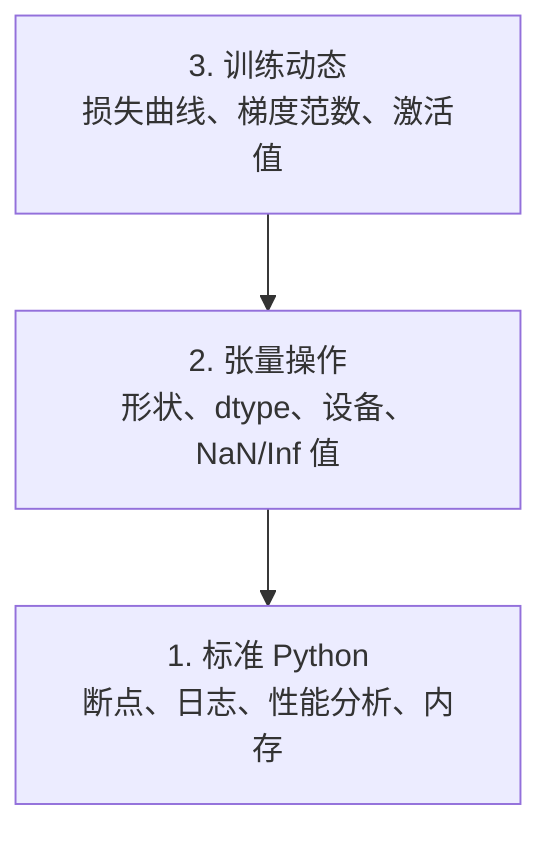

# 调试与性能分析

> 最糟糕的 AI（人工智能）bug（缺陷）不会崩溃。它们在“垃圾”上悄悄训练，还能输出一条漂亮的 loss（损失）曲线。

**类型：** Build（实践）
**语言：** Python
**先决条件：** 第1课（开发环境）、基础 PyTorch 熟悉度
**时间：** ~60 分钟

## 学习目标

- 使用条件 `breakpoint()` 和 `debug_print`，在训练中途检查张量（tensor）的 shape（形状）、dtype（数据类型）和 NaN（非数值）值
- 用 `cProfile`、`line_profiler` 和 `tracemalloc` 对训练循环进行性能分析，定位瓶颈
- 识别常见 AI 缺陷：形状不匹配、NaN 损失、数据泄漏、张量设备错误
- 配置 TensorBoard（TensorBoard 可视化工具），可视化损失曲线、权重直方图、梯度分布

## 问题描述

AI 代码的失败方式与普通代码不同。Web 应用崩溃会有堆栈回溯，而配置错误的训练循环可能会运行 8 小时，烧掉 $200 的 GPU 费用，最终只得到一个始终输出均值的模型。代码从没报错。bug 是张量在错误设备上、忘记了 `.detach()`，或标签泄漏到了特征中。

你需要能在浪费时间和算力之前捕捉这些“静默”失败的调试工具。

## 基本概念

AI 调试分为三个层级：



大多数人一上来就跳到了第3层（盯着 TensorBoard 看）。但 80% 的 AI bugs 都藏在第1和第2层。

## 实践指南

### 第1部分：Print 调试（真的有用）

Print 调试经常被忽视，但其实很有效。对于张量代码来说，有针对性的 print 语句，远胜于逐步调试，因为你需要一次性看到 shape（形状）、dtype（数据类型）、value range（值范围）。

```python
def debug_print(name, tensor):
    print(f"{name}: shape={tensor.shape}, dtype={tensor.dtype}, "
          f"device={tensor.device}, "
          f"min={tensor.min().item():.4f}, max={tensor.max().item():.4f}, "
          f"mean={tensor.mean().item():.4f}, "
          f"has_nan={tensor.isnan().any().item()}")
```

在每个可疑操作后调用它。发现问题后删掉 print 即可。很简单。

### 第2部分：Python 调试器（pdb 和 breakpoint）

内置调试器在 AI 工作中被低估了。你可以把 `breakpoint()` 插入到训练循环里，交互式检查张量。

```python
def training_step(model, batch, criterion, optimizer):
    inputs, labels = batch
    outputs = model(inputs)
    loss = criterion(outputs, labels)

    if loss.item() > 100 or torch.isnan(loss):
        breakpoint()

    loss.backward()
    optimizer.step()
```

进入调试器时，有用的命令：

- `p outputs.shape` 查看张量形状
- `p loss.item()` 查看损失值
- `p torch.isnan(outputs).sum()` 统计 NaN 数量
- `p model.fc1.weight.grad` 查看梯度
- `c` 继续执行，`q` 退出调试器

这就是条件调试。只有有异常时才中断。对 10,000 步训练过程来说，这很重要。

### 第3部分：Python Logging（日志记录）

当你的调试超出一次性 print 时，用 logging 替换 print。

```python
import logging

logging.basicConfig(
    level=logging.INFO,
    format="%(asctime)s [%(levelname)s] %(message)s",
    handlers=[
        logging.FileHandler("training.log"),
        logging.StreamHandler()
    ]
)
logger = logging.getLogger(__name__)

logger.info("Starting training: lr=%.4f, batch_size=%d", lr, batch_size)
logger.warning("Loss spike detected: %.4f at step %d", loss.item(), step)
logger.error("NaN loss at step %d, stopping", step)
```

日志提供时间戳、严重级别和文件输出。当训练在凌晨 3 点崩溃时，你需要日志文件，而不是一闪而过的终端输出。

### 第4部分：代码计时

知道时间花在哪里，是优化的第一步。

```python
import time

class Timer:
    def __init__(self, name=""):
        self.name = name

    def __enter__(self):
        self.start = time.perf_counter()
        return self

    def __exit__(self, *args):
        elapsed = time.perf_counter() - self.start
        print(f"[{self.name}] {elapsed:.4f}s")

with Timer("data loading"):
    batch = next(dataloader_iter)

with Timer("forward pass"):
    outputs = model(batch)

with Timer("backward pass"):
    loss.backward()
```

常见发现：数据加载占训练时间 60%。解决办法是在 DataLoader（数据加载器）里设置 `num_workers > 0`，而不是换更快的 GPU。

### 第5部分：cProfile 和 line_profiler

当你需要超越手动计时时：

```bash
python -m cProfile -s cumtime train.py
```

这会显示每个函数调用，按累计时间排序。逐行性能分析：

```bash
pip install line_profiler
```

```python
@profile
def train_step(model, data, target):
    output = model(data)
    loss = F.cross_entropy(output, target)
    loss.backward()
    return loss

# 用命令运行：kernprof -l -v train.py
```

### 第6部分：内存分析

#### 用 tracemalloc 分析 CPU 内存

```python
import tracemalloc

tracemalloc.start()

# 你的代码
model = build_model()
data = load_dataset()

snapshot = tracemalloc.take_snapshot()
top_stats = snapshot.statistics("lineno")
for stat in top_stats[:10]:
    print(stat)
```

#### 用 memory_profiler 分析 CPU 内存

```bash
pip install memory_profiler
```

```python
from memory_profiler import profile

@profile
def load_data():
    raw = read_csv("data.csv")       # 观察这里的内存变化
    processed = preprocess(raw)       # 这里也是
    return processed
```

运行 `python -m memory_profiler your_script.py` 以逐行查看内存使用。

#### 用 PyTorch 分析 GPU 内存

```python
import torch

if torch.cuda.is_available():
    print(torch.cuda.memory_summary())

    print(f"Allocated: {torch.cuda.memory_allocated() / 1e9:.2f} GB")
    print(f"Cached: {torch.cuda.memory_reserved() / 1e9:.2f} GB")
```

当你遇到 OOM（Out of Memory，内存溢出）时：

1. 减小 batch size（首先尝试，几乎总有用）
2. 用 `torch.cuda.empty_cache()` 释放缓存内存
3. 对大型中间变量先 `del tensor`，再用 `torch.cuda.empty_cache()`
4. 用混合精度训练（`torch.cuda.amp`）节省一半内存
5. 对极深的模型用梯度检查点（gradient checkpointing）

### 第7部分：常见 AI 缺陷及捕捉方法

#### 形状不匹配

最常见的 bug。张量形状为 `[batch, features]`，但模型期待 `[batch, channels, height, width]`。

```python
def check_shapes(model, sample_input):
    print(f"Input: {sample_input.shape}")
    hooks = []

    def make_hook(name):
        def hook(module, inp, out):
            in_shape = inp[0].shape if isinstance(inp, tuple) else inp.shape
            out_shape = out.shape if hasattr(out, "shape") else type(out)
            print(f"  {name}: {in_shape} -> {out_shape}")
        return hook

    for name, module in model.named_modules():
        hooks.append(module.register_forward_hook(make_hook(name)))

    with torch.no_grad():
        model(sample_input)

    for h in hooks:
        h.remove()
```

用一个样本 batch 跑一遍。它会映射出模型里每一层的形状变化。

#### NaN 损失

NaN 损失通常意味着数值爆炸。常见原因：

- 学习率过高
- 自定义损失函数中有除零
- 对零或负数取对数
- RNNs（循环神经网络）中梯度爆炸

```python
def detect_nan(model, loss, step):
    if torch.isnan(loss):
        print(f"NaN loss at step {step}")
        for name, param in model.named_parameters():
            if param.grad is not None:
                if torch.isnan(param.grad).any():
                    print(f"  NaN gradient in {name}")
                if torch.isinf(param.grad).any():
                    print(f"  Inf gradient in {name}")
        return True
    return False
```

#### 数据泄漏

模型在测试集上得到 99% 准确度。听起来很好？其实是 bug。

```python
def check_data_leakage(train_set, test_set, id_column="id"):
    train_ids = set(train_set[id_column].tolist())
    test_ids = set(test_set[id_column].tolist())
    overlap = train_ids & test_ids
    if overlap:
        print(f"DATA LEAKAGE: {len(overlap)} samples in both train and test")
        return True
    return False
```

还要检查时间泄漏：用未来数据预测过去。拆分前按时间戳排序。

#### 张量设备错误

不同设备（CPU vs GPU）上的张量会报错。但有时某个张量悄悄停留在 CPU 上，其余都在 GPU 上，训练会很慢且不报错。

```python
def check_devices(model, *tensors):
    model_device = next(model.parameters()).device
    print(f"Model device: {model_device}")
    for i, t in enumerate(tensors):
        if t.device != model_device:
            print(f"  WARNING: tensor {i} on {t.device}, model on {model_device}")
```

### 第8部分：TensorBoard（TensorBoard 可视化工具）基础

TensorBoard 能显示训练过程中的各种变化。

```bash
pip install tensorboard
```

```python
from torch.utils.tensorboard import SummaryWriter

writer = SummaryWriter("runs/experiment_1")

for step in range(num_steps):
    loss = train_step(model, batch)

    writer.add_scalar("loss/train", loss.item(), step)
    writer.add_scalar("lr", optimizer.param_groups[0]["lr"], step)

    if step % 100 == 0:
        for name, param in model.named_parameters():
            writer.add_histogram(f"weights/{name}", param, step)
            if param.grad is not None:
                writer.add_histogram(f"grads/{name}", param.grad, step)

writer.close()
```

启动方式：

```bash
tensorboard --logdir=runs
```

观察重点：

- **Loss 不下降**：学习率太低，或模型结构有问题
- **Loss 剧烈震荡**：学习率太高
- **Loss 变为 NaN**：数值不稳定（见 NaN 部分）
- **训练损失下降，验证损失上升**：过拟合
- **权重直方图塌缩到零**：梯度消失
- **梯度直方图爆炸**：需要梯度裁剪

### 第9部分：VS Code（VS Code 调试器）

若需交互式调试，在 VS Code 里配置 `launch.json`：

```json
{
    "version": "0.2.0",
    "configurations": [
        {
            "name": "Debug Training",
            "type": "debugpy",
            "request": "launch",
            "program": "${file}",
            "console": "integratedTerminal",
            "justMyCode": false
        }
    ]
}
```

点编辑器左侧的行号（gutter）设置断点。用 Variables（变量面板） 检查张量属性。Debug Console（调试控制台）可在执行中运行任意 Python 表达式。

尤其适合逐步检查数据预处理流水线的每一步。

## 实战流程

这是捕获大多数 AI bugs 的调试工作流：

1. **训练前**：用样本 batch 跑 `check_shapes`，确保输入输出尺寸一致。
2. **前10步**：用 `debug_print` 检查损失、输出、梯度。确认无 NaN，且数值合理。
3. **训练中**：记录损失、学习率和梯度范数。用 TensorBoard 可视化。
4. **出错时**：在出错点插入 `breakpoint()`，交互式检查张量。
5. **性能调优时**：计时数据加载、前向、反向。接近 OOM 时分析内存。

## 流程交付

运行调试工具脚本：

```bash
python phases/00-setup-and-tooling/12-debugging-and-profiling/code/debug_tools.py
```

`outputs/prompt-debug-ai-code.md` 提供了帮助诊断 AI 特有 bug 的提示。

## 练习

1. 运行 `debug_tools.py`，仔细阅读每一部分的输出。修改 dummy model（演示模型），在 forward（前向）中引入 NaN（提示：做一次除零），观察检测机制如何捕捉它。
2. 用 `cProfile` 对训练循环性能分析，找出最慢的函数。
3. 用 `tracemalloc` 找出数据加载管道内存分配最多的代码行。
4. 配置 TensorBoard，跑一个简单训练，并判断模型是否过拟合。
5. 在训练循环里用 `breakpoint()`，练习在调试器中检查张量的形状、设备以及梯度值。
