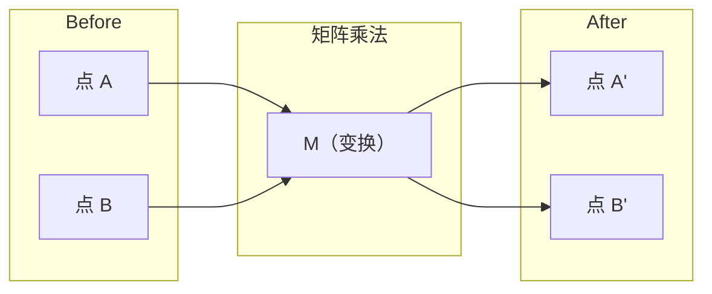
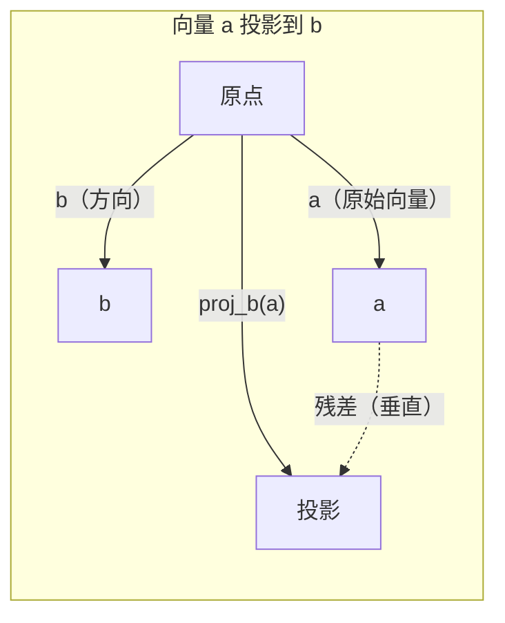

# 线性代数直觉

> 每个 AI 模型不过是戴着花哨帽子的矩阵数学。

**类型：** 学习  
**语言：** Python, Julia  
**先决条件：** 阶段 0  
**时长：** ~60 分钟

## 学习目标

- 从头用 Python 实现向量和矩阵操作（加法、点积、矩阵乘法）
- 几何上解释点积、投影和 Gram-Schmidt 过程的作用
- 使用行简化确定向量集合的线性无关性、秩和基
- 将线性代数概念与其在 AI 中的应用连接起来：嵌入（embedding）、注意力分数（attention scores）和 LoRA

## 问题背景

打开任何 ML 论文，在第一页你就会看到向量、矩阵、点积和变换。没有线性代数直觉，这些只是符号。有了它，你便能看到神经网络实际上在做什么——在空间中移动点。

你不需要成为数学家。你需要理解这些操作的几何意义，然后自己编写代码实现。

## 概念解析

### 向量是点（和方向）

向量只是数字的列表。但这些数字有意义——它们是空间中的坐标。

**二维向量 [3, 2]:**

| x | y | 点 |
|---|---|-------------|
| 3 | 2 | 这个向量指向平面上从原点 (0,0) 到 (3, 2) 的位置 |

该向量的大小是 sqrt(3^2 + 2^2) = sqrt(13)，方向向上且向右。

在 AI 中，向量代表一切：  
- 一个词 → 一个含 768 个数字的向量（其嵌入空间中的“意义”）  
- 一张图片 → 一个包含数百万像素值的向量  
- 一个用户 → 一个偏好向量

### 矩阵是变换

矩阵将一个向量变换成另一个向量。它可以旋转、缩放、拉伸或投影。



在 AI 中，矩阵就是模型：  
- 神经网络权重 → 用矩阵将输入变换为输出  
- 注意力分数 → 用矩阵决定关注什么  
- 嵌入 → 用矩阵将词映射为向量

### 点积衡量相似度

两个向量的点积告诉你它们有多相似。

```text
a · b = a₁×b₁ + a₂×b₂ + ... + aₙ×bₙ

同方向：      a · b > 0  （相似）
垂直：        a · b = 0  （无关）
相反方向：    a · b < 0  （不相似）
```

这就是搜索引擎、推荐系统和 RAG 工作的基本原理——寻找点积高的向量。

### 线性无关性

若集合中的任何向量都不能用其它向量的组合表示，则这些向量是线性无关的。如果 v1、v2、v3 线性无关，它们张成三维空间。如果其中一个是其它向量的组合，则它们只能张成一个平面。

对 AI 而言重要的原因：你的特征矩阵应有线性无关的列。如果两个特征完全相关（线性相关），模型无法区分它们的影响。这会导致回归中的多重共线性——权重矩阵变得不稳定，输入的小变化会导致输出剧烈波动。

**具体例子：**

```text
v1 = [1, 0, 0]
v2 = [0, 1, 0]
v3 = [2, 1, 0]   # v3 = 2*v1 + v2
```

v1 和 v2 是线性无关的——彼此都不是对方的标量倍数或组合。v3 = 2*v1 + v2，因此 {v1, v2, v3} 是线性相关的。 这三个向量都位于 xy 平面内。不论怎样组合，它们都不能到达 [0, 0, 1]。你有三个向量，但只有两个自由维度。

在数据集中：如果 feature_3 = 2*feature_1 + feature_2，加入 feature_3 不会给模型带来任何新信息。更糟的是，它会使正规方程奇异——权重的解不唯一。

### 基和秩

基是张成整个空间的最小线性无关向量集合。基向量的数量即为空间的维度。

三维空间的标准基是 {[1,0,0], [0,1,0], [0,0,1]}。但任何三个线性无关的三维向量都能构成有效基。基的选择相当于坐标系的选择。

矩阵的秩 = 线性无关列数 = 线性无关行数。若秩 < min(行数, 列数)，该矩阵是秩亏的。这意味着：  
- 系统有无数解（或无解）  
- 信息在变换中丢失  
- 矩阵不可逆

| 情况 | 秩 | 对机器学习的意义 |
|--------|------|---------------------|
| 满秩（秩 = min(m, n)） | 最大 | 存在唯一最小二乘解。模型状况良好。 |
| 秩亏（秩 < min(m, n)） | 低于最大 | 特征冗余。权重解无穷多。需正则化。 |
| 秩为 1 | 1 | 每列都是同一向量的缩放版。数据都在一条线上。|
| 接近秩亏（奇异值很小） | 数值上很低 | 矩阵病态。极小输入噪声导致输出大幅变化。用 SVD 截断或岭回归。 |

### 投影

将向量 **a** 投影到向量 **b** 上，得到 **a** 在 **b** 方向上的分量：

```text
proj_b(a) = (a dot b / b dot b) * b
```

残差 (a - proj_b(a)) 是垂直于 b 的。这个正交分解是最小二乘拟合的基础。

投影在 ML 中无处不在：  
- 线性回归最小化观测值到列空间的距离——解即为投影  
- PCA 将数据投影到最大方差方向  
- Transformer 的注意力计算查询向键的投影



**示例:** a = [3, 4], b = [1, 0]

proj_b(a) = (3×1 + 4×0) / (1×1 + 0×0) * [1, 0] = 3 * [1, 0] = [3, 0]

投影丢弃了 y 分量。这是最简单的降维——舍弃不需关注的方向。

### Gram-Schmidt 正交化过程

将任意一组线性无关向量转换为一个正交归一基。正交归一意味着每个向量长度为 1，且两两垂直。

算法步骤：  
1. 取第一个向量，归一化  
2. 取第二个向量，减去它在第一个向量上的投影，归一化  
3. 取第三个向量，减去它在所有之前向量上的投影，归一化  
4. 对剩余向量重复以上步骤

```text
输入:  v1, v2, v3, ...（线性无关）

u1 = v1 / |v1|

w2 = v2 - (v2 dot u1) * u1
u2 = w2 / |w2|

w3 = v3 - (v3 dot u1) * u1 - (v3 dot u2) * u2
u3 = w3 / |w3|

输出: u1, u2, u3, ...（正交归一基）
```

这就是 QR 分解的内部机制。Q 是正交归一基，R 捕获投影系数。QR 分解用于：  
- 求解线性系统（比高斯消元更稳定）  
- 计算特征值（QR 算法）  
- 最小二乘回归（标准数值方法）

## 自己动手实现

### 第一步：从头实现向量（Python）

```python
class Vector:
    def __init__(self, components):
        self.components = list(components)
        self.dim = len(self.components)

    def __add__(self, other):
        return Vector([a + b for a, b in zip(self.components, other.components)])

    def __sub__(self, other):
        return Vector([a - b for a, b in zip(self.components, other.components)])

    def dot(self, other):
        return sum(a * b for a, b in zip(self.components, other.components))

    def magnitude(self):
        return sum(x**2 for x in self.components) ** 0.5

    def normalize(self):
        mag = self.magnitude()
        return Vector([x / mag for x in self.components])

    def cosine_similarity(self, other):
        return self.dot(other) / (self.magnitude() * other.magnitude())

    def __repr__(self):
        return f"Vector({self.components})"


a = Vector([1, 2, 3])
b = Vector([4, 5, 6])

print(f"a + b = {a + b}")
print(f"a · b = {a.dot(b)}")
print(f"|a| = {a.magnitude():.4f}")
print(f"cosine similarity = {a.cosine_similarity(b):.4f}")
```

### 第二步：从头实现矩阵（Python）

```python
class Matrix:
    def __init__(self, rows):
        self.rows = [list(row) for row in rows]
        self.shape = (len(self.rows), len(self.rows[0]))

    def __matmul__(self, other):
        if isinstance(other, Vector):
            return Vector([
                sum(self.rows[i][j] * other.components[j] for j in range(self.shape[1]))
                for i in range(self.shape[0])
            ])
        rows = []
        for i in range(self.shape[0]):
            row = []
            for j in range(other.shape[1]):
                row.append(sum(
                    self.rows[i][k] * other.rows[k][j]
                    for k in range(self.shape[1])
                ))
            rows.append(row)
        return Matrix(rows)

    def transpose(self):
        return Matrix([
            [self.rows[j][i] for j in range(self.shape[0])]
            for i in range(self.shape[1])
        ])

    def __repr__(self):
        return f"Matrix({self.rows})"


rotation_90 = Matrix([[0, -1], [1, 0]])
point = Vector([3, 1])

rotated = rotation_90 @ point
print(f"Original: {point}")
print(f"Rotated 90°: {rotated}")
```

### 第三步：这对 AI 为什么重要

```python
import random

random.seed(42)
weights = Matrix([[random.gauss(0, 0.1) for _ in range(3)] for _ in range(2)])
input_vector = Vector([1.0, 0.5, -0.3])

output = weights @ input_vector
print(f"Input (3D): {input_vector}")
print(f"Output (2D): {output}")
print("这就是神经网络层的作用——矩阵乘法。")
```

### 第四步：Julia 版本

```julia
a = [1.0, 2.0, 3.0]
b = [4.0, 5.0, 6.0]

println("a + b = ", a + b)
println("a · b = ", a ⋅ b)       # Julia 支持 Unicode 运算符
println("|a| = ", √(a ⋅ a))
println("cosine = ", (a ⋅ b) / (√(a ⋅ a) * √(b ⋅ b)))

# 矩阵-向量乘法
W = [0.1 -0.2 0.3; 0.4 0.5 -0.1]
x = [1.0, 0.5, -0.3]
println("Wx = ", W * x)
println("这就是一个神经网络层。")
```

### 第五步：从头构建线性无关判定和投影（Python）

```python
def is_linearly_independent(vectors):
    n = len(vectors)
    dim = len(vectors[0].components)
    mat = Matrix([v.components[:] for v in vectors])
    rows = [row[:] for row in mat.rows]
    rank = 0
    for col in range(dim):
        pivot = None
        for row in range(rank, len(rows)):
            if abs(rows[row][col]) > 1e-10:
                pivot = row
                break
        if pivot is None:
            continue
        rows[rank], rows[pivot] = rows[pivot], rows[rank]
        scale = rows[rank][col]
        rows[rank] = [x / scale for x in rows[rank]]
        for row in range(len(rows)):
            if row != rank and abs(rows[row][col]) > 1e-10:
                factor = rows[row][col]
                rows[row] = [rows[row][j] - factor * rows[rank][j] for j in range(dim)]
        rank += 1
    return rank == n


def project(a, b):
    scalar = a.dot(b) / b.dot(b)
    return Vector([scalar * x for x in b.components])


def gram_schmidt(vectors):
    orthonormal = []
    for v in vectors:
        w = v
        for u in orthonormal:
            proj = project(w, u)
            w = w - proj
        if w.magnitude() < 1e-10:
            continue
        orthonormal.append(w.normalize())
    return orthonormal


v1 = Vector([1, 0, 0])
v2 = Vector([1, 1, 0])
v3 = Vector([1, 1, 1])
basis = gram_schmidt([v1, v2, v3])
for i, u in enumerate(basis):
    print(f"u{i+1} = {u}")
    print(f"  |u{i+1}| = {u.magnitude():.6f}")

print(f"u1 · u2 = {basis[0].dot(basis[1]):.6f}")
print(f"u1 · u3 = {basis[0].dot(basis[2]):.6f}")
print(f"u2 · u3 = {basis[1].dot(basis[2]):.6f}")
```

## 使用方法

现在用 NumPy 来实现同样的功能——这才是你实际会用到的：

```python
import numpy as np

a = np.array([1, 2, 3], dtype=float)
b = np.array([4, 5, 6], dtype=float)

print(f"a + b = {a + b}")
print(f"a · b = {np.dot(a, b)}")
print(f"|a| = {np.linalg.norm(a):.4f}")
print(f"cosine = {np.dot(a, b) / (np.linalg.norm(a) * np.linalg.norm(b)):.4f}")

W = np.random.randn(2, 3) * 0.1
x = np.array([1.0, 0.5, -0.3])
print(f"Wx = {W @ x}")
```

### 使用 NumPy 的秩（Rank）、投影（Projection）和 QR 分解

```python
import numpy as np

A = np.array([[1, 2], [2, 4]])
print(f"Rank: {np.linalg.matrix_rank(A)}")

a = np.array([3, 4])
b = np.array([1, 0])
proj = (np.dot(a, b) / np.dot(b, b)) * b
print(f"Projection of {a} onto {b}: {proj}")

Q, R = np.linalg.qr(np.random.randn(3, 3))
print(f"Q is orthogonal: {np.allclose(Q @ Q.T, np.eye(3))}")
print(f"R is upper triangular: {np.allclose(R, np.triu(R))}")
```

### PyTorch —— 带自动微分的张量（Tensors）就是向量

```python
import torch

x = torch.randn(3, requires_grad=True)
y = torch.tensor([1.0, 0.0, 0.0])

similarity = torch.dot(x, y)
similarity.backward()

print(f"x = {x.data}")
print(f"y = {y.data}")
print(f"dot product = {similarity.item():.4f}")
print(f"d(dot)/dx = {x.grad}")
```

点积关于 x 的梯度刚好就是 y。PyTorch 自动帮你计算了这个。神经网络中的每个操作都是建立在类似操作基础上的——矩阵乘法、点积、投影——自动微分（autodiff）会跟踪所有这些操作的梯度。

你刚刚从头实现了 NumPy 一行代码背后的过程。现在你知道底层在做什么了。

## 实战应用

本课成果：
- `outputs/prompt-linear-algebra-tutor.md` —— 用于 AI 助手通过几何直觉来教学线性代数的提示词

## 关联

本课内容与现代 AI 的具体部分紧密相关：

| 概念 | 出现位置 |
|---------|------------------|
| Dot product（点积） | Transformer（Transformer 架构）中的注意力分数，RAG 中的余弦相似度 |
| Matrix multiply（矩阵乘法） | 每个神经网络层，每个线性变换 |
| Linear independence（线性无关） | 特征选择，避免多重共线性 |
| Rank（秩） | 判断系统是否可解，LoRA（低秩适配） |
| Projection（投影） | 线性回归（投影到列空间），主成分分析（PCA） |
| Gram-Schmidt / QR | 数值解法，特征值计算 |
| Orthonormal basis（标准正交基） | 稳定的数值计算，白化变换 |

LoRA（低秩适配）值得特别提及。它通过将权重更新分解为低秩矩阵来微调大型语言模型。与更新一个 4096x4096 的权重矩阵（1,600 万参数）相比，LoRA 更新两个大小分别为 4096x16 和 16x4096 的矩阵（131K 参数）。秩为16的限制意味着 LoRA 假设权重更新位于完整的 4096 维空间中的一个 16 维子空间。这就是线性代数的实际应用。

## 练习

1. 实现 `Vector.angle_between(other)` 方法，返回两个向量之间的夹角，单位为度
2. 创建一个二维缩放矩阵，将 x 坐标放大两倍，y 坐标放大三倍，然后将其应用到向量 [1, 1]
3. 给定 5 个随机的类似词向量（维度 50），用余弦相似度找到最相似的两个
4. 验证 Gram-Schmidt 输出确实是标准正交的：检查每一对向量的点积是否为0，每个向量的模是否为1
5. 创建一个秩为 2 的 3x3 矩阵。用 `rank()` 方法验证。解释这些列向量张成了什么几何对象
6. 将向量 [1, 2, 3] 投影到 [1, 1, 1] 上。这个结果从几何上代表什么？

## 关键词

| 术语 | 常见说法 | 实际含义 |
|------|----------------|----------------------|
| Vector（向量） | “一支箭头” | 表示 n 维空间中点或方向的数字列表 |
| Matrix（矩阵） | “一张数字表” | 将向量从一个空间映射到另一个空间的变换 |
| Dot product（点积） | “乘然后求和” | 衡量两个向量对齐程度——相似性搜索的核心 |
| Embedding（嵌入） | “某种 AI 魔法” | 表示某物（词、图像、用户）意义的向量 |
| Linear independence（线性无关） | “不重叠” | 集合中的向量不能表示为其他向量的线性组合 |
| Rank（秩） | “有多少维度” | 矩阵中线性无关的列（或行）数 |
| Projection（投影） | “影子” | 一个向量在另一个向量方向上的分量 |
| Basis（基） | “坐标轴” | 一个极小的独立向量集合，张成整个空间 |
| Orthonormal（标准正交） | “垂直单位向量” | 彼此正交且长度为 1 的向量集合 |
