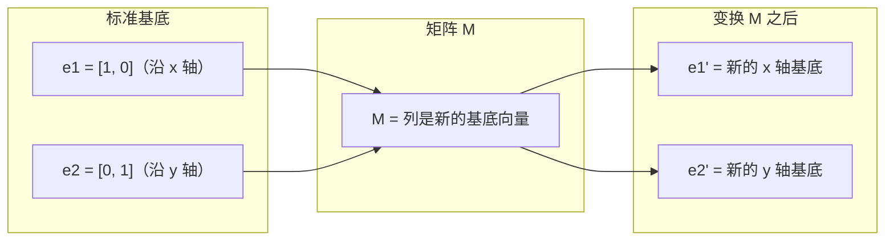
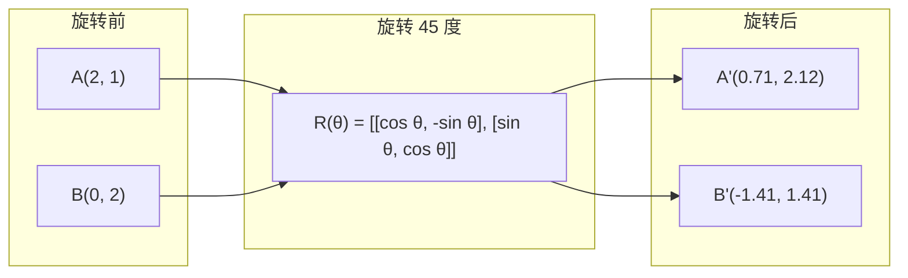
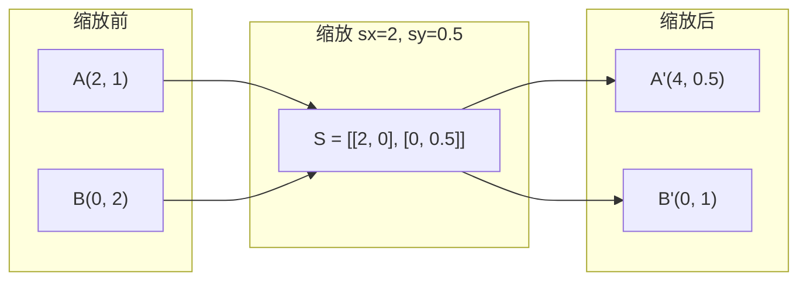
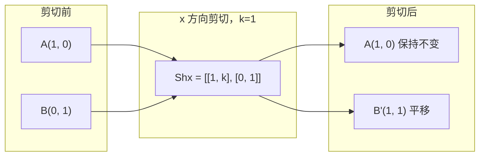
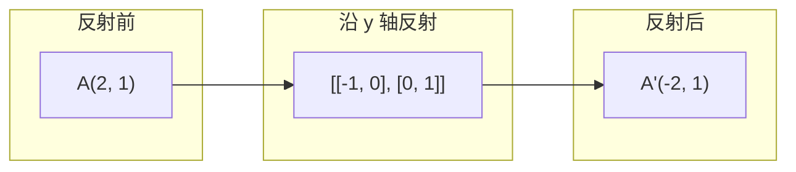
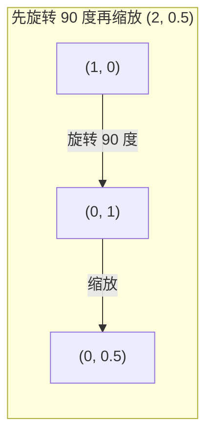
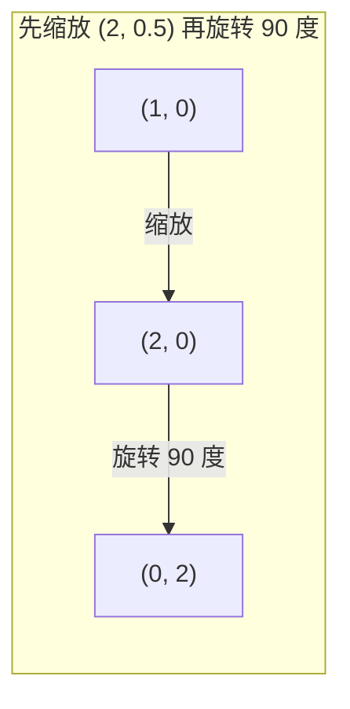

# 矩阵变换

> 矩阵是一台重塑空间的机器。了解它对每个点的作用，就理解了整个变换。

**类型：** 构建  
**语言：** Python, Julia  
**先决条件：** 第一阶段，课程 01-02（线性代数直觉，向量与矩阵运算）  
**时间：** ~75 分钟

## 学习目标

- 构造旋转、缩放、剪切和反射矩阵，并将其应用于二维和三维点  
- 通过矩阵乘法组合多个变换，并验证顺序的重要性  
- 从特征方程计算 2x2 矩阵的特征值和特征向量  
- 解释为什么特征值决定 PCA 方向、RNN 稳定性和谱聚类行为  

## 问题

你读到了 PCA，看到“求协方差矩阵的特征向量”。你读到了模型稳定性，看到“检查所有特征值的模是否小于 1”。你读到了数据增强，看到“应用随机旋转”。如果不了解矩阵在几何空间中对空间的作用，这些都难以理解。

矩阵不仅仅是数字网格。它们是空间机器。旋转矩阵会旋转点，缩放矩阵会拉伸点，剪切矩阵会倾斜点。神经网络对数据应用的每个变换都是这些操作之一或它们的组合。本课将使这些操作具体可感。

## 概念

### 变换作为矩阵

二维中的每个线性变换都可以写成一个 2x2 矩阵。矩阵告诉你基础向量 [1, 0] 和 [0, 1] 最终的位置。其他一切随之而来。



### 旋转

二维旋转绕角度 theta 保持距离和角度不变。它沿圆弧移动每个点。



三维中沿轴旋转。每个轴都有自己的旋转矩阵：

```text
Rz(theta) = | cos  -sin  0 |     绕 z 轴旋转
            | sin   cos  0 |     （x-y 平面旋转，z 保持）
            |  0     0   1 |

Rx(theta) = | 1   0     0    |   绕 x 轴旋转
            | 0  cos  -sin   |   （y-z 平面旋转，x 保持）
            | 0  sin   cos   |

Ry(theta) = |  cos  0  sin |     绕 y 轴旋转
            |   0   1   0  |     （x-z 平面旋转，y 保持）
            | -sin  0  cos |
```

### 缩放

缩放沿每个轴独立拉伸或压缩。



### 剪切

剪切在保持一个轴不变的同时倾斜另一个轴。它将矩形变成平行四边形。



剪切矩阵：  
- `Shx = [[1, k], [0, 1]]` 按 y 轴乘以 k 偏移 x 轴  
- `Shy = [[1, 0], [k, 1]]` 按 x 轴乘以 k 偏移 y 轴  

### 反射

反射沿轴或直线镜像点。



反射矩阵：  
- 沿 y 轴反射：`[[-1, 0], [0, 1]]`  
- 沿 x 轴反射：`[[1, 0], [0, -1]]`  

### 组合：链接变换

依次应用变换 A 然后 B 等价于矩阵乘法：`result = B @ A @ point`。顺序很重要。先旋转再缩放与先缩放再旋转结果不同。



组合后的矩阵：`S @ R = [[0, -2], [0.5, 0]]`



组合后的矩阵：`R @ S = [[0, -0.5], [2, 0]]`

结果不同。矩阵乘法不满足交换律。

### 特征值和特征向量

大多数向量经过矩阵作用会改变方向。特征向量特殊：矩阵只放大或缩小它们，从不旋转。放大倍数就是特征值。

```text
A @ v = lambda * v

v 是特征向量（存活的方向）
lambda 是特征值（放大倍数）

示例：A = | 2  1 |
           | 1  2 |

特征向量 [1, 1] ，特征值 3：
  A @ [1,1] = [3, 3] = 3 * [1, 1]    （方向不变，放大了 3 倍）

特征向量 [1, -1] ，特征值 1：
  A @ [1,-1] = [1, -1] = 1 * [1, -1] （方向不变，未放大）
```

矩阵沿 [1, 1] 方向拉伸 3 倍，沿 [1, -1] 方向保持不变。其他方向都是这两者的组合。

### 特征分解

如果矩阵有 n 个线性无关的特征向量，可以分解为：

```text
A = V @ D @ V^(-1)

V = 列为特征向量的矩阵  
D = 对角线为特征值的矩阵  
V^(-1) = V 的逆矩阵

含义：先旋转到特征向量坐标系，沿各轴缩放，再旋转回去。
```

### 特征值之所以重要

**PCA。** 协方差矩阵的特征向量是主成分，特征值告诉你每个成分解释的方差大小。按特征值排序，保留最大的 k 个，实现降维。

**稳定性。** 在递归网络和动力系统中，模大于 1 的特征值会导致输出爆炸，模小于 1 会导致消失。这就是一句话精述的梯度消失/爆炸问题。

**谱方法。** 图神经网络用邻接矩阵的特征值，谱聚类用拉普拉斯矩阵的特征值。特征向量揭示图结构。

### 行列式作为体积缩放因子

变换矩阵的行列式告诉你它对面积（2D）或体积（3D）的缩放比例。

```text
det = 1:   保持面积（旋转）
det = 2:   面积扩大 2 倍
det = 0:   空间压缩到低维（奇异矩阵）
det = -1:  保持面积，但翻转方向（反射）

| det(旋转) | = 1        （始终如此）
| det(缩放 sx, sy) | = sx * sy
| det(剪切) | = 1           （保持面积）
| det(反射) | = -1         （翻转方向）
```

## 实践构建

### 步骤 1：从零开始的变换矩阵（Python）

```python
import math

def rotation_2d(theta):
    c, s = math.cos(theta), math.sin(theta)
    return [[c, -s], [s, c]]

def scaling_2d(sx, sy):
    return [[sx, 0], [0, sy]]

def shearing_2d(kx, ky):
    return [[1, kx], [ky, 1]]

def reflection_x():
    return [[1, 0], [0, -1]]

def reflection_y():
    return [[-1, 0], [0, 1]]

def mat_vec_mul(matrix, vector):
    return [
        sum(matrix[i][j] * vector[j] for j in range(len(vector)))
        for i in range(len(matrix))
    ]

def mat_mul(a, b):
    rows_a, cols_b = len(a), len(b[0])
    cols_a = len(a[0])
    return [
        [sum(a[i][k] * b[k][j] for k in range(cols_a)) for j in range(cols_b)]
        for i in range(rows_a)
    ]

point = [1.0, 0.0]
angle = math.pi / 4

rotated = mat_vec_mul(rotation_2d(angle), point)
print(f"将 (1,0) 旋转 45 度: ({rotated[0]:.4f}, {rotated[1]:.4f})")

scaled = mat_vec_mul(scaling_2d(2, 3), [1.0, 1.0])
print(f"将 (1,1) 缩放为 (2,3): ({scaled[0]:.1f}, {scaled[1]:.1f})")

sheared = mat_vec_mul(shearing_2d(1, 0), [1.0, 1.0])
print(f"x 方向剪切 kx=1 的 (1,1): ({sheared[0]:.1f}, {sheared[1]:.1f})")

reflected = mat_vec_mul(reflection_y(), [2.0, 1.0])
print(f"沿 y 轴反射 (2,1): ({reflected[0]:.1f}, {reflected[1]:.1f})")
```

### 步骤 2：变换的组合

```python
R = rotation_2d(math.pi / 2)
S = scaling_2d(2, 0.5)

rotate_then_scale = mat_mul(S, R)
scale_then_rotate = mat_mul(R, S)

point = [1.0, 0.0]
result1 = mat_vec_mul(rotate_then_scale, point)
result2 = mat_vec_mul(scale_then_rotate, point)

print(f"先旋转 90 度再缩放: ({result1[0]:.2f}, {result1[1]:.2f})")
print(f"先缩放再旋转 90 度: ({result2[0]:.2f}, {result2[1]:.2f})")
print(f"结果相同？ {result1 == result2}")
```

### 步骤 3：从零计算特征值（2x2）

对于 2x2 矩阵 `[[a, b], [c, d]]`，特征值解特征方程：`lambda^2 - (a+d)*lambda + (ad - bc) = 0`。

```python
def eigenvalues_2x2(matrix):
    a, b = matrix[0]
    c, d = matrix[1]
    trace = a + d
    det = a * d - b * c
    discriminant = trace ** 2 - 4 * det
    if discriminant < 0:
        real = trace / 2
        imag = (-discriminant) ** 0.5 / 2
        return (complex(real, imag), complex(real, -imag))
    sqrt_disc = discriminant ** 0.5
    return ((trace + sqrt_disc) / 2, (trace - sqrt_disc) / 2)

def eigenvector_2x2(matrix, eigenvalue):
    a, b = matrix[0]
    c, d = matrix[1]
    if abs(b) > 1e-10:
        v = [b, eigenvalue - a]
    elif abs(c) > 1e-10:
        v = [eigenvalue - d, c]
    else:
        if abs(a - eigenvalue) < 1e-10:
            v = [1, 0]
        else:
            v = [0, 1]
    mag = (v[0] ** 2 + v[1] ** 2) ** 0.5
    return [v[0] / mag, v[1] / mag]

A = [[2, 1], [1, 2]]
vals = eigenvalues_2x2(A)
print(f"矩阵: {A}")
print(f"特征值: {vals[0]:.4f}, {vals[1]:.4f}")

for val in vals:
    vec = eigenvector_2x2(A, val)
    result = mat_vec_mul(A, vec)
    scaled = [val * vec[0], val * vec[1]]
    print(f"  lambda={val:.1f}, v={[round(x,4) for x in vec]}")
    print(f"    A@v = {[round(x,4) for x in result]}")
    print(f"    l*v = {[round(x,4) for x in scaled]}")
```

### 步骤 4：行列式作为体积缩放因子

```python
def det_2x2(matrix):
    return matrix[0][0] * matrix[1][1] - matrix[0][1] * matrix[1][0]

print(f"旋转 45 度的行列式 = {det_2x2(rotation_2d(math.pi/4)):.4f}")
print(f"缩放 (2,3) 的行列式   = {det_2x2(scaling_2d(2, 3)):.1f}")
print(f"剪切 kx=1 的行列式  = {det_2x2(shearing_2d(1, 0)):.1f}")
print(f"沿 y 轴反射的行列式 = {det_2x2(reflection_y()):.1f}")

singular = [[1, 2], [2, 4]]
print(f"奇异矩阵的行列式   = {det_2x2(singular):.1f}")
print("奇异矩阵：列向量成比例，空间坍缩为一条线。")
```

## 使用它

NumPy 使用优化的例程处理所有这些操作。

```python
import numpy as np

theta = np.pi / 4
R = np.array([[np.cos(theta), -np.sin(theta)],
              [np.sin(theta),  np.cos(theta)]])

point = np.array([1.0, 0.0])
print(f"将 (1,0) 旋转 45 度: {R @ point}")

S = np.diag([2.0, 3.0])
composed = S @ R
print(f"先旋转 45，再缩放(2,3): {composed @ point}")

A = np.array([[2, 1], [1, 2]], dtype=float)
eigenvalues, eigenvectors = np.linalg.eig(A)
print(f"\n特征值: {eigenvalues}")
print(f"特征向量（列）:\n{eigenvectors}")

for i in range(len(eigenvalues)):
    v = eigenvectors[:, i]
    lam = eigenvalues[i]
    print(f"  A @ v{i} = {A @ v}, lambda * v{i} = {lam * v}")

print(f"\ndet(R) = {np.linalg.det(R):.4f}")
print(f"det(S) = {np.linalg.det(S):.1f}")

B = np.array([[3, 1], [0, 2]], dtype=float)
vals, vecs = np.linalg.eig(B)
D = np.diag(vals)
V = vecs
reconstructed = V @ D @ np.linalg.inv(V)
print(f"\n特征分解 A = V @ D @ V^-1:")
print(f"原矩阵:\n{B}")
print(f"重建矩阵:\n{reconstructed}")
```

### 使用 NumPy 进行 3D 旋转

```python
def rotation_3d_z(theta):
    c, s = np.cos(theta), np.sin(theta)
    return np.array([[c, -s, 0], [s, c, 0], [0, 0, 1]])

def rotation_3d_x(theta):
    c, s = np.cos(theta), np.sin(theta)
    return np.array([[1, 0, 0], [0, c, -s], [0, s, c]])

point_3d = np.array([1.0, 0.0, 0.0])
rotated_z = rotation_3d_z(np.pi / 2) @ point_3d
rotated_x = rotation_3d_x(np.pi / 2) @ point_3d

print(f"\n3D 点: {point_3d}")
print(f"绕 z 轴旋转 90 度: {np.round(rotated_z, 4)}")
print(f"绕 x 轴旋转 90 度: {np.round(rotated_x, 4)}")
```

## 交付成果

本课为 PCA（第二阶段）和神经网络权重分析搭建了几何基础。这里构建的特征值/特征向量代码，是驱动降维、谱聚类和稳定性分析等生产级机器学习系统的相同算法。

## 练习

1. 对一个单位正方形（角点为 [0,0], [1,0], [1,1], [0,1]）应用旋转、缩放和平移变换。打印每种变换后的角点。验证旋转是否保持角点之间的距离。

2. 用特征方程手工计算矩阵 [[4, 2], [1, 3]] 的特征值。然后用自己写的函数和 NumPy 验证结果。

3. 创建三个变换的组合（旋转 30 度，按 [1.5, 0.8] 缩放，kx=0.3 的剪切），并将其应用于 8 个圆周排列的点。打印变换前后的坐标。计算组合矩阵的行列式并验证其等于各单独矩阵行列式的乘积。

## 关键词

| 术语 | 常用说法 | 实际含义 |
|------|-----------|----------|
| Rotation matrix（旋转矩阵） | “旋转物体” | 一个正交矩阵，沿圆弧移动点，同时保持距离和角度。行列式总为 1。 |
| Scaling matrix（缩放矩阵） | “放大物体” | 一个对角矩阵，沿每个轴独立拉伸或压缩。行列式是缩放因子的乘积。 |
| Shearing matrix（剪切矩阵） | “倾斜物体” | 一个矩阵，按比例偏移一个坐标到另一个坐标，将矩形变成平行四边形。行列式为 1。 |
| Reflection（反射） | “镜像物体” | 一个关于轴或平面的翻转矩阵。行列式为 -1。 |
| Composition（组合） | “连续执行两个操作” | 矩阵乘法用于链式变换。顺序很重要：B @ A 表示先执行 A，再执行 B。 |
| Eigenvector（特征向量） | “特殊方向” | 一个矩阵只缩放而不旋转的方向。变换的指纹。 |
| Eigenvalue（特征值） | “缩放倍数” | 矩阵缩放其特征向量的标量因子。可为负（翻转）或复数（旋转）。 |
| Eigendecomposition（特征分解） | “矩阵拆解” | 将矩阵写成 V @ D @ V^(-1)，分解为基本缩放方向和幅度。 |
| Determinant（行列式） | “矩阵的一个标量” | 变换拉伸面积（2D）或体积（3D）的倍数。为零意味着不可逆。 |
| Characteristic equation（特征方程） | “特征值来源” | det(A - lambda * I) = 0。特征值的多项式方程。 |

## 进一步阅读

- [3Blue1Brown: 线性变换](https://www.3blue1brown.com/lessons/linear-transformations) -- 矩阵如何重塑空间的视觉直观
- [3Blue1Brown: 特征向量与特征值](https://www.3blue1brown.com/lessons/eigenvalues) -- 关于特征向量几何意义的最佳视觉解释
- [MIT 18.06 Lecture 21: 特征值和特征向量](https://ocw.mit.edu/courses/18-06-linear-algebra-spring-2010/) -- Gilbert Strang 经典讲解
