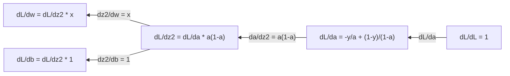
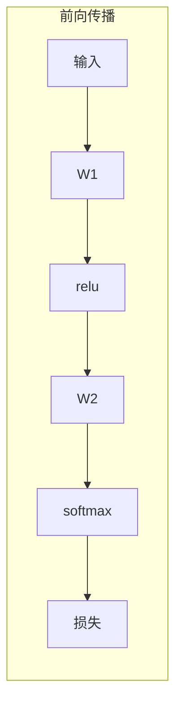
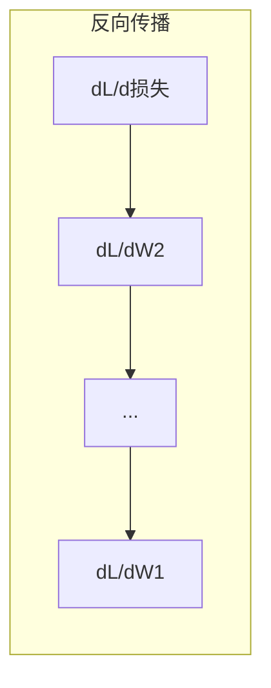

# 机器学习中的微积分

> 导数告诉你哪个方向是下坡路。这就是神经网络学习所需的一切。

**类型：** 学习  
**语言：** Python  
**先决条件：** 第1阶段，第01-03课  
**时间：** ~60分钟

## 学习目标

- 计算常见机器学习函数（x^2、sigmoid、交叉熵）的数值和解析导数
- 从零开始实现梯度下降以最小化一维和二维的损失函数
- 推导线性回归模型的梯度并通过手动权重更新进行训练
- 解释海森矩阵（Hessian matrix）、泰勒级数近似及其与优化方法的联系

## 问题

你有一个拥有数百万权重的神经网络。每个权重就是一个旋钮。你需要找出每个旋钮应该朝哪个方向旋转，才能让模型的误差稍微减少一点。微积分给了你那个方向。

没有微积分，训练神经网络就是试试随机修改，碰碰运气。通过导数，你完全知道每个权重如何影响误差。你每次都能将旋钮旋转到正确的位置。

## 概念

### 什么是导数？

导数衡量变化率。对于函数 y = f(x)，导数 f'(x) 告诉你：如果你让 x 微微增大一点，y 会变化多少？

从几何角度看，导数是该点切线的斜率。

**f(x) = x^2：**

| x  | f(x) | f'(x)（斜率）               |
|----|------|-----------------------------|
| 0  | 0    | 0 （平坦，处于最低点）      |
| 1  | 1    | 2                           |
| 2  | 4    | 4 （该点切线斜率）           |
| 3  | 9    | 6                           |

在 x=2 处，斜率是 4。如果 x 轻微向右移动，y 大约以4倍该移动量增加。在 x=0 处，斜率是 0，你正处在碗底。

正式定义：

```text
f'(x) = lim   f(x + h) - f(x)
        h->0  -----------------
                     h
```

在代码中，你跳过极限过程，直接取一个非常小的 h，即数值导数。

### 偏导数（一变量一变量地求导）

实际函数有多个输入。神经网络损失是成千上万权重的函数。偏导数是指：对某一个变量求导，其他变量保持不变。

```text
f(x, y) = x^2 + 3xy + y^2

df/dx = 2x + 3y     （将 y 当作常数）
df/dy = 3x + 2y     （将 x 当作常数）
```

每个偏导数回答：如果我只调整这个权重，损失会如何变化？

### 梯度：所有偏导数的向量

梯度把所有偏导数组合成一个向量。对于函数 f(x, y, z)，梯度是：

```text
grad f = [ df/dx, df/dy, df/dz ]
```

梯度指向函数上升最快的方向。要最小化函数，则朝相反方向移动。

**函数 f(x,y) = x^2 + y^2 的等高线图：**

该函数形状像一个碗，等高线是同心圆。最小值在 (0, 0)。

| 点       | grad f                      | -grad f（下降方向）            |
|----------|-----------------------------|-------------------------------|
| (1, 1)   | [2, 2]（指向上坡，远离最小值） | [-2, -2]（指向下坡，朝向最小值） |
| (0, 0)   | [0, 0]（平坦，处于极小点）      | [0, 0]                        |

这就是梯度下降的图像表示：计算梯度，取负，移动一步。

### 和优化的联系

训练神经网络就是优化问题。你有一个损失函数 L(w1, w2, ..., wn)，衡量模型的错误程度。你的目标是最小化它。

```text
梯度下降更新规则：

  w_new = w_old - learning_rate * dL/dw

每个权重：
  1. 计算损失关于权重的偏导数
  2. 从权重中减去导数乘以一个小系数
  3. 重复
```

学习率控制步长，太大则可能超调，太小则进展缓慢。

**损失函数形状（1D 切片）：**

损失函数 L(w) 随权重 w 变化，形成峰谷曲线。

| 特点       | 描述                                     |
|------------|------------------------------------------|
| 全局最小值 | 曲线上的最低点 —— 最优解                   |
| 局部最小值 | 低于邻近点但不是最低的谷底                 |
| 斜率       | 梯度下降沿着斜率方向下坡开始训练             |

梯度下降总是沿着斜率下坡，可能陷入局部极小值，但在高维参数空间（数百万权重）中，这通常不是实际问题。

### 数值导数 vs 解析导数

计算导数有两种方式。

解析导数：手动应用微积分规则。比如 f(x) = x^2，导数是 f'(x) = 2x。精准且快速。

数值导数：用定义近似。计算 f(x+h) 和 f(x-h) 的差，再除以 2h。

```text
数值导数（中心差分）：

f'(x) ~= [f(x + h) - f(x - h)] / (2h)

h = 0.0001 在实践中效果很好
```

数值导数慢，但适用于任意函数。解析导数快，但需要推导公式。神经网络框架使用第三种方法：自动微分（automatic differentiation），机械地计算准确导数。你将在第3阶段看到。

### 简单函数的手工导数

以下是在机器学习中常见的导数。

```text
函数            导数              应用场景
--------        ----------        --------------
f(x) = x^2     f'(x) = 2x       损失函数（均方误差）
f(x) = wx + b  f'(w) = x          线性层（对权重的梯度）
                f'(b) = 1          线性层（对偏置的梯度）
                f'(x) = w          线性层（对输入的梯度）
f(x) = e^x     f'(x) = e^x      Softmax，注意力机制
f(x) = ln(x)   f'(x) = 1/x      交叉熵损失
f(x) = 1/(1+e^-x)  f'(x) = f(x)(1-f(x))   Sigmoid 激活函数
```

对于 f(x) = x^2：

```text
f(x) = x^2    f'(x) = 2x

  x    f(x)   f'(x)   含义
  -2    4      -4     斜率向左倾斜（递减）
  -1    1      -2     斜率向左倾斜（递减）
   0    0       0     平坦（最小值！）
   1    1       2     斜率向右倾斜（递增）
   2    4       4     斜率向右倾斜（递增）
```

对于 f(w) = wx + b，其中 x=3, b=1：

```text
f(w) = 3w + 1    f'(w) = 3

关于 w 的导数就是 x。
x 大时，w 的微小变化会导致输出大幅变化。
```

### 链式法则

函数复合时，链式法则告诉你如何求导。

```text
如果 y = f(g(x))，则 dy/dx = f'(g(x)) * g'(x)

例子：y = (3x + 1)^2
  外函数：f(u) = u^2        f'(u) = 2u
  内函数：g(x) = 3x + 1     g'(x) = 3
  dy/dx = 2(3x + 1) * 3 = 6(3x + 1)
```

神经网络是函数的链条：输入 -> 线性层 -> 激活函数 -> 线性层 -> 激活函数 -> 损失。反向传播（backpropagation）就是从输出到输入多次应用链式法则。这就是整个算法。

### 海森矩阵（Hessian Matrix）

梯度告诉你斜率，海森矩阵告诉你曲率。

海森矩阵是二阶偏导数组成的矩阵。对于 f(x1, x2, ..., xn)，海森矩阵的(i,j)元素是：

```text
H[i][j] = d^2f / (dx_i * dx_j)
```

对于二元函数 f(x, y)：

```text
H = | d^2f/dx^2    d^2f/dxdy |
    | d^2f/dydx    d^2f/dy^2 |
```

**海森在临界点（梯度=0）处的含义：**

| 海森性质               | 含义         | 示例曲面           |
|------------------------|--------------|--------------------|
| 正定（所有特征值 > 0）   | 局部最小值     | 碗朝上              |
| 负定（所有特征值 < 0）   | 局部最大值     | 碗朝下              |
| 不定（特征值正负混合）   | 鞍点         | 马鞍形              |

**例子：** f(x, y) = x^2 - y^2（鞍函数）

```text
df/dx = 2x       df/dy = -2y
d^2f/dx^2 = 2    d^2f/dy^2 = -2    d^2f/dxdy = 0

H = | 2   0 |
    | 0  -2 |

特征值：2 和 -2（一个正，一个负）
--> 鞍点位于 (0, 0)
```

相比 f(x, y) = x^2 + y^2（碗状函数）：

```text
H = | 2  0 |
    | 0  2 |

特征值：2 和 2（均正）
--> 局部最小值位于 (0, 0)
```

**海森在机器学习中的重要性：**

牛顿法利用海森矩阵比梯度下降更准确地调整步长。它不仅考虑斜率，还考虑曲率：

```text
牛顿更新：    w_new = w_old - H^(-1) * gradient
梯度下降：    w_new = w_old - lr * gradient
```

牛顿法收敛更快，因为海森“重缩放”了梯度——斜率大的方向步长变小，平坦方向步长变大。

问题是：神经网络有 N 个参数，海森矩阵是 N×N。百万参数模型需要万亿级元素矩阵，因此通常只能用近似方法。

| 方法              | 使用内容              | 计算成本        | 收敛速度        |
|-------------------|-----------------------|-----------------|-----------------|
| 梯度下降           | 仅一阶导数             | 每步 O(N)       | 慢（线性）       |
| 牛顿法             | 完整海森矩阵           | 每步 O(N^3)     | 快（平方级）     |
| L-BFGS            | 用梯度历史近似海森矩阵  | 每步 O(N)       | 中等（超线性）   |
| Adam              | 每参数自适应学习率（海森对角线近似） | 每步 O(N)       | 中等           |
| 自然梯度（Natural gradient） | Fisher 信息矩阵（统计海森）    | 每步 O(N^2)     | 快              |

在实践中，Adam 是深度学习的默认优化器。它通过跟踪梯度的运行均值和方差，廉价地近似二阶信息。

### 泰勒级数近似

任何光滑函数都可以在某点用多项式近似：

```text
f(x + h) = f(x) + f'(x)*h + (1/2)*f''(x)*h^2 + (1/6)*f'''(x)*h^3 + ...
```

包含的项越多，近似越精确——但只在 x 附近成立。

**泰勒级数对机器学习的意义：**

- **一阶泰勒 = 梯度下降。** 用 f(x + h) ~ f(x) + f'(x)*h 做线性近似，梯度下降就是在该线性模型中寻找最低点 h = -lr * f'(x)。

- **二阶泰勒 = 牛顿法。** 用 f(x + h) ~ f(x) + f'(x)*h + (1/2)*f''(x)*h^2 近似，优化问题变成二次模型，求解得 h = -f'(x)/f''(x)，即牛顿步长。

- **损失函数设计。** 均方误差和交叉熵都是光滑的函数，其泰勒展开良好，这是优化可预测的关键。

```text
近似阶数       捕获内容         优化方法
-----------    ------------    --------------
0阶（常数）   仅函数值         随机搜索
1阶（线性）   斜率             梯度下降
2阶（二次）   曲率             牛顿法
更高阶数       更精细结构       机器学习中极少使用
```

关键点：所有基于梯度的优化，实质上都是在局部用多项式近似损失函数，然后朝这个近似的最小点移动。

### 机器学习中的积分

导数告诉你变化率，积分计算累积量——曲线下面积。

在机器学习中，你很少手动计算积分，但概念无处不在：

**概率。** 对于连续随机变量，有密度 p(x)：

```text
P(a < X < b) = 从 a 到 b 的 p(x) 积分 dx
```

概率密度曲线在 a 和 b 之间的面积，就是落在该区间的概率。

**期望值（Expected value）**。按概率加权的平均结果：
```text
E[f(X)] = integral of f(x) * p(x) dx
```
数据分布上的期望损失是一个积分。训练时最小化这个积分的经验近似。

**KL 散度（KL divergence）**。衡量两个分布的差异：
```text
KL(p || q) = integral of p(x) * log(p(x) / q(x)) dx
```
用于变分自编码器（VAE）、知识蒸馏（knowledge distillation）和贝叶斯推断（Bayesian inference）。

**归一化常数（Normalization constants）**。在贝叶斯推断中：
```text
p(w | data) = p(data | w) * p(w) / integral of p(data | w) * p(w) dw
```
分母是对所有可能参数的积分。通常不可解，因此我们使用诸如马尔科夫链蒙特卡洛方法（MCMC）和变分推断（variational inference）等近似方法。

| 积分概念           | 机器学习中出现的地方                   |
|-----------------|------------------------------|
| 曲线下的面积（Area under curve） | 由密度函数推导的概率                 |
| 期望值（Expected value）      | 损失函数，风险最小化                  |
| KL 散度（KL divergence）      | VAE，策略优化，蒸馏                   |
| 归一化（Normalization）      | 贝叶斯后验，softmax 分母              |
| 边际似然（Marginal likelihood） | 模型比较，证据下界（ELBO）             |

### 计算图中的多变量链式法则（Multivariable Chain Rule）

链式法则不仅适用于一维标量函数。在神经网络中，变量会分叉和汇合。以下为简单前向传播中导数的流动：


反向传播从右到左计算梯度：



每条箭头表示乘以局部导数。任意参数的梯度是从损失函数到该参数路径上所有局部导数的乘积。当路径分叉和合并时，将各条路径的贡献相加（多变量链式法则）。

这就是反向传播的全部内容：链式法则在计算图中自系统地从输出传到输入。

### 雅可比矩阵（Jacobian matrix）

当函数将向量映射到向量（如神经网络层）时，它的导数是一个矩阵。雅可比矩阵包含了每个输出相对于每个输入的所有偏导数。

对于 f: R^n -> R^m，雅可比矩阵 J 是 m x n 维矩阵：

|   | x1       | x2       | ...      | xn       |
|---|----------|----------|----------|----------|
| f1| df1/dx1  | df1/dx2  | ...      | df1/dxn  |
| f2| df2/dx1  | df2/dx2  | ...      | df2/dxn  |
|...| ...      | ...      | ...      | ...      |
| fm| dfm/dx1  | dfm/dx2  | ...      | dfm/dxn  |

你不会手工计算神经网络的雅可比矩阵，PyTorch 会自动计算。但知道雅可比矩阵的存在有助于理解反向传播的形状：如果层将 R^n 映射到 R^m，则它的雅可比是 m x n。梯度沿该矩阵的转置方向回传。

### 这对神经网络的重要性

神经网络中的每个权重都有一个梯度，梯度告诉你如何调整该权重以减少损失。





每次权重更新：
- `W1 = W1 - lr * dL/dW1`
- `W2 = W2 - lr * dL/dW2`

前向传播计算预测和损失，反向传播计算损失对每个权重的梯度。然后每个权重沿梯度方向迈出一小步。重复几百万步，这就是深度学习。

## 实现它（Build It）

### 第一步：从零实现数值导数

```python
def numerical_derivative(f, x, h=1e-7):
    return (f(x + h) - f(x - h)) / (2 * h)

def f(x):
    return x ** 2

for x in [-2, -1, 0, 1, 2]:
    numerical = numerical_derivative(f, x)
    analytical = 2 * x
    print(f"x={x:2d}  f'(x) 数值导数={numerical:.6f}  解析导数={analytical:.1f}")
```

数值导数在多位小数上与解析导数匹配。

### 第二步：偏导数和梯度

```python
def numerical_gradient(f, point, h=1e-7):
    gradient = []
    for i in range(len(point)):
        point_plus = list(point)
        point_minus = list(point)
        point_plus[i] += h
        point_minus[i] -= h
        partial = (f(point_plus) - f(point_minus)) / (2 * h)
        gradient.append(partial)
    return gradient

def f_multi(point):
    x, y = point
    return x**2 + 3*x*y + y**2

grad = numerical_gradient(f_multi, [1.0, 2.0])
print(f"(1,2)处的数值梯度: {[f'{g:.4f}' for g in grad]}")
print(f"(1,2)处的解析梯度: [2*1+3*2, 3*1+2*2] = [{2*1+3*2}, {3*1+2*2}]")
```

### 第三步：对 f(x) = x^2 使用梯度下降寻找最小值

```python
x = 5.0
lr = 0.1
for step in range(20):
    grad = 2 * x
    x = x - lr * grad
    print(f"step {step:2d}  x={x:8.4f}  f(x)={x**2:10.6f}")
```

从 x=5 开始，每步都向 x=0（最小值）靠近。

### 第四步：二维函数上的梯度下降

```python
def f_2d(point):
    x, y = point
    return x**2 + y**2

point = [4.0, 3.0]
lr = 0.1
for step in range(30):
    grad = numerical_gradient(f_2d, point)
    point = [p - lr * g for p, g in zip(point, grad)]
    loss = f_2d(point)
    if step % 5 == 0 or step == 29:
        print(f"step {step:2d}  point=({point[0]:7.4f}, {point[1]:7.4f})  f={loss:.6f}")
```

### 第五步：比较数值和解析导数

```python
import math

test_functions = [
    ("x^2",      lambda x: x**2,          lambda x: 2*x),
    ("x^3",      lambda x: x**3,          lambda x: 3*x**2),
    ("sin(x)",   lambda x: math.sin(x),   lambda x: math.cos(x)),
    ("e^x",      lambda x: math.exp(x),   lambda x: math.exp(x)),
    ("1/x",      lambda x: 1/x,           lambda x: -1/x**2),
]

x = 2.0
print(f"{'函数':<12} {'数值导数':>12} {'解析导数':>12} {'误差':>12}")
print("-" * 50)
for name, f, df in test_functions:
    num = numerical_derivative(f, x)
    ana = df(x)
    err = abs(num - ana)
    print(f"{name:<12} {num:12.6f} {ana:12.6f} {err:12.2e}")
```

### 第六步：数值计算 Hessian 矩阵

```python
def hessian_2d(f, x, y, h=1e-5):
    fxx = (f(x + h, y) - 2 * f(x, y) + f(x - h, y)) / (h ** 2)
    fyy = (f(x, y + h) - 2 * f(x, y) + f(x, y - h)) / (h ** 2)
    fxy = (f(x + h, y + h) - f(x + h, y - h) - f(x - h, y + h) + f(x - h, y - h)) / (4 * h ** 2)
    return [[fxx, fxy], [fxy, fyy]]

def saddle(x, y):
    return x ** 2 - y ** 2

def bowl(x, y):
    return x ** 2 + y ** 2

H_saddle = hessian_2d(saddle, 0.0, 0.0)
H_bowl = hessian_2d(bowl, 0.0, 0.0)
print(f"鞍点 Hessian: {H_saddle}")  # [[2, 0], [0, -2]] -- 符号混合
print(f"碗型 Hessian: {H_bowl}")    # [[2, 0], [0, 2]]  -- 全正
```

鞍点函数的 Hessian 有特征值 2 和 -2（符号混合，确认鞍点）。碗型函数的 Hessian 有特征值均为 2（正定，确认极小值）。

### 第七步：泰勒近似发挥作用

```python
import math

def taylor_approx(f, f_prime, f_double_prime, x0, h, order=2):
    result = f(x0)
    if order >= 1:
        result += f_prime(x0) * h
    if order >= 2:
        result += 0.5 * f_double_prime(x0) * h ** 2
    return result

x0 = 0.0
for h in [0.1, 0.5, 1.0, 2.0]:
    true_val = math.sin(h)
    t1 = taylor_approx(math.sin, math.cos, lambda x: -math.sin(x), x0, h, order=1)
    t2 = taylor_approx(math.sin, math.cos, lambda x: -math.sin(x), x0, h, order=2)
    print(f"h={h:.1f}  sin(h)={true_val:.4f}  一阶={t1:.4f}  二阶={t2:.4f}")
```

在 x0=0 附近，sin(x) 约等于 x（一阶泰勒）。对小 h 近似非常好，但大 h 时渐差。正因如此，梯度下降在使用较小学习率时效果最佳——每一步都假设线性近似准确。

### 第八步：这对神经网络的意义

```python
import random

random.seed(42)

w = random.gauss(0, 1)
b = random.gauss(0, 1)
lr = 0.01

xs = [1.0, 2.0, 3.0, 4.0, 5.0]
ys = [3.0, 5.0, 7.0, 9.0, 11.0]

for epoch in range(200):
    total_loss = 0
    dw = 0
    db = 0
    for x, y in zip(xs, ys):
        pred = w * x + b
        error = pred - y
        total_loss += error ** 2
        dw += 2 * error * x
        db += 2 * error
    dw /= len(xs)
    db /= len(xs)
    total_loss /= len(xs)
    w -= lr * dw
    b -= lr * db
    if epoch % 40 == 0 or epoch == 199:
        print(f"epoch {epoch:3d}  w={w:.4f}  b={b:.4f}  loss={total_loss:.6f}")

print(f"\n学得模型: y = {w:.2f}x + {b:.2f}")
print(f"真实模型: y = 2x + 1")
```

每个基于梯度的训练循环遵循此模式：预测，计算损失，计算梯度，更新权重。

## 使用它（Use It）

使用 NumPy，同样的操作更快且更简洁：

```python
import numpy as np

x = np.array([1, 2, 3, 4, 5], dtype=float)
y = np.array([3, 5, 7, 9, 11], dtype=float)

w, b = np.random.randn(), np.random.randn()
lr = 0.01

for epoch in range(200):
    pred = w * x + b
    error = pred - y
    loss = np.mean(error ** 2)
    dw = np.mean(2 * error * x)
    db = np.mean(2 * error)
    w -= lr * dw
    b -= lr * db

print(f"学得模型: y = {w:.2f}x + {b:.2f}")
```

你刚刚从零实现了梯度下降。PyTorch 会自动计算梯度，但更新循环与此相同。

## 练习

1. 实现 `numerical_second_derivative(f, x)`，利用调用两次 `numerical_derivative`。验证 x^3 在 x=2 处的二阶导数为 12。
2. 使用梯度下降寻找 f(x, y) = (x - 3)^2 + (y + 1)^2 的最小值。起点为 (0, 0)，应收敛到 (3, -1)。
3. 在梯度下降循环中添加动量：维护一个累积过去梯度的速度向量。比较有无动量时，f(x) = x^4 - 3x^2 的收敛速度。

## 关键词

| 术语              | 大众说法             | 实际含义                                     |
|-----------------|------------------|-----------------------------------------|
| 导数（Derivative）      | “斜率”                | 函数某点的变化率。告诉你输入单位变化时输出变化多少。              |
| 偏导数（Partial derivative） | “一个变量的导数”         | 针对一个变量求导，其他变量保持不变。                            |
| 梯度（Gradient）        | “最大上升方向”           | 所有偏导数组成的向量。指向函数增长最快的方向。                          |
| 梯度下降（Gradient descent）  | “往下走”               | 从参数中减去梯度乘以学习率以减小损失。神经网络训练的核心。                   |
| 学习率（Learning rate）     | “步长”                 | 控制每次梯度下降步长大小的标量。过大则发散，过小则收敛缓慢。                  |
| 链式法则（Chain rule）      | “导数相乘”              | 复合函数求导的规则：df/dx = df/dg * dg/dx，是反向传播的数学基础。            |
| 雅可比矩阵（Jacobian）     | “导数矩阵”               | 函数向量映射到向量时，所有输出对所有输入的偏导数组成的矩阵。                   |
| 数值导数（Numerical derivative） | “有限差分法”              | 通过在相近点计算函数值并求斜率近似导数。                             |
| 反向传播（Backpropagation） | “反向自动微分”            | 利用链式法则从输出向输入计算梯度的过程。神经网络学习的关键。                     |
| Hessian 矩阵（Hessian）    | “二阶导数组成矩阵”          | 所有二阶偏导数的矩阵。描述函数曲率。临界点处 Hessian 正定表示局部极小值。           |
| 泰勒级数（Taylor series）   | “多项式近似”              | 利用导数在一点附近近似函数：f(x+h) ≈ f(x) + f'(x)h + (1/2)f''(x)h^2 + ...。理解梯度下降和牛顿法的理论基础。 |
| 积分（Integral）          | “面积”                 | 积累某种量。机器学习中用于定义概率、期望值和 KL 散度。                       |

## 延伸阅读

- [3Blue1Brown: Essence of Calculus（微积分精髓）](https://www.3blue1brown.com/topics/calculus) - 关于导数、积分和链式法则的可视化直观理解
- [Stanford CS231n: Backpropagation（反向传播）](https://cs231n.github.io/optimization-2/) - 梯度如何流过神经网络层的讲解
