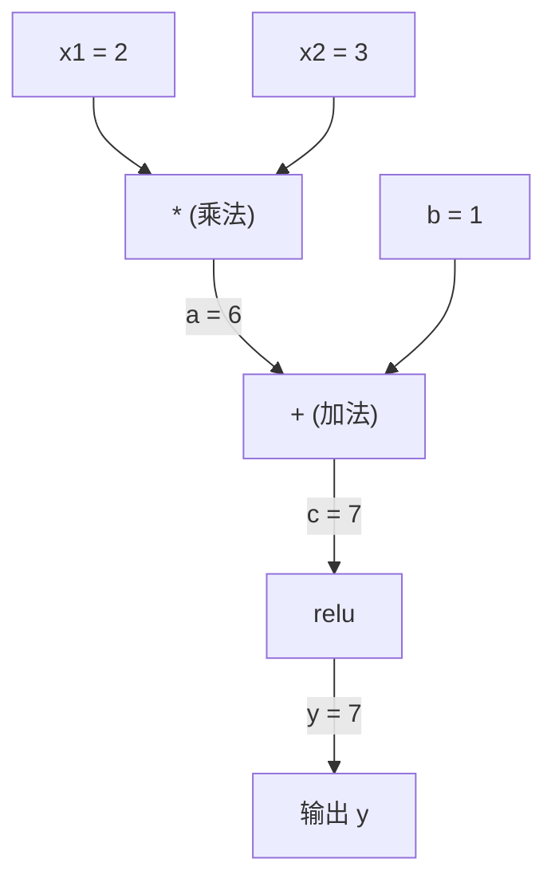
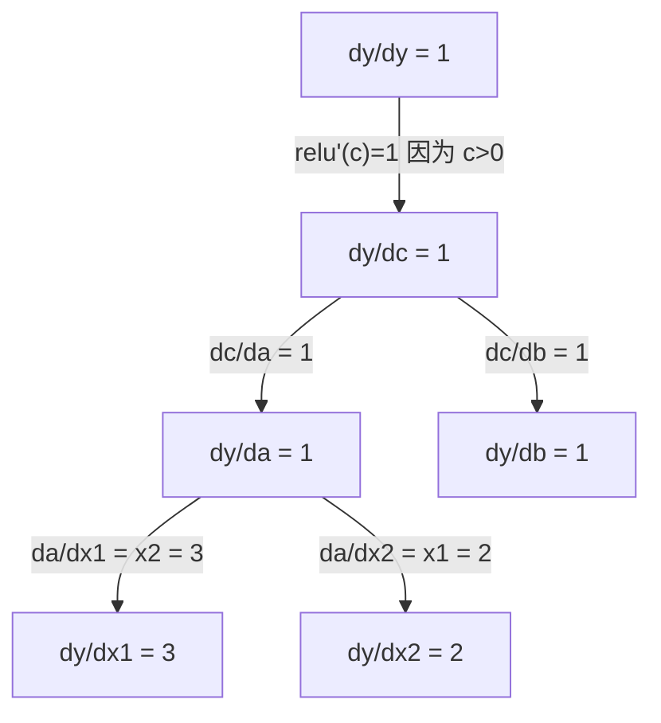

# 链式法则 & 自动微分

> 链式法则是每个神经网络能够学习的核心引擎。

**类型:** 构建  
**语言:** Python  
**先决条件:** 第一阶段，课程 04（导数与梯度）  
**时间:** 约90分钟

## 学习目标

- 构建一个最简自动求导引擎（Value 类），该引擎记录运算并通过反向模式自动微分计算梯度  
- 使用拓扑排序实现通过计算图的前向和反向传播  
- 构建并训练一个多层感知机解决异或（XOR）问题，只使用自制自动求导引擎  
- 使用数值有限差分进行梯度检查以验证自动微分的正确性

## 问题描述

你可以计算简单函数的导数。但神经网络不是一个简单函数。它是由数百个函数复合起来：矩阵乘法、加偏置、应用激活函数、再次矩阵乘法、softmax、交叉熵损失。输出是函数的函数的函数。

为了训练网络，你需要损失相对于每一个权重的梯度。几百万参数时，手工计算几乎不可能；用数值方法（有限差分）计算又太慢。

链式法则给你数学公式。自动微分给你算法。两者结合可以让你在计算量与一次前向传播相当的时间内，精确计算通过任意函数复合的梯度。

这就是 PyTorch、TensorFlow 和 JAX 的工作原理。你将从零构建一个简化版。

## 概念介绍

### 链式法则

若 `y = f(g(x))`，则 `y` 关于 `x` 的导数为：

```text
dy/dx = dy/dg * dg/dx = f'(g(x)) * g'(x)
```

链式相乘导数。每一环贡献其局部导数。

示例：`y = sin(x^2)`

```text
g(x) = x^2       g'(x) = 2x
f(g) = sin(g)     f'(g) = cos(g)

dy/dx = cos(x^2) * 2x
```

对于更深层的复合，链条延长：

```text
y = f(g(h(x)))

dy/dx = f'(g(h(x))) * g'(h(x)) * h'(x)
```

神经网络的每层就是链条上的一个环节。

### 计算图

计算图让链式法则可视化。每个运算成为一个节点，数据前向流动，梯度反向流动。

**前向传播（计算数值）：**



**反向传播（计算梯度）：**



反向传播在每个节点应用链式法则，从输出到输入传播梯度。

### 前向模式和反向模式  

计算图中应用链式法则有两种方式。

**前向模式** 从输入开始推导数，计算 `dx/dx = 1` 并向前传播。适合少输入多输出的情况。

```text
前向模式：种子是 dx/dx = 1，前向传播

  x = 2       (dx/dx = 1)
  a = x^2     (da/dx = 2x = 4)
  y = sin(a)  (dy/dx = cos(a) * da/dx = cos(4) * 4 = -2.615)
```

**反向模式** 从输出开始拉回梯度，计算 `dy/dy = 1` 并反向传播。适合多输入少输出的情况。

```text
反向模式：种子是 dy/dy = 1，反向传播

  y = sin(a)  (dy/dy = 1)
  a = x^2     (dy/da = cos(a) = cos(4) = -0.654)
  x = 2       (dy/dx = dy/da * da/dx = -0.654 * 4 = -2.615)
```

神经网络通常有百万级输入（权重）和一个输出（损失）。反向模式只需一次反向传播就能计算所有梯度，这就是反向传播必用反向模式的原因。

| 模式 | 种子 | 方向 | 适用情况 |
|------|------|-------|---------|
| 前向 | `dx_i/dx_i = 1` | 从输入到输出 | 少输入，多输出 |
| 反向 | `dy/dy = 1` | 从输出到输入 | 多输入，少输出（神经网） |

### 适用于前向模式的对偶数

前向模式可以用对偶数优雅实现。对偶数形如 `a + b*ε`，满足 `ε² = 0`。

```text
对偶数：(值, 导数)

(2, 1) 表示：值为2，相对于x的导数为1

运算规则：
  (a, a') + (b, b') = (a+b, a'+b')
  (a, a') * (b, b') = (a*b, a'*b + a*b')
  sin(a, a')         = (sin(a), cos(a)*a')
```

给输入变量赋导数1。导数自动通过所有运算传播。

### 构建自动求导引擎

自动求导引擎需要三项功能：

1. **数值封装。** 用一个对象封装每个数字，存储其值和梯度。  
2. **计算图记录。** 每个操作记录其输入和本地梯度函数。  
3. **反向传播。** 拓扑排序图，然后反向遍历各节点，应用链式法则。  

这正是 PyTorch 的 `autograd` 做的事。`torch.Tensor` 封装数值，`requires_grad=True` 时记录操作，`.backward()` 时计算梯度。

### PyTorch Autograd 的内部工作原理

写 PyTorch 代码时：

```python
x = torch.tensor(2.0, requires_grad=True)
y = x ** 2 + 3 * x + 1
y.backward()
print(x.grad)  # 7.0 = 2*x + 3 = 2*2 + 3
```

PyTorch 内部：

1. 为 `x` 创建一个带 `requires_grad=True` 的 `Tensor` 节点  
2. 每个运算符（`**`，`*`，`+`）创建新节点并记录反向函数  
3. 调用 `y.backward()` 触发反向模式自动微分  
4. 每个节点的 `grad_fn` 计算本地梯度并传给父节点  
5. 梯度通过累加（而非替换）保存在 `.grad` 属性中  

计算图是动态图（define-by-run）。每次前向传播都会构建一个新的图，支持模型中的控制流（if/else，循环）。

## 构建步骤

### 第1步：Value类

```python
class Value:
    def __init__(self, data, children=(), op=''):
        self.data = data
        self.grad = 0.0
        self._backward = lambda: None
        self._prev = set(children)
        self._op = op

    def __repr__(self):
        return f"Value(data={self.data:.4f}, grad={self.grad:.4f})"
```

每个 `Value` 存储数值、梯度（初始为0）、反向传播函数和生成它的子节点指针。

### 第2步：带梯度追踪的算术操作

```python
    def __add__(self, other):
        other = other if isinstance(other, Value) else Value(other)
        out = Value(self.data + other.data, (self, other), '+')
        def _backward():
            self.grad += out.grad
            other.grad += out.grad
        out._backward = _backward
        return out

    def __mul__(self, other):
        other = other if isinstance(other, Value) else Value(other)
        out = Value(self.data * other.data, (self, other), '*')
        def _backward():
            self.grad += other.data * out.grad
            other.grad += self.data * out.grad
        out._backward = _backward
        return out

    def relu(self):
        out = Value(max(0, self.data), (self,), 'relu')
        def _backward():
            self.grad += (1.0 if out.data > 0 else 0.0) * out.grad
        out._backward = _backward
        return out
```

每个操作创建一个闭包，知道如何计算本地梯度并乘以上游梯度 (`out.grad`)。`+=` 支持值用于多个操作。

### 第3步：反向传播

```python
    def backward(self):
        topo = []
        visited = set()
        def build_topo(v):
            if v not in visited:
                visited.add(v)
                for child in v._prev:
                    build_topo(child)
                topo.append(v)
        build_topo(self)

        self.grad = 1.0
        for v in reversed(topo):
            v._backward()
```

拓扑排序确保每个节点的梯度在传递给子节点前完全计算。种子梯度是 1.0 （dy/dy=1）。

### 第4步：补全操作以构成完整引擎

基础 Value 实现了加法、乘法和 relu。真正的自动求导引擎要更多操作，神经网络常用如下：

```python
    def __neg__(self):
        return self * -1

    def __sub__(self, other):
        return self + (-other)

    def __radd__(self, other):
        return self + other

    def __rmul__(self, other):
        return self * other

    def __rsub__(self, other):
        return other + (-self)

    def __pow__(self, n):
        out = Value(self.data ** n, (self,), f'**{n}')
        def _backward():
            self.grad += n * (self.data ** (n - 1)) * out.grad
        out._backward = _backward
        return out

    def __truediv__(self, other):
        return self * (other ** -1) if isinstance(other, Value) else self * (Value(other) ** -1)

    def exp(self):
        import math
        e = math.exp(self.data)
        out = Value(e, (self,), 'exp')
        def _backward():
            self.grad += e * out.grad
        out._backward = _backward
        return out

    def log(self):
        import math
        out = Value(math.log(self.data), (self,), 'log')
        def _backward():
            self.grad += (1.0 / self.data) * out.grad
        out._backward = _backward
        return out

    def tanh(self):
        import math
        t = math.tanh(self.data)
        out = Value(t, (self,), 'tanh')
        def _backward():
            self.grad += (1 - t ** 2) * out.grad
        out._backward = _backward
        return out
```

**每个操作意义：**

| 操作 | 反向规则 | 用途 |
|-------|---------|------|
| `__sub__` | 复用加法 + 取负 | 计算损失（预测-目标） |
| `__pow__` | n * x^(n-1) | 多项式激活，均方误差（误差平方） |
| `__truediv__` | 复用乘法 + 幂运算 | 归一化，学习率缩放 |
| `exp` | exp(x) * 上游梯度 | Softmax，似然对数 |
| `log` | (1/x) * 上游梯度 | 交叉熵损失，概率的对数 |
| `tanh` | (1 - tanh²) * 上游梯度 | 经典激活函数 |

巧妙点在于：`__sub__` 和 `__truediv__` 通过已有操作定义，自动获得正确梯度，这得益于链式法则复合。

### 第5步：用自制引擎实现小型多层感知机（MLP）

有完整的 Value 类后，可以用它构建神经网络。无需 PyTorch 或 NumPy，只用 Value 和链式法则。

```python
import random

class Neuron:
    def __init__(self, n_inputs):
        self.w = [Value(random.uniform(-1, 1)) for _ in range(n_inputs)]
        self.b = Value(0.0)

    def __call__(self, x):
        act = sum((wi * xi for wi, xi in zip(self.w, x)), self.b)
        return act.tanh()

    def parameters(self):
        return self.w + [self.b]

class Layer:
    def __init__(self, n_inputs, n_outputs):
        self.neurons = [Neuron(n_inputs) for _ in range(n_outputs)]

    def __call__(self, x):
        return [n(x) for n in self.neurons]

    def parameters(self):
        return [p for n in self.neurons for p in n.parameters()]

class MLP:
    def __init__(self, sizes):
        self.layers = [Layer(sizes[i], sizes[i+1]) for i in range(len(sizes)-1)]

    def __call__(self, x):
        for layer in self.layers:
            x = layer(x)
        return x[0] if len(x) == 1 else x

    def parameters(self):
        return [p for layer in self.layers for p in layer.parameters()]
```

一个 `Neuron`（神经元）计算 `tanh(w1*x1 + w2*x2 + ... + b)`。一个 `Layer`（层）是神经元的列表。一个 `MLP`（多层感知器）堆叠多个层。每个权重都是一个 `Value`，因此调用 `loss.backward()` 会将梯度传播到每个参数。

**在 XOR 上训练：**

```python
random.seed(42)
model = MLP([2, 4, 1])  # 2 个输入，4 个隐藏神经元，1 个输出

xs = [[0, 0], [0, 1], [1, 0], [1, 1]]
ys = [-1, 1, 1, -1]  # XOR 模式（使用 -1/1 以适配 tanh）

for step in range(100):
    preds = [model(x) for x in xs]
    loss = sum((p - y) ** 2 for p, y in zip(preds, ys))

    for p in model.parameters():
        p.grad = 0.0
    loss.backward()

    lr = 0.05
    for p in model.parameters():
        p.data -= lr * p.grad

    if step % 20 == 0:
        print(f"step {step:3d}  loss = {loss.data:.4f}")

print("\n训练后预测结果：")
for x, y in zip(xs, ys):
    print(f"  输入={x}  目标={y:2d}  预测={model(x).data:6.3f}")
```

这就是 micrograd。一个用纯 Python 和自动微分实现的完整神经网络训练循环。每个商用深度学习框架在大规模上也做同样的事情。

### 第 6 步：梯度检验

如何确认你的自动微分是正确的？将其与数值微分比较。这称为梯度检验。

```python
def gradient_check(build_expr, x_val, h=1e-7):
    x = Value(x_val)
    y = build_expr(x)
    y.backward()
    autodiff_grad = x.grad

    y_plus = build_expr(Value(x_val + h)).data
    y_minus = build_expr(Value(x_val - h)).data
    numerical_grad = (y_plus - y_minus) / (2 * h)

    diff = abs(autodiff_grad - numerical_grad)
    return autodiff_grad, numerical_grad, diff
```

在复杂表达式上测试它：

```python
def expr(x):
    return (x ** 3 + x * 2 + 1).tanh()

ad, num, diff = gradient_check(expr, 0.5)
print(f"自动微分:  {ad:.8f}")
print(f"数值计算: {num:.8f}")
print(f"差异: {diff:.2e}")
# 差异应小于 1e-5
```

梯度检验在实现新操作时非常重要。如果你的反向传播有 bug，数值检查能捕捉到它。每个严肃的深度学习实现都会在开发中运行梯度检查。

**何时做梯度检验：**

| 情况 | 是否做梯度检验？ |
|-----------|-------------------|
| 向自动微分系统添加新操作 | 是，一定要做 |
| 调试无法收敛的训练循环 | 是，先检查梯度 |
| 生产训练 | 不，太慢了（每个参数需要两倍的前向传递） |
| 自动微分代码的单元测试 | 是，自动化进行 |

### 第 7 步：与手动计算核对

```python
x1 = Value(2.0)
x2 = Value(3.0)
a = x1 * x2          # a = 6.0
b = a + Value(1.0)    # b = 7.0
y = b.relu()          # y = 7.0

y.backward()

print(f"y = {y.data}")          # 7.0
print(f"dy/dx1 = {x1.grad}")   # 3.0 (= x2)
print(f"dy/dx2 = {x2.grad}")   # 2.0 (= x1)
```

手动核对：`y = relu(x1*x2 + 1)`。由于 `x1*x2 + 1 = 7 > 0`，relu 是恒等函数。
`dy/dx1 = x2 = 3`。`dy/dx2 = x1 = 2`。引擎计算结果匹配。

## 实际使用

### 与 PyTorch 进行验证

```python
import torch

x1 = torch.tensor(2.0, requires_grad=True)
x2 = torch.tensor(3.0, requires_grad=True)
a = x1 * x2
b = a + 1.0
y = torch.relu(b)
y.backward()

print(f"PyTorch dy/dx1 = {x1.grad.item()}")  # 3.0
print(f"PyTorch dy/dx2 = {x2.grad.item()}")  # 2.0
```

梯度相同。你的引擎计算结果与 PyTorch 一致，原因在于数学相同：通过链式法则的反向自动微分。

### 更复杂的表达式

```python
a = Value(2.0)
b = Value(-3.0)
c = Value(10.0)
f = (a * b + c).relu()  # relu(2*(-3) + 10) = relu(4) = 4

f.backward()
print(f"df/da = {a.grad}")  # -3.0 (= b)
print(f"df/db = {b.grad}")  #  2.0 (= a)
print(f"df/dc = {c.grad}")  #  1.0
```

## 发布

本课程产出：
- `outputs/skill-autodiff.md` -- 构建与调试自动微分系统的技能文档
- `code/autodiff.py` -- 你可以扩展的最小自动微分引擎

这里构建的 Value 类是阶段 3 神经网络训练循环的基础。

## 练习

1. 给 Value 类添加 `__pow__` 方法，以支持计算 `x ** n`。验证 `d/dx(x^3)` 在 `x=2` 时等于 `12.0`。

2. 添加 `tanh` 作为激活函数。验证 `tanh'(0) = 1` 和 `tanh'(2) = 0.0707`（近似值）。

3. 构建单个神经元的计算图：`y = relu(w1*x1 + w2*x2 + b)`。计算所有五个梯度，并与 PyTorch 结果核对。

4. 使用对偶数实现正向自动微分。创建一个 `Dual` 类，验证它给出的导数与反向自动微分结果相同。

## 关键词

| 术语 | 俗称 | 实际含义 |
|------|------|----------|
| Chain rule（链式法则） | “连乘导数” | 复合函数的导数等于每个函数局部导数的乘积，在正确点处求值 |
| Computational graph（计算图） | “网络图” | 有向无环图，节点是操作，边携带数值（正向）或梯度（反向） |
| Forward mode（正向模式） | “导数向前传播” | 自动微分将导数从输入推向输出。每个输入变量做一次运算 |
| Reverse mode（反向模式） | “反向传播” | 自动微分将梯度从输出推向输入。每个输出变量做一次运算 |
| Autograd（自动微分） | “自动求梯度” | 记录值上的操作，构建计算图，利用链式法则计算精确梯度的系统 |
| Dual numbers（对偶数） | “值加导数” | 形式为 a + b*ε（ε²=0）的数，通过算术携带导数信息 |
| Topological sort（拓扑排序） | “依赖顺序” | 为保证正确传播梯度，图中节点按依赖关系排序，所有依赖节点必须在之前 |
| Gradient accumulation（梯度累积） | “累加非替换” | 一个值被多个操作用到时，其梯度是所有传入梯度的总和 |
| Dynamic graph（动态图） | “运行时定义” | 计算图每次正向传播时重建，允许模型内有 Python 控制流（如 PyTorch 风格） |
| Gradient checking（梯度检验） | “数值验证” | 将自动微分梯度与数值差分梯度比对以验证正确性，调试时必不可少 |
| MLP（多层感知器） | “多层神经网” | 由一个或多个隐藏层组成的神经网络。每个神经元计算加权和加偏置，然后应用激活函数 |
| Neuron（神经元） | “加权和加激活” | 基本单元：输出 = 激活函数(w1*x1 + w2*x2 + ... + b)，权重和偏置是可学习参数 |

## 深入阅读

- [3Blue1Brown: 反向传播微积分](https://www.youtube.com/watch?v=tIeHLnjs5U8) -- 视觉化神经网络中链式法则的解释
- [PyTorch Autograd 机制](https://pytorch.org/docs/stable/notes/autograd.html) -- 真实系统的工作原理
- [Baydin 等，机器学习中的自动微分综述](https://arxiv.org/abs/1502.05767) -- 综合参考资料
