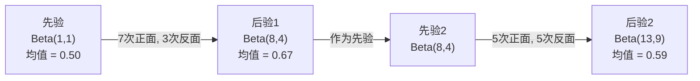

# 贝叶斯定理

> 概率是关于你预期的内容。贝叶斯定理是关于你学到的内容。

**类型：** 构建  
**语言：** Python  
**先决条件：** 第一阶段，第06课（概率基础）  
**时间：** 约75分钟

## 学习目标

- 运用贝叶斯定理从先验、似然和证据中计算后验概率
- 从零构建一个带拉普拉斯平滑和对数空间计算的朴素贝叶斯文本分类器
- 比较最大似然估计（MLE）和最大后验估计（MAP），并解释MAP如何对应于L2正则化
- 使用Beta-二项共轭先验实现顺序贝叶斯更新以进行A/B测试

## 问题描述

一种医疗检测准确率为99%。你检测呈阳性。你实际患病的概率有多大？

大多数人会说99%。真实答案取决于疾病的罕见程度。如果10,000人中只有1人患病，那么阳性结果只大约意味着1%的患病概率。其余99%的阳性结果是健康人的误报。

这不是一个陷阱问题。这就是贝叶斯定理。每一个垃圾邮件过滤器、每一个医疗诊断、每一个量化不确定性的机器学习模型都使用这种推理。你有一个初始信念，观察到证据，然后更新信念。

如果构建机器学习系统时不理解这点，你将误读模型输出，设置错误的阈值，发布过于自信的预测。

## 概念介绍

### 从联合概率到贝叶斯定理

你已经在第06课知道条件概率是：

```text
P(A|B) = P(A 和 B) / P(B)
```

对称地有：

```text
P(B|A) = P(A 和 B) / P(A)
```

两个表达式有相同的分子：P(A 和 B)。令它们相等并重排：

```text
P(A 和 B) = P(A|B) * P(B) = P(B|A) * P(A)

因此：

P(A|B) = P(B|A) * P(A) / P(B)
```

这就是贝叶斯定理。四个量，一个方程。

### 四个部分

| 部分 | 名称 | 意义 |
|------|------|---------------|
| P(A\|B) | 后验 | 看到证据B后对A的更新信念 |
| P(B\|A) | 似然 | 如果A为真，证据B出现的概率 |
| P(A) | 先验 | 看到证据前对A的信念 |
| P(B) | 证据 | 在所有可能下观察到B的总概率 |

证据项P(B)充当归一化因子。它可用全概率公式展开：

```text
P(B) = P(B|A) * P(A) + P(B|非A) * P(非A)
```

### 医疗检测示例

某疾病发病率是万分之一。检测准确率为99%（能检测出99%的病人，1%的时间会误报健康人为阳性）。

```text
P(患病)          = 0.0001     （先验：疾病罕见）
P(阳性|患病)     = 0.99       （似然：检测能检测出患病）
P(阳性|健康)     = 0.01       （误报率）

P(阳性) = P(阳性|患病) * P(患病) + P(阳性|健康) * P(健康)
        = 0.99 * 0.0001 + 0.01 * 0.9999
        = 0.000099 + 0.009999
        = 0.010098

P(患病|阳性) = P(阳性|患病) * P(患病) / P(阳性)
             = 0.99 * 0.0001 / 0.010098
             = 0.0098
             = 0.98%
```

低于1%。先验占主导地位。当条件罕见时，即使准确的检测，大多数阳性结果也是误报。这就是医生要求确认检测的原因。

### 垃圾邮件过滤示例

你收到一封包含“lottery（彩票）”一词的邮件。它是垃圾邮件吗？

```text
P(垃圾邮件)              = 0.3          （30%的邮件是垃圾邮件）
P("lottery"|垃圾邮件)    = 0.05         （5%的垃圾邮件含“lottery”）
P("lottery"|非垃圾邮件)  = 0.001        （0.1%的正常邮件含“lottery”）

P("lottery") = 0.05 * 0.3 + 0.001 * 0.7
             = 0.015 + 0.0007
             = 0.0157

P(垃圾邮件|"lottery") = 0.05 * 0.3 / 0.0157
                      = 0.955
                      = 95.5%
```

仅凭一个词，概率从30%跳到95.5%。真正的垃圾邮件过滤器会在数百个词上同时应用贝叶斯定理。

### 朴素贝叶斯：独立假设

朴素贝叶斯将其扩展到多特征，假设所有特征在给定类别条件下彼此独立：

```text
P(类别 | 特征_1, 特征_2, ..., 特征_n)
  = P(类别) * P(特征_1|类别) * P(特征_2|类别) * ... * P(特征_n|类别)
    / P(特征_1, 特征_2, ..., 特征_n)
```

“朴素”即独立假设。在文本中，单词出现并非独立（“New（纽约）”和“York（约克）”是相关的）。但在实践中，该假设表现惊人良好，因为分类器只需对类别排序，而不是产生校准概率。

由于分母对所有类别相同，故可跳过，仅比较分子：

```text
得分(类别) = P(类别) * 所有 P(特征_i | 类别) 的乘积
```

选择得分最高的类别。

### 最大似然估计（MLE）

如何从训练数据中获得 P(特征|类别)？计数。

```text
P("free"|垃圾邮件) = （垃圾邮件中包含“free”的数量）/（垃圾邮件总数）
```

这是MLE：选择使观测数据最可能的参数值。最大化似然函数，离散计数时即相对频率。

问题是：如果某词在训练垃圾邮件中未出现，MLE赋予它概率零。一个未见过的词将导致整个乘积为零。用拉普拉斯平滑解决：

```text
P(词|类别) = (计数(词, 类别) + 1) / (类别中总词数 + 词汇表大小)
```

每个计数加1确保概率不会为零。

### 最大后验估计（MAP）

MLE问：哪些参数最大化 P(数据|参数)？

MAP问：哪些参数最大化 P(参数|数据)？

根据贝叶斯定理：

```text
P(参数|数据) 与 P(数据|参数) * P(参数) 成正比
```

MAP在参数上加了先验。如果你相信参数应该较小，将这信念编码为一个惩罚大值的先验。这与机器学习中的L2正则化一致。岭回归中的“岭”惩罚即权重的高斯先验。

| 估计方法 | 优化目标 | 机器学习对应 |
|------------|-----------|---------------|
| MLE | P(数据\|参数) | 无正则训练 |
| MAP | P(数据\|参数) * P(参数) | L2 / L1 正则化 |

### 贝叶斯派 vs 频率派：实际差异

频率派视参数为固定未知量。他们问：“如果重复实验多次，会发生什么？”

贝叶斯派视参数为分布。他们问：“鉴于已观测数据，我对参数的信念是什么？”

构建机器学习系统的实际差异：

| 方面 | 频率派 | 贝叶斯派 |
|--------|-------------|----------|
| 输出 | 点估计 | 值的分布 |
| 不确定性 | 置信区间（关于过程） | 可信区间（关于参数） |
| 小数据 | 易过拟合 | 先验即正则化 |
| 计算 | 通常更快 | 通常需采样（MCMC） |

大多数生产环境机器学习倾向频率派（SGD，点估计）。贝叶斯方法在需要校准不确定性（医疗决策、安全关键系统）或数据稀缺（少样本学习、冷启动）时表现优异。

### 贝叶斯思维为何对机器学习重要

联系远不止类比：

**先验是正则化。** 权重的高斯先验就是L2正则化。拉普拉斯先验是L1。每次你添加正则项，都是在用贝叶斯陈述你的参数期望。

**后验是不确定性。** 单个预测概率不说明模型对该估计的置信度。贝叶斯方法给出分布：“我认为P(垃圾邮件)介于0.8到0.95之间。”

**贝叶斯更新是在线学习。** 今天的后验成为明天的先验。模型看到新数据时，增量更新信念，而非从零训练。

**模型比较是贝叶斯的。** 贝叶斯信息准则（BIC）、边际似然和贝叶斯因子利用贝叶斯推理，在不产生过拟合的情况下选择模型。

## 实战构建

### 步骤1：贝叶斯定理函数

```python
def bayes(prior, likelihood, false_positive_rate):
    evidence = likelihood * prior + false_positive_rate * (1 - prior)
    posterior = likelihood * prior / evidence
    return posterior

result = bayes(prior=0.0001, likelihood=0.99, false_positive_rate=0.01)
print(f"P(sick|positive) = {result:.4f}")
```

### 步骤2：朴素贝叶斯分类器

```python
import math
from collections import defaultdict

class NaiveBayes:
    def __init__(self, smoothing=1.0):
        self.smoothing = smoothing
        self.class_counts = defaultdict(int)
        self.word_counts = defaultdict(lambda: defaultdict(int))
        self.class_word_totals = defaultdict(int)
        self.vocab = set()

    def train(self, documents, labels):
        for doc, label in zip(documents, labels):
            self.class_counts[label] += 1
            words = doc.lower().split()
            for word in words:
                self.word_counts[label][word] += 1
                self.class_word_totals[label] += 1
                self.vocab.add(word)

    def predict(self, document):
        words = document.lower().split()
        total_docs = sum(self.class_counts.values())
        vocab_size = len(self.vocab)
        best_class = None
        best_score = float("-inf")
        for cls in self.class_counts:
            score = math.log(self.class_counts[cls] / total_docs)
            for word in words:
                count = self.word_counts[cls].get(word, 0)
                total = self.class_word_totals[cls]
                score += math.log((count + self.smoothing) / (total + self.smoothing * vocab_size))
            if score > best_score:
                best_score = score
                best_class = cls
        return best_class
```

对数概率防止下溢。乘积多个极小概率会生成浮点数精度无法表示的小数；求和对数概率数值稳定且数学等价。

### 步骤3：在垃圾邮件数据上训练

```python
train_docs = [
    "win free money now",
    "free lottery ticket winner",
    "claim your prize today free",
    "urgent offer free cash",
    "congratulations you won free",
    "meeting tomorrow at noon",
    "project update attached",
    "can we schedule a call",
    "quarterly report review",
    "lunch on thursday sounds good",
    "team standup notes attached",
    "please review the pull request",
]

train_labels = [
    "spam", "spam", "spam", "spam", "spam",
    "ham", "ham", "ham", "ham", "ham", "ham", "ham",
]

classifier = NaiveBayes()
classifier.train(train_docs, train_labels)

test_messages = [
    "free money waiting for you",
    "meeting rescheduled to friday",
    "you won a free prize",
    "please review the attached report",
]

for msg in test_messages:
    print(f"  '{msg}' -> {classifier.predict(msg)}")
```

### 步骤4：检查学习到的概率分布

```python
def show_top_words(classifier, cls, n=5):
    vocab_size = len(classifier.vocab)
    total = classifier.class_word_totals[cls]
    probs = {}
    for word in classifier.vocab:
        count = classifier.word_counts[cls].get(word, 0)
        probs[word] = (count + classifier.smoothing) / (total + classifier.smoothing * vocab_size)
    sorted_words = sorted(probs.items(), key=lambda x: x[1], reverse=True)
    for word, prob in sorted_words[:n]:
        print(f"    {word}: {prob:.4f}")

print("\nTop spam words:")
show_top_words(classifier, "spam")
print("\nTop ham words:")
show_top_words(classifier, "ham")
```

## 使用它

Scikit-learn 提供了生产就绪的朴素贝叶斯（naive Bayes）实现：

```python
from sklearn.feature_extraction.text import CountVectorizer
from sklearn.naive_bayes import MultinomialNB
from sklearn.metrics import classification_report

vectorizer = CountVectorizer()
X_train = vectorizer.fit_transform(train_docs)
clf = MultinomialNB()
clf.fit(X_train, train_labels)

X_test = vectorizer.transform(test_messages)
predictions = clf.predict(X_test)
for msg, pred in zip(test_messages, predictions):
    print(f"  '{msg}' -> {pred}")
```

同一个算法。CountVectorizer 负责分词和构建词汇表。MultinomialNB 内部处理平滑（smoothing）和对数概率。你自己用40行代码实现的版本做的也是同样的事。

## 部署它

此处构建的 NaiveBayes 类演示了完整流程：分词、使用拉普拉斯平滑（Laplace smoothing）进行概率估计、对数空间（log-space）预测。`code/bayes.py` 中的代码无需 Python 标准库外的依赖即可端到端运行。

### 共轭先验（Conjugate Priors）

当先验（prior）和后验（posterior）属于同一族分布时，这个先验称为“共轭先验”。这使得贝叶斯更新代数上简洁 — 你能得到封闭形式的后验，免于数值积分。

| 似然函数（Likelihood） | 共轭先验（Conjugate Prior） | 后验（Posterior） | 示例（Example） |
|-----------------------|----------------------------|-------------------|-----------------|
| Bernoulli             | Beta(a, b)                 | Beta(a + 成功次数, b + 失败次数) | 投币偏差估计 |
| 正态分布（方差已知） (Normal) | 正态分布 Normal(mu_0, sigma_0)   | 正态分布（加权平均，较小方差）        | 传感器校准     |
| 泊松分布（Poisson）   | Gamma(a, b)                | Gamma(a + 计数和, b + 样本数)       | 到达速率建模   |
| 多项式分布（Multinomial）   | Dirichlet(alpha)              | Dirichlet(alpha + 计数)              | 主题建模、语言模型 |

重要原因：没有共轭先验时，需要蒙特卡洛采样（Monte Carlo sampling）或变分推断（variational inference）来近似后验。有共轭先验时，仅需更新两个数字。

Beta 分布是最常见的共轭先验。Beta(a, b) 表示你对概率参数的信念。均值为 a/(a+b)。a+b 越大，分布越集中（置信度越高）。

Beta 先验的特殊情况：
- Beta(1, 1) = 均匀分布。你对参数没有偏好。
- Beta(10, 10) = 在0.5处峰值。你强烈相信参数接近0.5。
- Beta(1, 10) = 偏向于0。你认为参数较小。

更新规则非常简单：

```text
先验：     Beta(a, b)
数据：     s 次成功，f 次失败
后验：     Beta(a + s, b + f)
```

没有积分，没有采样，只有加法。

### 顺序贝叶斯更新（Sequential Bayesian Updating）

贝叶斯推断天然具有顺序性。今天的后验成为明天的先验。这就是实际系统如何增量学习而不重复处理所有历史数据的方式。

具体示例：估计一枚硬币是否公正。

**第1天：无数据。**  
从 Beta(1, 1) 开始 —— 一个均匀先验。你没有偏见。  
- 先验均值：0.5  
- 先验在[0, 1]上平坦

**第2天：观察到7次正面，3次反面。**  
后验 = Beta(1 + 7, 1 + 3) = Beta(8, 4)  
- 后验均值：8/12 = 0.667  
- 证据表明硬币偏向正面

**第3天：观察到5次正面，5次反面。**  
把昨天的后验作为今天的先验。  
后验 = Beta(8 + 5, 4 + 5) = Beta(13, 9)  
- 后验均值：13/22 = 0.591  
- 新的均衡数据使估计偏向0.5回落



观察顺序不影响结果。Beta(1,1) 一次性用12次正面和8次反面更新，结果也是 Beta(13, 9)。顺序更新和批量更新数学等价。但顺序更新允许你在每一步做决策而无需存储原始数据。

这就是生产机器学习系统中在线学习（online learning）的基础。多臂老虎机算法（Thompson sampling）、增量推荐系统、流数据异常检测都采用这一模式。

### 与 A/B 测试的联系

A/B 测试本质上是贝叶斯推断的变体。

场景：你在测试两种按钮颜色。A变体（蓝色）和B变体（绿色）。你想知道哪个点击率更高。

贝叶斯 A/B 测试流程：

1. **先验。** 两个变体都设 Beta(1, 1)，无明显偏好。
2. **数据。** A变体：1000次展示中50次点击。B变体：1000次展示中65次点击。
3. **后验。**  
   - A: Beta(1 + 50, 1 + 950) = Beta(51, 951)，均值 = 0.051  
   - B: Beta(1 + 65, 1 + 935) = Beta(66, 936)，均值 = 0.066  
4. **决策。** 计算 P(B > A) — B的真实转化率高于A的概率。

解析计算 P(B > A) 很困难，但蒙特卡洛方法非常简单：

```text
1. 从 Beta(51, 951) 中采样100,000次 -> samples_A
2. 从 Beta(66, 936) 中采样100,000次 -> samples_B
3. P(B > A) = samples_B > samples_A 的比例
```

若 P(B > A) > 0.95，发布B变体；若介于0.05和0.95之间，继续收集数据；若 P(B > A) < 0.05，发布A变体。

相比频率主义（frequentist）A/B测试的优势：
- 直接获得概率陈述：“B比A好有97%的概率”
- 无需 p 值混淆，无“未能拒绝原假设”的模糊语言
- 可以随时检查结果，不会增加假阳性率（无“窥探问题”）
- 可纳入先验知识（如之前测试表明转化率通常在3-8%）

| 方面               | 频率主义 A/B 测试 | 贝叶斯 A/B 测试      |
|------------------|----------------|-------------------|
| 输出               | p 值            | P(B > A)           |
| 解释               | “数据在A=B时有多罕见？” | “B比A好的可能性有多大？”  |
| 提前停止           | 增加假阳性率       | 任何时刻安全（在选择良好先验与正确模型前提下） |
| 先验知识           | 不使用           | 表达为 Beta 先验       |
| 决策规则           | p < 0.05       | P(B > A) > 阈值      |

## 练习

1. **多次检测。** 一名患者经过两次独立检测（两种检测均准确率为99%，疾病患病率为万分之一）均呈阳性，两次检测后患病概率为多少？用第一次检测的后验作为第二次的先验。

2. **平滑影响。** 用平滑系数分别为0.01、0.1、1.0和10.0运行垃圾邮件分类器。各词概率最高的词发生怎样变化？当平滑=0且某词只出现于正常邮件（ham）时会发生什么？

3. **添加特征。** 扩展 NaiveBayes 类，除了词频还使用消息长度（短/长）作为特征。从训练数据估计 P(short|spam) 和 P(short|ham)，并将其纳入预测分数。

4. **手动计算 MAP。** 给定观察数据（10次投币中7次正面），使用Beta(2,2)先验计算偏差的最大后验估计（MAP）。比较其与最大似然估计（MLE，7/10）的差异。

## 关键词

| 术语            | 常见说法                   | 实际含义                                         |
|-----------------|--------------------------|------------------------------------------------|
| 先验（Prior）     | “我的初始猜测”             | 在观察证据前的 P(假设)。在机器学习中是正则化项。               |
| 似然（Likelihood） | “数据有多符合假设”          | P(证据\|假设)。具体假设下数据出现的概率。                     |
| 后验（Posterior）  | “我的更新信念”             | P(假设\|证据)。先验乘以似然后归一化。                       |
| 证据（Evidence）   | “归一化常数”               | 对所有假设的 P(数据)。保证后验和为1。                       |
| 朴素贝叶斯（Naive Bayes） | “那个简单文本分类器”          | 假设特征在类别条件下独立的分类器。尽管假设不成立，但效果好。          |
| 拉普拉斯平滑（Laplace smoothing） | “加1平滑”                   | 给每个特征计数加一个小数，防止未见数据概率为零。                  |
| 最大似然估计（MLE）  | “用频率估计”                | 选参数使 P(数据\|参数)最大。无先验，易在小数据上过拟合。              |
| 最大后验估计（MAP）  | “带先验的 MLE”              | 选参数使 P(数据\|参数)*P(参数) 最大。等价于正则化的 MLE。             |
| 对数概率（Log-probability） | “在对数空间里运算”            | 用 log(P) 避免浮点数下溢，尤其是乘很多小概率时。                   |
| 假阳性（False positive） | “误报”                      | 测试结果为阳性，但真实状态为阴性。导致基率谬误。                     |

## 相关阅读

- [3Blue1Brown: 贝叶斯定理](https://www.youtube.com/watch?v=HZGCoVF3YvM) — 使用医疗检测示例进行的直观讲解
- [斯坦福 CS229：生成学习算法](https://cs229.stanford.edu/notes2022fall/cs229-notes2.pdf) — 朴素贝叶斯及其与判别模型的联系
- [Think Bayes](https://greenteapress.com/wp/think-bayes/) — 免费书籍，带 Python 代码的贝叶斯统计入门
- [scikit-learn 朴素贝叶斯](https://scikit-learn.org/stable/modules/naive_bayes.html) — 生产实现及各变体的使用场景介绍
