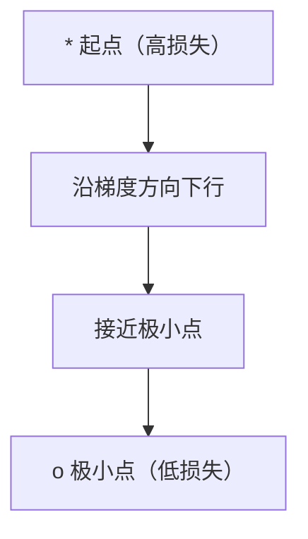
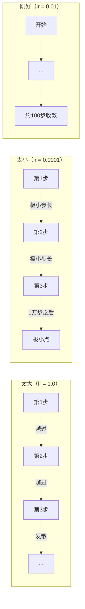
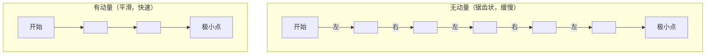
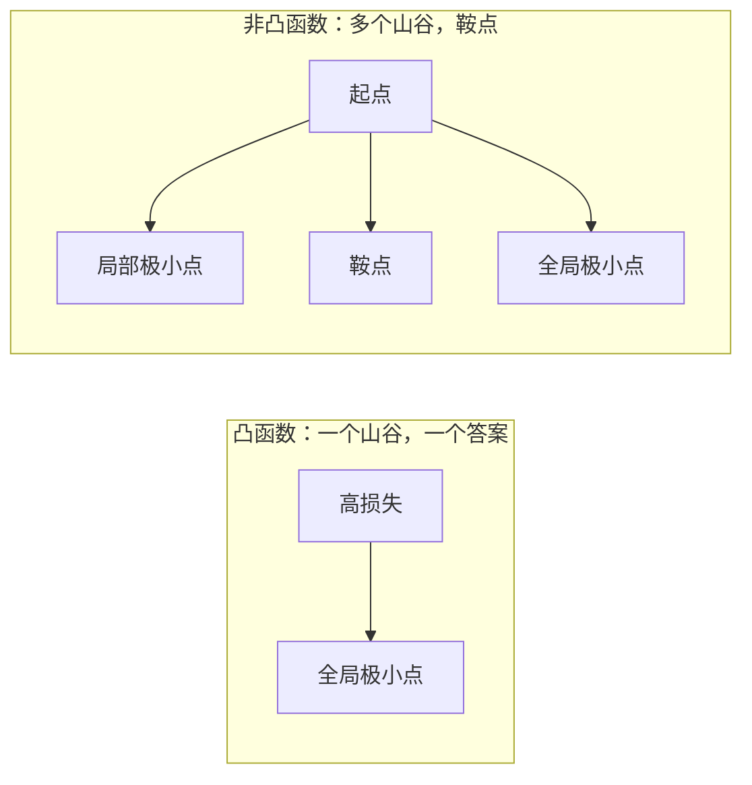
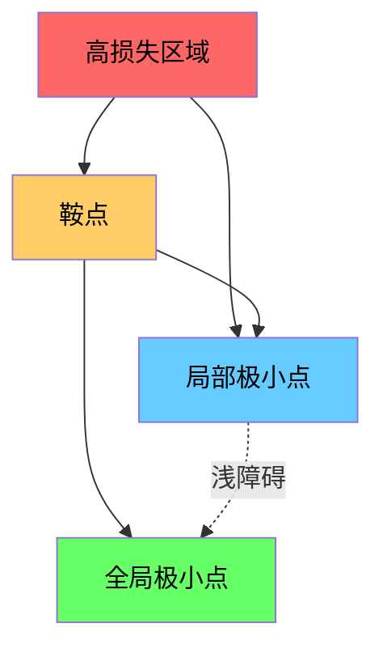

# 优化

> 训练神经网络不过是在找谷底。

**类型：** 构建  
**语言：** Python  
**先决条件：** 第一阶段，第04-05课（导数，梯度）  
**时间：** 约75分钟

## 学习目标

- 从零实现基础梯度下降（vanilla gradient descent）、带动量的随机梯度下降（SGD with momentum）和 Adam
- 对比优化器在 Rosenbrock 函数上的收敛性，并解释为什么 Adam 会针对每个权重自适应调整学习率
- 区分凸损失函数与非凸损失函数，并解释鞍点（saddle points）在高维空间中的作用
- 配置学习率调度器（阶梯衰减、余弦退火、预热）以实现训练稳定性

## 问题

你有一个损失函数，它告诉你模型有多糟糕。你有梯度，它告诉你哪个方向会让损失变得更糟。现在你需要一个策略往下山走。

最简单的办法就是：沿梯度相反方向移动。把步长乘以一个叫学习率（learning rate）的数。然后重复。这就是梯度下降，它确实有效。但“有效”有条件。学习率太大，你会完全越过谷底，在两壁之间来回弹跳；太小则会爬行，浪费数千个不必要的步骤。撞上鞍点时，你甚至没找到极小点却停下来不动了。

深度学习中每个优化器的核心问题都是：怎样更快更稳地找到谷底？

## 概念

### 什么是优化

优化是寻找使函数最小化（或最大化）的输入。在机器学习中，函数是损失，输入是模型权重。训练即是优化。

```text
minimize L(w) 其中：
  L = 损失函数
  w = 模型权重（可能是百万级参数）
```

### 梯度下降（vanilla）

最简单的优化器。计算损失对每个权重的梯度。沿梯度反方向调整权重。步长乘以学习率。

```text
w = w - lr * gradient
```

这就是整个算法，一行代码。



### 学习率：最重要的超参数

学习率控制步长大小。它决定所有关于收敛的表现。



没有公式能直接告诉你正确的学习率。你要通过实验确定。常用起点是 Adam 的 0.001，SGD 带动量的 0.01。

### SGD、批量梯度下降与小批量梯度下降的区别

基础梯度下降计算全数据集梯度再做一步。这叫批量梯度下降（batch gradient descent）。稳定但慢。

随机梯度下降（SGD）在单个随机样本上计算梯度并立即更新。噪声大但快。

小批量梯度下降折中做法。用小批量（32、64、128、256个样本）计算梯度再更新。这是实际应用中最常见的做法。

| 变体       | 批量大小    | 梯度质量     | 每步速度 | 噪声  |
|------------|-------------|--------------|----------|-------|
| 批量梯度下降 | 整个数据集  | 精确         | 慢       | 无    |
| SGD        | 1个样本     | 非常嘈杂     | 快       | 高    |
| 小批量     | 32-256样本  | 良好估计     | 平衡     | 中等  |

SGD 和小批量带来的噪声不是缺陷。它帮助模型逃离浅局部极小点和鞍点。

### 动量：滚动的球

基础梯度下降只考虑当前梯度。如果梯度左右摇摆（常见于窄谷），收敛会很慢。动量通过累积过去梯度作为速度，解决这个问题。

```text
v = beta * v + gradient
w = w - lr * v
```

比喻来说：像一个滚下坡的球，不会遇到小颠簸时停下来再启动。它把持续方向的速度累积起来，减缓震荡。



`beta`（通常 0.9）控制历史权重。越大动量越强，路径越平滑，但对方向变动反应越慢。

### Adam：自适应学习率

不同的权重需要不同的学习率。少收到大梯度的权重遭遇梯度时应迈更大步；常被大梯度影响的权重应迈更小步。

Adam（Adaptive Moment Estimation，自适应矩估计）为每个权重跟踪两项内容：

1. 一阶矩（m）：梯度的运行平均（类似动量）
2. 二阶矩（v）：梯度平方的运行平均（梯度幅度）

```text
m = beta1 * m + (1 - beta1) * gradient
v = beta2 * v + (1 - beta2) * gradient^2

m_hat = m / (1 - beta1^t)    偏差纠正
v_hat = v / (1 - beta2^t)    偏差纠正

w = w - lr * m_hat / (sqrt(v_hat) + epsilon)
```

除以 `sqrt(v_hat)` 是关键。大梯度权重除以大数（有效步长小），小梯度权重除以小数（有效步长大）。每个权重都有自适应学习率。

默认超参数：`lr=0.001, beta1=0.9, beta2=0.999, epsilon=1e-8`。大部分问题这些默认值表现良好。

### 学习率调度器

固定学习率是折衷。训练初期需大步长快速前进；训练后期需小步长微调至极小点附近。

常见调度器：

| 调度策略     | 公式                                        | 使用场景            |
|--------------|---------------------------------------------|---------------------|
| 阶梯衰减     | 每N个epoch乘以某个因子                        | 简单，手动控制      |
| 指数衰减     | lr = lr_0 * decay^t                          | 平滑减小            |
| 余弦退火     | lr = lr_min + 0.5 * (lr_max - lr_min) * (1 + cos(pi * t / T)) | Transformer，现代训练 |
| 预热+衰减   | 线性预热后再衰减                             | 大模型，避免早期不稳定 |

### 凸函数与非凸函数

凸函数只有一个极小点，梯度下降一定能找到它。类似二次函数 `f(x) = x^2` 是凸函数。

神经网络的损失函数是非凸的。它有多个局部极小点、鞍点和平坦区域。



实践中，高维神经网络的局部极小点通常不会是问题。大多数局部极小点的损失接近全局极小点。真正的障碍是鞍点（某些方向平坦，某些方向曲折）。动量和小批量噪声有助于跳出鞍点。

### 损失地形可视化

损失是所有权重的函数。一个有百万参数的模型，损失地形存在于 1000001 维空间。我们通过在权重空间随机选两个方向并绘制这两个方向上的损失，得到二维的损失曲面。



尖锐极小点泛化能力差。平坦极小点泛化能力好。这也是为什么带动量的 SGD 往往在最终测试精度上胜过 Adam 的原因之一：它的噪声阻止收敛到尖锐极小点。

## 实践

### 第1步：定义测试函数

Rosenbrock 函数是经典优化基准。其极小点在 (1, 1)，位于一个狭长弯曲的谷中，容易找到但难以沿着谷底精确追踪。

```text
f(x, y) = (1 - x)^2 + 100 * (y - x^2)^2
```

```python
def rosenbrock(params):
    x, y = params
    return (1 - x) ** 2 + 100 * (y - x ** 2) ** 2

def rosenbrock_gradient(params):
    x, y = params
    df_dx = -2 * (1 - x) + 200 * (y - x ** 2) * (-2 * x)
    df_dy = 200 * (y - x ** 2)
    return [df_dx, df_dy]
```

### 第2步：基础梯度下降

```python
class GradientDescent:
    def __init__(self, lr=0.001):
        self.lr = lr

    def step(self, params, grads):
        return [p - self.lr * g for p, g in zip(params, grads)]
```

### 第3步：带动量的 SGD

```python
class SGDMomentum:
    def __init__(self, lr=0.001, momentum=0.9):
        self.lr = lr
        self.momentum = momentum
        self.velocity = None

    def step(self, params, grads):
        if self.velocity is None:
            self.velocity = [0.0] * len(params)
        self.velocity = [
            self.momentum * v + g
            for v, g in zip(self.velocity, grads)
        ]
        return [p - self.lr * v for p, v in zip(params, self.velocity)]
```

### 第4步：Adam

```python
class Adam:
    def __init__(self, lr=0.001, beta1=0.9, beta2=0.999, epsilon=1e-8):
        self.lr = lr
        self.beta1 = beta1
        self.beta2 = beta2
        self.epsilon = epsilon
        self.m = None
        self.v = None
        self.t = 0

    def step(self, params, grads):
        if self.m is None:
            self.m = [0.0] * len(params)
            self.v = [0.0] * len(params)

        self.t += 1

        self.m = [
            self.beta1 * m + (1 - self.beta1) * g
            for m, g in zip(self.m, grads)
        ]
        self.v = [
            self.beta2 * v + (1 - self.beta2) * g ** 2
            for v, g in zip(self.v, grads)
        ]

        m_hat = [m / (1 - self.beta1 ** self.t) for m in self.m]
        v_hat = [v / (1 - self.beta2 ** self.t) for v in self.v]

        return [
            p - self.lr * mh / (vh ** 0.5 + self.epsilon)
            for p, mh, vh in zip(params, m_hat, v_hat)
        ]
```

### 第5步：运行并比较

```python
def optimize(optimizer, func, grad_func, start, steps=5000):
    params = list(start)
    history = [params[:]]
    for _ in range(steps):
        grads = grad_func(params)
        params = optimizer.step(params, grads)
        history.append(params[:])
    return history

start = [-1.0, 1.0]

gd_history = optimize(GradientDescent(lr=0.0005), rosenbrock, rosenbrock_gradient, start)
sgd_history = optimize(SGDMomentum(lr=0.0001, momentum=0.9), rosenbrock, rosenbrock_gradient, start)
adam_history = optimize(Adam(lr=0.01), rosenbrock, rosenbrock_gradient, start)

for name, history in [("GD", gd_history), ("SGD+M", sgd_history), ("Adam", adam_history)]:
    final = history[-1]
    loss = rosenbrock(final)
    print(f"{name:6s} -> x={final[0]:.6f}, y={final[1]:.6f}, loss={loss:.8f}")
```

期望输出：Adam 收敛最快。带动量的 SGD 轨迹更加平滑。普通的 GD 在狭窄谷底缓慢前进。

## 使用方法

在实践中，使用 PyTorch 或 JAX 优化器。它们支持参数组（parameter groups）、权重衰减（weight decay）、梯度裁剪（gradient clipping）和 GPU 加速。

```python
import torch

model = torch.nn.Linear(784, 10)

sgd = torch.optim.SGD(model.parameters(), lr=0.01, momentum=0.9)
adam = torch.optim.Adam(model.parameters(), lr=0.001)
adamw = torch.optim.AdamW(model.parameters(), lr=0.001, weight_decay=0.01)

scheduler = torch.optim.lr_scheduler.CosineAnnealingLR(adam, T_max=100)
```

经验法则：

- 从 Adam（lr=0.001）开始。它对大多数问题都有效，几乎不需调参。
- 当需要最佳最终准确率且能投入更多调参时，改用带动量的 SGD（lr=0.01，momentum=0.9）。
- 对 Transformer（Transformer 架构）使用 AdamW（带解耦权重衰减的 Adam）。
- 训练超过几个 epoch 时，务必使用学习率调度（learning rate schedule）。
- 若训练不稳定，降低学习率；若训练太慢，提升学习率。

## 部署

本课生成了一个选择合适优化器的提示。见 `outputs/prompt-optimizer-guide.md`。

此处构建的优化器类将在第三阶段中重新出现，用于从零训练神经网络。

## 练习

1. **学习率扫描。** 在 Rosenbrock 函数上使用普通梯度下降，尝试学习率 [0.0001, 0.0005, 0.001, 0.005, 0.01]。绘制或打印每个学习率下 5000 步后的最终损失。找出仍能收敛的最大学习率。

2. **动量比较。** 在 Rosenbrock 函数上使用带动量的 SGD，尝试动量值 [0.0, 0.5, 0.9, 0.99]。记录每步损失。哪个动量值收敛最快？哪个会过冲？

3. **鞍点逃逸。** 定义函数 `f(x, y) = x^2 - y^2`（原点处有鞍点）。从 (0.01, 0.01) 开始。比较 vanilla GD、带动量 SGD 和 Adam 的表现。哪个能逃出鞍点？

4. **实现学习率衰减。** 在 GradientDescent 类中添加指数衰减调度：`lr = lr_0 * 0.999^step`。比较有无衰减时在 Rosenbrock 函数上的收敛情况。

## 关键词

| 术语 | 常见描述 | 实际含义 |
|------|----------|----------|
| Gradient descent | “向下坡走” | 按梯度乘以学习率的比例更新权重。最基础的优化器。 |
| Learning rate | “步长” | 控制每次更新权重距离的标量。过大导致发散，过小浪费计算。 |
| Momentum | “持续滚动” | 累积过去的梯度形成速度向量。抑制振荡，沿一致方向加速。 |
| SGD | “随机采样” | 随机梯度下降。在随机子集上计算梯度，而非全数据。实践中通常指小批量 SGD。 |
| Mini-batch | “一块数据” | 训练数据的小子集（32-256样本），用来估计梯度。平衡速度和梯度准确度。 |
| Adam | “默认优化器” | 自适应矩估计。跟踪每个权重的梯度和平方梯度的移动平均，给予个别学习率。 |
| Bias correction | “修正冷启动” | Adam 的一二阶矩初始化为零。偏差校正通过除以 (1 - beta^t) 弥补早期偏差。 |
| Learning rate schedule | “动态调整学习率” | 训练过程中调整学习率的函数。前期大步长，后期小步长。 |
| Convex function | “单谷” | 任意局部最小即全局最小的函数。梯度下降必能找到。神经网络损失非凸。 |
| Saddle point | “平坦但非最小点” | 梯度为零的点，部分方向为极小，部分为极大。高维空间常见。 |
| Loss landscape | “损失地形” | 损失函数在权重空间的分布。通过随机两个方向切片可视化。 |
| Convergence | “收敛” | 优化器达到不再显著降低损失的状态。 |

## 延伸阅读

- [Sebastian Ruder: An overview of gradient descent optimization algorithms](https://ruder.io/optimizing-gradient-descent/) - 全面综述主要优化算法
- [Why Momentum Really Works (Distill)](https://distill.pub/2017/momentum/) - 动量动力学的交互式可视化
- [Adam: A Method for Stochastic Optimization (Kingma & Ba, 2014)](https://arxiv.org/abs/1412.6980) - 经典的 Adam 论文，易读且简短
- [Visualizing the Loss Landscape of Neural Nets (Li et al., 2018)](https://arxiv.org/abs/1712.09913) - 展示尖锐和平坦极小值的论文
