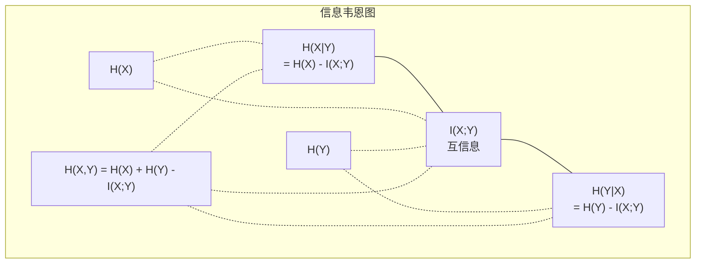

# 信息论（Information Theory）

> 信息论衡量惊讶度。损失函数基于此构建。

**类型：** 学习  
**语言：** Python  
**前置知识：** 第一阶段，第06课（概率）  
**时间：** 约60分钟

## 学习目标

- 从零开始计算熵（entropy）、交叉熵（cross-entropy）和KL散度（KL divergence），并解释它们之间的关系  
- 推导为什么最小化交叉熵损失等价于最大化对数似然  
- 计算特征与目标之间的互信息（mutual information），以评估特征重要性  
- 解释困惑度（perplexity）作为语言模型实际选择的有效词汇量  

## 问题描述

你在每个分类模型中都会调用`CrossEntropyLoss()`。你看到每篇语言模型论文里都有“困惑度”。你读到变分自编码器（VAEs）、蒸馏（distillation）和基于人类反馈的强化学习（RLHF）中都提到了KL散度。这些看似不同的概念，本质上是同一思想的不同表现形式。

信息论为你提供了推理不确定性、压缩与预测的语言。1948年，Claude Shannon发明了信息论来解决通信问题。其实，训练神经网络也是一个通信问题：模型试图通过有噪声的权重通道传递正确的标签。

本课从零开始构建每个公式，让你明白它们的来源及作用。

## 基本概念

### 信息内容（惊讶度）

当某件不太可能发生的事情发生时，它携带更多信息。硬币落地是正面？不惊讶。中大奖？非常惊讶。

某事件概率为p时的信息内容为：

```text
I(x) = -log(p(x))
```

以2为底的对数给出bit（比特）为单位；以自然对数为底给出nat（纳特）为单位。同一个道理，不同单位。

```text
事件                概率（Probability）     惊讶度（bits）
公平硬币出正面      0.5                   1.0
掷出6点            0.167                 2.58
千分之一事件       0.001                 9.97
确定事件            1.0                   0.0
```

确定事件携带零信息，因为你已经知道它会发生。

### 熵（平均惊讶度）

熵是概率分布中所有可能结果的期望惊讶度。

```text
H(P) = -sum( p(x) * log(p(x)) )  对所有 x 求和
```

公平硬币对于二元变量具有最大熵：1比特。偏置硬币（99%正面）熵很低：0.08比特。你几乎已经知道结果，每次掷币几乎不提供信息。

```text
公平硬币：    H = -(0.5 * log2(0.5) + 0.5 * log2(0.5)) = 1.0 bit
偏置硬币：    H = -(0.99 * log2(0.99) + 0.01 * log2(0.01)) = 0.08 bits
```

熵度量分布中的不可约不确定性。无法压缩信息量低于熵。

### 交叉熵（你每天使用的损失函数）

交叉熵衡量在用分布Q编码实际上来自分布P的事件时的平均惊讶。

```text
H(P, Q) = -sum( p(x) * log(q(x)) )  对所有 x 求和
```

P是真实分布（标签），Q是模型预测。如果Q和P完全匹配，交叉熵等于熵；任何差异都会使交叉熵增大。

在分类中，P是独热向量（真实类别概率为1，其余为0），交叉熵简化为：

```text
H(P, Q) = -log(q(true_class))
```

这就是分类交叉熵损失的全部公式。最大化正确类别的预测概率。

### KL散度（分布间的距离）

KL散度衡量使用Q代替P时额外的惊讶量。

```text
D_KL(P || Q) = sum( p(x) * log(p(x) / q(x)) )  对所有 x 求和
             = H(P, Q) - H(P)
```

交叉熵是熵加上KL散度。由于真实分布的熵在训练中是常数，最小化交叉熵等价于最小化KL散度。你在让模型分布趋近于真实分布。

KL散度不对称：D_KL(P || Q) ≠ D_KL(Q || P)，不是一个真正的距离度量。

### 互信息

互信息衡量知道一个变量能减少对另一个变量多少不确定性。

```text
I(X; Y) = H(X) - H(X|Y)
        = H(X) + H(Y) - H(X, Y)
```

若X和Y独立，则互信息为0，知道一个变量对另一个无信息；若完全相关，互信息等于任一变量的熵。

在特征选择中，特征与目标之间高互信息意味着该特征有用。低互信息表示该特征是噪声。

### 条件熵

H(Y|X) 衡量在已知X的情况下，对Y的剩余不确定性。

```text
H(Y|X) = H(X,Y) - H(X)
```

两种极端情况：
- 若X完全决定Y，则H(Y|X) = 0，知道X消除所有关于Y的不确定性。例如：X = 摄氏温度，Y = 华氏温度。  
- 若X对Y毫无信息，H(Y|X) = H(Y)，知道X不减少Y的任何不确定性。例如：X = 掷硬币结果，Y = 明天天气。

条件熵始终非负且不会超过H(Y):

```text
0 <= H(Y|X) <= H(Y)
```

在机器学习中，条件熵常用于决策树，每次分裂选取使H(Y|X)最小的特征X——即最大程度降低标签Y不确定性的特征。

### 联合熵

H(X,Y) 是X和Y联合分布的熵。

```text
H(X,Y) = -sum sum p(x,y) * log(p(x,y))   对所有 x, y 求和
```

关键性质：

```text
H(X,Y) <= H(X) + H(Y)
```

当X和Y独立时取等号；如果共享信息，则联合熵小于各自熵之和。差值正是互信息。



关系总结：
- H(X,Y) = H(X) + H(Y|X) = H(Y) + H(X|Y)  
- I(X;Y) = H(X) - H(X|Y) = H(Y) - H(Y|X)  
- H(X,Y) = H(X) + H(Y) - I(X;Y)  

### 互信息（深入讲解）

互信息 I(X;Y) 定量说明知道一个变量能减少对另一个变量多少不确定性。

```text
I(X;Y) = H(X) - H(X|Y)
       = H(Y) - H(Y|X)
       = H(X) + H(Y) - H(X,Y)
       = sum sum p(x,y) * log(p(x,y) / (p(x) * p(y)))
```

性质：  
- I(X;Y) ≥ 0，观察永远不会失去信息。  
- 当且仅当X和Y独立时，I(X;Y) = 0。  
- I(X;Y) = I(Y;X)，对称性（不同于KL散度）。  
- I(X;X) = H(X)。变量与自身共享所有信息。

**互信息用于特征选择。** 在机器学习中，我们想选与目标变量信息量大的特征。互信息提供了有原则的特征排名方法：

1. 计算每个特征X_i与目标Y的互信息I(X_i; Y)。  
2. 按互信息分数排序特征。  
3. 保留排名靠前的k个特征。

该方法适用于特征与目标之间的任何关系 —— 线性、非线性、单调或非单调。相关系数只能捕捉线性关系，而互信息能捕捉所有形式的依赖。

| 方法            | 探测能力           | 计算成本           | 支持类别变量？      |
|-----------------|--------------------|--------------------|--------------------|
| Pearson相关系数 | 线性关系           | O(n)               | 否                 |
| Spearman相关系数| 单调关系           | O(n log n)         | 否                 |
| 互信息           | 任意统计依赖       | O(n log n)（带分箱）| 是                 |

### 标签平滑与交叉熵

标准分类使用硬标签（hard targets）：[0, 0, 1, 0]。真实类别概率为1，其它类别概率为0。标签平滑用软标签替代硬标签：

```text
soft_target = (1 - epsilon) * hard_target + epsilon / num_classes
```

以ε=0.1和4类别为例：  
- 硬标签：  [0, 0, 1, 0]  
- 软标签：  [0.025, 0.025, 0.925, 0.025]

从信息论角度看，标签平滑增加了目标分布的熵。硬独热标签熵为0——无不确定性；软标签有正的熵值。

其好处包括：  
- 防止模型驱动logits到极端值（无限大logits才能完全匹配独热标签下的交叉熵）  
- 起到正则化作用：模型无法做到100%自信  
- 改善校准：预测概率更真实反映不确定性  
- 缩小训练与推理行为差距

带标签平滑的交叉熵损失变成：

```text
L = (1 - epsilon) * CE(hard_target, prediction) + epsilon * H_uniform(prediction)
```

第二项惩罚与均匀预测相差过大的情况——对模型自信度的直接正则化。

### 为什么交叉熵是分类损失函数的王者？

三种视角，同一结论。

**信息论视角。** 交叉熵衡量用模型预测分布代替真实分布时浪费了多少比特，最小化交叉熵使模型成为现实的最优编码器。

**最大似然视角。** 对N个训练样本的真实类别 y_i：

```text
似然函数      = ∏ q(y_i)
对数似然函数  = ∑ log(q(y_i))
负对数似然    = -∑ log(q(y_i))
```

最后一式即交叉熵损失。最小化交叉熵等价于最大化训练数据在模型下的似然。

**梯度视角。** 交叉熵对logits的梯度是（预测值 - 真实值）。计算简单稳定快速，完美匹配softmax。

### 比特（bits）与纳特（nats）

唯一区别是对数的底数。

```text
以2为底   -> bits      （信息论传统单位）
以e为底   -> nats      （机器学习惯例）
以10为底  -> hartleys  （极少使用）
```

1 nat = 1/ln(2) bits ≈ 1.4427 bits。PyTorch和TensorFlow默认用自然对数（nats）。

### 困惑度（Perplexity）

困惑度是交叉熵的指数。它告诉你模型在候选项中面临多大程度的迷惑。

```text
困惑度 = 2^H(P,Q)   （若用bits）
困惑度 = e^H(P,Q)   （若用nats）
```

语言模型困惑度50，意味着它平均上像从50个可能的下一个token中均匀选择一样困惑。数值越低越好。

GPT-2在常用基准测试上的困惑度约为30，现代模型在丰富领域的困惑度已经降至个位数。

## 实现步骤

### 第1步：信息内容与熵

```python
import math

def information_content(p, base=2):
    if p <= 0 or p > 1:
        return float('inf') if p <= 0 else 0.0
    return -math.log(p) / math.log(base)

def entropy(probs, base=2):
    return sum(
        p * information_content(p, base)
        for p in probs if p > 0
    )

fair_coin = [0.5, 0.5]
biased_coin = [0.99, 0.01]
fair_die = [1/6] * 6

print(f"公平硬币熵（bits）：   {entropy(fair_coin):.4f}")
print(f"偏置硬币熵（bits）：   {entropy(biased_coin):.4f}")
print(f"公平骰子熵（bits）：   {entropy(fair_die):.4f}")
```

### 第2步：交叉熵与KL散度

```python
def cross_entropy(p, q, base=2):
    total = 0.0
    for pi, qi in zip(p, q):
        if pi > 0:
            if qi <= 0:
                return float('inf')
            total += pi * (-math.log(qi) / math.log(base))
    return total

def kl_divergence(p, q, base=2):
    return cross_entropy(p, q, base) - entropy(p, base)

true_dist = [0.7, 0.2, 0.1]
good_model = [0.6, 0.25, 0.15]
bad_model = [0.1, 0.1, 0.8]

print(f"真实分布熵（bits）：        {entropy(true_dist):.4f}")
print(f"交叉熵（好模型）（bits）：   {cross_entropy(true_dist, good_model):.4f}")
print(f"交叉熵（差模型）（bits）：   {cross_entropy(true_dist, bad_model):.4f}")
print(f"KL散度（好模型）（bits）：   {kl_divergence(true_dist, good_model):.4f}")
print(f"KL散度（差模型）（bits）：   {kl_divergence(true_dist, bad_model):.4f}")
```

### 第 3 步：交叉熵作为分类损失（Cross-entropy as classification loss）

```python
def softmax(logits):
    max_logit = max(logits)
    exps = [math.exp(z - max_logit) for z in logits]
    total = sum(exps)
    return [e / total for e in exps]

def cross_entropy_loss(true_class, logits):
    probs = softmax(logits)
    return -math.log(probs[true_class])

logits = [2.0, 1.0, 0.1]
true_class = 0

probs = softmax(logits)
loss = cross_entropy_loss(true_class, logits)

print(f"Logits:      {logits}")
print(f"Softmax:     {[f'{p:.4f}' for p in probs]}")
print(f"True class:  {true_class}")
print(f"Loss:        {loss:.4f} nats")
print(f"Perplexity:  {math.exp(loss):.2f}")
```

### 第 4 步：交叉熵等于负对数似然（Cross-entropy equals negative log-likelihood）

```python
import random

random.seed(42)

n_samples = 1000
n_classes = 3
true_labels = [random.randint(0, n_classes - 1) for _ in range(n_samples)]
model_logits = [[random.gauss(0, 1) for _ in range(n_classes)] for _ in range(n_samples)]

ce_loss = sum(
    cross_entropy_loss(label, logits)
    for label, logits in zip(true_labels, model_logits)
) / n_samples

nll = -sum(
    math.log(softmax(logits)[label])
    for label, logits in zip(true_labels, model_logits)
) / n_samples

print(f"Cross-entropy loss:      {ce_loss:.6f}")
print(f"Negative log-likelihood: {nll:.6f}")
print(f"Difference:              {abs(ce_loss - nll):.2e}")
```

### 第 5 步：互信息（Mutual information）

```python
def mutual_information(joint_probs, base=2):
    rows = len(joint_probs)
    cols = len(joint_probs[0])

    margin_x = [sum(joint_probs[i][j] for j in range(cols)) for i in range(rows)]
    margin_y = [sum(joint_probs[i][j] for i in range(rows)) for j in range(cols)]

    mi = 0.0
    for i in range(rows):
        for j in range(cols):
            pxy = joint_probs[i][j]
            if pxy > 0:
                mi += pxy * math.log(pxy / (margin_x[i] * margin_y[j])) / math.log(base)
    return mi

independent = [[0.25, 0.25], [0.25, 0.25]]
dependent = [[0.45, 0.05], [0.05, 0.45]]

print(f"MI (independent): {mutual_information(independent):.4f} bits")
print(f"MI (dependent):   {mutual_information(dependent):.4f} bits")
```

## 使用方法（Use It）

以下是使用 NumPy 实现的相同概念，这是你在实际应用中会用到的方式：

```python
import numpy as np

def np_entropy(p):
    p = np.asarray(p, dtype=float)
    mask = p > 0
    result = np.zeros_like(p)
    result[mask] = p[mask] * np.log(p[mask])
    return -result.sum()

def np_cross_entropy(p, q):
    p, q = np.asarray(p, dtype=float), np.asarray(q, dtype=float)
    mask = p > 0
    return -(p[mask] * np.log(q[mask])).sum()

def np_kl_divergence(p, q):
    return np_cross_entropy(p, q) - np_entropy(p)

true = np.array([0.7, 0.2, 0.1])
pred = np.array([0.6, 0.25, 0.15])
print(f"Entropy:    {np_entropy(true):.4f} nats")
print(f"Cross-ent:  {np_cross_entropy(true, pred):.4f} nats")
print(f"KL div:     {np_kl_divergence(true, pred):.4f} nats")
```

你从零实现了 `torch.nn.CrossEntropyLoss()` 内部的工作原理。现在你知道为什么训练期间损失下降：你的模型预测分布正在逼近真实分布，以信息的浪费量（单位为 nats）来衡量。

## 练习（Exercises）

1. 假设英文26个字母均匀分布，计算字母熵（entropy）。然后使用实际字母频率估算熵。哪个更高，为什么？

2. 一个模型为一个样本输出 logits [5.0, 2.0, 0.5]，真实类别为 1。手动计算交叉熵损失，然后用 `cross_entropy_loss` 函数验证。什么样的 logits 会产生零损失？

3. 证明 KL 散度（KL divergence）不对称。选择两个分布 P 和 Q，计算 D_KL(P || Q) 和 D_KL(Q || P)。解释它们为什么不同。

4. 构建一个函数，用于计算一系列 token 预测的困惑度（perplexity）。给定一组 (true_token_index, predicted_logits) 对，返回序列的困惑度。

## 关键词（Key Terms）

| 术语 | 常见说法 | 实际含义 |
|------|---------|----------|
| Information content | “惊讶程度” | 编码一个事件需要的比特数（bits）或自然单位（nats）： -log(p) |
| Entropy | “随机性” | 分布所有结果的平均惊讶程度。衡量无法简化的不确定性。 |
| Cross-entropy | “损失函数” | 使用模型分布 Q 编码真实分布 P 的事件时的平均惊讶程度。 |
| KL divergence | “分布间距离” | 使用 Q 替代 P 时浪费的额外比特。等于交叉熵减去熵。非对称。 |
| Mutual information | “X 与 Y 关联程度” | 知道 Y 后对 X 不确定性的减少量。为零表示独立。 |
| Softmax | “转换 logits 为概率” | 指数化并归一化。将任意实值向量映射为有效概率分布。 |
| Perplexity | “模型混淆度” | 交叉熵的指数。模型在每一步选择的有效词汇表大小。 |
| Bits | “香农单位” | 以底数为2的对数测量信息。1比特解决一次公平投币的随机性。 |
| Nats | “机器学习单位” | 以自然对数为底数测量信息。PyTorch 和 TensorFlow 默认使用。 |
| Negative log-likelihood | “NLL 损失” | 对于 one-hot 标签，与交叉熵损失相同。最小化它即最大化正确预测的概率。 |

## 深入阅读（Further Reading）

- [Shannon 1948: A Mathematical Theory of Communication](https://people.math.harvard.edu/~ctm/home/text/others/shannon/entropy/entropy.pdf) - 原始论文，仍然易读
- [Visual Information Theory (Chris Olah)](https://colah.github.io/posts/2015-09-Visual-Information/) - 熵与 KL 散度的最佳可视化解释
- [PyTorch CrossEntropyLoss docs](https://pytorch.org/docs/stable/generated/torch.nn.CrossEntropyLoss.html) - 框架如何实现你刚刚构建的功能
