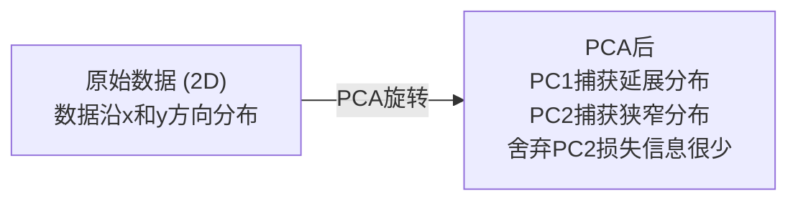

# 降维

> 高维数据具有结构。你需要从正确的角度去发现它。

**类型：** 构建  
**语言：** Python  
**先修要求：** 第1阶段，第01课（线性代数直觉）、第02课（向量、矩阵与运算）、第03课（特征值与特征向量）、第06课（概率与分布）  
**时间：** 约90分钟

## 学习目标

- 从零实现 PCA：中心化数据，计算协方差矩阵，特征分解并投影
- 使用解释方差比和拐点法选择主成分数量
- 对比 PCA、t-SNE 和 UMAP 在 MNIST 数字二维可视化中的表现，并解释各自权衡
- 应用带 RBF 核的核 PCA，分离标准 PCA 无法处理的非线性数据结构

## 问题描述

你有一个包含每个样本784个特征的数据集。或许这些是手写数字的像素值，或许是基因表达水平，或许是用户行为信号。你无法可视化784个维度，无法绘图，甚至无法直观思考它们。

但大多数784个特征是冗余的。实际的信息存在于更小的空间中。手写的“7”不需要784个独立数字来描述，只需要几个：笔画的角度、横画的长度、倾斜幅度。其余都是噪声。

降维寻找那个更小的空间。它将784维数据压缩到2维、10维或50维，同时保留重要的结构。

## 概念解析

### 维度灾难

高维空间不直观。随着维度增长，三个方面会崩坏。

**距离失去意义。** 在高维中，任意两个随机点之间的距离趋于相同值。如果每个点与其他点距离几乎相同，最近邻搜索将失效。

```text
维度         随机点间平均距离比（最大值/最小值）
2           ~5.0
10          ~1.8
100         ~1.2
1000        ~1.02
```

**体积集中于角落。** 在 d 维的单位超立方体中有 2^d 个角。在100维中，几乎所有体积都集中在角落，远离中心。数据点扩散至边缘，模型内部数据匮乏。

**需要指数级更多数据。** 为维持样本密度，从二维扩展到二十维，需要10^18倍的数据。数据永远不够。降维能让数据密度回到可用范围。

### PCA：寻找重要方向

主成分分析（PCA）寻找数据变化最大的轴。它旋转坐标系，使第一轴捕获最大方差，第二轴捕获次大方差，依此类推。

算法步骤：

```text
1. 中心化数据         （每个特征减去均值）
2. 计算协方差         （特征如何协同变化）
3. 特征分解           （找到主方向）
4. 按特征值排序      （方差最大优先）
5. 投影               （保留前 k 个特征向量，舍弃其余）
```

为什么用特征分解？协方差矩阵是对称半正定的，其特征向量为特征空间中的正交方向。特征值表示该方向捕获的方差大小。最大特征值对应的特征向量指向最大方差方向。



- **PCA前：** 数据云沿x、y轴对角线方向扩展
- **PCA后：** 坐标系旋转，PC1对准最大方差方向（延展方向），PC2对准最小方差方向（狭窄方向）
- **降维：** 舍弃PC2将数据投影至PC1，信息损失极小

### 解释方差比

每个主成分捕获总体方差的一部分。解释方差比反映了这部分比例。

```text
成分      特征值      解释方差比     累积
PC1      4.73        0.473         0.473
PC2      2.51        0.251         0.724
PC3      1.12        0.112         0.836
PC4      0.89        0.089         0.925
...
```

当累积解释方差达到0.95时，说明对应数量的主成分已经包含95%的信息。剩余部分多为噪声。

### 选择主成分数量

三种策略：

1. **阈值法。** 保留足够多的主成分以解释90%-95%的方差。
2. **拐点法。** 绘制各主成分解释方差，寻找方差急剧下降的点。
3. **下游性能法。** 将PCA作为预处理，扫描k值并测量模型准确率。选择准确率饱和值对应的k。

### t-SNE：保持邻近关系

t-分布随机邻居嵌入（t-SNE）专为可视化设计。它将高维数据映射到2D（或3D），同时保持哪些点彼此接近。

直觉是：在原始空间基于距离计算点对的概率分布，近邻点概率高，远点概率低。然后寻找满足相同概率分布的二维布局。原784维中的邻居仍是二维中的邻居。

t-SNE的关键特性：
- 非线性。能展开PCA无法处理的复杂流形。
- 随机性。不同运行得出不同布局。
- 困惑度参数控制考虑邻居数量（通常5-50）。
- 输出中各簇之间距离无意义，只有簇本身有意义。
- 大数据集慢，默认复杂度为O(n²)。

### UMAP：更快且保持全局结构

统一流形逼近与投影（UMAP）与t-SNE类似，但有两大优点：
- 更快。使用近似最近邻图，避免全对距离计算。
- 更好全局结构。输出中簇的相对位置比t-SNE更有意义。

UMAP在高维空间构建加权图（“模糊拓扑表示”），然后寻找能最好保持该图的低维布局。

关键参数：
- `n_neighbors`：定义局部结构的邻居数量（类似困惑度）。值越大保留全局结构越多。
- `min_dist`：输出中点聚集紧密度。值越小簇越密集。

### 何时使用哪种方法

| 方法    | 使用场景                   | 保留内容           | 速度          |
|---------|----------------------------|--------------------|---------------|
| PCA     | 训练前预处理               | 全局方差           | 快（精确），可处理百万级样本 |
| PCA     | 快速探索性可视化           | 线性结构           | 快            |
| t-SNE   | 出版级二维图               | 局部邻居关系       | 慢（理想<10k样本） |
| UMAP    | 大规模二维可视化           | 局部+部分全局结构  | 中（支持百万级）   |
| PCA     | 模型特征降维               | 按方差排序的特征    | 快            |
| t-SNE/UMAP | 理解簇结构               | 簇间分离           | 中到慢         |

经验法则：PCA 用于预处理和数据压缩。需要二维结构可视化时用t-SNE或UMAP。

### 核 PCA

标准 PCA 找线性子空间，即旋转坐标系并丢弃坐标轴。但数据如果位于非线性流形呢？二维圆圈无法用任何直线分割。标准 PCA 无法处理。

核 PCA 在由核函数诱导的高维特征空间做 PCA，无需显式计算坐标。这是核技巧——支持向量机（SVM）的核心思想。

算法：
1. 计算核矩阵 K，满足 K_ij = k(x_i, x_j)
2. 在特征空间中中心化核矩阵
3. 对中心化核矩阵做特征分解
4. 最大特征值对应的特征向量（经1/√特征值缩放）即为投影方向

常用核函数：

| 核函数   | 公式                           | 适用场景             |
|----------|--------------------------------|----------------------|
| RBF（高斯）  | exp(-gamma * \|\|x - y\|\|^2) | 绝大多数非线性数据，平滑流形 |
| 多项式     | (x·y + c)^d                    | 多项式关系           |
| Sigmoid   | tanh(alpha * x·y + c)          | 类神经网络映射       |

核 PCA 与标准 PCA 的区别：

| 评判标准   | 标准 PCA           | 核 PCA              |
|------------|--------------------|---------------------|
| 数据结构   | 线性子空间         | 非线性流形          |
| 速度       | O(min(n²d, d²n))   | O(n²d + n³)         |
| 可解释性   | 线性特征组合       | 无直接特征解释      |
| 扩展性     | 适用于百万级样本   | 核矩阵大小为n×n，受内存限制 |
| 重构       | 可直接逆变换       | 需预映像近似         |

经典例子：二维同心圆。内环和外环点。标准 PCA 投影成同一直线，对分类无帮助。RBF 核 PCA 将内外环映射到不同区域，线性可分。

### 重构误差

降维效果好不好？例如将784维压缩到50维，损失了什么？

测量重构误差：
1. 投影到 k 维：X_reduced = X @ W_k
2. 重构数据：X_hat = X_reduced @ W_k^T
3. 计算均方误差（MSE）：mean((X - X_hat)^2)

PCA 的重构误差与解释方差有清晰关系：

```text
重构误差 = 未包含的特征值之和
总方差 = 所有特征值之和
损失比例 = （丢弃的特征值和）/（所有特征值和）
```

每个成分的解释方差比为：

```text
explained_ratio_k = eigenvalue_k / sum(all eigenvalues)
```

绘制累积解释方差与成分数量关系曲线即“拐点”曲线。合适的成分数对应：
- 曲线趋于平缓（回报递减）
- 累积方差达到阈值（通常0.90或0.95）
- 下游任务性能达饱和

重构误差作用不仅于选k，也可用于异常检测：高重构误差样本是未拟合好的异常点。这是生产环境中PCA异常检测的基础。

## 动手实现

### 第1步：从零实现PCA

```python
import numpy as np

class PCA:
    def __init__(self, n_components):
        self.n_components = n_components
        self.components = None
        self.mean = None
        self.eigenvalues = None
        self.explained_variance_ratio_ = None

    def fit(self, X):
        self.mean = np.mean(X, axis=0)
        X_centered = X - self.mean

        cov_matrix = np.cov(X_centered, rowvar=False)

        eigenvalues, eigenvectors = np.linalg.eigh(cov_matrix)

        sorted_idx = np.argsort(eigenvalues)[::-1]
        eigenvalues = eigenvalues[sorted_idx]
        eigenvectors = eigenvectors[:, sorted_idx]

        self.components = eigenvectors[:, :self.n_components].T
        self.eigenvalues = eigenvalues[:self.n_components]
        total_var = np.sum(eigenvalues)
        self.explained_variance_ratio_ = self.eigenvalues / total_var

        return self

    def transform(self, X):
        X_centered = X - self.mean
        return X_centered @ self.components.T

    def fit_transform(self, X):
        self.fit(X)
        return self.transform(X)
```

### 步骤 2：在合成数据上测试

```python
np.random.seed(42)
n_samples = 500

t = np.random.uniform(0, 2 * np.pi, n_samples)
x1 = 3 * np.cos(t) + np.random.normal(0, 0.2, n_samples)
x2 = 3 * np.sin(t) + np.random.normal(0, 0.2, n_samples)
x3 = 0.5 * x1 + 0.3 * x2 + np.random.normal(0, 0.1, n_samples)

X_synthetic = np.column_stack([x1, x2, x3])

pca = PCA(n_components=2)
X_reduced = pca.fit_transform(X_synthetic)

print(f"原始形状: {X_synthetic.shape}")
print(f"降维后形状:  {X_reduced.shape}")
print(f"解释方差比率: {pca.explained_variance_ratio_}")
print(f"总方差捕获率: {sum(pca.explained_variance_ratio_):.4f}")
```

### 步骤 3：二维中的 MNIST 手写数字

```python
from sklearn.datasets import fetch_openml

mnist = fetch_openml("mnist_784", version=1, as_frame=False, parser="auto")
X_mnist = mnist.data[:5000].astype(float)
y_mnist = mnist.target[:5000].astype(int)

pca_mnist = PCA(n_components=50)
X_pca50 = pca_mnist.fit_transform(X_mnist)
print(f"50 个成分捕获了 {sum(pca_mnist.explained_variance_ratio_):.2%} 的方差")

pca_2d = PCA(n_components=2)
X_pca2d = pca_2d.fit_transform(X_mnist)
print(f"2 个成分捕获了 {sum(pca_2d.explained_variance_ratio_):.2%} 的方差")
```

### 步骤 4：与 sklearn 比较

```python
from sklearn.decomposition import PCA as SklearnPCA
from sklearn.manifold import TSNE

sklearn_pca = SklearnPCA(n_components=2)
X_sklearn_pca = sklearn_pca.fit_transform(X_mnist)

print(f"\n我们的 PCA 解释方差比率:     {pca_2d.explained_variance_ratio_}")
print(f"Sklearn PCA 解释方差比率: {sklearn_pca.explained_variance_ratio_}")

diff = np.abs(np.abs(X_pca2d) - np.abs(X_sklearn_pca))
print(f"最大绝对差异: {diff.max():.10f}")

tsne = TSNE(n_components=2, perplexity=30, random_state=42)
X_tsne = tsne.fit_transform(X_mnist)
print(f"\nt-SNE 输出形状: {X_tsne.shape}")
```

### 步骤 5：UMAP 比较

```python
try:
    from umap import UMAP

    reducer = UMAP(n_components=2, n_neighbors=15, min_dist=0.1, random_state=42)
    X_umap = reducer.fit_transform(X_mnist)
    print(f"UMAP 输出形状: {X_umap.shape}")
except ImportError:
    print("请安装 umap-learn: pip install umap-learn")
```

## 使用方法

PCA 作为分类器之前的预处理：

```python
from sklearn.decomposition import PCA as SklearnPCA
from sklearn.linear_model import LogisticRegression
from sklearn.model_selection import train_test_split
from sklearn.metrics import accuracy_score

X_train, X_test, y_train, y_test = train_test_split(
    X_mnist, y_mnist, test_size=0.2, random_state=42
)

results = {}
for k in [10, 30, 50, 100, 200]:
    pca_k = SklearnPCA(n_components=k)
    X_tr = pca_k.fit_transform(X_train)
    X_te = pca_k.transform(X_test)

    clf = LogisticRegression(max_iter=1000, random_state=42)
    clf.fit(X_tr, y_train)
    acc = accuracy_score(y_test, clf.predict(X_te))
    var_captured = sum(pca_k.explained_variance_ratio_)
    results[k] = (acc, var_captured)
    print(f"k={k:>3d}  准确率={acc:.4f}  方差捕获率={var_captured:.4f}")
```

性能在 784 维之前即趋于稳定。该平稳点即是你的实际操作点。

## 部署

本课程产出：
- `outputs/skill-dimensionality-reduction.md` - 用于选择适合特定任务的降维技术的技能文档

## 练习

1. 修改 PCA 类以支持 `inverse_transform`。从 10、50 和 200 个成分重构 MNIST 数字。打印每个的重构误差（与原始数据的均方差差异）。

2. 在同样的 MNIST 子集上使用 t-SNE，调整 perplexity（困惑度）为 5、30 和 100。描述输出的变化。为什么 perplexity 会影响聚类的紧密度？

3. 使用一个包含 50 个特征但仅有 5 个是信息性特征的数据集（用 `sklearn.datasets.make_classification` 生成）。应用 PCA，检查解释方差曲线是否正确识别数据有效维数为 5。

## 关键术语

| 术语 | 常用说法 | 实际含义 |
|------|----------|---------|
| Curse of dimensionality | “特征太多” | 距离、体积和数据密度随着维度增加出现反直觉表现。模型需要指数级更多数据补偿。 |
| PCA | “降维” | 旋转坐标系，使轴线与最大方差方向对齐，再丢弃低方差的轴线。 |
| Principal component | “一个重要方向” | 协方差矩阵的特征向量。数据在特征空间中变化最大的方向。 |
| Explained variance ratio | “成分信息量” | 单个主成分捕获的总方差占比。前 k 个的比率和表示 k 个成分保留了多少信息。 |
| Covariance matrix | “特征间相关” | 一个对称矩阵，(i,j) 项度量特征 i 和特征 j 的共同变化。对角线为各特征的方差。 |
| t-SNE | “那个聚类图” | 一种非线性方法，通过保持成对邻域概率将高维数据映射到二维。适合可视化，不适合预处理。 |
| UMAP | “更快的 t-SNE” | 基于拓扑数据分析的非线性方法。保留局部结构及部分全局结构。比 t-SNE 更易扩展。 |
| Perplexity | “t-SNE 的调节参数” | 控制每个点考虑的邻居有效数量。低 perplexity 关注非常局部结构，高 perplexity 捕捉更广泛模式。 |
| Manifold | “数据所在的曲面” | 嵌入在高维空间的低维曲面。比如三维空间中被揉皱的纸张是二维多流形。 |

## 相关阅读

- [主成分分析教程](https://arxiv.org/abs/1404.1100)（Shlens） - 从头到尾的清晰 PCA 推导
- [如何有效使用 t-SNE](https://distill.pub/2016/misread-tsne/)（Wattenberg 等）- 交互式指南，讲解 t-SNE 陷阱和参数选择
- [UMAP 文档](https://umap-learn.readthedocs.io/) - UMAP 作者的理论和实用指导
