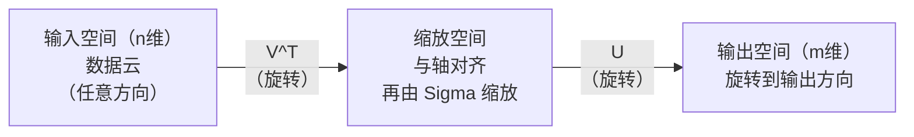
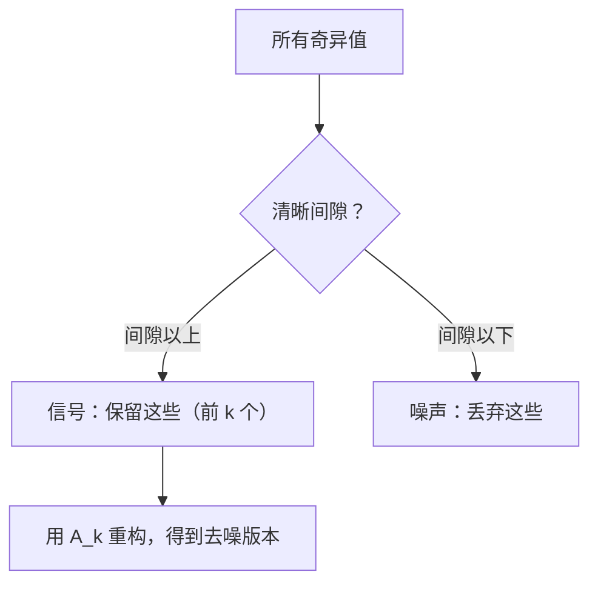

# 奇异值分解

> SVD 是线性代数中的瑞士军刀。每个矩阵都有一个。每个数据科学家都需要它。

**类型：** 构建  
**语言：** Python, Julia  
**先修知识：** 第一阶段，第01课（线性代数直觉），第02课（向量与矩阵运算），第03课（矩阵变换）  
**时间：** 约120分钟

## 学习目标

- 通过幂迭代实现 SVD，并解释 U、Sigma 和 V^T 的几何意义
- 应用截断 SVD 进行图像压缩，并测量压缩比与重建误差
- 通过 SVD 计算 Moore-Penrose 伪逆，解决超定最小二乘系统
- 连接 SVD 与 PCA、推荐系统（潜在因子）及 NLP 中的潜在语义分析

## 问题描述

你有一个 1000x2000 的矩阵。它可能是用户-电影评分矩阵，也可能是文档-词频表，或者是图像的像素值。你需要压缩它、去噪、发现隐藏结构，或者用它来解最小二乘问题。特征分解仅适用于方阵，而且要求矩阵有完整的线性无关特征向量集。

SVD 适用于任何矩阵。任何形状。任何秩。无条件限制。它将矩阵分解为三个因子，揭示矩阵对空间进行变换的几何特征。它是线性代数中最通用且最有用的分解方法。

## 概念

### SVD 几何意义

每个矩阵，无论形状如何，都会按顺序执行三个操作：旋转、缩放、旋转。SVD 将这种分解明确表达出来。

```text
A = U * Sigma * V^T

      m x n     m x m    m x n    n x n
     （任意） （旋转）  （缩放）  （旋转）
```

给定任意矩阵 A，SVD 将其分解为：  
- V^T 对输入空间（n 维）中的向量旋转  
- Sigma 沿每个轴缩放（拉伸或压缩）  
- U 将结果旋转到输出空间（m 维）



可以这样理解：你给 SVD 一个矩阵，它告诉你：“这个矩阵对输入的单位球体，先用 V^T 旋转，再用 Sigma 拉伸成椭球体，最后用 U 旋转这个椭球体”。奇异值就是椭球各轴的长度。

### 完整分解

对于形状为 m x n 的矩阵 A：

```text
A = U * Sigma * V^T

其中：
  U     是 m x m，正交矩阵（U^T U = I）
  Sigma 是 m x n，对角矩阵（对角线上为奇异值）
  V     是 n x n，正交矩阵（V^T V = I）

奇异值满足 sigma_1 >= sigma_2 >= ... >= sigma_r > 0  
其中 r = rank(A)
```

U 的列称为左奇异向量。V 的列称为右奇异向量。Sigma 对角线上的元素称为奇异值。它们总是非负，通常按降序排列。

### 左奇异向量、奇异值、右奇异向量

SVD 的每个部分都有明确的几何含义。

**右奇异向量（V 的列）：** 它们构成输入空间 \(\mathbb{R}^n\) 的正交基。它们是矩阵将输入映射为输出正交方向的自然坐标系。

**奇异值（Sigma 的对角线）：** 这些是缩放因子。第 i 个奇异值告诉你矩阵沿第 i 个右奇异向量的缩放倍数。奇异值为零表示该方向上的向量被完全压缩。

**左奇异向量（U 的列）：** 它们构成输出空间 \(\mathbb{R}^m\) 的正交基。第 i 个左奇异向量是第 i 个右奇异向量经过缩放后映射到的输出方向。

它们之间的关系：

```text
A * v_i = sigma_i * u_i

矩阵 A 作用于第 i 个右奇异向量 v_i，
将其缩放 sigma_i 倍，并映射到第 i 个左奇异向量 u_i。
```

这让你从坐标层面对任何矩阵的作用有清晰的理解。

### 外积形式

SVD 也可写成一系列秩-1 矩阵的和：

```text
A = sigma_1 * u_1 * v_1^T + sigma_2 * u_2 * v_2^T + ... + sigma_r * u_r * v_r^T

每一项 sigma_i * u_i * v_i^T 是一个秩-1 矩阵（外积）。
整个矩阵是 r 个此类矩阵的和，其中 r 是矩阵的秩。
```

这种形式是低秩近似的基础。每一项增加一层结构。第一个项捕获最重要的模式，第二个捕获次重要的，依此类推。截断和就给出在某秩下最优的近似。

```text
秩-1 近似:    A_1 = sigma_1 * u_1 * v_1^T
              （捕获主导模式）

秩-2 近似:    A_2 = sigma_1 * u_1 * v_1^T + sigma_2 * u_2 * v_2^T
              （捕获两个最重要模式）

秩-k 近似:    A_k = 前 k 项和
              （依照 Eckart-Young 定理最优）
```

### 与特征分解的关系

SVD 与特征分解密切相关。矩阵 A 的奇异值和奇异向量直接来自 A^T A 和 A A^T 的特征值和特征向量。

```text
A^T A = V * Sigma^T * U^T * U * Sigma * V^T
      = V * Sigma^T * Sigma * V^T
      = V * D * V^T

其中 D = Sigma^T * Sigma 是对角矩阵，对角线元素为 sigma_i^2。

因此：
- 右奇异向量（V）是 A^T A 的特征向量
- 奇异值的平方 (sigma_i^2) 是 A^T A 的特征值

类似地：
A A^T = U * Sigma * V^T * V * Sigma^T * U^T
      = U * Sigma * Sigma^T * U^T

所以：
- 左奇异向量（U）是 A A^T 的特征向量
- A A^T 的特征值也是 sigma_i^2
```

这个联系告诉你三件事：  
1. 奇异值总是实数且非负（它们是半正定矩阵特征值的平方根）。  
2. 理论上可以通过对 A^T A 进行特征分解计算 SVD，但这样条件数平方，数值稳定性差。专门的 SVD 算法避免了这一点。  
3. 当 A 是方阵且对称半正定时，SVD 和特征分解等价。

### 截断 SVD：低秩近似

Eckart-Young-Mirsky 定理表明，截取前 k 个奇异值及其对应奇异向量构造的矩阵，是 A 的最佳秩 k 近似（无论 Frobenius 范数还是谱范数）。

```text
A_k = U_k * Sigma_k * V_k^T

其中：
  U_k     是 m x k  （U 的前 k 列）
  Sigma_k 是 k x k  （Sigma 左上角的 k x k 块）
  V_k     是 n x k  （V 的前 k 列）

近似误差 = sigma_{k+1}  （谱范数下）
          = sqrt(sigma_{k+1}^2 + ... + sigma_r^2)  （Frobenius 范数下）
```

这不只是“较好的”近似，而是秩 k 下最优的。没有任何其他秩 k 矩阵会比它更接近 A。

| 分量      | 相对大小          | 在秩3近似中保留？  |
|-----------|-------------------|-------------------|
| sigma_1   | 最大              | 是                |
| sigma_2   | 很大              | 是                |
| sigma_3   | 中偏大            | 是                |
| sigma_4   | 中等              | 否（误差）        |
| sigma_5   | 中偏小            | 否（误差）        |
| sigma_6   | 小                | 否（误差）        |
| sigma_7   | 很小              | 否（误差）        |
| sigma_8   | 微小              | 否（误差）        |

保留前3个：A_3 捕获前三个最大奇异值，误差等于剩余部分（即 sigma_4 到 sigma_8）。

如果奇异值下降快，则较小 k 即可捕获大部分矩阵信息。下降慢则表明矩阵无明显低秩结构。

### 用 SVD 做图像压缩

灰度图像是像素强度的矩阵。一个 800x600 的图像中有 48 万个数值。SVD 可以用远少于此的数值逼近它。

```text
原始图像：800 x 600 = 480,000 数值

秩为 k 的 SVD：
  U_k:      800 x k 数值
  Sigma_k:  k 个数值
  V_k:      600 x k 数值
  总计：    k * (800 + 600 + 1) = k * 1401 数值

  k=10:   14,010 数值   （原始的 2.9%）
  k=50:   70,050 数值   （原始的 14.6%）
  k=100: 140,100 数值   （原始的 29.2%）

  k 越小压缩率越高，
  但视觉质量会下降。
```

关键见解：自然图像奇异值迅速衰减。前几个奇异值捕获图像大体结构（形状、渐变），后面奇异值捕获细节和噪声。截断到秩 50，通常能获得视觉上几乎相同的图像，同时存储量减少 85%。

### 推荐系统中的 SVD

Netflix 奖赛让该方法声名鹊起。你有一个用户-电影评分矩阵，大部分条目缺失。

```text
             电影1   电影2   电影3   电影4   电影5
  用户1      [  5      ?       3       ?       1  ]
  用户2      [  ?      4       ?       2       ?  ]
  用户3      [  3      ?       5       ?       ?  ]
  用户4      [  ?      ?       ?       4       3  ]

  ? = 未知评分
```

想法是：评分矩阵低秩。用户的口味不是完全独立的。有少数潜在因子（动作与剧情、老片与新片、理性与感性）解释了大多数喜好。

对补全后的评分矩阵执行 SVD，得到：  
- U：用户在潜在因子空间的画像  
- Sigma：各潜在因子的权重  
- V^T：电影在潜在因子空间的画像

用户对电影的预测评分是用户画像和电影画像的加权内积（由奇异值加权）。低秩近似补全缺失项。

在实际应用中，用 Simon Funk 的增量 SVD 或 ALS（交替最小二乘）等变体直接处理缺失值，但核心思想是一样的：通过 SVD 进行潜在因子分解。

### NLP 中的 SVD：潜在语义分析

潜在语义分析（LSA，又称潜在语义索引 LSI）对词-文档矩阵使用 SVD。

```text
             文档1  文档2  文档3  文档4
  "cat"      [  3      0      1      0  ]
  "dog"      [  2      0      0      1  ]
  "fish"     [  0      4      1      0  ]
  "pet"      [  1      1      1      1  ]
  "ocean"    [  0      3      0      0  ]

SVD 截断到秩 k=2 后：

  每个文档映射到二维“概念空间”的一个点。
  每个词也映射到相同二维空间。
  主题相似的文档聚集。
  语义相似的词聚集。

  “cat” 和 “dog” 位置接近（宠物类）。
  “fish” 和 “ocean” 位置接近（水相关）。
  主题相近的文档（如文档1和文档3）聚群。
```

LSA 是最早成功捕捉文本语义相似度的方法之一。它有效因为同义词倾向于出现在相似文档中，SVD 将它们归入相同潜在维度。现代词向量（Word2Vec, GloVe）可视为该思想的延续。

### SVD 做噪声去除

带噪数据的信号集中在顶部奇异值中，噪声分布于所有奇异值。截断 SVD 去除了噪声基线。

**干净信号的奇异值：**

| 组件 | 大小 | 类型 |
|-----------|-----------|------|
| sigma_1 | 非常大 | 信号 |
| sigma_2 | 大 | 信号 |
| sigma_3 | 中等 | 信号 |
| sigma_4 | 接近零 | 可忽略 |
| sigma_5 | 接近零 | 可忽略 |

**带噪信号奇异值（噪声叠加于所有）:**

| 组件 | 大小 | 类型 |
|-----------|-----------|------|
| sigma_1 | 非常大 | 信号 |
| sigma_2 | 大 | 信号 |
| sigma_3 | 中等 | 信号 |
| sigma_4 | 小 | 噪声 |
| sigma_5 | 小 | 噪声 |
| sigma_6 | 小 | 噪声 |
| sigma_7 | 小 | 噪声 |



这在信号处理、科学测量和数据清洗中使用。任何时候，如果矩阵被加性噪声破坏，截断 SVD 是区分信号和噪声的原则方法。

### 通过 SVD 计算伪逆

Moore-Penrose 伪逆 A+ 将矩阵求逆推广到非方阵和奇异矩阵。SVD 使得计算伪逆非常简单。

```text
如果 A = U * Sigma * V^T，则：

A+ = V * Sigma+ * U^T

其中 Sigma+ 的构成如下：
  1. 转置 Sigma（交换行和列）
  2. 将每个非零对角元 sigma_i 替换为 1/sigma_i
  3. 零元素保持为零

对于 A (m x n)：      A+ 是 (n x m)
对于 Sigma (m x n)： Sigma+ 是 (n x m)
```

伪逆可用于求解最小二乘问题。如果 Ax = b 没有精确解（超定系统），那么 x = A+ b 是最小二乘解（最小化 ||Ax - b||）。

```text
超定系统（方程多于未知数）：

  [1  1]         [3]
  [2  1] x   =   [5]       无精确解。
  [3  1]         [6]

  x_ls = A+ b = V * Sigma+ * U^T * b

  该解使残差平方和最小。
  与正规方程解 (A^T A)^(-1) A^T b 一致，
  但数值更稳定。
```

### 数值稳定性优势

计算 A^T A 的特征分解会将奇异值平方（A^T A 的特征值是 sigma_i^2），这将条件数平方，放大数值误差。

```text
示例：
  A 的奇异值为 [1000, 1, 0.001]
  A 的条件数为 1000 / 0.001 = 10^6

  A^T A 的特征值为 [10^6, 1, 10^{-6}]
  A^T A 的条件数为 10^6 / 10^{-6} = 10^{12}

  直接计算 SVD：操作条件数为 10^6
  计算 A^T A 特征分解：操作条件数为 10^{12}
                         （损失6位有效精度）
```

现代 SVD 算法（Golub-Kahan 双对角化）直接对 A 操作，不形成 A^T A。这是你应该总是优先使用 `np.linalg.svd(A)` 而非 `np.linalg.eig(A.T @ A)` 的原因。

### 与 PCA 的联系

PCA 就是对中心化数据做 SVD。这不是类比，而是真正相同的运算过程。

```text
给定数据矩阵 X (样本数 n_samples x 特征数 n_features)，经过中心化（均值已减去）：

协方差矩阵：C = (1/(n-1)) * X^T X

PCA 找 C 的特征向量。但：

  X = U * Sigma * V^T    （X 的 SVD）

  X^T X = V * Sigma^2 * V^T

  C = (1/(n-1)) * V * Sigma^2 * V^T

所以主成分正是右奇异向量 V。
每个主成分的解释方差为 sigma_i^2 / (n-1)。

在 sklearn 中，PCA 用 SVD 实现，而非特征分解。
这样更快、数值更稳定。
```

这意味着你在第10课学的所有降维技巧，本质上都是基于 SVD。PCA 是机器学习里 SVD 最常见的应用。

## 实现它

### 第1步：用幂迭代从零实现 SVD

思路：用幂迭代找到最大的奇异值和奇异向量，基于 A^T A（或 A A^T）。再对矩阵进行矩阵降维（deflate），迭代求下一个奇异值。

```python
import numpy as np

def power_iteration(M, num_iters=100):
    n = M.shape[1]
    v = np.random.randn(n)
    v = v / np.linalg.norm(v)

    for _ in range(num_iters):
        Mv = M @ v
        v = Mv / np.linalg.norm(Mv)

    eigenvalue = v @ M @ v
    return eigenvalue, v

def svd_from_scratch(A, k=None):
    m, n = A.shape
    if k is None:
        k = min(m, n)

    sigmas = []
    us = []
    vs = []

    A_residual = A.copy().astype(float)

    for _ in range(k):
        AtA = A_residual.T @ A_residual
        eigenvalue, v = power_iteration(AtA, num_iters=200)

        if eigenvalue < 1e-10:
            break

        sigma = np.sqrt(eigenvalue)
        u = A_residual @ v / sigma

        sigmas.append(sigma)
        us.append(u)
        vs.append(v)

        A_residual = A_residual - sigma * np.outer(u, v)

    U = np.column_stack(us) if us else np.empty((m, 0))
    S = np.array(sigmas)
    V = np.column_stack(vs) if vs else np.empty((n, 0))

    return U, S, V
```

### 第2步：测试并与 NumPy 对比

```python
np.random.seed(42)
A = np.random.randn(5, 4)

U_ours, S_ours, V_ours = svd_from_scratch(A)
U_np, S_np, Vt_np = np.linalg.svd(A, full_matrices=False)

print("我们的奇异值:", np.round(S_ours, 4))
print("NumPy 奇异值:", np.round(S_np, 4))

A_reconstructed = U_ours @ np.diag(S_ours) @ V_ours.T
print(f"重构误差: {np.linalg.norm(A - A_reconstructed):.8f}")
```

### 第3步：图像压缩演示

```python
def compress_image_svd(image_matrix, k):
    U, S, Vt = np.linalg.svd(image_matrix, full_matrices=False)
    compressed = U[:, :k] @ np.diag(S[:k]) @ Vt[:k, :]
    return compressed

image = np.random.seed(42)
rows, cols = 200, 300
image = np.random.randn(rows, cols)

for k in [1, 5, 10, 20, 50]:
    compressed = compress_image_svd(image, k)
    error = np.linalg.norm(image - compressed) / np.linalg.norm(image)
    original_size = rows * cols
    compressed_size = k * (rows + cols + 1)
    ratio = compressed_size / original_size
    print(f"k={k:>3d}  误差={error:.4f}  存储比例={ratio:.1%}")
```

### 第4步：降噪

```python
np.random.seed(42)
clean = np.outer(np.sin(np.linspace(0, 4*np.pi, 100)),
                 np.cos(np.linspace(0, 2*np.pi, 80)))
noise = 0.3 * np.random.randn(100, 80)
noisy = clean + noise

U, S, Vt = np.linalg.svd(noisy, full_matrices=False)
denoised = U[:, :5] @ np.diag(S[:5]) @ Vt[:5, :]

print(f"带噪声误差:    {np.linalg.norm(noisy - clean):.4f}")
print(f"去噪后误差:    {np.linalg.norm(denoised - clean):.4f}")
print(f"改进幅度:      {(1 - np.linalg.norm(denoised - clean) / np.linalg.norm(noisy - clean)):.1%}")
```

### 第5步：伪逆

```python
A = np.array([[1, 1], [2, 1], [3, 1]], dtype=float)
b = np.array([3, 5, 6], dtype=float)

U, S, Vt = np.linalg.svd(A, full_matrices=False)
S_inv = np.diag(1.0 / S)
A_pinv = Vt.T @ S_inv @ U.T

x_svd = A_pinv @ b
x_lstsq = np.linalg.lstsq(A, b, rcond=None)[0]
x_pinv = np.linalg.pinv(A) @ b

print(f"SVD 伪逆解:  {x_svd}")
print(f"np.linalg.lstsq 解:   {x_lstsq}")
print(f"np.linalg.pinv 解:    {x_pinv}")
```

## 使用它

完整的演示代码位于 `code/svd.py`。运行此文件可见 SVD 在图像压缩、推荐系统、潜在语义分析和降噪中的应用。

```bash
python svd.py
```

Julia 版本位于 `code/svd.jl`，用 Julia 的原生 `svd()` 函数和 `LinearAlgebra` 包演示同样概念。

```bash
julia svd.jl
```

## 交付成果

本课产出：
- `outputs/skill-svd.md` - 一份关于何时及如何在实际项目中应用 SVD 的技能文档

## 练习

1. 实现完整的 SVD，禁止使用幂迭代。改用计算 A^T A 的特征分解获取 V 和奇异值，再计算 U = A V Sigma^{-1}。比较数值精度与幂迭代版本和 NumPy 的结果。

2. 读入一张真实的灰度图像（或转为灰度）并在秩为 1、5、10、25、50、100 下压缩。对每个秩计算压缩比和相对误差。找出视觉上可接受的秩。

3. 构建一个小型推荐系统。创建一个10x8的用户-电影评分矩阵，部分条目已知。用行均值填充缺失条目。计算 SVD 并重构秩-3近似。用重构矩阵预测缺失评分，验证预测合理性。

4. 创建一个100x50的文档-词项矩阵包含3个人工合成主题。每个主题对应5个相关词。加入噪声。应用 SVD，验证前三个奇异值明显大于其余。将文档投影到3维潜在空间，检查同主题文档聚类情况。

5. 生成一个秩为3且大小为50x40的干净低秩矩阵，并在不同噪声水平（sigma = 0.1, 0.5, 1.0, 2.0）下添加高斯噪声。针对每个噪声水平，遍历 k=1 到 40 测试截断秩，测量与干净矩阵的重构误差。绘图观察最优 k 如何随噪声变化。

## 关键术语

| 术语 | 常见说法 | 实际含义 |
|------|----------------|----------------------|
| SVD | “因式分解任意矩阵” | 将 A 分解为 U Sigma V^T，其中 U 和 V 是正交矩阵，Sigma 是非负对角矩阵。适用于任意形状的矩阵。 |
| 奇异值 | “这个成分有多重要” | Sigma 的第 i 个对角元。衡量矩阵沿第 i 个主方向伸缩的程度。非负，按降序排列。 |
| 左奇异向量 | “输出方向” | U 的一列。对应输入右奇异向量经过矩阵变换后，缩放 sigma_i 后映射的输出方向。 |
| 右奇异向量 | “输入方向” | V 的一列。矩阵将其映射到对应的左奇异向量并缩放 sigma_i。 |
| 截断 SVD | “低秩近似” | 只保留前 k 个奇异值及其奇异向量。产生对原矩阵在秩-k 矩阵中最佳近似（Eckart-Young 定理）。 |
| 秩 | “真实维度” | 非零奇异值的数量。表示矩阵实际占用的独立方向数目。 |
| 伪逆 | “广义逆” | V Sigma+ U^T。将非零奇异值倒数，其余零值保持不变。用于非方阵或奇异矩阵的最小二乘解。 |
| 条件数 | “对误差的敏感度” | sigma_max / sigma_min。条件数大表示输入微小变动导致输出大变动。SVD 直观揭示这一点。 |
| 潜在因子 | “隐含变量” | SVD 发现的低秩空间维度。在推荐系统中可能对应偏好类型，在自然语言处理中可能对应主题。 |
| Frobenius 范数 | “矩阵总体大小” | 所有元素平方和的平方根。等于奇异值平方和的平方根。用来度量近似误差。 |
| Eckart-Young 定理 | “SVD 得到最佳压缩” | 对任意秩 k，截断 SVD 是所有秩-k 矩阵中误差最小的近似。 |
| 幂迭代 | “找最大特征向量” | 反复将随机向量乘以矩阵并归一化。收敛于最大特征值对应的特征向量。许多 SVD 算法的基础算法。 |

## 进一步阅读

- [Gilbert Strang: Linear Algebra and Its Applications, Chapter 7](https://math.mit.edu/~gs/linearalgebra/) - 对 SVD（奇异值分解）的全面讲解及其应用
- [3Blue1Brown: But what is the SVD?](https://www.youtube.com/watch?v=vSczTbgc8Rc) - SVD 的几何直观理解
- [We Recommend a Singular Value Decomposition](https://www.ams.org/publicoutreach/feature-column/fcarc-svd) - 美国数学学会提供的易懂概述
- [Netflix Prize and Matrix Factorization](https://sifter.org/~simon/journal/20061211.html) - Simon Funk 关于推荐系统中 SVD 的原创博客文章
- [Latent Semantic Analysis](https://en.wikipedia.org/wiki/Latent_semantic_analysis) - SVD 在自然语言处理（NLP，自然语言处理）中的最初应用
- [Numerical Linear Algebra by Trefethen and Bau](https://people.maths.ox.ac.uk/trefethen/text.html) - 理解 SVD 算法及其数值特性的权威标准教程
