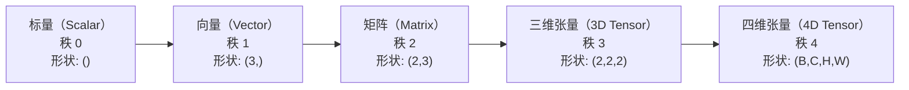
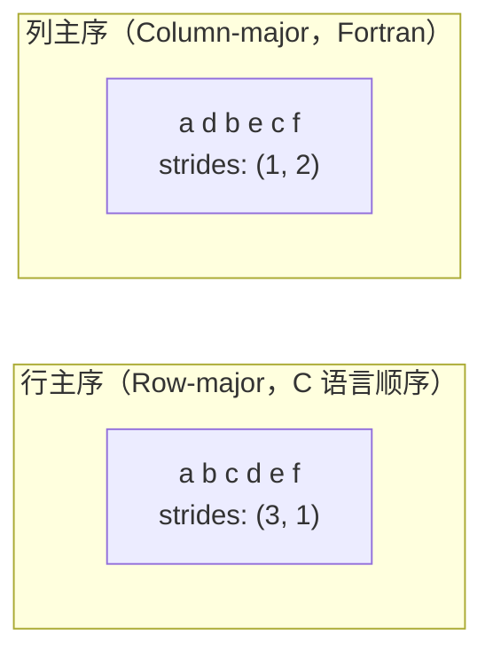
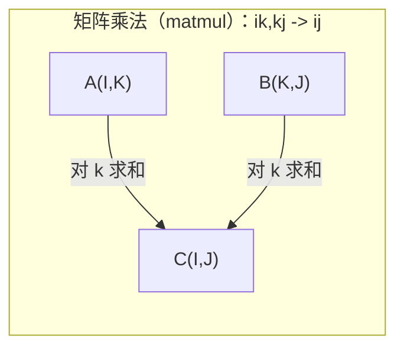

# 张量操作（Tensor Operations）

> 张量是数据与深度学习之间的通用语言。每张图像、每个句子、每个梯度都通过它们流动。

**类型（Type）：** 构建（Build）  
**语言（Language）：** Python  
**先决条件（Prerequisites）：** 阶段 1，第 01 课（线性代数直觉（Linear Algebra Intuition）），第 02 课（向量、矩阵与操作）  
**时间（Time）：** 约 90 分钟

## 学习目标（Learning Objectives）

- 从零实现带形状、步长、重塑、转置及元素级操作的张量类  
- 应用广播规则对不同形状的张量进行操作且无需复制数据  
- 编写 einsum（爱因斯坦求和）表达式来实现点积、矩阵乘法、外积以及批量操作  
- 跟踪多头注意力中每一步的精确张量形状  

## 问题（The Problem）

你构建了一个 Transformer（Transformer 架构）。前向传播看起来很清晰。你运行时却得到：`RuntimeError: mat1 and mat2 shapes cannot be multiplied (32x768 and 512x768)`。你盯着这些形状。你尝试转置。现在提示 `Expected 4D input (got 3D input)`。你加了一个 unsqueeze。又有别的问题出现。

形状错误是深度学习代码中最常见的错误。它们在概念上并不难——每个操作都有形状契约——但错误会迅速扩大。一个 Transformer 链接了数十个 reshape、transpose 和 broadcast 操作。只要一个轴错了，错误就会连锁反应。更糟的是，有些形状错误根本不会抛出异常。它们会通过错误维度的广播或错误轴的求和悄无声息地产生垃圾结果。

矩阵处理的是两个集合之间的成对关系。真实数据不止两个维度。一批 32 张 224x224 的 RGB 图像是 4 维张量：(32, 3, 224, 224)。12 头的自注意力也是 4 维：(batch, heads, seq_len, head_dim)。你需要一种数据结构，可泛化到任意维数，且操作能在所有维度上优雅组合。这个结构就是张量。掌握它的操作，形状错误就变得极易调试。

## 概念（The Concept）

### 什么是张量（What a tensor is）

张量是具有统一数据类型的多维数值数组。维数的数量称作**秩（rank）**或**阶（order）**。每个维度称作**轴（axis）**。**形状（shape）**是列出每个轴大小的元组。



元素总数 = 所有尺寸的乘积。形状 `(2, 3, 4)` 包含 `2 * 3 * 4 = 24` 个元素。

### 深度学习中的张量形状（Tensor shapes in deep learning）

不同数据类型按约定映射到特定张量形状。

```mermaid
graph TD
    subgraph 视觉（Vision）
        V1["(B, C, H, W)<br/>32, 3, 224, 224"]
    end
    subgraph 自然语言处理（NLP）
        N1["(B, T, D)<br/>16, 128, 768"]
    end
    subgraph 注意力机制（Attention）
        A1["(B, H, T, D)<br/>16, 12, 128, 64"]
    end
    subgraph 权重（Weights）
        W1["线性层： (out, in)<br/>卷积2D： (out_c, in_c, kH, kW)<br/>嵌入层： (vocab, dim)"]
    end
```

PyTorch 使用 NCHW（通道优先）。TensorFlow 默认 NHWC（通道在最后）。布局不匹配会导致隐秘的性能下降或错误。

### 内存布局是如何工作的（How memory layout works）

内存中的二维数组是按一维字节序列保存。**步长（strides）**指明沿每个轴移动一步需跳过多少元素。



转置不移动数据。它交换步长，使张量变为**非连续（non-contiguous）**——一行的元素在内存中不再相邻。

### 广播规则（Broadcasting rules）

广播让你可以操作形状不同的张量而无需复制数据。从右对齐形状。两个维度兼容当且仅当相等或其中有一个为 1。较少维度从左边补 1。

```text
张量 A:     (8, 1, 6, 1)
张量 B:        (7, 1, 5)
补齐后的 B:  (1, 7, 1, 5)
结果形状:    (8, 7, 6, 5)
```

### Einsum：通用张量操作（Einsum: the universal tensor operation）

爱因斯坦求和为每个轴打一个字母标签。输入中而输出中没有的轴求和，输出中存在的轴保留。



常见模式：  
`i,i->`（点积）、`i,j->ij`（外积）、`ii->`（迹）、`ij->ji`（转置）、`bij,bjk->bik`（批量矩阵乘法）、`bhtd,bhsd->bhts`（注意力得分）。

## 构建它（Build It）

代码文件为 `code/tensors.py`。每个步骤都会引用该实现。

### 步骤 1：张量存储和步长（Tensor storage and strides）

张量存储一个扁平的数字列表和形状元数据。步长告诉索引逻辑如何将多维索引映射到扁平位置。

```python
class Tensor:
    def __init__(self, data, shape=None):
        if isinstance(data, (list, tuple)):
            self._data, self._shape = self._flatten_nested(data)
        elif isinstance(data, np.ndarray):
            self._data = data.flatten().tolist()
            self._shape = tuple(data.shape)
        else:
            self._data = [data]
            self._shape = ()

        if shape is not None:
            total = reduce(lambda a, b: a * b, shape, 1)
            if total != len(self._data):
                raise ValueError(
                    f"不能将 {len(self._data)} 个元素重塑为形状 {shape}"
                )
            self._shape = tuple(shape)

        self._strides = self._compute_strides(self._shape)

    @staticmethod
    def _compute_strides(shape):
        if len(shape) == 0:
            return ()
        strides = [1] * len(shape)
        for i in range(len(shape) - 2, -1, -1):
            strides[i] = strides[i + 1] * shape[i + 1]
        return tuple(strides)
```

形状 `(3, 4)`，步长为 `(4, 1)`——跨行跳 4 个元素，跨列跳 1 个元素。

### 步骤 2：重塑（reshape）、去除单维（squeeze）、增加单维（unsqueeze）

重塑改变形状但不改变元素顺序。元素总数必须相同。一个维度可用 `-1` 推断大小。

```python
t = Tensor(list(range(12)), shape=(2, 6))
r = t.reshape((3, 4))
r = t.reshape((-1, 3))
```

squeeze 移除大小为 1 的轴。unsqueeze 插入大小为 1 的轴。unsqueeze 对广播至关重要——偏置向量 `(D,)` 加到批量 `(B, T, D)` 上时需 unsqueeze 到 `(1, 1, D)`。

```python
t = Tensor(list(range(6)), shape=(1, 3, 1, 2))
s = t.squeeze()
v = Tensor([1, 2, 3])
u = v.unsqueeze(0)
```

### 步骤 3：转置（transpose）和置换（permute）

转置交换两个轴。置换重新排序所有轴。这是 NCHW 与 NHWC 转换的方式。

```python
mat = Tensor(list(range(6)), shape=(2, 3))
tr = mat.transpose(0, 1)

t4d = Tensor(list(range(24)), shape=(1, 2, 3, 4))
perm = t4d.permute((0, 2, 3, 1))
```

转置或置换后，张量在内存中非连续。在 PyTorch 中，`view` 对非连续张量会失败——使用 `reshape` 或先调用 `.contiguous()`。

### 步骤 4：元素级操作和归约（reductions）

元素级操作（加、乘、减）对每个元素独立应用，保持形状。归约（求和、求平均、最大）沿一个或多个轴折叠。

```python
a = Tensor([[1, 2], [3, 4]])
b = Tensor([[10, 20], [30, 40]])
c = a + b
d = a * 2
s = a.sum(axis=0)
```

卷积神经网络（CNN）中的全局平均池化：`(B, C, H, W).mean(axis=[2, 3])` 产生 `(B, C)`。自然语言处理中序列平均池化：`(B, T, D).mean(axis=1)` 产生 `(B, D)`。

### 步骤 5：结合 NumPy 的广播

`tensors.py` 中的 `demo_broadcasting_numpy()` 展示核心模式。

```python
activations = np.random.randn(4, 3)
bias = np.array([0.1, 0.2, 0.3])
result = activations + bias

images = np.random.randn(2, 3, 4, 4)
scale = np.array([0.5, 1.0, 1.5]).reshape(1, 3, 1, 1)
result = images * scale

a = np.array([1, 2, 3]).reshape(-1, 1)
b = np.array([10, 20, 30, 40]).reshape(1, -1)
outer = a * b
```

利用广播计算成对距离：将 `(M, 2)` 重塑为 `(M, 1, 2)`，`(N, 2)` 重塑为 `(1, N, 2)`，相减、平方、沿最后轴求和、开根号。结果为 `(M, N)`。

### 步骤 6：einsum 操作

`demo_einsum()` 和 `demo_einsum_gallery()` 函数涵盖所有常见模式。

```python
a = np.array([1.0, 2.0, 3.0])
b = np.array([4.0, 5.0, 6.0])
dot = np.einsum("i,i->", a, b)

A = np.array([[1, 2], [3, 4], [5, 6]], dtype=float)
B = np.array([[7, 8, 9], [10, 11, 12]], dtype=float)
matmul = np.einsum("ik,kj->ij", A, B)

batch_A = np.random.randn(4, 3, 5)
batch_B = np.random.randn(4, 5, 2)
batch_mm = np.einsum("bij,bjk->bik", batch_A, batch_B)
```

收缩操作的计算成本为所有索引大小（保留的和求和的）乘积。对于 `bij,bjk->bik`，若 B=32，I=128，J=64，K=128：乘加次数为 `32 * 128 * 64 * 128 = 33,554,432`。

### 步骤 7：通过 einsum 实现注意力机制

`demo_attention_einsum()` 函数实现端到端多头注意力。

```python
B, H, T, D = 2, 4, 8, 16
E = H * D

X = np.random.randn(B, T, E)
W_q = np.random.randn(E, E) * 0.02

Q = np.einsum("bte,ek->btk", X, W_q)
Q = Q.reshape(B, T, H, D).transpose(0, 2, 1, 3)

scores = np.einsum("bhtd,bhsd->bhts", Q, K) / np.sqrt(D)
weights = softmax(scores, axis=-1)
attn_output = np.einsum("bhts,bhsd->bhtd", weights, V)

concat = attn_output.transpose(0, 2, 1, 3).reshape(B, T, E)
output = np.einsum("bte,ek->btk", concat, W_o)
```

每一步都是张量操作：投影（用 einsum 进行矩阵乘法）、头部分割（重塑+转置）、注意力打分（批量矩阵乘法）、加权求和（批量矩阵乘法）、头合并（转置+重塑）、输出投影（矩阵乘法）。

## 使用它（Use It）

### 手写实现与 NumPy 比较

| 操作                 | 手写（Tensor 类）           | NumPy                            |
|--------------------|--------------------------|---------------------------------|
| 创建                 | `Tensor([[1,2],[3,4]])`    | `np.array([[1,2],[3,4]])`        |
| 重塑                 | `t.reshape((3,4))`         | `a.reshape(3,4)`                 |
| 转置                 | `t.transpose(0,1)`         | `a.T` 或 `a.transpose(0,1)`       |
| 去除单维（squeeze）    | `t.squeeze(0)`             | `np.squeeze(a, 0)`               |
| 求和                 | `t.sum(axis=0)`            | `a.sum(axis=0)`                  |
| einsum               | 不适用（N/A）              | `np.einsum("ij,jk->ik", a, b)`  |

### 手写实现与 PyTorch 比较

```python
import torch

t = torch.tensor([[1, 2, 3], [4, 5, 6]], dtype=torch.float32)
t.shape
t.stride()
t.is_contiguous()

t.reshape(3, 2)
t.unsqueeze(0)
t.transpose(0, 1)
t.transpose(0, 1).contiguous()

torch.einsum("ik,kj->ij", A, B)
```

PyTorch 除了张量操作，还提供自动求导（autograd）、GPU 支持及优化的 BLAS 内核。形状语义完全一致。如果你理解手写版本，PyTorch 的形状错误也自然易懂。

### 每个神经网络层都是张量操作

| 操作（Operation）         | 张量形式（Tensor Form）           | einsum 表达式（Einsum）               |
|------------------------|-----------------------------|-----------------------------------|
| 线性层（Linear layer）     | `Y = X @ W.T + b`              | `"bd,od->bo"` + 偏置（bias）           |
| 注意力 QKV                | `Q = X @ W_q`                  | `"btd,dh->bth"`                    |
| 注意力得分（Attention scores） | `Q @ K.T / sqrt(d)`           | `"bhtd,bhsd->bhts"`                |
| 注意力输出（Attention output） | `softmax(scores) @ V`          | `"bhts,bhsd->bhtd"`                |
| 批量归一化（Batch norm）    | `(X - mu) / sigma * gamma`      | 元素级 + 广播                       |
| Softmax                | `exp(x) / sum(exp(x))`           | 元素级 + 归约                       |

## 交付

本课产出两个可复用提示：

1. **`outputs/prompt-tensor-shapes.md`** -- 一个系统化的张量形状调试提示。包含每种常见操作（matmul、broadcast、cat、Linear、Conv2d、BatchNorm、softmax）的决策表和修复查找表。

2. **`outputs/prompt-tensor-debugger.md`** -- 一个逐步调试提示，当形状错误阻碍你时，可粘贴到任何 AI 助手中。输入错误信息和张量形状，获取精确修复方案。

## 练习

1. **简单 — 重塑回环。** 取一个形状为 `(2, 3, 4)` 的张量。重塑为 `(6, 4)`，然后为 `(24,)`，再回到 `(2, 3, 4)`。通过打印扁平数据验证每一步元素顺序保持不变。

2. **中等 — 实现广播。** 扩展 `Tensor` 类，添加 `broadcast_to(shape)` 方法，将尺寸为 1 的维度扩展到目标形状。然后修改 `_elementwise_op`，使其操作前自动广播。用形状 `(3, 1)` 和 `(1, 4)` 测试，结果生成 `(3, 4)`。

3. **困难 — 从零实现 einsum。** 实现基础版 `einsum(subscripts, *tensors)` 函数，至少支持：点积（`i,i->`）、矩阵乘法（`ij,jk->ik`）、外积（`i,j->ij`）、转置（`ij->ji`）。解析下标字符串，识别约简索引，并循环所有索引组合。将结果与 `np.einsum` 对比。

4. **困难 — 注意力形状追踪器。** 编写函数，输入 `batch_size`、`seq_len`、`embed_dim` 和 `num_heads`，打印多头注意力每步的精确形状：输入，Q/K/V 投影，头部分割，注意力分数，softmax 权重，加权和，头合并，输出投影。与 `demo_attention_einsum()` 输出验证。

## 关键词

| 术语 | 常说的意思 | 实际含义 |
|---|---|---|
| Tensor | “多维矩阵” | 具有统一类型和明确形状、步幅以及操作的多维数组 |
| Rank | “维度数量” | 轴（维度）的数量。矩阵是 rank 2，不是矩阵秩（matrix rank） |
| Shape | “张量大小” | 按每个轴列出的尺寸元组。`(2, 3)` 表示 2 行 3 列 |
| Stride | “内存布局” | 沿每个轴前进一步要跳过的元素数 |
| Broadcasting | “形状不同时自动兼容” | 一套严格规则：右对齐，尺寸要么相等，要么为 1 |
| Contiguous | “张量是标准存储” | 元素按逻辑顺序连续存储于内存，无空隙无重排 |
| Einsum | “写矩阵乘法的花式方式” | 一种通用记号，一行描述任意张量约简、外积、迹或转置 |
| View | “等同 reshape” | 共用同一内存缓存但形状/步幅不同的张量视图。非连续数据时失败 |
| Contraction | “对某索引求和” | 两张量共享索引的乘积后求和，结果秩降低的通用操作 |
| NCHW / NHWC | “PyTorch 与 TensorFlow 格式” | 图像张量的内存布局规范。NCHW 通道在空间维之前，NHWC 在之后 |

## 深入阅读

- [NumPy Broadcasting](https://numpy.org/doc/stable/user/basics.broadcasting.html) -- 规范规则与可视化示例
- [PyTorch Tensor Views](https://pytorch.org/docs/stable/tensor_view.html) -- 视图何时生效，何时复制
- [einops](https://github.com/arogozhnikov/einops) -- 让张量重塑更可读、更安全的库
- [The Illustrated Transformer](https://jalammar.github.io/illustrated-transformer/) -- 视觉化注意力机制中张量形状流动
- [Einstein Summation in NumPy](https://numpy.org/doc/stable/reference/generated/numpy.einsum.html) -- 完整 einsum 文档和示例
