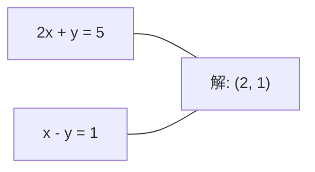
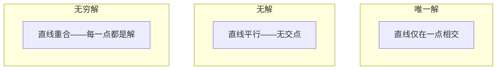

# 线性系统

> 求解 Ax = b 是数学史上最古老的问题，同时它仍然运行着你的神经网络。

**类型：** 构建  
**语言：** Python  
**先决条件：** 第一阶段，第01课（线性代数直觉）、02课（向量与矩阵）、03课（矩阵变换）  
**时间：** ~120分钟

## 学习目标

- 使用带部分主元化的高斯消元法和回代求解 Ax = b
- 使用 LU、QR 和 Cholesky 分解对矩阵进行分解，并解释各自的适用场景
- 推导最小二乘法的正规方程，并将其与线性和岭回归联系起来
- 使用条件数诊断病态系统，并应用正则化稳定系统

## 问题描述

每次训练线性回归时，都在求解线性系统。每次计算最小二乘拟合时，都在求解线性系统。每次神经网络层计算 `y = Wx + b`，其实也是在线性系统一侧进行计算。加正则化时，会修改该系统。使用高斯过程时，要对矩阵进行分解。计算马氏距离的协方差矩阵逆时，也是在求解线性系统。

方程 Ax = b 无处不在。A 是已知系数矩阵，b 是已知输出向量，x 是你想要找到的未知向量。在线性回归中，A 是数据矩阵，b 是目标向量，x 是权重向量。整个模型归结为：找到 x，使得 Ax 尽可能接近 b。

本课将从零开始构建解决该方程的各种主流方法。你将理解为何某些方法速度快而某些方法稳定，为何有些方法只适用于方阵系统，有些能处理超定系统，以及为何矩阵的条件数决定了解的有效性。

## 概念解析

### Ax = b 的几何意义

线性方程组有几何解释。每个方程定义一个超平面，解是所有超平面的交点（或集合）。

```text
2x + y = 5          二维空间中的两条直线。
x - y  = 1          它们在 x=2，y=1 处相交。
```



可能出现三种情况：



用矩阵形式表达，“唯一解”代表 A 可逆，“无解”代表系统不一致，“无穷解”代表 A 有零空间。大多数机器学习问题属于“无精确解”类别，因为方程（数据点）数多于未知数（参数）。这时，最小二乘法派上用场。

### 列视图与行视图

Ax = b 有两种理解方式。

**行视图。** A 的每一行对应一个方程，每个方程是一个超平面，解为所有超平面的交点。

**列视图。** A 的每一列是一个向量，问题转化为：A 的列向量的线性组合如何生成 b？

```text
A = | 2  1 |    b = | 5 |
    | 1 -1 |        | 1 |

行视图：同时求解 2x + y = 5 和 x - y = 1。

列视图：找 x1, x2 使得：
  x1 * [2, 1] + x2 * [1, -1] = [5, 1]
  2 * [2, 1] + 1 * [1, -1] = [4+1, 2-1] = [5, 1]   验证成立。
```

列视图更根本。如果 b 在 A 的列空间中，系统有解；否则，找到在列空间中最接近 b 的点，这就是最小二乘解。

### 高斯消元法

高斯消元法将 Ax = b 转化为上三角系统 Ux = c，随后使用回代求解。这是最直接的方法。

算法流程：

```text
1. 对每个主元列 k：
   a. 在第 k 行及以下的位置找出该列的最大元素（部分主元化）。
   b. 将该最大元素行与第 k 行交换。
   c. 对 k 行以下的每行 i：
      - 计算倍数 m = A[i][k] / A[k][k]
      - 用行 i 减去 m 倍的行 k。
2. 回代：从最后一行开始向上求解。
```

示例：

```text
初始：
| 2  1  1 | 8 |       R2 = R2 - 2*R1         | 2  1   1 |  8 |
| 4  3  3 |20 |  -->  R3 = R3 - 1*R1  -->    | 0  1   1 |  4 |
| 2  3  1 |12 |                            | 0  2   0 |  4 |

                              R3 = R3 - 2*R2         | 2  1   1 |  8 |
                                           -->     | 0  1   1 |  4 |
                                                    | 0  0  -2 | -4 |

回代：
  -2 * x3 = -4    -->  x3 = 2
  x2 + 2  = 4     -->  x2 = 2
  2*x1 + 2 + 2 = 8 -->  x1 = 2
```

高斯消元的时间复杂度是 O(n^3)。对于1000x1000系统，大约需要十亿次浮点运算。快速，但如果需要对同一 A 解多个系统，可以做得更好。

### 部分主元化：为何重要

没有主元化，高斯消元可能失败或产生垃圾结果。如果主元元素为零，除以零报错；元素很小时，会放大舍入误差。

```text
不带主元化：                     带部分主元化：
| 0.001  1 | 1.001 |              先交换行：
| 1      1 | 2     |              | 1      1 | 2     |
                                 | 0.001  1 | 1.001 |
m = 1/0.001 = 1000              m = 0.001/1 = 0.001
R2 = R2 - 1000*R1               R2 = R2 - 0.001*R1
| 0.001  1     | 1.001   |      | 1      1     | 2     |
| 0     -999   | -999.0  |      | 0      0.999 | 0.999 |

x2 = 1.000 (正确)              x2 = 1.000 (正确)
x1 = (1.001 - 1)/0.001          x1 = (2 - 1)/1 = 1.000 (正确)
   = 0.001/0.001 = 1.000        由于倍数很小，因此稳定。
```

有限精度的浮点运算中，无主元化版本可能损失大量有效数字。部分主元化总是选最大可用主元，减少误差放大。

### LU 分解

LU 分解将 A 分解为下三角矩阵 L 和上三角矩阵 U：A = LU。L 存储高斯消元的倍数，U 是消元结果。

```text
A = L @ U

| 2  1  1 |   | 1  0  0 |   | 2  1   1 |
| 4  3  3 | = | 2  1  0 | @ | 0  1   1 |
| 2  3  1 |   | 1  2  1 |   | 0  0  -2 |
```

为何要分解而非直接消元？因为分解后，求解 Ax = b （对任意 b）只需 O(n^2) 时间：

```text
Ax = b
LUx = b
令 y = Ux：
  Ly = b    (前代，O(n^2))
  Ux = y    (回代，O(n^2))
```

O(n^3) 的计算成本只需一次分解完成，之后每次解只需 O(n^2)。若需解1000个不同 b，LU 会节省约 1000/3 倍的总计算量。

带部分主元化时，分解形式为 PA = LU，其中 P 是记录行交换的置换矩阵。

### QR 分解

QR 分解将 A 分解为正交矩阵 Q 和上三角矩阵 R：A = QR。

正交矩阵满足 Q^T Q = I。其列向量正交且归一。乘以 Q 保持长度和角度不变。

```text
A = Q @ R

Q 有正交列： Q^T Q = I
R 是上三角矩阵

求解 Ax = b：
  QRx = b
  Rx = Q^T b    （乘以 Q^T，无需求逆）
  回代求解 x。
```

QR 在数值稳定性上优于 LU，适用于最小二乘问题。Gram-Schmidt 过程按列构建 Q：

```text
给定 A 的列向量 a1, a2, ...

q1 = a1 / ||a1||

q2 = a2 - (a2 · q1) * q1        （去掉 q1 方向上的分量）
q2 = q2 / ||q2||                （归一化）

q3 = a3 - (a3 · q1) * q1 - (a3 · q2) * q2
q3 = q3 / ||q3||

R[i][j] = qi · aj    对 i <= j
```

每一步消除之前所有 q 向量的分量，留下新的正交方向。

### Cholesky 分解

当 A 对称 (A = A^T) 且正定（所有特征值均为正）时，可以分解为 A = L L^T，L 为下三角矩阵。这就是 Cholesky（乔列斯基）分解。

```text
A = L @ L^T

| 4  2 |   | 2  0 |   | 2  1 |
| 2  5 | = | 1  2 | @ | 0  2 |

L[i][i] = sqrt(A[i][i] - sum(L[i][k]^2 for k < i))
L[i][j] = (A[i][j] - sum(L[i][k]*L[j][k] for k < j)) / L[j][j]    对 i > j
```

Cholesky 分解速度是 LU 的两倍，存储只需一半。仅适用于对称正定矩阵，但其应用多：

- 协方差矩阵为对称半正定（正定加正则化）
- 高斯过程中的核矩阵是对称正定
- 凸函数在极小点处的 Hessian 是对称正定
- A^T A 总是对称半正定

在高斯过程中，用 Cholesky 分解核矩阵 K，解 K alpha = y 得预测均值。Cholesky 因子还给出边缘似然的对数行列式：log det(K) = 2 * sum(log(diag(L)))。

### 最小二乘：无精确解时的Ax=b

若 A 是 m x n 矩阵，且 m > n（方程数多于未知数），系统超定无精确解。此时最小化平方误差：

```text
minimize ||Ax - b||^2

即残差平方和：
  sum((A[i,:] @ x - b[i])^2 for i in range(m))
```

最小值解满足正规方程：

```text
A^T A x = A^T b
```

推导：展开 ||Ax - b||^2 = (Ax - b)^T (Ax - b) = x^T A^T A x - 2 x^T A^T b + b^T b。对 x 求梯度并令零：2 A^T A x - 2 A^T b = 0。

```text
原始系统（超定，4个方程，2个未知）：
| 1  1 |         | 3 |
| 1  2 | x     = | 5 |       无解，无法精确满足全部方程。
| 1  3 |         | 6 |
| 1  4 |         | 8 |

正规方程：
A^T A = | 4  10 |    A^T b = | 22 |
        | 10 30 |            | 63 |

解： x = [1.5, 1.7]

这就是线性回归，x[0] 为截距，x[1] 为斜率。
```

### 正规方程 = 线性回归

两者完全对应。线性回归中，数据矩阵 X 每行是样本，每列是特征，目标向量 y 每元素对应样本标签。权重向量 w 满足：

```text
X^T X w = X^T y
w = (X^T X)^(-1) X^T y
```

这是线性回归的闭式解。`sklearn.linear_model.LinearRegression.fit()` 就是通过计算该式（或通过 QR、SVD 等等价方法）实现。

加上正则化项 λI 得岭回归：

```text
(X^T X + λ I) w = X^T y
w = (X^T X + λ I)^(-1) X^T y
```

正则化改善矩阵的条件数（更容易准确求逆），防止过拟合，使权重向零收缩。当 λ > 0 时，X^T X + λ I 恒为对称正定矩阵，可用 Cholesky 分解求解。

### 伪逆（Moore-Penrose）

伪逆 A+ 将矩阵求逆的概念推广到非方阵和奇异矩阵。任何矩阵 A：

```text
x = A+ b

其中 A+ = V Sigma+ U^T    （通过奇异值分解计算）
```

Sigma+ 通过对非零奇异值取倒数并转置得到。若 A = U Sigma V^T，则 A+ = V Sigma+ U^T。

```text
A = U Sigma V^T        (奇异值分解 SVD)

Sigma = | 5  0 |       Sigma+ = | 1/5  0  0 |
        | 0  2 |                | 0  1/2  0 |
        | 0  0 |

A+ = V Sigma+ U^T
```

伪逆给出最小范数最小二乘解。如果系统有：
- 唯一解：A+ b 给出它。
- 无解：A+ b 给出最小二乘解。
- 无限多解：A+ b 给出范数最小的那个解 ||x||。

NumPy 的 `np.linalg.lstsq` 和 `np.linalg.pinv` 都在内部使用奇异值分解（SVD）。

### 条件数

条件数衡量解对输入微小变化的敏感程度。对于矩阵 A，条件数定义为：

```text
kappa(A) = ||A|| * ||A^(-1)|| = sigma_max / sigma_min
```

其中 sigma_max 和 sigma_min 分别是最大和最小奇异值。

```text
良条件（kappa ~ 1）：          病态（kappa ~ 10^15）：
b 的微小变化 -->               b 的微小变化 -->
x 的微小变化                 x 的巨大变化

| 2  0 |   kappa = 2/1 = 2      | 1   1          |   kappa ~ 10^15
| 0  1 |   可安全求解            | 1   1+10^(-15) |   解无意义（结果“垃圾”）
```

经验规则：
- kappa < 100：安全，解准确。
- kappa ~ 10^k：浮点运算的有效数字损失约为 k 位。
- kappa ~ 10^16（针对 float64）：解无意义，矩阵实际上是奇异的。

在机器学习中，特征高度共线时出现病态。正则化（加上 lambda * I）将条件数从 sigma_max / sigma_min 改善为 (sigma_max + lambda) / (sigma_min + lambda)。

### 迭代方法：共轭梯度法（conjugate gradient）

对于非常大的稀疏系统（数百万未知数），直接方法如 LU 或 Cholesky 分解代价过高。迭代方法通过多次迭代改善猜测逐渐逼近解。

共轭梯度法（CG）用于解对称正定矩阵 A 的线性系统 Ax = b。在精确算术下，最多 n 次迭代找到精确解，但当 A 的特征值分布聚集时通常收敛更快。

```text
算法概要：
  x0 = 初始猜测（通常为零）
  r0 = b - A x0           （残差）
  p0 = r0                 （搜索方向）

  对 k = 0, 1, 2, ...:
    alpha = (rk · rk) / (pk · A pk)
    x_{k+1} = xk + alpha * pk
    r_{k+1} = rk - alpha * A pk
    beta = (r_{k+1} · r_{k+1}) / (rk · rk)
    p_{k+1} = r_{k+1} + beta * pk
    若 ||r_{k+1}|| < 容差: 停止
```

CG 应用场景包括：
- 大规模优化（Newton-CG 方法）
- 偏微分方程离散化求解
- 核方法中核矩阵过大无法分解时
- 作为其他迭代求解器的预处理器

收敛速度取决于条件数。条件较好的系统收敛更快，这也是正则化有益的另一个原因。

### 全面比较：何时用何法

| 方法           | 要求                   | 代价           | 适用场景                    |
|----------------|------------------------|----------------|-----------------------------|
| 高斯消元       | 方阵且非奇异 A         | O(n^3)         | 一次性求解方阵系统           |
| LU 分解        | 方阵且非奇异 A         | O(n^3) 分解 + O(n^2) 解 | 多次使用同一 A 求解         |
| QR 分解        | 任意 A (m >= n)        | O(m n^2)       | 最小二乘，数值稳定           |
| Cholesky 分解  | 对称正定 A             | O(n^3 / 3)     | 协方差矩阵、高斯过程、岭回归  |
| 正态方程       | 方程个数多于未知数 (m > n) | O(m n^2 + n^3) | 线性回归（小 n）             |
| SVD / 伪逆     | 任意 A                 | O(m n^2)       | 秩亏系统，最小范数解          |
| 共轭梯度       | 对称正定且稀疏的 A       | O(n * k * 非零元数) | 大型稀疏系统，k 为迭代次数   |

### 机器学习中的关联

本节所有方法都广泛用于生产环境中的机器学习：

**线性回归。** 闭式解求解正态方程 X^T X w = X^T y。一般用 Cholesky（n 小），QR（关注数值稳定），或者 SVD（可能秩亏）求解。

**岭回归。** 在 X^T X 上加 lambda * I。正则化系统 (X^T X + lambda * I) w = X^T y 总是可用 Cholesky 分解求解，因为当 lambda > 0 时该矩阵对称正定。

**高斯过程。** 预测均值需要解线性系统 K alpha = y，K 是核矩阵。Cholesky 分解是常用方法。对数边际似然依赖 log det(K) = 2 sum(log(diag(L)))。

**神经网络初始化。** 正交初始化用 QR 分解创建列正交的权重矩阵，防止深层网络中的信号塌缩。

**预处理。** 大规模优化器用不完全 Cholesky 或不完全 LU 作为共轭梯度的预处理器。

**特征工程。** X^T X 的条件数反映特征间的共线性。如果 kappa 很大，需删特征或加正则化。

## 实现步骤

### 步骤 1：带部分主元的高斯消元法

```python
import numpy as np

def gaussian_elimination(A, b):
    n = len(b)
    Ab = np.hstack([A.astype(float), b.reshape(-1, 1).astype(float)])

    for k in range(n):
        max_row = k + np.argmax(np.abs(Ab[k:, k]))
        Ab[[k, max_row]] = Ab[[max_row, k]]

        if abs(Ab[k, k]) < 1e-12:
            raise ValueError(f"矩阵在主元 {k} 处奇异或近似奇异")

        for i in range(k + 1, n):
            m = Ab[i, k] / Ab[k, k]
            Ab[i, k:] -= m * Ab[k, k:]

    x = np.zeros(n)
    for i in range(n - 1, -1, -1):
        x[i] = (Ab[i, -1] - Ab[i, i+1:n] @ x[i+1:n]) / Ab[i, i]

    return x
```

### 步骤 2：LU 分解

```python
def lu_decompose(A):
    n = A.shape[0]
    L = np.eye(n)
    U = A.astype(float).copy()
    P = np.eye(n)

    for k in range(n):
        max_row = k + np.argmax(np.abs(U[k:, k]))
        if max_row != k:
            U[[k, max_row]] = U[[max_row, k]]
            P[[k, max_row]] = P[[max_row, k]]
            if k > 0:
                L[[k, max_row], :k] = L[[max_row, k], :k]

        for i in range(k + 1, n):
            L[i, k] = U[i, k] / U[k, k]
            U[i, k:] -= L[i, k] * U[k, k:]

    return P, L, U

def lu_solve(P, L, U, b):
    n = len(b)
    Pb = P @ b.astype(float)

    y = np.zeros(n)
    for i in range(n):
        y[i] = Pb[i] - L[i, :i] @ y[:i]

    x = np.zeros(n)
    for i in range(n - 1, -1, -1):
        x[i] = (y[i] - U[i, i+1:] @ x[i+1:]) / U[i, i]

    return x
```

### 步骤 3：Cholesky 分解

```python
def cholesky(A):
    n = A.shape[0]
    L = np.zeros_like(A, dtype=float)

    for i in range(n):
        for j in range(i + 1):
            s = A[i, j] - L[i, :j] @ L[j, :j]
            if i == j:
                if s <= 0:
                    raise ValueError("矩阵不是正定的")
                L[i, j] = np.sqrt(s)
            else:
                L[i, j] = s / L[j, j]

    return L
```

### 步骤 4：用正态方程求最小二乘解

```python
def least_squares_normal(A, b):
    AtA = A.T @ A
    Atb = A.T @ b
    return gaussian_elimination(AtA, Atb)

def ridge_regression(A, b, lam):
    n = A.shape[1]
    AtA = A.T @ A + lam * np.eye(n)
    Atb = A.T @ b
    L = cholesky(AtA)
    y = np.zeros(n)
    for i in range(n):
        y[i] = (Atb[i] - L[i, :i] @ y[:i]) / L[i, i]
    x = np.zeros(n)
    for i in range(n - 1, -1, -1):
        x[i] = (y[i] - L.T[i, i+1:] @ x[i+1:]) / L.T[i, i]
    return x
```

### 步骤 5：计算条件数

```python
def condition_number(A):
    U, S, Vt = np.linalg.svd(A)
    return S[0] / S[-1]
```

## 使用示例

将各部分组合起来，做线性回归和岭回归的真实数据验证：

```python
np.random.seed(42)
X_raw = np.random.randn(100, 3)
w_true = np.array([2.0, -1.0, 0.5])
y = X_raw @ w_true + np.random.randn(100) * 0.1

X = np.column_stack([np.ones(100), X_raw])

w_ols = least_squares_normal(X, y)
print(f"普通最小二乘权重 (自实现):    {w_ols}")

w_np = np.linalg.lstsq(X, y, rcond=None)[0]
print(f"普通最小二乘权重 (numpy):   {w_np}")
print(f"最大差异: {np.max(np.abs(w_ols - w_np)):.2e}")

w_ridge = ridge_regression(X, y, lam=1.0)
print(f"岭回归权重 (自实现):  {w_ridge}")

from sklearn.linear_model import Ridge
ridge_sk = Ridge(alpha=1.0, fit_intercept=False)
ridge_sk.fit(X, y)
print(f"岭回归权重 (sklearn): {ridge_sk.coef_}")
```

## 交付成果

本课内容包括：
- `code/linear_systems.py`，内含从零实现的高斯消元、LU 分解、Cholesky 分解、最小二乘及岭回归
- 一个演示代码，展示正态方程解和 sklearn 的 LinearRegression 权重一致

## 练习

1. 用你的高斯消元、LU 求解器和 `np.linalg.solve` 解系统 `[[1,2,3],[4,5,6],[7,8,10]] x = [6, 15, 27]`。验证三者解在浮点容差内相同。

2. 生成 50×5 的随机矩阵 X 和目标 y = X @ w_true + 噪声。用正态方程、QR（`np.linalg.qr`）、SVD（`np.linalg.svd`）和 `np.linalg.lstsq` 解 w。比较四组解，测量 X^T X 的条件数，说明条件数如何影响方法可信度。

3. 制造一个近奇异矩阵，使两列几乎相同（如第2列 = 第1列 + 1e-10 * 噪声）。计算条件数。用带和不带正则化（加 0.01 * I）求解 Ax = b，比较解和残差。解释正则化为何有效。

4. 为 100×100 随机对称正定矩阵实现共轭梯度算法。计数收敛到容差 1e-8 的迭代次数。与理论最多 n 次迭代比较。

5. 对 10、50、200、500 大小的正定矩阵，计时你的 Cholesky 解算器、LU 解算器和 `np.linalg.solve`。画图比较性能，验证 Cholesky 大约比 LU 快 2 倍。

## 关键词汇

| 术语               | 通俗说法            | 准确含义                                          |
|--------------------|---------------------|--------------------------------------------------|
| 线性系统           | “求 x”              | 一组线性方程 Ax = b。求解 x 即找到输入使得 A 变换后为输出 b。  |
| 高斯消元           | “行简化”            | 通过行变换将矩阵下三角置零，转成上三角，最后回代求解。O(n^3)。    |
| 部分主元           | “换行提高稳定性”     | 在第 k 列消元前，将该列最大绝对值所在行交换到第 k 行，防止除小数。  |
| LU 分解            | “拆成上下三角”       | 写作 A = L U，L 是下三角（存乘子），U 是上三角（消元后矩阵）。可分摊计算成本。  |
| QR 分解            | “正交分解”           | 写作 A = Q R，Q 列正交单位，R 上三角。最稳定的最小二乘法。         |
| Cholesky 分解      | “矩阵开方”           | 对对称正定矩阵 A 写成 A = L L^T，计算量约为 LU 的一半。用于协方差、核矩阵、岭回归。 |
| 最小二乘           | “拟合最好但无精解”    | 在方程超定（方程数多于未知数）时，最小化残差平方和 ||Ax - b||^2。     |
| 正态方程           | “求导得到的方程”     | A^T A x = A^T b，最小二乘问题的一阶条件，线性回归的闭式解。         |
| 伪逆               | “非方阵的逆”         | 通过 SVD 写成 A+ = V Sigma+ U^T，给出最小范数的最小二乘解。         |
| 条件数             | “解的可靠性”         | kappa = sigma_max / sigma_min，反映对输入扰动的灵敏度和精度损失。    |
| 岭回归             | “带正则化的最小二乘”  | 解 (X^T X + lambda I) w = X^T y，加正则项改善条件数，防过拟合。     |
| 共轭梯度           | “大矩阵迭代解法”      | 面向对称正定矩阵的迭代求解器，最多 n 步收敛，适合大规模稀疏系统。   |
| 超定系统           | “数据多参数少”        | m > n 时出现，没有精确解，最小二乘方法找到最佳拟合解。              |
| 回代               | “自下而上解三角矩阵”  | 对上三角系统，从最后一行开始求解并逐步代入上面的方程。O(n^2)。       |
| 前代               | “自上而下解三角矩阵”  | 对下三角系统，从第一行开始求解并逐步代入下面的方程。O(n^2)，用于 LU 的 L 步。 |

## 深入阅读

- [MIT 18.06: Linear Algebra（线性代数）](https://ocw.mit.edu/courses/18-06-linear-algebra-spring-2010/)（Gilbert Strang）——关于线性系统和矩阵分解的权威课程
- [Numerical Linear Algebra（数值线性代数）](https://people.maths.ox.ac.uk/trefethen/text.html)（Trefethen & Bau）——理解数值稳定性（numerical stability）、条件数（conditioning）及算法失败原因的标准参考书
- [Matrix Computations（矩阵运算）](https://www.cs.cornell.edu/cv/GolubVanLoan4/golubandvanloan.htm)（Golub & Van Loan）——涵盖所有矩阵算法的百科全书式参考书
- [3Blue1Brown: Inverse Matrices（逆矩阵）](https://www.3blue1brown.com/lessons/inverse-matrices)——关于解方程 Ax = b 的几何直观解释
