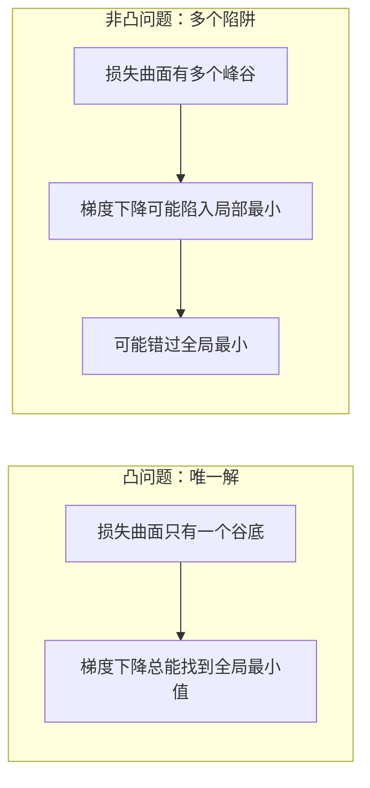
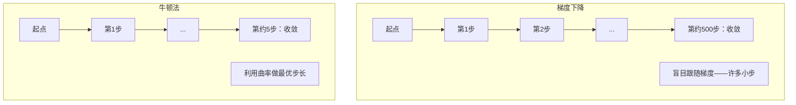
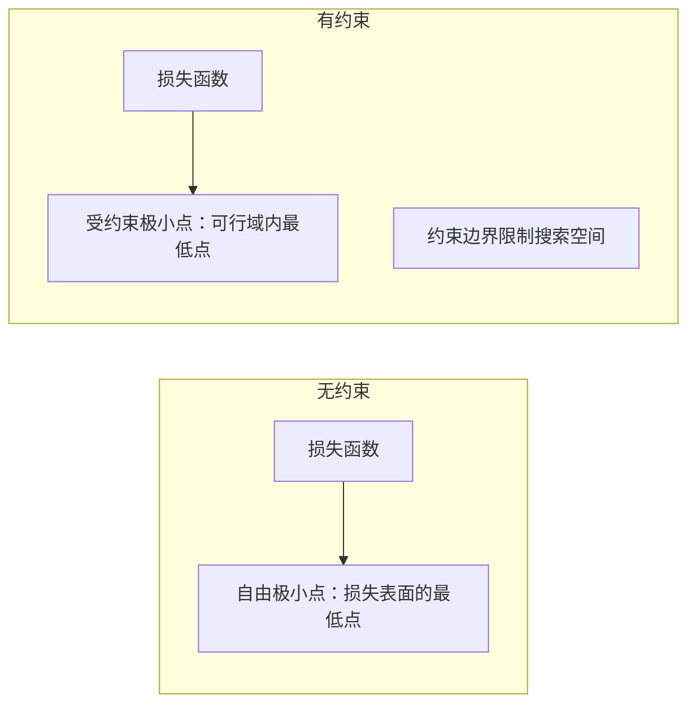
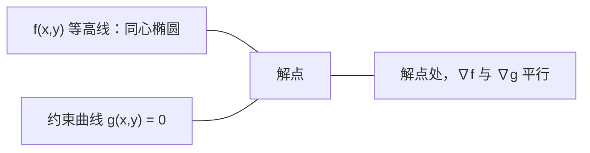

# 凸优化（Convex Optimization）

> 凸问题只有一个谷底。神经网络有数百万个。了解它们的区别至关重要。

**类型:** 构建  
**语言:** Python  
**先决条件:** 第一阶段，课程 04（机器学习微积分），08（优化）  
**时长:** 约90分钟

## 学习目标

- 使用定义、二阶导数和 Hessian（海森矩阵）准则测试函数是否为凸函数（convex）
- 实现牛顿法（Newton's method）并将其二次收敛性与梯度下降（gradient descent）进行比较
- 使用拉格朗日乘子法（Lagrange multipliers）解决约束优化问题并解释 KKT 条件
- 解释为何神经网络损失曲面（loss landscape）是非凸的，但随机梯度下降（SGD）仍能找到良好解

## 问题背景

课程 08 中你已经学习了梯度下降、动量（momentum）和 Adam 优化器。这些优化器都是在任何曲面上向下“爬坡”。但它们没有保证。梯度下降在非凸曲面上可能会陷入劣质局部最优、被鞍点困住，或永远振荡。你还是用它了，因为神经网络是非凸的且没有其他选择。

但机器学习中许多问题是凸的。例如线性回归、逻辑回归、支持向量机（SVM）、LASSO、岭回归。这些问题存在更强的理论保障：带数学保证的优化。凸问题只有一个谷底，任何向下走的算法都会到达全局最优。无需重启，无需学习率调度，无需祈祷。

理解凸性带来三个好处。第一，它告诉你问题是易解（凸的）还是难解（非凸的）。第二，它赋予你更快的工具，如牛顿法，用于凸问题。第三，它解释机器学习中普遍出现的概念：正则化作为约束、支持向量机中的对偶性（duality）、以及深度学习为何仍有效，尽管它违反了凸性带来的所有“好”性质。

## 概念解析

### 凸集（Convex sets）

集合 S 是凸集当且仅当对任意两个点，连接它们的线段完全位于 S 内。

| 凸集 | 非凸集 |
|---|---|
| **矩形**：任意两个内部点连线段都在集合内 | **星形/新月形状**：两点连线可能经过集合外 |
| **三角形**：所有内部点连线段也都在内部 | **甜甜圈/环形**：中间存在孔，部分线段离开集合 |
| 任何两点的连线段都在集合内部 | 有部分点的连线段越出集合外 |

形式测试：对任意 x, y ∈ S 和 t ∈ [0, 1]，点 tx + (1-t)y 也属于 S。

凸集示例：
- 直线、平面、整个 R^n
- 球（圆、球面、超球）
- 半空间：{x : a^T x <= b}
- 任意数量凸集的交集

非凸集示例：
- 甜甜圈（环形）
- 两个不相交圆的并集
- 任何存在“凹陷”或“空洞”的集合

### 凸函数（Convex functions）

函数 f 是凸函数，当其定义域是凸集，且对任意 x, y 属于域，任意 t ∈ [0, 1]：

```text
f(tx + (1-t)y) <= t*f(x) + (1-t)*f(y)
```

几何含义：图像上任意两点之间的线段在曲线或其上方。

| 性质 | 凸函数 | 非凸函数 |
|---|---|---|
| **线段测试** | 图上任意两点连线位于曲线之上或其上 | 某些两点间连线低于曲线 |
| **形状** | 单个向上的碗状或谷底 | 多峰多谷，曲率混杂 |
| **局部最小值** | 所有局部最小都是全局最小 | 存在多个不同高度的局部最小 |

常见凸函数示例：
- f(x) = x^2（二次抛物线）
- f(x) = |x|（绝对值）
- f(x) = e^x（指数）
- f(x) = max(0, x)（ReLU，尽管是分段线性）
- f(x) = -log(x), x > 0（负对数）
- 任何线性函数 f(x) = a^T x + b (既凸又凹)

### 凸性测试

三个实用测试，由易到难。

**测试 1：二阶导数测试（1D）**  
若 f''(x) ≥ 0 对所有 x 成立，则 f 是凸函数。

- f(x) = x^2: f''(x) = 2 ≥ 0，凸。
- f(x) = x^3: f''(x) = 6x，x < 0 时为负，不凸。
- f(x) = e^x: f''(x) = e^x > 0，凸。

**测试 2：Hessian（海森矩阵）测试（多变量）**  
若 Hessian 矩阵 H(x) 对所有 x 是半正定，则 f 是凸函数。Hessian 是二阶偏导数组成的矩阵。

**测试 3：定义测试**  
直接检验不等式 f(tx + (1-t)y) ≤ t*f(x) + (1-t)*f(y)。适用于导数难求的函数。

### 凸性的重要性

凸优化的核心定理：

**对于凸函数，每个局部最小即是全局最小。**

这意味着梯度下降不会陷入局部陷阱，任一路径向下的搜索都能到达相同解。算法保证收敛到最优解。



后果：  
- 不用随机重启  
- 不用复杂的学习率调度  
- 可以做收敛证明（收敛速率依赖函数性质）  
- 解决方案唯一（在平坦区域可能不唯一）

### 机器学习中的凸与非凸

| 问题类别 | 是否凸 | 原因 |
|---------|---------|-----|
| 线性回归（均方误差） | 是 | 权重的损失是二次函数 |
| 逻辑回归 | 是 | 对数损失是权重的凸函数 |
| 支持向量机（hinge 损失） | 是 | 是线性函数的最大值 |
| LASSO（L1回归） | 是 | 凸函数的和仍凸 |
| 岭回归（L2） | 是 | 二次+二次=凸 |
| 神经网络（任意损失） | 否 | 非线性激活造成非凸 |
| k-means 聚类 | 否 | 离散分配步骤 |
| 矩阵分解 | 否 | 未知量相乘导致非凸 |

线性模型加凸损失是凸的。一旦加隐藏层和非线性激活，凸性就破坏了。

### Hessian（海森矩阵）

函数 f: R^n -> R 的 Hessian 是 n×n 矩阵，包含所有二阶偏导数。

```text
H[i][j] = d^2 f / (dx_i dx_j)
```

例如，f(x, y) = x^2 + 3xy + y^2:

```text
df/dx = 2x + 3y       d^2f/dx^2 = 2      d^2f/dxdy = 3
df/dy = 3x + 2y       d^2f/dydx = 3      d^2f/dy^2 = 2

H = [ 2  3 ]
    [ 3  2 ]
```

Hessian 反映曲率：  
- 特征值全正：函数向上弯曲，点为凸  
- 特征值全负：函数向下弯曲，点为凹（局部最大）  
- 符号混合：鞍点  
- 零特征值：该方向平坦（退化）

凸性要求 Hessian 在每一点均半正定（特征值均≥0），非仅一个点。

### 牛顿法（Newton's method）

梯度下降利用一阶信息（梯度），牛顿法利用二阶信息（Hessian），在当前位置拟合二次近似，直接跳至该近似的极小点。

```text
更新规则：
  x_new = x - H^(-1) * gradient

对比梯度下降：
  x_new = x - lr * gradient
```

牛顿法用 Hessian 的逆替代学习率标量，自动根据局部曲率调整步长和方向。



优点：  
- 在极小点附近二次收敛（误差每步平方减少）  
- 无需调节学习率  
- 尺度不变，对参数化不敏感

缺点：  
- 计算 Hessian 需要 O(n²) 内存，求逆需 O(n³) 计算  
- 例如神经网络有100万个参数，需10^12个元素和10^18次运算  
- 不适合深度学习

### 约束优化

无约束优化：最小化 f(x) 在所有 x 上。  
约束优化：最小化 f(x) 满足约束条件。

实际问题常有约束。如你想最小化成本，但预算有限；想最小化误差，但模型复杂度有限。



### 拉格朗日乘子法（Lagrange multipliers）

将约束问题转化为无约束问题的方法。

问题：最小化 f(x)，满足 g(x) = 0。

方法：引入新变量（拉格朗日乘子 lambda），解无约束问题：

```text
L(x, lambda) = f(x) + lambda * g(x)
```

在极值点，L 的梯度为零：

```text
dL/dx = df/dx + lambda * dg/dx = 0
dL/dlambda = g(x) = 0
```

几何直觉：受约束极小点处，梯度 ∇f 与 ∇g 必须平行。若不平行，可以沿约束面移动减小 f。



示例：最小化 f(x,y) = x^2 + y^2，约束 x + y = 1。

```text
L = x^2 + y^2 + lambda(x + y - 1)

dL/dx = 2x + lambda = 0  =>  x = -lambda/2
dL/dy = 2y + lambda = 0  =>  y = -lambda/2
dL/dlambda = x + y - 1 = 0

由前两式：x = y
代入约束得：2x = 1 => x = y = 0.5, lambda = -1
```

离原点最近且满足约束的点是 (0.5, 0.5)。

### KKT 条件

Karush-Kuhn-Tucker 条件扩展拉格朗日乘子法，用于不等式约束。

问题：最小化 f(x)，满足 g_i(x) ≤ 0，i=1,...,m。

KKT 条件（最优的必要条件）：

```text
1. 驻点条件：    df/dx + sum(lambda_i * dg_i/dx) = 0
2. 原始可行性：  g_i(x) ≤ 0  ∀ i
3. 对偶可行性：  lambda_i ≥ 0  ∀ i
4. 互补松弛性：  lambda_i * g_i(x) = 0  ∀ i
```

互补松弛性关键含义：约束要么“活跃”（g_i=0，解位于约束边界），要么乘子为零（约束对解无影响）。无影响约束对应 lambda=0。

KKT 是支持向量机（SVM）的核心。支持向量是活跃约束的点（lambda>0）。其他点 lambda=0，不影响决策边界。

### 正则化作为约束优化

L1 和 L2 正则化不是随意的技巧。它们本质上是伪装的约束优化问题。

**L2 正则化（岭回归 Ridge）：**

```text
最小化  Loss(w)  条件是  ||w||^2 <= t

等价的无约束形式：
最小化  Loss(w) + lambda * ||w||^2
```

约束 ||w||^2 <= t 定义了一个球体（2D 中为圆，3D 中为球面）。解是在损失轮廓第一次接触这个球时的位置。

**L1 正则化（套索回归 LASSO）：**

```text
最小化  Loss(w)  条件是  ||w||_1 <= t

等价的无约束形式：
最小化  Loss(w) + lambda * ||w||_1
```

约束 ||w||_1 <= t 定义了一个菱形（2D 中旋转的正方形）。

| 属性 | L2 约束（圆） | L1 约束（菱形） |
|---|---|---|
| **约束形状** | 圆（高维中为球体） | 菱形（2D 中旋转的正方形） |
| **损失轮廓接触位置** | 光滑边界 — 圆上的任意点 | 角点 — 与坐标轴对齐 |
| **解的行为** | 权重变小但非零 | 一些权重正好为零（稀疏） |
| **结果** | 权重收缩 | 特征选择 |

这解释了为何 L1 产生稀疏模型（特征选择），而 L2 仅仅是权重收缩。菱形的角点与坐标轴对齐，损失轮廓更可能接触角点，从而令一个或多个权重正好变为零。

### 对偶性（Duality）

每个约束优化问题（原问题 primal）都有一个对应的对偶问题（dual）。对于凸问题，原问题和对偶问题有相同的最优值。这被称为强对偶性。

拉格朗日对偶函数：

```text
原问题：最小化 f(x)，条件是 g(x) <= 0
拉格朗日函数：L(x, lambda) = f(x) + lambda * g(x)
对偶函数：d(lambda) = min_x L(x, lambda)
对偶问题：最大化 d(lambda)，条件是 lambda >= 0
```

对偶性的重要性：
- 对偶问题有时比原问题更容易求解
- 支持向量机（SVM）是在对偶形式下求解的，问题依赖于数据点间的点积（允许核技巧）
- 对偶问题为原问题的最优值提供了下界，有助于检验解的质量

针对 SVM：

```text
原问题：寻找 w, b 最大化间隔 2/||w||，条件为
        y_i(w^T x_i + b) >= 1 对所有 i 成立

对偶问题：最大化 sum(alpha_i) - 0.5 * sum_ij(alpha_i * alpha_j * y_i * y_j * x_i^T x_j)
          条件为 alpha_i >= 0 且 sum(alpha_i * y_i) = 0

对偶问题仅涉及点积 x_i^T x_j。
用 K(x_i, x_j) 替换点积即可实现核技巧。
```

### 为什么深度学习在非凸情况下依然有效

神经网络的损失函数极为非凸。按传统看法，这类优化应该失败，然而随机梯度下降（SGD）却能可靠地找到好解。原因有几个方面。

**大多数局部极小点都足够好。** 在高维空间中，随机临界点（梯度为零的点）绝大多数是鞍点，而非局部极小点。存在的少数局部极小点的损失值普遍接近全局极小值。在参数空间有数百万维时，被困在糟糕的局部极小点的概率极低。

**真正的阻碍是鞍点而非局部极小点。** 一个 n 维函数的鞍点具备正负混合的曲率方向。高维空间内随机临界点所有 n 个特征值均正（局部极小）的概率约为 2^(-n)，几乎所有临界点都是鞍点。SGD 的噪声帮助跳出这些鞍点。

**过参数化平滑了损失曲面。** 训练样本数量少于参数数量的网络有更光滑、更连通的损失表面。网络越宽，坏局部极小点越少。这虽反直觉，却补充了实验证据。

**损失曲面结构：**

| 属性 | 低维空间 | 高维空间 |
|---|---|---|
| **曲面形态** | 许多孤立的峰谷 | 平滑连通的谷地 |
| **极小点** | 许多孤立局部极小点 | 少量糟糕局部极小点，大多数近似最优 |
| **导航** | 难以找到全局极小点 | 多条路径通向较好解 |
| **临界点** | 局部极小点和鞍点混合 | 绝大多数为鞍点，非局部极小点 |

**随机噪声作为隐式正则化。** 小批量 SGD 引入噪声防止陷入锐利极小点。锐利极小点易过拟合，平坦极小点泛化性好。噪声偏向优化过程进入损失平缓区域。

### 实践中的二阶方法

纯牛顿法对大模型不可行，有几种近似方法使二阶信息实用。

**L-BFGS（有限内存 BFGS）：** 用最近 m 次梯度差分逼近海森矩阵的逆。需要 O(mn) 内存，远小于 O(n^2)。适用于参数数目最多 ~10,000 的问题。经典 ML（逻辑回归、条件随机场）常用，深度学习较少采用。

**自然梯度：** 用费舍尔信息矩阵（对数似然的期望海森矩阵）替代标准海森，考虑概率分布几何结构。K-FAC（Kronecker-分解近似曲率法）将费舍尔矩阵近似为 Kronecker 积，适合神经网络。

**无海森优化（Hessian-free）：** 用共轭梯度法求解 Hx = g，无需显式计算 H。只需海森向量积，可用自动微分 O(n) 时间获得。

**对角近似：** Adam 所用二阶矩是海森对角项的对角近似。AdaHessian 用 Hutchinson 估计器估算海森对角元素，更精确。

| 方法 | 内存 | 每步计算成本 | 适用场景 |
|--------|--------|--------------|-------------|
| 梯度下降 | O(n) | O(n) | 基线，大模型 |
| 牛顿法 | O(n²) | O(n³) | 小型凸问题 |
| L-BFGS | O(mn) | O(mn) | 中型凸问题 |
| Adam | O(n) | O(n) | 深度学习默认 |
| K-FAC | O(n) | 每层 O(n) | 研究，大批量训练 |

## 实操

### 第一步：凸性检测器

实现一个函数，通过采样点验证定义来经验测试函数凸性。

```python
import random
import math

def check_convexity(f, dim, bounds=(-5, 5), samples=1000):
    violations = 0
    for _ in range(samples):
        x = [random.uniform(*bounds) for _ in range(dim)]
        y = [random.uniform(*bounds) for _ in range(dim)]
        t = random.uniform(0, 1)
        mid = [t * xi + (1 - t) * yi for xi, yi in zip(x, y)]
        lhs = f(mid)
        rhs = t * f(x) + (1 - t) * f(y)
        if lhs > rhs + 1e-10:
            violations += 1
    return violations == 0, violations
```

### 第二步：2D 牛顿法

实现牛顿方法，使用显式海森矩阵。与梯度下降比较收敛速度。

```python
def newtons_method(f, grad_f, hessian_f, x0, steps=50, tol=1e-12):
    x = list(x0)
    history = [x[:]]
    for _ in range(steps):
        g = grad_f(x)
        H = hessian_f(x)
        det = H[0][0] * H[1][1] - H[0][1] * H[1][0]
        if abs(det) < 1e-15:
            break
        H_inv = [
            [H[1][1] / det, -H[0][1] / det],
            [-H[1][0] / det, H[0][0] / det],
        ]
        dx = [
            H_inv[0][0] * g[0] + H_inv[0][1] * g[1],
            H_inv[1][0] * g[0] + H_inv[1][1] * g[1],
        ]
        x = [x[0] - dx[0], x[1] - dx[1]]
        history.append(x[:])
        if sum(gi ** 2 for gi in g) < tol:
            break
    return history
```

### 第三步：拉格朗日乘子求解器

通过对拉格朗日函数的梯度下降实现约束优化。

```python
def lagrange_solve(f_grad, g_val, g_grad, x0, lr=0.01,
                   lr_lambda=0.01, steps=5000):
    x = list(x0)
    lam = 0.0
    history = []
    for _ in range(steps):
        fg = f_grad(x)
        gv = g_val(x)
        gg = g_grad(x)
        x = [
            xi - lr * (fgi + lam * ggi)
            for xi, fgi, ggi in zip(x, fg, gg)
        ]
        lam = lam + lr_lambda * gv
        history.append((x[:], lam, gv))
    return history
```

### 第四步：比较一阶与二阶方法

对同一二次函数同时运行梯度下降和牛顿法。统计收敛步数。

```python
def quadratic(x):
    return 5 * x[0] ** 2 + x[1] ** 2

def quadratic_grad(x):
    return [10 * x[0], 2 * x[1]]

def quadratic_hessian(x):
    return [[10, 0], [0, 2]]
```

牛顿法对二次函数一步收敛（精确解）。梯度下降需要数百步，因为海森矩阵特征值相差 5 倍，导致狭长峡谷。

## 使用建议

凸性分析直接用于机器学习模型和求解器选择。

对凸问题（逻辑回归、支持向量机、LASSO）：
- 使用专用求解器（liblinear、CVXPY、scipy.optimize.minimize 方法='L-BFGS-B'）
- 解唯一，收敛保证
- 二阶方法实用且快速

对非凸问题（神经网络）：
- 使用一阶方法（SGD，Adam）
- 接受解依赖初始化和随机性
- 利用过参数化、噪声和学习率调度作为隐式正则化
- 不用费力寻找全局最优，良好局部极小足够

```python
from scipy.optimize import minimize

result = minimize(
    fun=lambda w: sum((y - X @ w) ** 2) + 0.1 * sum(w ** 2),
    x0=np.zeros(d),
    method='L-BFGS-B',
    jac=lambda w: -2 * X.T @ (y - X @ w) + 0.2 * w,
)
```

对支持向量机，对偶形式支持核技巧：

```python
from sklearn.svm import SVC

svm = SVC(kernel='rbf', C=1.0)
svm.fit(X_train, y_train)
print(f"支持向量数量: {svm.n_support_}")
```

## 练习

1. **凸性展示。** 用检测器测试以下函数凸性：f(x) = x^4，f(x) = sin(x)，f(x,y) = x^2 + y^2，f(x,y) = x*y，f(x) = max(x, 0)。解释结果为何合理。

2. **牛顿法与梯度下降竞速。** 在函数 f(x,y) = 50*x^2 + y^2 上，起始点为 (10, 10)。两者分别需要多少步达成 loss < 1e-10？条件数（海森最大和最小特征值之比）增大时梯度下降如何变化？

3. **拉格朗日乘子几何。** 最小化 f(x,y) = (x-3)^2 + (y-3)^2，约束为 x + 2y = 4。通过检验解处 f 的梯度平行于 g 的梯度确认结果。

4. **正则化约束。** 实现 L1 约束优化：最小化 (x-3)^2 + (y-2)^2，约束为 |x| + |y| <= 1。显示解中某坐标为零，验证菱形约束的稀疏性。

5. **海森特征值分析。** 计算 Rosenbrock 函数在 (1,1) 和 (-1,1) 处的海森矩阵特征值。特征值说明了最小值处与远处的曲率性质。

## 关键词汇

| 词汇 | 含义 |
|------|---------------|
| 凸集（Convex set） | 集合中任意两点连线全部包含在集合内 |
| 凸函数（Convex function） | 图形中任意两点连线位于函数图像之上（或重合）。等价于海森矩阵处处半正定 |
| 局部极小点（Local minimum） | 在邻域内值最小的点。对于凸函数，局部极小即全局极小 |
| 全局极小点（Global minimum） | 函数整个定义域内的最低点 |
| 海森矩阵（Hessian matrix） | 二阶偏导数组成的矩阵，刻画曲率信息 |
| 半正定（Positive semidefinite） | 矩阵特征值非负。多维对应于“二阶导数 >= 0” |
| 条件数（Condition number） | 海森最大和最小特征值之比；大条件数表示狭长的谷与梯度下降缓慢 |
| 牛顿法（Newton's method） | 利用海森逆矩阵确定更新步长和方向的二阶优化方法。对极小点附近实现二次收敛 |
| 拉格朗日乘子（Lagrange multiplier） | 引入的变量，将有约束优化转为无约束问题 |
| KKT 条件（KKT conditions） | 不等式约束下最优的必要条件，推广拉格朗日乘子法 |
| 互补松弛性（Complementary slackness） | 约束激活时乘子非零，反之乘子为零 |
| 对偶性（Duality） | 有约束优化问题及其对偶问题。凸问题原对偶最优值相等 |
| 强对偶性（Strong duality） | 原问题和对偶问题最优值相同。适用于满足 Slater 条件的凸问题 |
| L-BFGS | 利用最近 m 次梯度差分近似海森逆矩阵的有限内存二阶方法 |
| 鞍点（Saddle point） | 梯度为零，且部分方向极小，部分方向极大 |
| 过参数化（Overparameterization） | 参数数多于训练样本。平滑损失曲面，减少糟糕局部极小点 |

## 深入阅读

- [Boyd & Vandenberghe: Convex Optimization（凸优化）](https://web.stanford.edu/~boyd/cvxbook/) - 标准教材，免费在线提供  
- [Bottou, Curtis, Nocedal: Optimization Methods for Large-Scale Machine Learning (2018)（大规模机器学习的优化方法）](https://arxiv.org/abs/1606.04838) - 架起凸优化理论与深度学习实践的桥梁  
- [Choromanska et al.: The Loss Surfaces of Multilayer Networks (2015)（多层网络的损失曲面）](https://arxiv.org/abs/1412.0233) - 解析非凸神经网络损失空间为何没有想象中那么糟糕  
- [Nocedal & Wright: Numerical Optimization（数值优化）](https://link.springer.com/book/10.1007/978-0-387-40065-5) - Newton 方法、L-BFGS 和约束优化的全面参考资料
