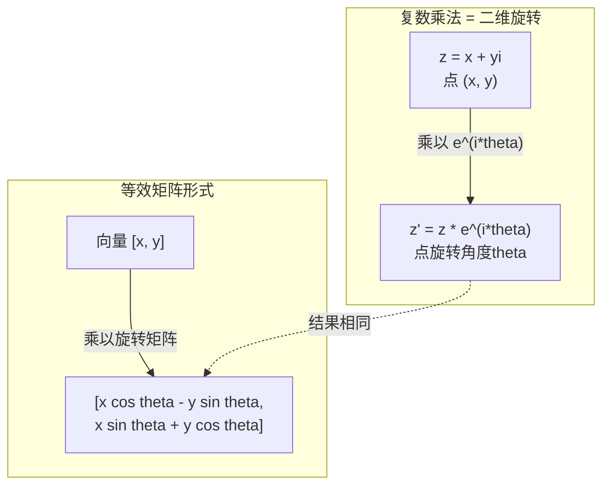
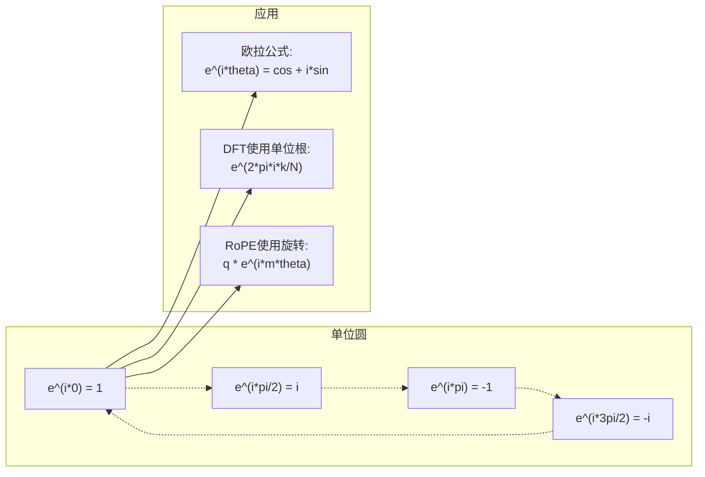

# AI中的复数

> -1的平方根并非虚构。它是旋转、频率和信号处理一半的关键。

**类型：** 学习  
**语言：** Python  
**先修知识：** 阶段1，第01-04课（线性代数，微积分）  
**时长：** ~60分钟

## 学习目标

- 在矩形坐标和平面坐标系中执行复数运算（加法，乘法，除法，共轭）  
- 应用欧拉公式（Euler's formula 欧拉公式）在复指数和三角函数之间转换  
- 利用复单位根实现离散傅里叶变换（Discrete Fourier Transform）  
- 解释复数旋转如何构成RoPE和Transformer中的正弦位置编码的基础  

## 问题背景

你打开一篇傅里叶变换的论文，发现到处都是`i`。你查看Transformer的位置编码，看到不同频率的`sin`和`cos`——复指数的实部和虚部。你读量子计算时，发现所有东西都表达在复向量空间里。

复数看起来抽象。基于-1的平方根搭建的数字系统感觉像数学把戏。但它不是把戏。它是旋转和振荡的自然语言。无论何时有旋转、振动或振荡，复数都是合适的工具。

不理解复数，你无法理解离散傅里叶变换（DFT），无法理解快速傅里叶变换（FFT），无法理解现代语言模型中RoPE（旋转位置嵌入）的原理，也不了解最初Transformer论文中正弦位置编码为何采用那些频率。

本课从零构建复数算术，连接几何，并精确展示复数在机器学习中出现的位置。

## 概念讲解

### 什么是复数？

复数由两部分组成：实部和虚部。

```text
z = a + bi

其中：
  a 是实部
  b 是虚部
  i 是虚数单位，由 i^2 = -1 定义
```

仅此而已。你将数轴扩展到一个平面。实数位于一轴，虚数位于另一轴。每个复数对应平面上的一点。

### 复数运算

**加法。** 实部相加，虚部相加。

```text
(a + bi) + (c + di) = (a + c) + (b + d)i

示例: (3 + 2i) + (1 + 4i) = 4 + 6i
```

**乘法。** 使用分配律，记住 i^2 = -1。

```text
(a + bi)(c + di) = ac + adi + bci + bdi^2
                 = ac + adi + bci - bd
                 = (ac - bd) + (ad + bc)i

示例: (3 + 2i)(1 + 4i) = 3 + 12i + 2i + 8i^2
                            = 3 + 14i - 8
                            = -5 + 14i
```

**共轭。** 虚部符号取反。

```text
共轭复数：(a + bi)的共轭是 a - bi
```

复数与其共轭的乘积总是实数：

```text
(a + bi)(a - bi) = a^2 + b^2
```

**除法。** 分子分母同时乘以分母的共轭。

```text
(a + bi) / (c + di) = (a + bi)(c - di) / (c^2 + d^2)
```

这消除了分母中的虚部，让你得到一个标准复数。

### 复平面

复平面将每个复数映射为二维点。水平方向是实轴，垂直方向是虚轴。

```text
z = 3 + 2i  对应点 (3, 2)
z = -1 + 0i 对应实轴上的点 (-1, 0)
z = 0 + 4i  对应虚轴上的点 (0, 4)
```

复数既是点也是从原点出发的向量。这种双重解释使复数在几何中非常有用。

### 极坐标形式

平面上的任一点可以由其与原点的距离和与正实轴的夹角描述。

```text
z = r * (cos(theta) + i*sin(theta))

其中：
  r = |z| = sqrt(a^2 + b^2)     （模或幅度）
  theta = atan2(b, a)             （幅角或辐角）
```

矩形形式 (a + bi) 适合加法。极坐标形式 (r, theta) 适合乘法。

**极坐标形式的乘法。** 幅度相乘，角度相加。

```text
z1 = r1 * e^(i*theta1)
z2 = r2 * e^(i*theta2)

z1 * z2 = (r1 * r2) * e^(i*(theta1 + theta2))
```

这就是为什么复数适合旋转。乘以模长为1的复数是纯旋转。

### 欧拉公式

复指数和三角函数之间的桥梁：

```text
e^(i*theta) = cos(theta) + i*sin(theta)
```

这是本课最重要的公式。当 theta = pi 时：

```text
e^(i*pi) = cos(pi) + i*sin(pi) = -1 + 0i = -1

因此： e^(i*pi) + 1 = 0
```

五个基本常数（e, i, pi, 1, 0）在一条方程中相连。

### 欧拉公式对机器学习的重要性

欧拉公式说明 `e^(i*theta)` 随着 theta 变化沿单位圆旋转。theta=0时位置为(1, 0)，theta=pi/2时为(0,1)，theta=pi时为(-1,0)，theta=3*pi/2时为(0,-1)，一周为 2*pi。

这意味着复指数即旋转。旋转在信号处理和机器学习中无处不在。

### 与二维旋转的联系

复数乘以 e^(i*theta) 实际上是绕原点旋转点 (x, y) 角度 theta。

```text
复数乘法实现旋转：
  (x + yi) * (cos(theta) + i*sin(theta))
  = (x*cos(theta) - y*sin(theta)) + (x*sin(theta) + y*cos(theta))i

矩阵乘法实现旋转：
  [cos(theta)  -sin(theta)] [x]   [x*cos(theta) - y*sin(theta)]
  [sin(theta)   cos(theta)] [y] = [x*sin(theta) + y*cos(theta)]
```

两者结果相同。复数乘法即二维旋转。旋转矩阵是复数乘法的矩阵形式。



### 相量和旋转信号

复指数 e^(i*omega*t) 是单位圆上以角频率 omega 旋转的点。时间 t 增加时，点绕圆旋转。

其实部是 cos(omega*t)，虚部是 sin(omega*t)。正弦信号是旋转复数的投影影子。

```text
e^(i*omega*t) = cos(omega*t) + i*sin(omega*t)

实部：      cos(omega*t)    -- 余弦波
虚部：      sin(omega*t)    -- 正弦波
```

这就是相量表示。它用平滑旋转的箭头替代了波动的正弦波。相位偏移变成角度偏移，振幅变成幅度变化，信号加法变成矢量加法。

### 单位根

N次单位根是单位圆上一组等间距点：

```text
w_k = e^(2*pi*i*k/N)    对 k = 0, 1, 2, ..., N-1
```

对于 N=4，单位根是：1、i、-1、-i（四个罗盘点）。对于 N=8，还包括四个对角点。

单位根是离散傅里叶变换（DFT）的基础。DFT将信号分解为N个均匀分布频率的分量。

### 与DFT的联系

信号 x[0], x[1], ..., x[N-1] 的离散傅里叶变换为：

```text
X[k] = sum_{n=0}^{N-1} x[n] * e^(-2*pi*i*k*n/N)
```

每个 X[k] 测量信号与第 k 个单位根的相关性——频率为 k 的复数正弦。DFT将信号分解为 N 个旋转相量，告诉你每个成分的振幅和相位。

### 为什么 i 不是“虚数”

“虚数”一词是历史上的误会。笛卡尔用此词带有轻蔑。其实 i 并不比负数更“虚幻”，而否认负数的历史更长。负数回答“从3减去什么得5？”虚数单位回答“哪个数平方等于-1？”

更实用地讲：i 是一个90度旋转算子。实数乘以 i 一次，旋转90度到虚轴。再乘以 i 一次（即 i^2），再旋转90度，现在指向负实轴。这就是为什么 i^2 = -1。不是神秘，而是由两个四分之一转组成的半转。

这就是为什么复数在工程领域无处不在。所有旋转相关的现象——电磁波、量子态、信号振荡、位置编码——都自然用复数描述。

### 复指数和三角函数的区别

欧拉公式出现前，工程师用 A*cos(omega*t + phi) 表示信号——振幅 A，频率 omega，相位 phi。虽能用，但运算复杂。两个不同相位的余弦相加需三角恒等式。

用复指数表示为 A*e^(i*(omega*t + phi))，加法只需复数相加，乘法（调制）为幅度相乘、角度相加。相位偏移变角度加法，频移对应相量乘法。

信号处理领域采用复指数表示，是因为运算简洁清晰。真实信号总是复数表示的实部。虚部被视为辅助，使代数运算自然。

### 与Transformer的联系

**正弦位置编码**（原始Transformer论文）：

```text
PE(pos, 2i) = sin(pos / 10000^(2i/d))
PE(pos, 2i+1) = cos(pos / 10000^(2i/d))
```

sin和cos对是不同频率复指数的实部和虚部。每个频率提供不同“分辨率”的位置编码。低频变动慢（粗位置），高频变动快（细位置），合起来给每个位置独特频率指纹。

**RoPE（旋转位置嵌入）**更进一步，明确通过复旋转矩阵乘以查询和键向量。两个tokens的相对位置转为旋转角度。注意力计算使用旋转向量，使模型通过复乘法响应相对位置。

| 运算       | 代数形式              | 几何含义         |
|------------|-----------------------|------------------|
| 加法       | (a+c) + (b+d)i        | 平面中的向量加法 |
| 乘法       | (ac-bd) + (ad+bc)i    | 旋转与缩放       |
| 共轭       | a - bi                | 对实轴的反射     |
| 幅度       | sqrt(a^2 + b^2)       | 距离原点的长度   |
| 相位       | atan2(b, a)           | 与正实轴的夹角   |
| 除法       | 乘以共轭               | 逆旋转并重新缩放 |
| 幂         | r^n * e^(i*n*theta)   | 旋转n次，放大r^n |



## 实现它

### 第1步：复数类

构建一个支持算术运算、幅值（magnitude）、相位（phase）及矩形坐标与极坐标转换的复数类。

```python
import math

class Complex:
    def __init__(self, real, imag=0.0):
        self.real = real
        self.imag = imag

    def __add__(self, other):
        return Complex(self.real + other.real, self.imag + other.imag)

    def __mul__(self, other):
        r = self.real * other.real - self.imag * other.imag
        i = self.real * other.imag + self.imag * other.real
        return Complex(r, i)

    def __truediv__(self, other):
        denom = other.real ** 2 + other.imag ** 2
        r = (self.real * other.real + self.imag * other.imag) / denom
        i = (self.imag * other.real - self.real * other.imag) / denom
        return Complex(r, i)

    def magnitude(self):
        return math.sqrt(self.real ** 2 + self.imag ** 2)

    def phase(self):
        return math.atan2(self.imag, self.real)

    def conjugate(self):
        return Complex(self.real, -self.imag)
```

### 第2步：极坐标转换和欧拉公式

```python
def to_polar(z):
    return z.magnitude(), z.phase()

def from_polar(r, theta):
    return Complex(r * math.cos(theta), r * math.sin(theta))

def euler(theta):
    return Complex(math.cos(theta), math.sin(theta))
```

验证：`euler(theta).magnitude()` 应始终为 1.0。`euler(0)` 应返回 (1, 0)，`euler(pi)` 应返回 (-1, 0)。

### 第3步：旋转

使用复数乘法旋转点 (x, y) 角度 theta：

```python
point = Complex(3, 4)
rotated = point * euler(math.pi / 4)
```

幅值保持不变，只有角度改变。

### 第4步：基于复数运算的离散傅里叶变换（DFT）

```python
def dft(signal):
    N = len(signal)
    result = []
    for k in range(N):
        total = Complex(0, 0)
        for n in range(N):
            angle = -2 * math.pi * k * n / N
            total = total + Complex(signal[n], 0) * euler(angle)
        result.append(total)
    return result
```

这是 O(N^2) 复杂度的 DFT。每个输出 X[k] 是信号采样与单位根乘积的和。

### 第5步：逆离散傅里叶变换（IDFT）

逆 DFT 用于从频谱重建信号。与前向 DFT 的区别是指数符号反转并除以 N。

```python
def idft(spectrum):
    N = len(spectrum)
    result = []
    for n in range(N):
        total = Complex(0, 0)
        for k in range(N):
            angle = 2 * math.pi * k * n / N
            total = total + spectrum[k] * euler(angle)
        result.append(Complex(total.real / N, total.imag / N))
    return result
```

这样可以完美重构。先 DFT，再 IDFT，信号恢复到机器精度，信息无损。

### 第6步：单位根

```python
def roots_of_unity(N):
    return [euler(2 * math.pi * k / N) for k in range(N)]
```

验证两条性质：
- 每个单位根幅值均为1。
- N 个单位根的和为零（对称抵消）。

这些性质使得 DFT 可逆。单位根构成频域的正交基。

## 应用它

Python 内置支持复数。字面量 `j` 表示虚数单位。

```python
z = 3 + 2j
w = 1 + 4j

print(z + w)
print(z * w)
print(abs(z))

import cmath
print(cmath.phase(z))
print(cmath.exp(1j * cmath.pi))
```

对数组操作，numpy 原生支持复数：

```python
import numpy as np

z = np.array([1+2j, 3+4j, 5+6j])
print(np.abs(z))
print(np.angle(z))
print(np.conj(z))
print(np.real(z))
print(np.imag(z))

signal = np.sin(2 * np.pi * 5 * np.linspace(0, 1, 128))
spectrum = np.fft.fft(signal)
freqs = np.fft.fftfreq(128, d=1/128)
```

## 运行它

运行 `code/complex_numbers.py` 生成 `outputs/skill-complex-arithmetic.md`。

## 练习

1. **手算复数运算。** 计算 (2 + 3i) * (4 - i)，用代码验证。然后计算 (5 + 2i) / (1 - 3i)。将两结果绘制在复平面，验证乘法使第一个数旋转并缩放。

2. **旋转序列。** 从点 (1, 0) 开始。乘以 e^(i*pi/6) 共十二次，验证旋转 12 次后回到 (1, 0)。打印每步坐标，确认轨迹为正十二边形。

3. **已知信号的 DFT。** 创建信号 sin(2*pi*3*t) 与 0.5*sin(2*pi*7*t) 的叠加，在 32 个采样点上采样。运行 DFT，验证幅度谱在频率 3 与 7 处有峰值，7 的峰高约为 3 的一半。

4. **单位根可视化。** 计算8个单位根，验证其和为零。验证任何单位根乘以本原单位根 e^(2*pi*i/8) 得到下一个单位根。

5. **旋转矩阵等效性。** 对10个随机角度和10个随机点，验证复数乘法与 2x2 旋转矩阵乘法结果一致。打印最大数值差异。

## 关键术语

| 术语 | 含义 |
|------|------|
| Complex number（复数） | 形式为 a + bi 的数，其中 a 是实部，b 是虚部，i^2 = -1 |
| Imaginary unit（虚数单位） | 数字 i，满足 i^2 = -1。非哲学上的“虚构”，而是旋转算子 |
| Complex plane（复平面） | 以 x 轴为实部，y 轴为虚部的二维平面，也称为阿尔冈平面（Argand plane） |
| Magnitude (modulus)（幅值/模） | 原点到点的距离：sqrt(a^2 + b^2)，记作 \|z\| |
| Phase (argument)（相位/辐角） | 从正实轴的角度：atan2(b, a)，记作 arg(z) |
| Conjugate（共轭复数） | 关于实轴的镜像：a + bi 的共轭是 a - bi |
| Polar form（极坐标形式） | 将 z 表示为 r * e^(i*theta) 代替 a + bi，便于处理乘法 |
| Euler's formula（欧拉公式） | e^(i*theta) = cos(theta) + i*sin(theta)，连接指数与三角函数 |
| Phasor（相量） | 旋转复数 e^(i*omega*t)，表示正弦信号 |
| Roots of unity（单位根） | N 个复数 e^(2*pi*i*k/N)，k=0到N-1，单位圆上等距点 |
| DFT（离散傅里叶变换） | 基于单位根分解信号为复正弦分量 |
| RoPE（旋转位置编码） | 利用复数乘法在 Transformer 注意力中编码相对位置 |

## 进一步阅读

- [欧拉公式的视觉介绍](https://betterexplained.com/articles/intuitive-understanding-of-eulers-formula/) - 以几何视角构建直观理解，无需复杂符号
- [Su 等人：RoFormer（2021）](https://arxiv.org/abs/2104.09864) - 介绍旋转位置编码的论文，基于复数旋转
- [Vaswani 等人：Attention Is All You Need（2017）](https://arxiv.org/abs/1706.03762) - Transformer 原始论文，包含正弦位置编码
- [3Blue1Brown：含群论入门的欧拉公式](https://www.youtube.com/watch?v=mvmuCPvRoWQ) - 形象解释为何 e^(i*pi) = -1
- [Needham：《视觉复分析》](https://global.oup.com/academic/product/visual-complex-analysis-9780198534464) - 最佳的复数视觉解析，满载几何洞见
- [Strang：线性代数导论，第10章](https://math.mit.edu/~gs/linearalgebra/) - 复数在线性代数与特征值谱中的应用
