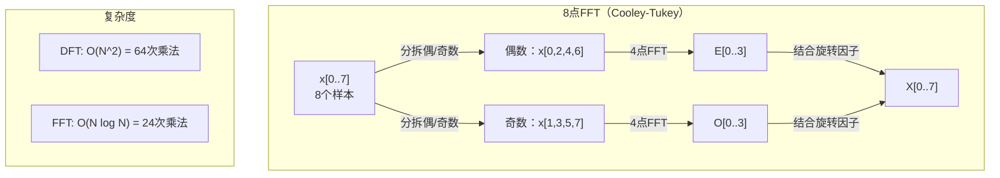
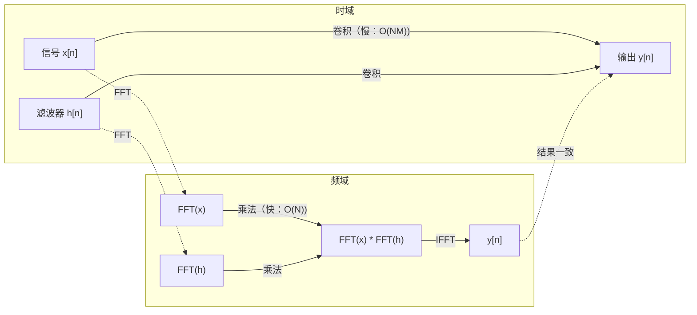

# 傅里叶变换

> 每个信号都是正弦波的叠加。傅里叶变换告诉你具体是哪些正弦波。

**类型：** 构建  
**语言：** Python  
**先决条件：** 第一阶段，第01-04、19课（复数）  
**时长：** 约90分钟

## 学习目标

- 从头实现离散傅里叶变换（DFT Discrete Fourier Transform）并与 O(N log N) 的Cooley-Tukey快速傅里叶变换（FFT Fast Fourier Transform）验证结果
- 解读频率系数：从信号中提取振幅、相位和功率谱
- 应用卷积定理通过FFT乘法执行卷积
- 连接傅里叶频率分解与Transformer位置编码和卷积神经网络（CNN Convolutional Neural Network）卷积层

## 问题背景

音频记录是随时间变化的压力测量序列。股票价格是随天数变化的数值序列。图像是空间上像素强度的网格。这些都是时域（或空域）数据，即你看到数值随某个索引变化。

但许多模式在时域中是不可见的。这个音频信号是纯音还是和弦？股票价格有周周期吗？这张图像有重复纹理吗？这些问题都关于频率内容，而时域隐藏了它。

傅里叶变换将数据从时域转换到频域。它将信号分解为不同频率的正弦波。每个正弦波有振幅（强度）和相位（起点位置）。傅里叶变换告诉你两者。

这对机器学习重要，因为频率域思维无处不在。卷积神经网络执行卷积，而卷积在频域中是乘法。Transformer位置编码使用频率分解来表示位置。语音识别和音乐生成等音频模型操作频谱图——声音的频率表示。时间序列模型寻找周期模式。理解傅里叶变换可让你掌握这些领域的通用语言。

## 概念讲解

### 离散傅里叶变换（DFT）的定义

给定N个采样点 x[0], x[1], ..., x[N-1]，离散傅里叶变换产生N个频率系数 X[0], X[1], ..., X[N-1]：

```text
X[k] = sum_{n=0}^{N-1} x[n] * e^(-2*pi*i*k*n/N)

for k = 0, 1, ..., N-1
```

每个 X[k] 是一个复数。它的模长 |X[k]| 告诉你第 k 频率的振幅。它的相位 angle(X[k]) 告诉你该频率的相位偏移。

核心洞见：`e^(-2*pi*i*k*n/N)` 是频率 k 的旋转矢量。DFT 计算信号与 N 个等间隔频率的相关性。如果信号在频率 k 有能量，相关性很大，否则接近零。

### 每个系数的含义

**X[0]：直流分量。** 是所有采样点之和——与平均值成正比。代表信号的恒定偏移（零频率）。

```text
X[0] = sum_{n=0}^{N-1} x[n] * e^0 = 所有采样点之和
```

**X[k]，1 <= k <= N/2：正频率。** X[k] 表示每N个采样点周期为k次的频率。k越大，频率越高（振荡越快）。

**X[N/2]：奈奎斯特频率。** 用N个采样点可表示的最高频率。超过此频率会产生混叠——高频错看成低频。

**X[k]，N/2 < k < N：负频率。** 对实值信号有 X[N-k] = conj(X[k])。负频率是正频率的镜像。这也是为何有用信息只在前 N/2 + 1 个系数中。

### 逆离散傅里叶变换（IDFT）

逆变换根据频率系数还原原始信号：

```text
x[n] = (1/N) * sum_{k=0}^{N-1} X[k] * e^(2*pi*i*k*n/N)

for n = 0, 1, ..., N-1
```

与正向DFT的唯一差别是指数符号为正，且有1/N归一化因子。

逆DFT可以完美还原信号，无信息丢失。它是基底变换——在不同坐标系中重新表达相同信息。

### FFT：加速DFT

上述DFT的计算量为 O(N^2)：N个输出系数中每个要对N个输入求和。若N=1百万，约需10^12次运算。

快速傅里叶变换（FFT）算法能在 O(N log N) 时间内完成相同计算。对N=1百万，约需2000万次运算而非兆级别，极大提高频率分析效率。

Cooley-Tukey算法通过分治实现FFT：

1. 将信号拆分成偶数索引和奇数索引两组。
2. 递归计算两半的DFT。
3. 用“旋转因子” e^(-2*pi*i*k/N) 合并两半结果。

```text
X[k] = E[k] + e^(-2*pi*i*k/N) * O[k]          for k = 0, ..., N/2 - 1
X[k + N/2] = E[k] - e^(-2*pi*i*k/N) * O[k]    for k = 0, ..., N/2 - 1

其中 E 是偶数索引样本的DFT
      O 是奇数索引样本的DFT
```

该对称拆分使递归每层做 O(N) 运算，共有 log2(N) 层，总计 O(N log N)。



FFT要求信号长度是2的幂。实际中信号会补零至下一个2的幂次。

### 频谱分析

**功率谱**是 |X[k]|^2 ——频率系数的模平方。它显示每个频率的能量大小。

**相位谱**是 angle(X[k]) ——每个频率的相位偏移。多数分析任务只关心功率谱，忽略相位。

```text
频率 k 的功率：  P[k] = |X[k]|^2 = X[k].real^2 + X[k].imag^2
频率 k 的相位：  phi[k] = atan2(X[k].imag, X[k].real)
```

### 频率分辨率

DFT的频率分辨率取决于采样点数N和采样率fs。

```text
第k个频率分量：  f_k = k * fs / N
频率分辨率：     delta_f = fs / N
最高频率：       f_max = fs / 2  （奈奎斯特频率）
```

分辨相近频率需更多采样点。捕获高频需更高采样率。

### 卷积定理

信号处理最重要结论之一，直接关联卷积神经网络。

**时域卷积等价于频域逐点乘法。**

```text
x * h = IFFT(FFT(x) . FFT(h))

其中 * 是卷积，. 是逐点乘法
```

意义：

- 直接卷积两个长度分别是N和M的信号耗时 O(N*M)。
- FFT卷积耗时 O(N log N)：先变换，两频域乘法，再逆变换。
- 大卷积核时FFT卷积速度优势明显。
- 这正是大感受野卷积层所用技术。

注：DFT计算的是循环卷积（信号首尾相连）。若需线性卷积（无环绕），先对两信号零填充至长度 N + M - 1。



### 窗函数

DFT假设信号是周期的——将N个采样视为无限重复信号的一周期。如果信号开始和结束值不一致，会产生边界不连续，造成频谱泄漏，出现虚假高频成分。

窗函数通过让信号两端逐渐衰减至零，减少泄漏。

常用窗函数：

| 窗口类型 | 形状            | 主瓣宽度    | 旁瓣水平    | 适用场景               |
|----------|-----------------|-------------|-------------|------------------------|
| 矩形窗   | 平坦（无窗）    | 最窄        | 最高（-13 dB） | 信号正好在N采样周期内完全周期性 |
| 汉宁窗   | 提升余弦        | 中等        | 低（-31 dB）  | 通用频谱分析           |
| 汉明窗   | 改良余弦        | 中等        | 更低（-42 dB） | 音频处理、语音分析      |
| 布莱克曼窗 | 三倍余弦       | 宽          | 极低（-58 dB） | 对旁瓣抑制要求极高时    |

```text
汉宁窗：    w[n] = 0.5 * (1 - cos(2*pi*n / (N-1)))
汉明窗：    w[n] = 0.54 - 0.46 * cos(2*pi*n / (N-1))
```

计算DFT前，将窗函数元素乘信号：`X = DFT(x * w)`。

### DFT性质

| 性质           | 时域                          | 频域                                 |
|----------------|-------------------------------|-------------------------------------|
| 线性           | a*x + b*y                    | a*X + b*Y                          |
| 时间平移       | x[n - k]                     | X[f] * e^(-2*pi*i*f*k/N)           |
| 频率平移       | x[n] * e^(2*pi*i*f0*n/N)     | X[f - f0]                         |
| 卷积           | x * h                        | X * H （逐点）                     |
| 逐点乘法       | x * h （逐点）                | X * H （循环卷积，缩放1/N）         |
| Parseval定理   | sum \|x[n]\|^2               | (1/N) * sum \|X[k]\|^2             |
| 共轭对称（实数输入） | x[n] 为实数                   | X[k] = conj(X[N-k])                |

Parseval定理说明总能量在时频域保持不变。变换过程中能量守恒。

### 与位置编码的联系

原始Transformer使用正弦和余弦位置编码：

```text
PE(pos, 2i)   = sin(pos / 10000^(2i/d_model))
PE(pos, 2i+1) = cos(pos / 10000^(2i/d_model))
```

每对维度 (2i, 2i+1) 都以不同频率振荡。频率按几何级数从高（维度0,1）到低（末尾维度）分布。为每个位置提供跨频率带的唯一模式——类似傅里叶系数唯一标识信号。

关键特性：

- **唯一性：** 不同位置编码不同。
- **值域有界：** sin和cos范围固定在 [-1, 1]。
- **相对位置：** 位置 p+k 的编码可由位置 p 的编码线性拟合，模型可学习相对位置关系。

### 与CNN的联系

卷积层通过滑动学习得到的滤波器（卷积核）对输入信号或图像进行卷积。

根据卷积定理，这等价于：

1. 对输入做FFT
2. 对卷积核做FFT
3. 在频域相乘
4. 逆FFT还原

常规卷积核较小（如3x3）时，直接时域卷积更快。但对于大卷积核或全局卷积，基于FFT的方法大幅提速。有些架构（如FNet）甚至完全以FFT替代attention，实现 O(N log N) 而非 O(N^2) 的复杂度，同时达到有竞争力的精度。

### 频谱图与短时傅里叶变换

一次 FFT（快速傅里叶变换）给出了整个信号的频率内容，但并不能告诉你这些频率在何时出现。一个啁啾信号（频率随时间增加的信号）和一个和弦（所有频率同时出现）可以具有相同的幅度谱。

短时傅里叶变换（STFT）通过在信号的重叠窗口上计算 FFT 解决了这个问题。结果是频谱图：一个二维表示，一轴为时间，一轴为频率。每一点的强度表示该时刻该频率的能量。

```text
STFT 过程：
1. 选择窗口大小（例如，1024 个样本）
2. 选择跳步大小（例如，256 个样本 —— 75% 重叠）
3. 对每个窗口位置：
   a. 提取加窗片段
   b. 应用汉宁窗/Hamming 窗
   c. 计算 FFT
   d. 将幅度谱存储为频谱图的一列
```

频谱图是音频机器学习模型的标准输入表示。语音识别模型（Whisper, DeepSpeech）使用 Mel 频谱图——将频率映射到 Mel 标度，这更符合人类的音调感知。

### 混叠（Aliasing）

如果信号包含高于采样率 fs/2（Nyquist 频率）的频率，采样率为 fs 会产生混叠副本。采样频率为 100 Hz 时，90 Hz 信号看起来和 10 Hz 信号完全一样。单从采样点是无法分辨的。

```text
示例：
  真实信号：90 Hz 正弦波
  采样率：100 Hz
  表现频率：100 - 90 = 10 Hz

  以 100 Hz 采样时，90 Hz 信号的采样点
  与 10 Hz 信号完全相同。
  任何数学方法都无法恢复原始的 90 Hz。
```

这就是为什么模数转换器（ADC）在采样前包含抗混叠滤波器，去除超过 Nyquist 的频率。在机器学习中，当降采样特征图而未进行适当的低通滤波时也会出现混叠——某些架构通过抗混叠池化层解决此问题。

### 零填充不会提高分辨率

一个常见误区是：在 FFT 之前对信号进行零填充可以提高频率分辨率。其实不会。零填充只是对已有频率分量进行插值，使频谱看上去更平滑，但无法揭示原始样本中不存在的频率细节。

真实的频率分辨率仅取决于观察时间 T = N / fs。要分辨两频率间距为 delta_f 的成分，需至少有 T = 1 / delta_f 秒的数据。零填充无论多少都无法突破这个基本极限。

## 构建过程

### 步骤 1：从头实现 DFT（离散傅里叶变换）

O(N²) 的 DFT 直接根据定义实现。

```python
import math

class Complex:
    ...

def dft(x):
    N = len(x)
    result = []
    for k in range(N):
        total = Complex(0, 0)
        for n in range(N):
            angle = -2 * math.pi * k * n / N
            w = Complex(math.cos(angle), math.sin(angle))
            xn = x[n] if isinstance(x[n], Complex) else Complex(x[n])
            total = total + xn * w
        result.append(total)
    return result
```

### 步骤 2：逆 DFT

结构相同，指数变号，结果除以 N。

```python
def idft(X):
    N = len(X)
    result = []
    for n in range(N):
        total = Complex(0, 0)
        for k in range(N):
            angle = 2 * math.pi * k * n / N
            w = Complex(math.cos(angle), math.sin(angle))
            total = total + X[k] * w
        result.append(Complex(total.real / N, total.imag / N))
    return result
```

### 步骤 3：FFT（Cooley-Tukey 算法）

递归的 FFT 需要长度为 2 的幂次。拆分偶数和奇数位置，递归计算，再用旋转因子合并。

```python
def fft(x):
    N = len(x)
    if N <= 1:
        return [x[0] if isinstance(x[0], Complex) else Complex(x[0])]
    if N % 2 != 0:
        return dft(x)

    even = fft([x[i] for i in range(0, N, 2)])
    odd = fft([x[i] for i in range(1, N, 2)])

    result = [Complex(0)] * N
    for k in range(N // 2):
        angle = -2 * math.pi * k / N
        twiddle = Complex(math.cos(angle), math.sin(angle))
        t = twiddle * odd[k]
        result[k] = even[k] + t
        result[k + N // 2] = even[k] - t
    return result
```

### 步骤 4：频谱分析辅助函数

```python
def power_spectrum(X):
    return [xk.real ** 2 + xk.imag ** 2 for xk in X]

def convolve_fft(x, h):
    N = len(x) + len(h) - 1
    padded_N = 1
    while padded_N < N:
        padded_N *= 2

    x_padded = x + [0.0] * (padded_N - len(x))
    h_padded = h + [0.0] * (padded_N - len(h))

    X = fft(x_padded)
    H = fft(h_padded)

    Y = [xk * hk for xk, hk in zip(X, H)]

    y = idft(Y)
    return [y[n].real for n in range(N)]
```

## 使用方法

实际工作中，使用 numpy 的 FFT，底层由高度优化的 C 库支持。

```python
import numpy as np

signal = np.sin(2 * np.pi * 5 * np.arange(256) / 256)
spectrum = np.fft.fft(signal)
freqs = np.fft.fftfreq(256, d=1/256)

power = np.abs(spectrum) ** 2

positive_freqs = freqs[:len(freqs)//2]
positive_power = power[:len(power)//2]
```

用于加窗和更高级频谱分析：

```python
from scipy.signal import windows, stft

window = windows.hann(256)
windowed = signal * window
spectrum = np.fft.fft(windowed)
```

用于卷积：

```python
from scipy.signal import fftconvolve

result = fftconvolve(signal, kernel, mode='full')
```

用于生成频谱图：

```python
from scipy.signal import stft

frequencies, times, Zxx = stft(signal, fs=sample_rate, nperseg=256)
spectrogram = np.abs(Zxx) ** 2
```

频谱图矩阵形状为 (n_frequencies, n_time_frames)。每列是一个时间窗口处的能量谱。这是音频机器学习模型的输入。

## 发布

运行 `code/fourier.py` 生成 `outputs/prompt-spectral-analyzer.md`。

## 练习

1. **纯音识别。** 创建一个采样率为 128 Hz、时长 1 秒的信号，包含一个未知频率（1 到 50 Hz 之间）的正弦波。用你的 DFT 识别这个频率，验证结果是否正确。再加入标准差为 0.5 的高斯噪声，重复实验。噪声如何影响频谱？

2. **FFT 与 DFT 验证。** 生成长度为 64 的随机信号。计算 DFT（O(N²)）和 FFT，并验证所有系数是否在 1e-10 误差以内相符。对长度为 256、512、1024 和 2048 的信号分别计时两函数的运行时间。绘制 DFT 时间与 FFT 时间之比。

3. **卷积定理示例证明。** 创建信号 x = [1, 2, 3, 4, 0, 0, 0, 0] 和滤波器 h = [1, 1, 1, 0, 0, 0, 0, 0]。用嵌套循环直接计算循环卷积。再通过 FFT（变换，点乘，逆变换）计算。验证两种方法结果一致。然后通过适当零填充实现线性卷积。

4. **加窗效果。** 创建包含两个接近频率的正弦波信号，分别为 10 Hz 和 12 Hz，采样率 128 Hz，时长 1 秒。分别使用无窗、汉宁窗和 Hamming 窗计算功率谱。哪种窗函数最易区分两个峰？为什么？

5. **位置编码分析。** 生成 d_model=128，max_pos=512 的正弦位置编码。计算每对位置编码（p1, p2）的点积。验证点积仅与 |p1 - p2| 有关，而与绝对位置无关。随着距离增大，点积有什么变化？

## 关键词

| 术语 | 含义 |
|------|-------|
| DFT（离散傅里叶变换） | 将 N 个时域采样转换为 N 个频域系数。每个系数是该频率复正弦波的相关性 |
| FFT（快速傅里叶变换） | 计算 DFT 的 O(N log N) 算法，Cooley-Tukey 算法递归拆分偶数/奇数索引 |
| 逆 DFT | 从频域系数重构时域信号。公式与 DFT 相同，指数符号相反并除以 N |
| 频率分量（bin） | DFT 输出中索引 k 对应频率 k*fs/N Hz，表示离散频率槽 |
| 直流分量（DC） | X[0]，零频率系数，反映信号的均值 |
| Nyquist 频率 | fs/2，采样率 fs 可表达的最高频率。超过此频率会混叠 |
| 功率谱 | \|X[k]\|^2，每个频率系数的平方幅度，显示能量分布 |
| 相位谱 | angle(X[k])，每个频率分量的相位偏移，分析中往往忽略 |
| 频谱泄漏 | 非周期信号被当作周期信号处理产生的伪频率成分，通过加窗减少 |
| 窗函数 | 加窗函数（汉宁窗、Hamming 窗、Blackman 窗），用于减少频谱泄漏 |
| 旋转因子（Twiddle factor） | FFT 蝶形计算中用的复指数 e^(-2*pi*i*k/N) |
| 卷积定理 | 时域卷积等价于频域逐点乘积，是信号处理和卷积神经网络的基础 |
| 循环卷积 | 信号在边界处循环的卷积，DFT 天然计算的就是循环卷积 |
| 线性卷积 | 无循环的标准卷积，通过零填充后做 DFT 实现 |
| Parseval 定理 | 傅里叶变换保持总能量不变。sum \|x[n]\|^2 = (1/N) sum \|X[k]\|^2 |
| 混叠 | 采样率不足导致 Nyquist 频率以上的频率，在采样后表现为低频率 |

## 深入阅读

- [Cooley & Tukey: An Algorithm for the Machine Calculation of Complex Fourier Series (1965)](https://www.ams.org/journals/mcom/1965-19-090/S0025-5718-1965-0178586-1/) —— 改变计算机科学的 FFT 原始论文
- [3Blue1Brown: But what is the Fourier Transform?](https://www.youtube.com/watch?v=spUNpyF58BY) —— 介绍傅里叶变换的最佳视觉讲解
- [Lee-Thorp et al.: FNet: Mixing Tokens with Fourier Transforms (2021)](https://arxiv.org/abs/2105.03824) —— 用 FFT 取代 Transformer 中的自注意力
- [Smith: The Scientist and Engineer's Guide to Digital Signal Processing](http://www.dspguide.com/) —— 涵盖 FFT、加窗和频谱分析的免费在线教材
- [Vaswani et al.: Attention Is All You Need (2017)](https://arxiv.org/abs/1706.03762) —— 从傅里叶频率分解推导的正弦位置编码
- [Radford et al.: Whisper (2022)](https://arxiv.org/abs/2212.04356) —— 使用 Mel 频谱图作为输入的语音识别模型
