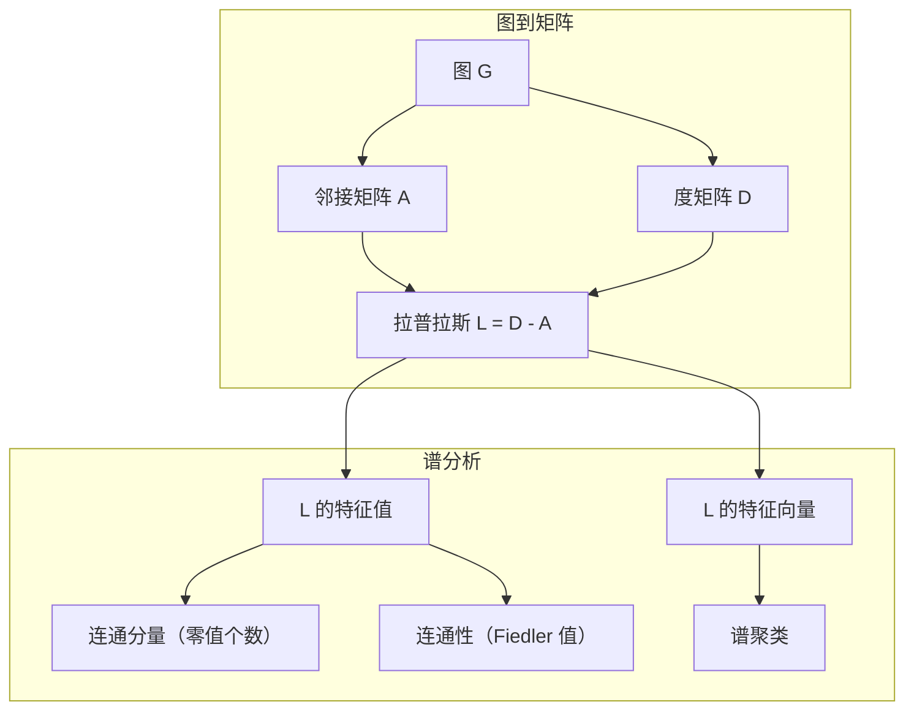
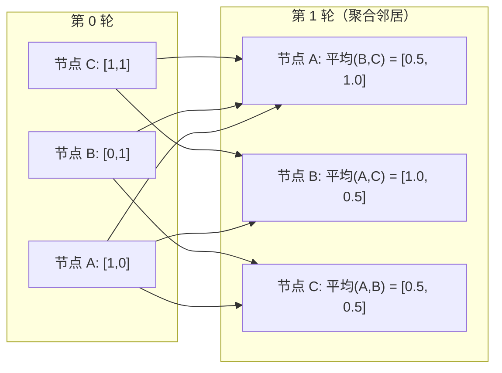

# 机器学习中的图论

> 图是表示关系的数据结构。如果你的数据有连接关系，你就需要图论。

**类型：** 构建  
**语言：** Python  
**前提条件：** 阶段 1，第 01-03 课（线性代数，矩阵）  
**时间：** 约 90 分钟

## 学习目标

- 构建一个带有邻接矩阵/邻接表表示的图类，并实现 BFS 和 DFS 遍历  
- 计算图拉普拉斯矩阵（Laplacian）并利用其特征值检测连通分量并聚类节点  
- 实现一轮 GNN（图神经网络）风格的消息传递，作为归一化邻接矩阵乘法  
- 应用谱聚类利用 Fiedler 向量对图进行划分

## 问题背景

社交网络、分子结构、知识库、引用网络、道路地图——它们都是图。传统的机器学习把数据当作平坦的表格。每一行独立，每个特征是一列。但当连接结构重要时，表格无法表达。

考虑社交网络。你想预测用户会买什么产品。他们的购买历史很重要，但他们朋友的购买历史更重要。连接关系传递信号。

再比如一个分子。你想预测它是否能与某蛋白结合。原子很重要，但真正重要的是原子之间如何键合。结构才是数据。

图神经网络（GNN）是深度学习中增长最快的领域。它们驱动药物发现、社交推荐、欺诈检测和知识图推理。每个 GNN 都建立在基础图论之上。

你需要四样东西：  
1. 用矩阵表示图（方便矩阵乘法）  
2. 遍历算法探索图结构  
3. 拉普拉斯矩阵——谱图论中最重要的矩阵  
4. 消息传递——让 GNN 生效的操作

## 概念介绍

### 图：节点和边

图 G = (V, E) 由顶点（节点）V 和边 E 组成。每条边连接两个节点。

**有向图与无向图。** 在无向图中，边 (u, v) 表示 u 连到 v，且 v 连到 u。 有向图（digraph）中，边 (u, v) 表示 u 指向 v，但不一定反向。

**加权图与无权图。** 无权图中，边要么存在，要么不存在。加权图中，每条边都有一个数值权重——距离、代价、强度等。

| 图类型 | 示例 |
|--------|------|
| 无向无权图 | Facebook 朋友圈网络 |
| 有向无权图 | Twitter 关注网络 |
| 无向加权图 | 道路地图（距离） |
| 有向加权图 | 网页链接（PageRank 分数） |

### 邻接矩阵

邻接矩阵 A 是核心表示。对于 n 个节点的图：

```text
A[i][j] = 1    如果节点 i 指向节点 j
A[i][j] = 0    否则
```

对于无向图，A 是对称的：A[i][j] = A[j][i]。加权图中，A[i][j] 是边 (i, j) 的权重。

**示例——一个三角形：**

```text
节点：0, 1, 2
边：(0,1), (1,2), (0,2)

A = [[0, 1, 1],
     [1, 0, 1],
     [1, 1, 0]]
```

邻接矩阵是每个 GNN 的输入。矩阵对 A 的操作相当于对图的操作。

### 度

节点的度是连接到它的边数。对于有向图，有入度（指向它的边）和出度（它指向的边）。

度矩阵 D 是对角矩阵：

```text
D[i][i] = 节点 i 的度数
D[i][j] = 0    当 i != j
```

对于上述三角形例子：D = diag(2, 2, 2)，因为每个节点连接两个节点。

度反映节点的重要性。度高表示枢纽节点。网络的度分布揭示其结构。社交网络遵循幂律分布（少数枢纽，多数边缘节点）。随机图的度数服从泊松分布。

### 广度优先搜索（BFS）和深度优先搜索（DFS）

两个基本的图遍历算法，你都需要。

**广度优先搜索（BFS）：** 先探索所有邻居，再探索邻居的邻居。使用队列（先进先出）。

```text
从节点 0 开始 BFS：
  访问 0
  队列: [1, 2]        (节点 0 的邻居)
  访问 1
  队列: [2, 3]        (加入节点 1 的邻居)
  访问 2
  队列: [3]           (节点 2 邻居已访问)
  访问 3
  队列: []            (结束)
```

BFS 可以找到无权图中的最短路径。起点到任一节点的距离就是 BFS 发现该节点的层级。这也是 BFS 用于社交网络跳数距离的原因。

**深度优先搜索（DFS）：** 尽可能深入访问再回溯。使用栈（后进先出）或递归。

```text
从节点 0 开始 DFS：
  访问 0
  栈: [1, 2]        (节点 0 的邻居)
  访问 2            (弹出栈顶)
  栈: [1, 3]        (加入节点 2 的邻居)
  访问 3            (弹出栈顶)
  栈: [1]
  访问 1            (弹出栈顶)
  栈: []            (结束)
```

DFS 用于：  
- 找连通分量（从未访问节点运行 DFS）  
- 检测环（DFS 树中的回边）  
- 拓扑排序（DFS 结束顺序的逆序）

| 算法 | 数据结构 | 找到 | 用例 |
|------|----------|------|------|
| BFS | 队列 | 最短路径 | 社交网络距离，知识图遍历 |
| DFS | 栈 | 连通分量，环 | 连接性，拓扑排序 |

### 图拉普拉斯矩阵

L = D - A。谱图论中最重要的矩阵。

对于三角形：

```text
D = [[2, 0, 0],    A = [[0, 1, 1],    L = [[ 2, -1, -1],
     [0, 2, 0],         [1, 0, 1],         [-1,  2, -1],
     [0, 0, 2]]         [1, 1, 0]]         [-1, -1,  2]]
```

拉普拉斯矩阵有显著性质：

1. **L 是半正定的。** 所有特征值>=0。

2. **零特征值的数量等于连通分量的数量。** 一个连通图有且只有一个零特征值。三个不连通分量就有三个零特征值。

3. **最小非零特征值（Fiedler 值）度量连接性。** 大的 Fiedler 值说明图连通性强，小的说明存在瓶颈。

4. **Fiedler 值对应的特征向量（Fiedler 向量）揭示最佳分割。** 正值节点一组，负值节点一组，这就是谱聚类。



### 谱性质

邻接矩阵和拉普拉斯矩阵的特征值揭示图的结构性质，无需遍历。

**谱聚类流程：**  
1. 计算拉普拉斯矩阵 L  
2. 找 L 的 k 个最小特征向量（跳过第一个对连通图全1向量）  
3. 把这些特征向量作为每个节点的新坐标  
4. 对这些坐标运行 k-means 聚类

为什么可行？L 的特征向量编码了图上“最平滑”的函数。连通紧密的节点在特征向量上值相近，被瓶颈隔开的节点有不同值。特征向量自然地划分出簇。

**随机游走关联。** 归一化拉普拉斯矩阵相关于图上的随机游走。随机游走的稳态分布与节点度成正比。混合时间（收敛速度）取决于谱隙。

### 消息传递

图神经网络的核心操作。每个节点收集邻居的消息，聚合后更新自身状态。

```text
h_v^(k+1) = UPDATE(h_v^(k), AGGREGATE({h_u^(k) : u 是邻居(v)}))
```

最简单形式，AGGREGATE 是均值，UPDATE 是线性变换加激活函数：

```text
h_v^(k+1) = sigma(W * mean({h_u^(k) : u 是邻居(v)}))
```

这其实是矩阵乘法的变形。如果 H 是所有节点特征矩阵，A 是邻接矩阵：

```text
H^(k+1) = sigma(A_norm * H^(k) * W)
```

其中 A_norm 是归一化的邻接矩阵（每行和为 1）。

一轮消息传递让每个节点“看到”它的直接邻居。两轮让它看到邻居的邻居。K 轮则覆盖 K 跳邻域。



### 概念与机器学习应用

| 概念 | 机器学习应用 |
|-------|--------------|
| 邻接矩阵 | GNN 输入表示 |
| 图拉普拉斯 | 谱聚类、社区检测 |
| BFS/DFS | 知识图遍历、路径搜索 |
| 度分布 | 节点重要性、特征工程 |
| 消息传递 | GNN 层（GCN, GAT, GraphSAGE） |
| L 的特征值 | 社区检测、图划分 |
| 谱聚类 | 无监督节点分组 |
| PageRank | 节点重要性、网页搜索 |

## 构建实践

### 第一步：从头实现图类

```python
class Graph:
    def __init__(self, n_nodes, directed=False):
        self.n = n_nodes
        self.directed = directed
        self.adj = {i: {} for i in range(n_nodes)}

    def add_edge(self, u, v, weight=1.0):
        self.adj[u][v] = weight
        if not self.directed:
            self.adj[v][u] = weight

    def neighbors(self, node):
        return list(self.adj[node].keys())

    def degree(self, node):
        return len(self.adj[node])

    def adjacency_matrix(self):
        import numpy as np
        A = np.zeros((self.n, self.n))
        for u in range(self.n):
            for v, w in self.adj[u].items():
                A[u][v] = w
        return A

    def degree_matrix(self):
        import numpy as np
        D = np.zeros((self.n, self.n))
        for i in range(self.n):
            D[i][i] = self.degree(i)
        return D

    def laplacian(self):
        return self.degree_matrix() - self.adjacency_matrix()
```

邻接表（`self.adj`）高效存储邻居关系。邻接矩阵转换使用 numpy，因为所有谱操作都依赖它。

### 第二步：BFS 和 DFS

```python
from collections import deque

def bfs(graph, start):
    visited = set()
    order = []
    distances = {}
    queue = deque([(start, 0)])
    visited.add(start)
    while queue:
        node, dist = queue.popleft()
        order.append(node)
        distances[node] = dist
        for neighbor in graph.neighbors(node):
            if neighbor not in visited:
                visited.add(neighbor)
                queue.append((neighbor, dist + 1))
    return order, distances


def dfs(graph, start):
    visited = set()
    order = []
    stack = [start]
    while stack:
        node = stack.pop()
        if node in visited:
            continue
        visited.add(node)
        order.append(node)
        for neighbor in reversed(graph.neighbors(node)):
            if neighbor not in visited:
                stack.append(neighbor)
    return order
```

BFS 使用双端队列（deque）实现 O(1) 的 popleft 操作。DFS 使用列表作为栈。两者都只访问每个节点一次 —— O(V + E) 时间复杂度。

### 第 3 步：连通分量与拉普拉斯矩阵特征值

```python
def connected_components(graph):
    visited = set()
    components = []
    for node in range(graph.n):
        if node not in visited:
            order, _ = bfs(graph, node)
            visited.update(order)
            components.append(order)
    return components


def laplacian_eigenvalues(graph):
    import numpy as np
    L = graph.laplacian()
    eigenvalues = np.linalg.eigvalsh(L)
    return eigenvalues
```

`eigvalsh` 用于对称矩阵 —— 拉普拉斯矩阵对于无向图总是对称的。它返回按升序排列的特征值。统计其中的零的个数即可确定连通分量数量。

### 第 4 步：谱聚类（Spectral clustering）

```python
def spectral_clustering(graph, k=2):
    import numpy as np
    L = graph.laplacian()
    eigenvalues, eigenvectors = np.linalg.eigh(L)
    features = eigenvectors[:, 1:k+1]

    labels = np.zeros(graph.n, dtype=int)
    for i in range(graph.n):
        if features[i, 0] >= 0:
            labels[i] = 0
        else:
            labels[i] = 1
    return labels
```

当 k=2 时，Fiedler 向量符号将图划分为两个簇。对于 k>2，则对前 k 个特征向量（不包括全一向量）执行 k-means 聚类。

### 第 5 步：消息传递（Message passing）

```python
def message_passing(graph, features, weight_matrix):
    import numpy as np
    A = graph.adjacency_matrix()
    row_sums = A.sum(axis=1, keepdims=True)
    row_sums[row_sums == 0] = 1
    A_norm = A / row_sums
    aggregated = A_norm @ features
    output = aggregated @ weight_matrix
    return output
```

这是 GNN 消息传递的一轮。每个节点的新特征是邻居特征的加权平均，再经过权重矩阵映射。多轮堆叠可实现更远的信息传播。

## 使用示例

利用 networkx 和 numpy，相同操作可一行完成：

```python
import networkx as nx
import numpy as np

G = nx.karate_club_graph()

A = nx.adjacency_matrix(G).toarray()
L = nx.laplacian_matrix(G).toarray()

eigenvalues = np.linalg.eigvalsh(L.astype(float))
print(f"Smallest eigenvalues: {eigenvalues[:5]}")
print(f"Connected components: {nx.number_connected_components(G)}")

communities = nx.community.greedy_modularity_communities(G)
print(f"Communities found: {len(communities)}")

pr = nx.pagerank(G)
top_nodes = sorted(pr.items(), key=lambda x: x[1], reverse=True)[:5]
print(f"Top 5 PageRank nodes: {top_nodes}")
```

networkx 利用优化的 C 后端支持任意规模图，适合生产环境。自己实现有助于理解其原理。

### numpy 谱分析示例

```python
import numpy as np

A = np.array([
    [0, 1, 1, 0, 0],
    [1, 0, 1, 0, 0],
    [1, 1, 0, 1, 0],
    [0, 0, 1, 0, 1],
    [0, 0, 0, 1, 0]
])

D = np.diag(A.sum(axis=1))
L = D - A

eigenvalues, eigenvectors = np.linalg.eigh(L)
print(f"Eigenvalues: {np.round(eigenvalues, 4)}")
print(f"Fiedler value: {eigenvalues[1]:.4f}")
print(f"Fiedler vector: {np.round(eigenvectors[:, 1], 4)}")

fiedler = eigenvectors[:, 1]
group_a = np.where(fiedler >= 0)[0]
group_b = np.where(fiedler < 0)[0]
print(f"Cluster A: {group_a}")
print(f"Cluster B: {group_b}")
```

Fiedler 向量承担主要工作。其正值对应一个簇，负值对应另一个簇。不需迭代优化，只需一次特征分解。

## 交付内容

本课时产生：
- `outputs/skill-graph-analysis.md` —— 分析图结构数据的技能参考

## 关联概念

| 概念         | 出现场景                         |
|--------------|--------------------------------|
| 邻接矩阵     | GCN、GAT、GraphSAGE 的输入      |
| 拉普拉斯矩阵 | 谱聚类、ChebNet 滤波器           |
| BFS          | 知识图遍历、最短路径查询         |
| 消息传递     | 所有 GNN 层，神经消息传递核心    |
| 谱隙         | 图连通性、随机游走混合时间       |
| 度分布       | 幂律网络，节点特征工程           |
| 连通分量     | 预处理，处理非连通图             |
| PageRank     | 节点重要性排序，注意力初始化     |

GNN 特别值得提及。GCN（Kipf & Welling, 2017）中的图卷积操作，利用的是加了自环的邻接矩阵 \( \hat{A} = A + I \)：

```text
H^(l+1) = sigma(D_hat^(-1/2) * A_hat * D_hat^(-1/2) * H^(l) * W^(l))
```

其中 \( \hat{A} = A + I \)（邻接矩阵加自环），\( \hat{D} \) 是 \( \hat{A} \) 的度矩阵。自环保证每个节点在聚合时包含自身特征。这正是带对称归一化的消息传递。归一化邻接矩阵是 \( \hat{D}^{-1/2} \hat{A} \hat{D}^{-1/2} \)。拉普拉斯矩阵出现是因为此归一化对应于 \( L_{sym} = I - D^{-1/2} A D^{-1/2} \)。理解拉普拉斯矩阵就是理解 GCN 为什么有效。

## 练习

1. **从零实现 PageRank。** 初始化均匀分数。每步更新：score(v) = (1-d)/n + d * sum(score(u)/out_degree(u))，对所有 u 指向 v。取 d=0.85。运行至收敛（变化 < 1e-6）。测试小型网页图。

2. **用谱聚类找社区。** 构建两个明显分开的簇（如通过单条边连接的两个团）。运行谱聚类，验证是否正确划分。增加簇间边会有什么变化？

3. **实现 Dijkstra 算法** 计算加权图中的最短路径。与统一权重情况下 BFS 结果对比。

4. **构建两层消息传递网络。** 使用不同权重矩阵运行两次消息传递。验证每个节点获得其 2 跳邻居信息。

5. **分析真实世界图。** 使用 Karate Club 图（34 个节点，78 条边）。计算度分布、拉普特拉斯特征值和谱聚类。将结果与已知的社区划分作比较。

## 关键词

| 术语         | 通俗说法        | 实际含义                            |
|--------------|-----------------|-----------------------------------|
| 图 Graph     | “节点和边”      | 数学结构 \( G=(V,E) \)，编码两两关系 |
| 邻接矩阵     | “连接表”        | n×n 矩阵，若节点 i 与 j 相连则 \( A[i][j] = 1 \) |
| 度 Degree    | “节点连通度”    | 与节点相连的边数                   |
| 拉普拉斯矩阵 | “D 减 A”        | \( L = D - A \)，特征值揭示图结构   |
| Fiedler 值   | “代数连通性”    | L 的最小非零特征值，衡量图的连通性   |
| BFS          | “分层遍历”      | 先访问所有邻居再深入，寻找最短路径   |
| DFS          | “深度优先”      | 先沿一条路径走到底再回溯           |
| 消息传递     | “节点间信息交流”| 节点从邻居收集信息，是 GNN 的核心    |
| 谱聚类       | “用特征向量聚类”| 用拉普拉斯矩阵的特征向量划分图       |
| 连通分量     | “独立子图”      | 最大连通子图，每个节点都可以互达     |

## 深入阅读

- **Kipf & Welling (2017)** —— “Semi-Supervised Classification with Graph Convolutional Networks.” 启动现代 GNN 研究的里程碑论文。展示谱图卷积简化为消息传递。
- **Spielman (2012)** —— “Spectral Graph Theory” 讲义。拉普拉斯矩阵、谱隙与图划分的权威介绍。
- **Hamilton (2020)** —— “Graph Representation Learning.” 从基础到应用全面覆盖 GNN 。
- **Bronstein et al. (2021)** —— “Geometric Deep Learning: Grids, Groups, Graphs, Geodesics, and Gauges.” 统一框架论文。
- **Veličković et al. (2018)** —— “Graph Attention Networks.” 用注意力机制扩展消息传递。
