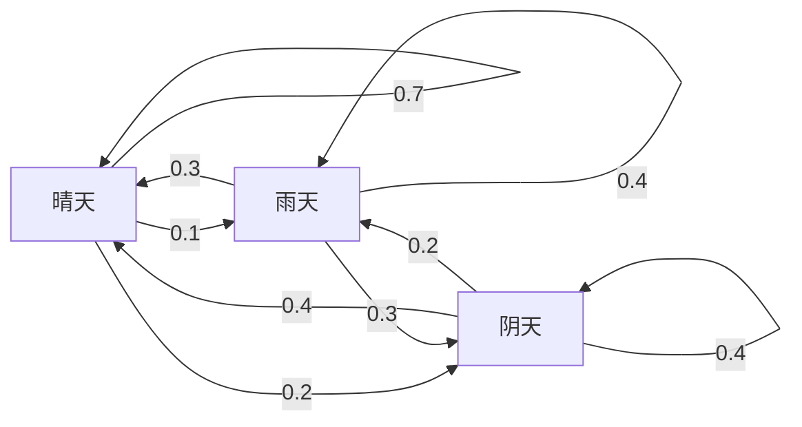
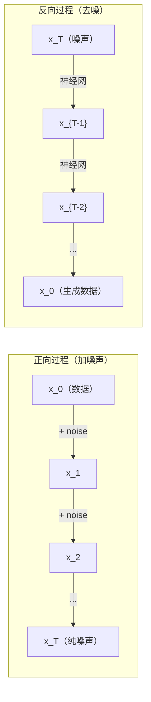

# 随机过程

> 有结构的随机性。随机游走（random walks）、马尔可夫链（Markov chains）和扩散模型（diffusion models）背后的数学。

**类型：** 学习  
**语言：** Python  
**先决条件：** 第一阶段，第06-07课（概率、贝叶斯）  
**时间：** 约75分钟

## 学习目标

- 模拟一维和二维随机游走，验证位移的 sqrt(n) 量级增长  
- 构建马尔可夫链模拟器，并通过特征分解计算其稳态分布  
- 实现 Metropolis-Hastings MCMC 和 Langevin 动力学以从目标分布中采样  
- 将正向扩散过程与布朗运动（Brownian motion）联系起来，解释反向过程如何生成数据  

## 问题描述

许多 AI 系统涉及随时间演化的随机性。不是静态的随机性 —— 而是有结构的序列随机性，其中每一步依赖于之前的状态。

语言模型逐个生成标记。每个标记依赖于之前的上下文。模型输出一个概率分布，从中采样，然后继续下一个标记。这就是一个随机过程。

扩散模型逐步向图像添加噪声，直到变为纯静态噪声。然后反向过程逐步去噪，直到生成一幅新图像。正向过程是马尔可夫链，反向过程是一个学习到的逆向马尔可夫链。

强化学习代理在环境中执行动作。每个动作以一定概率导致新状态。代理遵循随机策略，在随机世界中运行。整个过程是一个马尔可夫决策过程（Markov decision process）。

MCMC 采样 —— 贝叶斯推断的支柱 —— 构建一个马尔可夫链，其稳态分布是你想要采样的后验分布。

所有这些都基于四个基础思想：  
1. 随机游走 —— 最简单的随机过程  
2. 马尔可夫链 —— 有转移矩阵的结构化随机性  
3. Langevin 动力学 —— 带噪声的梯度下降  
4. Metropolis-Hastings —— 从任意分布采样  

## 概念解析

### 随机游走（Random Walks）

从位置 0 开始。每一步抛一次公平硬币。正面：向右走 +1。反面：向左走 -1。

经过 n 步，位置是 n 个 +/-1 的随机和。期望位置为 0（游走无偏），但距离原点的期望距离随 sqrt(n) 增长。

这很反直觉。游走是公平的 —— 没有任何方向的漂移。但随着时间推移，它会越走越远。n 步后的标准差是 sqrt(n)。

```text
第0步： 位置 = 0
第1步： 位置 = +1 或 -1
第2步： 位置 = +2、0 或 -2
...
第100步：距离原点的期望约为 10（sqrt(100)）
第10000步：距离原点的期望约为 100（sqrt(10000)）
```

**二维情况**，随机游走会上、下、左、右移动，概率相等。距离原点的距离仍满足 sqrt(n) 量级增长。路径呈现分形般的图案。

**为什么是 sqrt(n)？** 每步是 +1 或 -1，概率均等。位置 S_n = X_1 + X_2 + ... + X_n，其中每个 X_i 为 +/-1。每步的方差为1，且各步独立，因此 Var(S_n) = n，标准差为 sqrt(n)。由中心极限定理，S_n / sqrt(n) 收敛到标准正态分布。

这种 sqrt(n) 规模关系在机器学习中随处可见。随机梯度下降（SGD）的噪声随 1/sqrt(批量大小) 缩放，嵌入维度规模随 sqrt(d) 变化。平方根是独立随机累加的标志。

**与布朗运动的联系。** 取步长为 1/sqrt(n)，每单位时间 n 步的随机游走。随着 n 趋于无穷大，该游走收敛于布朗运动 B(t) —— 一个连续时间过程，满足 B(t) 服从均值为0，方差为 t 的正态分布。

布朗运动是扩散的数学基础。它模拟流体中粒子的随机抖动、股票价格波动及 —— 关键的 —— 扩散模型中的噪声过程。

**赌徒破产（Gambler's ruin）。** 从位置 k 出发的随机游走者，设有吸收边界 0 和 N。达到 N 的概率是多少？公平游走的结果是：P（达到 N）= k/N。这个结果既简单又优雅。它连接了鞅理论 —— 公平随机游走是鞅（期望未来值等于当前值）。

### 马尔可夫链（Markov Chains）

马尔可夫链是一个根据固定概率在状态间转移的系统。关键特性：下一状态只依赖当前状态，和历史无关。

```text
P(X_{t+1} = j | X_t = i, X_{t-1} = ...) = P(X_{t+1} = j | X_t = i)
```

这就是马尔可夫性质。可以用转移矩阵 P 完整描述动态：

```text
P[i][j] = 从状态 i 转移到状态 j 的概率
```

每一行元素和为 1（必须转移到某个状态）。

**示例 —— 天气：**

```text
状态：晴天 (0), 雨天 (1), 阴天 (2)

P = [[0.7, 0.1, 0.2],    （晴天时：70% 晴天，10% 雨天，20% 阴天）
     [0.3, 0.4, 0.3],    （雨天时：30% 晴天，40% 雨天，30% 阴天）
     [0.4, 0.2, 0.4]]    （阴天时：40% 晴天，20% 雨天，40% 阴天）
```

从任意状态开始，经过多次转移，状态分布收敛到稳态分布 pi，其中 pi * P = pi。pi 是特征值为1的左特征向量。

在天气链中，稳态分布可能是 [0.53, 0.18, 0.29] —— 长期看来晴天约占53%，无论初始状态。



**计算稳态分布。** 有两种方法：

1. **幂法（Power method）**：任一初始分布反复乘以 P，迭代足够多次后收敛。  
2. **特征值法**：求转移矩阵 P 的左特征向量对应特征值 1。等价于求 Pᵀ 的特征值为1的特征向量。

两者都要求链满足收敛条件。

**收敛条件。** 马尔可夫链收敛到唯一稳态分布需满足：  
- **不可约性（Irreducible）**：任何状态都能从其他任一状态到达  
- **非周期性（Aperiodic）**：链不以固定周期循环

机器学习中遇到的大多数链都满足这两个条件。

**吸收状态（Absorbing states）。** 一旦进入就永远不离开的状态（P[i][i] = 1）。吸收链用于建模具有终止状态的过程 —— 游戏结束、客户流失、标记序列到达文本结尾标记。

**混合时间（Mixing time）。** 链达到“接近”稳态分布需要多少步？形式上，是指总变差距离（total variation distance）下降到某阈值以下所需的步骤数。混合快 = 需要较少步数。Pi 的谱隙（最大的特征值1减去第二大特征值）控制混合时间，谱隙越大混合越快。

### 与语言模型的联系

语言模型中的标记生成过程近似马尔可夫过程。给定当前上下文，模型输出下一个标记的分布。温度（temperature）控制分布的锐度：

```text
P(token_i) = exp(logit_i / temperature) / sum(exp(logit_j / temperature))
```

- Temperature = 1.0：标准分布  
- Temperature < 1.0：更尖锐（更确定）  
- Temperature > 1.0：更平坦（更随机）  
- Temperature -> 0：取最大值（贪婪）

Top-k采样截断概率最高的 k 个标记。Top-p（核采样）截断累计概率超过 p 的最小标记集合。两者都会修改马尔可夫链的转移概率。

### 布朗运动（Brownian Motion）

随机游走的连续时间极限。位置 B(t) 满足三个性质：  
1. B(0) = 0  
2. B(t) - B(s) 服从均值为0，方差为 t-s 的正态分布（当 t > s）  
3. 不重叠时间区间的增量独立  

布朗运动连续但不可微 —— 在每个尺度都有抖动。其路径在平面上的分形维数为2。

在离散模拟中，可以如下近似布朗运动：

```text
B(t + dt) = B(t) + sqrt(dt) * z,    其中 z ~ N(0, 1)
```

sqrt(dt) 的尺度关系至关重要，来源于随机游走的中心极限定理。

### Langevin 动力学

梯度下降用于寻找函数的最小值。Langevin 动力学用于找到比例于 exp(-U(x)/T) 的概率分布，其中 U 是能量函数，T 是温度。

```text
x_{t+1} = x_t - dt * gradient(U(x_t)) + sqrt(2 * T * dt) * z_t
```

粒子受到两种力作用：  
1. **梯度力** (-dt * gradient(U))：推动到低能量区域（类似梯度下降）  
2. **随机力** (sqrt(2*T*dt) * z)：随机推动（探索）  

温度 T=0 时就是纯梯度下降；高温度时接近随机游走。恰当的温度下，粒子在能量景观中探索，并更多停留在低能区域。

**与扩散模型的联系。** 扩散模型的正向过程为：

```text
x_t = sqrt(alpha_t) * x_{t-1} + sqrt(1 - alpha_t) * noise
```

这是逐渐将数据与噪声混合的马尔可夫链。足够多步后，x_T 是纯高斯噪声。

反向过程 —— 从噪声恢复到数据 —— 也是一个马尔可夫链，但其转移概率由神经网络学习。网络学习预测每步加入的噪声，并将其减去。



### 马尔可夫链蒙特卡洛（MCMC）

有时你需要从一个分布 p(x) 采样，你能计算该分布（到常数倍），但无法直接采样。贝叶斯后验是经典例子 —— 你知道似然乘以先验，但归一化常数不可解。

**Metropolis-Hastings** 构造马尔可夫链，其稳态分布为 p(x)：

1. 从某个位置 x 开始  
2. 从提议分布 Q(x'|x) 中提出新位置 x'  
3. 计算接受比率：a = p(x') * Q(x|x') / (p(x) * Q(x'|x))  
4. 以概率 min(1, a) 接受 x'，否则保持在 x  
5. 重复  

若 Q 是对称的（例如 Q(x'|x) = Q(x|x') = N(x, sigma²)），比率简化为 a = p(x') / p(x)。只需计算概率比率，归一化常数相互抵消。

链在温和条件下保证收敛到 p(x)。但如果提议太小（随机游走），或太大（高拒绝率），收敛可能缓慢。调节提议分布是 MCMC 的艺术。

**为何有效。** 接受比率确保详尽平衡（detailed balance）：处于 x 并转移到 x' 的概率等于处于 x' 并转移回 x 的概率。详尽平衡意味着 p(x) 是链的稳态分布。经过足够步骤，采样即来自 p(x)。

**实际注意事项：**
- **预热（Burn-in）**：丢弃前 N 个样本。链条需要时间从起点达到平稳分布。
- **稀疏采样（Thinning）**：保留每第 k 个样本，以减少自相关。
- **多条链条（Multiple chains）**：从不同起点运行多条链。如果它们收敛到相同分布，则有收敛的证据。
- **接受率（Acceptance rate）**：对于 d 维高斯提案，最佳接受率约为 23%（Roberts & Rosenthal，2001）。过高意味着链条几乎不动，过低意味着拒绝了所有样本。

### AI 中的随机过程（Stochastic Processes）

| 过程（Process） | AI 应用（AI Application） |
|-----------------|-------------------------|
| 随机游走（Random walk） | 强化学习中的探索，Node2Vec 嵌入 |
| 马尔可夫链（Markov chain） | 文本生成，MCMC 采样 |
| 布朗运动（Brownian motion） | 扩散模型（正向过程） |
| 朗之万动力学（Langevin dynamics） | 基于评分的生成模型，SGLD |
| 马尔可夫决策过程（Markov decision process） | 强化学习 |
| Metropolis-Hastings | 贝叶斯推断，后验采样 |

## 构建实现

### 第一步：一维随机游走模拟器

```python
import numpy as np

def random_walk_1d(n_steps, seed=None):
    rng = np.random.RandomState(seed)
    steps = rng.choice([-1, 1], size=n_steps)
    positions = np.concatenate([[0], np.cumsum(steps)])
    return positions


def random_walk_2d(n_steps, seed=None):
    rng = np.random.RandomState(seed)
    directions = rng.choice(4, size=n_steps)
    dx = np.zeros(n_steps)
    dy = np.zeros(n_steps)
    dx[directions == 0] = 1   # 右
    dx[directions == 1] = -1  # 左
    dy[directions == 2] = 1   # 上
    dy[directions == 3] = -1  # 下
    x = np.concatenate([[0], np.cumsum(dx)])
    y = np.concatenate([[0], np.cumsum(dy)])
    return x, y
```

一维游走存储累积和。每步为 +1 或 -1。经过 n 步后，位置即为步数之和。方差随 n 线性增长，标准差随 sqrt(n) 增长。

### 第二步：马尔可夫链

```python
class MarkovChain:
    def __init__(self, transition_matrix, state_names=None):
        self.P = np.array(transition_matrix, dtype=float)
        self.n_states = len(self.P)
        self.state_names = state_names or [str(i) for i in range(self.n_states)]

    def step(self, current_state, rng=None):
        if rng is None:
            rng = np.random.RandomState()
        probs = self.P[current_state]
        return rng.choice(self.n_states, p=probs)

    def simulate(self, start_state, n_steps, seed=None):
        rng = np.random.RandomState(seed)
        states = [start_state]
        current = start_state
        for _ in range(n_steps):
            current = self.step(current, rng)
            states.append(current)
        return states

    def stationary_distribution(self):
        eigenvalues, eigenvectors = np.linalg.eig(self.P.T)
        idx = np.argmin(np.abs(eigenvalues - 1.0))
        stationary = np.real(eigenvectors[:, idx])
        stationary = stationary / stationary.sum()
        return np.abs(stationary)
```

平稳分布是转移矩阵 P 的左特征向量，对应特征值 1。通过计算 P^T 的特征向量找到它（转置使左特征向量转成右特征向量）。

### 第三步：朗之万动力学

```python
def langevin_dynamics(grad_U, x0, dt, temperature, n_steps, seed=None):
    rng = np.random.RandomState(seed)
    x = np.array(x0, dtype=float)
    trajectory = [x.copy()]
    for _ in range(n_steps):
        noise = rng.randn(*x.shape)
        x = x - dt * grad_U(x) + np.sqrt(2 * temperature * dt) * noise
        trajectory.append(x.copy())
    return np.array(trajectory)
```

梯度推动 x 向低能量区域运动，噪声防止陷入局部。平衡时，样本分布与 exp(-U(x)/temperature) 成正比。

### 第四步：Metropolis-Hastings 算法

```python
def metropolis_hastings(target_log_prob, proposal_std, x0, n_samples, seed=None):
    rng = np.random.RandomState(seed)
    x = np.array(x0, dtype=float)
    samples = [x.copy()]
    accepted = 0
    for _ in range(n_samples - 1):
        x_proposed = x + rng.randn(*x.shape) * proposal_std
        log_ratio = target_log_prob(x_proposed) - target_log_prob(x)
        if np.log(rng.rand()) < log_ratio:
            x = x_proposed
            accepted += 1
        samples.append(x.copy())
    acceptance_rate = accepted / (n_samples - 1)
    return np.array(samples), acceptance_rate
```

此算法提出一个新点，检查其概率是否更高（或以概率比例接受），然后重复。接受率应在23%-50%左右以保证良好混合。

## 使用指南

实际中，你会用成熟库实现这些算法。但理解其机制对调试和调优至关重要。

```python
import numpy as np

rng = np.random.RandomState(42)
walk = np.cumsum(rng.choice([-1, 1], size=10000))
print(f"最终位置: {walk[-1]}")
print(f"期望距离: {np.sqrt(10000):.1f}")
print(f"实际距离: {abs(walk[-1])}")
```

### 使用 numpy 处理转移矩阵

```python
import numpy as np

P = np.array([[0.7, 0.1, 0.2],
              [0.3, 0.4, 0.3],
              [0.4, 0.2, 0.4]])

distribution = np.array([1.0, 0.0, 0.0])
for _ in range(100):
    distribution = distribution @ P

print(f"平稳分布: {np.round(distribution, 4)}")
```

不断用 P 乘以初始分布。足够多轮后，不论起点如何，都收敛到平稳分布。这是求解主左特征向量的幂法。

### 与真实框架的联系

- **PyTorch 扩散模型：** Hugging Face `diffusers` 中的 `DDPMScheduler` 实现了前向和逆向的马尔可夫链。
- **NumPyro / PyMC：** 使用 MCMC（如 NUTS 采样器，比 Metropolis-Hastings 更优）进行贝叶斯推断。
- **Gymnasium (强化学习)：** 环境 step 函数定义了马尔可夫决策过程。

### 验证马尔可夫链收敛性

```python
import numpy as np

P = np.array([[0.9, 0.1], [0.3, 0.7]])

eigenvalues = np.linalg.eigvals(P)
spectral_gap = 1 - sorted(np.abs(eigenvalues))[-2]
print(f"特征值: {eigenvalues}")
print(f"谱隙: {spectral_gap:.4f}")
print(f"近似混合时间: {1/spectral_gap:.1f} 步")
```

谱隙表明链条遗忘初始状态的速度。谱隙为 0.2 意味着大约 5 步混合；为 0.01 意味大约 100 步。长时间模拟前需检查，否则低效浪费计算资源。

## 交付成果

本课产物：
- `outputs/prompt-stochastic-process-advisor.md` — 一个提示，帮助识别给定问题适用的随机过程框架。

## 关联概念

| 概念（Concept）          | 出现场景（Where it shows up）                        |
|-------------------------|-------------------------------------------------|
| 随机游走（Random walk）   | Node2Vec 图嵌入，强化学习中的探索                       |
| 马尔可夫链（Markov chain） | 大型语言模型的token生成，MCMC采样                       |
| 布朗运动（Brownian motion）| DDPM中的前向扩散过程，基于随机微分方程（SDE）的模型        |
| 朗之万动力学（Langevin dynamics） | 基于评分的生成模型，随机梯度朗之万动力学（SGLD）             |
| 平稳分布（Stationary distribution）| MCMC 收敛目标，PageRank                         |
| Metropolis-Hastings      | 贝叶斯后验采样，模拟退火                                   |
| 温度（Temperature）       | LLM 采样，强化学习中的玻尔兹曼探索，模拟退火                     |
| 混合时间（Mixing time）    | MCMC 收敛速度，谱隙分析                                   |
| 吸收态（Absorbing state） | 序列结束标记，强化学习的终止状态                             |
| 详细平衡（Detailed balance） | 保证 MCMC 采样器正确性                                   |

扩散模型值得特别关注。DDPM（Ho et al., 2020）定义了前向马尔可夫链：

```text
q(x_t | x_{t-1}) = N(x_t; sqrt(1-beta_t) * x_{t-1}, beta_t * I)
```

其中 beta_t 是噪声调度。经过 T 步后，x_T 近似服从 N(0, I)。逆过程由神经网络参数化，预测噪声：

```text
p_theta(x_{t-1} | x_t) = N(x_{t-1}; mu_theta(x_t, t), sigma_t^2 * I)
```

生成的每一步是学习到的马尔可夫链的一步。理解马尔可夫链即理解扩散模型如何及为何生成数据。

SGLD（随机梯度朗之万动力学）结合了小批量梯度下降和朗之万噪声。不用计算完整梯度，用随机估计并添加校准噪声。随着学习率衰减，SGLD 从优化趋近转换为采样——无额外成本得到贝叶斯后验样本。这是从神经网络获得不确定性估计的最简单方式之一。

这些联系的关键见解是：随机过程不仅是理论工具，而是现代 AI 系统内部的计算机制。调节 LLM 的温度即调节马尔可夫链。训练扩散模型即学习逆转类似布朗运动的过程。运行贝叶斯推断即构造收敛到后验的链。

## 练习

1. **模拟 1000 次 10000 步的随机游走。** 绘制最终位置分布。验证其近似为均值 0，标准差 sqrt(10000)=100 的高斯分布。

2. **用马尔可夫链构建文本生成器。** 在小语料上训练：统计每个词到下一词的转移次数，构造转移矩阵。通过链采样生成新句子。

3. **用 Metropolis-Hastings 实现模拟退火。** 从高温（几乎全接受）开始，逐渐降温（只接受改进）。用于寻找多局部极小值函数的最小值。

4. **比较不同温度下的朗之万动力学。** 从双势阱势能 U(x) = (x^2 - 1)^2 中采样。低温时样本聚集在一个阱，高温时分布跨越两个阱。找到临界温度，即链条能在阱之间混合。

5. **实现前向扩散过程。** 给定一维信号（如正弦波），用线性噪声调度在 100 步内逐步加噪。展示信号如何降解为纯噪声。再实现一个简单去噪器反转该过程（即使只是简单地减去估计噪声）。

## 关键词

| 术语（Term）          | 常见描述（What people say）  | 实际含义（What it actually means）                 |
|-----------------------|------------------------------|-----------------------------------------------|
| 随机游走（Random walk）  |“掷硬币式移动”                  | 每步位置随机增减的过程                            |
| 马尔可夫性质（Markov property） |“无记忆”                       | 未来只依赖当前状态，与历史无关                      |
| 转移矩阵（Transition matrix）  |“概率表”                       | P[i][j] = 从状态 i 转移到状态 j 的概率                |
| 平稳分布（Stationary distribution） |“长期平均”                     | 分布 π 满足 π*P = π，即链的平衡状态                   |
| 布朗运动（Brownian motion）    |“随机抖动”                      | 随机游走的连续时间极限，B(t) ~ N(0, t)               |
| 朗之万动力学（Langevin dynamics） |“带噪声梯度下降”                 | 结合确定性梯度和随机扰动的更新规则                     |
| MCMC                   |“朝目标行走”                   | 构造平稳分布为目标分布的马尔可夫链                      |
| Metropolis-Hastings    |“提议与接受/拒绝”               | 利用接受比率保证收敛的 MCMC 算法                        |
| 温度（Temperature）    |“随机性的旋钮”                  | 控制探索与利用权衡的参数                                |
| 扩散过程（Diffusion process） |“噪声进，噪声出”                | 正向：逐步加噪；反向：逐步去噪。用于生成数据。              |

## 深入阅读

- **Ho, Jain, Abbeel (2020)** -- “Denoising Diffusion Probabilistic Models.” 启动扩散模型革命的 DDPM 论文。对前向和反向马尔可夫链（Markov chains）进行了清晰的推导。
- **Song & Ermon (2019)** -- “Generative Modeling by Estimating Gradients of the Data Distribution.” 基于梯度估计的生成方法，使用 Langevin 动力学进行采样。
- **Roberts & Rosenthal (2004)** -- “General state space Markov chains and MCMC algorithms.” 关于 MCMC（马尔可夫链蒙特卡洛）算法何时以及为何有效的理论。
- **Norris (1997)** -- “Markov Chains.” 标准教材，涵盖收敛性、平稳分布和首次命中时间。
- **Welling & Teh (2011)** -- “Bayesian Learning via Stochastic Gradient Langevin Dynamics.” 将随机梯度下降（SGD）与 Langevin 动力学相结合，实现可扩展的贝叶斯推断。
