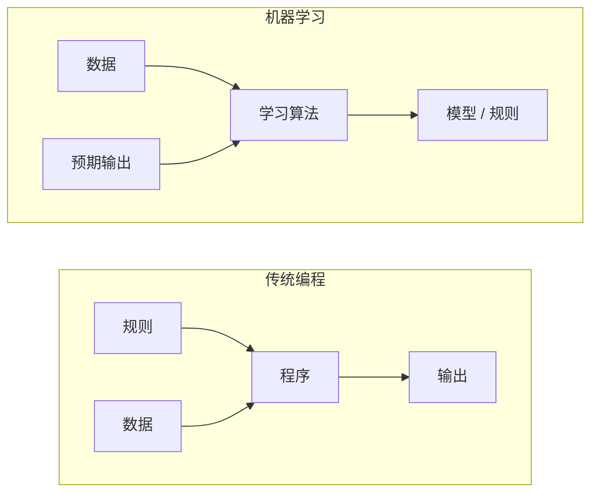
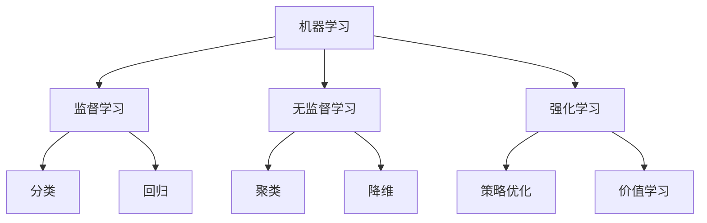
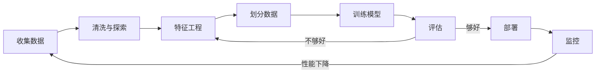
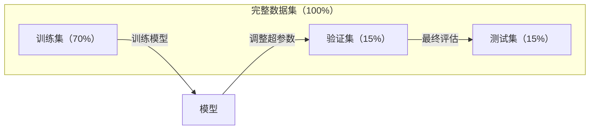
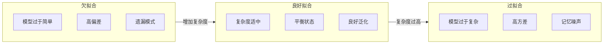
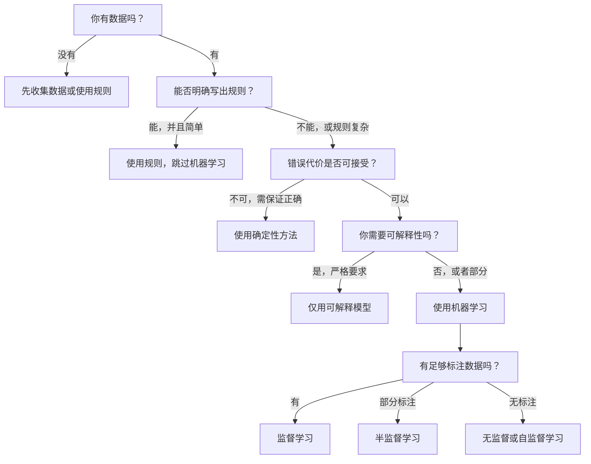

# 什么是机器学习

> 机器学习是教计算机从数据中发现模式，而不是手工编写规则。

**类型:** 学习  
**语言:** Python  
**先决条件:** 第1阶段（数学基础）  
**时长:** 约45分钟

## 学习目标

- 解释监督学习（Supervised Learning）、无监督学习（Unsupervised Learning）和强化学习（Reinforcement Learning）的区别，并识别给定问题适用的类型
- 从零实现最近质心分类器（nearest centroid classifier）并与随机基线做比较评估
- 区分分类任务和回归任务，选择适当的损失函数
- 评估某个业务问题是否适合用机器学习解决，还是更适合用确定性规则解决

## 问题背景

你想构建一个垃圾邮件过滤器。传统方法是：坐下来写数百条规则。比如“如果邮件包含‘FREE MONEY’，标为垃圾邮件；如果有超过3个感叹号，标为垃圾邮件。”你花了数周写规则，但垃圾邮件发送者改变了措辞。你的规则失效了，你继续写更多规则，这个循环永无止境。

机器学习改变了这一点。你不写规则，而是给计算机数千封带标签的邮件（“垃圾”或“非垃圾”），让它自己找出规则。计算机发现了你未曾想到的模式。当垃圾邮件发送者改变策略时，你只需用新数据重新训练，而不必改写代码。

从“编程规则”到“从数据中学习”的转变，是机器学习的核心。每个推荐引擎、语音助手、自动驾驶汽车和语言模型都是这样工作的。

## 概念介绍

### 从数据学习，而非编写规则

传统编程和机器学习解决问题的方向相反。



传统编程：你编写规则，程序将规则应用于数据产生输出。  
机器学习：你提供数据和预期输出，算法自动发现规则。

训练出来的“模型”即为规则，以数字（权重、参数）形式编码。它从已见样本中泛化，能对未见数据做出预测。

### 三种机器学习类型



**监督学习（Supervised Learning）**：有输入-输出对，模型学习输入到输出的映射。  
- “这里有1万张带猫或狗标签的照片，学会分辨它们。”  
- “这里有房屋特征和价格，学会预测价格。”

**无监督学习（Unsupervised Learning）**：只有输入，没有标签，模型自行发现结构。  
- “这里有1万条客户购买记录，找到自然分组。”  
- “这里有1000个高维数据点，降到二维同时保留结构。”

**强化学习（Reinforcement Learning）**：智能体在环境中采取动作，获得奖赏或处罚，学习最大化累计回报的策略（policy）。  
- “玩游戏，赢得+1，输得-1，学策略。”  
- “控制机器人手臂，拿起物体+1，浪费时间每秒-0.01。”

实践中你构建的大多数系统是监督学习。无监督学习常用于预处理和探索。强化学习用于游戏AI、机器人和语言模型的RLHF。

### 超越三种主要类型

上述三类界定明确，但现实中的机器学习经常模糊界限。

**半监督学习（Semi-supervised learning）** 使用少量标记数据和大量未标记数据。你可能有100张标记的医学影像和10万张未标记的。技术包括：

- **标签传播（Label propagation）**：构建连接相似数据点的图结构，标签从标记点通过图传播到未标记邻居。
- **伪标签（Pseudo-labeling）**：先用标记数据训练模型，用它预测未标记数据标签，再用全部数据重新训练。模型自举生成训练集。
- **一致性正则化（Consistency regularization）**：模型对输入及其轻微扰动应给出相同预测。无需标签也能使用。

**自监督学习（Self-supervised learning）** 从数据本身生成监督信号，无需人工标签。模型基于数据结构自行创建预测任务。

- **掩码语言模型（Masked language modeling，BERT）**：随机遮蔽句子中15%的词，训练模型预测缺失词，标签来自原文。
- **对比学习（Contrastive learning，SimCLR）**：对同一图像做两种增强，训练模型识别它们来源相同，且区分其他图像增强版本。
- **下一个词预测（Next-token prediction，GPT）**：给定前面所有词，预测下一个词。每个文本都是训练样本。

这些都不是与“三大类”平行的类别，而是结合监督和无监督思想的策略。自监督严格来说是监督学习，因为模型有预测目标，但标签自动生成，无需人工。

### 分类（Classification）与回归（Regression）

监督学习的两大主要任务。

| 方面         | 分类                   | 回归                 |
|--------------|------------------------|----------------------|
| 输出         | 离散类别               | 连续数值             |
| 示例         | “这封邮件是垃圾吗？”   | “这栋房子价格是多少？” |
| 输出空间     | {猫，狗，鸟}            | 任意实数             |
| 损失函数     | 交叉熵，准确率         | 均方误差，平均绝对误差|
| 决策边界     | 类别之间的边界         | 拟合数据的曲线       |

分类回答“属于哪个类别？”，回归回答“多少？”  

一些问题两种方式都能建模。预测股票涨跌是分类，预测具体价格是回归。

### 机器学习工作流程

每个机器学习项目遵循相同流程，不论算法如何。



**收集数据**：获取原始数据。数据越多通常越好，但质量更重要。

**清洗与探索**：处理缺失值，去重，可视化分布，识别异常。此环节占总项目时间的60-80%。

**特征工程**：将原始数据转换成模型可用特征。日期转星期几，数值归一化，类别变量编码。好的特征胜过复杂算法。

**划分数据**：分为训练集、验证集、测试集。模型在训练集训练，在验证集调整超参数，最终在测试集评估。

**训练模型**：用训练数据训练算法，算法调整内部参数以最小化损失函数。

**评估**：在验证/测试数据上测量性能。如表现不佳，返回调整特征、算法或超参数。

**部署**：将模型投入生产，处理新数据并做预测。

**监控**：长期跟踪性能。数据分布会变化（数据漂移），模型性能下降需重新训练。

### 训练集、验证集和测试集划分

这是初学者最容易误解的关键概念。必须在模型训练未见过的数据上评估，否则只是测试记忆能力，不是真正学习。



| 划分     | 目的                         | 使用时机         | 典型比例       |
|----------|------------------------------|------------------|----------------|
| 训练集   | 模型学习                     | 训练过程中       | 60-80%         |
| 验证集   | 超参数调整，模型比较         | 每次训练后       | 10-20%         |
| 测试集   | 最终无偏性能评估             | 训练完成最终一次 | 10-20%         |

测试集是神圣的，只看一次。若根据测试结果反复调整模型，等同于用测试数据训练，指标没有意义。

小数据集用k折交叉验证：将数据分成k份，轮流用k-1份训练，剩一份验证，结果取平均。

### 欠拟合（Underfitting）与过拟合（Overfitting）



**欠拟合**：模型过于简单，不能捕捉数据中的模式。比如用直线拟合曲线关系。训练误差和测试误差都大。

**过拟合**：模型过于复杂，记住了训练数据和噪声。曲折拟合训练点，但对新数据表现差。训练误差小，测试误差大。

**良好拟合**：模型捕捉到真实模式，没有记忆噪声。训练和测试误差均合理较低。

过拟合的迹象：  
- 训练准确率远高于验证准确率  
- 模型在训练数据表现好，但新数据表现差  
- 增加训练数据可提升性能（说明之前是记忆）

过拟合的修正方法：  
- 获取更多训练数据  
- 降低模型复杂度（参数更少、架构更简单）  
- 正则化（对大权重加惩罚）  
- Dropout（训练中随机丢弃神经元）  
- 提前停止（验证误差开始增大时停止训练）

欠拟合的修正方法：  
- 使用更复杂模型  
- 增加特征  
- 减少正则化  
- 训练更久

### 偏差-方差权衡（Bias-Variance Tradeoff）

这是过拟合和欠拟合背后的数学理论。

**偏差（Bias）**：模型假设错误导致的误差。线性模型在非线性真实关系下有高偏差，导致欠拟合。

**Variance（方差）**: 来自对训练数据中细微波动敏感性的误差。高方差模型在使用不同数据子集训练时会给出非常不同的预测。高方差导致过拟合。

| 模型复杂度 | 偏差（Bias） | 方差（Variance） | 结果 |
|------------|--------------|------------------|------|
| 过低（曲线数据用线性模型） | 高 | 低 | 欠拟合 |
| 适中 | 中等 | 中等 | 良好泛化能力 |
| 过高（10个点用20阶多项式） | 低 | 高 | 过拟合 |

总误差 = 偏差² + 方差 + 不可约噪声

不可约噪声是数据本身的随机性，无法减少。我们需要找到使 偏差² + 方差最小的最佳平衡点。

### No Free Lunch 定理（无免费午餐定理）

不存在对所有问题表现最好的算法。一个在某类问题上表现优秀的算法可能在另一类问题上表现很差。这就是数据科学家尝试多种算法并比较结果的原因。

实际选择取决于：
- 拥有多少数据
- 有多少特征
- 关系是线性还是非线性
- 是否需要可解释性
- 你能负担多少计算资源

### 何时不使用机器学习（Machine Learning）

机器学习很强大，但并不总是合适的工具。使用模型之前，先问自己是否真的需要它。

**不使用机器学习的情况：**

- **规则简单且定义明确。** 税收计算、排序算法、单位转换。如果能用几个 if 语句实现逻辑，模型只会增加复杂性而无益。
- **数据不足或几乎没有数据。** 机器学习需要示例进行学习。只有10个数据点，无法训练出有意义的模型。先收集数据。
- **错误代价灾难性，需要保证正确性。** 医疗剂量计算、核反应堆控制、加密验证。机器学习模型是概率模型，可能出错。如果不能容忍“偶尔错误”，应使用确定性方法。
- **查找表或启发式规则能解决问题。** 简单阈值或查找表覆盖99%的情况时，加入 ML 只会增加维护成本而无明显改善。
- **无法解释决策且需要可解释性。** 监管行业（贷款、保险、刑事司法）有时要求每个决策都必须完全可解释。一些 ML 模型可解释（线性回归、小型决策树），大多数不可。
- **问题变化过快，训练速度跟不上。** 若规则每天变化而训练一周，模型永远是过时的。

使用以下决策流程图：



## 实现它

`code/ml_intro.py` 中的代码从零实现了最近质心分类器，这是最简单的机器学习算法。它展示了核心思想：从数据学习，然后对新数据进行预测。

### 第1步：从零实现最近质心分类器

最近质心分类器计算训练数据中每个类别的中心（均值）。预测时，将每个新点分配给最近的类别中心。

```python
class NearestCentroid:
    def fit(self, X, y):
        self.classes = np.unique(y)
        self.centroids = np.array([
            X[y == c].mean(axis=0) for c in self.classes
        ])

    def predict(self, X):
        distances = np.array([
            np.sqrt(((X - c) ** 2).sum(axis=1))
            for c in self.centroids
        ])
        return self.classes[distances.argmin(axis=0)]
```

这就是完整算法。`fit` 计算两个均值，`predict` 计算距离。无梯度下降，无迭代，无超参数。

### 第2步：在合成数据上训练

生成一个二维分类数据集，有两个类别，稍微重叠。质心分类器在两类中心间画出线性决策边界。

```python
rng = np.random.RandomState(42)
X_class0 = rng.randn(100, 2) + np.array([1.0, 1.0])
X_class1 = rng.randn(100, 2) + np.array([-1.0, -1.0])
X = np.vstack([X_class0, X_class1])
y = np.array([0] * 100 + [1] * 100)
```

### 第3步：与基线比较

每个机器学习模型都应与简单基线比较。这里基线是随机预测类别。如果 ML 模型不比随机猜测好，说明有问题。

```python
baseline_preds = rng.choice([0, 1], size=len(y_test))
baseline_acc = np.mean(baseline_preds == y_test)
```

质心分类器在此干净数据集上应达90%以上准确率。随机基线约50%。

### 这有何重要意义

最近质心分类器极其简单。无超参数、无迭代、无梯度下降。但它捕捉了基本的 ML 模式：

1. **学习** 表示（类别中心）
2. **预测** 新数据（最近距离）
3. **评估** 与基线（随机预测）比较

所有 ML 算法，从逻辑回归到 Transformer，都遵循这三步。表示更复杂，流程不变。

### 第4步：质心分类器做不到的事

最近质心分类器假设每类只有一个簇，决策边界是线性的。它失败于：

- 类别有多个簇（例如数字“1”有多种写法）
- 决策边界非线性（例如一类环绕另一类）
- 特征尺度差异巨大（距离被最大尺度特征主导）

这些限制促使你学习其他算法。K 最近邻处理多个簇。决策树处理非线性边界。特征缩放解决尺度问题。每节课都基于前一节课的限制。

## 使用它

sklearn 提供了 `NearestCentroid` 和合成数据生成器：

```python
from sklearn.neighbors import NearestCentroid
from sklearn.datasets import make_classification
from sklearn.model_selection import train_test_split

X, y = make_classification(
    n_samples=500, n_features=2, n_redundant=0,
    n_clusters_per_class=1, random_state=42
)
X_train, X_test, y_train, y_test = train_test_split(X, y, test_size=0.3)

clf = NearestCentroid()
clf.fit(X_train, y_train)
print(f"Accuracy: {clf.score(X_test, y_test):.3f}")
```

## 交付它

本课生成 `outputs/prompt-ml-problem-framer.md` —— 一个将模糊业务问题转化为具体 ML 任务的提示。给定问题描述（“我们想降低流失”或“预测下一季度需求”），它识别学习类型、定义预测目标、列出候选特征、选择成功指标、建立基线并标记如数据泄漏或类别不平衡等陷阱。在任何 ML 项目开始时使用它，避免做错事。

## 关键词

| 术语 | 常说的意思 | 实际含义 |
|------|------------|----------|
| Model（模型） | “AI” | 一个有可学习参数的数学函数，将输入映射到输出 |
| Training（训练） | “教 AI” | 运行优化算法调整模型参数，使预测匹配已知输出 |
| Feature（特征） | “输入列” | 数据中测量出来、模型用来预测的属性 |
| Label（标签） | “答案” | 训练样本的已知输出，用于计算误差信号 |
| Hyperparameter（超参数） | “你调的设置” | 训练前设定，控制学习过程的参数（学习率，层数） |
| Loss function（损失函数） | “模型有多错” | 衡量预测与实际输出差距，训练时最小化该函数 |
| Overfitting（过拟合） | “它记住了测试集” | 模型学到了训练中的噪声而非泛化规律，导致新数据表现差 |
| Underfitting（欠拟合） | “它没学到东西” | 模型太简单，无法捕捉数据中的真实模式 |
| Generalization（泛化能力） | “对新数据有效” | 模型对未见过的数据做出准确预测的能力 |
| Cross-validation（交叉验证） | “在不同数据分块测试” | 多次划分训练/测试集取平均，得出更鲁棒的性能估计 |
| Regularization（正则化） | “控制权重大小” | 给损失函数加惩罚项，防止模型过于复杂 |
| Data drift（数据漂移） | “世界变了” | 输入数据的统计分布随时间变化，导致模型性能下降 |

## 练习

1. 任选数据集（如 Iris，Titanic）。以70/15/15比例拆分为训练/验证/测试集。解释为何不应在测试集上调超参数。
2. 列出三个现实问题。对每个，指明是分类、回归还是聚类，且是监督学习还是无监督学习。
3. 一个模型在训练集上准确率99%，测试集上60%。诊断问题并列举三种修复方案。

## 拓展阅读

- [An Introduction to Statistical Learning](https://www.statlearning.com/) - 免费教科书，涵盖所有经典 ML 方法并带实际示例
- [Google's Machine Learning Crash Course](https://developers.google.com/machine-learning/crash-course) - 简明图文介绍机器学习概念
- [Scikit-learn User Guide](https://scikit-learn.org/stable/user_guide.html) - Python 中机器学习实用参考文档
