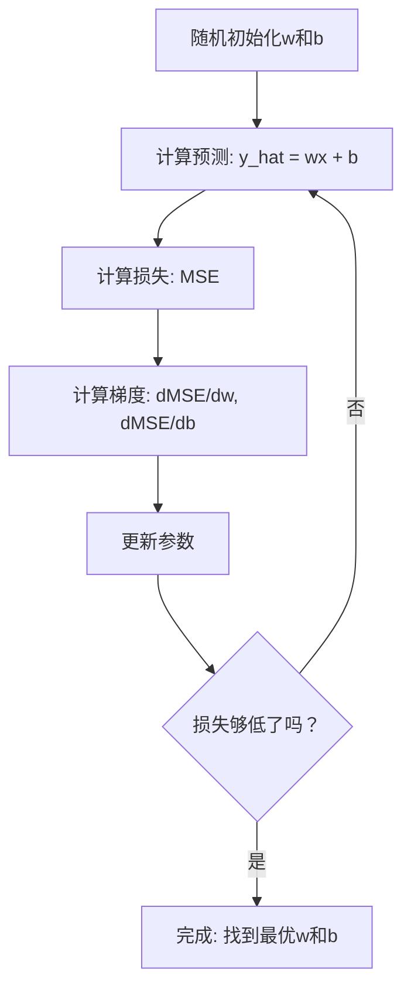

# 线性回归

> 线性回归（Linear Regression）通过你的数据绘制最佳直线。这是机器学习的“Hello World”。

**类型:** 构建  
**语言:** Python  
**先决条件:** 第1阶段（线性代数（Linear Algebra），微积分（Calculus），优化（Optimization）），第2阶段第1课  
**时间:** 大约90分钟

## 学习目标

- 推导均方误差（mean squared error，MSE）的梯度下降（gradient descent）更新规则，并从零实现线性回归
- 比较梯度下降与正规方程（normal equation）在计算复杂度以及使用时机上的差异
- 构建一个带有特征标准化（feature standardization）的多元线性回归模型，理解学习到的权重含义
- 解释岭回归（Ridge Regression，L2正则化）如何通过惩罚大权重防止过拟合

## 问题描述

你有数据：房屋大小和其售价。你想预测一栋新房子给定大小后的价格。你可以通过散点图目测，但你需要一个公式。你需要一条最适合数据的线，这样你可以输入任意大小并得到价格预测。

线性回归给你那条线。更重要的是，它介绍了整个机器学习训练循环：定义模型，定义损失函数，优化参数。每个机器学习算法都遵循相同的模式。在这里通过最简单的例子掌握它，你将能在所有地方识别应用。

这不仅仅用于简单问题。线性回归在生产系统中用于需求预测、A/B测试分析、金融建模，是每个回归任务的基线模型。

## 概念介绍

### 模型

线性回归假设输入（x）和输出（y）之间存在线性关系：

```text
y = wx + b
```

- `w`（权重/斜率）：x增加1时y的变化量
- `b`（偏差/截距）：x=0时的y值

对于多个输入（特征），模型扩展为：

```text
y = w1*x1 + w2*x2 + ... + wn*xn + b
```

或者用向量形式表示：`y = w^T * x + b`

目标是找到使所有训练样本的预测y尽可能接近真实y的w和b值。

### 损失函数（均方误差 MSE）

如何衡量“尽可能接近”？你需要一个单一数字来表示预测误差的大小。最常用的是均方误差（Mean Squared Error，MSE）：

```text
MSE = (1/n) * sum((y_predicted - y_actual)^2)
```

为什么平方？原因有两：

第一，它比简单误差更严重地惩罚大误差（错误10比错误1严重100倍而非10倍）。第二，平方函数光滑且处处可微，方便优化。

损失函数形成一个曲面。对单个权重w和偏差b，MSE曲面像一个碗（凸抛物面）。碗底是MSE最小值。训练即是找到碗底。

### 梯度下降

梯度下降通过往下坡方向迈步找到碗底。



梯度告诉你两个要点：每个参数移动的方向和移动的多少。

对于MSE，y_hat = wx + b：

```text
dMSE/dw = (2/n) * sum((y_hat - y) * x)
dMSE/db = (2/n) * sum(y_hat - y)
```

更新规则：

```text
w = w - learning_rate * dMSE/dw
b = b - learning_rate * dMSE/db
```

学习率控制步长。太大则越过最小点发散，太小训练慢。初始值常用0.01、0.001或0.0001。

### 正规方程（封闭解）

线性回归有直接公式可求最优权重，无需迭代：

```text
w = (X^T * X)^(-1) * X^T * y
```

它通过矩阵求逆一次性求出w。适合小数据集。数据集很大时（百万行或千特征），因计算矩阵求逆是O(n^3)，梯度下降更合适。

### 多元线性回归

多特征模型是：

```text
y = w1*x1 + w2*x2 + ... + wn*xn + b
```

其他内容均相同：MSE是损失函数，梯度下降同时更新所有权重。区别是拟合的是超平面而非直线。

特征缩放很重要。如果一个特征范围是0到1，另一个是0到1,000,000，梯度下降难以收敛因损失曲面拉长。训练前标准化特征（减均值除以标准差）。

### 多项式回归

关系若非线性，依然可使用线性回归通过多项式特征：

```text
y = w1*x + w2*x^2 + w3*x^3 + b
```

这仍然是“线性”回归，因模型在权重（w1、w2、w3）上线性。只是用了非线性x的特征。

高次多项式能拟合更复杂曲线但存在过拟合风险。10阶多项式能通过10点数据中的所有点，但新数据表现差。

### 判定系数（R平方分数）

MSE告诉你误差多大，但受y值尺度影响。R平方（R^2）提供一个尺度无关指标：

```text
R^2 = 1 - (残差平方和) / (与均值偏差平方和)
    = 1 - SS_res / SS_tot
```

- R^2 = 1.0：完美预测
- R^2 = 0.0：模型没比预测均值好
- R^2 < 0.0：模型比预测均值还差

### 正则化预览（岭回归）

特征多时，模型可能过拟合，将赋予权重巨大值。岭回归（L2正则化）加罚项：

```text
Cost = MSE + lambda * sum(w_i^2)
```

惩罚项抑制权重过大。超参数lambda平衡权重大小和正则化：lambda越大权重越小，正则化越强。具体细节后续课程讲解。这里先了解其存在及作用。

## 构建实现

### 步骤1：生成示例数据

```python
import random
import math

random.seed(42)

TRUE_W = 3.0
TRUE_B = 7.0
N_SAMPLES = 100

X = [random.uniform(0, 10) for _ in range(N_SAMPLES)]
y = [TRUE_W * x + TRUE_B + random.gauss(0, 2.0) for x in X]

print(f"生成了 {N_SAMPLES} 个样本")
print(f"真实关系：y = {TRUE_W}x + {TRUE_B} (+ 噪声)")
print(f"前5个点：{[(round(X[i], 2), round(y[i], 2)) for i in range(5)]}")
```

### 步骤2：用梯度下降手写线性回归

```python
class LinearRegression:
    def __init__(self, learning_rate=0.01):
        self.w = 0.0
        self.b = 0.0
        self.lr = learning_rate
        self.cost_history = []

    def predict(self, X):
        return [self.w * x + self.b for x in X]

    def compute_cost(self, X, y):
        predictions = self.predict(X)
        n = len(y)
        cost = sum((pred - actual) ** 2 for pred, actual in zip(predictions, y)) / n
        return cost

    def compute_gradients(self, X, y):
        predictions = self.predict(X)
        n = len(y)
        dw = (2 / n) * sum((pred - actual) * x for pred, actual, x in zip(predictions, y, X))
        db = (2 / n) * sum(pred - actual for pred, actual in zip(predictions, y))
        return dw, db

    def fit(self, X, y, epochs=1000, print_every=200):
        for epoch in range(epochs):
            dw, db = self.compute_gradients(X, y)
            self.w -= self.lr * dw
            self.b -= self.lr * db
            cost = self.compute_cost(X, y)
            self.cost_history.append(cost)
            if epoch % print_every == 0:
                print(f"  迭代 {epoch:4d} | 损失: {cost:.4f} | w: {self.w:.4f} | b: {self.b:.4f}")
        return self

    def r_squared(self, X, y):
        predictions = self.predict(X)
        y_mean = sum(y) / len(y)
        ss_res = sum((actual - pred) ** 2 for actual, pred in zip(y, predictions))
        ss_tot = sum((actual - y_mean) ** 2 for actual in y)
        return 1 - (ss_res / ss_tot)


print("=== 训练线性回归（梯度下降） ===")
model = LinearRegression(learning_rate=0.005)
model.fit(X, y, epochs=1000, print_every=200)
print(f"\n学得模型: y = {model.w:.4f}x + {model.b:.4f}")
print(f"真实模型: y = {TRUE_W}x + {TRUE_B}")
print(f"判定系数(R²): {model.r_squared(X, y):.4f}")
```

### 步骤3：正规方程（封闭解）

```python
class LinearRegressionNormal:
    def __init__(self):
        self.w = 0.0
        self.b = 0.0

    def fit(self, X, y):
        n = len(X)
        x_mean = sum(X) / n
        y_mean = sum(y) / n
        numerator = sum((X[i] - x_mean) * (y[i] - y_mean) for i in range(n))
        denominator = sum((X[i] - x_mean) ** 2 for i in range(n))
        self.w = numerator / denominator
        self.b = y_mean - self.w * x_mean
        return self

    def predict(self, X):
        return [self.w * x + self.b for x in X]

    def r_squared(self, X, y):
        predictions = self.predict(X)
        y_mean = sum(y) / len(y)
        ss_res = sum((actual - pred) ** 2 for actual, pred in zip(y, predictions))
        ss_tot = sum((actual - y_mean) ** 2 for actual in y)
        return 1 - (ss_res / ss_tot)


print("\n=== 正规方程（封闭解） ===")
model_normal = LinearRegressionNormal()
model_normal.fit(X, y)
print(f"学得模型: y = {model_normal.w:.4f}x + {model_normal.b:.4f}")
print(f"判定系数(R²): {model_normal.r_squared(X, y):.4f}")
```

### 步骤4：多元线性回归

```python
class MultipleLinearRegression:
    def __init__(self, n_features, learning_rate=0.01):
        self.weights = [0.0] * n_features
        self.bias = 0.0
        self.lr = learning_rate
        self.cost_history = []

    def predict_single(self, x):
        return sum(w * xi for w, xi in zip(self.weights, x)) + self.bias

    def predict(self, X):
        return [self.predict_single(x) for x in X]

    def compute_cost(self, X, y):
        predictions = self.predict(X)
        n = len(y)
        return sum((pred - actual) ** 2 for pred, actual in zip(predictions, y)) / n

    def fit(self, X, y, epochs=1000, print_every=200):
        n = len(y)
        n_features = len(X[0])
        for epoch in range(epochs):
            predictions = self.predict(X)
            errors = [pred - actual for pred, actual in zip(predictions, y)]
            for j in range(n_features):
                grad = (2 / n) * sum(errors[i] * X[i][j] for i in range(n))
                self.weights[j] -= self.lr * grad
            grad_b = (2 / n) * sum(errors)
            self.bias -= self.lr * grad_b
            cost = self.compute_cost(X, y)
            self.cost_history.append(cost)
            if epoch % print_every == 0:
                print(f"  迭代 {epoch:4d} | 损失: {cost:.4f}")
        return self

    def r_squared(self, X, y):
        predictions = self.predict(X)
        y_mean = sum(y) / len(y)
        ss_res = sum((actual - pred) ** 2 for actual, pred in zip(y, predictions))
        ss_tot = sum((actual - y_mean) ** 2 for actual in y)
        return 1 - (ss_res / ss_tot)


random.seed(42)
N = 100
X_multi = []
y_multi = []
for _ in range(N):
    size = random.uniform(500, 3000)
    bedrooms = random.randint(1, 5)
    age = random.uniform(0, 50)
    price = 50 * size + 10000 * bedrooms - 1000 * age + 50000 + random.gauss(0, 20000)
    X_multi.append([size, bedrooms, age])
    y_multi.append(price)


def standardize(X):
    n_features = len(X[0])
    means = [sum(X[i][j] for i in range(len(X))) / len(X) for j in range(n_features)]
    stds = []
    for j in range(n_features):
        variance = sum((X[i][j] - means[j]) ** 2 for i in range(len(X))) / len(X)
        stds.append(variance ** 0.5)
    X_scaled = []
    for i in range(len(X)):
        row = [(X[i][j] - means[j]) / stds[j] if stds[j] > 0 else 0 for j in range(n_features)]
        X_scaled.append(row)
    return X_scaled, means, stds


y_mean_val = sum(y_multi) / len(y_multi)
y_std_val = (sum((yi - y_mean_val) ** 2 for yi in y_multi) / len(y_multi)) ** 0.5
y_scaled = [(yi - y_mean_val) / y_std_val for yi in y_multi]

X_scaled, x_means, x_stds = standardize(X_multi)

print("\n=== 多元线性回归（3个特征） ===")
print("特征：房屋大小，卧室数，房龄")
multi_model = MultipleLinearRegression(n_features=3, learning_rate=0.01)
multi_model.fit(X_scaled, y_scaled, epochs=1000, print_every=200)

print(f"\n权重（标准化）：{[round(w, 4) for w in multi_model.weights]}")
print(f"偏置（标准化）：{multi_model.bias:.4f}")
print(f"判定系数(R²)：{multi_model.r_squared(X_scaled, y_scaled):.4f}")
```

### 第五步：多项式回归

```python
class PolynomialRegression:
    def __init__(self, degree, learning_rate=0.01):
        self.degree = degree
        self.weights = [0.0] * degree
        self.bias = 0.0
        self.lr = learning_rate

    def make_features(self, X):
        return [[x ** (d + 1) for d in range(self.degree)] for x in X]

    def predict(self, X):
        features = self.make_features(X)
        return [sum(w * f for w, f in zip(self.weights, row)) + self.bias for row in features]

    def fit(self, X, y, epochs=1000, print_every=200):
        features = self.make_features(X)
        n = len(y)
        for epoch in range(epochs):
            predictions = [sum(w * f for w, f in zip(self.weights, row)) + self.bias for row in features]
            errors = [pred - actual for pred, actual in zip(predictions, y)]
            for j in range(self.degree):
                grad = (2 / n) * sum(errors[i] * features[i][j] for i in range(n))
                self.weights[j] -= self.lr * grad
            grad_b = (2 / n) * sum(errors)
            self.bias -= self.lr * grad_b
            if epoch % print_every == 0:
                cost = sum(e ** 2 for e in errors) / n
                print(f"  Epoch {epoch:4d} | 成本: {cost:.6f}")
        return self

    def r_squared(self, X, y):
        predictions = self.predict(X)
        y_mean = sum(y) / len(y)
        ss_res = sum((actual - pred) ** 2 for actual, pred in zip(y, predictions))
        ss_tot = sum((actual - y_mean) ** 2 for actual in y)
        return 1 - (ss_res / ss_tot)


random.seed(42)
X_poly = [x / 10.0 for x in range(0, 50)]
y_poly = [0.5 * x ** 2 - 2 * x + 3 + random.gauss(0, 1.0) for x in X_poly]

x_max = max(abs(x) for x in X_poly)
X_poly_norm = [x / x_max for x in X_poly]
y_poly_mean = sum(y_poly) / len(y_poly)
y_poly_std = (sum((yi - y_poly_mean) ** 2 for yi in y_poly) / len(y_poly)) ** 0.5
y_poly_norm = [(yi - y_poly_mean) / y_poly_std for yi in y_poly]

print("\n=== 多项式回归（2阶 vs 5阶） ===")
print("真实关系: y = 0.5x^2 - 2x + 3")

print("\n2阶多项式:")
poly2 = PolynomialRegression(degree=2, learning_rate=0.1)
poly2.fit(X_poly_norm, y_poly_norm, epochs=2000, print_every=500)
print(f"  R平方: {poly2.r_squared(X_poly_norm, y_poly_norm):.4f}")

print("\n5阶多项式:")
poly5 = PolynomialRegression(degree=5, learning_rate=0.1)
poly5.fit(X_poly_norm, y_poly_norm, epochs=2000, print_every=500)
print(f"  R平方: {poly5.r_squared(X_poly_norm, y_poly_norm):.4f}")

print("\n2阶多项式很好地拟合了真实曲线。5阶多项式略微更好地拟合了训练数据，")
print("但有过拟合新数据的风险。")
```

### 第六步：岭回归（L2正则化）

```python
class RidgeRegression:
    def __init__(self, n_features, learning_rate=0.01, alpha=1.0):
        self.weights = [0.0] * n_features
        self.bias = 0.0
        self.lr = learning_rate
        self.alpha = alpha

    def predict_single(self, x):
        return sum(w * xi for w, xi in zip(self.weights, x)) + self.bias

    def predict(self, X):
        return [self.predict_single(x) for x in X]

    def fit(self, X, y, epochs=1000, print_every=200):
        n = len(y)
        n_features = len(X[0])
        for epoch in range(epochs):
            predictions = self.predict(X)
            errors = [pred - actual for pred, actual in zip(predictions, y)]
            mse = sum(e ** 2 for e in errors) / n
            reg_term = self.alpha * sum(w ** 2 for w in self.weights)
            cost = mse + reg_term
            for j in range(n_features):
                grad = (2 / n) * sum(errors[i] * X[i][j] for i in range(n))
                grad += 2 * self.alpha * self.weights[j]
                self.weights[j] -= self.lr * grad
            grad_b = (2 / n) * sum(errors)
            self.bias -= self.lr * grad_b
            if epoch % print_every == 0:
                print(f"  Epoch {epoch:4d} | 成本: {cost:.4f} | L2 惩罚: {reg_term:.4f}")
        return self


print("\n=== 岭回归（L2 正则化） ===")
print("使用与多元回归相同的数据，alpha=0.1")
ridge = RidgeRegression(n_features=3, learning_rate=0.01, alpha=0.1)
ridge.fit(X_scaled, y_scaled, epochs=1000, print_every=200)
print(f"\n岭回归权重: {[round(w, 4) for w in ridge.weights]}")
print(f"普通权重: {[round(w, 4) for w in multi_model.weights]}")
print("由于 L2 惩罚，岭回归权重更小（向零收缩）。")
```

## 使用方法

现在用 scikit-learn 实现同样的功能，这实际上是生产环境中你会使用的。

```python
from sklearn.linear_model import LinearRegression as SklearnLR
from sklearn.linear_model import Ridge
from sklearn.preprocessing import PolynomialFeatures, StandardScaler
from sklearn.model_selection import train_test_split
from sklearn.metrics import mean_squared_error, r2_score
import numpy as np

np.random.seed(42)
X_sk = np.random.uniform(0, 10, (100, 1))
y_sk = 3.0 * X_sk.squeeze() + 7.0 + np.random.normal(0, 2.0, 100)

X_train, X_test, y_train, y_test = train_test_split(X_sk, y_sk, test_size=0.2, random_state=42)

lr = SklearnLR()
lr.fit(X_train, y_train)
y_pred = lr.predict(X_test)

print("=== Scikit-learn 线性回归 ===")
print(f"系数 (w): {lr.coef_[0]:.4f}")
print(f"截距 (b): {lr.intercept_:.4f}")
print(f"R平方（测试集）: {r2_score(y_test, y_pred):.4f}")
print(f"MSE（测试集）: {mean_squared_error(y_test, y_pred):.4f}")

poly = PolynomialFeatures(degree=2, include_bias=False)
X_poly_sk = poly.fit_transform(X_train)
X_poly_test = poly.transform(X_test)

lr_poly = SklearnLR()
lr_poly.fit(X_poly_sk, y_train)
print(f"\n二次多项式 R平方: {r2_score(y_test, lr_poly.predict(X_poly_test)):.4f}")

scaler = StandardScaler()
X_train_scaled = scaler.fit_transform(X_train)
X_test_scaled = scaler.transform(X_test)

ridge = Ridge(alpha=1.0)
ridge.fit(X_train_scaled, y_train)
print(f"岭回归 R平方: {r2_score(y_test, ridge.predict(X_test_scaled)):.4f}")
print(f"岭回归系数: {ridge.coef_[0]:.4f}")
```

你的从零实现版本和 scikit-learn 产生相同结果。区别在于：scikit-learn 处理边缘情况、数值稳定性和性能优化。生产使用库；学习时用从零实现版本理解过程。

## 交付内容

本课程生成：
- `outputs/skill-regression.md` - 根据问题选择合适回归方法的技能

## 练习

1. 实现批量梯度下降、随机梯度下降（SGD）和小批量梯度下降。比较它们在同一数据集上的收敛速度。哪个收敛最快？哪个成本曲线最平滑？
2. 生成一个三次多项式函数数据（y = ax^3 + bx^2 + cx + d + 噪声）。拟合1阶、3阶和10阶多项式。比较训练 R^2 和测试 R^2。在哪个阶数过拟合变得明显？
3. 实现 Lasso 回归（L1 正则化: 惩罚项 = alpha * sum(|w_i|)）。用多特征住宅数据训练。比较哪些权重归零与 Ridge 权重。为什么 L1 产生稀疏解而 L2 不会？

## 关键词

| 术语 | 常见说法 | 实际含义 |
|------|----------|----------|
| Linear regression（线性回归） | “画一条通过数据的线” | 找权重 w 和偏置 b 使 wx+b 与真实 y 差平方和最小 |
| Cost function（代价函数） | “模型有多差” | 把模型参数映射为一个衡量预测误差的数值，优化目标 |
| Mean squared error（均方误差） | “平方误差的平均” | (1/n) * 预测值与真实值差的平方和，对大误差惩罚更重 |
| Gradient descent（梯度下降） | “往下坡走” | 迭代调整参数，沿降低代价函数方向，用偏导数 |
| Learning rate（学习率） | “步长” | 控制每步梯度下降参数更新幅度的标量 |
| Normal equation（正规方程） | “直接解” | 闭式解 w = (X^T X)^-1 X^T y，无需迭代，求最优权重 |
| R-squared（R平方） | “拟合优度” | 解释 y 变量方差的比例，范围负无穷到1.0 |
| Feature scaling（特征缩放） | “让特征更可比” | 把特征转换到相似范围（如均值0，方差1）促进梯度下降收敛 |
| Regularization（正则化） | “惩罚模型复杂度” | 给代价函数加项以收缩权重，防止过拟合 |
| Ridge regression（岭回归） | “L2 正则化” | 线性回归加 λ * sum(w_i²) 惩罚项 |
| Polynomial regression（多项式回归） | “用线性数学拟合曲线” | 对多项式特征（x, x², x³, …）做线性回归，权重仍是线性 |
| Overfitting（过拟合） | “记住训练数据而非规律” | 模型过于复杂导致拟合了训练数据噪声，对新数据效果差 |

## 延伸阅读

- [统计学习导论（ISLR）](https://www.statlearning.com/) —— 免费 PDF，第三章和第六章讲线性回归和正则化，包含实用 R 例子
- [统计学习基础（ESL）](https://hastie.su.domains/ElemStatLearn/) —— 免费 PDF，是 ISLR 的数学补充，详细讲解岭回归和 Lasso
- [斯坦福 CS229 线性回归讲义](https://cs229.stanford.edu/main_notes.pdf) —— Andrew Ng 的笔记，从原理推导正规方程和梯度下降
- [scikit-learn LinearRegression 文档](https://scikit-learn.org/stable/modules/linear_model.html) —— LinearRegression、Ridge、Lasso、ElasticNet 的实用参考和代码示例
