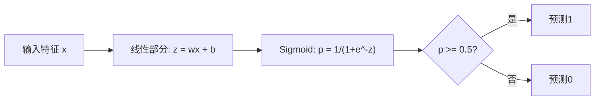

# Logistic Regression（逻辑回归）

> Logistic regression（逻辑回归）通过将一条直线转换成S形曲线来用概率回答是/否问题。

**类型：** 构建  
**语言：** Python  
**前置知识：** 第二阶段第1-2课（什么是机器学习，线性回归）  
**时长：** ~90分钟  

## 学习目标

- 从头实现逻辑回归，使用sigmoid函数和binary cross-entropy loss（二元交叉熵损失）
- 计算并解释精确率（precision）、召回率（recall）、F1分数及二分类混淆矩阵
- 解释为什么MSE（均方误差）无法用于分类，以及为什么binary cross-entropy会产生凸的代价曲面
- 构建多类分类的softmax回归模型，并评估阈值调节的权衡

## 问题描述

给定肿瘤的大小，你想预测它是恶性（malignant）还是良性（benign）。你尝试用线性回归。它输出数字如0.3、1.7或-0.5。它们代表什么？1.7是“非常恶性”吗？-0.5是“非常良性”吗？线性回归输出无界的数字。分类需要的是介于0和1之间的概率，并且需要明确的决定：是或否。

逻辑回归解决了这个问题。它采用相同的线性组合（wx + b），再通过sigmoid函数，该函数将任何数字压缩到(0, 1)区间。输出的是概率。你设置一个阈值（通常是0.5）进行决策。

这是实践中应用最广的算法之一。尽管名字叫回归，逻辑回归其实是一个分类算法，名字来自它使用的logistic（sigmoid）函数。

## 概念

### 为什么线性回归不能用于分类

设想根据学习时间预测及格/不及格（1/0）。线性回归拟合一条直线：

```text
hours:  1   2   3   4   5   6   7   8   9   10
actual: 0   0   0   0   1   1   1   1   1   1
```

线性拟合可能在第1小时预测-0.2，在第10小时预测1.3。这些不是概率，且数值会超出[0,1]。更糟的是，如果有个异常值（比如学习了50小时）会极大影响整条线，改变所有人的预测。

分类需要一个函数：
- 输出介于0和1之间的数值（概率）
- 产生锋利的转变（决策边界）
- 不被远离边界的异常值影响

### Sigmoid函数

sigmoid函数正是满足要求：

```text
sigmoid(z) = 1 / (1 + e^(-z))
```

性质：
- 当z很大正时，sigmoid(z)趋近于1
- 当z很大负时，sigmoid(z)趋近于0
- 当z=0时，sigmoid(z) = 0.5
- 输出永远介于0和1之间
- 函数光滑且全导可微

求导形式简洁：sigmoid'(z) = sigmoid(z) * (1 - sigmoid(z))，方便计算梯度。

### 逻辑回归 = 线性模型 + Sigmoid

模型计算z = wx + b（同线性回归），然后应用sigmoid：



输出p表示P(y=1 | x)，即输入属于类1的概率。决策边界是wx + b = 0时，sigmoid输出恰好是0.5。

### 二元交叉熵损失（Binary Cross-Entropy Loss）

不能用MSE来训练逻辑回归。sigmoid加MSE会产生非凸损失面，存在多个局部极小值。用二元交叉熵（log loss）：

```text
Loss = -(1/n) * sum(y * log(p) + (1-y) * log(1-p))
```

为何有效：
- y=1且p接近1时，log(1)=0，损失接近0（正确，代价低）
- y=1且p接近0时，log(0)趋近负无穷，损失极大（错误，代价高）
- y=0且p接近0时，log(1)=0，损失接近0（正确，代价低）
- y=0且p接近1时，log(0)趋近负无穷，损失极大（错误，代价高）

该损失函数对逻辑回归是凸函数，保证有唯一全局最小值。

### 逻辑回归的梯度下降

对binary cross-entropy和sigmoid，梯度形式简单：

```text
dL/dw = (1/n) * sum((p - y) * x)
dL/db = (1/n) * sum(p - y)
```

与线性回归的梯度几乎一样。区别是p = sigmoid(wx + b)而非p = wx + b。sigmoid引入非线性，但梯度更新规则相同。

```mermaid
flowchart TD
    A[初始化 w=0, b=0] --> B[前向传播: z = wx+b, p = sigmoid(z)]
    B --> C[计算损失: 二元交叉熵]
    C --> D["计算梯度: dw = (1/n) * sum((p-y)*x)"]
    D --> E[更新参数: w = w - lr*dw, b = b - lr*db]
    E --> F{是否收敛?}
    F -->|否| B
    F -->|是| G[模型训练完成]
```

### 决策边界

对于二维输入（两个特征），决策边界是满足：

```text
w1*x1 + w2*x2 + b = 0
```

这个方程定义一条线。线的一边分类为1，另一边为0。逻辑回归始终产生线性决策边界。想要非线性边界可以增加多项式特征或使用非线性模型。

### 多类分类与Softmax

二元逻辑回归只适合两类问题。对于k类问题，使用softmax函数：

```text
softmax(z_i) = e^(z_i) / sum(e^(z_j) for all j)
```

每个类别有自己的权重向量。模型计算所有类别的分数z_i，softmax把这些分数转换为总和为1的概率。预测类别是概率最高的那个。

损失函数变为多类交叉熵（categorical cross-entropy）：

```text
Loss = -(1/n) * sum(sum(y_k * log(p_k)))
```

其中y_k是独热编码（one-hot encoding），对应真实类别为1，其余为0。

### 评估指标

准确率不足以衡量。一个含95%负样本、5%正样本的数据集，预测全部为负的模型准确率95%，但毫无用处。

**混淆矩阵Confusion Matrix：**

|                 | 预测正类        | 预测负类        |
|-----------------|----------------|----------------|
| 实际正类         | True Positive (TP)  真阳性 | False Negative (FN) 假阴性 |
| 实际负类         | False Positive (FP) 假阳性 | True Negative (TN)  真阴性 |

**精确率 Precision**：所有预测为正中的实际正比例  
```text
Precision = TP / (TP + FP)
```

**召回率 Recall（灵敏度）**：所有实际正中被预测为正的比例  
```text
Recall = TP / (TP + FN)
```

**F1分数**：精确率与召回率的调和平均，平衡两者  
```text
F1 = 2 * (Precision * Recall) / (Precision + Recall)
```

应用场景：
- **重视精确率时**：假阳性代价高（如垃圾邮件过滤，避免误拦正常邮件）
- **重视召回率时**：假阴性代价高（如癌症筛查，避免漏诊肿瘤）
- **需要平衡时**：用F1分数作为综合指标

## 实战构建

### 第1步：Sigmoid函数和数据生成

```python
import random
import math

def sigmoid(z):
    z = max(-500, min(500, z))  # 防止指数溢出
    return 1.0 / (1.0 + math.exp(-z))


random.seed(42)
N = 200
X = []
y = []

for _ in range(N // 2):
    X.append([random.gauss(2, 1), random.gauss(2, 1)])  # 类0中心在(2, 2)
    y.append(0)

for _ in range(N // 2):
    X.append([random.gauss(5, 1), random.gauss(5, 1)])  # 类1中心在(5, 5)
    y.append(1)

combined = list(zip(X, y))
random.shuffle(combined)
X, y = zip(*combined)
X = list(X)
y = list(y)

print(f"生成了 {N} 个样本（2类，每类2个特征）")
print(f"类0中心：(2, 2)，类1中心：(5, 5)")
print(f"前5个样本示例：")
for i in range(5):
    print(f"  特征: [{X[i][0]:.2f}, {X[i][1]:.2f}], 标签: {y[i]}")
```

### 第2步：从头实现逻辑回归

```python
class LogisticRegression:
    def __init__(self, n_features, learning_rate=0.01):
        self.weights = [0.0] * n_features
        self.bias = 0.0
        self.lr = learning_rate
        self.loss_history = []

    def predict_proba(self, x):
        z = sum(w * xi for w, xi in zip(self.weights, x)) + self.bias
        return sigmoid(z)

    def predict(self, x, threshold=0.5):
        return 1 if self.predict_proba(x) >= threshold else 0

    def compute_loss(self, X, y):
        n = len(y)
        total = 0.0
        for i in range(n):
            p = self.predict_proba(X[i])
            p = max(1e-15, min(1 - 1e-15, p))  # 避免log(0)
            total += y[i] * math.log(p) + (1 - y[i]) * math.log(1 - p)
        return -total / n

    def fit(self, X, y, epochs=1000, print_every=200):
        n = len(y)
        n_features = len(X[0])
        for epoch in range(epochs):
            dw = [0.0] * n_features
            db = 0.0
            for i in range(n):
                p = self.predict_proba(X[i])
                error = p - y[i]
                for j in range(n_features):
                    dw[j] += error * X[i][j]
                db += error
            for j in range(n_features):
                self.weights[j] -= self.lr * (dw[j] / n)
            self.bias -= self.lr * (db / n)
            loss = self.compute_loss(X, y)
            self.loss_history.append(loss)
            if epoch % print_every == 0:
                print(f"  轮次 {epoch:4d} | 损失: {loss:.4f} | w: [{self.weights[0]:.3f}, {self.weights[1]:.3f}] | b: {self.bias:.3f}")
        return self

    def accuracy(self, X, y):
        correct = sum(1 for i in range(len(y)) if self.predict(X[i]) == y[i])
        return correct / len(y)


split = int(0.8 * N)
X_train, X_test = X[:split], X[split:]
y_train, y_test = y[:split], y[split:]

print("\n=== 训练逻辑回归模型 ===")
model = LogisticRegression(n_features=2, learning_rate=0.1)
model.fit(X_train, y_train, epochs=1000, print_every=200)

print(f"\n训练集准确率: {model.accuracy(X_train, y_train):.4f}")
print(f"测试集准确率: {model.accuracy(X_test, y_test):.4f}")
print(f"权重: [{model.weights[0]:.4f}, {model.weights[1]:.4f}]")
print(f"偏置: {model.bias:.4f}")
```

### 第3步：从头实现混淆矩阵及指标

```python
class ClassificationMetrics:
    def __init__(self, y_true, y_pred):
        self.tp = sum(1 for t, p in zip(y_true, y_pred) if t == 1 and p == 1)
        self.tn = sum(1 for t, p in zip(y_true, y_pred) if t == 0 and p == 0)
        self.fp = sum(1 for t, p in zip(y_true, y_pred) if t == 0 and p == 1)
        self.fn = sum(1 for t, p in zip(y_true, y_pred) if t == 1 and p == 0)

    def accuracy(self):
        total = self.tp + self.tn + self.fp + self.fn
        return (self.tp + self.tn) / total if total > 0 else 0

    def precision(self):
        denom = self.tp + self.fp
        return self.tp / denom if denom > 0 else 0

    def recall(self):
        denom = self.tp + self.fn
        return self.tp / denom if denom > 0 else 0

    def f1(self):
        p = self.precision()
        r = self.recall()
        return 2 * p * r / (p + r) if (p + r) > 0 else 0

    def print_confusion_matrix(self):
        print(f"\n  混淆矩阵:")
        print(f"                  预测")
        print(f"                  正       负")
        print(f"  实际 正      {self.tp:4d}    {self.fn:4d}")
        print(f"  实际 负      {self.fp:4d}    {self.tn:4d}")

    def print_report(self):
        self.print_confusion_matrix()
        print(f"\n  准确率:  {self.accuracy():.4f}")
        print(f"  精确率:  {self.precision():.4f}")
        print(f"  召回率:  {self.recall():.4f}")
        print(f"  F1 分数: {self.f1():.4f}")


y_pred_test = [model.predict(x) for x in X_test]
print("\n=== 分类指标报告（测试集） ===")
metrics = ClassificationMetrics(y_test, y_pred_test)
metrics.print_report()
```

### 第4步：决策边界分析

```python
print("\n=== 决策边界 ===")
w1, w2 = model.weights
b = model.bias
print(f"决策边界: {w1:.4f}*x1 + {w2:.4f}*x2 + {b:.4f} = 0")
if abs(w2) > 1e-10:
    print(f"解出 x2:     x2 = {-w1/w2:.4f}*x1 + {-b/w2:.4f}")

print("\n边界附近的样本预测：")
test_points = [
    [3.0, 3.0],
    [3.5, 3.5],
    [4.0, 4.0],
    [2.5, 2.5],
    [5.0, 5.0],
]
for point in test_points:
    prob = model.predict_proba(point)
    pred = model.predict(point)
    print(f"  [{point[0]}, {point[1]}] -> 概率={prob:.4f}, 类别={pred}")
```

### 第5步：使用 softmax 的多分类

```python
class SoftmaxRegression:
    def __init__(self, n_features, n_classes, learning_rate=0.01):
        self.n_features = n_features
        self.n_classes = n_classes
        self.lr = learning_rate
        self.weights = [[0.0] * n_features for _ in range(n_classes)]
        self.biases = [0.0] * n_classes

    def softmax(self, scores):
        max_score = max(scores)
        exp_scores = [math.exp(s - max_score) for s in scores]
        total = sum(exp_scores)
        return [e / total for e in exp_scores]

    def predict_proba(self, x):
        scores = [
            sum(self.weights[k][j] * x[j] for j in range(self.n_features)) + self.biases[k]
            for k in range(self.n_classes)
        ]
        return self.softmax(scores)

    def predict(self, x):
        probs = self.predict_proba(x)
        return probs.index(max(probs))

    def fit(self, X, y, epochs=1000, print_every=200):
        n = len(y)
        for epoch in range(epochs):
            grad_w = [[0.0] * self.n_features for _ in range(self.n_classes)]
            grad_b = [0.0] * self.n_classes
            total_loss = 0.0
            for i in range(n):
                probs = self.predict_proba(X[i])
                for k in range(self.n_classes):
                    target = 1.0 if y[i] == k else 0.0
                    error = probs[k] - target
                    for j in range(self.n_features):
                        grad_w[k][j] += error * X[i][j]
                    grad_b[k] += error
                true_prob = max(probs[y[i]], 1e-15)
                total_loss -= math.log(true_prob)
            for k in range(self.n_classes):
                for j in range(self.n_features):
                    self.weights[k][j] -= self.lr * (grad_w[k][j] / n)
                self.biases[k] -= self.lr * (grad_b[k] / n)
            if epoch % print_every == 0:
                print(f"  训练周期 {epoch:4d} | 损失: {total_loss / n:.4f}")
        return self

    def accuracy(self, X, y):
        correct = sum(1 for i in range(len(y)) if self.predict(X[i]) == y[i])
        return correct / len(y)


random.seed(42)
X_3class = []
y_3class = []

centers = [(1, 1), (5, 1), (3, 5)]
for label, (cx, cy) in enumerate(centers):
    for _ in range(50):
        X_3class.append([random.gauss(cx, 0.8), random.gauss(cy, 0.8)])
        y_3class.append(label)

combined = list(zip(X_3class, y_3class))
random.shuffle(combined)
X_3class, y_3class = zip(*combined)
X_3class = list(X_3class)
y_3class = list(y_3class)

split_3 = int(0.8 * len(X_3class))
X_train_3 = X_3class[:split_3]
y_train_3 = y_3class[:split_3]
X_test_3 = X_3class[split_3:]
y_test_3 = y_3class[split_3:]

print("\n=== 多分类 Softmax 回归（3类） ===")
softmax_model = SoftmaxRegression(n_features=2, n_classes=3, learning_rate=0.1)
softmax_model.fit(X_train_3, y_train_3, epochs=1000, print_every=200)
print(f"\n训练准确率: {softmax_model.accuracy(X_train_3, y_train_3):.4f}")
print(f"测试准确率:  {softmax_model.accuracy(X_test_3, y_test_3):.4f}")

print("\n样本预测:")
for i in range(5):
    probs = softmax_model.predict_proba(X_test_3[i])
    pred = softmax_model.predict(X_test_3[i])
    print(f"  真实: {y_test_3[i]}, 预测: {pred}, 概率: [{', '.join(f'{p:.3f}' for p in probs)}]")
```

### 第6步：阈值调节

```python
print("\n=== 阈值调节 ===")
print("默认阈值: 0.5。调整阈值会在精确率和召回率之间权衡。\n")

thresholds = [0.3, 0.4, 0.5, 0.6, 0.7]
print(f"{'阈值':>10} {'准确率':>10} {'精确率':>10} {'召回率':>10} {'F1':>10}")
print("-" * 52)

for t in thresholds:
    y_pred_t = [1 if model.predict_proba(x) >= t else 0 for x in X_test]
    m = ClassificationMetrics(y_test, y_pred_t)
    print(f"{t:>10.1f} {m.accuracy():>10.4f} {m.precision():>10.4f} {m.recall():>10.4f} {m.f1():>10.4f}")
```

## 使用它

现在用 scikit-learn 重做一遍。

```python
from sklearn.linear_model import LogisticRegression as SklearnLR
from sklearn.metrics import accuracy_score, precision_score, recall_score, f1_score
from sklearn.metrics import confusion_matrix, classification_report
from sklearn.model_selection import train_test_split
from sklearn.preprocessing import StandardScaler
import numpy as np

np.random.seed(42)
X_0 = np.random.randn(100, 2) + [2, 2]
X_1 = np.random.randn(100, 2) + [5, 5]
X_sk = np.vstack([X_0, X_1])
y_sk = np.array([0] * 100 + [1] * 100)

X_tr, X_te, y_tr, y_te = train_test_split(X_sk, y_sk, test_size=0.2, random_state=42)

scaler = StandardScaler()
X_tr_sc = scaler.fit_transform(X_tr)
X_te_sc = scaler.transform(X_te)

lr = SklearnLR()
lr.fit(X_tr_sc, y_tr)
y_pred = lr.predict(X_te_sc)

print("=== Scikit-learn 逻辑回归 ===")
print(f"准确率:  {accuracy_score(y_te, y_pred):.4f}")
print(f"精确率: {precision_score(y_te, y_pred):.4f}")
print(f"召回率: {recall_score(y_te, y_pred):.4f}")
print(f"F1分数:        {f1_score(y_te, y_pred):.4f}")
print(f"\n混淆矩阵:\n{confusion_matrix(y_te, y_pred)}")
print(f"\n分类报告:\n{classification_report(y_te, y_pred)}")
```

你从零实现的模型产生了相同的决策边界和指标。Scikit-learn 额外支持了求解器选项（liblinear、lbfgs、saga）、自动正则化、多分类策略（one-vs-rest，多项式）、以及数值稳定性优化。

## 部署它

本课产生的文件：
- `code/logistic_regression.py` - 从零实现的带指标的逻辑回归

## 练习

1. 生成一个非线性可分的数据集（例如两个同心圆）。训练逻辑回归并观察其失败效果。然后添加多项式特征（x1², x2², x1*x2）并重新训练。展示准确率改善的效果。
2. 为3类 softmax 模型实现多分类混淆矩阵。计算每类的精确率和召回率。哪个类别最难分类？
3. 从零构建 ROC 曲线。取 0 到 1 范围的 100 个阈值，计算真正率和假正率。用梯形法则计算 AUC（曲线下面积）。

## 关键词

| 术语 | 常见描述 | 实际含义 |
|------|----------|----------|
| Logistic regression（逻辑回归） | "用于分类的回归" | 线性模型后接 sigmoid 函数，输出类别概率 |
| Sigmoid function（sigmoid 函数） | "S形曲线" | 函数 1/(1+e^(-z))，将任意实数映射到 (0, 1) 区间 |
| Binary cross-entropy（二元交叉熵） | "对数损失" | 损失函数 -[y*log(p) + (1-y)*log(1-p)]，对高置信错误惩罚严重 |
| Decision boundary（决策边界） | "分界线" | 模型输出概率为0.5的边界面，区别预测类别 |
| Softmax（softmax） | "多分类 sigmoid" | 将分数向量转换为概率且概率和为1的函数 |
| Precision（精确率） | "选中的有多少是相关的" | TP / (TP + FP)，正预测中实际正样本的比例 |
| Recall（召回率） | "相关的选中了多少" | TP / (TP + FN)，实际正样本中被正确预测的比例 |
| F1 score（F1 分数） | "平衡准确率" | 精确率和召回率的调和平均：2*P*R / (P+R) |
| Confusion matrix（混淆矩阵） | "错误细分" | 显示每类的TP、TN、FP、FN计数的表格 |
| Threshold（阈值） | "切分点" | 模型预测类别1的概率临界值（默认0.5，可调） |
| One-hot encoding（独热编码） | "类别的二进制列" | 用全零向量且在类别k位置标1表示类别k |
| Categorical cross-entropy（分类交叉熵） | "多分类对数损失" | 二元交叉熵扩展到k类，使用独热标签 |
