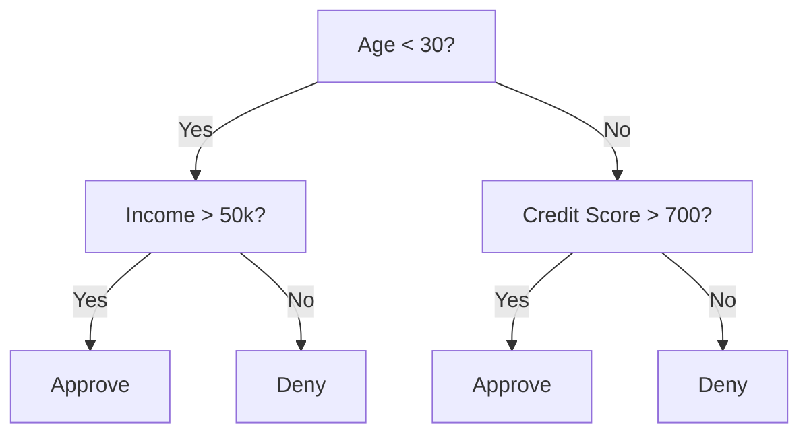
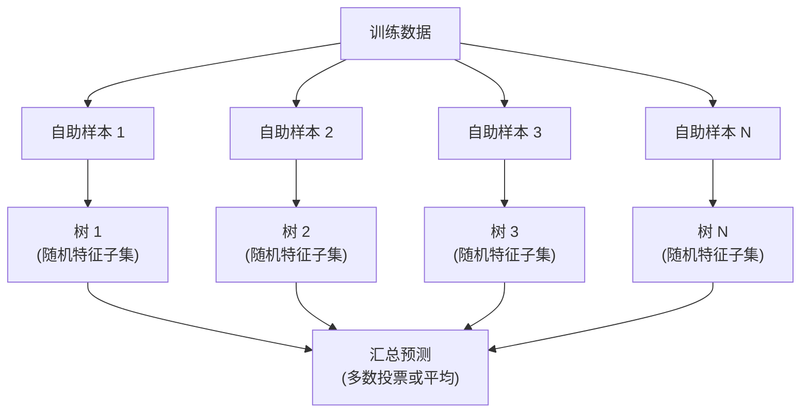

# 决策树和随机森林

> 决策树就是一个流程图。但一片森林则是机器学习中最强大的工具之一。

**类型：** 构建  
**语言：** Python  
**先决条件：** 第一阶段（第09课 信息论，第06课 概率论）  
**时间：** 约90分钟

## 学习目标

- 实现 Gini impurity（Gini杂质）、entropy（熵）和 information gain（信息增益）计算，寻找最优决策树划分
- 从零构建带有预剪枝控制（最大深度、最小样本数）的决策树分类器
- 使用自助采样和特征随机化构建随机森林，并解释其为何降低方差
- 比较 MDI（Mean Decrease in Impurity，平均不纯度减少）特征重要性和 permutation importance（置换重要性），并识别MDI何时存在偏差

## 问题描述

你有表格数据。行代表样本，列是特征，还有一个目标列你想预测。你可以用神经网络处理它。但对于表格数据，基于树的模型（决策树、随机森林、梯度提升树）始终优于深度学习。Kaggle上结构化数据竞赛多由XGBoost和LightGBM主导，而非Transformer（Transformer 架构）。

为什么？树模型无需预处理即可处理混合特征类型（数值型和类别型）。它们无需特征工程即可处理非线性关系。它们具有可解释性：你可以查看树，明确知道为何做出预测。随机森林通过多棵树的平均，对中等规模数据集极其抗过拟合。

本课从零开始用递归划分构建决策树，再构建随机森林。你将实现划分准则背后的数学（Gini impurity、entropy、information gain），并理解为什么弱学习器集成能变强。

## 概念

### 决策树的作用

决策树通过一系列是/否问题，将特征空间划分为矩形区域。



每个内部节点测试某个特征是否超过阈值。每个叶节点给出预测。对新数据点分类时，从根节点开始，沿分支直到叶节点。

树是从上到下构建的，每个节点选择能最好分隔数据的特征和阈值。“最好”由划分准则决定。

### 划分准则：衡量不纯度

每个节点有一组样本。我们希望划分使得子节点尽可能“纯净”，即每个子节点主要包含一种类别。

**Gini impurity（Gini 杂质）**衡量随机选一样本时，被以该节点类别分布错误分类的概率。

```text
Gini(S) = 1 - sum(p_k^2)

其中 p_k 是集合 S 中类 k 的比例。
```

纯净节点（单一类别）时 Gini = 0。类均匀二分时 Gini = 0.5。越低越好。

```text
示例：6只猫，4只狗

Gini = 1 - (0.6^2 + 0.4^2) = 1 - (0.36 + 0.16) = 0.48
```

**Entropy（熵）**衡量节点的信息量（混乱度）。详见第一阶段第09课。

```text
Entropy(S) = -sum(p_k * log2(p_k))
```

纯净节点时熵 = 0。类均匀二分时熵 = 1.0。越低越好。

```text
示例：6只猫，4只狗

Entropy = -(0.6 * log2(0.6) + 0.4 * log2(0.4))
        = -(0.6 * -0.737 + 0.4 * -1.322)
        = 0.442 + 0.529
        = 0.971 bits
```

**Information gain（信息增益）**是划分后不纯度（熵或Gini）减少量。

```text
IG(S, feature, threshold) = Impurity(S) - weighted_avg(Impurity(S_left), Impurity(S_right))

加权平均按子节点样本数量比例计算。
```

每个节点的贪心算法：尝试所有特征和所有可能的阈值。选取最大信息增益的（特征，阈值）对。

### 划分的工作原理

对于当前节点有 n 个特征，m 个样本的数据：

1. 对每个特征 j（1 ~ n）：
   - 按特征 j 排序样本
   - 尝试相邻不同值之间的每个中点作为阈值
   - 计算每个阈值的信息增益
2. 选择信息增益最大的特征和阈值
3. 按该阈值分割数据为左（feature <= 阈值）和右（feature > 阈值）
4. 对左右子节点递归执行以上步骤

此贪心策略不保证全局最优。寻找最优树是 NP-hard。但实际上表现良好。

### 停止条件

若无停止条件，树会生长直到每个叶节点纯净（单一样本），完全记忆训练集但泛化差。

**预剪枝**提前停止树生长：  
- 最大深度：树达到指定深度时停止分割  
- 叶节点最小样本数：节点样本少于阈值时停止分割  
- 最小信息增益：最佳划分信息增益低于阈值时停止分割  
- 最大叶节点数：限制叶子总数

**后剪枝**先生长完整树，再剪枝：  
- 代价复杂度剪枝（scikit-learn采用）：对叶节点数加罚，调大惩罚得到更小树  
- 减少误差剪枝：若剪除子树不提升验证误差，则移除

预剪枝更简单快速，后剪枝往往能得到更优树因为不提前停止可能有价值的划分。

### 回归树

回归树叶节点预测是该叶样本目标值的均值。划分准则改为：

**方差减少**替代信息增益：

```text
VR(S, feature, threshold) = Var(S) - weighted_avg(Var(S_left), Var(S_right))
```

选择方差下降最多的划分。树将输入空间切割成若干区域，每区域预测该区域目标均值。

### 随机森林：集成的力量

单颗决策树方差高，小变动会造成全树改变。随机森林通过平均多棵树解决此问题。



两种随机性保证树的多样性：

**Bagging（自助聚合）：** 每棵树用训练数据的自助样本训练（有放回随机采样），约63%的原始样本包含于每个自助样本，其余为袋外样本，可用于验证。

**特征随机化：** 划分时只考虑随机特征子集。分类默认取 sqrt(特征数)，回归取特征数除以3。防止所有树都在同一优势特征上划分。

关键结论：平均多个非相关树降低方差且不增加偏差。单棵树可能表现一般，集成后则强大。

### 特征重要性

随机森林自然提供特征重要性分数。最常用的：

**MDI（Mean Decrease in Impurity，平均不纯度减少）:** 对每个特征，累积所有树中使用该特征划分节点的不纯度降低。越早划分且降低越多，重要性越高。

```text
importance(feature_j) = 对所有使用 feature_j 的节点求和：
    (节点样本数 / 总样本数) * 不纯度减少
```

该方法计算快（训练时计算），但是偏向取值多且切分点多的特征。

**Permutation importance（置换重要性）**是另一种：对一个特征值随机置换，测量模型准确率下降多少。更准确但计算更慢。

### 树为何胜过神经网络

树和森林在表格数据上胜过神经网络。原因有：

| 因素 | 树 | 神经网络 |
|------|----|---------|
| 混合类型（数值+类别） | 原生支持 | 需编码 |
| 小数据集（<1万条） | 表现好 | 易过拟合 |
| 特征交互 | 通过划分自动发现 | 需设计架构 |
| 可解释性 | 全透明 | 黑盒 |
| 训练时间 | 几分钟 | 几小时 |
| 超参数敏感性 | 低 | 高 |

神经网络适合有空间或序列结构的数据（图像、文本、音频）。对于平坦表格特征，树是首选。

## 构建实战

### 第一步：Gini impurity 和 entropy

从零实现两种划分准则并验证它们在划分好坏上的一致性。

```python
import math

def gini_impurity(labels):
    n = len(labels)
    if n == 0:
        return 0.0
    counts = {}
    for label in labels:
        counts[label] = counts.get(label, 0) + 1
    return 1.0 - sum((c / n) ** 2 for c in counts.values())

def entropy(labels):
    n = len(labels)
    if n == 0:
        return 0.0
    counts = {}
    for label in labels:
        counts[label] = counts.get(label, 0) + 1
    return -sum(
        (c / n) * math.log2(c / n) for c in counts.values() if c > 0
    )
```

### 第二步：找出最佳划分

尝试每个特征和所有阈值，返回最大信息增益的划分。

```python
def information_gain(parent_labels, left_labels, right_labels, criterion="gini"):
    measure = gini_impurity if criterion == "gini" else entropy
    n = len(parent_labels)
    n_left = len(left_labels)
    n_right = len(right_labels)
    if n_left == 0 or n_right == 0:
        return 0.0
    parent_impurity = measure(parent_labels)
    child_impurity = (
        (n_left / n) * measure(left_labels) +
        (n_right / n) * measure(right_labels)
    )
    return parent_impurity - child_impurity
```

### 第三步：构建 DecisionTree 类

递归划分、预测和特征重要性跟踪。

```python
class DecisionTree:
    def __init__(self, max_depth=None, min_samples_split=2,
                 min_samples_leaf=1, criterion="gini",
                 max_features=None):
        self.max_depth = max_depth
        self.min_samples_split = min_samples_split
        self.min_samples_leaf = min_samples_leaf
        self.criterion = criterion
        self.max_features = max_features
        self.tree = None
        self.feature_importances_ = None

    def fit(self, X, y):
        self.n_features = len(X[0])
        self.feature_importances_ = [0.0] * self.n_features
        self.n_samples = len(X)
        self.tree = self._build(X, y, depth=0)
        total = sum(self.feature_importances_)
        if total > 0:
            self.feature_importances_ = [
                fi / total for fi in self.feature_importances_
            ]

    def predict(self, X):
        return [self._predict_one(x, self.tree) for x in X]
```

### 第4步：构建 RandomForest 类

自助采样（Bootstrap sampling）、特征随机化（feature randomization）和多数投票（majority voting）。

```python
class RandomForest:
    def __init__(self, n_trees=100, max_depth=None,
                 min_samples_split=2, max_features="sqrt",
                 criterion="gini"):
        self.n_trees = n_trees
        self.max_depth = max_depth
        self.min_samples_split = min_samples_split
        self.max_features = max_features
        self.criterion = criterion
        self.trees = []

    def fit(self, X, y):
        n = len(X)
        for _ in range(self.n_trees):
            indices = [random.randint(0, n - 1) for _ in range(n)]
            X_boot = [X[i] for i in indices]
            y_boot = [y[i] for i in indices]
            tree = DecisionTree(
                max_depth=self.max_depth,
                min_samples_split=self.min_samples_split,
                max_features=self.max_features,
                criterion=self.criterion,
            )
            tree.fit(X_boot, y_boot)
            self.trees.append(tree)

    def predict(self, X):
        all_preds = [tree.predict(X) for tree in self.trees]
        predictions = []
        for i in range(len(X)):
            votes = {}
            for preds in all_preds:
                v = preds[i]
                votes[v] = votes.get(v, 0) + 1
            predictions.append(max(votes, key=votes.get))
        return predictions
```

完整实现及所有辅助方法见 `code/trees.py`。

## 使用方法

在 scikit-learn 中，训练随机森林只需三行代码：

```python
from sklearn.ensemble import RandomForestClassifier
from sklearn.datasets import load_iris
from sklearn.model_selection import train_test_split

X, y = load_iris(return_X_y=True)
X_train, X_test, y_train, y_test = train_test_split(X, y, random_state=42)

rf = RandomForestClassifier(n_estimators=100, random_state=42)
rf.fit(X_train, y_train)
print(f"Accuracy: {rf.score(X_test, y_test):.4f}")
print(f"Feature importances: {rf.feature_importances_}")
```

实践中，梯度提升树（XGBoost、LightGBM、CatBoost）通常比随机森林更强，因为它们是顺序构建树，每棵树都纠正前一棵树的错误。但随机森林更不容易配置错误，且几乎不需要调节超参数。

## 部署方法

本课产出文件为 `outputs/prompt-tree-interpreter.md` —— 这是一个解释决策树分裂给业务人员的提示模板。输入训练好的树结构（深度、特征、分裂阈值、准确率），它能将模型转化为通俗易懂的规则，给出特征重要性排名，标记过拟合或数据泄露，并推荐下一步操作。任何时候需要向不懂代码的人解释基于树的模型时都可以使用它。

## 练习题

1. 在一个包含3个类别的二维数据集上训练单个决策树。手动追踪分裂，并绘制矩形的决策边界。比较 max_depth=2 与 max_depth=10 时的边界差异。

2. 实现用于回归树的方差减少（variance reduction）分裂方法。生成200个点的 y = sin(x) + 噪声，并拟合你的回归树。将树的分段常数预测与真实曲线绘制比较。

3. 构建拥有1、5、10、50和200棵树的随机森林。绘制训练准确率和测试准确率随树数变化的曲线。观察测试准确率趋于平稳但不下降（森林具有抗过拟合能力）。

4. 在5个不同数据集上比较以 Gini impurity 与熵（entropy）作为分裂准则。测量准确率和树的深度。大多数情况下结果几乎相同。解释原因。

5. 实现置换重要性（permutation importance）。在一个包含高基数随机噪声特征的数据集上，与 MDI 重要性做比较。MDI 会将噪声特征排名很高，置换重要性则不会。

## 关键词

| 术语 | 常见说法 | 实际含义 |
|------|-----------|------------|
| Decision tree（决策树） | “用于预测的流程图” | 通过学习一系列 if/else 分裂，将特征空间划分为矩形区域的模型 |
| Gini impurity（基尼不纯度） | “节点混杂程度” | 节点中随机样本被错误分类的概率。0 = 纯净，0.5 = 二分类中最大不纯度 |
| Entropy（熵） | “节点的混乱度” | 节点处的信息量。0 = 纯净，1.0 = 二分类中最大不确定度。来源于信息论 |
| Information gain（信息增益） | “分裂的好坏” | 分裂后不纯度的减少。选择分裂的贪心准则 |
| Pre-pruning（预剪枝） | “提前停止树” | 通过设置最大深度、最小样本数或最小增益阈值，提前停止树的生长 |
| Post-pruning（后剪枝） | “事后修剪树” | 先长出完整树，然后去除不提升验证性能的子树 |
| Bagging（组合采样） | “训练随机子集” | 自助采样法训练。每个模型在不同的有放回随机样本上训练 |
| Random forest（随机森林） | “一堆树” | 多棵决策树的集成，每棵树在自助样本上训练，每次分裂随机选特征子集 |
| Feature importance (MDI)（特征重要性，基于MDI） | “哪些特征重要” | 各特征贡献的不纯度减少总和，跨树和节点累积 |
| Permutation importance（置换重要性） | “打乱再检测” | 随机打乱某特征值后准确率下降。比 MDI 在噪声特征上更可靠 |
| Variance reduction（方差减少） | “信息增益的回归版” | 回归树中等价于信息增益的指标。选择能最大减少目标变量方差的分裂 |
| Bootstrap sample（自助采样） | “有重复的随机样本” | 从原始数据中有放回采样得到的随机样本。样本量相同，但包含重复数据 |

## 拓展阅读

- [Breiman: Random Forests (2001)](https://link.springer.com/article/10.1023/A:1010933404324) - 原始随机森林论文
- [Grinsztajn et al.: Why do tree-based models still outperform deep learning on tabular data? (2022)](https://arxiv.org/abs/2207.08815) - 树模型与神经网络在表格数据任务上的严格比较
- [scikit-learn Decision Trees documentation](https://scikit-learn.org/stable/modules/tree.html) - 实用指南和可视化工具
- [XGBoost: A Scalable Tree Boosting System (Chen & Guestrin, 2016)](https://arxiv.org/abs/1603.02754) - 主导 Kaggle 的梯度提升论文
