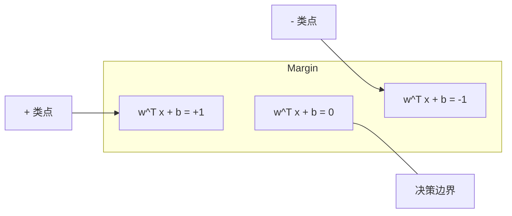
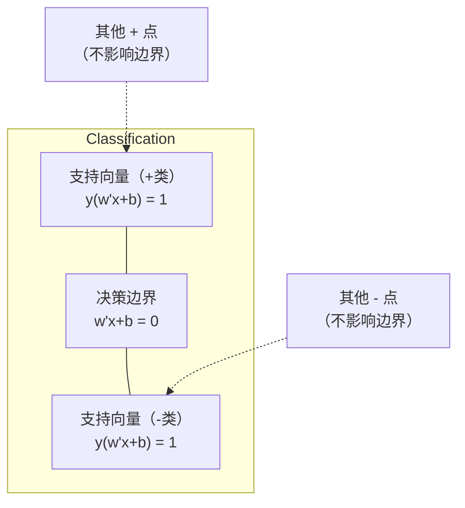
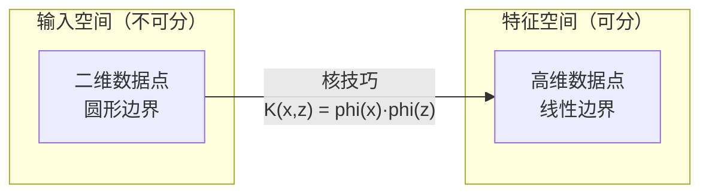

# 支持向量机（Support Vector Machines）

> 找到两个类别之间最宽的街道。这就是整个思想。

**类型：** 构建  
**语言：** Python  
**先决条件：** 第一阶段（课程 08 优化，14 范数和距离，18 凸优化）  
**时间：** ~90 分钟

## 学习目标

- 从零实现线性支持向量机（SVM），使用铰链损失（hinge loss）和对原始问题的梯度下降（gradient descent）
- 解释最大间隔（maximum margin）原则并从训练模型中识别支持向量（support vectors）
- 比较线性、多项式和 RBF 核函数（kernel），解释核技巧（kernel trick）如何避免显式的高维映射
- 评估 C 参数控制的间隔宽度与分类错误之间的权衡

## 问题描述

你有两个类别的数据点，需要画一条线（或超平面）将它们分开。有无数条线都行，应该选哪一条？

选最大间隔的那一条。间隔是决策边界到任一侧最近数据点的距离。间隔越宽，分类器确信度越高，对未见数据的泛化能力越好。

这一直觉催生了支持向量机，机器学习中最数学优雅的算法之一。SVM 在深度学习兴起前是主流分类方法，至今仍是小数据集、高维数据及需要有理论保证的原则性模型的最佳选择。

SVM 直接关联第一阶段内容：优化是凸优化（课程 18），间隔用范数衡量（课程 14），核技巧利用点积处理非线性边界而无需在高维空间中计算。

## 概念

### 最大间隔分类器（maximum margin classifier）

给定线性可分的数据，标签 y_i 属于 { -1, +1 }，特征向量为 x_i，目标是求解超平面 w^T x + b = 0 来分隔两类。

点 x_i 到超平面的距离为：

```text
distance = |w^T x_i + b| / ||w||
```

对于正确分类的点：y_i * (w^T x_i + b) > 0。间隔是超平面到任一侧最近点距离的两倍。



优化问题：

```text
maximize    2 / ||w||     (间隔宽度)
subject to  y_i * (w^T x_i + b) >= 1  对所有 i
```

等价于（因为最小化 ||w||^2 更易优化）：

```text
minimize    (1/2) ||w||^2
subject to  y_i * (w^T x_i + b) >= 1  对所有 i
```

这是一个凸二次规划问题。唯一全局解。恰好位于边界上（y_i * (w^T x_i + b) = 1）的数据点称为支持向量（support vectors），只有它们决定决策边界。移动或删除非支持向量点，边界不变。

### 支持向量：关键少数



大多数训练点无关紧要，仅支持向量重要。这也使得 SVM 在预测时内存高效：只需存储支持向量，不必存储全部训练集。

支持向量数量也为泛化误差提供界限。相对数据集而言，支持向量越少泛化能力越好。

### 软间隔：通过参数 C 处理噪声

实际数据很少完全可分。有些点可能在错误侧或间隔内部。软间隔通过引入松弛变量允许违规。

```text
minimize    (1/2) ||w||^2 + C * sum(xi_i)
subject to  y_i * (w^T x_i + b) >= 1 - xi_i
            xi_i >= 0  对所有 i
```

松弛变量 xi_i 测量点 i 违反间隔的程度。C 控制权衡：

| C 值 | 行为 |
|-------|-------|
| 大 C  | 严重惩罚违规。间隔窄，误分类少，容易过拟合 |
| 小 C  | 容忍更多违规。间隔宽，误分类多，容易欠拟合 |

C 是正则化强度的倒数。大 C = 正则化弱。小 C = 正则化强。

### 铰链损失：SVM 损失函数

软间隔 SVM 可重写为无约束优化：

```text
minimize    (1/2) ||w||^2 + C * sum(max(0, 1 - y_i * (w^T x_i + b)))
```

max(0, 1 - y_i * f(x_i)) 项就是铰链损失。当点正确分类且超出间隔时为零；当点位于间隔内或被错误分类时为线性。

```text
单点铰链损失：

loss
  |
  | \
  |  \
  |   \
  |    \
  |     \_______________
  |
  +-----|-----|-------->  y * f(x)
       0     1

当 y*f(x) >= 1（正确分类，超出间隔）时损失为零。
当 y*f(x) < 1 时线性处罚。
```

与逻辑损失（逻辑回归）对比：

```text
铰链：     max(0, 1 - y*f(x))           在间隔处有硬切断
逻辑回归： log(1 + exp(-y*f(x)))        平滑且永不为零
```

铰链损失产生稀疏解（只有支持向量有非零贡献），逻辑损失利用全部数据点。使得 SVM 预测时更节省内存。

### 用梯度下降训练线性 SVM

可以对铰链损失加 L2 正则用梯度下降训练线性 SVM，无需求解约束 QP：

```text
L(w, b) = (lambda/2) * ||w||^2 + (1/n) * sum(max(0, 1 - y_i * (w^T x_i + b)))

w 的梯度：
  若 y_i * (w^T x_i + b) >= 1:  dL/dw = lambda * w
  若 y_i * (w^T x_i + b) < 1:   dL/dw = lambda * w - y_i * x_i

b 的梯度：
  若 y_i * (w^T x_i + b) >= 1:  dL/db = 0
  若 y_i * (w^T x_i + b) < 1:   dL/db = -y_i
```

这称为原始问题。每轮迭代运行时间为 O(n * d)，n 是样本数，d 是特征数。对于大规模稀疏高维数据（如文本分类）很快。

### 对偶问题与核技巧（kernel trick）

SVM 问题的拉格朗日对偶（来自第一阶段课程 18，KKT 条件）：

```text
maximize    sum(alpha_i) - (1/2) * sum_ij(alpha_i * alpha_j * y_i * y_j * (x_i · x_j))
subject to  0 <= alpha_i <= C
            sum(alpha_i * y_i) = 0
```

对偶问题仅涉及点积 x_i · x_j。其中的关键见解：用核函数 K(x_i, x_j) 替代每个点积，SVM 能不显式映射到高维空间就学习非线性边界。

```text
线性核：      K(x, z) = x · z
多项式核：    K(x, z) = (x · z + c)^d
RBF（高斯核）：K(x, z) = exp(-gamma * ||x - z||^2)
```

RBF 核映射到无限维空间。输入空间距离近的点对应核值近似 1，距离远的核值接近 0。能学习任意平滑决策边界。



核技巧在高维空间计算点积但不显式去该空间。如多项式核次数为 d，输入维度 D，显式空间维度为 O(D^d)，而计算 K(x, z) 时间仅为 O(D)。

### 支持向量回归（SVR）

支持向量回归拟合一个宽度为 ε 的管道，管道内部点损失为零，管道外点则线性惩罚。

```text
minimize    (1/2) ||w||^2 + C * sum(xi_i + xi_i*)
subject to  y_i - (w^T x_i + b) <= epsilon + xi_i
            (w^T x_i + b) - y_i <= epsilon + xi_i*
            xi_i, xi_i* >= 0
```

ε 控制管道宽度。宽管道 = 支持向量更少 = 拟合更平滑。窄管道 = 支持向量更多 = 拟合更紧密。

### 为什么 SVM 输给了深度学习（及何时仍获胜）

SVM 在 1990 年代晚期到 2010 年代初主导机器学习。之后深度学习超越，原因包括：

| 因素 | SVM | 深度学习 |
|------|------|----------|
| 特征工程 | 需要 | 自动学习特征 |
| 可扩展性 | 核方法为 O(n²) 到 O(n³) | 用 SGD 为 O(n) 每轮 |
| 图像/文本/音频 | 需手工特征 | 可从原始数据学习 |
| 大数据集（> 10 万） | 慢 | 可良好扩展 |
| GPU 加速 | 效果有限 | 巨大加速 |

SVM 仍适合以下情况：
- 小数据集（数百到几千样本）
- 高维稀疏数据（如 TF-IDF 词特征文本）
- 需数学保障（间隔界限）
- 训练时间要求极短（线性 SVM 快速）
- 二分类且边界清晰
- 异常检测（一类 SVM）

## 构建部分

### 第一步：铰链损失和梯度计算

基础。计算一批数据的铰链损失及其梯度。

```python
def hinge_loss(X, y, w, b):
    n = len(X)
    total_loss = 0.0
    for i in range(n):
        margin = y[i] * (dot(w, X[i]) + b)
        total_loss += max(0.0, 1.0 - margin)
    return total_loss / n
```

### 第二步：通过梯度下降训练线性 SVM

训练时最小化带正则的铰链损失。无需 QP 求解器。

```python
class LinearSVM:
    def __init__(self, lr=0.001, lambda_param=0.01, n_epochs=1000):
        self.lr = lr
        self.lambda_param = lambda_param
        self.n_epochs = n_epochs
        self.w = None
        self.b = 0.0

    def fit(self, X, y):
        n_features = len(X[0])
        self.w = [0.0] * n_features
        self.b = 0.0

        for epoch in range(self.n_epochs):
            for i in range(len(X)):
                margin = y[i] * (dot(self.w, X[i]) + self.b)
                if margin >= 1:
                    self.w = [wj - self.lr * self.lambda_param * wj
                              for wj in self.w]
                else:
                    self.w = [wj - self.lr * (self.lambda_param * wj - y[i] * X[i][j])
                              for j, wj in enumerate(self.w)]
                    self.b -= self.lr * (-y[i])

    def predict(self, X):
        return [1 if dot(self.w, x) + self.b >= 0 else -1 for x in X]
```

### 第三步：核函数实现

实现线性、多项式和 RBF 核函数。

```python
def linear_kernel(x, z):
    return dot(x, z)

def polynomial_kernel(x, z, degree=3, c=1.0):
    return (dot(x, z) + c) ** degree

def rbf_kernel(x, z, gamma=0.5):
    diff = [xi - zi for xi, zi in zip(x, z)]
    return math.exp(-gamma * dot(diff, diff))
```

### 第四步：间隔和支持向量识别

训练完成后，识别哪些点是支持向量，并计算间隔宽度。

```python
def find_support_vectors(X, y, w, b, tol=1e-3):
    support_vectors = []
    for i in range(len(X)):
        margin = y[i] * (dot(w, X[i]) + b)
        if abs(margin - 1.0) < tol:
            support_vectors.append(i)
    return support_vectors
```

完整实现和所有演示见 `code/svm.py`。

## 使用方法

使用 scikit-learn：

```python
from sklearn.svm import SVC, LinearSVC, SVR
from sklearn.preprocessing import StandardScaler
from sklearn.pipeline import Pipeline

clf = Pipeline([
    ("scaler", StandardScaler()),
    ("svm", SVC(kernel="rbf", C=1.0, gamma="scale")),
])
clf.fit(X_train, y_train)
print(f"Accuracy: {clf.score(X_test, y_test):.4f}")
print(f"Support vectors: {clf['svm'].n_support_}")
```

重要：训练 SVM 前务必对特征进行缩放。SVM 对特征大小敏感，因为间隔依赖于 ||w||，未缩放的特征会扭曲几何结构。

对于大数据集，使用 `LinearSVC`（原始形式，单次迭代时间复杂度 O(n)）代替 `SVC`（对偶形式，时间复杂度介于 O(n^2) 到 O(n^3)）：

```python
from sklearn.svm import LinearSVC

clf = Pipeline([
    ("scaler", StandardScaler()),
    ("svm", LinearSVC(C=1.0, max_iter=10000)),
])
```

## 练习

1. 生成一个二维线性可分数据集。训练你的 LinearSVM 并识别支持向量。验证这些支持向量是最接近决策边界的点。

2. 在带噪声的数据集上，将 C 从 0.001 变到 1000。绘制每个 C 值对应的决策边界。观察从宽间隔（欠拟合）到窄间隔（过拟合）的变化。

3. 创建一个类别边界为圆形（非线性）的数据集。证明线性 SVM 失效。计算 RBF 核矩阵，展示在核空间中类别变得可分。

4. 比较 hinge loss（合页损失）和 logistic loss（逻辑回归损失）在同一数据集上的表现。训练线性 SVM 和逻辑回归。统计每个模型决策边界中起作用的训练点数量（支持向量与所有点）。

5. 实现 SVR（epsilon-不敏感损失）。拟合函数 y = sin(x) + 噪声。绘制预测周围的 epsilon 管道，标记支持向量（管道外的点）。

## 关键词

| 关键词 | 含义 |
|------|----------------------|
| Support vectors（支持向量） | 最接近决策边界的训练点。唯一决定超平面的点 |
| Margin（间隔） | 决策边界与最近支持向量之间的距离。SVM 最大化此距离 |
| Hinge loss（合页损失） | max(0, 1 - y*f(x))。正确分类且在间隔外为零损失；否则线性惩罚 |
| C parameter（参数 C） | 间隔宽度与分类错误之间的权衡。大 C = 窄间隔，小 C = 宽间隔 |
| Soft margin（软间隔） | 允许通过松弛变量违反间隔的 SVM 形式。处理不可分数据 |
| Kernel trick（核技巧） | 在高维特征空间计算点积，无需显式映射到该空间 |
| Linear kernel（线性核） | K(x, z) = x . z。等价于标准点积。适用线性可分数据 |
| RBF kernel（径向基函数核） | K(x, z) = exp(-gamma * \|\|x-z\|\|^2)。映射到无限维。能学习任意平滑边界 |
| Polynomial kernel（多项式核） | K(x, z) = (x . z + c)^d。映射到多项式特征空间 |
| Dual formulation（对偶形式） | 仅依赖数据点之间点积的 SVM 重构形式。支持核方法 |
| SVR（支持向量回归） | 在数据周围拟合 epsilon 管道。管道内点无损失 |
| Slack variables（松弛变量） | xi_i：衡量点违反间隔的程度。正确分类且在间隔外为零 |
| Maximum margin（最大间隔） | 选择最大化最近点距离的超平面原则 |

## 拓展阅读

- [Vapnik: The Nature of Statistical Learning Theory (1995)](https://link.springer.com/book/10.1007/978-1-4757-3264-1) - SVM 与统计学习的基础性著作
- [Cortes & Vapnik: Support-vector networks (1995)](https://link.springer.com/article/10.1007/BF00994018) - 原始 SVM 论文
- [Platt: Sequential Minimal Optimization (1998)](https://www.microsoft.com/en-us/research/publication/sequential-minimal-optimization-a-fast-algorithm-for-training-support-vector-machines/) - 使 SVM 训练实用的 SMO 算法
- [scikit-learn SVM documentation](https://scikit-learn.org/stable/modules/svm.html) - 实用指南和实现细节
- [LIBSVM: A Library for Support Vector Machines](https://www.csie.ntu.edu.tw/~cjlin/libsvm/) - 大多数 SVM 实现背后的 C++ 库
