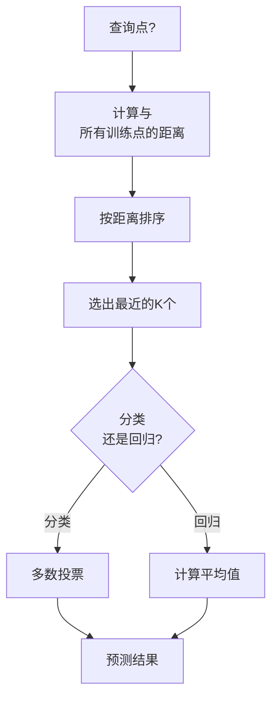
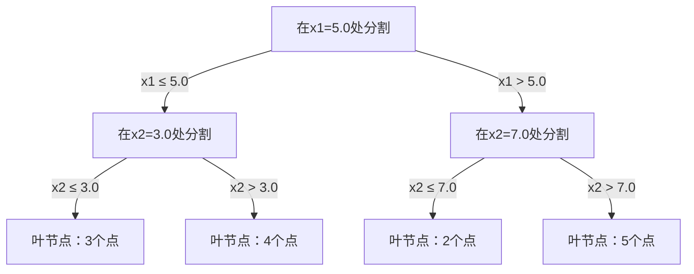

# K-最近邻（K-Nearest Neighbors）与距离

> 存储所有数据。通过观察邻居进行预测。最简单且有效的算法。

**类型:** 实践构建  
**语言:** Python  
**前提:** 第一阶段（第14课 范数和距离）  
**时间:** 约90分钟

## 学习目标

- 从零实现KNN分类和回归，支持可配置的K值和距离加权投票  
- 比较L1, L2, 余弦和Minkowski距离度量，并为给定数据类型选择合适的度量  
- 解释维度灾难并演示KNN在高维空间中性能下降的原因  
- 构建KD树实现高效的最近邻搜索，分析其何时优于暴力搜索  

## 问题描述

你有一个数据集。来了一个新数据点。你需要对它进行分类或预测其值。与线性回归或支持向量机（SVM）等基于参数学习的方法不同，KNN只是找距离新点最近的K个训练点，并让它们投票决定。

这就是K-最近邻算法。没有训练阶段。没有参数要学习。没有损失函数要最小化。你存储整个训练集，预测时计算距离。

听起来太简单了，似乎不可能有效。但KNN在许多问题上表现出乎意料的竞争力，尤其适用于小到中等规模数据集。深入理解KNN可以揭示基本概念：距离度量的选择（关联第一阶段第14课）、维度灾难，以及惰性学习与积极学习的区别。

KNN在现代AI中无处不在，只是名字不同。向量数据库做嵌入上的KNN搜索。基于检索增强生成（RAG）找到K个最近的文档块。推荐系统找到相似用户或物品。算法相同，规模和数据结构不同。

## 概念介绍

### KNN工作原理

给定带标签的数据点和一个新查询点：

1. 计算查询点到数据集中每个点的距离  
2. 按距离排序  
3. 取距离最近的K个点  
4. 对分类：对K个邻居进行多数投票  
5. 对回归：计算K个邻居值的平均（或加权平均）



这就是整个算法。无拟合。无梯度下降。无迭代周期。

### 选择K值

K是唯一的超参数。它控制偏差-方差权衡：

| K值       | 行为                                             |
|----------|------------------------------------------------|
| K = 1    | 决策边界紧随每个点。训练误差为零。方差大。过拟合     |
| 小K（3-5） | 对局部结构敏感。能捕获复杂边界                        |
| 大K       | 边界更平滑。对噪声更鲁棒。可能欠拟合                 |
| K = N    | 对所有点预测多数类别。最大偏差                       |

常见做法是K取样本数N的平方根。对于二分类，用奇数K避免投票平局。


### 距离度量

距离函数定义了“近”的意义。不同距离度量会产生不同邻居，从而导致不同预测。

**L2距离（欧氏距离）** 是默认选项。直线距离。

```text
d(a, b) = sqrt(sum((a_i - b_i)^2))
```

对特征尺度敏感。使用L2距离前务必标准化特征。

**L1距离（曼哈顿距离）** 是绝对差值的和。比L2更鲁棒，对异常值不那么敏感，因为没有平方操作。

```text
d(a, b) = sum(|a_i - b_i|)
```

**余弦距离** 测量向量间的夹角，忽略大小。对文本和嵌入数据极其重要。

```text
d(a, b) = 1 - (a · b) / (||a|| * ||b||)
```

**Minkowski距离** 是L1和L2的泛化，带参数p。

```text
d(a, b) = (sum(|a_i - b_i|^p))^(1/p)

p=1: 曼哈顿距离
p=2: 欧氏距离
p->∞: 切比雪夫距离（最大绝对差值）
```

使用哪个度量视情况而定：

| 数据类型           | 最佳度量            | 原因                            |
|-----------------|-------------------|-------------------------------|
| 数值特征，尺度相近     | L2（欧氏距离）        | 默认，适用于空间数据                    |
| 数值特征，有异常值      | L1（曼哈顿距离）       | 鲁棒，不放大大差异                  |
| 文本嵌入              | 余弦距离             | 大小是噪声，方向才是语义                 |
| 高维稀疏数据           | 余弦或L1            | L2受维度灾难影响                   |
| 混合类型              | 自定义距离            | 根据特征类型组合距离度量                |

### 加权KNN

标准KNN对所有K个邻居赋予相等权重。但距离0.1的邻居显然比距离5.0的重要。

**距离加权KNN** 按距离倒数加权邻居：

```text
weight_i = 1 / (distance_i + epsilon)

分类：加权投票
回归：加权平均 = sum(w_i * y_i) / sum(w_i)
```

epsilon用于防止查询点正好等于某训练点时除零。

加权KNN对K值选择不那么敏感，因为远邻权重很小。

### 维度灾难

KNN在高维空间中表现下降，这不是猜测，而是数学事实。

**问题1：距离趋同。** 维度越高，最大距离与最小距离之比越接近1，所有点距离几乎一样远。

```text
在d维均匀随机点中：

d=2:    max_dist / min_dist 变化明显
d=100:  max_dist / min_dist ≈ 1.01
d=1000: max_dist / min_dist ≈ 1.001

距离几乎相等时，“最近邻”无意义。
```

**问题2：体积爆炸。** 为涵盖K个邻居，搜索半径必须扩大到覆盖特征空间的绝大部分。高维的“邻域”几乎是整个空间。

**问题3：角落占优。** 在d维单位超立方体中，大部分体积集中在角落，球体占的体积随维度增长趋近于零。

实际影响：KNN适合20-50维以下特征。更高维需先降维（PCA、UMAP、t-SNE），或者用基于树的搜索结构利用数据固有的低维结构。

### KD树：快速最近邻搜索

暴力KNN对每个查询计算到所有训练点的距离，复杂度为O(n * d)。大数据集时太慢。

KD树沿特征轴递归划分空间，每层在某个维度的中位数处分割。



寻找最近邻时，从根遍历到包含查询的叶节点，然后回溯，检查可能包含更近邻的邻区。

平均查询时间：低维情况下O(log n)。但维度大于20时，回溯分支减少，KD树退化为O(n)。

### 球树：更适合中等维度

球树用嵌套超球体分割数据代替轴平行的盒子。每个节点定义一个包含该子树所有点的球（中心+半径）。

优于KD树的地方：
- 适中维度（到约50维）表现更好  
- 能处理非轴对齐结构  
- 更紧致的边界体积意味着查询时能剪枝更多分支

KD树和球树都是精确算法。百万级点、数百维度时，采用近似最近邻方法（如HNSW、IVF、乘积量化），这在第一阶段第14课介绍。

### 惰性学习 vs 积极学习

KNN是惰性学习器：训练时不做计算，预测时才计算。大多数其他算法（线性回归、SVM、神经网络）是积极学习器：训练时做大量计算生成模型，预测快。

| 方面       | 惰性（KNN）           | 积极（SVM、神经网络）         |
|----------|--------------------|----------------------------|
| 训练时间    | O(1)，仅存储数据          | O(n * 迭代次数)                 |
| 预测时间    | O(n * d) 每查询          | O(d) 或 O(参数数量)            |
| 预测时内存   | 存储全量训练集           | 仅存储模型参数                 |
| 适应新数据   | 即时新增数据点           | 需重新训练模型                 |
| 决策边界    | 隐式，实时计算           | 明确，训练后固定               |

惰性学习适合：
- 数据集频繁变化（新增/删除点，无需重训）  
- 查询次数极少  
- 需要零训练时间  
- 数据集小到暴力搜索足够快

### KNN回归

KNN回归不是多数投票，而是将K个邻居的目标值求平均。

```text
预测值 = (1/K) * sum(最近K个邻居的y_i)

或加权时：
预测值 = sum(w_i * y_i) / sum(w_i)
其中 w_i = 1 / distance_i
```

KNN回归产生分段常值（或加权时分段平滑）预测，不能外推训练数据范围外的值。若训练目标在0到100之间，KNN不会预测200。

## 实现步骤

### 第一步：距离函数

实现L1, L2, 余弦和Minkowski距离，衔接第一阶段第14课内容。

```python
import math

def l2_distance(a, b):
    return math.sqrt(sum((ai - bi) ** 2 for ai, bi in zip(a, b)))

def l1_distance(a, b):
    return sum(abs(ai - bi) for ai, bi in zip(a, b))

def cosine_distance(a, b):
    dot_val = sum(ai * bi for ai, bi in zip(a, b))
    norm_a = math.sqrt(sum(ai ** 2 for ai in a))
    norm_b = math.sqrt(sum(bi ** 2 for bi in b))
    if norm_a == 0 or norm_b == 0:
        return 1.0
    return 1.0 - dot_val / (norm_a * norm_b)

def minkowski_distance(a, b, p=2):
    if p == float('inf'):
        return max(abs(ai - bi) for ai, bi in zip(a, b))
    return sum(abs(ai - bi) ** p for ai, bi in zip(a, b)) ** (1 / p)
```

### 第二步：KNN分类器和回归器

构建完整KNN，支持配置K值、距离函数和可选的距离加权。

```python
class KNN:
    def __init__(self, k=5, distance_fn=l2_distance, weighted=False,
                 task="classification"):
        self.k = k
        self.distance_fn = distance_fn
        self.weighted = weighted
        self.task = task
        self.X_train = None
        self.y_train = None

    def fit(self, X, y):
        self.X_train = X
        self.y_train = y

    def predict(self, X):
        return [self._predict_one(x) for x in X]
```

### 第3步：用于高效搜索的KD树（KD-tree）

从头构建一个KD树，该树递归地在每个维度的中位数处分割。

```python
class KDTree:
    def __init__(self, X, indices=None, depth=0):
        # 递归分区数据
        self.axis = depth % len(X[0])
        # 在当前轴的中位数处分割
        ...

    def query(self, point, k=1):
        # 遍历到叶节点，然后回溯
        ...
```

完整实现及所有辅助方法和演示请参见 `code/knn.py`。

### 第4步：特征缩放（Feature scaling）

KNN需要特征缩放，因为距离对特征量纲敏感。范围从0到1000的特征会主导范围从0到1的特征。

```python
def standardize(X):
    n = len(X)
    d = len(X[0])
    means = [sum(X[i][j] for i in range(n)) / n for j in range(d)]
    stds = [
        max(1e-10, (sum((X[i][j] - means[j]) ** 2 for i in range(n)) / n) ** 0.5)
        for j in range(d)
    ]
    return [[((X[i][j] - means[j]) / stds[j]) for j in range(d)] for i in range(n)], means, stds
```

## 使用方法

使用 scikit-learn：

```python
from sklearn.neighbors import KNeighborsClassifier
from sklearn.preprocessing import StandardScaler
from sklearn.pipeline import Pipeline

clf = Pipeline([
    ("scaler", StandardScaler()),
    ("knn", KNeighborsClassifier(n_neighbors=5, metric="euclidean")),
])
clf.fit(X_train, y_train)
print(f"准确率: {clf.score(X_test, y_test):.4f}")
```

当数据集足够大且维度足够低时，scikit-learn会自动使用KD树或球树（ball tree）。对于高维数据，则回退到暴力搜索。你可以通过 `algorithm` 参数控制这一行为。

对于大规模最近邻搜索（百万级向量），请使用FAISS、Annoy或向量数据库：

```python
import faiss

index = faiss.IndexFlatL2(dimension)
index.add(embeddings)
distances, indices = index.search(query_vectors, k=5)
```

## 练习

1. 在一个具有3个类别的二维数据集上实现KNN分类。绘制K=1、K=5、K=15和K=N时的决策边界。观察从过拟合到欠拟合的转变。

2. 生成维度为2、5、10、50、100和500的1000个随机点。对于每个维度，计算最大成对距离与最小成对距离的比值。绘制比值对维度的曲线，以可视化维度灾难。

3. 在文本分类问题（使用TF-IDF向量）上比较L1、L2和余弦距离的KNN表现。哪种度量获得了最佳准确率？为什么余弦距离在文本处理中往往表现更好？

4. 实现KD树，并测量在二维、10维和50维，分别为1千、1万和10万点的数据集上的查询时间和暴力搜索的时间。KD树在多少维数下不再比暴力搜索更快？

5. 构建一个加权KNN回归模型用于拟合y = sin(x) + 噪声。对比K=3、10、30时加权和非加权KNN。展示加权方法尤其在较大K时能产生更平滑的预测。

## 关键词

| 术语 | 实际含义 |
|------|----------|
| K-nearest neighbors | 一种非参数算法，通过找到查询点的K个最近训练点进行预测 |
| Lazy learning（惰性学习） | 训练时无计算，所有工作在预测时完成。KNN是典型示例 |
| Eager learning（主动学习） | 训练时进行大量计算以构建紧凑模型，大多数机器学习算法属于此类 |
| Curse of dimensionality（维度灾难） | 在高维空间中，距离趋于一致，邻域扩大覆盖大部分空间，使KNN无效 |
| KD-tree | 按特征轴递归划分空间的二叉树。低维下查询为O(log n) |
| Ball tree（球树） | 嵌套超球的树结构。中等维度（约50维内）通常优于KD树 |
| Weighted KNN | 邻居权重反比于距离。距离近的邻居对预测影响更大 |
| Feature scaling（特征缩放） | 规范化特征到相似范围。距离方法如KNN必需 |
| Majority vote（多数投票） | 通过统计K邻居中出现最多的类别进行分类 |
| Brute force search（暴力搜索） | 对每个训练点计算距离。每次查询耗时O(n*d)。准确但对大数据慢 |
| Approximate nearest neighbor（近似最近邻） | 使用HNSW、LSH、IVF等算法，快速找到近似的最近点，速度远超精确搜索 |
| Voronoi diagram（Voronoi图） | 空间划分，每一区域内的点比其他区域更近某个训练点。K=1的KNN产生Voronoi边界 |

## 进一步阅读

- [Cover & Hart: Nearest Neighbor Pattern Classification (1967)](https://ieeexplore.ieee.org/document/1053964) - 基础KNN论文，证明其误差率最多为贝叶斯最优的两倍
- [Friedman, Bentley, Finkel: An Algorithm for Finding Best Matches in Logarithmic Expected Time (1977)](https://dl.acm.org/doi/10.1145/355744.355745) - KD树开创性论文
- [Beyer et al.: When Is "Nearest Neighbor" Meaningful? (1999)](https://link.springer.com/chapter/10.1007/3-540-49257-7_15) - 对最近邻维度灾难的正式分析
- [scikit-learn Nearest Neighbors documentation](https://scikit-learn.org/stable/modules/neighbors.html) - 实用指南，含算法选择
- [FAISS: A Library for Efficient Similarity Search](https://github.com/facebookresearch/faiss) - Meta的数十亿级近似最近邻高效搜索库
