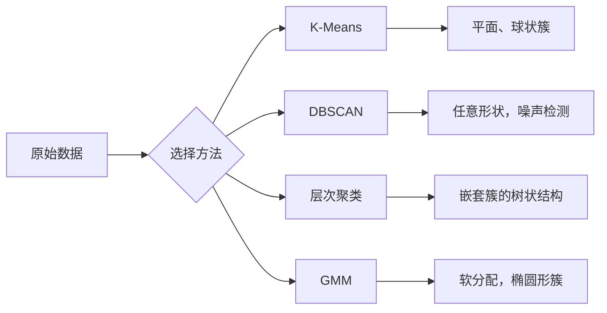

# 无监督学习

> 无标签，无教师。算法自行发现结构。

**类型：** 构建  
**语言：** Python  
**先决条件：** 第1阶段（范数与距离、概率与分布），第2阶段第1-6课  
**时长：** 约90分钟

## 学习目标

- 从零实现 K-Means、DBSCAN 和高斯混合模型（Gaussian Mixture Models）并比较其聚类行为  
- 使用轮廓系数（silhouette score）和肘部法则（elbow method）评估聚类质量并选择最优的 K  
- 解释 DBSCAN 何时优于 K-Means，确认哪种算法能处理非球状簇和异常点  
- 使用聚类方法构建异常检测流水线，标记偏离正常模式的点

## 问题背景

迄今为止，每堂机器学习（ML）课都假设有标签数据：“这是输入，这里是正确输出。”现实世界中，标签成本很高。医院有数百万病人记录，但无人手动给每条记录标注疾病分类。电商网站有数百万用户会话，但没人手工标记客户群。安全团队有网络日志，却没有人标注所有异常。

无监督学习在没有提示寻找什么的情况下发现模式。它将相似数据点分组，发现隐藏结构，揭示异常。若监督学习是带答案的教科书学习，无监督学习则是盯着原始数据直到模式浮现。

难点是：无标签，无法直接衡量“对”或“错”。你需要不同工具来评估算法发现的结构是否有意义。

## 概念

### 聚类：将相似事物归为一组

聚类将每个数据点分配到一个组（簇），使组内点彼此更相似，而与其他组的点差异更大。关键问题是：“相似”指的是什么？



### K-Means：主力方法

K-Means 将数据划分为恰好 K 个簇。每个簇有一个质心（质点中心），每个点归属最近的质心。

Lloyd 算法：

1. 随机选取 K 个点作为初始质心  
2. 将每个数据点分配到最近的质心  
3. 重新计算每个簇的质心为簇内点的均值  
4. 重复第2-3步直到分配不再改变

目标函数（惯性）度量每点到其质心的平方距离总和。K-Means 尽量最小化惯性，但只保证局部最优，不同初始化可能导致不同结果。

### 选择 K

两种常见方法：

**肘部法则（Elbow method）：** 对 K=1,2,3,...,n 运行 K-Means，绘制惯性随 K 变化曲线。寻找“肘部”——在此之后惯性减少不明显。

**轮廓系数（Silhouette score）：** 对每点衡量它与自身簇内点的相似度 a 和最近其他簇的相似度 b。轮廓系数计算为 (b - a) / max(a, b)，范围从 -1（错误簇）到 +1（良好聚类）。所有点轮廓系数的均值即整体评分。

### DBSCAN：基于密度的聚类

K-Means 假设簇呈球形且需提前指定 K。DBSCAN 不做此假设。它通过密集区域划分簇，稀疏区间隔开各簇。

两参数：  
- **eps**：邻域半径  
- **min_samples**：形成密集区域的最小点数

三种点类别：  
- **核心点**：eps 邻域内至少有 min_samples 个点  
- **边界点**：距离某核心点 eps 内但自身不是核心点  
- **噪声点**：既不是核心点也不是边界点，异常点

DBSCAN 将相互距离小于 eps 的核心点连成簇。边界点加入附近核心点所在簇。噪声点不归任何簇。

优点：能发现任意形状簇，自动确定簇数，识别异常。缺点：对密度变化大的簇效果差。

### 层次聚类

构造一个嵌套簇的树状图（树状图）。

自底向上聚合：  
1. 每个点单独成簇  
2. 合并最近的两个簇  
3. 重复直到只剩一个簇  
4. 在所需层次剪断树状图，得到 K 个簇

簇间“距离”可用：  
- **单链接**：两簇间任意两点的最小距离  
- **全链接**：两簇间任意两点的最大距离  
- **平均链接**：所有点对距离的平均值  
- **Ward 方法**：合并使簇内总方差增加最小

### 高斯混合模型（GMM）

K-Means 提供硬分配：每点只能属于一个簇。GMM 提供软分配：每点属于各簇的概率。

GMM 假设数据是由 K 个高斯分布混合生成，每个高斯分布有自己的均值和协方差。EM 算法迭代执行：

- **E 步骤：** 计算每点属于每个高斯的概率  
- **M 步骤：** 更新均值、协方差和混合权重以最大化数据似然

GMM 可建模椭圆簇（不像 K-Means 只能建模球形），自然处理簇重叠。

### 何时用哪种方法

| 方法          | 适用场景                     | 避免场景                       |
|---------------|------------------------------|--------------------------------|
| K-Means       | 大规模数据，球形簇，已知 K     | 不规则形状，有异常点           |
| DBSCAN        | 未知 K，任意形状，异常检测     | 密度变化大，极高维度           |
| 层次聚类       | 小规模数据，需要树状图，未知 K  | 大数据（内存 O(n²)）           |
| GMM           | 簇重叠，需要软分配             | 极大数据，维数过多             |

### 使用聚类进行异常检测

聚类自然支持异常检测：  
- **K-Means：** 远离任何质心的点是异常  
- **DBSCAN：** 噪声点本质即异常  
- **GMM：** 在所有高斯分布下概率都低的点是异常

## 实践构建

### 第1步：从零实现 K-Means

```python
import math
import random


def euclidean_distance(a, b):
    return math.sqrt(sum((ai - bi) ** 2 for ai, bi in zip(a, b)))


def kmeans(data, k, max_iterations=100, seed=42):
    random.seed(seed)
    n_features = len(data[0])

    centroids = random.sample(data, k)

    for iteration in range(max_iterations):
        clusters = [[] for _ in range(k)]
        assignments = []

        for point in data:
            distances = [euclidean_distance(point, c) for c in centroids]
            nearest = distances.index(min(distances))
            clusters[nearest].append(point)
            assignments.append(nearest)

        new_centroids = []
        for cluster in clusters:
            if len(cluster) == 0:
                new_centroids.append(random.choice(data))
                continue
            centroid = [
                sum(point[j] for point in cluster) / len(cluster)
                for j in range(n_features)
            ]
            new_centroids.append(centroid)

        if all(
            euclidean_distance(old, new) < 1e-6
            for old, new in zip(centroids, new_centroids)
        ):
            print(f"  在第 {iteration + 1} 次迭代时收敛")
            break

        centroids = new_centroids

    return assignments, centroids
```

### 第2步：肘部法则与轮廓系数

```python
def compute_inertia(data, assignments, centroids):
    total = 0.0
    for point, cluster_id in zip(data, assignments):
        total += euclidean_distance(point, centroids[cluster_id]) ** 2
    return total


def silhouette_score(data, assignments):
    n = len(data)
    if n < 2:
        return 0.0

    clusters = {}
    for i, c in enumerate(assignments):
        clusters.setdefault(c, []).append(i)

    if len(clusters) < 2:
        return 0.0

    scores = []
    for i in range(n):
        own_cluster = assignments[i]
        own_members = [j for j in clusters[own_cluster] if j != i]

        if len(own_members) == 0:
            scores.append(0.0)
            continue

        a = sum(euclidean_distance(data[i], data[j]) for j in own_members) / len(own_members)

        b = float("inf")
        for cluster_id, members in clusters.items():
            if cluster_id == own_cluster:
                continue
            avg_dist = sum(euclidean_distance(data[i], data[j]) for j in members) / len(members)
            b = min(b, avg_dist)

        if max(a, b) == 0:
            scores.append(0.0)
        else:
            scores.append((b - a) / max(a, b))

    return sum(scores) / len(scores)


def find_best_k(data, max_k=10):
    print("肘部法则：")
    inertias = []
    for k in range(1, max_k + 1):
        assignments, centroids = kmeans(data, k)
        inertia = compute_inertia(data, assignments, centroids)
        inertias.append(inertia)
        print(f"  K={k}: 惯性={inertia:.2f}")

    print("\n轮廓系数：")
    for k in range(2, max_k + 1):
        assignments, centroids = kmeans(data, k)
        score = silhouette_score(data, assignments)
        print(f"  K={k}: 轮廓系数={score:.4f}")

    return inertias
```

### 第3步：从零实现 DBSCAN

```python
def dbscan(data, eps, min_samples):
    n = len(data)
    labels = [-1] * n
    cluster_id = 0

    def region_query(point_idx):
        neighbors = []
        for i in range(n):
            if euclidean_distance(data[point_idx], data[i]) <= eps:
                neighbors.append(i)
        return neighbors

    visited = [False] * n

    for i in range(n):
        if visited[i]:
            continue
        visited[i] = True

        neighbors = region_query(i)

        if len(neighbors) < min_samples:
            labels[i] = -1
            continue

        labels[i] = cluster_id
        seed_set = list(neighbors)
        seed_set.remove(i)

        j = 0
        while j < len(seed_set):
            q = seed_set[j]

            if not visited[q]:
                visited[q] = True
                q_neighbors = region_query(q)
                if len(q_neighbors) >= min_samples:
                    for nb in q_neighbors:
                        if nb not in seed_set:
                            seed_set.append(nb)

            if labels[q] == -1:
                labels[q] = cluster_id

            j += 1

        cluster_id += 1

    return labels
```

### 第4步：高斯混合模型（EM 算法）

```python
def gmm(data, k, max_iterations=100, seed=42):
    random.seed(seed)
    n = len(data)
    d = len(data[0])

    indices = random.sample(range(n), k)
    means = [list(data[i]) for i in indices]
    variances = [1.0] * k
    weights = [1.0 / k] * k

    def gaussian_pdf(x, mean, variance):
        d = len(x)
        coeff = 1.0 / ((2 * math.pi * variance) ** (d / 2))
        exponent = -sum((xi - mi) ** 2 for xi, mi in zip(x, mean)) / (2 * variance)
        return coeff * math.exp(max(exponent, -500))

    for iteration in range(max_iterations):
        responsibilities = []
        for i in range(n):
            probs = []
            for j in range(k):
                probs.append(weights[j] * gaussian_pdf(data[i], means[j], variances[j]))
            total = sum(probs)
            if total == 0:
                total = 1e-300
            responsibilities.append([p / total for p in probs])

        old_means = [list(m) for m in means]

        for j in range(k):
            r_sum = sum(responsibilities[i][j] for i in range(n))
            if r_sum < 1e-10:
                continue

            weights[j] = r_sum / n

            for dim in range(d):
                means[j][dim] = sum(
                    responsibilities[i][j] * data[i][dim] for i in range(n)
                ) / r_sum

            variances[j] = sum(
                responsibilities[i][j]
                * sum((data[i][dim] - means[j][dim]) ** 2 for dim in range(d))
                for i in range(n)
            ) / (r_sum * d)
            variances[j] = max(variances[j], 1e-6)

        shift = sum(
            euclidean_distance(old_means[j], means[j]) for j in range(k)
        )
        if shift < 1e-6:
            print(f"  GMM 在第 {iteration + 1} 次迭代时收敛")
            break

    assignments = []
    for i in range(n):
        assignments.append(responsibilities[i].index(max(responsibilities[i])))

    return assignments, means, weights, responsibilities
```

### 步骤 5：生成测试数据并运行所有代码

```python
def make_blobs(centers, n_per_cluster=50, spread=0.5, seed=42):
    random.seed(seed)
    data = []
    true_labels = []
    for label, (cx, cy) in enumerate(centers):
        for _ in range(n_per_cluster):
            x = cx + random.gauss(0, spread)
            y = cy + random.gauss(0, spread)
            data.append([x, y])
            true_labels.append(label)
    return data, true_labels


def make_moons(n_samples=200, noise=0.1, seed=42):
    random.seed(seed)
    data = []
    labels = []
    n_half = n_samples // 2
    for i in range(n_half):
        angle = math.pi * i / n_half
        x = math.cos(angle) + random.gauss(0, noise)
        y = math.sin(angle) + random.gauss(0, noise)
        data.append([x, y])
        labels.append(0)
    for i in range(n_half):
        angle = math.pi * i / n_half
        x = 1 - math.cos(angle) + random.gauss(0, noise)
        y = 1 - math.sin(angle) - 0.5 + random.gauss(0, noise)
        data.append([x, y])
        labels.append(1)
    return data, labels


if __name__ == "__main__":
    centers = [[2, 2], [8, 3], [5, 8]]
    data, true_labels = make_blobs(centers, n_per_cluster=50, spread=0.8)

    print("=== 对3个簇应用 K-Means ===")
    assignments, centroids = kmeans(data, k=3)
    print(f"  中心点: {[[round(c, 2) for c in cent] for cent in centroids]}")
    sil = silhouette_score(data, assignments)
    print(f"  轮廓系数（Silhouette score）: {sil:.4f}")

    print("\n=== 肘部法则（Elbow Method） ===")
    find_best_k(data, max_k=6)

    print("\n=== 对3个簇应用 DBSCAN ===")
    db_labels = dbscan(data, eps=1.5, min_samples=5)
    n_clusters = len(set(db_labels) - {-1})
    n_noise = db_labels.count(-1)
    print(f"  找到 {n_clusters} 个簇，{n_noise} 个噪声点")

    print("\n=== 对3个簇应用 GMM ===")
    gmm_assignments, gmm_means, gmm_weights, _ = gmm(data, k=3)
    print(f"  均值: {[[round(m, 2) for m in mean] for mean in gmm_means]}")
    print(f"  权重: {[round(w, 3) for w in gmm_weights]}")
    gmm_sil = silhouette_score(data, gmm_assignments)
    print(f"  轮廓系数（Silhouette score）: {gmm_sil:.4f}")

    print("\n=== 对月牙形数据（非球形簇）应用 DBSCAN ===")
    moon_data, moon_labels = make_moons(n_samples=200, noise=0.1)
    moon_db = dbscan(moon_data, eps=0.3, min_samples=5)
    n_moon_clusters = len(set(moon_db) - {-1})
    n_moon_noise = moon_db.count(-1)
    print(f"  找到 {n_moon_clusters} 个簇，{n_moon_noise} 个噪声点")

    print("\n=== 对月牙形数据应用 K-Means（将无法正确分离） ===")
    moon_km, moon_centroids = kmeans(moon_data, k=2)
    moon_sil = silhouette_score(moon_data, moon_km)
    print(f"  轮廓系数（Silhouette score）: {moon_sil:.4f}")
    print("  K-Means 对月牙形簇分割效果差，因为它们不是球形的")

    print("\n=== 用 DBSCAN 进行异常检测 ===")
    anomaly_data = list(data)
    anomaly_data.append([20.0, 20.0])
    anomaly_data.append([-5.0, -5.0])
    anomaly_data.append([15.0, 0.0])
    anomaly_labels = dbscan(anomaly_data, eps=1.5, min_samples=5)
    anomalies = [
        anomaly_data[i]
        for i in range(len(anomaly_labels))
        if anomaly_labels[i] == -1
    ]
    print(f"  检测出 {len(anomalies)} 个异常点")
    for a in anomalies[-3:]:
        print(f"    点 {[round(v, 2) for v in a]}")
```

## 使用示例

使用 scikit-learn，以上算法均可用一行代码实现：

```python
from sklearn.cluster import KMeans, DBSCAN, AgglomerativeClustering
from sklearn.mixture import GaussianMixture
from sklearn.metrics import silhouette_score as sklearn_silhouette

km = KMeans(n_clusters=3, random_state=42).fit(data)
db = DBSCAN(eps=1.5, min_samples=5).fit(data)
agg = AgglomerativeClustering(n_clusters=3).fit(data)
gmm_model = GaussianMixture(n_components=3, random_state=42).fit(data)
```

自己实现版本能让你完全理解这些库所计算的内容。K-Means 在分配和重新计算之间迭代；DBSCAN 从高密度种子生长簇；GMM 在线性期望和最大化之间交替。库的版本增加了数值稳定性、更智能的初始化（K-Means++）和 GPU 加速，但核心逻辑相同。

## 交付成果

本课时实现了从零开始构建的 K-Means、DBSCAN 和 GMM 工作版。聚类代码可作为更高级无监督方法的基础进行重复使用。

## 练习题

1. 实现 K-Means++ 初始化：不再随机选择所有质心，而是先随机选一个，然后每个后续质心按离最近已选质心的距离平方成比例的概率选择。比较其收敛速度与随机初始化的不同。
2. 在代码中加入层次凝聚聚类（hierarchical agglomerative clustering）。实现 Ward 连接法，并生成树状图（作为合并的嵌套列表）。在不同层次剪断树状图，与 K-Means 结果比较。
3. 构建一个简单的异常检测管道：同时在数据上运行 DBSCAN 和 GMM，标记两个方法都认为异常的点（DBSCAN 中的噪声点，GMM 中的低概率点）。测量交集程度并讨论何时两个方法结果出现不一致。

## 关键术语

| 术语 | 常见说法 | 实际含义 |
|------|----------|----------|
| Clustering（聚类） | “将相似的东西分组” | 将数据分割为子集，使得组内相似度高于组间相似度，使用特定距离度量 |
| Centroid（中心点） | “簇的中心” | 分配给簇的所有点的平均值；K-Means 用作簇代表 |
| Inertia（惯性） | “簇的紧密程度” | 点到其分配中心点的平方距离和；数值越低表示簇越紧密 |
| Silhouette score（轮廓系数） | “簇的分离程度” | 对每个点，计算 (b - a) / max(a, b)，其中 a 是组内平均距离，b 是最近邻簇的平均距离 |
| Core point（核心点） | “密集区域中的点” | DBSCAN 中，指在 eps 距离内有至少 min_samples 个邻居的点 |
| EM algorithm（EM 算法） | “软 K-Means” | 期望最大化算法：迭代计算成员概率（E 步）和更新分布参数（M 步） |
| Dendrogram（树状图） | “簇的树形结构” | 显示层次聚类中簇合并顺序和距离的树形图 |
| Anomaly（异常点） | “离群点” | 不符合预期模式的数据点，DBSCAN 视为噪声点，GMM 视为低概率点 |

## 拓展阅读

- [Stanford CS229 - 无监督学习](https://cs229.stanford.edu/notes2022fall/main_notes.pdf) - Andrew Ng 关于聚类和 EM 的讲义笔记
- [scikit-learn 聚类指南](https://scikit-learn.org/stable/modules/clustering.html) - 实用的所有聚类算法比较及可视化示例
- [DBSCAN 原始论文（Ester 等, 1996）](https://www.aaai.org/Papers/KDD/1996/KDD96-037.pdf) - 首次提出基于密度聚类的方法
