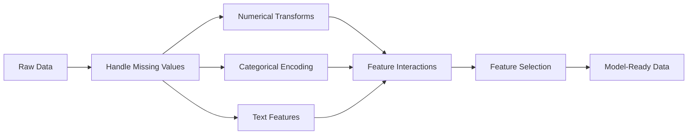

# Feature Engineering & Selection（特征工程与选择）

> A good feature is worth a thousand data points.
> 好的特征胜过千条数据。

**Type（类型）：** Build（构建）  
**Languages（语言）：** Python  
**Prerequisites（前置知识）：** Phase 1 (Statistics for ML, Linear Algebra)、Phase 2 Lessons 1-7  
**Time（时间）：** ~90 minutes（约90分钟）

## Learning Objectives（学习目标）

- 实现数值变换（standardization（标准化）, min-max scaling（最小-最大缩放）, log transform（对数变换）, binning（分箱）），并解释每种方法的适用场景  
- 为类别特征构建 one-hot, label, 和 target encoding（编码），并识别 target encoding 中的数据泄漏风险  
- 从头实现 TF-IDF vectorizer（向量化器），并解释其为何优于原始词频统计用于文本分类  
- 应用基于 filter（过滤器）的特征选择（variance threshold（方差阈值）, correlation（相关性）, mutual information（互信息））以降低维度  

## The Problem（问题背景）

你有一个数据集。你选择了一个算法。你训练它。结果平平。你尝试更复杂的算法，结果仍然平平。你花了一周调整超参数，改进很有限。

然后有人把原始数据转换成更好的特征，简单的逻辑回归模型就能胜过你调优过的梯度提升集成模型。

这种情况经常发生。在经典机器学习中，数据的表示比算法选择更重要。一个包含“平方英尺面积”和“卧室数量”的房价模型，往往会胜过使用“地址字符串”作为特征的模型，无论学习算法多么复杂。算法只能利用你给它的数据。

特征工程是将原始数据转换成更有利于模型发现模式的表示的过程。特征选择是剔除那些增加噪声但不增加信号的特征的过程。两者合起来，是经典机器学习中产生最大杠杆效应的活动。

## The Concept（核心概念）

### The Feature Pipeline（特征处理流程）



### Numerical Features（数值特征）

原始数字很少是直接可用的模型输入。常见变换：

**Scaling（缩放）：** 使所有特征在相同范围内，相似度度量（如基于距离的算法——K-Means, KNN, SVM）才能公平对待所有特征。Min-max scaling 映射到 [0, 1]，Standardization（z-score 标准化）映射到均值为0，标准差为1。

**Log transform（对数变换）：** 压缩右偏分布（收入、人口、词频），将乘法关系转为加法关系。

**Binning（分箱）：** 将连续值转化为类别。适用于特征与目标之间存在非线性但分段式关系（如年龄段）。

**Polynomial features（多项式特征）：** 生成 x², x³, x1*x2 等项，使线性模型能够学习非线性关系，但会增加特征数量。

### Categorical Features（类别特征）

模型需要数字，类别需要编码。

**One-hot encoding（一位有效编码）：** 为每个类别生成一个二元列。"color = red/blue/green" 变成三个列：is_red、is_blue、is_green。适用于低基数特征，类别数目多时会爆炸。

**Label encoding（标签编码）：** 将每个类别映射为整数：red=0，blue=1，green=2。引入了伪序关系（模型可能认为 green > blue > red）。只适用于基于树的模型，这类模型是基于单值拆分。

**Target encoding（目标编码）：** 用该类别对应目标变量的均值替代类别。强大但有风险：极易导致数据泄漏。必须只在训练集计算，然后应用于测试集。

### Text Features（文本特征）

**Count vectorizer（计数向量化）：** 统计词在文档中的出现次数。"the cat sat on the mat" 变成 {the: 2, cat: 1, sat: 1, on: 1, mat: 1}。

**TF-IDF（词频-逆文档频率）：** 根据词在文档集合中的独特性加权。常见词如“the”权重低，稀有词权重高。

```text
TF(word, doc) = count(word in doc) / total words in doc
IDF(word) = log(total docs / docs containing word)
TF-IDF = TF * IDF
```

### Missing Values（缺失值处理）

实际数据中常有缺失，策略：

- **Drop rows（删除行）：** 只在缺失随机且稀少时使用  
- **Mean/median imputation（均值/中位数填充）：** 简单，保留分布形态（中位数对异常值更稳健）  
- **Mode imputation（众数填充）：** 用于类别特征  
- **Indicator column（缺失指示变量）：** 填充前添加一个二元列“was_this_missing”，缺失自身可能是有效信息  
- **Forward/backward fill（前向/后向填充）：** 用于时间序列数据

### Feature Interaction（特征交互）

有时关系体现在特征组合。"Height" 和 "weight" 单独预测性一般，但 BMI = weight / height² 更有预测力。特征交互会增加特征空间规模，应利用领域知识选取合适交互。

### Feature Selection（特征选择）

更多特征未必更好。无关特征增加噪声，加长训练时间，还可能导致过拟合。

**Filter methods（筛选方法，模型前）：**  
- Correlation（相关性）：删除高度相关的冗余特征  
- Mutual information（互信息）：衡量知道某特征能减少多少目标变量的不确定性  
- Variance threshold（方差阈值）：剔除变化极小的特征  

**Wrapper methods（包裹方法，基于模型）：**  
- L1 regularization (Lasso)：把无关特征权重压缩为零  
- Recursive feature elimination：迭代训练，去掉最不重要的特征  

**选择重要性的原因：** 含10个优质特征的模型，通常优于同样含10个优质特征加90个噪声特征的模型。噪声特征易导致模型在训练集上过拟合，泛化能力差。

## Build It（动手构建）

### Step 1: Numerical transforms from scratch（数值变换从零实现）

```python
import math


def min_max_scale(values):
    min_val = min(values)
    max_val = max(values)
    if max_val == min_val:
        return [0.0] * len(values)
    return [(v - min_val) / (max_val - min_val) for v in values]


def standardize(values):
    n = len(values)
    mean = sum(values) / n
    variance = sum((v - mean) ** 2 for v in values) / n
    std = math.sqrt(variance) if variance > 0 else 1.0
    return [(v - mean) / std for v in values]


def log_transform(values):
    return [math.log(v + 1) for v in values]


def bin_values(values, n_bins=5):
    min_val = min(values)
    max_val = max(values)
    bin_width = (max_val - min_val) / n_bins
    if bin_width == 0:
        return [0] * len(values)
    result = []
    for v in values:
        bin_idx = int((v - min_val) / bin_width)
        bin_idx = min(bin_idx, n_bins - 1)
        result.append(bin_idx)
    return result


def polynomial_features(row, degree=2):
    n = len(row)
    result = list(row)
    if degree >= 2:
        for i in range(n):
            result.append(row[i] ** 2)
        for i in range(n):
            for j in range(i + 1, n):
                result.append(row[i] * row[j])
    return result
```

### Step 2: Categorical encoding from scratch（类别编码从零实现）

```python
def one_hot_encode(values):
    categories = sorted(set(values))
    cat_to_idx = {cat: i for i, cat in enumerate(categories)}
    n_cats = len(categories)

    encoded = []
    for v in values:
        row = [0] * n_cats
        row[cat_to_idx[v]] = 1
        encoded.append(row)

    return encoded, categories


def label_encode(values):
    categories = sorted(set(values))
    cat_to_int = {cat: i for i, cat in enumerate(categories)}
    return [cat_to_int[v] for v in values], cat_to_int


def target_encode(feature_values, target_values, smoothing=10):
    global_mean = sum(target_values) / len(target_values)

    category_stats = {}
    for feat, target in zip(feature_values, target_values):
        if feat not in category_stats:
            category_stats[feat] = {"sum": 0.0, "count": 0}
        category_stats[feat]["sum"] += target
        category_stats[feat]["count"] += 1

    encoding = {}
    for cat, stats in category_stats.items():
        cat_mean = stats["sum"] / stats["count"]
        weight = stats["count"] / (stats["count"] + smoothing)
        encoding[cat] = weight * cat_mean + (1 - weight) * global_mean

    return [encoding[v] for v in feature_values], encoding
```

### Step 3: Text features from scratch（文本特征从零实现）

```python
def count_vectorize(documents):
    vocab = {}
    idx = 0
    for doc in documents:
        for word in doc.lower().split():
            if word not in vocab:
                vocab[word] = idx
                idx += 1

    vectors = []
    for doc in documents:
        vec = [0] * len(vocab)
        for word in doc.lower().split():
            vec[vocab[word]] += 1
        vectors.append(vec)

    return vectors, vocab


def tfidf(documents):
    n_docs = len(documents)

    vocab = {}
    idx = 0
    for doc in documents:
        for word in doc.lower().split():
            if word not in vocab:
                vocab[word] = idx
                idx += 1

    doc_freq = {}
    for doc in documents:
        seen = set()
        for word in doc.lower().split():
            if word not in seen:
                doc_freq[word] = doc_freq.get(word, 0) + 1
                seen.add(word)

    vectors = []
    for doc in documents:
        words = doc.lower().split()
        word_count = len(words)
        tf_map = {}
        for word in words:
            tf_map[word] = tf_map.get(word, 0) + 1

        vec = [0.0] * len(vocab)
        for word, count in tf_map.items():
            tf = count / word_count
            idf = math.log(n_docs / doc_freq[word])
            vec[vocab[word]] = tf * idf
        vectors.append(vec)

    return vectors, vocab
```

### Step 4: Missing value imputation from scratch（缺失值填充从零实现）

```python
def impute_mean(values):
    present = [v for v in values if v is not None]
    if not present:
        return [0.0] * len(values), 0.0
    mean = sum(present) / len(present)
    return [v if v is not None else mean for v in values], mean


def impute_median(values):
    present = sorted(v for v in values if v is not None)
    if not present:
        return [0.0] * len(values), 0.0
    n = len(present)
    if n % 2 == 0:
        median = (present[n // 2 - 1] + present[n // 2]) / 2
    else:
        median = present[n // 2]
    return [v if v is not None else median for v in values], median


def impute_mode(values):
    present = [v for v in values if v is not None]
    if not present:
        return values, None
    counts = {}
    for v in present:
        counts[v] = counts.get(v, 0) + 1
    mode = max(counts, key=counts.get)
    return [v if v is not None else mode for v in values], mode


def add_missing_indicator(values):
    return [0 if v is not None else 1 for v in values]
```

### Step 5: Feature selection from scratch（特征选择从零实现）

```python
def correlation(x, y):
    n = len(x)
    mean_x = sum(x) / n
    mean_y = sum(y) / n
    cov = sum((xi - mean_x) * (yi - mean_y) for xi, yi in zip(x, y)) / n
    std_x = math.sqrt(sum((xi - mean_x) ** 2 for xi in x) / n)
    std_y = math.sqrt(sum((yi - mean_y) ** 2 for yi in y) / n)
    if std_x == 0 or std_y == 0:
        return 0.0
    return cov / (std_x * std_y)


def mutual_information(feature, target, n_bins=10):
    feat_min = min(feature)
    feat_max = max(feature)
    bin_width = (feat_max - feat_min) / n_bins if feat_max != feat_min else 1.0
    feat_binned = [
        min(int((f - feat_min) / bin_width), n_bins - 1) for f in feature
    ]

    n = len(feature)
    target_classes = sorted(set(target))

    feat_bins = sorted(set(feat_binned))
    p_feat = {}
    for b in feat_bins:
        p_feat[b] = feat_binned.count(b) / n

    p_target = {}
    for t in target_classes:
        p_target[t] = target.count(t) / n

    mi = 0.0
    for b in feat_bins:
        for t in target_classes:
            joint_count = sum(
                1 for fb, tv in zip(feat_binned, target) if fb == b and tv == t
            )
            p_joint = joint_count / n
            if p_joint > 0:
                mi += p_joint * math.log(p_joint / (p_feat[b] * p_target[t]))

    return mi


def variance_threshold(features, threshold=0.01):
    n_features = len(features[0])
    n_samples = len(features)
    selected = []

    for j in range(n_features):
        col = [features[i][j] for i in range(n_samples)]
        mean = sum(col) / n_samples
        var = sum((v - mean) ** 2 for v in col) / n_samples
        if var >= threshold:
            selected.append(j)

    return selected


def remove_correlated(features, threshold=0.9):
    n_features = len(features[0])
    n_samples = len(features)

    to_remove = set()
    for i in range(n_features):
        if i in to_remove:
            continue
        col_i = [features[r][i] for r in range(n_samples)]
        for j in range(i + 1, n_features):
            if j in to_remove:
                continue
            col_j = [features[r][j] for r in range(n_samples)]
            corr = abs(correlation(col_i, col_j))
            if corr >= threshold:
                to_remove.add(j)

    return [i for i in range(n_features) if i not in to_remove]
```

### 第6步：完整流水线与演示

```python
import random


def make_housing_data(n=200, seed=42):
    random.seed(seed)
    data = []
    for _ in range(n):
        sqft = random.uniform(500, 5000)
        bedrooms = random.choice([1, 2, 3, 4, 5])
        age = random.uniform(0, 50)
        neighborhood = random.choice(["downtown", "suburbs", "rural"])
        has_pool = random.choice([True, False])

        sqft_with_missing = sqft if random.random() > 0.05 else None
        age_with_missing = age if random.random() > 0.08 else None

        price = (
            50 * sqft
            + 20000 * bedrooms
            - 1000 * age
            + (50000 if neighborhood == "downtown" else 10000 if neighborhood == "suburbs" else 0)
            + (15000 if has_pool else 0)
            + random.gauss(0, 20000)
        )

        data.append({
            "sqft": sqft_with_missing,
            "bedrooms": bedrooms,
            "age": age_with_missing,
            "neighborhood": neighborhood,
            "has_pool": has_pool,
            "price": price,
        })
    return data


if __name__ == "__main__":
    data = make_housing_data(200)

    print("=== 原始数据样本 ===")
    for row in data[:3]:
        print(f"  {row}")

    sqft_raw = [d["sqft"] for d in data]
    age_raw = [d["age"] for d in data]
    prices = [d["price"] for d in data]

    print("\n=== 缺失值处理 ===")
    sqft_missing = sum(1 for v in sqft_raw if v is None)
    age_missing = sum(1 for v in age_raw if v is None)
    print(f"  平方英尺缺失: {sqft_missing}/{len(sqft_raw)}")
    print(f"  房龄缺失: {age_missing}/{len(age_raw)}")

    sqft_indicator = add_missing_indicator(sqft_raw)
    age_indicator = add_missing_indicator(age_raw)
    sqft_imputed, sqft_fill = impute_median(sqft_raw)
    age_imputed, age_fill = impute_mean(age_raw)
    print(f"  平方英尺用中位数填充: {sqft_fill:.0f}")
    print(f"  房龄用均值填充: {age_fill:.1f}")

    print("\n=== 数值转换 ===")
    sqft_scaled = standardize(sqft_imputed)
    age_scaled = min_max_scale(age_imputed)
    sqft_log = log_transform(sqft_imputed)
    age_binned = bin_values(age_imputed, n_bins=5)
    print(f"  平方英尺标准化: 均值={sum(sqft_scaled)/len(sqft_scaled):.4f}, 标准差={math.sqrt(sum(v**2 for v in sqft_scaled)/len(sqft_scaled)):.4f}")
    print(f"  房龄最小最大归一化: [{min(age_scaled):.2f}, {max(age_scaled):.2f}]")
    print(f"  房龄分箱: {sorted(set(age_binned))}")

    print("\n=== 类别编码 ===")
    neighborhoods = [d["neighborhood"] for d in data]

    ohe, ohe_cats = one_hot_encode(neighborhoods)
    print(f"  独热编码类别: {ohe_cats}")
    print(f"  样本编码: {neighborhoods[0]} -> {ohe[0]}")

    le, le_map = label_encode(neighborhoods)
    print(f"  标签编码映射: {le_map}")

    te, te_map = target_encode(neighborhoods, prices, smoothing=10)
    print(f"  目标编码: {({k: round(v) for k, v in te_map.items()})}")

    print("\n=== 文本特征 ===")
    descriptions = [
        "large modern house with pool",
        "small cozy cottage near downtown",
        "spacious family home with large yard",
        "modern apartment downtown with view",
        "rustic cabin in rural area",
    ]
    cv, cv_vocab = count_vectorize(descriptions)
    print(f"  词汇表大小: {len(cv_vocab)}")
    print(f"  文档0非零特征数: {sum(1 for v in cv[0] if v > 0)}")

    tf, tf_vocab = tfidf(descriptions)
    print(f"  TF-IDF词汇表大小: {len(tf_vocab)}")
    top_words = sorted(tf_vocab.keys(), key=lambda w: tf[0][tf_vocab[w]], reverse=True)[:3]
    print(f"  文档0最高TF-IDF词: {top_words}")

    print("\n=== 多项式特征 ===")
    sample_row = [sqft_scaled[0], age_scaled[0]]
    poly = polynomial_features(sample_row, degree=2)
    print(f"  输入: {[round(v, 4) for v in sample_row]}")
    print(f"  多项式特征: {[round(v, 4) for v in poly]}")
    print(f"  特征: [x1, x2, x1^2, x2^2, x1*x2]")

    print("\n=== 特征选择 ===")
    feature_matrix = [
        [sqft_scaled[i], age_scaled[i], float(sqft_indicator[i]), float(age_indicator[i])]
        + ohe[i]
        for i in range(len(data))
    ]

    print(f"  特征总数: {len(feature_matrix[0])}")

    surviving_var = variance_threshold(feature_matrix, threshold=0.01)
    print(f"  经过方差阈值过滤（0.01）后保留: {len(surviving_var)} 个特征")

    surviving_corr = remove_correlated(feature_matrix, threshold=0.9)
    print(f"  经过相关性过滤（0.9）后保留: {len(surviving_corr)} 个特征")

    binary_prices = [1 if p > sum(prices) / len(prices) else 0 for p in prices]
    print("\n  与目标的互信息:")
    feature_names = ["sqft", "age", "sqft_missing", "age_missing"] + [f"neigh_{c}" for c in ohe_cats]
    for j in range(len(feature_matrix[0])):
        col = [feature_matrix[i][j] for i in range(len(feature_matrix))]
        mi = mutual_information(col, binary_prices, n_bins=10)
        print(f"    {feature_names[j]}: MI={mi:.4f}")

    print("\n  与价格的相关性:")
    for j in range(len(feature_matrix[0])):
        col = [feature_matrix[i][j] for i in range(len(feature_matrix))]
        corr = correlation(col, prices)
        print(f"    {feature_names[j]}: r={corr:.4f}")
```

## 使用方法

使用 scikit-learn，这些转换可以组成流水线：

```python
from sklearn.preprocessing import StandardScaler, OneHotEncoder, PolynomialFeatures
from sklearn.impute import SimpleImputer
from sklearn.feature_extraction.text import TfidfVectorizer
from sklearn.feature_selection import mutual_info_classif, VarianceThreshold
from sklearn.compose import ColumnTransformer
from sklearn.pipeline import Pipeline

numeric_pipe = Pipeline([
    ("imputer", SimpleImputer(strategy="median")),
    ("scaler", StandardScaler()),
])

categorical_pipe = Pipeline([
    ("encoder", OneHotEncoder(sparse_output=False)),
])

preprocessor = ColumnTransformer([
    ("num", numeric_pipe, ["sqft", "age"]),
    ("cat", categorical_pipe, ["neighborhood"]),
])
```

自定义实现版本精确展示了每个转换的内部过程。库版本增加了边缘情况处理、稀疏矩阵支持和流水线组合，但数学原理是一致的。

## 部署

本课输出的内容包括：
- `outputs/prompt-feature-engineer.md` —— 一个用于系统性地从原始数据工程特征的提示模板

## 练习

1. 在数值转换中添加稳健缩放（使用中位数和四分位距代替均值和标准差）。与极端异常值数据上的标准缩放比较。
2. 实现留一法目标编码：对每一行计算其目标均值，但排除该行自身的目标值。展示这种方法如何减少过拟合，相较于简单目标编码。
3. 构建一个自动特征选择流水线，结合方差阈值、相关性过滤和互信息排序。应用于房屋数据集，比较使用全部特征与选择特征时简单线性回归模型的性能。

## 术语表

| 术语 | 常说的 | 实际含义 |
|------|--------|----------|
| Feature engineering | “创造新列” | 将原始数据转换成能让模型发现模式的表示 |
| Standardization（标准化） | “让数据正规化” | 减去均值，除以标准差，使得特征均值=0，标准差=1 |
| One-hot encoding（独热编码） | “造哑变量” | 为每个类别创建一个二元列，每行仅有一列为1 |
| Target encoding（目标编码） | “用答案编码” | 用每个类别的目标均值替代类别值，带平滑防止过拟合 |
| TF-IDF | “高级词频统计” | 词频乘以逆文档频率：根据词语在语料库中的区别性加权 |
| Imputation（插补） | “填补空白” | 用估计值（均值、中位数、众数或模型预测值）替换缺失值 |
| Feature selection（特征选择） | “扔掉烂特征” | 去除噪声或冗余特征，仅保留与目标相关的有效特征 |
| Mutual information（互信息） | “一个变量告诉你多少关于另一个” | 观察X带来的对Y不确定性的减少量度 |
| Data leakage（数据泄漏） | “无意作弊” | 训练时使用在预测时不会拥有的信息，导致评价虚高 |

## 延伸阅读

- [Feature Engineering and Selection (Max Kuhn & Kjell Johnson)](http://www.feat.engineering/) - 免费在线书籍，涵盖特征工程全景
- [scikit-learn 预处理指南](https://scikit-learn.org/stable/modules/preprocessing.html) - 所有标准转换的实用参考
- [Target Encoding Done Right (Micci-Barreca, 2001)](https://dl.acm.org/doi/10.1145/507533.507538) - 关于带平滑目标编码的原创论文
