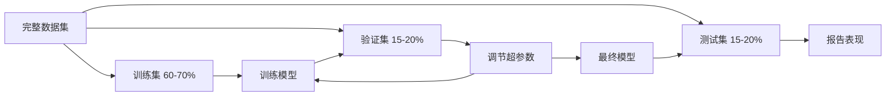

# 模型评估

> 模型的好坏取决于你如何衡量它。

**类型：** 构建  
**语言：** Python  
**先决条件：** 第一阶段（概率与分布，机器学习统计学），第二阶段第1-8课  
**时间：** 约90分钟

## 学习目标

- 从零实现 K 折交叉验证和分层 K 折交叉验证，并解释为什么分层对不平衡数据很重要  
- 从零计算精确率（precision）、召回率（recall）、F1 分数、AUC-ROC 以及回归指标（均方误差 MSE，均方根误差 RMSE，平均绝对误差 MAE，决定系数 R-squared）  
- 解读学习曲线，诊断模型是高偏差还是高方差  
- 识别常见的评估错误，包括数据泄漏、错误的指标选择和测试集污染  

## 问题分析

你训练了一个模型，在你的数据上准确率达到 95%。这就是好模型吗？

可能是，也可能不是。如果你的数据中有 95% 属于某一类别，那么一个总是预测该类别的模型准确率也是 95%，但完全没有用处。如果你在训练数据上评估，95% 这个数字毫无意义，因为模型只是记住了答案。如果数据集有时间序列成分，你又在划分前随机打乱样本，模型可能用未来数据预测过去。

模型评估是大多数机器学习项目失败的关键。错误的指标让坏模型看起来好；错误的划分让模型作弊；错误的比较让你选错模型。正确的评估是不可选的，它是模型能否在生产环境中有效，或者一旦面对真实数据就崩溃的分水岭。

## 概念讲解

### 训练集、验证集、测试集



三个划分，三个目的：

- **训练集**：供模型学习的样本，模型在训练时会看到这些例子。  
- **验证集**：用于调参和模型选择。模型训练时不使用这部分数据，但决策过程会受到它的影响。  
- **测试集**：只在最后评估模型性能时用一次。如果你看过测试集表现后还回过头改模型，它就不再是测试集，变成了第二个验证集。

测试集是你保留的“底线”，保证报告的性能能反映模型在真正未见过数据上的表现。

### K 折交叉验证

对于小数据集，单次训练/验证划分会浪费数据并且评估有噪声。K 折交叉验证让所有数据都被用于训练和验证：

```mermaid
flowchart TB
    subgraph Fold1["Fold 1"]
        direction LR
        V1["验证"] --- T1a["训练"] --- T1b["训练"] --- T1c["训练"] --- T1d["训练"]
    end
    subgraph Fold2["Fold 2"]
        direction LR
        T2a["训练"] --- V2["验证"] --- T2b["训练"] --- T2c["训练"] --- T2d["训练"]
    end
    subgraph Fold3["Fold 3"]
        direction LR
        T3a["训练"] --- T3b["训练"] --- V3["验证"] --- T3c["训练"] --- T3d["训练"]
    end
    subgraph Fold4["Fold 4"]
        direction LR
        T4a["训练"] --- T4b["训练"] --- T4c["训练"] --- V4["验证"] --- T4d["训练"]
    end
    subgraph Fold5["Fold 5"]
        direction LR
        T5a["训练"] --- T5b["训练"] --- T5c["训练"] --- T5d["训练"] --- V5["验证"]
    end
    Fold1 --> R["平均分数"]
    Fold2 --> R
    Fold3 --> R
    Fold4 --> R
    Fold5 --> R
```



1. 将数据分成 K 份大小相等的折  
2. 每次用 K-1 折训练，剩下的 1 折验证  
3. 对 K 个验证分数求平均  

K=5 或 10 是常用选择。每个样本会被验证一次。平均结果比单次划分更稳健。

**分层 K 折**：保持每折中类别分布基本一致。比如数据 70% 为 A 类，30% 为 B 类，每折比例大致相同。这对不平衡数据尤其重要，避免某折里全是少数类。

### 分类指标

**混淆矩阵**：基础，二分类情况如下：

|  | 预测为正类 | 预测为负类 |
|--|---|---|
| 实际正类 | 真正例（TP） | 假负例（FN） |
| 实际负类 | 假正例（FP） | 真负例（TN） |

由此可计算所有指标：

- **准确率（Accuracy）** = (TP + TN) / (TP + TN + FP + FN)。预测正确占比。类别不平衡时误导。
- **精确率（Precision）** = TP / (TP + FP)。预测为正的中，实际正的比例。适合错误判为正代价高的场景（如垃圾邮件误判正常邮件为垃圾邮件）。  
- **召回率（Recall / 敏感度）** = TP / (TP + FN)。实际正中，预测正确的比例。适合错误漏报代价高的场景（如癌症筛查漏检）。  
- **F1 分数** = 2 * 精确率 * 召回率 / (精确率 + 召回率)。调和均值，平衡两者。  
- **AUC-ROC**：受试者工作特征曲线下面积。画不同阈值下的真正率与假正率。0.5 表示随机猜测，1.0 表示完美区分。与阈值无关，衡量模型正样本排名优于负样本的程度。

### 回归指标

- **均方误差（MSE）** = mean((y_true - y_pred)^2)。对大误差惩罚较重。对异常值敏感。  
- **均方根误差（RMSE）** = sqrt(MSE)。单位与目标相同，比 MSE 更直观。  
- **平均绝对误差（MAE）** = mean(|y_true - y_pred|)。线性对待误差，对异常值更鲁棒。  
- **决定系数（R-squared）** = 1 - SS_res / SS_tot, 其中 SS_res = sum((y_true - y_pred)^2), SS_tot = sum((y_true - y_mean)^2)。表示模型解释的方差比例。R^2=1 完美，R^2=0 表示模型不如常数预测，R^2可为负表示模型还比平均值差。

### 学习曲线

绘制训练集大小对应的训练/验证分数：

- **高偏差（欠拟合）**：两曲线趋于低分，增加数据无效，需要更复杂模型。  
- **高方差（过拟合）**：训练分数高，验证分数低且差距大。增加数据应能改善。

### 验证曲线

画超参数变化下的训练/验证分数：

- 低复杂度：两分数都低（欠拟合）  
- 合适复杂度：两分数都高且接近  
- 高复杂度：训练分高，验证分下降（过拟合）

最佳超参数是验证分最高点。

### 常见评估错误

**数据泄漏**：测试集信息流入训练。例：在划分前用全数据拟合标准化，时间序列预测用未来数据，使用目标衍生特征。总是先划分，再预处理。

**类别不平衡**：99% 交易合法，1% 欺诈；模型总预测“合法”准确率 99%。用精确率、召回率、F1 或 AUC-ROC 替代准确率。

**错误度量**：该优化召回率时误用准确率（医疗诊断），数据有重异常时用 RMSE 不合适（改用 MAE）。

**不做分层划分**：不平衡数据随机划分验证集时，少数类样本很少，估计不稳。

**频繁测试**：每次看测试表现就调模型导致过拟合测试集。测试集只能用一次。

## 实践构建

### 第1步：训练/验证/测试划分

```python
import random
import math


def train_val_test_split(X, y, train_ratio=0.6, val_ratio=0.2, seed=42):
    random.seed(seed)
    n = len(X)
    indices = list(range(n))
    random.shuffle(indices)

    train_end = int(n * train_ratio)
    val_end = int(n * (train_ratio + val_ratio))

    train_idx = indices[:train_end]
    val_idx = indices[train_end:val_end]
    test_idx = indices[val_end:]

    X_train = [X[i] for i in train_idx]
    y_train = [y[i] for i in train_idx]
    X_val = [X[i] for i in val_idx]
    y_val = [y[i] for i in val_idx]
    X_test = [X[i] for i in test_idx]
    y_test = [y[i] for i in test_idx]

    return X_train, y_train, X_val, y_val, X_test, y_test
```

### 第2步：K 折与分层 K 折交叉验证

```python
def kfold_split(n, k=5, seed=42):
    random.seed(seed)
    indices = list(range(n))
    random.shuffle(indices)

    fold_size = n // k
    folds = []

    for i in range(k):
        start = i * fold_size
        end = start + fold_size if i < k - 1 else n
        val_idx = indices[start:end]
        train_idx = indices[:start] + indices[end:]
        folds.append((train_idx, val_idx))

    return folds


def stratified_kfold_split(y, k=5, seed=42):
    random.seed(seed)

    class_indices = {}
    for i, label in enumerate(y):
        class_indices.setdefault(label, []).append(i)

    for label in class_indices:
        random.shuffle(class_indices[label])

    folds = [{"train": [], "val": []} for _ in range(k)]

    for label, indices in class_indices.items():
        fold_size = len(indices) // k
        for i in range(k):
            start = i * fold_size
            end = start + fold_size if i < k - 1 else len(indices)
            val_part = indices[start:end]
            train_part = indices[:start] + indices[end:]
            folds[i]["val"].extend(val_part)
            folds[i]["train"].extend(train_part)

    return [(f["train"], f["val"]) for f in folds]


def cross_validate(X, y, model_fn, k=5, metric_fn=None, stratified=False):
    n = len(X)

    if stratified:
        folds = stratified_kfold_split(y, k)
    else:
        folds = kfold_split(n, k)

    scores = []
    for train_idx, val_idx in folds:
        X_train = [X[i] for i in train_idx]
        y_train = [y[i] for i in train_idx]
        X_val = [X[i] for i in val_idx]
        y_val = [y[i] for i in val_idx]

        model = model_fn()
        model.fit(X_train, y_train)
        predictions = [model.predict(x) for x in X_val]

        if metric_fn:
            score = metric_fn(y_val, predictions)
        else:
            score = sum(1 for yt, yp in zip(y_val, predictions) if yt == yp) / len(y_val)
        scores.append(score)

    return scores
```

### 第3步：混淆矩阵与分类指标

```python
def confusion_matrix(y_true, y_pred):
    tp = sum(1 for yt, yp in zip(y_true, y_pred) if yt == 1 and yp == 1)
    tn = sum(1 for yt, yp in zip(y_true, y_pred) if yt == 0 and yp == 0)
    fp = sum(1 for yt, yp in zip(y_true, y_pred) if yt == 0 and yp == 1)
    fn = sum(1 for yt, yp in zip(y_true, y_pred) if yt == 1 and yp == 0)
    return tp, tn, fp, fn


def accuracy(y_true, y_pred):
    tp, tn, fp, fn = confusion_matrix(y_true, y_pred)
    total = tp + tn + fp + fn
    return (tp + tn) / total if total > 0 else 0.0


def precision(y_true, y_pred):
    tp, tn, fp, fn = confusion_matrix(y_true, y_pred)
    return tp / (tp + fp) if (tp + fp) > 0 else 0.0


def recall(y_true, y_pred):
    tp, tn, fp, fn = confusion_matrix(y_true, y_pred)
    return tp / (tp + fn) if (tp + fn) > 0 else 0.0


def f1_score(y_true, y_pred):
    p = precision(y_true, y_pred)
    r = recall(y_true, y_pred)
    return 2 * p * r / (p + r) if (p + r) > 0 else 0.0


def roc_curve(y_true, y_scores):
    thresholds = sorted(set(y_scores), reverse=True)
    tpr_list = []
    fpr_list = []

    total_positives = sum(y_true)
    total_negatives = len(y_true) - total_positives

    for threshold in thresholds:
        y_pred = [1 if s >= threshold else 0 for s in y_scores]
        tp = sum(1 for yt, yp in zip(y_true, y_pred) if yt == 1 and yp == 1)
        fp = sum(1 for yt, yp in zip(y_true, y_pred) if yt == 0 and yp == 1)

        tpr = tp / total_positives if total_positives > 0 else 0.0
        fpr = fp / total_negatives if total_negatives > 0 else 0.0

        tpr_list.append(tpr)
        fpr_list.append(fpr)

    return fpr_list, tpr_list, thresholds


def auc_roc(y_true, y_scores):
    fpr_list, tpr_list, _ = roc_curve(y_true, y_scores)

    pairs = sorted(zip(fpr_list, tpr_list))
    fpr_sorted = [p[0] for p in pairs]
    tpr_sorted = [p[1] for p in pairs]

    area = 0.0
    for i in range(1, len(fpr_sorted)):
        width = fpr_sorted[i] - fpr_sorted[i - 1]
        height = (tpr_sorted[i] + tpr_sorted[i - 1]) / 2
        area += width * height

    return area
```

### 第4步：回归指标

```python
def mse(y_true, y_pred):
    n = len(y_true)
    return sum((yt - yp) ** 2 for yt, yp in zip(y_true, y_pred)) / n


def rmse(y_true, y_pred):
    return math.sqrt(mse(y_true, y_pred))


def mae(y_true, y_pred):
    n = len(y_true)
    return sum(abs(yt - yp) for yt, yp in zip(y_true, y_pred)) / n


def r_squared(y_true, y_pred):
    mean_y = sum(y_true) / len(y_true)
    ss_res = sum((yt - yp) ** 2 for yt, yp in zip(y_true, y_pred))
    ss_tot = sum((yt - mean_y) ** 2 for yt in y_true)
    if ss_tot == 0:
        return 0.0
    return 1.0 - ss_res / ss_tot
```

### 第5步：学习曲线

```python
def learning_curve(X, y, model_fn, metric_fn, train_sizes=None, val_ratio=0.2, seed=42):
    random.seed(seed)
    n = len(X)
    indices = list(range(n))
    random.shuffle(indices)

    val_size = int(n * val_ratio)
    val_idx = indices[:val_size]
    pool_idx = indices[val_size:]

    X_val = [X[i] for i in val_idx]
    y_val = [y[i] for i in val_idx]

    if train_sizes is None:
        train_sizes = [int(len(pool_idx) * r) for r in [0.1, 0.2, 0.4, 0.6, 0.8, 1.0]]

    train_scores = []
    val_scores = []

    for size in train_sizes:
        subset = pool_idx[:size]
        X_train = [X[i] for i in subset]
        y_train = [y[i] for i in subset]

        model = model_fn()
        model.fit(X_train, y_train)

        train_pred = [model.predict(x) for x in X_train]
        val_pred = [model.predict(x) for x in X_val]

        train_scores.append(metric_fn(y_train, train_pred))
        val_scores.append(metric_fn(y_val, val_pred))

    return train_sizes, train_scores, val_scores
```

### 第6步：用于测试的简单分类器，以及完整示例

```python
class SimpleLogistic:
    def __init__(self, lr=0.1, epochs=100):
        self.lr = lr
        self.epochs = epochs
        self.weights = None
        self.bias = 0.0

    def sigmoid(self, z):
        z = max(-500, min(500, z))
        return 1.0 / (1.0 + math.exp(-z))

    def fit(self, X, y):
        n_features = len(X[0])
        self.weights = [0.0] * n_features
        self.bias = 0.0

        for _ in range(self.epochs):
            for xi, yi in zip(X, y):
                z = sum(w * x for w, x in zip(self.weights, xi)) + self.bias
                pred = self.sigmoid(z)
                error = yi - pred
                for j in range(n_features):
                    self.weights[j] += self.lr * error * xi[j]
                self.bias += self.lr * error

    def predict_proba(self, x):
        z = sum(w * xi for w, xi in zip(self.weights, x)) + self.bias
        return self.sigmoid(z)

    def predict(self, x):
        return 1 if self.predict_proba(x) >= 0.5 else 0


class SimpleLinearRegression:
    def __init__(self, lr=0.001, epochs=200):
        self.lr = lr
        self.epochs = epochs
        self.weights = None
        self.bias = 0.0

    def fit(self, X, y):
        n_features = len(X[0])
        self.weights = [0.0] * n_features
        self.bias = 0.0
        n = len(X)

        for _ in range(self.epochs):
            for xi, yi in zip(X, y):
                pred = sum(w * x for w, x in zip(self.weights, xi)) + self.bias
                error = yi - pred
                for j in range(n_features):
                    self.weights[j] += self.lr * error * xi[j] / n
                self.bias += self.lr * error / n

    def predict(self, x):
        return sum(w * xi for w, xi in zip(self.weights, x)) + self.bias


def standardize(values):
    n = len(values)
    mean = sum(values) / n
    var = sum((v - mean) ** 2 for v in values) / n
    std = math.sqrt(var) if var > 0 else 1.0
    return [(v - mean) / std for v in values], mean, std


def make_classification_data(n=300, seed=42):
    random.seed(seed)
    X = []
    y = []
    for _ in range(n):
        x1 = random.gauss(0, 1)
        x2 = random.gauss(0, 1)
        label = 1 if (x1 + x2 + random.gauss(0, 0.5)) > 0 else 0
        X.append([x1, x2])
        y.append(label)
    return X, y


def make_regression_data(n=200, seed=42):
    random.seed(seed)
    X = []
    y = []
    for _ in range(n):
        x1 = random.uniform(0, 10)
        x2 = random.uniform(0, 5)
        target = 3 * x1 + 2 * x2 + random.gauss(0, 2)
        X.append([x1, x2])
        y.append(target)
    return X, y


def make_imbalanced_data(n=300, minority_ratio=0.05, seed=42):
    random.seed(seed)
    X = []
    y = []
    for _ in range(n):
        if random.random() < minority_ratio:
            x1 = random.gauss(3, 0.5)
            x2 = random.gauss(3, 0.5)
            label = 1
        else:
            x1 = random.gauss(0, 1)
            x2 = random.gauss(0, 1)
            label = 0
        X.append([x1, x2])
        y.append(label)
    return X, y


if __name__ == "__main__":
    X_clf, y_clf = make_classification_data(300)

    print("=== 训练/验证/测试数据划分 ===")
    X_train, y_train, X_val, y_val, X_test, y_test = train_val_test_split(X_clf, y_clf)
    print(f"  训练集: {len(X_train)}, 验证集: {len(X_val)}, 测试集: {len(X_test)}")
    print(f"  训练集类别分布: {sum(y_train)}/{len(y_train)} 正样本")
    print(f"  验证集类别分布: {sum(y_val)}/{len(y_val)} 正样本")

    model = SimpleLogistic(lr=0.1, epochs=200)
    model.fit(X_train, y_train)

    print("\n=== 分类指标 ===")
    y_pred = [model.predict(x) for x in X_test]
    tp, tn, fp, fn = confusion_matrix(y_test, y_pred)
    print(f"  混淆矩阵: TP={tp}, TN={tn}, FP={fp}, FN={fn}")
    print(f"  准确率:  {accuracy(y_test, y_pred):.4f}")
    print(f"  精确率:  {precision(y_test, y_pred):.4f}")
    print(f"  召回率:  {recall(y_test, y_pred):.4f}")
    print(f"  F1分数:  {f1_score(y_test, y_pred):.4f}")

    y_scores = [model.predict_proba(x) for x in X_test]
    auc = auc_roc(y_test, y_scores)
    print(f"  AUC-ROC: {auc:.4f}")

    print("\n=== K折交叉验证 (K=5) ===")
    cv_scores = cross_validate(
        X_clf, y_clf,
        model_fn=lambda: SimpleLogistic(lr=0.1, epochs=200),
        k=5,
        metric_fn=accuracy,
    )
    mean_cv = sum(cv_scores) / len(cv_scores)
    std_cv = math.sqrt(sum((s - mean_cv) ** 2 for s in cv_scores) / len(cv_scores))
    print(f"  各折得分: {[round(s, 4) for s in cv_scores]}")
    print(f"  均值: {mean_cv:.4f} (+/- {std_cv:.4f})")

    print("\n=== 分层K折交叉验证 (K=5) ===")
    strat_scores = cross_validate(
        X_clf, y_clf,
        model_fn=lambda: SimpleLogistic(lr=0.1, epochs=200),
        k=5,
        metric_fn=accuracy,
        stratified=True,
    )
    strat_mean = sum(strat_scores) / len(strat_scores)
    strat_std = math.sqrt(sum((s - strat_mean) ** 2 for s in strat_scores) / len(strat_scores))
    print(f"  各折得分: {[round(s, 4) for s in strat_scores]}")
    print(f"  均值: {strat_mean:.4f} (+/- {strat_std:.4f})")

    print("\n=== 不平衡数据：为什么准确率有误导性 ===")
    X_imb, y_imb = make_imbalanced_data(300, minority_ratio=0.05)
    positives = sum(y_imb)
    print(f"  类别分布: {positives} 个正样本, {len(y_imb) - positives} 个负样本 ({positives/len(y_imb)*100:.1f}% 正样本)")

    always_negative = [0] * len(y_imb)
    print(f"  永远预测负样本的基线:")
    print(f"    准确率:  {accuracy(y_imb, always_negative):.4f}")
    print(f"    精确率:  {precision(y_imb, always_negative):.4f}")
    print(f"    召回率:  {recall(y_imb, always_negative):.4f}")
    print(f"    F1分数:  {f1_score(y_imb, always_negative):.4f}")

    X_tr_i, y_tr_i, X_v_i, y_v_i, X_te_i, y_te_i = train_val_test_split(X_imb, y_imb)
    model_imb = SimpleLogistic(lr=0.5, epochs=500)
    model_imb.fit(X_tr_i, y_tr_i)
    y_pred_imb = [model_imb.predict(x) for x in X_te_i]
    print(f"\n  在不平衡数据上训练的模型:")
    print(f"    准确率:  {accuracy(y_te_i, y_pred_imb):.4f}")
    print(f"    精确率:  {precision(y_te_i, y_pred_imb):.4f}")
    print(f"    召回率:  {recall(y_te_i, y_pred_imb):.4f}")
    print(f"    F1分数:  {f1_score(y_te_i, y_pred_imb):.4f}")

    print("\n=== 回归指标 ===")
    X_reg, y_reg = make_regression_data(200)

    col0 = [x[0] for x in X_reg]
    col1 = [x[1] for x in X_reg]
    col0_s, m0, s0 = standardize(col0)
    col1_s, m1, s1 = standardize(col1)
    X_reg_scaled = [[col0_s[i], col1_s[i]] for i in range(len(X_reg))]

    X_tr_r, y_tr_r, X_v_r, y_v_r, X_te_r, y_te_r = train_val_test_split(X_reg_scaled, y_reg)
    reg_model = SimpleLinearRegression(lr=0.01, epochs=500)
    reg_model.fit(X_tr_r, y_tr_r)
    y_pred_r = [reg_model.predict(x) for x in X_te_r]

    print(f"  MSE:       {mse(y_te_r, y_pred_r):.4f}")
    print(f"  RMSE:      {rmse(y_te_r, y_pred_r):.4f}")
    print(f"  MAE:       {mae(y_te_r, y_pred_r):.4f}")
    print(f"  R-squared: {r_squared(y_te_r, y_pred_r):.4f}")

    mean_baseline = [sum(y_tr_r) / len(y_tr_r)] * len(y_te_r)
    print(f"\n  均值基线:")
    print(f"    MSE:       {mse(y_te_r, mean_baseline):.4f}")
    print(f"    R-squared: {r_squared(y_te_r, mean_baseline):.4f}")

    print("\n=== 学习曲线 ===")
    sizes, train_sc, val_sc = learning_curve(
        X_clf, y_clf,
        model_fn=lambda: SimpleLogistic(lr=0.1, epochs=200),
        metric_fn=accuracy,
    )
    print(f"  {'规模':>6} {'训练':>8} {'验证':>8}")
    for s, tr, va in zip(sizes, train_sc, val_sc):
        print(f"  {s:>6} {tr:>8.4f} {va:>8.4f}")

    print("\n=== 统计模型比较 ===")
    model_a_scores = cross_validate(
        X_clf, y_clf,
        model_fn=lambda: SimpleLogistic(lr=0.1, epochs=100),
        k=5, metric_fn=accuracy,
    )
    model_b_scores = cross_validate(
        X_clf, y_clf,
        model_fn=lambda: SimpleLogistic(lr=0.1, epochs=500),
        k=5, metric_fn=accuracy,
    )
    diffs = [a - b for a, b in zip(model_a_scores, model_b_scores)]
    mean_diff = sum(diffs) / len(diffs)
    std_diff = math.sqrt(sum((d - mean_diff) ** 2 for d in diffs) / len(diffs))
    t_stat = mean_diff / (std_diff / math.sqrt(len(diffs))) if std_diff > 0 else 0.0
    print(f"  模型A（100轮）平均得分: {sum(model_a_scores)/len(model_a_scores):.4f}")
    print(f"  模型B（500轮）平均得分: {sum(model_b_scores)/len(model_b_scores):.4f}")
    print(f"  平均差异: {mean_diff:.4f}")
    print(f"  配对t统计量: {t_stat:.4f}")
    print(f"  （|t| > 2.78 表示 p<0.05 时显著，自由度=4）")
```

## 使用方法

借助 scikit-learn，评估已集成到工作流中：

```python
from sklearn.model_selection import cross_val_score, StratifiedKFold, learning_curve
from sklearn.metrics import (
    accuracy_score, precision_score, recall_score, f1_score,
    roc_auc_score, confusion_matrix, mean_squared_error, r2_score,
)
from sklearn.linear_model import LogisticRegression

model = LogisticRegression()
scores = cross_val_score(model, X, y, cv=StratifiedKFold(5), scoring="f1")
```

从零实现的版本准确显示了交叉验证的工作原理（没有魔法，只有循环和索引追踪）、每个指标的计算方式（只是计算 TP/FP/TN/FN），以及分层的意义（保持每折中的类别比例）。库版本则增加了并行处理、更多评分选项和与流水线（pipeline）的集成。

## 交付成果

本课内容产出：
- `outputs/skill-evaluation.md` - 涵盖分类和回归模型的评估策略技能文档

## 练习

1. 实现精确率-召回率曲线（precision-recall curve）：绘制不同阈值下的精确率（precision）与召回率（recall）。计算平均精确率（PR 曲线下的面积）。在不平衡数据集上比较 PR 曲线和 ROC 曲线，并解释何时哪种曲线更具信息性。
2. 构建嵌套交叉验证循环（nested cross-validation loop）：外层循环用于评估模型性能，内层循环用于调优超参数。用该方法公平比较两个模型，避免验证数据泄漏到评估中。
3. 实现模型比较的置换检验（permutation test）：随机打乱标签，重新训练并测量性能。重复100次以建立零分布。计算观察到的模型性能相对于该分布的 p 值。

## 关键词

| 术语 | 常见说法 | 实际含义 |
|------|----------|----------|
| 过拟合（Overfitting） | “记住了训练数据” | 模型捕捉了训练数据中的噪声，在训练上效果好，但对未见数据表现差 |
| 交叉验证（Cross-validation） | “在不同子集上测试” | 系统地轮换使用数据的不同部分作为验证集，平均所有轮次的结果 |
| 精确率（Precision） | “预测为正的有多少正确” | TP / (TP + FP)：预测为正例中实际为正例的比例 |
| 召回率（Recall） | “找到了多少实际的正例” | TP / (TP + FN)：实际正例中被正确识别的比例 |
| AUC-ROC | “模型区分类别的能力” | 真实正率与假正率曲线下的面积，范围从0.5（随机猜测）到1.0（完美分离） |
| R 平方（R-squared） | “解释了多少方差” | 1 - （残差平方和 / 总平方和）：模型捕获的目标变量方差比例 |
| 数据泄漏（Data leakage） | “模型作弊了” | 训练时使用了预测时不可用的信息，导致评估结果过于乐观 |
| 学习曲线（Learning curve） | “表现如何随数据量变化” | 展示训练和验证分数随训练集大小变化的图，揭示欠拟合或过拟合 |
| 分层划分（Stratified split） | “保持类别比例平衡” | 划分数据时每个子集保持与整体数据相同的各类别比例 |

## 进一步阅读

- [scikit-learn 模型选择指南](https://scikit-learn.org/stable/model_selection.html) - 关于交叉验证、评价指标和超参数调优的全面参考
- [超越准确率：精确率和召回率（Google ML 快速入门课程）](https://developers.google.com/machine-learning/crash-course/classification/precision-and-recall) - 清晰的解释及互动示例
- [交叉验证程序调查（Arlot & Celisse, 2010）](https://projecteuclid.org/journals/statistics-surveys/volume-4/issue-none/A-survey-of-cross-validation-procedures-for-model-selection/10.1214/09-SS054.full) - 关于不同交叉验证策略何时及为何有效的严谨论述
