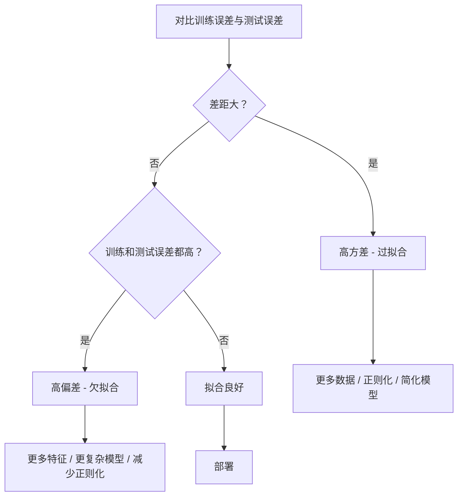
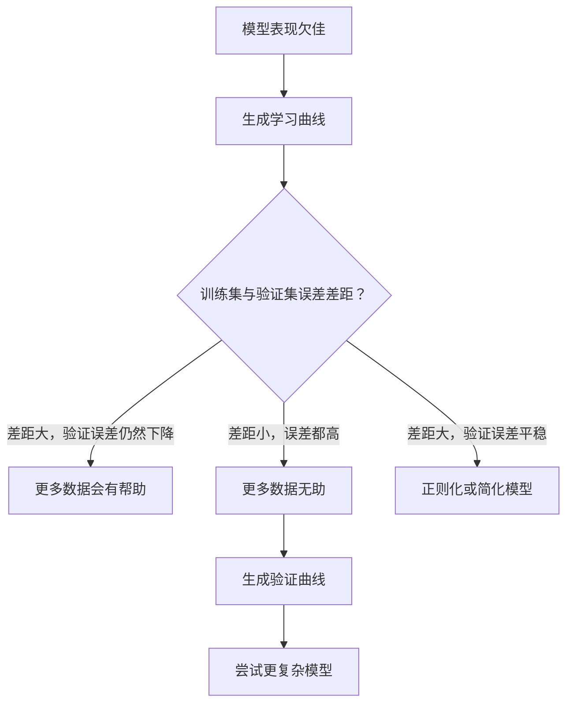

# 偏差-方差权衡（Bias-Variance Tradeoff）

> 每个模型误差都来自三种来源之一：偏差（bias）、方差（variance）或噪声（noise）。你只能控制前两者。

**类型:** 学习  
**语言:** Python  
**先决条件:** 第2阶段，第01-09课（机器学习基础、回归、分类、评估）  
**时间:** 约75分钟

## 学习目标

- 推导期望预测误差的偏差-方差分解，并讲解不可约噪声的作用  
- 通过训练误差和测试误差的模式判断模型是偏差高还是方差高  
- 解释正则化技术（L1、L2、dropout、提前停止）如何在偏差与方差间权衡  
- 实现实验，展示不同复杂度模型的偏差-方差权衡

## 问题描述

你训练了一个模型，在测试数据上存在误差。这个误差来自哪里？

如果你的模型太简单（如对弯曲数据集使用线性回归），它会持续偏离真实模式。这就是偏差。如果你的模型太复杂（15个数据点用20次多项式拟合），它会完美拟合训练数据，但对新数据预测波动很大。这就是方差。

对于固定的模型容量，你无法同时最小化二者。降低偏差，方差上升；降低方差，偏差增加。理解这种权衡是机器学习中最重要的诊断技能。它告诉你模型应该变复杂还是变简单，是否需要更多数据或特征工程，是否增加或减少正则化。

## 概念

### 偏差：系统性误差

偏差衡量模型平均预测与真实值的偏离程度。如果你用多个从同一分布采样的训练集训练相同模型，偏差就是这些预测平均值与真实值之间的差距。

高偏差说明模型过于僵硬，无法捕捉真实模式。拟合抛物线的直线永远无法贴合曲线，不管数据多少。这即是欠拟合。

```text
高偏差（欠拟合）：
  模型始终预测大致相同的错误结果。
  训练误差：高
  测试误差：高
  两者差距：小
```

### 方差：对训练数据的敏感性

方差表示模型在不同训练子集上训练时预测结果变化的大小。训练集变化稍微改变导致模型预测变化很大，则方差高。

高方差意味着模型拟合了训练数据中的噪声而非潜在信号。20次多项式会穿过每个训练点，但在点间剧烈振荡。这是过拟合。

```text
高方差（过拟合）：
  模型完美拟合训练数据，但在新数据上表现差。
  训练误差：低
  测试误差：高
  两者差距：大
```

### 分解定理

对任意点 x，平方损失下的期望预测误差可精确分解为：

```text
期望误差 = 偏差平方 + 方差 + 不可约噪声

其中：
  偏差平方   = (E[f_hat(x)] - f(x))^2
  方差       = E[(f_hat(x) - E[f_hat(x)])^2]
  噪声       = E[(y - f(x))^2]             (sigma^2)
```

- `f(x)` 是真实函数  
- `f_hat(x)` 是模型预测  
- `E[...]` 是对不同训练集的期望  
- `y` 是观测标签（真实函数加噪声）

噪声项是不可约的。对于带噪声的数据，没有模型能优于 sigma^2。你的工作是找到偏差平方和方差之间的平衡。

### 模型复杂度与误差


经典的U型曲线：

| 复杂度 | 偏差 | 方差 | 总误差 |
|--------|------|------|--------|
| 太低   | 高   | 低   | 高（欠拟合）   |
| 适中   | 中   | 中   | 最低   |
| 太高   | 低   | 高   | 高（过拟合）   |

### 正则化作为偏差-方差的调控手段

正则化通过故意增加偏差来降低方差，限制模型追逐噪声。

- **L2（Ridge，岭回归）：** 将所有权重向零收缩。保留所有特征但降低其影响力。  
- **L1（Lasso，套索回归）：** 将部分权重精确压缩为零，执行特征选择。  
- **Dropout（随机失活）：** 训练时随机禁用神经元，强制模型生成冗余表达。  
- **提前停止（Early stopping）：** 在模型完全拟合训练数据前停止训练。

正则化强度（lambda、dropout率、训练轮数）直接控制你在偏差-方差曲线上的位置。正则化越强，偏差越大，方差越小。

### 双重下降：现代视角

经典理论认为：过了理想点，更多复杂度总是损害表现。但2019年以后的研究发现了意外现象。模型容量继续增大到远超插值阈值（模型参数足够完美拟合训练数据）时，测试误差会再次下降。


这种“双重下降”现象解释了为何极度过参数化的神经网络（参数远多于训练样本）仍能很好泛化。经典偏差-方差权衡并非错误，但对现代场景而言是不完整的。

双重下降的关键观察点：  
- 发生在线性模型、决策树和神经网络中  
- 插值区间内更多数据可能反而伤害性能（样本层面双重下降）  
- 更多训练轮数也可出现该现象（轮数层面双重下降）  
- 正则化会平滑峰值，但不消除现象  

原因：插值阈值时，模型刚好有足够容量拟合所有训练点，被迫选取一个穿过所有点的非常特定解，此时对数据微小扰动极为敏感，方差峰值即出现。超过阈值后，模型拥有多种完美拟合训练集的解，学习算法（如带隐式正则化的梯度下降）倾向选择最简单的解，这种对简单解的隐式偏差是过参数化模型泛化良好的原因。

| 阶段 | 参数数量与样本数关系 | 行为表现 |
|--------|------------------|----------|
| 欠参数 | p << n           | 经典权衡适用 |
| 插值阈值 | p ~ n           | 方差最高，测试误差峰值 |
| 过参数 | p >> n           | 隐式正则化生效，误差下降 |

实际建议：如果你在使用神经网络或大型树集成，别只停留在插值阈值。要么明显低于阈值（并显式正则化），要么远远超过阈值。最糟糕的位置就是恰好在阈值。

### 诊断你的模型



| 症状 | 诊断 | 解决方案 |
|-------|--------|-----------|
| 高训练误差，高测试误差 | 偏差高 | 增加特征，复杂模型，减少正则化 |
| 低训练误差，高测试误差 | 方差高 | 更多数据，正则化，简化模型，dropout |
| 低训练误差，低测试误差 | 拟合良好 | 部署 |
| 训练误差降低，测试误差升高 | 过拟合中 | 提前停止 |

### 实践策略

**当偏差为问题时：**  
- 添加多项式或交互特征  
- 使用更灵活的模型（如树集成代替线性模型）  
- 降低正则化强度  
- 延长训练（若未收敛）

**当方差为问题时：**  
- 获取更多训练数据  
- 使用Bagging（随机森林）  
- 增加正则化（更高lambda，更多dropout）  
- 特征选择（剔除噪声特征）  
- 使用交叉验证早期检测

### 集成方法与方差降低

集成方法是降低方差的最实用工具。

**Bagging（自助聚合）** 在不同的bootstrap样本上训练多个模型，再平均它们的预测。单个模型方差高，但平均模型方差低很多。随机森林是对决策树的Bagging。

数学原理：若平均N个独立预测，每个方差为 sigma^2，平均后方差是 sigma^2 / N。模型不完全独立（都看相似数据），产生的方差降低不足1/N，但仍很显著。

**Boosting** 通过顺序构建模型，后续模型聚焦前面模型的错误，降低偏差。梯度提升和AdaBoost是典型例子。Boosting可能过拟合，因此需要提前停止或正则化。

| 方法 | 主要效果 | 偏差变化 | 方差变化 |
|--------|-------------|-----------|-----------|
| Bagging | 降低方差 | 无变化 | 降低 |
| Boosting | 降低偏差 | 降低 | 可能增加 |
| Stacking | 两者均降低 | 依赖元学习器 | 依赖基模型 |
| Dropout | 隐式Bagging | 轻微增加 | 降低 |

**实用规则：** 基模型方差高（深树，高阶多项式）时用Bagging；基模型偏差高（浅树，简单线性）时用Boosting。

### 学习曲线

学习曲线绘制训练误差和验证误差相对于训练集大小的变化，是你最实用的诊断工具。与单一训练/测试误差对比不同，学习曲线显示模型的发展轨迹并告诉你数据是否有助于提升。


解读：

| 情况 | 训练误差 | 验证误差 | 差距 | 意义 | 建议 |
|-------|---------|----------|-------|--------|------|
| 高偏差 | 高 | 高 | 小 | 模型无法捕捉模式 | 增加特征，复杂模型，减少正则化 |
| 高方差 | 低 | 高 | 大 | 模型记忆训练数据 | 更多数据，正则化，简化模型 |
| 拟合良好 | 中等 | 中等 | 小 | 模型泛化良好 | 部署 |
| 高方差且改善中 | 低 | 随数据增加降低 | 缩小 | 方差问题，数据可解决 | 收集更多数据 |
| 高偏差且平稳 | 高 | 高且平稳 | 小且平稳 | 更多数据无效 | 更改模型架构 |

关键见解：如果两条曲线均已趋于平坦，且间隙很小但两个误差都很高，那么更多数据毫无用处。你需要一个更好的模型。如果间隙较大且仍在缩小，更多数据将有帮助。

### 如何生成学习曲线

有两种方法：

**方法 1：变化训练集大小，模型固定。** 保持模型和超参数不变。在训练数据的越来越大子集上训练。测量每个大小下的训练误差和验证误差。这是标准的学习曲线。

**方法 2：变化模型复杂度，数据固定。** 保持数据不变。对复杂度参数（多项式次数、树的深度、层数）进行遍历。测量每个复杂度下的训练误差和验证误差。这是验证曲线，直接显示偏差-方差权衡。

两种方法相辅相成。第一种告诉你更多数据是否有帮助。第二种告诉你是否更换模型有帮助。在决定下一步前，先运行两者。



## 实现

`code/bias_variance.py` 中的代码运行了完整的偏差-方差分解实验。以下是步骤详解。

### 第 1 步：从已知函数生成合成数据

我们使用函数 `f(x) = sin(1.5x) + 0.5x` 添加高斯噪声。有了真实函数，我们可以准确计算偏差和方差。

```python
def true_function(x):
    return np.sin(1.5 * x) + 0.5 * x

def generate_data(n_samples=30, noise_std=0.5, x_range=(-3, 3), seed=None):
    rng = np.random.RandomState(seed)
    x = rng.uniform(x_range[0], x_range[1], n_samples)
    y = true_function(x) + rng.normal(0, noise_std, n_samples)
    return x, y
```

### 第 2 步：Bootstrap 采样和多项式拟合

对每个多项式次数，抽取多个 bootstrap 训练集，拟合多项式，并在一个固定测试网格上记录预测值。这给出了每个测试点预测的分布。

```python
def fit_polynomial(x_train, y_train, degree, lam=0.0):
    X = np.column_stack([x_train ** d for d in range(degree + 1)])
    if lam > 0:
        penalty = lam * np.eye(X.shape[1])
        penalty[0, 0] = 0
        w = np.linalg.solve(X.T @ X + penalty, X.T @ y_train)
    else:
        w = np.linalg.lstsq(X, y_train, rcond=None)[0]
    return w
```

我们在 200 个不同 bootstrap 样本上拟合。每个 bootstrap 样本均来自相同的基础分布但含不同点。

### 第 3 步：计算 Bias^2，方差分解

有了每个测试点 200 组预测结果后，可直接从定义计算分解：

```python
mean_pred = predictions.mean(axis=0)
bias_sq = np.mean((mean_pred - y_true) ** 2)
variance = np.mean(predictions.var(axis=0))
total_error = np.mean(np.mean((predictions - y_true) ** 2, axis=1))
```

- `mean_pred` 是从 bootstrap 样本估计的预测期望 E[f_hat(x)]
- `bias_sq` 是平均预测与真实值间的平方误差
- `variance` 是预测在 bootstrap 样本间的平均波动幅度
- `total_error` 应近似等于 bias^2 + variance + 噪声

### 第 4 步：学习曲线

学习曲线扫描训练集大小，同时保持模型复杂度固定。它展示模型是数据受限还是容量受限。

```python
def demo_learning_curves():
    sizes = [10, 15, 20, 30, 50, 75, 100, 150, 200, 300]
    degree = 5

    for n in sizes:
        train_errors = []
        test_errors = []
        for seed in range(50):
            x_train, y_train = generate_data(n_samples=n, seed=seed * 100)
            w = fit_polynomial(x_train, y_train, degree)
            train_pred = predict_polynomial(x_train, w)
            train_mse = np.mean((train_pred - y_train) ** 2)
            test_pred = predict_polynomial(x_test, w)
            test_mse = np.mean((test_pred - y_test) ** 2)
            train_errors.append(train_mse)
            test_errors.append(test_mse)
        # 多次运行的平均即为学习曲线点
```

对于高方差模型（次数 5 且样本较少），你会看到：  
- 训练误差开始很低，随着数据增多记忆变难而增加  
- 测试误差开始很高，随着模型获得更多信号而降低  
- 间隙随数据增多而缩小

对于高偏差模型（次数 1），两个误差快速收敛至同一较高值，更多数据无帮助。

### 第 5 步：正则化扫描

代码还包含 `demo_regularization_sweep()`，其针对一个高次数多项式（次数 15），扫描 Ridge 正则化强度从 0.001 到 100，展现偏差-方差权衡的另一视角：不变化模型复杂度，而变化约束强度。

```python
def demo_regularization_sweep():
    alphas = [0.001, 0.005, 0.01, 0.05, 0.1, 0.5, 1.0, 5.0, 10.0, 50.0, 100.0]
    for alpha in alphas:
        results = bias_variance_decomposition([15], lam=alpha)
        r = results[15]
        print(f"alpha={alpha:.3f}  bias={r['bias_sq']:.4f}  var={r['variance']:.4f}")
```

当 alpha 很小时，多项式几乎无约束。方差占主导，因为模型在每个 bootstrap 样本中拟合噪声。alpha 很大时，约束极强，模型趋近常数函数。偏差占主导。最佳 alpha 位于两者之间。

这与变化多项式次数得到的 U 曲线相同，但用一个连续旋钮代替离散选择。实际中，正则化是首选的权衡控制方式，因为它支持细粒度调节，而不改变特征集。

## 使用方法

sklearn 提供了 `learning_curve` 和 `validation_curve`，可自动化这些诊断，无需编写 bootstrap 循环。

### 验证曲线：扫描模型复杂度

```python
from sklearn.model_selection import validation_curve
from sklearn.pipeline import make_pipeline
from sklearn.preprocessing import PolynomialFeatures
from sklearn.linear_model import Ridge

degrees = list(range(1, 16))
train_scores_all = []
val_scores_all = []

for d in degrees:
    pipe = make_pipeline(PolynomialFeatures(d), Ridge(alpha=0.01))
    train_scores, val_scores = validation_curve(
        pipe, X, y, param_name="polynomialfeatures__degree",
        param_range=[d], cv=5, scoring="neg_mean_squared_error"
    )
    train_scores_all.append(-train_scores.mean())
    val_scores_all.append(-val_scores.mean())
```

这样直接得到偏差-方差权衡曲线。验证分数相较训练分数最差处为方差主导。两者都差则为偏差主导。

### 学习曲线：扫描训练集大小

```python
from sklearn.model_selection import learning_curve

pipe = make_pipeline(PolynomialFeatures(5), Ridge(alpha=0.01))
train_sizes, train_scores, val_scores = learning_curve(
    pipe, X, y, train_sizes=np.linspace(0.1, 1.0, 10),
    cv=5, scoring="neg_mean_squared_error"
)
train_mse = -train_scores.mean(axis=1)
val_mse = -val_scores.mean(axis=1)
```

绘制 `train_mse` 和 `val_mse` 对训练集大小的曲线。曲线形状揭示模型的全部信息。

### 正则化扫描的交叉验证

```python
from sklearn.model_selection import cross_val_score

alphas = [0.001, 0.01, 0.1, 1.0, 10.0, 100.0]
for alpha in alphas:
    pipe = make_pipeline(PolynomialFeatures(10), Ridge(alpha=alpha))
    scores = cross_val_score(pipe, X, y, cv=5, scoring="neg_mean_squared_error")
    print(f"alpha={alpha:>7.3f}  MSE={-scores.mean():.4f} +/- {scores.std():.4f}")
```

这对固定模型复杂度扫描正则化强度。你会看到同样的偏差-方差权衡：低 alpha 导致高方差，高 alpha 导致高偏差。

### 综合：完整诊断流程

实际中按顺序运行：

1. 训练模型，计算训练和测试误差。  
2. 如果两者都高：偏差问题。跳到第 4 步。  
3. 如果训练误差低且测试误差高：方差问题。生成学习曲线看更多数据是否有帮助。没有则正则化。  
4. 生成侧重主要复杂度参数的验证曲线，找到最佳点。  
5. 在最佳点生成学习曲线。如果间隙仍大，需更多数据或正则化。  
6. 用 `cross_val_score` 试 Ridge/Lasso 不同 alpha，选择交叉验证误差最低的 alpha。

对大多数表格数据集，这会花费 10–15 分钟计算，节省数小时的调试时间。

## 交付物

本课程产生：`outputs/prompt-model-diagnostics.md`

## 练习

1. 使用 `noise_std=0`（无噪声）运行分解。不可约误差项如何变化？最佳复杂度是否改变？

2. 将训练集大小从 30 增加到 300。方差分量如何变化？最佳多项式次数是否变化？

3. 在实验中添加 L2 正则化（Ridge 回归）。对固定高次数多项式（次数 15），扫描 lambda 从 0 到 100。绘制 bias^2 和方差关于 lambda 的函数曲线。

4. 将真实函数改为 `sin(x)`，偏差-方差分解如何变化？是否仍有明显的最佳次数？

5. 实现简单的 bootstrap 聚合（bagging）包装器：在 bootstrap 样本上训练 10 个模型并平均预测。展示此方法怎样在不增加太多偏差的情况下降低方差。

## 关键词

| 术语 | 普通说法 | 实际含义 |
|------|----------|----------|
| Bias（偏差） | “模型太简单” | 由错误假设产生的系统误差。平均模型预测与真实值的差距。 |
| Variance（方差） | “模型过拟合” | 由于对训练数据敏感而产生的误差。不同训练集时预测的变化程度。 |
| Irreducible error（不可约误差） | “数据中的噪声” | 真实数据生成过程中的随机误差。任何模型都无法消除。 |
| Underfitting（欠拟合） | “学习不足” | 模型偏差高，甚至在训练数据上都未捕捉真实模式。 |
| Overfitting（过拟合） | “记忆训练数据” | 模型方差高，捕获训练数据的噪声，无法很好泛化。 |
| Regularization（正则化） | “约束模型” | 加入惩罚项减少模型复杂度，以偏差换取更低方差。 |
| Double descent（双重下降） | “更多参数有利” | 当模型容量远超插值阈值时，测试误差重新下降。 |
| Model complexity（模型复杂度） | “模型灵活度” | 模型拟合任意模式的能力。受架构、特征或正则化控制。 |

## 进一步阅读

- [Hastie, Tibshirani, Friedman: Elements of Statistical Learning, 第7章](https://hastie.su.domains/ElemStatLearn/) — 偏差-方差分解的权威著作  
- [Belkin 等，Reconciling modern machine learning practice and the bias-variance trade-off (2019)](https://arxiv.org/abs/1812.11118) — 双重下降论文  
- [Nakkiran 等，Deep Double Descent (2019)](https://arxiv.org/abs/1912.02292) — 逐轮和逐样本的双重下降  
- [Scott Fortmann-Roe: 理解偏差-方差权衡](http://scott.fortmann-roe.com/docs/BiasVariance.html) — 清晰的可视化解释
