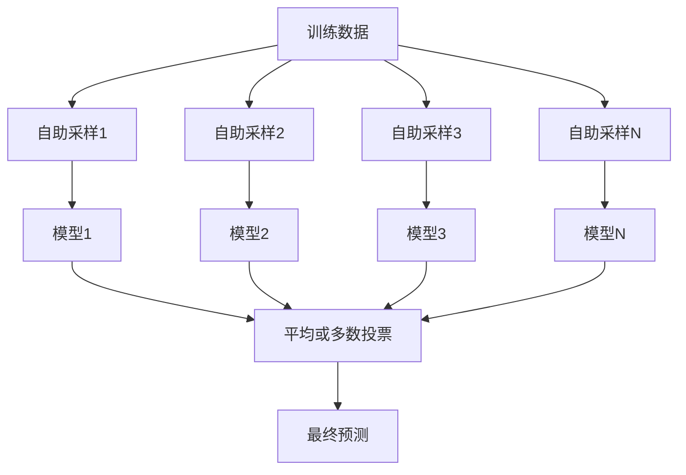
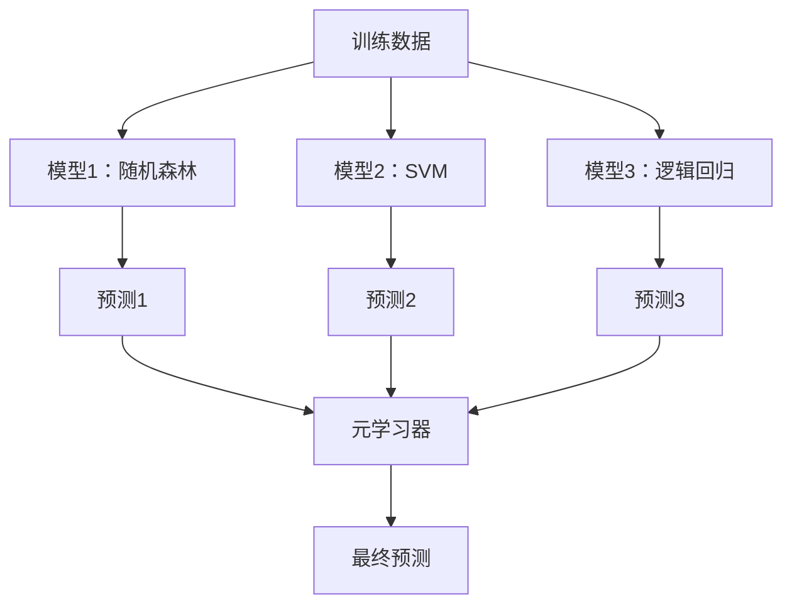

# 集成方法

> 一组弱学习器，正确组合后，变成一个强学习器。这不是比喻。它是一个定理。

**类型:** 构建  
**语言:** Python  
**先修知识:** 第二阶段，第10课（偏差-方差权衡）  
**时间:** 约120分钟

## 学习目标

- 从头实现 AdaBoost 和梯度提升（gradient boosting），并解释提升是如何通过序列式减少偏差的  
- 构建一个 Bagging 集成，并演示平均未相关模型如何降低方差而不增加偏差  
- 比较 Bagging、Boosting 和 Stacking，了解每种方法针对的误差成分  
- 评估集成的多样性，并解释为何多数投票准确率随着独立弱学习器数量增加而提升  

## 问题描述

单棵决策树训练快速且易于解释，但容易过拟合。单一线性模型在复杂边界上欠拟合。你可以花几天时间设计完美模型结构，或者把一堆不完美的模型结合起来，得到比单独任何一个都好的结果。

集成方法正是做到这一点。它们是赢得 Kaggle 表格数据竞赛的最可靠技术，驱动着大多数生产环境的机器学习系统，并且生动展示了偏差-方差权衡。Bagging 降低方差，Boosting 降低偏差，Stacking 学习在什么输入上信任哪个模型。

## 概念

### 集成为何有效

假设你有 N 个独立分类器，每个准确率 p > 0.5。多数投票的准确率为：

```text
P(多数正确) = 对 k > N/2 的求和 C(N,k) * p^k * (1-p)^(N-k)
```

对21个准确率60%的分类器，多数投票准确率约为74%。101个时，提升到84%。当模型犯不同错误时，误差会相互抵消。

关键要求是**多样性**。如果所有模型犯相同错误，组合没有意义。集成产生多样模型，通过：

- 不同训练子集（Bagging）  
- 不同特征子集（随机森林）  
- 序列错误校正（Boosting）  
- 不同模型家族（Stacking）  

### Bagging（自助聚合）

Bagging 通过对训练数据进行自助采样（bootstrap）来制造多样性，对每个模型使用不同的采样数据。



自助采样是从原始数据中有放回抽取，样本大小与原始数据相同。每个采样中约63.2%的样本是唯一的，剩余36.8%为袋外样本（out-of-bag），可作为免费验证集。

Bagging 降低方差且几乎不增加偏差。每棵树在其采样数据上过拟合，但不同树的过拟合不同，平均后噪声被抵消。

**随机森林（Random Forests）** 是带有额外变体的 Bagging：每次划分只考虑随机选取的特征子集。这进一步增强了树之间的多样性。分类时典型特征数量为 `sqrt(n_features)`，回归时为 `n_features / 3`。

### Boosting（序列错误校正）

Boosting 按顺序训练模型。每个新模型关注前面模型错误的样本。


Boosting 减少偏差。每个新模型校正现有集成的系统性错误。最终预测是所有模型加权和，权重越好的模型越大。

权衡点：Boosting 迭代过多时可能过拟合，因为它越来越专注于难以拟合的样本，可能包含噪声。

### AdaBoost

AdaBoost（自适应提升）是第一个实用的 Boosting 算法。它适用于任何基学习器，通常是决策桩（深度为1的树）。

算法：

```text
1. 初始化样本权重：w_i = 1/N （对所有样本）

2. 对 t = 1 到 T：
   a. 使用有权重的数据训练弱学习器 h_t
   b. 计算加权误差：
      err_t = sum(w_i * I(h_t(x_i) != y_i)) / sum(w_i)
   c. 计算模型权重：
      alpha_t = 0.5 * ln((1 - err_t) / err_t)
   d. 更新样本权重：
      w_i = w_i * exp(-alpha_t * y_i * h_t(x_i))
   e. 归一化权重使之和为1

3. 最终预测：H(x) = sign(sum(alpha_t * h_t(x)))
```

误差小的模型拥有更大 alpha。被误分类样本权重增加，使后续模型更重视它们。

### 梯度提升（Gradient Boosting）

梯度提升推广了 Boosting 到任意损失函数。它不是直接重加权样本，而是拟合当前集成模型损失的负梯度（即残差）。

```text
1. 初始化：F_0(x) = argmin_c sum(L(y_i, c))

2. 对 t = 1 到 T：
   a. 计算伪残差：
      r_i = -dL(y_i, F_{t-1}(x_i)) / dF_{t-1}(x_i)
   b. 用回归树 h_t 拟合残差 r_i
   c. 求最优步长：
      gamma_t = argmin_gamma sum(L(y_i, F_{t-1}(x_i) + gamma * h_t(x_i)))
   d. 更新：
      F_t(x) = F_{t-1}(x) + learning_rate * gamma_t * h_t(x)

3. 最终预测：F_T(x)
```

针对平方误差损失，伪残差就是实际残差：`r_i = y_i - F_{t-1}(x_i)`。每棵树真正拟合的是前一轮的误差。

学习率（收缩率）决定每棵树的贡献大小。学习率越小，需要的树越多，但泛化能力越好。典型值：0.01 到 0.3。

### XGBoost：为何它统治表格数据

XGBoost（eXtreme Gradient Boosting）是在梯度提升基础上的工程优化，使其快速、准确且抗过拟合：

- **正则化目标**：对叶子权重施加 L1 和 L2 惩罚，防止单树过度自信  
- **二阶近似**：使用损失的一阶和二阶导数，提升分裂决策质量  
- **稀疏感知分裂**：原生处理缺失值，学习缺失数据分裂的最佳方向  
- **列采样**：类似随机森林，每次分裂时随机采样特征，增强多样性  
- **加权分位数草图**：分布式数据上高效寻找连续特征分裂点  
- **缓存感知块结构**：内存布局优化匹配 CPU 缓存行  

对于表格数据，XGBoost（及其继任 LightGBM）持续优于神经网络。短期内不会改变。如果你的数据适合以行列形式存储，建议从梯度提升开始。

### Stacking（元学习）

Stacking 利用多个基模型的预测作为特征，训练一个元学习器。



元学习器学习在不同输入上信任哪个基模型。如果随机森林在某些区域表现更好，SVM 在其他区域表现更好，元学习器会学会相应分配预测权重。

为避免数据泄漏，基模型的预测必须通过训练集交叉验证生成。决不能在同一数据上训练基模型又生成元特征。

### 投票法（Voting）

最简单的集成方法。直接组合预测结果。

- **硬投票**：基于类别标签的多数投票  
- **软投票**：平均概率预测，选择平均概率最高类别。通常更优，因为它利用了置信度信息。  

## 构建实践

### 步骤1：决策桩（基学习器）

`code/ensembles.py` 文件中实现了全部代码。我们从决策桩开始：一棵只有一次划分的树。

```python
class DecisionStump:
    def __init__(self):
        self.feature_idx = None
        self.threshold = None
        self.polarity = 1
        self.alpha = None

    def fit(self, X, y, weights):
        n_samples, n_features = X.shape
        best_error = float("inf")

        for f in range(n_features):
            thresholds = np.unique(X[:, f])
            for thresh in thresholds:
                for polarity in [1, -1]:
                    pred = np.ones(n_samples)
                    pred[polarity * X[:, f] < polarity * thresh] = -1
                    error = np.sum(weights[pred != y])
                    if error < best_error:
                        best_error = error
                        self.feature_idx = f
                        self.threshold = thresh
                        self.polarity = polarity

    def predict(self, X):
        n = X.shape[0]
        pred = np.ones(n)
        idx = self.polarity * X[:, self.feature_idx] < self.polarity * self.threshold
        pred[idx] = -1
        return pred
```

### 步骤2：从头实现 AdaBoost

```python
class AdaBoostScratch:
    def __init__(self, n_estimators=50):
        self.n_estimators = n_estimators
        self.stumps = []
        self.alphas = []

    def fit(self, X, y):
        n = X.shape[0]
        weights = np.full(n, 1 / n)

        for _ in range(self.n_estimators):
            stump = DecisionStump()
            stump.fit(X, y, weights)
            pred = stump.predict(X)

            err = np.sum(weights[pred != y])
            err = np.clip(err, 1e-10, 1 - 1e-10)

            alpha = 0.5 * np.log((1 - err) / err)
            weights *= np.exp(-alpha * y * pred)
            weights /= weights.sum()

            stump.alpha = alpha
            self.stumps.append(stump)
            self.alphas.append(alpha)

    def predict(self, X):
        total = sum(a * s.predict(X) for a, s in zip(self.alphas, self.stumps))
        return np.sign(total)
```

### 步骤3：从头实现梯度提升

```python
class GradientBoostingScratch:
    def __init__(self, n_estimators=100, learning_rate=0.1, max_depth=3):
        self.n_estimators = n_estimators
        self.lr = learning_rate
        self.max_depth = max_depth
        self.trees = []
        self.initial_pred = None

    def fit(self, X, y):
        self.initial_pred = np.mean(y)
        current_pred = np.full(len(y), self.initial_pred)

        for _ in range(self.n_estimators):
            residuals = y - current_pred
            tree = SimpleRegressionTree(max_depth=self.max_depth)
            tree.fit(X, residuals)
            update = tree.predict(X)
            current_pred += self.lr * update
            self.trees.append(tree)

    def predict(self, X):
        pred = np.full(X.shape[0], self.initial_pred)
        for tree in self.trees:
            pred += self.lr * tree.predict(X)
        return pred
```

### 第4步：与 sklearn 对比

代码验证了我们从零实现的算法与 sklearn 的 `AdaBoostClassifier` 和 `GradientBoostingClassifier` 产生的准确率相似，并将所有方法并排比较。

## 使用指南

### 何时使用每种方法

| 方法 | 降低 | 适合 | 注意事项 |
|--------|---------|----------|---------------|
| Bagging / 随机森林（Random Forest） | 方差 | 噪声数据，特征较多 | 不改善偏差 |
| AdaBoost | 偏差 | 干净数据，简单基学习器 | 对异常值和噪声敏感 |
| 梯度提升（Gradient Boosting） | 偏差 | 表格数据，竞赛 | 训练较慢，未经调参易过拟合 |
| XGBoost / LightGBM | 两者 | 生产环境表格机器学习 | 超参数较多 |
| Stacking（堆叠） | 两者 | 追求最后1-2%的准确率 | 复杂，元学习器易过拟合 |
| Voting（投票） | 方差 | 快速组合多样模型 | 仅当模型多样时有效 |

### 表格数据的生产堆栈方案

对于大多数表格预测问题，尝试的顺序为：

1. 使用默认参数的 **LightGBM 或 XGBoost**
2. 调整 n_estimators, learning_rate, max_depth, min_child_weight
3. 若需争取最后0.5%的提升，构建包含3-5个多样基模型的堆叠集成
4. 全过程使用交叉验证

神经网络在表格数据上的表现几乎总是输给梯度提升，尽管不断有研究尝试。TabNet、NODE及类似架构偶尔能匹配，但很少超越调整良好的XGBoost。

## 部署

本课程会生成 `outputs/prompt-ensemble-selector.md` —— 该prompt帮助你为特定数据集选择合适的集成方法。描述你的数据（规模、特征类型、噪声水平、类别平衡）和解决的问题。prompt会通过决策清单推荐方法、起始超参数并提醒该方法的常见错误。同时生成 `outputs/skill-ensemble-builder.md` ，包含完整的选择指南。

## 练习

1. 修改 AdaBoost 实现，跟踪每轮训练后的准确率。绘制准确率与基学习器数量的关系曲线。何时收敛？

2. 从头实现随机森林，方式是在回归树中加入随机特征子采样。训练100棵树，`max_features=sqrt(n_features)`，对预测结果取平均。比较方差降低效果与单棵树。

3. 在梯度提升实现中加入早停法：每轮记录验证集损失，若连续10轮未改善则停止。实际需要多少棵树？

4. 构建堆叠集成，使用三个基础模型（逻辑回归、决策树、k近邻）和一个逻辑回归元学习器。用5折交叉验证生成元特征。与单基模型比较。

5. 在相同数据集用默认参数运行XGBoost，比较其准确率与你自实现的梯度提升。计时对比，两者速度差多少？

## 关键词

| 词汇 | 普通说法 | 实际含义 |
|------|----------------|-------------------|
| Bagging | “在随机子集上训练” | 自助法聚合（bootstrap aggregating）：在自助样本上训练模型，平均预测减少方差 |
| Boosting | “关注难样本” | 序列训练模型，每个纠正当前集成的错误，减少偏差 |
| AdaBoost | “重新加权数据” | 通过样本权重更新实现的提升；错误分类点获得更高权重供下一学习器 |
| 梯度提升（Gradient boosting） | “拟合残差” | 通过拟合损失函数负梯度训练新模型 |
| XGBoost | “Kaggle的利器” | 带正则化、二阶优化和系统层加速技巧的梯度提升 |
| Stacking | “模型叠加模型” | 使用基学习器预测作为元学习器输入特征 |
| 随机森林（Random forest） | “多颗随机树” | 决策树的装袋方法，每次分裂时随机采样特征提高多样性 |
| 集成多样性（Ensemble diversity） | “让模型犯不同的错误” | 模型错误应非相关，集成才能超越单模型 |
| 包外误差（Out-of-bag error） | “免费验证” | 自助样本外的样本（约占36.8%）作为验证集，不需留出数据 |

## 深入阅读

- [Schapire & Freund: Boosting: Foundations and Algorithms](https://mitpress.mit.edu/9780262526036/) —— AdaBoost创始人的专著
- [Friedman: Greedy Function Approximation: A Gradient Boosting Machine (2001)](https://statweb.stanford.edu/~jhf/ftp/trebst.pdf) —— 梯度提升原始论文
- [Chen & Guestrin: XGBoost (2016)](https://arxiv.org/abs/1603.02754) —— XGBoost论文
- [Wolpert: Stacked Generalization (1992)](https://www.sciencedirect.com/science/article/abs/pii/S0893608005800231) —— 堆叠算法原创论文
- [scikit-learn 集成方法](https://scikit-learn.org/stable/modules/ensemble.html) —— 实用参考文档
