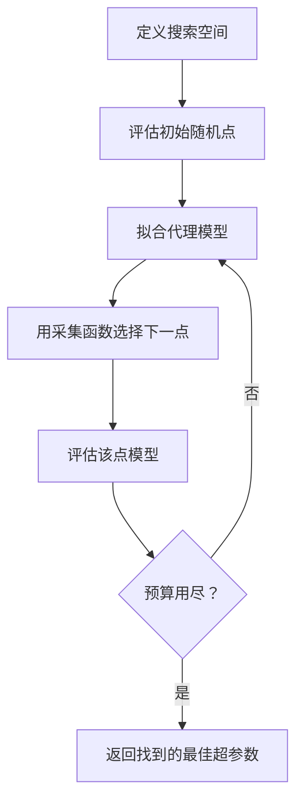
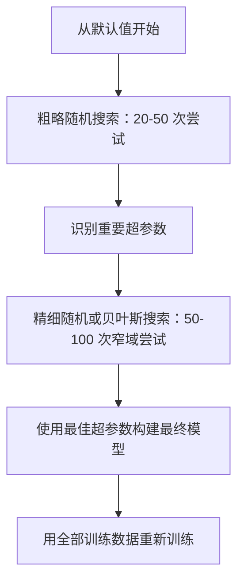
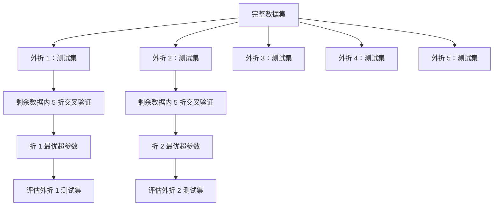

# 超参数调优（Hyperparameter Tuning）

> 超参数是在训练开始前设置的旋钮。调节得当，是平庸模型和优秀模型的区别。

**类型：** 构建  
**语言：** Python  
**先修内容：** 阶段 2，第 11 课（集成方法）  
**时间：** 约 90 分钟

## 学习目标

- 从零实现网格搜索（grid search）、随机搜索（random search）和贝叶斯优化（Bayesian optimization），并比较它们的样本效率  
- 解释为何当大多数超参数的有效维度较低时，随机搜索优于网格搜索  
- 使用代理模型和采集函数构建贝叶斯优化循环以指导搜索  
- 设计超参数调优策略，通过合适的交叉验证避免验证集过拟合  

## 问题描述

你的梯度提升（gradient boosting）模型有学习率（learning rate）、树的数量、最大深度、每叶节点的最小样本数、子样本比率以及列采样比率，这有六个超参数。如果每个参数有 5 个合理取值，则网格组合数为 \(5^6 = 15,625\) 种。每次训练需 10 秒，总共计算时间为 43 小时。

网格搜索显然是最直接的方案，却是大规模时最差的。随机搜索用更少的计算提高效果。贝叶斯优化通过学习过去的评估表现做得更好。知道用哪种策略，哪些超参数重要，能节省数天宝贵的 GPU 时间。

## 概念介绍

### 参数 vs 超参数

参数是在训练中学习得到的（权重、偏置、分裂阈值）；超参数是在训练开始前设定的，用来控制学习过程。

| 超参数      | 控制内容          | 典型范围         |
|-------------|-------------------|------------------|
| Learning rate（学习率） | 每次更新的步长      | 0.001 到 1.0      |
| Number of trees/epochs（树数/轮数） | 训练时长           | 10 到 10,000      |
| Max depth（最大深度）     | 模型复杂度          | 1 到 30           |
| Regularization (lambda)（正则化） | 防止过拟合          | 0.0001 到 100     |
| Batch size（批大小）      | 梯度估计的噪声大小    | 16 到 512         |
| Dropout rate（丢弃率）    | 丢弃神经元的比例      | 0.0 到 0.5        |

### 网格搜索（Grid Search）

网格搜索评估指定值的每一个组合，方式穷尽且易理解，但随着超参数数量增加，计算量呈指数增长。

```text
2 个超参数的网格：

  learning_rate: [0.01, 0.1, 1.0]
  max_depth:     [3, 5, 7]

  组合数: 3 x 3 = 9

  (0.01, 3)  (0.01, 5)  (0.01, 7)
  (0.1,  3)  (0.1,  5)  (0.1,  7)
  (1.0,  3)  (1.0,  5)  (1.0,  7)
```

网格搜索的根本缺陷是：如果一个超参数重要，另一个不重要，大部分评估会浪费。9 次评估只得到重要参数的 3 个独特值。

### 随机搜索（Random Search）

随机搜索从分布中采样超参数，而非枚举网格。用相同的 9 次评估，可以得到每个超参数的 9 个独特值。

```mermaid
flowchart LR
    subgraph 网格搜索（Grid Search）
        G1[3 个独特的学习率]
        G2[3 个独特的最大深度]
        G3[共 9 次评估]
    end

    subgraph 随机搜索（Random Search）
        R1[9 个独特的学习率]
        R2[9 个独特的最大深度]
        R3[共 9 次评估]
    end
```

随机搜索优于网格搜索（Bergstra & Bengio，2012 年）原因：

- 大多数超参数有效维度较低。通常只有 1-2 个在问题中最重要。  
- 网格搜索在没用的维度浪费评估机会。  
- 随机搜索在同预算下更密集地覆盖重要维度。  
- 60 次随机试验中有 95% 机会找到距离最优点 5% 内的值（如果搜索空间存在该点）。

### 贝叶斯优化（Bayesian Optimization）

随机搜索忽略评估结果，不学习高学习率导致发散或深度 3 总优于深度 10。贝叶斯优化用过去评估结果决定下一次搜索位置。



两个核心组件：

**代理模型（Surrogate model）：** 低成本评估模型（通常为高斯过程），对昂贵的目标函数进行近似，能在搜索空间任一点给出预测和不确定度估计。

**采集函数（Acquisition function）：** 通过平衡利用（在已知优点附近搜索）和探索（高不确定区域搜索）确定下一评估点。常用采集函数包括：

- **期望改进（Expected Improvement, EI）：** 预计在该点相较当前最优能提升多少。  
- **上置信界（Upper Confidence Bound, UCB）：** 预测值加上不确定度乘数。UCB 高说明点要么有潜力要么未探索。  
- **改进概率（Probability of Improvement, PI）：** 该点超越当前最优的概率。

贝叶斯优化通常比随机搜索用 2-5 倍更少评估找到更优超参数。拟合代理模型的开销与训练主模型相比可忽略不计。

### 提前停止（Early Stopping）

训练不必全部完成。如果配置在 10 轮后明显表现差，应停止并跳过。即超参数搜索中的提前停止。

策略包括：  
- **耐心机制：** 验证损失连续 N 轮无改善则停止。  
- **中位数剪枝：** 若当前试验结果比同轮次已完成试验中位数差则停止。  
- **Hyperband：** 给很多配置短预算，保留优质配置增加预算，迭代进行。

Hyperband 效果尤佳。开始 81 个配置，每个 1 轮，保留三分之一，继续 3 轮，保留三分之一，对优质配置累计预算。速度比全预算评估快 10-50 倍。

### 学习率调度器（Learning Rate Schedulers）

学习率几乎总是最重要的超参数。调度器使学习率随训练动态调整。

| 调度器     | 公式                                   | 适用场景          |
|------------|--------------------------------------|-------------------|
| 步进衰减（Step decay） | 每 N 轮乘以 0.1                          | 传统卷积网络训练    |
| 余弦退火（Cosine annealing） | lr * 0.5 * (1 + cos(π * t / T))          | 现代默认           |
| 预热加衰减（Warmup + decay） | 线性增长后余弦衰减                       | Transformer 类模型  |
| 单周期（一周期，One-cycle） | 先增后减，单周期内完成                     | 快速收敛           |
| 平台期降低（Reduce on plateau） | 指标停滞时按比例减小                       | 安全默认           |

### 超参数重要性

并非所有超参数同等重要。随机森林（Probst 等，2019）和梯度提升研究显示一致规律：

**高重要性：**  
- 学习率（总是优先调）  
- 估计器数量 / 训练轮数（用提前停止替代调节）  
- 正则化强度  

**中等重要性：**  
- 最大深度 / 层数  
- 叶结点最小样本数 / 权重衰减  
- 子样本比率  

**低重要性：**  
- 最大特征数（随机森林）  
- 激活函数的具体选择  
- 合理范围内的批大小  

优先调节重要的超参数，其他超参数保持默认。

### 实践策略



具体工作流程：

1. **从库默认值开始。** 这些由经验丰富者选择，通常已有 80% 的效果。  
2. **粗略随机搜索。** 宽泛范围，20-50 次尝试。用提前停止快速终止差的训练。  
3. **分析结果。** 哪些超参数与性能相关？缩小搜索空间。  
4. **精细搜索。** 借助贝叶斯优化或聚焦随机搜索，50-100 次尝试。  
5. **用全部训练数据** 用找到的最佳超参数重新训练。

### 交叉验证集成

在单一验证集上调参风险大，最佳超参数可能会过拟合特定验证折。嵌套交叉验证（nested cross-validation）用两个循环解决：

- **外循环**（评估）：分割数据为训练+验证集和测试集，报告无偏性能。  
- **内循环**（调优）：将训练+验证拆分为训练和验证，寻找最佳超参数。



每个外折独立寻找最优超参数，外得分是泛化性能无偏估计。

用 sklearn 实现：

```python
from sklearn.model_selection import cross_val_score, GridSearchCV
from sklearn.ensemble import GradientBoostingRegressor

inner_cv = GridSearchCV(
    GradientBoostingRegressor(),
    param_grid={
        "learning_rate": [0.01, 0.05, 0.1],
        "max_depth": [2, 3, 5],
        "n_estimators": [50, 100, 200],
    },
    cv=5,
    scoring="neg_mean_squared_error",
)

outer_scores = cross_val_score(
    inner_cv, X, y, cv=5, scoring="neg_mean_squared_error"
)

print(f"Nested CV 均方误差: {-outer_scores.mean():.4f} +/- {outer_scores.std():.4f}")
```

代价较高（5 外折 × 5 内折 × 27 网格点 = 675 次模型训练），但带来可信性能估计。适合论文报告最终结果和高风险决策。

### 实用技巧

**从学习率开始调。** 学习率始终是梯度方法中最重要的超参数。学习率差错会使其他参数无意义。先固定其他超参数，先扫学习率。

**对学习率和正则化用对数均匀分布采样。** 0.001 和 0.01 的差别跟 0.1 和 1.0 一样重要。线性搜索在大值段浪费预算。

**用提前停止代替调节估计器数量。** 对提升法和神经网络，将轮数设高，让提前停止决定训练终止时刻，减少需要搜索的超参数。

**预算分配。** 将 60% 的预算用于两个最重要的超参数，剩下 40% 用于其他超参数。前两者决定了大部分性能变化。

**尺度很重要。** 批大小不要用对数尺度搜索（16、32、64 等即可）。学习率一定要用对数尺度。搜索分布应与超参数对模型影响匹配。

| 模型类型         | 重要超参数                  | 推荐搜索方法                      | 预算        |
|------------------|-----------------------------|---------------------------------|-------------|
| 随机森林          | n_estimators, max_depth, min_samples_leaf | 随机搜索，50 次尝试               | 低（训练快）  |
| 梯度提升          | learning_rate, n_estimators, max_depth    | 贝叶斯优化，100 次尝试 + 提前停止   | 中          |
| 神经网络          | learning_rate, weight_decay, batch_size   | 贝叶斯或随机搜索，100+ 次尝试       | 高（训练慢）  |
| 支持向量机 (SVM)  | C, gamma (RBF 内核)                     | 对数尺度网格搜索，25-50 次尝试       | 低（2 个参数）|
| Lasso/Ridge       | alpha                           | 1D 对数尺度搜索，20 次尝试         | 非常低       |
| XGBoost           | learning_rate, max_depth, subsample, colsample | 贝叶斯优化，100-200 次尝试 + 提前停止 | 中          |

**当有疑问时：** 使用随机搜索（random search），试验次数为超参数数量的 2 倍（例如，6 个超参数 = 最少 12 次试验）。你会惊讶于，在 50 次试验的随机搜索中，效果经常超过精心设计的网格搜索（grid search）。

## 实现它

### 步骤 1：从零实现网格搜索（Grid Search）

`code/tuning.py` 中的代码实现了网格搜索、随机搜索以及一个简单的贝叶斯优化器（Bayesian optimizer）。

```python
def grid_search(model_fn, param_grid, X_train, y_train, X_val, y_val):
    keys = list(param_grid.keys())
    values = list(param_grid.values())
    best_score = -float("inf")
    best_params = None
    n_evals = 0

    for combo in itertools.product(*values):
        params = dict(zip(keys, combo))
        model = model_fn(**params)
        model.fit(X_train, y_train)
        score = evaluate(model, X_val, y_val)
        n_evals += 1

        if score > best_score:
            best_score = score
            best_params = params

    return best_params, best_score, n_evals
```

### 步骤 2：从零实现随机搜索（Random Search）

```python
def random_search(model_fn, param_distributions, X_train, y_train,
                  X_val, y_val, n_iter=50, seed=42):
    rng = np.random.RandomState(seed)
    best_score = -float("inf")
    best_params = None

    for _ in range(n_iter):
        params = {k: sample(v, rng) for k, v in param_distributions.items()}
        model = model_fn(**params)
        model.fit(X_train, y_train)
        score = evaluate(model, X_val, y_val)

        if score > best_score:
            best_score = score
            best_params = params

    return best_params, best_score, n_iter
```

### 步骤 3：贝叶斯优化（简化实现）

核心思想：用高斯过程（Gaussian process）拟合观察到的（超参数，分数）对，然后用采集函数（acquisition function）决定下一步的搜索点。

```python
class SimpleBayesianOptimizer:
    def __init__(self, search_space, n_initial=5):
        self.search_space = search_space
        self.n_initial = n_initial
        self.X_observed = []
        self.y_observed = []

    def _kernel(self, x1, x2, length_scale=1.0):
        dists = np.sum((x1[:, None, :] - x2[None, :, :]) ** 2, axis=2)
        return np.exp(-0.5 * dists / length_scale ** 2)

    def _fit_gp(self, X_new):
        X_obs = np.array(self.X_observed)
        y_obs = np.array(self.y_observed)
        y_mean = y_obs.mean()
        y_centered = y_obs - y_mean

        K = self._kernel(X_obs, X_obs) + 1e-4 * np.eye(len(X_obs))
        K_star = self._kernel(X_new, X_obs)

        L = np.linalg.cholesky(K)
        alpha = np.linalg.solve(L.T, np.linalg.solve(L, y_centered))
        mu = K_star @ alpha + y_mean

        v = np.linalg.solve(L, K_star.T)
        var = 1.0 - np.sum(v ** 2, axis=0)
        var = np.maximum(var, 1e-6)

        return mu, var

    def _expected_improvement(self, mu, var, best_y):
        sigma = np.sqrt(var)
        z = (mu - best_y) / (sigma + 1e-10)
        ei = sigma * (z * norm_cdf(z) + norm_pdf(z))
        return ei

    def suggest(self):
        if len(self.X_observed) < self.n_initial:
            return sample_random(self.search_space)

        candidates = [sample_random(self.search_space) for _ in range(500)]
        X_cand = np.array([to_vector(c) for c in candidates])
        mu, var = self._fit_gp(X_cand)
        ei = self._expected_improvement(mu, var, max(self.y_observed))
        return candidates[np.argmax(ei)]

    def observe(self, params, score):
        self.X_observed.append(to_vector(params))
        self.y_observed.append(score)
```

高斯过程代理模型（GP surrogate）为每个候选点提供两个信息：预测分数（mu）和不确定性（var）。期望改进（Expected Improvement，EI）函数在二者间做权衡：它偏好模型预测分数高或不确定性大的点。刚开始时，大多数点不确定性高，优化器倾向于探索；之后，聚焦于最有希望的区域。

### 步骤 4：比较所有方法

在相同的合成目标（synthetic objective）上运行三种方法并比较。此比较使用简化的包装器，直接调用目标函数（无需模型训练），所以和上面基于模型的实现接口有所不同：

```python
def synthetic_objective(params):
    lr = params["learning_rate"]
    depth = params["max_depth"]
    return -(np.log10(lr) + 2) ** 2 - (depth - 4) ** 2 + 10

param_grid = {
    "learning_rate": [0.001, 0.01, 0.1, 1.0],
    "max_depth": [2, 3, 4, 5, 6, 7, 8],
}

grid_best = None
grid_score = -float("inf")
grid_history = []
for combo in itertools.product(*param_grid.values()):
    params = dict(zip(param_grid.keys(), combo))
    score = synthetic_objective(params)
    grid_history.append((params, score))
    if score > grid_score:
        grid_score = score
        grid_best = params

param_dist = {
    "learning_rate": ("log_float", 0.001, 1.0),
    "max_depth": ("int", 2, 8),
}

rand_best = None
rand_score = -float("inf")
rand_history = []
rng = np.random.RandomState(42)
for _ in range(28):
    params = {k: sample(v, rng) for k, v in param_dist.items()}
    score = synthetic_objective(params)
    rand_history.append((params, score))
    if score > rand_score:
        rand_score = score
        rand_best = params

optimizer = SimpleBayesianOptimizer(param_dist, n_initial=5)
bayes_history = []
for _ in range(28):
    params = optimizer.suggest()
    score = synthetic_objective(params)
    optimizer.observe(params, score)
    bayes_history.append((params, score))
bayes_score = max(s for _, s in bayes_history)

print(f"{'Method':<20} {'Best Score':>12} {'Evaluations':>12}")
print("-" * 50)
print(f"{'Grid Search':<20} {grid_score:>12.4f} {len(grid_history):>12}")
print(f"{'Random Search':<20} {rand_score:>12.4f} {len(rand_history):>12}")
print(f"{'Bayesian Opt':<20} {bayes_score:>12.4f} {len(bayes_history):>12}")
```

在相同预算下，贝叶斯优化通常能最快找到最佳分数，因为它不会在明显糟糕的区域浪费评价。随机搜索覆盖范围广于网格搜索。网格搜索只在超参数极少且能完全搜索时占优势。

## 使用它

### 实践中的 Optuna

Optuna 是推荐用于严肃超参数调优的库。它内置支持剪枝（pruning）、分布式搜索和可视化。

```python
import optuna

def objective(trial):
    lr = trial.suggest_float("learning_rate", 1e-4, 1e-1, log=True)
    n_est = trial.suggest_int("n_estimators", 50, 500)
    max_depth = trial.suggest_int("max_depth", 2, 10)

    model = GradientBoostingRegressor(
        learning_rate=lr,
        n_estimators=n_est,
        max_depth=max_depth,
    )
    model.fit(X_train, y_train)
    return mean_squared_error(y_val, model.predict(X_val))

study = optuna.create_study(direction="minimize")
study.optimize(objective, n_trials=100)

print(f"Best params: {study.best_params}")
print(f"Best MSE: {study.best_value:.4f}")
```

Optuna 核心特性：
- `suggest_float(..., log=True)` 适合对数尺度搜索的参数（如学习率、正则化）
- `suggest_int` 用于整型参数
- `suggest_categorical` 用于离散选择
- 内置 MedianPruner 支持提前终止表现差的试验
- `study.trials_dataframe()` 方便分析

### 使用 Optuna 剪枝（Pruning）

剪枝提前终止不佳试验，节省大量计算资源。示例模式：

```python
import optuna
from sklearn.model_selection import cross_val_score

def objective(trial):
    params = {
        "learning_rate": trial.suggest_float("lr", 1e-4, 0.5, log=True),
        "max_depth": trial.suggest_int("max_depth", 2, 10),
        "n_estimators": trial.suggest_int("n_estimators", 50, 500),
        "subsample": trial.suggest_float("subsample", 0.5, 1.0),
    }

    model = GradientBoostingRegressor(**params)
    scores = cross_val_score(model, X_train, y_train, cv=3,
                             scoring="neg_mean_squared_error")
    mean_score = -scores.mean()

    trial.report(mean_score, step=0)
    if trial.should_prune():
        raise optuna.TrialPruned()

    return mean_score

pruner = optuna.pruners.MedianPruner(n_startup_trials=10, n_warmup_steps=5)
study = optuna.create_study(direction="minimize", pruner=pruner)
study.optimize(objective, n_trials=200)
```

`MedianPruner` 会在当前步中，如果试验的中间结果比所有已完成试验的中位数差，则停止该试验。剪枝需要调用 `trial.report()` 报告中间指标，`trial.should_prune()` 判断是否需要停止试验。`n_startup_trials=10` 确保至少完成 10 个试验后再启用剪枝。通常能节省 40-60% 的计算量。

### sklearn 内置调优器

快速实验可用 sklearn 的 `GridSearchCV`, `RandomizedSearchCV`, `HalvingRandomSearchCV`：

```python
from sklearn.model_selection import RandomizedSearchCV
from scipy.stats import loguniform, randint

param_dist = {
    "learning_rate": loguniform(1e-4, 0.5),
    "max_depth": randint(2, 10),
    "n_estimators": randint(50, 500),
}

search = RandomizedSearchCV(
    GradientBoostingRegressor(),
    param_dist,
    n_iter=100,
    cv=5,
    scoring="neg_mean_squared_error",
    random_state=42,
    n_jobs=-1,
)
search.fit(X_train, y_train)
print(f"Best params: {search.best_params_}")
print(f"Best CV MSE: {-search.best_score_:.4f}")
```

学习率和正则化用 scipy 的 `loguniform`，整数超参数用 `randint`。`n_jobs=-1` 表示并行使用所有 CPU 核心。

### 超参数调优的常见错误

**预处理中的数据泄露。** 如果在交叉验证前对全数据集拟合了 scaler，验证折（fold）的信息泄露到训练了。确保预处理放进 `Pipeline`，只拟合训练折。

**过拟合验证集。** 运行成千上万次试验相当于在验证集上训练过度。最终性能估计用嵌套交叉验证，或者留个单独测试集，调优时不接触。

**搜索区间太窄。** 如果最佳值在搜索区间边缘，说明没搜索够宽。最优值可能在区间外。务必检查结果是否在边界。

**忽略交互效应。** 学习率和树数量在 boosting 中交互显著。低学习率需要更多树。独立调优不如联合调优效果好。

**迭代模型未用早停。** 对梯度提升和神经网，设定很大 n_estimator/epoch 数，用早停。比把迭代次数当超参调优更有效。

## 练习

1. 用相同总预算（例如 50 次评估）运行网格搜索和随机搜索。比较找到的最佳分数。用不同随机种子重复实验 10 次。随机搜索胜出的频率是多少？

2. 从零实现 Hyperband。开始 81 个配置，每个训练 1 个 epoch。每轮保留最好的三分之一，并将预算增加三倍。比较总计算量（所有配置的 epoch 总和）与直接对 81 个配置用完整预算的计算量。

3. 在第11课的梯度提升实现中添加学习率调度器（cosine annealing 余弦退火）。相比固定学习率，它是否有所帮助？

4. 使用 Optuna 对真实数据集（例如 sklearn 的乳腺癌数据集）上的 RandomForestClassifier 进行调参。使用 `optuna.visualization.plot_param_importances(study)` 查看哪些超参数最重要。结果是否与本课中的重要性排名匹配？

5. 实现一个简单的采集函数（Expected Improvement 期望改进）并演示探索与利用之间的权衡。绘制代理模型的均值和不确定性，并展示 EI 选择下一个评估点的位置。

## 关键术语

| 术语 | 常见说法 | 实际含义 |
|------|----------|----------|
| Hyperparameter（超参数） | "你选择的一个设置" | 在训练前设定的值，控制学习过程，不从数据中学习 |
| Grid search（网格搜索） | "尝试所有组合" | 对指定参数网格的穷举搜索。计算开销呈指数增长。 |
| Random search（随机搜索） | "只需随机采样" | 从分布中采样超参数。比网格搜索更好地覆盖重要维度。 |
| Bayesian optimization（贝叶斯优化） | "智能搜索" | 利用目标函数的代理模型决定下一次评估位置，平衡探索与利用 |
| Surrogate model（代理模型） | "廉价逼近" | 通过已观测评估结果逼近昂贵目标函数的模型（通常为高斯过程） |
| Acquisition function（采集函数） | "下一步去哪里" | 通过平衡期望改进与不确定性为候选点评分。EI 和 UCB 是常用选择。 |
| Early stopping（早停） | "停止浪费时间" | 当验证性能不再提升时提前终止训练 |
| Hyperband（超带） | "配置的淘汰赛" | 自适应资源分配：对许多配置分配小预算，保留表现最佳的并增加预算 |
| Learning rate scheduler（学习率调度器） | "训练中调整学习率" | 训练过程中动态调整学习率以促进更好收敛的函数 |

## 拓展阅读

- [Bergstra & Bengio: Random Search for Hyper-Parameter Optimization (2012)](https://jmlr.org/papers/v13/bergstra12a.html) -- 证明随机搜索优于网格搜索的论文
- [Snoek et al., Practical Bayesian Optimization of Machine Learning Algorithms (2012)](https://arxiv.org/abs/1206.2944) -- 机器学习算法的贝叶斯优化
- [Li et al., Hyperband: A Novel Bandit-Based Approach (2018)](https://jmlr.org/papers/v18/16-558.html) -- Hyperband 论文
- [Optuna: A Next-generation Hyperparameter Optimization Framework](https://arxiv.org/abs/1907.10902) -- Optuna 论文
- [Probst et al., Tunability: Importance of Hyperparameters (2019)](https://jmlr.org/papers/v20/18-444.html) -- 哪些超参数重要
