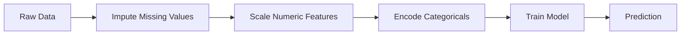
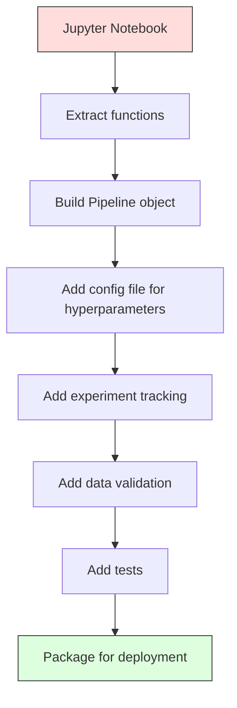

# ML Pipelines（机器学习流水线）

> 模型不是产品。流水线才是。流水线涵盖从原始数据到部署预测的全部过程，每一步都必须可复现。

**类型：** 构建  
**语言：** Python  
**先决条件：** Phase 2, Lesson 12（超参数调优）  
**时间：** 约 120 分钟

## 学习目标

- 从零构建一个机器学习流水线，将缺失值填充、特征缩放、编码和模型训练链成一个可复现的整体对象
- 识别数据泄漏场景，并解释流水线如何通过仅在训练数据上拟合转换器来防止数据泄漏
- 构造一个 `ColumnTransformer`，对数值和类别特征分别应用不同的预处理
- 实现流水线序列化，并展示相同拟合的流水线在训练和生产环境中产生相同结果

## 问题描述

你有一个笔记本，加载数据、用中位数填充缺失值、对特征缩放，然后训练模型、打印准确率。它能工作。你部署了它。

一个月后，有人重新训练模型，结果不同了。中位数是在包含测试数据的完整数据集上计算的（数据泄漏）。缩放参数没有保存，推理时使用了不同的统计量。特征工程代码在训练和服务端被复制粘贴，且代码渐行渐远。某个类别列在生产中出现了模型从未见过的新值。

这些都不是假设。这些是机器学习系统在生产环境中失败的最常见原因。流水线通过将每个转换步骤打包成一个有序、可复现的整体对象来解决所有问题。

## 基础概念

### 什么是流水线

流水线是一个有序的数据转换序列，最后接一个模型。每个步骤以上一步的输出作为输入。整个流水线只在训练数据上拟合一次。推理时，使用相同的拟合流水线转换新数据并生成预测。



流水线保证：
- 转换器只在训练数据上拟合（无泄漏）
- 推理时应用相同转换
- 整个对象可以序列化并作为一个工件部署
- 交叉验证时流水线会针对每个折独立应用，避免隐形数据泄漏

### 数据泄漏：沉默的杀手

数据泄漏发生在测试集或未来数据的信息污染训练时。流水线防止最常见的泄漏类型。

**错误（泄漏）：**
```python
X = df.drop("target", axis=1)
y = df["target"]

scaler = StandardScaler()
X_scaled = scaler.fit_transform(X)

X_train, X_test = X_scaled[:800], X_scaled[800:]
y_train, y_test = y[:800], y[800:]
```

Scaler 在拟合时看到了测试集数据。均值和标准差包含测试样本，这导致准确率估计被高估。

**正确：**
```python
X_train, X_test = X[:800], X[800:]

scaler = StandardScaler()
X_train_scaled = scaler.fit_transform(X_train)
X_test_scaled = scaler.transform(X_test)
```

使用流水线时，你不需要担心这些情况，流水线会自动处理。

### sklearn Pipeline（流水线）

sklearn 的 `Pipeline` 将转换器和估计器链接起来。它暴露 `.fit()`、`.predict()` 和 `.score()`，会依次应用所有步骤。

```python
from sklearn.pipeline import Pipeline
from sklearn.preprocessing import StandardScaler
from sklearn.linear_model import LogisticRegression

pipe = Pipeline([
    ("scaler", StandardScaler()),
    ("model", LogisticRegression()),
])

pipe.fit(X_train, y_train)
predictions = pipe.predict(X_test)
```

调用 `pipe.fit(X_train, y_train)` 时：
1. Scaler 对 X_train 调用 `fit_transform`
2. 模型对缩放后的 X_train 调用 `fit`

调用 `pipe.predict(X_test)` 时：
1. Scaler 只调用 `transform`（不是 `fit_transform`）对 X_test 转换
2. 模型调用 `predict` 预测缩放后的 X_test

Scaler 在拟合期间从未看见测试数据。这就是重点。

### ColumnTransformer：不同列不同流水线

真实数据集包含数值和类别列，需要不同的预处理。`ColumnTransformer` 负责处理这一点。

```python
from sklearn.compose import ColumnTransformer
from sklearn.preprocessing import StandardScaler, OneHotEncoder
from sklearn.impute import SimpleImputer

numeric_pipe = Pipeline([
    ("impute", SimpleImputer(strategy="median")),
    ("scale", StandardScaler()),
])

categorical_pipe = Pipeline([
    ("impute", SimpleImputer(strategy="most_frequent")),
    ("encode", OneHotEncoder(handle_unknown="ignore")),
])

preprocessor = ColumnTransformer([
    ("num", numeric_pipe, ["age", "income", "score"]),
    ("cat", categorical_pipe, ["city", "gender", "plan"]),
])

full_pipeline = Pipeline([
    ("preprocess", preprocessor),
    ("model", GradientBoostingClassifier()),
])
```

OneHotEncoder 中的 `handle_unknown="ignore"` 是生产环境的关键。当出现模型未见过的新类别（如新城市），该参数使编码产生全零向量而非崩溃。

### 实验追踪

流水线让训练可复现，但你还需要追踪所有实验细节：超参数、数据集版本、指标、代码版本等。

**MLflow** 是最常见的开源实现：

```python
import mlflow

with mlflow.start_run():
    mlflow.log_param("max_depth", 5)
    mlflow.log_param("n_estimators", 100)
    mlflow.log_param("learning_rate", 0.1)

    pipe.fit(X_train, y_train)
    accuracy = pipe.score(X_test, y_test)

    mlflow.log_metric("accuracy", accuracy)
    mlflow.sklearn.log_model(pipe, "model")
```

每次运行都会记录参数、指标、工件及完整模型。可以比较运行，复现实验，部署任意模型版本。

**Weights & Biases（wandb）** 提供类似功能的托管仪表盘：

```python
import wandb

wandb.init(project="my-pipeline")
wandb.config.update({"max_depth": 5, "n_estimators": 100})

pipe.fit(X_train, y_train)
accuracy = pipe.score(X_test, y_test)

wandb.log({"accuracy": accuracy})
```

### 模型版本管理

实验追踪之后，还要管理模型版本：哪一个模型在生产？哪一个在测试？上周哪个版本？

MLflow 的 Model Registry 提供：
- **版本追踪：** 每个保存模型都有版本号
- **阶段切换：** “Staging”（测试）、“Production”（生产）、“Archived”（归档）
- **审核流程：** 必须明确批准后才能推到生产环境
- **回滚机制：** 可即时切换回历史版本

### 使用 DVC 进行数据版本控制

代码用 git 做版本控制，数据也应版本管理，但 git 不能高效处理大文件。DVC（Data Version Control）解决了这个问题。

```bash
dvc init
dvc add data/training.csv
git add data/training.csv.dvc data/.gitignore
git commit -m "Track training data"
dvc push
```

DVC 将真实数据存储于远程存储（如 S3、GCS、Azure），并在 git 中保留一个记录哈希值的小 `.dvc` 文件。切换 git 版本后，使用 `dvc checkout` 可以恢复对应数据。

这意味着每个 git 提交都锁定了代码和数据，实现完整复现。

### 可复现实验

可复现实验需要四个条件：

1. **固定随机种子：** 设置 numpy、random 和框架（torch、sklearn）的随机种子
2. **锁定依赖版本：** requirements.txt 或 poetry.lock 中精确版本
3. **数据版本控制：** 使用 DVC 等
4. **配置文件管理：** 所有超参数放在配置文件中，而非硬编码

```python
import numpy as np
import random

def set_seed(seed=42):
    random.seed(seed)
    np.random.seed(seed)
    try:
        import torch
        torch.manual_seed(seed)
        torch.cuda.manual_seed_all(seed)
        torch.backends.cudnn.deterministic = True
    except ImportError:
        pass
```

### 从笔记本到生产流水线



典型流程：

1. **笔记本探索：** 快速实验、可视化、特征想法  
2. **提取函数：** 将预处理、特征工程、评估迁出为模块  
3. **构建流水线：** 将转换链入 sklearn Pipeline 或自定义类  
4. **配置管理：** 所有超参数放入 YAML/JSON 配置文件  
5. **实验追踪：** 加入 MLflow 或 wandb 记录  
6. **数据验证：** 训练前检查模式、分布和缺失值  
7. **测试：** 转换器单元测试，整流水线集成测试  
8. **部署：** 序列化流水线，用 API（FastAPI、Flask）包裹，容器化  

### 常见流水线错误

| 错误               | 为什么不好                          | 修复方式                       |
|--------------------|----------------------------------|-------------------------------|
| 训练前对全数据拟合  | 数据泄漏                          | 使用 Pipeline 结合 cross_val_score |
| 特征工程写在流水线外 | 训练与服务端转换不一致            | 把所有转换放进流水线           |
| 未处理未知类别      | 新类别导致生产崩溃                | OneHotEncoder(handle_unknown="ignore") |
| 列名硬编码          | 模式变化时导致错误                | 从配置文件加载列名列表         |
| 无数据验证          | 错误数据默默导致预测错误          | 预测前加入模式检查             |
| 训练/推理特征不一致 | 生产中模型看不到正确特征          | 训练和推理使用同一个 Pipeline 对象 |

## 亲自动手

`code/pipeline.py` 中的代码从零构建了一个完整的机器学习流水线：

### 步骤 1：自定义转换器

```python
class CustomTransformer:
    def __init__(self):
        self.means = None
        self.stds = None

    def fit(self, X):
        self.means = np.mean(X, axis=0)
        self.stds = np.std(X, axis=0)
        self.stds[self.stds == 0] = 1.0
        return self

    def transform(self, X):
        return (X - self.means) / self.stds

    def fit_transform(self, X):
        return self.fit(X).transform(X)
```

### 步骤 2：从零实现流水线

```python
class PipelineFromScratch:
    def __init__(self, steps):
        self.steps = steps

    def fit(self, X, y=None):
        X_current = X.copy()
        for name, step in self.steps[:-1]:
            X_current = step.fit_transform(X_current)
        name, model = self.steps[-1]
        model.fit(X_current, y)
        return self

    def predict(self, X):
        X_current = X.copy()
        for name, step in self.steps[:-1]:
            X_current = step.transform(X_current)
        name, model = self.steps[-1]
        return model.predict(X_current)
```

### 步骤 3：带流水线的交叉验证

示例演示了带流水线的交叉验证如何防止数据泄漏：标准化器分别在每个折的训练数据上拟合。

### 第4步：使用 sklearn 构建完整生产流水线

一个包含 `ColumnTransformer`、多条预处理路径和模型的完整流水线，使用合适的交叉验证和实验日志进行训练。

## 发布它

本课内容输出：
- `outputs/prompt-ml-pipeline.md` -- 构建和调试机器学习流水线的技能
- `code/pipeline.py` -- 从零开始通过 sklearn 构建的完整流水线

## 练习

1. 构建一个流水线，处理一个有3个数值列和2个类别列的数据集。使用 `ColumnTransformer` 对数值列做中位数填充+缩放，对类别列做众数填充+独热编码。使用5折交叉验证训练。

2. 故意引入数据泄漏（data leakage）：在拆分数据前对整个数据集拟合缩放器。将泄漏（leaky）交叉验证分数与流水线交叉验证分数（clean）进行比较。差异有多大？

3. 使用 `joblib.dump` 序列化你的流水线。在一个独立的脚本中加载并运行预测。验证预测结果完全一致。

4. 在流水线中加入一个自定义转换器，为最重要的两个数值列创建多项式特征（degree 2）。它应该放在哪个步骤？

5. 为流水线设置 MLflow（MLflow 追踪）。运行5次不同超参数的实验。使用 MLflow UI（`mlflow ui`）比较运行结果并选出最佳模型。

## 关键术语

| 术语 | 俗称 | 实际含义 |
|------|------|----------|
| Pipeline（流水线） | “一串转换器和模型链” | 一排已拟合转换器和模型组成的有序序列，作为一个整体应用，防止数据泄漏 |
| Data leakage（数据泄漏） | “测试信息泄露到训练中” | 使用训练集外的信息构建模型，导致性能估计偏高 |
| ColumnTransformer（列转换器） | “不同列用不同预处理” | 对不同列子集应用不同流水线，并将结果组合 |
| Experiment tracking（实验追踪） | “记录你的运行” | 记录每次训练的参数、指标、产物和代码版本 |
| MLflow | “跟踪和部署模型” | 一个开源平台，支持实验追踪、模型注册和部署 |
| DVC | “数据的 Git” | 用于大数据文件的版本控制系统，Git 只存储哈希值，数据存储于远程 |
| Model registry（模型注册中心） | “模型版本目录” | 一个跟踪模型版本并标注阶段（测试中、生产、归档）的系统 |
| Training/serving skew（训练/推理偏差） | “在notebook里有效” | 训练和推理阶段数据处理不同，导致静默错误 |
| Reproducibility（可复现性） | “相同代码相同结果” | 在相同代码、数据和配置下获得完全一致结果的能力 |

## 相关阅读

- [scikit-learn Pipeline 文档](https://scikit-learn.org/stable/modules/compose.html) -- 官方流水线参考
- [MLflow 文档](https://mlflow.org/docs/latest/index.html) -- 实验追踪和模型注册
- [DVC 文档](https://dvc.org/doc) -- 数据版本管理
- [Sculley 等, Hidden Technical Debt in Machine Learning Systems (2015)](https://papers.nips.cc/paper/2015/hash/86df7dcfd896fcaf2674f757a2463eba-Abstract.html) -- 机器学习系统复杂性的开创性论文
- [Google ML 最佳实践：机器学习规则](https://developers.google.com/machine-learning/guides/rules-of-ml) -- 实用生产级机器学习建议
