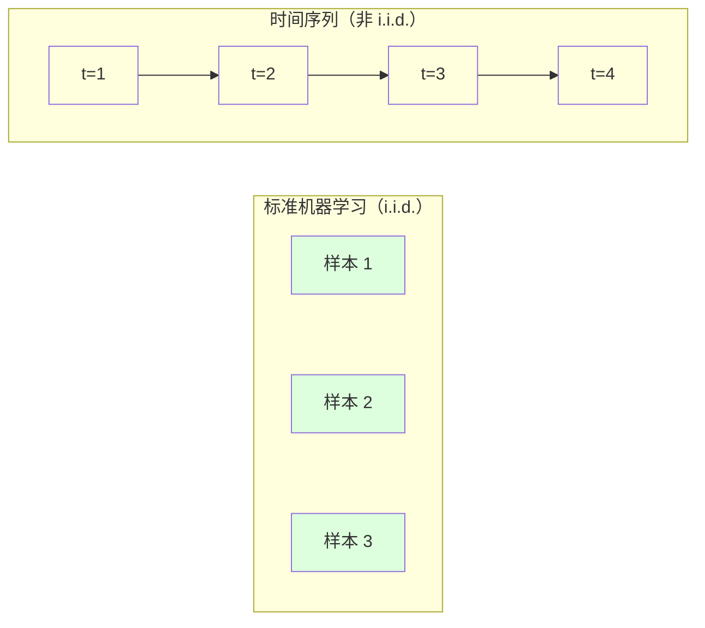
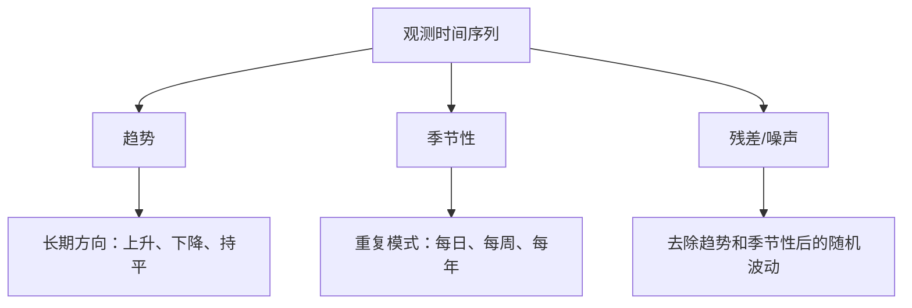
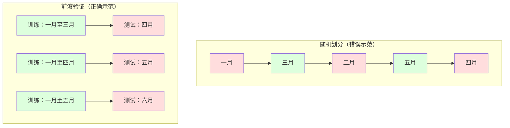

# 时间序列基础

> 过去的表现确实可以预测未来结果——前提是先检查平稳性。

**类型：** 构建  
**语言：** Python  
**先决条件：** 第二阶段，第01-09课  
**时间：** ~90 分钟

## 学习目标

- 将时间序列分解为趋势（trend）、季节性（seasonality）和残差（residual）分量，并测试平稳性  
- 实现滞后特征（lag features）和滑动统计（rolling statistics），将时间序列转化为监督学习问题  
- 构建前滚验证（walk-forward validation）框架，防止未来数据泄漏到训练中  
- 解释为何随机训练/测试划分对时间序列无效，并演示与正确的时间切分性能差异  

## 问题背景

你拥有按时间排序的数据。每日销售、逐小时温度、每分钟 CPU 使用率、每周股票价格。你想预测下一个数值、下周或下个季度。

你拿出常规机器学习工具箱：随机训练/测试划分、交叉验证、输入特征矩阵、输出预测。每一步都是错的。

时间序列破坏了标准机器学习依赖的假设。样本不是独立的——比如今天的温度依赖昨天的温度。随机划分会将未来信息泄漏到过去。那些在回测中表现极好的特征，由于依赖随时间变化的模式，在线上环境常常失效。

使用随机交叉验证能得到 95% 准确率的模型，使用正确的时间验证可能只有 55%。这种差异不是技术细节，而是纸面上的模型与实际可用模型的区别。

本课涵盖基础知识：时间数据的特殊性，如何合理评估模型，以及如何将时间序列转换为标准机器学习可消化的特征。

## 概念讲解

### 时间序列的特殊性

标准机器学习假设样本是 i.i.d.（独立同分布）的。即每个样本来自相同分布，且彼此独立。而时间序列同时违背了这两点：

- **非独立。** 今天的股价依赖昨天的；本周销售与上周相关。  
- **非同分布。** 分布随时间变化。12 月的销售不同于 3 月。

这些违背假设并非小事，直接影响特征设计、模型评估和可用算法。



标准机器学习中，样本可交换，打乱顺序不会改变结果。时间序列中，顺序决定一切，打乱则信号消失。

### 时间序列的组成部分

每个时间序列由以下几部分组成：



- **趋势（trend）：** 长期方向。比如收入每年增长 10%，全球气温上涨。  
- **季节性（seasonality）：** 按固定周期重复的模式。零售销售在 12 月激增，空调使用在 7 月达到峰值。  
- **残差（residual）：** 去除趋势和季节性后的剩余。如果残差呈白噪声，说明分解很好地捕获了信号。  

### 平稳性

如果时间序列的统计特性（均值、方差、自相关）不随时间变化，则称为平稳时间序列。大多数预测方法假设序列是平稳的。

**为什么重要：** 非平稳序列均值漂移。用 1 月数据训练的模型学到的均值与 2 月显示的不同，预测将系统性错误。

**如何检测：** 计算移动均值和移动标准差。如果随时间漂移，则非平稳。

**如何修正：** 差分处理。不是直接建模原始数值，而是建模连续时间点的差值：

```text
diff[t] = value[t] - value[t-1]
```

如果一次差分不能让序列平稳，则再次差分（二阶差分）。大多数实际序列最多需要两轮。

**示例：**

原始序列: [100, 102, 106, 112, 120]  
一次差分: [2, 4, 6, 8]（仍呈上升趋势）  
二次差分: [2, 2, 2]（稳定 —— 平稳）

原始序列为二次趋势，一阶差分为线性趋势，二阶差分变平直。实际应用中很少超过两轮差分。

**正式检验：** 增强型 Dickey-Fuller（ADF）检验是平稳性标准统计检验。原假设为“序列非平稳”，p 值低于 0.05 可拒绝原假设判定平稳。本课不实现 ADF（需要渐近分布表），但滑动统计图法提供了实用可视检查。

### 自相关

自相关量度时间 t 的值与时间 t-k （k 步之前）值的相关程度。自相关函数（ACF）绘制每个滞后 k 的相关值。

**ACF 告诉我们：**  
- 记忆窗口长度。若滞后 5 后 ACF 降为 0，说明超过 5 步之外的值无关紧要。  
- 是否存在季节性。若在滞后 12（若为月度数据）处有峰值，说明有年度季节性。  
- 该创建多少滞后特征。选取 ACF 显著的滞后数。

**PACF（偏自相关函数）**剔除间接影响。若今天与 3 天前相关仅因均与昨天相关，PACF 在滞后 3 上值为零，而 ACF 不为零。

### 滞后特征：将时间序列转化为监督学习

标准机器学习模型需要特征矩阵 X 和目标 y。时间序列仅一列数值。桥梁是滞后特征。

取序列 [10, 12, 14, 13, 15]，创建滞后 1 和滞后 2 特征：

| lag_2 | lag_1 | target |
|-------|-------|--------|
| 10    | 12    | 14     |
| 12    | 14    | 13     |
| 14    | 13    | 15     |

现在这是一个标准回归问题。任何机器学习模型（线性回归、随机森林、梯度提升）都可根据滞后值预测目标。

可构造的额外特征包括：  
- **滚动统计量：** 最近 k 个值的均值、标准差、最小值、最大值  
- **日历特征：** 一周中的天、月份、是否假期、是否周末  
- **差分值：** 相邻时间步的变化量  
- **累积统计量：** 累积均值、累积和  
- **比率特征：** 当前值/滚动均值（远离近期均值的程度）  
- **交互特征：** lag_1 和 weekday 的乘积（考虑星期几对动量的影响）

**滞后步数选多少？** 使用自相关函数。若 ACF 在滞后 10 仍显著，则至少选用 10 个滞后。若存在每周季节性，应包括滞后 7（可能还有 14）。更多滞后提供更多历史，但特征增多风险过拟合。

**目标对齐陷阱。** 创建滞后特征时，目标须为时间 t 的值，所有特征只能用时间 t-1 及更早的数据。若误将时间 t 的值用作特征，就相当于泄露了未来信息，得到的是完全无用的“完美”预测模型。这是时间序列特征工程最常见的错误。

### 前滚验证

这是本课最重要的概念。标准 k 折交叉验证随机划分训练和测试样本。时间序列中这样会泄漏未来信息。



前滚验证步骤：  
1. 用时间 t 之前的数据训练  
2. 预测时间 t+1（或 t+1 到 t+k 多步预测）  
3. 窗口向前滑动  
4. 重复执行

每个测试集只含训练集之后的数据，无未来泄漏，能客观评估模型上线表现。

**扩展窗口（expanding window）** 用所有历史数据训练（窗口不断增大）。  
**滑动窗口（sliding window）** 用固定大小训练窗口（窗口滑动）。  
当你相信历史数据长期有效，用扩展窗口；当环境变化大，旧数据有害，则用滑动窗口。

### ARIMA 直觉

ARIMA 是经典时间序列模型，包含三个组成部分：

- **AR（自回归，Autoregressive）：** 用过去值预测当前，AR(p) 利用最近 p 个值。  
- **I（差分，Integrated）：** 使序列平稳，I(d) 表示差分 d 次。  
- **MA（滑动平均，Moving Average）：** 用过去预测误差预测当前，MA(q) 利用最近 q 个误差。

ARIMA(p, d, q) 综合以上三点。p、d、q 值根据 ACF/PACF 分析或自动搜索（auto-ARIMA）确定。

本课不实现 ARIMA 算法（涉及数值优化超出范围）。关键在于理解各组件作用，以便解读模型结果及判断适用场景。

### 何时使用何种方法

| 方法                   | 适用场景                     | 是否支持季节性            | 是否支持外部特征                 |
|------------------------|------------------------------|---------------------------|-------------------------------|
| 滞后特征+机器学习       | 表格数据，包含多种外部特征    | 可以通过日历特征处理       | 是                            |
| ARIMA                  | 单变量序列，短期预测          | SARIMA 变种支持             | 否（ARIMAX 限制支持）          |
| 指数平滑法             | 简单趋势和季节性              | 支持（Holt-Winters法）       | 否                            |
| Prophet                | 业务预测、节假日影响          | 支持（傅里叶项）            | 有限                          |
| 神经网络（LSTM、Transformer） | 长序列、多序列预测           | 可自动学习季节性            | 是                            |

对于大多数实际问题，滞后特征加梯度提升是最强起点。可自然处理外部特征，无需平稳性，且易于调试。

### 预测步长与策略

单步预测预测未来一步，多步预测预测多步。三种主流策略：

**递归（递归迭代式）：** 预测下一步，将预测结果作为下一次输入。简单，但误差累积——每步用的是预测值，错误逐步放大。

**Direct（直接法）：** 为每个预测步长训练一个单独的模型。Model-1 预测 t+1，Model-5 预测 t+5。没有误差累积，但每个模型的训练样本较少且不共享信息。

**Multi-output（多输出法）：** 训练一个模型同时输出所有步长的预测。跨步长共享信息，但需要支持多输出的模型（或自定义损失函数）。

对于大多数实际问题，短期预测（1-5步）使用递归法（recursive），长期预测使用直接法（direct）。

### 时间序列中常见的错误

| 错误 | 发生原因 | 解决方法 |
|---------|---------------|-----------|
| 随机划分训练/测试集 | 受到标准机器学习习惯影响 | 使用滚动前置法（walk-forward）或时间序列分割 |
| 使用未来特征 | 错误地包含了时间 t 的特征 | 审核每个特征的时间对齐 |
| 过拟合季节性 | 模型记忆了日历模式 | 在测试集中保留完整的季节周期 |
| 忽视尺度变化 | 收入翻倍但模式不变 | 建模百分比变化而非绝对值 |
| 过多滞后特征 | “历史越多越好” | 使用自相关函数（ACF）确定相关滞后 |
| 不做差分 | “模型会自动处理” | 树模型可处理趋势，线性模型需平稳性 |

## 构建它

`code/time_series.py` 中的代码从零实现了核心构建模块。

### 滞后特征生成器

```python
def make_lag_features(series, n_lags):
    n = len(series)
    X = np.full((n, n_lags), np.nan)
    for lag in range(1, n_lags + 1):
        X[lag:, lag - 1] = series[:-lag]
    valid = ~np.isnan(X).any(axis=1)
    return X[valid], series[valid]
```

该函数将一维序列转化为特征矩阵，其中每一行包含前 `n_lags` 个值作为特征，当前值作为目标。

### 滚动前置交叉验证（Walk-Forward CV）

```python
def walk_forward_split(n_samples, n_splits=5, min_train=50):
    assert min_train < n_samples, "min_train must be less than n_samples"
    step = max(1, (n_samples - min_train) // n_splits)
    for i in range(n_splits):
        train_end = min_train + i * step
        test_end = min(train_end + step, n_samples)
        if train_end >= n_samples:
            break
        yield slice(0, train_end), slice(train_end, test_end)
```

每个分割确保训练数据严格早于测试数据。训练窗口随着折数扩展。

### 简单自回归模型（Simple AR）

纯 AR 模型就是对滞后特征做线性回归：

```python
class SimpleAR:
    def __init__(self, n_lags=5):
        self.n_lags = n_lags
        self.weights = None
        self.bias = None

    def fit(self, series):
        X, y = make_lag_features(series, self.n_lags)
        # 正规方程求解
        X_b = np.column_stack([np.ones(len(X)), X])
        theta = np.linalg.lstsq(X_b, y, rcond=None)[0]
        self.bias = theta[0]
        self.weights = theta[1:]
        return self
```

这在概念上与第02课的线性回归相同，但应用于时间滞后的同一变量。

### 平稳性检测

代码计算滚动均值和滚动标准差以视觉和数值方式判断平稳性：

```python
def check_stationarity(series, window=50):
    rolling_mean = np.array([
        series[max(0, i - window):i].mean()
        for i in range(1, len(series) + 1)
    ])
    rolling_std = np.array([
        series[max(0, i - window):i].std()
        for i in range(1, len(series) + 1)
    ])
    return rolling_mean, rolling_std
```

如果滚动均值漂移或滚动标准差变化，说明序列非平稳。可做差分后再检测。

代码还通过对比序列前半段和后半段均值差异（超过半个标准差）或方差比（超过2倍）来判断是否非平稳。

### 自相关（Autocorrelation）

```python
def autocorrelation(series, max_lag=20):
    n = len(series)
    mean = series.mean()
    var = series.var()
    acf = np.zeros(max_lag + 1)
    for k in range(max_lag + 1):
        cov = np.mean((series[:n-k] - mean) * (series[k:] - mean))
        acf[k] = cov / var if var > 0 else 0
    return acf
```

## 使用它

用 sklearn，可以直接用滞后特征配合任意回归器：

```python
from sklearn.linear_model import Ridge
from sklearn.ensemble import GradientBoostingRegressor

X, y = make_lag_features(series, n_lags=10)

for train_idx, test_idx in walk_forward_split(len(X)):
    model = Ridge(alpha=1.0)
    model.fit(X[train_idx], y[train_idx])
    predictions = model.predict(X[test_idx])
```

ARIMA 使用 statsmodels：

```python
from statsmodels.tsa.arima.model import ARIMA

model = ARIMA(train_series, order=(5, 1, 2))
fitted = model.fit()
forecast = fitted.forecast(steps=30)
```

`time_series.py` 中的代码演示了这两种方法，并用滚动前置验证进行了对比。

### sklearn 的 TimeSeriesSplit

sklearn 提供了 `TimeSeriesSplit` 实现滚动前置验证：

```python
from sklearn.model_selection import TimeSeriesSplit

tscv = TimeSeriesSplit(n_splits=5)
for train_index, test_index in tscv.split(X):
    X_train, X_test = X[train_index], X[test_index]
    y_train, y_test = y[train_index], y[test_index]
    model.fit(X_train, y_train)
    score = model.score(X_test, y_test)
```

这等价于我们从零实现的 `walk_forward_split`，但集成在 sklearn 的交叉验证框架里。可与 `cross_val_score` 配合使用：

```python
from sklearn.model_selection import cross_val_score

scores = cross_val_score(model, X, y, cv=TimeSeriesSplit(n_splits=5))
print(f"Mean score: {scores.mean():.4f} +/- {scores.std():.4f}")
```

### 评估指标

时间序列预测使用回归指标，但需结合时间上下文：

- **MAE（平均绝对误差）：** |y_true - y_pred| 的平均值。易于用原始单位解释，比如“预测平均误差为 3.2 度”。
- **RMSE（均方根误差）：** 均方误差开方，对大误差惩罚更严重。适合大误差比多个小误差更糟糕的情况。
- **MAPE（平均绝对百分比误差）：** |误差/真实值|*100 的平均。与尺度无关，适合跨系列比较。但真实值为零时无定义。
- **天真的基准比较：** 总是与简单基线比较。季节性天真基线预测上一周期的值（昨天、上周等）。模型若无法击败天真基线，说明没学到有效模式。

### 滚动特征

代码演示了将滚动统计特征（7天和14天的滚动均值、标准差、最小值、最大值）加入滞后特征。这给模型提供了近期趋势和波动的信息，仅靠滞后特征无法捕捉。

比如滚动均值上升表明趋势向上，滚动标准差增加说明波动加大。这种模式树模型能学到，线性模型则不行。

## 部署它

本课产出：
- `outputs/prompt-time-series-advisor.md` —— 时间序列问题设计提示
- `code/time_series.py` —— 滞后特征，滚动前置验证，AR 模型，平稳性检测

### 必须击败的基线

建模前先建立基线：

1. **最后一个值（持续法）。** 预测明天与今天相同。很多序列难以击败。
2. **季节性天真法。** 预测今天与上周同日（或去年同日）相同。模型若无法胜过它，说明未学到季节性之外模式。
3. **移动平均。** 预测最近 k 个值的均值。平滑噪声但无法捕捉突变。

若复杂模型输给季节性天真基线，多半是数据未来泄露、评估错误或序列确实随机不可预测。

### 实用技巧

1. **先画图。** 建模前画原始序列。寻找趋势、季节性、异常、结构性突变。30秒可视检查胜过一小时自动分析。
2. **先差分，后建模。** 若有明显趋势，先差分再做滞后特征。树模型可以处理趋势，线性模型不行，差分不会有害。
3. **至少留出一个完整季节周期。** 若有周季节性，测试集至少一周；若有月季节性，至少一月。否则无法判定模型是否捕捉到季节模式。
4. **线上监控。** 时间序列模型随时间退化。监控滚动误差，误差升高时用最新数据重新训练。
5. **警惕制度变迁。** 模型用疫情前数据训练不能预测后疫情行为。用显式变迁指标作为特征，或用滑动窗口忘记旧数据。
6. **对偏态序列做对数变换。** 收入、价格、计数往往偏态。取对数稳定方差，使乘法模式变为相加，利于线性建模。预测在对数空间，结果再指数还原。

## 练习

1. **平稳性实验。** 生成含线性趋势的序列。用滚动统计检测平稳性。做一次差分，再检测。对二次趋势需要差分几次？
2. **滞后选择。** 对季节性序列（周期=7）计算 ACF。哪些滞后自相关最高？只用这些滞后做特征（非连续滞后）效果如何？与用 1 到 7 连续滞后相比准确度有无提升？
3. **滚动前置与随机划分对比。** 用 Ridge 训练滞后特征。用随机 80/20 划分和滚动前置验证分别评估。随机划分高估了多少性能？
4. **特征工程。** 在滞后特征基础上加滚动均值（窗口7）、滚动标准差（窗口7）、星期几特征。用滚动前置验证对比有无提升。
5. **多步预测。** 修改 AR 模型预测 5 步。对比两种策略：（a）单步预测递归使用；（b）对每个步长训练不同模型（直接法）。哪种更准确？

## 关键词

| 术语 | 通俗说法 | 准确认知 |
|------|----------------|----------------------|
| Stationarity（平稳性） | “统计特性不随时间变化” | 均值、方差和自相关结构随时间保持不变的序列 |
| Differencing（差分） | “相邻值相减” | 计算 y[t] - y[t-1] 去除趋势，实现平稳 |
| Autocorrelation (ACF)（自相关函数） | “序列自身的相关性” | 时间序列与其滞后版本间随滞后变化的相关系数 |
| Partial autocorrelation (PACF)（偏自相关） | “仅保留直接相关” | 滞后 k 的自相关，剔除所有更短滞后的影响 |
| Lag features（滞后特征） | “用过去值做输入” | 使用 y[t-1], y[t-2], ..., y[t-k] 预测 y[t] |
| Walk-forward validation（滚动前置验证） | “时间顺序的交叉验证” | 训练集严格早于测试集的评估方法 |
| ARIMA（自回归差分滑动平均模型） | “经典时间序列模型” | 结合自回归（AR）、差分（I）、滑动平均（MA）的模型 |
| Seasonality（季节性） | “重复的日历模式” | 与日、周、年周期相关的规律模式 |
| Trend（趋势） | “长远方向” | 序列水平的持续上升或下降 |
| Expanding window（扩张窗口） | “用全部历史” | 滚动前置验证中训练集随时间扩展 |
| Sliding window（滑动窗口） | “固定大小历史” | 滚动前置验证中训练集为固定长度滑动窗口 |

## 深入阅读

- [Hyndman 和 Athanasopoulos，《Forecasting: Principles and Practice》（预测：原理与实践，第3版）](https://otexts.com/fpp3/) -- 最好的免费时间序列预测教材
- [scikit-learn 时间序列划分（Time Series Split）](https://scikit-learn.org/stable/modules/generated/sklearn.model_selection.TimeSeriesSplit.html) -- sklearn 的前向滑动划分器
- [statsmodels ARIMA 文档](https://www.statsmodels.org/stable/generated/statsmodels.tsa.arima.model.ARIMA.html) -- 带诊断功能的 ARIMA 实现
- [Makridakis 等，《M5 竞赛》（2022）](https://www.sciencedirect.com/science/article/pii/S0169207021001874) -- 大规模预测竞赛，展示机器学习方法与统计方法的比较
