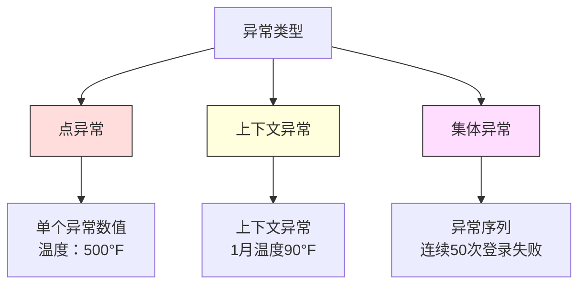
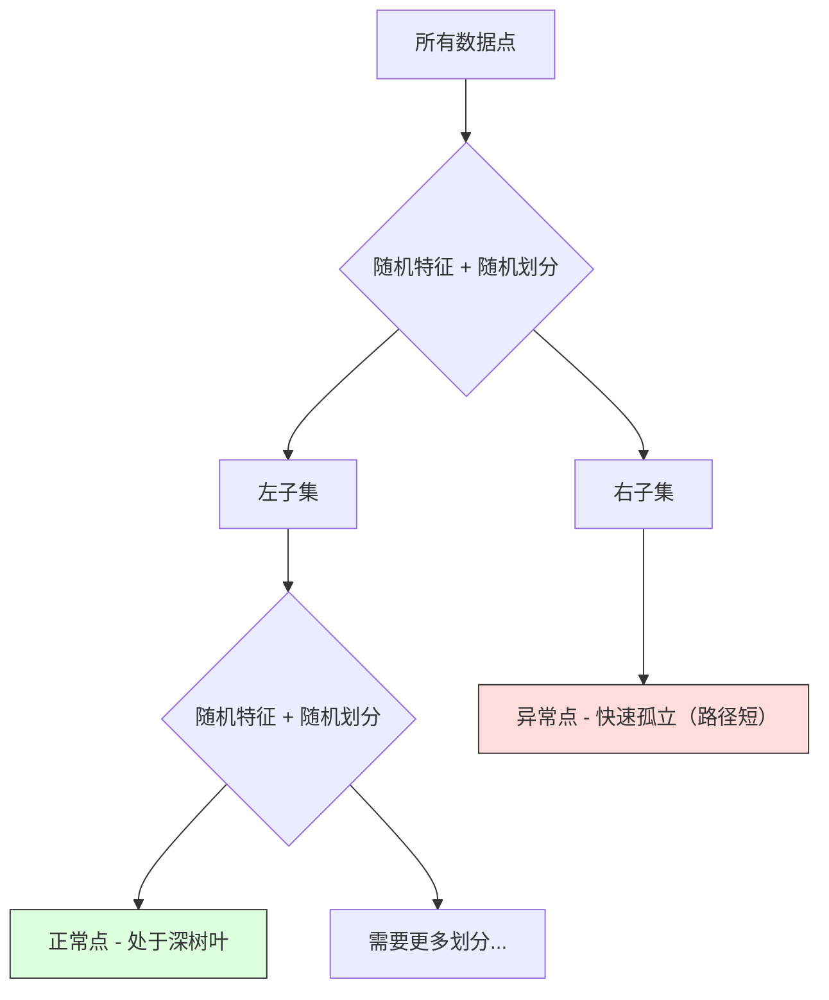

# 异常检测

> 正常很容易定义。异常是任何不符合的情况。

**类型:** 构建  
**语言:** Python  
**先决条件:** 第二阶段，第01-09课  
**时间:** 约75分钟

## 学习目标

- 从零实现 Z-score、IQR 和 Isolation Forest 异常检测方法
- 区分点异常（point anomalies）、上下文异常（contextual anomalies）和集体异常（collective anomalies），并为每种类型选择合适的检测方法
- 解释为什么异常检测是建模正常数据，而不是对异常进行分类
- 比较无监督异常检测与监督分类，并评估新型异常覆盖率与精度之间的权衡

## 问题

信用卡在纽约下午2点使用，5分钟后在东京使用。工厂传感器读数150度，正常范围是80-120。服务器每秒发送5万请求，日平均只有200。

这些都是异常。发现它们至关重要。欺诈损失数十亿美元。设备故障造成停机。网络入侵导致数据泄露。

挑战是：你很少有异常的标注样本。欺诈只占交易的0.1%。设备故障每年几次。你无法训练标准分类器，因为“异常”类几乎没有样本可以学习。即使有少许标注，遇到的异常类型也不是全部。明天的欺诈手法与今天不同。

异常检测颠倒了问题。不是学习什么是异常，而是学习什么是正常。任何偏离正常的都可疑。该方法不依赖标注，能适应新类型异常，且可扩展到大规模数据集。

## 概念

### 异常类型

并非所有异常都相同：

- **点异常（Point anomalies）**。单个数据点无论环境如何都异常。温度读数500度。账户通常消费50美元，却交易5万美元。
- **上下文异常（Contextual anomalies）**。在特定上下文环境下异常。90度夏天正常，冬天异常。同一数值，不同上下文。
- **集体异常（Collective anomalies）**。一组数据点整体异常，单点可能正常。5次登录失败正常，连续50次则是暴力破解。

大多数方法检测点异常。上下文异常需要时间或地理位置特征。集体异常需要序列感知方法。



### 无监督视角

在标准分类中，两类都有标注。异常检测通常有三种情况：

1. **完全无监督。** 没有任何标注。用所有数据拟合检测器，假定异常非常少，不会破坏“正常”模型。
2. **半监督。** 只有干净的正常数据集。用该数据集训练，针对其他数据得分。是最强的方案（如果可能）。
3. **弱监督。** 少量异常标注。用于评估，而非训练。无监督训练后，用标注子集计算精度和召回。

关键见解：异常检测根本不同于分类。你是在建模正常数据的分布，而非两个类别的决策边界。

### 监督与无监督的权衡

若有异常标注，是否将其用于训练（监督分类）或仅用于评估（无监督检测）？

**监督分类：**
- 捕获已见异常类型
- 已知异常类型精度高
- 完全漏掉新异常类型
- 新异常出现时必须重训练
- 需要足够异常样本，通常样本稀缺

**无监督检测（建模正常，标记偏差）：**
- 捕获所有偏离正常的异常，包含新类型
- 无需异常标注
- 误报率较高（不是所有异常都代表坏）
- 对分布变化更健壮

实际应用中，最佳方案结合两者：无监督检测做广泛覆盖，监督模型针对高优先级已知异常，人类审核模棱两可情况。

### Z-score 方法

最简单的方法。计算每个特征的均值和标准差。标记距均值超过 k 倍标准差的点。

```text
z_score = (x - mean) / std
anomaly if |z_score| > threshold
```

默认阈值是3.0（对于高斯分布，99.7%数据落在±3标准差内）。

**优点:** 简单，快速，可解释（“该值偏离正常均值4.5个标准差”）。

**缺点:** 假设数据正态分布。对训练数据中的异常点敏感（异常点拉升均值和标准差，使异常难检测）。对多峰分布失效。

**适用场景:** 单一特征监控，数据近似钟形分布。如服务器响应时间、制造公差、基线稳定的传感器读数。

**不适用场景:** 多集群数据（不同办公地点基线温差），偏斜数据（$1000交易额罕见但非异常），训练数据中含异常。

### IQR 方法

比 Z-score 更鲁棒。用四分位距代替均值和标准差。

```text
Q1 = 第25百分位数
Q3 = 第75百分位数
IQR = Q3 - Q1
lower_bound = Q1 - factor * IQR
upper_bound = Q3 + factor * IQR
异常点: x < lower_bound 或 x > upper_bound
```

默认因子是1.5。

**优点:** 抗异常值（百分位不会被极值影响）。适应偏斜分布。无正态分布假设。

**缺点:** 单变量方法（针对单个特征独立判断）。无法检测只有联合特征异常的点（每个特征看似正常，但联合看异常）。

**实践提示:** 四分位距1.5倍对应箱形图胡须长度。超出胡须的点是潜在异常。使用3.0代替1.5使检测更保守（更少误报）。因子选取依赖于容忍误报的程度。

### Isolation Forest（孤立森林）

关键点：异常少且不同。在随机划分数据时，异常点容易被孤立——只需少量随机划分即能区分。



**工作原理：**  
1. 构建多棵随机树（孤立森林）  
2. 每个节点随机选特征和切分值（特征最小和最大之间）  
3. 继续划分直到每个点被孤立（独占叶子节点）  
4. 异常点在所有树中平均路径长度较短  

**为什么有效：**正常点处于密集区域，需多次划分才能孤立。异常点稀疏，1-2次随机划分即可孤立。

异常得分基于所有树的平均路径长度，归一化后为：

```text
score(x) = 2^(-average_path_length(x) / c(n))
```

其中 `c(n)` 是 n 个样本的期望路径长度。得分接近1表示异常，约0.5正常，接近0非常正常（深藏密集簇中）。

**优点：**无分布假设。支持高维。可扩展（采样子集使计算次线性）。支持混合特征类型。

**缺点：**难以检测密集区域的异常（屏蔽效应）。当许多特征无关时，随机划分效果差。

**重要超参数：**  
- `n_estimators`：树数。通常100足够。更多树提高稳定性但计算慢。  
- `max_samples`：每棵树采样的样本数。论文中默认256。采样越少，单树准确率降低但多样性提升。采样是保证效率的关键。  
- `contamination`：预估异常比例。仅用于设定阈值，不影响得分。

### Local Outlier Factor（LOF，局部离群因子）

LOF 比较一个点局部密度与邻居密度。局部稀疏点被标示为异常。

**工作步骤：**  
1. 找每个点的 k 个最近邻  
2. 计算局部可达密度（邻域密度）  
3. 比较点密度与邻居密度  
4. 点密度远低于邻居为异常

**LOF 得分：**  
- 接近1.0，密度与邻居相似（正常）  
- 大于1.0，密度低于邻居（可能异常）  
- 远大于1.0（如2.0+），显著低密度（很可能异常）

“局部”很关键。假设数据有两个簇：一个密集（1000点），一个稀疏（50点）。稀疏簇边缘点并非全局异常（伙伴有50个），但局部环境密度低于邻居，即局部异常。LOF 捕获全局方法忽略的关键差异。

**优点：**检测局部异常（邻域内异常点，非全局异常）。适用于不同密度簇。

**缺点：**大数据集上慢（朴素实现为 O(n²)）。对 k 值敏感。高维数据中效果差（维度灾难影响距离计算）。

### 比较

| 方法             | 假设                      | 速度    | 处理高维  | 检测局部异常           |
|----------------|-------------------------|--------|---------|----------------------|
| Z-score        | 正态分布                    | 非常快   | 支持（每特征） | 否                   |
| IQR            | 无（每特征独立）               | 非常快   | 支持（每特征） | 否                   |
| Isolation Forest | 无                       | 快      | 支持     | 部分支持               |
| LOF            | 距离有意义                  | 慢      | 支持差   | 是                   |

### 评估挑战

评估异常检测比分类器难：

- **极端类别不平衡。**异常仅0.1%，全部预测“正常”仍得99.9%准确率，准确率毫无意义。  
- **AUROC 误导。**极端不平衡下，AUROC看起来高，但实际在业务阈值下漏报大量异常。  
- **更优评估指标：** Precision@k（前k个标记异常中真实异常比例）、AUPRC（精确率-召回率曲线下面积）、以及固定误报率下的召回率。


### 异常检测流程

在实际操作中，异常检测遵循以下工作流程：

1. **收集基线数据。** 理想情况下，是一段你确定没有（或几乎没有）异常的时间段。
2. **特征工程。** 包括原始特征和派生特征（滚动统计、时间特征、比率）。
3. **训练检测器。** 在基线数据上拟合。模型学习什么是“正常”。
4. **对新数据打分。** 每个新的观测点都会得到一个异常分数。
5. **选择阈值。** 选择分数的临界值。这是一个业务决策：阈值越高，误报越少，但漏报越多。
6. **报警和调查。** 标记的点会提交给人工审查或自动响应。
7. **反馈收集。** 记录标记项目是真异常还是误报。利用这些数据评估检测器并随时间调整阈值。

该流程永远不会“完成”。数据分布会变化，新的异常类型会出现，阈值需要调整。将异常检测视为一个动态系统，而非一次性的模型。

## 构建实现

`code/anomaly_detection.py` 中的代码从头实现了Z-score、IQR和Isolation Forest。

### Z-Score 检测器

```python
def zscore_detect(X, threshold=3.0):
    mean = X.mean(axis=0)
    std = X.std(axis=0)
    std[std == 0] = 1.0
    z = np.abs((X - mean) / std)
    return z.max(axis=1) > threshold
```

简单且向量化。如果任一特征超过阈值，则标记该点。

### IQR 检测器

```python
def iqr_detect(X, factor=1.5):
    q1 = np.percentile(X, 25, axis=0)
    q3 = np.percentile(X, 75, axis=0)
    iqr = q3 - q1
    iqr[iqr == 0] = 1.0
    lower = q1 - factor * iqr
    upper = q3 + factor * iqr
    outside = (X < lower) | (X > upper)
    return outside.any(axis=1)
```

### 从零实现 Isolation Forest

该实现构建隔离树，随机划分特征空间：

```python
class IsolationTree:
    def __init__(self, max_depth):
        self.max_depth = max_depth

    def fit(self, X, depth=0):
        n, p = X.shape
        if depth >= self.max_depth or n <= 1:
            self.is_leaf = True
            self.size = n
            return self
        self.is_leaf = False
        self.feature = np.random.randint(p)
        x_min = X[:, self.feature].min()
        x_max = X[:, self.feature].max()
        if x_min == x_max:
            self.is_leaf = True
            self.size = n
            return self
        self.threshold = np.random.uniform(x_min, x_max)
        left_mask = X[:, self.feature] < self.threshold
        self.left = IsolationTree(self.max_depth).fit(X[left_mask], depth + 1)
        self.right = IsolationTree(self.max_depth).fit(X[~left_mask], depth + 1)
        return self
```

隔离点的路径长度决定其异常分数。路径越短，越异常。

`IsolationForest` 类封装多个树：

```python
class IsolationForest:
    def __init__(self, n_estimators=100, max_samples=256, seed=42):
        self.n_estimators = n_estimators
        self.max_samples = max_samples

    def fit(self, X):
        sample_size = min(self.max_samples, X.shape[0])
        max_depth = int(np.ceil(np.log2(sample_size)))
        for _ in range(self.n_estimators):
            idx = rng.choice(X.shape[0], size=sample_size, replace=False)
            tree = IsolationTree(max_depth=max_depth)
            tree.fit(X[idx])
            self.trees.append(tree)

    def anomaly_score(self, X):
        avg_path = average path length across all trees
        scores = 2.0 ** (-avg_path / c(max_samples))
        return scores
```

归一化因子 `c(n)` 是在包含n个元素的二叉搜索树中，未命中搜索的期望路径长度。其计算公式为 `2 * H(n-1) - 2*(n-1)/n`，其中 `H` 是调和数。这个归一化确保在不同规模数据集间分数可比较。

### 演示场景

代码生成多个测试场景：

1. **单簇带异常点。** 一个二维高斯簇，异常点注入远离中心。所有方法在此场景均可工作。
2. **多模态数据。** 三个不同大小和密度的簇。簇间的点为异常。Z-score表现在此弱，因为每个特征范围较宽。
3. **高维数据。** 50个特征，但异常仅在其中5个。测试方法是否能在部分特征中发现异常。

每个演示比较所有方法，采用精确率、召回率、F1和Precision@k。

## 使用方法

使用 sklearn（使用库的实现，而非从头实现）：

```python
from sklearn.ensemble import IsolationForest
from sklearn.neighbors import LocalOutlierFactor

iso = IsolationForest(n_estimators=100, contamination=0.05, random_state=42)
iso.fit(X_train)
predictions = iso.predict(X_test)

lof = LocalOutlierFactor(n_neighbors=20, contamination=0.05, novelty=True)
lof.fit(X_train)
predictions = lof.predict(X_test)
```

注意`contamination`设定预期的异常比例。正确设置很重要——设置过低会漏报，设置过高会产生误报。

`anomaly_detection.py` 中代码比较了从头实现和 sklearn 实现的表现。

### sklearn 的 Contamination 参数

sklearn中的`contamination`参数决定将连续的异常分数转换为二元预测的阈值，不改变原始分数。

```python
iso_5 = IsolationForest(contamination=0.05)
iso_10 = IsolationForest(contamination=0.10)
```

两者产生相同的异常分数，但`iso_5`标记最高5%分数的点，`iso_10`标记最高10%。如果你不知道真实异常率（通常是这样），可将污染比例设置为"auto"，直接使用原始分数。根据误报和漏报的成本权衡，设定你自己的阈值。

### 一类支持向量机（One-Class SVM）

另一种值得了解的无监督异常检测器。一类SVM在高维特征空间使用核方法拟合正常数据边界。

```python
from sklearn.svm import OneClassSVM

oc_svm = OneClassSVM(kernel="rbf", gamma="auto", nu=0.05)
oc_svm.fit(X_train)
predictions = oc_svm.predict(X_test)
```

`nu`参数近似异常比例。一类SVM适用于中小规模数据，但不适合非常大规模数据（核矩阵大小平方增长）。

### 自编码器方法（预览）

自编码器是神经网络，学习压缩并重构数据。训练时只用正常数据。测试时，异常会因重构误差大而被识别，因为网络只学会重构正常模式。

该内容将在第3阶段（深度学习）详述，但原理相同：建模正常，标记偏离。

### 集成异常检测

正如集成方法提升分类性能（第11课），结合多个异常检测器提升检测效果。最简单方法：

1. 运行多个检测器（Z-score、IQR、Isolation Forest、LOF）
2. 将每个检测器分数归一化到[0, 1]
3. 平均归一化分数
4. 对平均分数超过阈值的点进行标记

这样减少误报，因为不同方法的失败模式不同。所有四个方法都标记的点几乎肯定异常。只有一个标记的点可能是该方法的特殊情况。

更成熟的集成会根据检测器的可靠性加权（在有标签的验证集上评估）。

### 生产环境注意事项

1. **阈值漂移。** 随着数据分布变化，固定阈值失效。监控异常分数分布并周期性调整。
2. **报警疲劳。** 过多误报导致操作员忽视。初期使用高阈值（更少、更可靠的报警），随着信任建立逐渐降低阈值。
3. **集成方法。** 生产中结合多个检测器。仅当多个方法均判异常时报警，大幅降低误报。
4. **特征工程。** 原始特征通常不够。增加滚动统计、比率、距上次事件时间、领域特定特征。好的特征比检测器选择更重要。
5. **反馈循环。** 当操作员调查报警并确认/驳回，反馈至系统。积累带标签数据以评估和改进检测器。

## 部署指南

本课产出：
- `outputs/skill-anomaly-detector.md` —— 用于选择合适检测器的决策技能文档
- `code/anomaly_detection.py` —— 包含从头实现的 Z-score、IQR 和 Isolation Forest，以及 sklearn 对比

### 选择阈值

异常分数是连续的。需要阈值进行二元决策。这是业务决策，而非技术决策。

考虑两种场景：
- **欺诈检测。** 漏检欺诈成本高（退款、客户信任），误报花费分析员5分钟调查。设置阈值较低以捕获更多欺诈，接受更多误报。
- **设备维护。** 误报会导致不必要的停机，花费5万美元；漏报则导致50万美元的修理费用。设置阈值以平衡这两种成本。

两种场景，最优阈值取决于误报与漏报的成本比例。绘制不同阈值下精确率与召回率，叠加成本函数，选择最小成本点。

### 扩展至生产环境

针对生产环境的实时异常检测：

1. **批量训练，在线打分。** 定期（每日、每周）用最新正常数据训练模型。每条新观测在线打分。
2. **特征计算要匹配。** 如果训练时用的是30天滚动统计，预测时也需保持30天历史数据，做好缓存。
3. **监控分数分布。** 跟踪异常分数分布。如中位数上升，说明数据变化或模型老化。
4. **解释性。** 报警时说明原因。Z-score： “特征X超出正常均值4.2个标准差。” Isolation Forest：“该点平均被隔离于3.1次划分（正常点为8.5次）。”

## 练习

1. **阈值调优。** 运行Z-score检测器，阈值从1.0到5.0，步长0.5。绘制每个阈值的精确率和召回率曲线。找出你的数据的最佳阈值区间。

2. **多变量异常。** 生成二维数据，每个特征独立看正常，但组合异常（如远离主簇对角线的点）。证明Z-score单特征检测会漏掉这些异常，但Isolation Forest能检测到。

```text

3. **从零实现 LOF（Local Outlier Factor 本地离群因子）**。使用 k-近邻（k-nearest neighbors）实现 Local Outlier Factor。与 sklearn 的 LocalOutlierFactor 在相同数据上进行比较。使用 k=10 和 k=50 —— k 的选择如何影响结果？

4. **流式异常检测（Streaming anomaly detection）**。修改 Z-score 检测器，使其适用于流式环境：随着新数据点的到来，更新运行均值和方差（Welford 的在线算法）。与相同数据上的批处理 Z-score 进行比较。

5. **真实世界评估**。使用一个已知异常的数据集（例如来自 Kaggle 的信用卡欺诈数据）。使用 precision@100、precision@500 和 AUPRC 评估所有四种方法。哪种方法表现最好？为什么？

## 关键词

| 术语 | 常见说法 | 实际含义 |
|------|----------------|----------------------|
| Anomaly（异常） | “异常值，异常点” | 明显偏离正常数据预期模式的数据点 |
| Point anomaly（点异常） | “单个奇怪的值” | 独立的、不管上下文都异常的观测值 |
| Contextual anomaly（上下文异常） | “正常值，但上下文错误” | 在特定上下文（时间、地点等）下异常，但在其他上下文中可能正常的观测值 |
| Isolation Forest（隔离森林） | “随机切分找到异常点” | 一种随机树集成，通过更少的切分隔离异常点，区分正常点 |
| Local Outlier Factor（局部离群因子） | “与邻居密度比较” | 通过对比邻居的局部密度，标记密度明显更低的点 |
| Z-score（Z 分数） | “距离均值的标准差数” | (x - mean) / std，衡量一个点离均值中心的标准差距离 |
| IQR（四分位距） | “四分位差” | Q3 - Q1，衡量中间 50% 数据的离散程度，用于稳健异常检测 |
| Contamination（污染率） | “预期异常比例” | 告诉检测器预期数据中异常点比例的超参数 |
| Precision@k（前 k 精确率） | “前 k 个标记中有多少是真实异常” | 仅对最可疑的 k 个点计算的精确率，适合不平衡异常检测 |
| AUPRC（精确率-召回率曲线下面积） | “精确率-召回率曲线下面积” | 综合所有阈值下的精确率-召回率性能指标，对于不平衡数据优于 AUROC |

## 延伸阅读

- [Liu et al., Isolation Forest (2008)](https://cs.nju.edu.cn/zhouzh/zhouzh.files/publication/icdm08b.pdf) —— 原始隔离森林论文
- [Breunig et al., LOF: Identifying Density-Based Local Outliers (2000)](https://dl.acm.org/doi/10.1145/342009.335388) —— 原始 LOF 论文
- [scikit-learn 异常检测文档](https://scikit-learn.org/stable/modules/outlier_detection.html) —— sklearn 中所有异常检测器的概览
- [Chandola et al., Anomaly Detection: A Survey (2009)](https://dl.acm.org/doi/10.1145/1541880.1541882) —— 异常检测方法的综合调研
- [Goldstein and Uchida, A Comparative Evaluation of Unsupervised Anomaly Detection Algorithms (2016)](https://journals.plos.org/plosone/article?id=10.1371/journal.pone.0152173) —— 基于真实数据集的 10 种方法的实证比较
