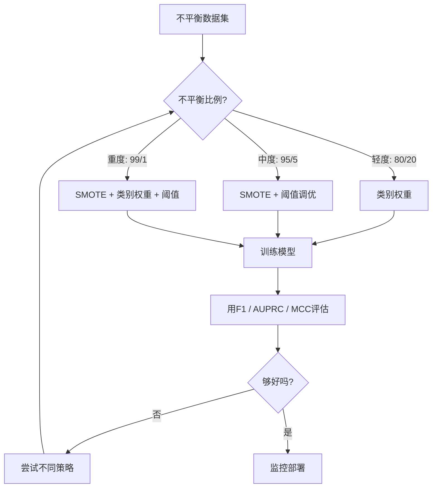
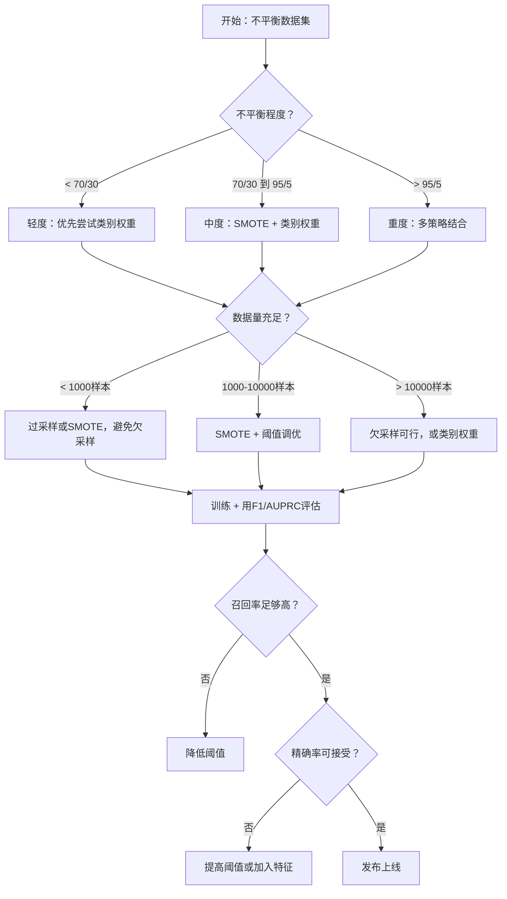

# 处理不平衡数据

> 当你的数据中99%都是“正常”时，准确率就是谎言。

**类型：** 实操  
**语言：** Python  
**先决条件：** 第二阶段，第01-09课（特别是评估指标）  
**时间：** 大约90分钟

## 学习目标

- 从零实现SMOTE（Synthetic Minority Oversampling Technique，合成少数类过采样技术）并解释合成过采样与随机重复的区别  
- 使用F1、AUPRC（精确召回曲线下面积）和Matthews相关系数评估不平衡分类器，代替准确率  
- 比较类别权重、阈值调优和重采样策略，并根据不平衡比例选择合适方法  
- 构建一个完整的不平衡数据流水线，结合SMOTE、类别权重和阈值优化  

## 问题

你构建了一个欺诈检测模型。准确率达到99.9%。你很高兴。然后你意识到它对每笔交易都预测为“非欺诈”。

这不是bug。当仅有0.1%的交易是欺诈时，这是合理的做法。模型学习到始终猜测多数类可以最小化总体错误率。这技术上正确，但完全没用。

这在所有真正需要分类的场景中都存在。疾病诊断：1%阳性率。网络入侵：0.01%攻击。制造缺陷：0.5%次品。垃圾邮件过滤：20%垃圾邮件。流失预测：5%流失用户。少数类的重要性越大，它通常越稀少。

准确率失败的原因是它把所有正确预测同等对待。正确标记合法交易和正确识别欺诈都算一分。但识别欺诈才是模型存在的全部意义。我们需要指标、技术和训练策略迫使模型关注稀有但重要的少数类。

## 概念

### 准确率为何失败

考虑一个有1000个样本的数据集：990个负样本，10个正样本。一个总是预测负类的模型：

|  | 预测为正 | 预测为负 |
|--|---|---|
| 实际为正 | 0（TP） | 10（FN） |
| 实际为负 | 0（FP） | 990（TN） |

准确率 = (0 + 990) / 1000 = 99.0%

模型完全没检测到欺诈、疾病或缺陷。但准确率显示99%。这就是准确率对于不平衡问题的危险性。

### 更好的指标

**精确率 (Precision)** = TP / (TP + FP)。被标记为正的中，实际为正的比例。高精确率表示误报少。

**召回率 (Recall)** = TP / (TP + FN)。实际为正的中，被检测到的比例。高召回率表示漏报少。

**F1分数** = 2 * 精确率 * 召回率 / (精确率 + 召回率)。调和平均。当精确率和召回率极度不平衡时，惩罚更大。

**F-beta分数** = (1 + beta²) * 精确率 * 召回率 / (beta² * 精确率 + 召回率)。beta > 1时召回更重要，beta < 1时精确率更重要。欺诈检测常用F2（漏检欺诈比误报更糟糕）。

**AUPRC**（精确-召回曲线下面积）。类似AUC-ROC但对不平衡数据更有信息量。随机分类器的AUPRC是正类比例（非0.5），更容易观察提升。

**Matthews相关系数 (MCC)** = (TP * TN - FP * FN) / sqrt((TP+FP)(TP+FN)(TN+FP)(TN+FN))。值范围[-1, +1]，仅当模型对两类都表现好时得高分。即使类别大小差距大也平衡。

对上面总预测负类的模型：精确率 = 0/0（未定义，常设为0），召回率 = 0/10 = 0，F1 = 0，MCC = 0。这些指标准确反映模型无用。

### 不平衡数据流水线



### SMOTE：合成少数类过采样技术

随机过采样重复少数类样本。有效但可能过拟合，因为模型反复看到相同点。

SMOTE合成新的少数类样本，合理但不重复。算法：

1. 对每个少数样本x，找k个最近的少数类邻居  
2. 随机选一个邻居  
3. 在x和邻居点线段上随机位置生成新样本  

公式：`new_sample = x + random(0, 1) * (neighbor - x)`

在真实少数类点之间插值，生成特征空间中“相似”但非拷贝的新样本。


### 采样策略比较

**随机过采样**：复制少数类样本到多数类数量。  
- 优点：简单，无信息损失  
- 缺点：重复样本导致过拟合，训练时间增加

**随机欠采样**：删除多数类样本以匹配少数类。  
- 优点：训练快，简单  
- 缺点：丢弃潜在有用数据，方差高

**SMOTE**：通过插值生成少数类合成样本。  
- 优点：生成新样本，较随机过采样减少过拟合  
- 缺点：可能在决策边界产生噪声样本，不考虑多数类分布

| 策略       | 数据更改          | 风险           | 适用场景                     |
|----------|------------------|--------------|----------------------------|
| 过采样     | 少数类复制         | 过拟合          | 小数据集，中度不平衡                |
| 欠采样     | 多数类删除         | 信息丢失         | 大数据集，需快速训练                |
| SMOTE    | 合成少数类样本      | 边界噪声         | 中度不平衡，有足够少数类样本用于k-NN |

### 类别权重

不改变数据，而改变模型对错误的处理方式。对少数类错误赋予更高权重。

以二分类问题，950负样本，50正样本为例：  
- 负类权重 = n_samples / (2 * n_negative) = 1000 / (2 * 950) = 0.526  
- 正类权重 = n_samples / (2 * n_positive) = 1000 / (2 * 50) = 10.0  

正类权重是负类的19倍。错分一个正样本代价等于错分19个负样本，迫使模型关注少数类。

在逻辑回归中修改损失函数为：

```text
weighted_loss = -sum(w_i * [y_i * log(p_i) + (1-y_i) * log(1-p_i)])
```

其中w_i取决于样本i所属类别。

类别权重在期望意义上等价于过采样，但不产生新数据点，更快且避免复制样本导致的过拟合风险。

### 阈值调优

大多数分类器输出概率。默认阈值是0.5：若P(正类) >= 0.5，则预测正类。但0.5是任意的。类别不平衡时，最优阈值通常低得多。

流程：  
1. 训练模型  
2. 在验证集上获取预测概率  
3. 在0.0到1.0之间遍历阈值  
4. 计算每个阈值的F1（或选定指标）  
5. 选择指标最大的阈值作为最佳阈值  


模型对欺诈样本输出P=0.15，阈值0.5时预测为非欺诈，阈值0.10时正确预测为欺诈。概率校准不那么关键，关键是排名——只要欺诈概率高于非欺诈，就能找到分割阈值。

### 成本敏感学习

类别权重的推广。赋予不同错误不同成本：

|               | 预测为正       | 预测为负       |
|--------------|--------------|--------------|
| 实际为正       | 0（正确）      | C_FN = 100   |
| 实际为负       | C_FP = 1     | 0（正确）     |

漏检欺诈代价（FN）比误报（FP）高100倍。模型优化目标是总成本，而非错误数。

这是估计现实成本后最合理的方法。漏诊癌症的代价与误报警导致额外活检无法相比。明确成本权重才能权衡得当。

### 决策流程图



## 实践

### 第一步：生成不平衡数据集

```python
import numpy as np


def make_imbalanced_data(n_majority=950, n_minority=50, seed=42):
    rng = np.random.RandomState(seed)

    X_maj = rng.randn(n_majority, 2) * 1.0 + np.array([0.0, 0.0])
    X_min = rng.randn(n_minority, 2) * 0.8 + np.array([2.5, 2.5])

    X = np.vstack([X_maj, X_min])
    y = np.concatenate([np.zeros(n_majority), np.ones(n_minority)])

    shuffle_idx = rng.permutation(len(y))
    return X[shuffle_idx], y[shuffle_idx]
```

### 第二步：从零实现SMOTE

```python
def euclidean_distance(a, b):
    return np.sqrt(np.sum((a - b) ** 2))


def find_k_neighbors(X, idx, k):
    distances = []
    for i in range(len(X)):
        if i == idx:
            continue
        d = euclidean_distance(X[idx], X[i])
        distances.append((i, d))
    distances.sort(key=lambda x: x[1])
    return [d[0] for d in distances[:k]]


def smote(X_minority, k=5, n_synthetic=100, seed=42):
    rng = np.random.RandomState(seed)
    n_samples = len(X_minority)
    k = min(k, n_samples - 1)
    synthetic = []

    for _ in range(n_synthetic):
        idx = rng.randint(0, n_samples)
        neighbors = find_k_neighbors(X_minority, idx, k)
        neighbor_idx = neighbors[rng.randint(0, len(neighbors))]
        t = rng.random()
        new_point = X_minority[idx] + t * (X_minority[neighbor_idx] - X_minority[idx])
        synthetic.append(new_point)

    return np.array(synthetic)
```

### 第3步：随机过采样和欠采样

```python
def random_oversample(X, y, seed=42):
    rng = np.random.RandomState(seed)
    classes, counts = np.unique(y, return_counts=True)
    max_count = counts.max()

    X_resampled = list(X)
    y_resampled = list(y)

    for cls, count in zip(classes, counts):
        if count < max_count:
            cls_indices = np.where(y == cls)[0]
            n_needed = max_count - count
            chosen = rng.choice(cls_indices, size=n_needed, replace=True)
            X_resampled.extend(X[chosen])
            y_resampled.extend(y[chosen])

    X_out = np.array(X_resampled)
    y_out = np.array(y_resampled)
    shuffle = rng.permutation(len(y_out))
    return X_out[shuffle], y_out[shuffle]


def random_undersample(X, y, seed=42):
    rng = np.random.RandomState(seed)
    classes, counts = np.unique(y, return_counts=True)
    min_count = counts.min()

    X_resampled = []
    y_resampled = []

    for cls in classes:
        cls_indices = np.where(y == cls)[0]
        chosen = rng.choice(cls_indices, size=min_count, replace=False)
        X_resampled.extend(X[chosen])
        y_resampled.extend(y[chosen])

    X_out = np.array(X_resampled)
    y_out = np.array(y_resampled)
    shuffle = rng.permutation(len(y_out))
    return X_out[shuffle], y_out[shuffle]
```

### 第4步：带类别权重的逻辑回归（logistic regression）

```python
def sigmoid(z):
    return 1.0 / (1.0 + np.exp(-np.clip(z, -500, 500)))


def logistic_regression_weighted(X, y, weights, lr=0.01, epochs=200):
    n_samples, n_features = X.shape
    w = np.zeros(n_features)
    b = 0.0

    for _ in range(epochs):
        z = X @ w + b
        pred = sigmoid(z)
        error = pred - y
        weighted_error = error * weights

        gradient_w = (X.T @ weighted_error) / n_samples
        gradient_b = np.mean(weighted_error)

        w -= lr * gradient_w
        b -= lr * gradient_b

    return w, b


def compute_class_weights(y):
    classes, counts = np.unique(y, return_counts=True)
    n_samples = len(y)
    n_classes = len(classes)
    weight_map = {}
    for cls, count in zip(classes, counts):
        weight_map[cls] = n_samples / (n_classes * count)
    return np.array([weight_map[yi] for yi in y])
```

### 第5步：阈值调优（threshold tuning）

```python
def find_optimal_threshold(y_true, y_probs, metric="f1"):
    best_threshold = 0.5
    best_score = -1.0

    for threshold in np.arange(0.05, 0.96, 0.01):
        y_pred = (y_probs >= threshold).astype(int)
        tp = np.sum((y_pred == 1) & (y_true == 1))
        fp = np.sum((y_pred == 1) & (y_true == 0))
        fn = np.sum((y_pred == 0) & (y_true == 1))

        if metric == "f1":
            precision = tp / (tp + fp) if (tp + fp) > 0 else 0.0
            recall = tp / (tp + fn) if (tp + fn) > 0 else 0.0
            score = 2 * precision * recall / (precision + recall) if (precision + recall) > 0 else 0.0
        elif metric == "recall":
            score = tp / (tp + fn) if (tp + fn) > 0 else 0.0
        elif metric == "precision":
            score = tp / (tp + fp) if (tp + fp) > 0 else 0.0

        if score > best_score:
            best_score = score
            best_threshold = threshold

    return best_threshold, best_score
```

### 第6步：评估函数

```python
def confusion_matrix_values(y_true, y_pred):
    tp = np.sum((y_pred == 1) & (y_true == 1))
    tn = np.sum((y_pred == 0) & (y_true == 0))
    fp = np.sum((y_pred == 1) & (y_true == 0))
    fn = np.sum((y_pred == 0) & (y_true == 1))
    return tp, tn, fp, fn


def compute_metrics(y_true, y_pred):
    tp, tn, fp, fn = confusion_matrix_values(y_true, y_pred)
    accuracy = (tp + tn) / (tp + tn + fp + fn)
    precision = tp / (tp + fp) if (tp + fp) > 0 else 0.0
    recall = tp / (tp + fn) if (tp + fn) > 0 else 0.0
    f1 = 2 * precision * recall / (precision + recall) if (precision + recall) > 0 else 0.0

    denom = np.sqrt(float((tp + fp) * (tp + fn) * (tn + fp) * (tn + fn)))
    mcc = (tp * tn - fp * fn) / denom if denom > 0 else 0.0

    return {
        "accuracy": accuracy,
        "precision": precision,
        "recall": recall,
        "f1": f1,
        "mcc": mcc,
    }
```

### 第7步：比较所有方法

```python
X, y = make_imbalanced_data(950, 50, seed=42)
split = int(0.8 * len(y))
X_train, X_test = X[:split], X[split:]
y_train, y_test = y[:split], y[split:]

# 基线：不做处理
w_base, b_base = logistic_regression_weighted(
    X_train, y_train, np.ones(len(y_train)), lr=0.1, epochs=300
)
probs_base = sigmoid(X_test @ w_base + b_base)
preds_base = (probs_base >= 0.5).astype(int)

# 过采样
X_over, y_over = random_oversample(X_train, y_train)
w_over, b_over = logistic_regression_weighted(
    X_over, y_over, np.ones(len(y_over)), lr=0.1, epochs=300
)
preds_over = (sigmoid(X_test @ w_over + b_over) >= 0.5).astype(int)

# SMOTE
minority_mask = y_train == 1
X_minority = X_train[minority_mask]
synthetic = smote(X_minority, k=5, n_synthetic=len(y_train) - 2 * int(minority_mask.sum()))
X_smote = np.vstack([X_train, synthetic])
y_smote = np.concatenate([y_train, np.ones(len(synthetic))])
w_sm, b_sm = logistic_regression_weighted(
    X_smote, y_smote, np.ones(len(y_smote)), lr=0.1, epochs=300
)
preds_smote = (sigmoid(X_test @ w_sm + b_sm) >= 0.5).astype(int)

# 类别权重
sample_weights = compute_class_weights(y_train)
w_cw, b_cw = logistic_regression_weighted(
    X_train, y_train, sample_weights, lr=0.1, epochs=300
)
probs_cw = sigmoid(X_test @ w_cw + b_cw)
preds_cw = (probs_cw >= 0.5).astype(int)

# 阈值调优（在保留验证集上调优，不是在测试集上）
probs_val = sigmoid(X_val @ w_cw + b_cw)
best_thresh, best_f1 = find_optimal_threshold(y_val, probs_val, metric="f1")
preds_thresh = (probs_cw >= best_thresh).astype(int)
```

代码文件在一个脚本中运行以上全部内容并打印结果。

## 使用方法

使用 scikit-learn 和 imbalanced-learn，这些技术都可以一行代码实现：

```python
from sklearn.linear_model import LogisticRegression
from sklearn.metrics import classification_report, f1_score
from sklearn.model_selection import train_test_split
from imblearn.over_sampling import SMOTE
from imblearn.under_sampling import RandomUnderSampler
from imblearn.pipeline import Pipeline

X_train, X_test, y_train, y_test = train_test_split(X, y, stratify=y)

model_weighted = LogisticRegression(class_weight="balanced")
model_weighted.fit(X_train, y_train)
print(classification_report(y_test, model_weighted.predict(X_test)))

smote = SMOTE(random_state=42)
X_resampled, y_resampled = smote.fit_resample(X_train, y_train)
model_smote = LogisticRegression()
model_smote.fit(X_resampled, y_resampled)
print(classification_report(y_test, model_smote.predict(X_test)))

pipeline = Pipeline([
    ("smote", SMOTE()),
    ("model", LogisticRegression(class_weight="balanced")),
])
pipeline.fit(X_train, y_train)
print(classification_report(y_test, pipeline.predict(X_test)))
```

这些从零实现的代码展示了每种技术具体的细节。SMOTE 只是少数类上的 k-NN 插值。类别权重就是给损失乘以权重。阈值调优是对不同阈值的简单循环。没有魔法。

## 部署

本课输出：
- `outputs/skill-imbalanced-data.md` -- 处理不平衡分类问题的决策检查清单

## 练习

1. **Borderline-SMOTE**：修改 SMOTE 实现，只为靠近决策边界的少数类点生成合成样本（即其 k 近邻中包含多数类样本）。在类重叠的数据集上比较此方法与标准 SMOTE 的效果。

2. **代价矩阵优化**：实现代价敏感学习，其中代价矩阵作为参数。创建一个函数，输入代价矩阵，输出最小化期望代价的最优预测。用不同代价比率（1:10，1:100，1:1000）测试，并绘制精确率-召回率曲线的变化。

3. **阈值校准**：实现 Platt 校准（对模型的原始输出拟合逻辑回归来产生校准概率）。比较校准前后的精确率-召回率曲线。证明校准不改变排序（AUC 不变），但使概率更具意义。

4. **平衡装袋集成**：训练多个模型，每个模型在一个平衡的自助样本上训练（所有少数类加上多数类的随机子集）。对预测结果取平均。将该方法与单模型 SMOTE 进行对比，比较性能和多次运行的方差。

5. **不平衡比例实验**：取一个平衡数据集，逐步增加不平衡比例（50/50, 70/30, 90/10, 95/5, 99/1）。每个比例下，分别用和不用 SMOTE 训练。绘制不平衡比例与 F1 的关系图。找出 SMOTE 何时开始产生显著效果。

## 关键词

| 术语 | 常用说法 | 实际含义 |
|------|-----------|----------|
| Class imbalance（类别不平衡） | “一个类别有更多样本” | 数据集中类别分布严重偏斜，导致模型偏向多数类 |
| SMOTE | “合成过采样” | 通过在少数类样本与其 k 近邻之间插值生成新的少数类样本 |
| Class weights（类别权重） | “对少数类错误赋予更大代价” | 对损失函数乘以类别权重，使模型对少数类误分类罚分更重 |
| Threshold tuning（阈值调优） | “移动决策边界” | 改变分类概率的默认阈值 0.5，使其优化目标指标 |
| Precision-recall tradeoff（精确率-召回率权衡） | “两者不可兼得” | 降低阈值提高召回率，但降低精确率，反之亦然 |
| AUPRC | “PR 曲线下面积” | 将精确率-召回率曲线汇总成单个数值；在类极度不平衡时比 AUC-ROC 更有信息量 |
| Matthews Correlation Coefficient（马修斯相关系数） | “平衡指标” | 预测与实际标签的相关系数，仅当模型两类都表现良好时得分高 |
| Cost-sensitive learning（代价敏感学习） | “不同错误代价不同” | 将实际误分类代价整合进训练目标，使模型优化总代价而非错误数 |
| Random oversampling（随机过采样） | “重复少数类样本” | 复制少数类样本以平衡类数，简单但易过拟合复制点 |

## 进一步阅读

- [SMOTE: Synthetic Minority Over-sampling Technique (Chawla et al., 2002)](https://arxiv.org/abs/1106.1813) -- 原始 SMOTE 论文，仍是不平衡学习领域引用最多的工作
- [Learning from Imbalanced Data (He & Garcia, 2009)](https://ieeexplore.ieee.org/document/5128907) -- 涵盖采样、代价敏感和算法性方法的全面综述
- [imbalanced-learn 文档](https://imbalanced-learn.org/stable/) -- 含 SMOTE 变体、欠采样策略及管线集成的 Python 库
- [The Precision-Recall Plot Is More Informative than the ROC Plot (Saito & Rehmsmeier, 2015)](https://journals.plos.org/plosone/article?id=10.1371/journal.pone.0118432) -- 说明为何对不平衡问题应优先使用 PR 曲线而非 ROC 曲线
