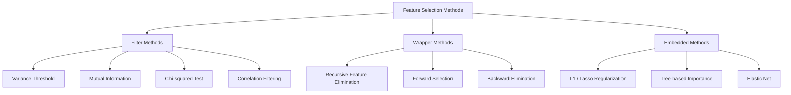
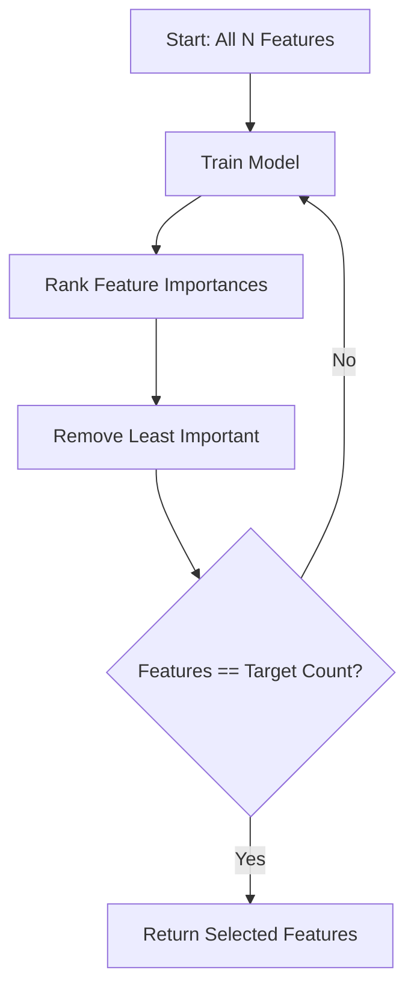
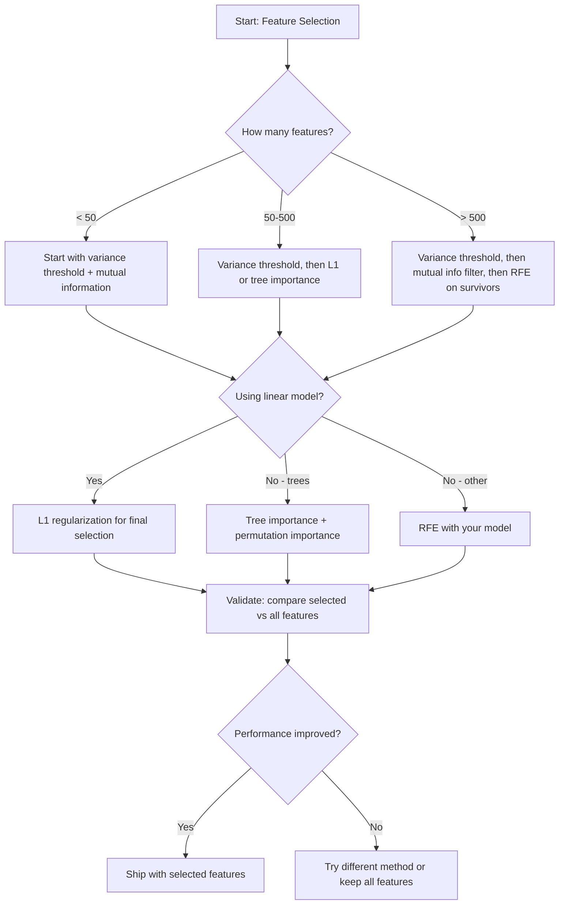

# 特征选择

> 更多特征不等于更好。正确的特征才是更好。

**类型：** 构建  
**语言：** Python  
**先决条件：** 阶段2，第01-09课，08课（特征工程）  
**时间：** 约75分钟

## 学习目标

- 从零实现过滤方法（方差阈值、互信息、卡方检验）和包裹方法（递归特征消除（Recursive Feature Elimination, RFE）、前向选择）
- 解释为什么互信息可以捕捉相关性（correlation）无法发现的非线性特征-目标关系
- 比较L1正则化（嵌入式选择（embedded selection））与RFE（包裹式选择（wrapper selection）），评估它们的计算权衡
- 构建结合多种方法的特征选择流水线，在保留集（held-out data）上展示泛化提升

## 问题描述

你有500个特征。模型训练缓慢，频繁过拟合，没人能解释它学到了什么。你增加更多特征以期提升性能，结果反而更差了。

这正是维度灾难（curse of dimensionality）的体现。随着特征数量的增加，特征空间的体积爆炸式增长。数据点变得稀疏。点之间的距离趋同。模型需要指数级更多数据才能找到真实模式。噪声特征淹没了信号特征。过拟合变成默认状态。

特征选择是灵丹妙药。剥离噪声。移除冗余。保留真正携带目标信息的特征。结果是训练更快，泛化更好，模型更容易解释。

目标不是用尽所有信息，而是用对的信息。

## 概念

### 三类特征选择

每种特征选择方法都属于以下三类之一：



**过滤方法（Filter methods）** 使用统计量独立打分每个特征。不使用模型。速度快，但忽视特征之间的相互作用。

**包裹方法（Wrapper methods）** 训练模型评估特征子集，使用模型性能作为评分。结果更好，但因多次训练模型而昂贵。

**嵌入式方法（Embedded methods）** 在模型训练过程中选择特征。L1正则使权重变为零。决策树基于最有用特征分裂。选择发生在拟合阶段，不是独立步骤。

### 方差阈值

最简单的过滤器。如果特征在样本间几乎不变，则几乎不携带信息。

考虑一个特征在1000个样本中有999个值为0.0。其方差近乎零。没有模型能用它区分类别。应该删除它。

```text
variance(x) = mean((x - mean(x))^2)
```

设阈值（如0.01）。丢弃所有方差低于阈值的特征。这无需查看目标变量，能去除常量或近似常量特征。

何时使用：作为其他方法前的预处理步骤。以极低代价剔除显然无用的特征。

限制：特征可能方差高，但纯粹是噪声。方差阈值是必要条件，但非充分条件。

### 互信息

互信息衡量知道特征X的值可减少多少对目标Y的不确定性。

```text
I(X; Y) = sum_x sum_y p(x, y) * log(p(x, y) / (p(x) * p(y)))
```

如果X与Y独立，则 p(x, y) = p(x)*p(y)，对数项为零，I(X; Y) = 0。X告诉你Y越多，互信息越高。

互信息优于相关性的关键：它能捕捉非线性关系。特征与目标相关性为零，但关系是二次或周期性，因此互信息高。

对连续特征先分箱（基于直方图估计）。分箱数量影响估计结果——箱数过少丢失信息，过多引入噪声。常用选择：sqrt(n)箱或Sturges规则（1 + log2(n)）。


### 递归特征消除（RFE）

RFE是包裹法。基于模型自身的特征重要性迭代剪枝：

1. 用所有特征训练模型  
2. 按重要性排序特征（线性模型用系数，树模型用不纯度减少）  
3. 移除最不重要的特征  
4. 重复直至达到目标特征数  



RFE考虑特征交互，因为模型同时看到所有保留特征。移除一个特征会改变其他重要性。比过滤法更全面。

代价是训练次数是N减目标特征数。500特征，目标10个，即训练490次。复杂模型时慢。可每步移除多特征（如每轮去底部10%）加速。

### L1（Lasso）正则化

L1正则向损失函数增加权重绝对值总和：

```text
loss = prediction_error + alpha * sum(|w_i|)
```

参数alpha控制剪枝力度。alpha越大，更多权重变为零。

为啥会有完全为零的权重？L1惩罚构造出了权重空间中的菱形约束区域。最优解倾向于位于菱形顶点，某些权重正好为零。L2正则（ridge）约束是圆形，权重缩小但很少为零。

这就是嵌入式特征选择：模型训练时学会忽略哪些特征。权重为零的特征被视作被移除。

优点：只需一次训练，能处理相关特征（会选择其中一个，其他零化），大多数线性模型实现内置。

限制：仅对线性模型有效。无法捕捉非线性特征重要性。

### 基于树的特征重要性

决策树及其集成模型（随机森林、梯度提升）自然能够排名特征。每次分裂减少不纯度（分类用基尼或熵，回归用方差）。减少不纯度多的特征更重要。

随机森林中，有T棵树：

```text
importance(feature_j) = (1/T) * sum over all trees of
    sum over all nodes splitting on feature_j of
        (n_samples * impurity_decrease)
```

得到归一化的重要性评分。自动捕捉非线性关系和特征间交互。

注意：树的重要性偏向多唯一值特征（高基数）。随机ID列因完美划分样本看似重要。用置换重要性（permutation importance）做合理性检查。

### 置换重要性（Permutation Importance）

一种模型无关（model-agnostic）方法：

1. 训练模型，记录验证集基线性能  
2. 对每个特征：随机打乱其值，测量性能降低量  
3. 降低越多，特征越重要  

若打乱特征无碍性能，说明模型不依赖它；若性能崩溃，该特征至关重要。

避免树重要性中的基数偏见。但较慢：对每特征做完整验证，多次重复以稳定性。

### 比较表格

| 方法             | 类型      | 速度   | 非线性  | 特征交互           |
|----------------|---------|-------|---------|--------------------|
| 方差阈值          | 过滤器     | 非常快  | 否      | 否                 |
| 互信息           | 过滤器     | 快     | 是      | 否                 |
| 相关过滤          | 过滤器     | 快     | 否      | 否                 |
| RFE             | 包裹法     | 慢     | 依赖模型 | 是                 |
| L1 / Lasso      | 嵌入式     | 快     | 否（线性）| 否                 |
| 基于树的重要性      | 嵌入式     | 中等    | 是      | 是                 |
| 置换重要性         | 模型无关    | 慢     | 是      | 是                 |

### 决策流程图



## 实战构建

### 步骤1：生成带已知特征结构的合成数据

```python
import numpy as np


def make_feature_selection_data(n_samples=500, seed=42):
    rng = np.random.RandomState(seed)

    x1 = rng.randn(n_samples)
    x2 = rng.randn(n_samples)
    x3 = rng.randn(n_samples)
    x4 = x1 + 0.1 * rng.randn(n_samples)
    x5 = x2 + 0.1 * rng.randn(n_samples)

    informative = np.column_stack([x1, x2, x3, x4, x5])

    correlated = np.column_stack([
        x1 * 0.9 + 0.1 * rng.randn(n_samples),
        x2 * 0.8 + 0.2 * rng.randn(n_samples),
        x3 * 0.7 + 0.3 * rng.randn(n_samples),
        x1 * 0.5 + x2 * 0.5 + 0.1 * rng.randn(n_samples),
        x2 * 0.6 + x3 * 0.4 + 0.1 * rng.randn(n_samples),
    ])

    noise = rng.randn(n_samples, 10) * 0.5

    X = np.hstack([informative, correlated, noise])
    y = (2 * x1 - 1.5 * x2 + x3 + 0.5 * rng.randn(n_samples) > 0).astype(int)

    feature_names = (
        [f"info_{i}" for i in range(5)]
        + [f"corr_{i}" for i in range(5)]
        + [f"noise_{i}" for i in range(10)]
    )

    return X, y, feature_names
```

我们已知真实情况：特征0-4是信息特征（其中3和4是0和1的相关副本），特征5-9与信息特征相关，特征10-19是纯噪声。好的选择方法应将0-4排在最前，10-19排在最后。

### 步骤2：方差阈值

```python
def variance_threshold(X, threshold=0.01):
    variances = np.var(X, axis=0)
    mask = variances > threshold
    return mask, variances
```

### 步骤3：互信息（离散）

```python
def discretize(x, n_bins=10):
    min_val, max_val = x.min(), x.max()
    if max_val == min_val:
        return np.zeros_like(x, dtype=int)
    bin_edges = np.linspace(min_val, max_val, n_bins + 1)
    binned = np.digitize(x, bin_edges[1:-1])
    return binned


def mutual_information(X, y, n_bins=10):
    n_samples, n_features = X.shape
    mi_scores = np.zeros(n_features)

    y_vals, y_counts = np.unique(y, return_counts=True)
    p_y = y_counts / n_samples

    for f in range(n_features):
        x_binned = discretize(X[:, f], n_bins)
        x_vals, x_counts = np.unique(x_binned, return_counts=True)
        p_x = dict(zip(x_vals, x_counts / n_samples))

        mi = 0.0
        for xv in x_vals:
            for yi, yv in enumerate(y_vals):
                joint_mask = (x_binned == xv) & (y == yv)
                p_xy = np.sum(joint_mask) / n_samples
                if p_xy > 0:
                    mi += p_xy * np.log(p_xy / (p_x[xv] * p_y[yi]))
        mi_scores[f] = mi

    return mi_scores
```

### 第4步：递归特征消除（Recursive Feature Elimination）

```python
def simple_logistic_importance(X, y, lr=0.1, epochs=100):
    n_samples, n_features = X.shape
    w = np.zeros(n_features)
    b = 0.0

    for _ in range(epochs):
        z = X @ w + b
        pred = 1.0 / (1.0 + np.exp(-np.clip(z, -500, 500)))
        error = pred - y
        w -= lr * (X.T @ error) / n_samples
        b -= lr * np.mean(error)

    return w, b


def rfe(X, y, n_features_to_select=5, lr=0.1, epochs=100):
    n_total = X.shape[1]
    remaining = list(range(n_total))
    rankings = np.ones(n_total, dtype=int)
    rank = n_total

    while len(remaining) > n_features_to_select:
        X_subset = X[:, remaining]
        w, _ = simple_logistic_importance(X_subset, y, lr, epochs)
        importances = np.abs(w)

        least_idx = np.argmin(importances)
        original_idx = remaining[least_idx]
        rankings[original_idx] = rank
        rank -= 1
        remaining.pop(least_idx)

    for idx in remaining:
        rankings[idx] = 1

    selected_mask = rankings == 1
    return selected_mask, rankings
```

### 第5步：L1特征选择

```python
def soft_threshold(w, alpha):
    return np.sign(w) * np.maximum(np.abs(w) - alpha, 0)


def l1_feature_selection(X, y, alpha=0.1, lr=0.01, epochs=500):
    n_samples, n_features = X.shape
    w = np.zeros(n_features)
    b = 0.0

    for _ in range(epochs):
        z = X @ w + b
        pred = 1.0 / (1.0 + np.exp(-np.clip(z, -500, 500)))
        error = pred - y

        gradient_w = (X.T @ error) / n_samples
        gradient_b = np.mean(error)

        w -= lr * gradient_w
        w = soft_threshold(w, lr * alpha)
        b -= lr * gradient_b

    selected_mask = np.abs(w) > 1e-6
    return selected_mask, w
```

### 第6步：基于树的特征重要性（简单决策树）

```python
def gini_impurity(y):
    if len(y) == 0:
        return 0.0
    classes, counts = np.unique(y, return_counts=True)
    probs = counts / len(y)
    return 1.0 - np.sum(probs ** 2)


def best_split(X, y, feature_idx):
    values = np.unique(X[:, feature_idx])
    if len(values) <= 1:
        return None, -1.0

    best_threshold = None
    best_gain = -1.0
    parent_gini = gini_impurity(y)
    n = len(y)

    for i in range(len(values) - 1):
        threshold = (values[i] + values[i + 1]) / 2.0
        left_mask = X[:, feature_idx] <= threshold
        right_mask = ~left_mask

        n_left = np.sum(left_mask)
        n_right = np.sum(right_mask)

        if n_left == 0 or n_right == 0:
            continue

        gain = parent_gini - (n_left / n) * gini_impurity(y[left_mask]) - (n_right / n) * gini_impurity(y[right_mask])

        if gain > best_gain:
            best_gain = gain
            best_threshold = threshold

    return best_threshold, best_gain


def tree_importance(X, y, n_trees=50, max_depth=5, seed=42):
    rng = np.random.RandomState(seed)
    n_samples, n_features = X.shape
    importances = np.zeros(n_features)

    for _ in range(n_trees):
        sample_idx = rng.choice(n_samples, size=n_samples, replace=True)
        feature_subset = rng.choice(n_features, size=max(1, int(np.sqrt(n_features))), replace=False)

        X_boot = X[sample_idx]
        y_boot = y[sample_idx]

        tree_imp = _build_tree_importance(X_boot, y_boot, feature_subset, max_depth)
        importances += tree_imp

    total = importances.sum()
    if total > 0:
        importances /= total

    return importances


def _build_tree_importance(X, y, feature_subset, max_depth, depth=0):
    n_features = X.shape[1]
    importances = np.zeros(n_features)

    if depth >= max_depth or len(np.unique(y)) <= 1 or len(y) < 4:
        return importances

    best_feature = None
    best_threshold = None
    best_gain = -1.0

    for f in feature_subset:
        threshold, gain = best_split(X, y, f)
        if gain > best_gain:
            best_gain = gain
            best_feature = f
            best_threshold = threshold

    if best_feature is None or best_gain <= 0:
        return importances

    importances[best_feature] += best_gain * len(y)

    left_mask = X[:, best_feature] <= best_threshold
    right_mask = ~left_mask

    importances += _build_tree_importance(X[left_mask], y[left_mask], feature_subset, max_depth, depth + 1)
    importances += _build_tree_importance(X[right_mask], y[right_mask], feature_subset, max_depth, depth + 1)

    return importances
```

### 第7步：运行所有方法并进行比较

该代码文件在相同的合成数据集上运行所有五种方法，并打印比较表，显示每种方法选择的特征。

## 使用它

使用 scikit-learn，特征选择已集成在管道中：

```python
from sklearn.feature_selection import (
    VarianceThreshold,
    mutual_info_classif,
    RFE,
    SelectFromModel,
)
from sklearn.linear_model import Lasso, LogisticRegression
from sklearn.ensemble import RandomForestClassifier

vt = VarianceThreshold(threshold=0.01)
X_filtered = vt.fit_transform(X)

mi_scores = mutual_info_classif(X, y)
top_k = np.argsort(mi_scores)[-10:]

rfe_selector = RFE(LogisticRegression(), n_features_to_select=10)
rfe_selector.fit(X, y)
X_rfe = rfe_selector.transform(X)

lasso_selector = SelectFromModel(Lasso(alpha=0.01))
lasso_selector.fit(X, y)
X_lasso = lasso_selector.transform(X)

rf = RandomForestClassifier(n_estimators=100)
rf.fit(X, y)
importances = rf.feature_importances_
```

这些纯手工实现展示了每种方法内部到底如何运作。方差阈值只是计算 `var(X, axis=0)` 并应用掩码。互信息是通过统计列联表中的联合与边缘频率计算的。递归特征消除是一个训练、排序、剪枝的循环。L1 是带软阈值步骤的梯度下降。树重要性累积分裂的不纯度降低。没有魔法——纯粹是统计和循环。

sklearn 版本增加了鲁棒性（例如，mutual_info_classif 使用 k-NN 密度估计代替分箱）、速度（C 语言实现）和管道集成。

## 交付成果

本课产出：
- `outputs/skill-feature-selector.md` —— 一个快速参考的决策树，帮助选择合适的特征选择方法

## 练习

1. **前向选择**：实现递归特征消除的反向操作。从零特征开始，每步添加最能提升模型性能的特征。当添加特征不再提升性能时停止。将选中的特征与RFE结果进行比较。哪个更快？哪个结果更好？

2. **稳定性选择**：运行 L1 特征选择 50 次，每次在随机的 80% 数据子样本上，使用稍微不同的 alpha 值。统计每个特征被选中的次数。被选中超过 80% 次的称为“稳定”特征。将稳定特征与单次 L1 选择结果做对比。哪个更可靠？

3. **多重共线性检测**：计算所有特征的相关系数矩阵。实现一个函数，给定相关阈值（如0.9），从每对高度相关的特征中移除一个（保留与目标变量互信息较高的那个）。在合成数据集上测试，确认它能删除冗余相关的特征。

4. **特征选择管道**：将方差阈值、互信息过滤和递归特征消除串联进一个管道。先移除近乎零方差的特征，再保留互信息排名前50%的特征，最后对幸存特征执行RFE。将此管道与直接对所有特征执行RFE进行比较。管道更快吗？准确度相同吗？

5. **手工实现置换重要性（Permutation Importance）**：实现置换重要性。对每个特征，打乱其值10次，测量F1分数平均下降幅度。将结果排名与树基重要性做比较。找出二者不一致的情况并解释原因（提示：相关特征）。

## 关键术语

| 术语 | 常见说法 | 实际含义 |
|------|----------------|----------------------|
| Filter method（过滤方法） | “独立给特征评分” | 一种基于统计度量对特征单独进行排名的特征选择方法，不训练模型，孤立评估每个特征 |
| Wrapper method（包裹方法） | “用模型挑选特征” | 一种通过训练模型评估特征子集，并以模型表现作为选择标准的特征选择方法 |
| Embedded method（嵌入式方法） | “模型训练时选特征” | 特征选择作为模型拟合的一部分发生，例如使用L1正则化使权重变为零 |
| Mutual information（互信息） | “一个变量告诉你另一个变量多少信息” | 衡量知道 X 后对 Y 不确定性的减少，能捕捉线性和非线性依赖 |
| Recursive Feature Elimination（递归特征消除） | “训练、排名、剪枝、重复” | 一种迭代包裹方法，训练模型后移除最不重要特征，重复直到达到目标特征数 |
| L1 / Lasso regularization（L1/Lasso 正则化） | “惩罚促使特征权重为零” | 将权重绝对值之和加到损失函数中，使不重要的特征权重变为零 |
| Variance threshold（方差阈值） | “去除常量特征” | 丢弃样本间方差低于阈值的特征，过滤没有信息量的特征 |
| Feature importance（特征重要性） | “哪特征最重要” | 表示每个特征对模型预测贡献的分数，由分裂增益（树模型）或系数大小（线性模型）计算 |
| Permutation importance（置换重要性） | “打乱特征值测影响” | 通过随机打乱每个特征值并测量模型性能下降，评估特征重要性 |
| Curse of dimensionality（维度灾难） | “特征太多、数据太少” | 特征空间维度增加，导致数据稀疏，距离意义下降的现象 |

## 延伸阅读

- [An Introduction to Variable and Feature Selection (Guyon & Elisseeff, 2003)](https://jmlr.org/papers/v3/guyon03a.html) —— 特征选择方法的基础综述，至今仍被广泛引用
- [scikit-learn Feature Selection Guide](https://scikit-learn.org/stable/modules/feature_selection.html) —— 过滤、包裹和嵌入式方法的实用参考，含代码示例
- [Stability Selection (Meinshausen & Buhlmann, 2010)](https://arxiv.org/abs/0809.2932) —— 结合子采样与特征选择，获得鲁棒且可复现的结果
- [Beware Default Random Forest Importances (Strobl et al., 2007)](https://bmcbioinformatics.biomedcentral.com/articles/10.1186/1471-2105-8-25) —— 阐明树基重要性的基数偏差，提出条件重要性作为替代方案
