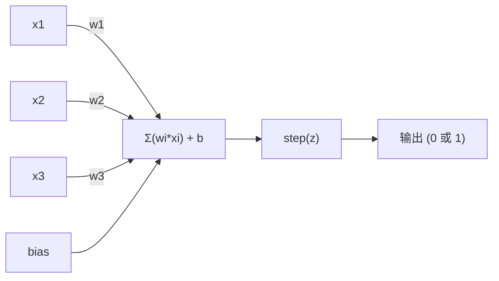
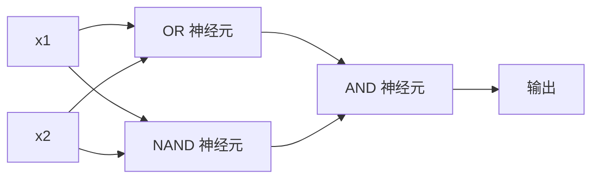

# 感知器（Perceptron）

> 感知器是神经网络的原子。拆开它，你会发现权重、偏置和决策。

**类型：** 构建  
**语言：** Python  
**先修要求：** 阶段 1（线性代数直觉）  
**时间：** ~60 分钟

## 学习目标

- 用 Python 从零实现感知器，包括权重更新规则和阶跃激活函数
- 解释为什么单层感知器只能解决线性可分问题，并演示 XOR 的失败案例
- 通过组合 OR、NAND 和 AND 门构建多层感知器以解决 XOR 问题
- 使用 sigmoid 激活和反向传播训练两层网络，实现自动学习 XOR

## 问题描述

你已经了解向量和点积。你知道矩阵如何将输入转换为输出。但机器是如何*学习*使用哪种变换的呢？

感知器给出了答案。它是最简单的学习机器：接受输入，乘以权重，加上偏置，并做出二元决策。然后调整权重。就是这么简单。所有神经网络实际上都是这层思想叠加而成。

理解感知器意味着理解代码中“学习”真正的含义：调整数字，直到输出与现实相匹配。

## 概念介绍

### 一个神经元，一个决策

感知器接受 n 个输入，每个输入乘以对应权重，求和，加上偏置，然后通过激活函数。



阶跃函数非常简单：加权和加偏置若 >= 0，输出 1，否则输出 0。

```text
step(z) = 1  如果 z >= 0
           0  如果 z < 0
```

这是一个线性分类器。权重和偏置定义了一条线（或更高维空间中的超平面），将输入空间分成两个区域。

### 决策边界

对于两个输入，感知器在二维空间画一条线：

```text
  x2
  ┤
  │  类别 1        /
  │    (0)        /
  │              /
  │             / w1·x1 + w2·x2 + b = 0
  │            /
  │           /     类别 2
  │          /        (1)
  ┼─────────/──────────── x1
```

线的一侧输出 0，另一侧输出 1。训练过程就是不断移动这条线，直到正确分离类别。

### 学习规则

感知器学习规则很简单：

```text
对于每个训练样本 (x, y_true):
    y_pred = 预测(x)
    error = y_true - y_pred

    对于每个权重：
        w_i = w_i + 学习率 * error * x_i
    偏置 = 偏置 + 学习率 * error
```

如果预测正确，error=0，权重不变。如果预测为0而应为1，权重增加；反之，权重减少。学习率控制每次调整的幅度。

### XOR 问题

这里出现问题。看下面的逻辑门：

```text
AND 门:            OR 门:             XOR 门:
x1  x2  输出       x1  x2  输出       x1  x2  输出
0   0   0          0   0   0          0   0   0
0   1   0          0   1   1          0   1   1
1   0   0          1   0   1          1   0   1
1   1   1          1   1   1          1   1   0
```

AND 和 OR 是线性可分的：你可以画一条直线将 0 和 1 分开。XOR 不是如此。没有一条线能把 [0,1] 和 [1,0] 与 [0,0] 和 [1,1] 分开。

```text
AND（可分离）:        XOR（不可分离）:

  x2                    x2
  1 ┤  0     1          1 ┤  1     0
    │     /               │
  0 ┤  0 / 0            0 ┤  0     1
    ┼──/──────── x1       ┼──────────── x1
       直线可以分开！       没有任何单条直线可以分开！
```

这是一个根本性的限制。单层感知器只能解决线性可分问题。Minsky 和 Papert 在 1969 年证明了这一点，这差点让神经网络研究停滞了十年。

解决方法：将感知器堆叠成层。多层感知器通过组合两个线性决策，形成一个非线性决策，从而解决 XOR。

## 构建流程

### 第一步：感知器类

```python
class Perceptron:
    def __init__(self, n_inputs, learning_rate=0.1):
        self.weights = [0.0] * n_inputs
        self.bias = 0.0
        self.lr = learning_rate

    def predict(self, inputs):
        total = sum(w * x for w, x in zip(self.weights, inputs))
        total += self.bias
        return 1 if total >= 0 else 0

    def train(self, training_data, epochs=100):
        for epoch in range(epochs):
            errors = 0
            for inputs, target in training_data:
                prediction = self.predict(inputs)
                error = target - prediction
                if error != 0:
                    errors += 1
                    for i in range(len(self.weights)):
                        self.weights[i] += self.lr * error * inputs[i]
                    self.bias += self.lr * error
            if errors == 0:
                print(f"在第 {epoch + 1} 轮迭代时收敛")
                return
        print(f"{epochs} 轮后未收敛")
```

### 第二步：训练逻辑门

```python
and_data = [
    ([0, 0], 0),
    ([0, 1], 0),
    ([1, 0], 0),
    ([1, 1], 1),
]

or_data = [
    ([0, 0], 0),
    ([0, 1], 1),
    ([1, 0], 1),
    ([1, 1], 1),
]

not_data = [
    ([0], 1),
    ([1], 0),
]

print("=== AND 门 ===")
p_and = Perceptron(2)
p_and.train(and_data)
for inputs, _ in and_data:
    print(f"  {inputs} -> {p_and.predict(inputs)}")

print("\n=== OR 门 ===")
p_or = Perceptron(2)
p_or.train(or_data)
for inputs, _ in or_data:
    print(f"  {inputs} -> {p_or.predict(inputs)}")

print("\n=== NOT 门 ===")
p_not = Perceptron(1)
p_not.train(not_data)
for inputs, _ in not_data:
    print(f"  {inputs} -> {p_not.predict(inputs)}")
```

### 第三步：观察 XOR 失败

```python
xor_data = [
    ([0, 0], 0),
    ([0, 1], 1),
    ([1, 0], 1),
    ([1, 1], 0),
]

print("\n=== XOR 门 (单个感知器) ===")
p_xor = Perceptron(2)
p_xor.train(xor_data, epochs=1000)
for inputs, expected in xor_data:
    result = p_xor.predict(inputs)
    status = "正确" if result == expected else "错误"
    print(f"  {inputs} -> {result} (期望 {expected}) {status}")
```

它永远不会收敛。这就是单个感知器无法学习 XOR 的铁证。

### 第四步：用两层解决 XOR

诀窍：XOR = (x1 OR x2) AND NOT (x1 AND x2)。组合三个感知器：



```python
def xor_network(x1, x2):
    or_neuron = Perceptron(2)
    or_neuron.weights = [1.0, 1.0]
    or_neuron.bias = -0.5

    nand_neuron = Perceptron(2)
    nand_neuron.weights = [-1.0, -1.0]
    nand_neuron.bias = 1.5

    and_neuron = Perceptron(2)
    and_neuron.weights = [1.0, 1.0]
    and_neuron.bias = -1.5

    hidden1 = or_neuron.predict([x1, x2])
    hidden2 = nand_neuron.predict([x1, x2])
    output = and_neuron.predict([hidden1, hidden2])
    return output


print("\n=== XOR 门（多层网络）===")
for inputs, expected in xor_data:
    result = xor_network(inputs[0], inputs[1])
    print(f"  {inputs} -> {result} (期望 {expected})")
```

四种情况均正确。堆叠感知器形成的层次能够创造出单个感知器无法实现的决策边界。

### 第五步：训练两层网络

第四步是手动设置权重。它可以解决 XOR，但对真实问题并无用，因为你不会提前知道正确权重。解决方法是用 sigmoid 替代阶跃函数，通过反向传播自动学习权重。

```python
class TwoLayerNetwork:
    def __init__(self, learning_rate=0.5):
        import random
        random.seed(0)
        self.w_hidden = [[random.uniform(-1, 1), random.uniform(-1, 1)] for _ in range(2)]
        self.b_hidden = [random.uniform(-1, 1), random.uniform(-1, 1)]
        self.w_output = [random.uniform(-1, 1), random.uniform(-1, 1)]
        self.b_output = random.uniform(-1, 1)
        self.lr = learning_rate

    def sigmoid(self, x):
        import math
        x = max(-500, min(500, x))
        return 1.0 / (1.0 + math.exp(-x))

    def forward(self, inputs):
        self.inputs = inputs
        self.hidden_outputs = []
        for i in range(2):
            z = sum(w * x for w, x in zip(self.w_hidden[i], inputs)) + self.b_hidden[i]
            self.hidden_outputs.append(self.sigmoid(z))
        z_out = sum(w * h for w, h in zip(self.w_output, self.hidden_outputs)) + self.b_output
        self.output = self.sigmoid(z_out)
        return self.output

    def train(self, training_data, epochs=10000):
        for epoch in range(epochs):
            total_error = 0
            for inputs, target in training_data:
                output = self.forward(inputs)
                error = target - output
                total_error += error ** 2

                d_output = error * output * (1 - output)

                saved_w_output = self.w_output[:]
                hidden_deltas = []
                for i in range(2):
                    h = self.hidden_outputs[i]
                    hd = d_output * saved_w_output[i] * h * (1 - h)
                    hidden_deltas.append(hd)

                for i in range(2):
                    self.w_output[i] += self.lr * d_output * self.hidden_outputs[i]
                self.b_output += self.lr * d_output

                for i in range(2):
                    for j in range(len(inputs)):
                        self.w_hidden[i][j] += self.lr * hidden_deltas[i] * inputs[j]
                    self.b_hidden[i] += self.lr * hidden_deltas[i]
```

```python
net = TwoLayerNetwork(learning_rate=2.0)
net.train(xor_data, epochs=10000)
for inputs, expected in xor_data:
    result = net.forward(inputs)
    predicted = 1 if result >= 0.5 else 0
    print(f"  {inputs} -> {result:.4f} (四舍五入: {predicted}, 期望 {expected})")
```

与第四步有两个关键区别。首先，sigmoid 替代了阶跃函数——它是连续光滑的，因此存在梯度。其次，`train` 方法通过误差从输出层反向传播至隐藏层，按权重贡献比例调整每个权重。这就是用 20 行代码实现的反向传播。

这是迈向第三课的桥梁。`d_output` 和 `hidden_deltas` 的数学原理是将链式法则应用于网络图，我们会在后续课程中详细推导。

## 实战应用

你刚刚从零构建的一切，都在一个导入中就能实现：

```python
from sklearn.linear_model import Perceptron as SkPerceptron
import numpy as np

X = np.array([[0,0],[0,1],[1,0],[1,1]])
y = np.array([0, 0, 0, 1])

clf = SkPerceptron(max_iter=100, tol=1e-3)
clf.fit(X, y)
print([clf.predict([x])[0] for x in X])
```

五行代码。你写的 30 行感知器类实现了相同的功能。sklearn 版本额外包含了收敛检测、多种损失函数和稀疏输入支持——但核心循环一致：加权求和、阶跃函数、误差时更新权重。

真正的差距出现在规模上。生产网络中发生的变化：

- 阶跃函数变为 sigmoid、ReLU 或其他平滑激活函数
- 权重通过反向传播（Lesson 03）自动学习
- 层数加深：3 层、10 层、甚至 100+ 层
- 原理保持不变：每一层从前一层的输出中创建新的特征

单个感知器（perceptron）只能画直线。将它们堆叠起来，你可以画出任何形状。

## 发布成果

本课产出：
- `outputs/skill-perceptron.md` - 一份技能文档，涵盖何时需要单层架构与多层架构

## 练习

1. 训练一个感知器去拟合 NAND 门（通用逻辑门——任何逻辑电路都可以由 NAND 构建）。验证其权重和偏置是否形成了有效的决策边界。
2. 修改 Perceptron 类，跟踪每个训练周期（epoch）中的决策边界（w1*x1 + w2*x2 + b = 0）。打印 AND 门训练过程中直线如何移动。
3. 构建一个 3 输入的感知器，当且仅当 3 个输入中至少 2 个为 1 时输出 1（多数投票函数）。这个问题是线性可分的吗？为什么？

## 关键词

| 术语 | 大家怎么说 | 实际含义 |
|------|------------|----------|
| Perceptron（感知器） | “一个假的神经元” | 一个线性分类器：输入和权重的点积，加上偏置，通过阶跃函数 |
| Weight（权重） | “输入的重要程度” | 一个乘数，缩放每个输入对决策的贡献 |
| Bias（偏置） | “阈值” | 一个常数，平移决策边界，使感知器即使输入为零也可以发火 |
| Activation function（激活函数） | “压缩数值的东西” | 应用于加权和之后的函数——感知器用阶跃函数，现代网络用 sigmoid/ReLU |
| Linearly separable（线性可分） | “可以画一条线分开它们” | 数据集可以用单个超平面完美分开各类别 |
| XOR problem（XOR 问题） | “感知器做不到的事” | 证明单层网络无法学习非线性可分函数 |
| Decision boundary（决策边界） | “分类器切换的位置” | 将输入空间划分为两个类别的超平面 w*x + b = 0 |
| Multi-layer perceptron（多层感知器） | “真正的神经网络” | 由多层堆叠的感知器组成，每层输出作为下一层输入 |

## 进一步阅读

- Frank Rosenblatt，《The Perceptron: A Probabilistic Model for Information Storage and Organization in the Brain》（1958）——开创这一切的原创论文
- Minsky & Papert，《Perceptrons》（1969）——证明了 XOR 不能被单层网络解决，导致感知器研究停滞十年
- Michael Nielsen，《Neural Networks and Deep Learning》，第一章（http://neuralnetworksanddeeplearning.com/）——免费在线提供，最佳的感知器如何组合成网络的视觉解释
