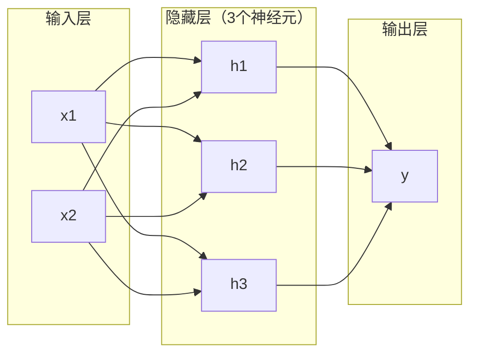
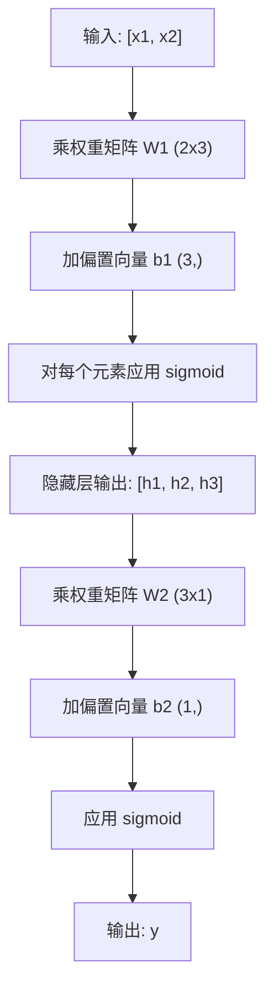

# 多层网络和前向传播

> 一个神经元画一条线。把它们叠起来，你就能画出任何东西。

**类型：** 构建  
**语言：** Python  
**先决条件：** 第01阶段（数学基础），第03.01课（感知器（Perceptron））  
**时间：** 约90分钟

## 学习目标

- 从头构建带有 Layer（层）和 Network（网络）类的多层网络，执行完整的前向传播（forward pass）
- 追踪网络中每层的矩阵维度，并识别形状不匹配
- 解释非线性激活函数的堆叠如何使网络能够学习曲线决策边界
- 使用手动调节的 sigmoid 权重解决异或（XOR）问题，采用 2-2-1 架构

## 问题描述

单个神经元是直线画笔，仅此而已。它在数据中画一条直线。AI 中的所有实际问题——图像识别、语言理解、围棋棋局——都需要曲线。通过将神经元堆叠成层实现曲线。

1969年，Minsky 和 Papert 证明了这个限制是致命的：单层网络无法学习 XOR。不仅仅是“难以学习”，而是数学上不可能。XOR 真值表把 [0,1] 和 [1,0] 放在一边，[0,0] 和 [1,1] 放在另一边，没有一条直线能把它们分开。

这导致神经网络研究资金断流十年以上。事后看来，解决办法很明显：停止只用一层。把神经元堆叠成多层。让第一层把输入空间划分成新的特征，让第二层组合这些特征做出单条直线无法做出的决策。

这种堆叠就是多层网络。它是今天所有生产级深度学习模型的基础。前向传播——数据从输入通过隐藏层流向输出——是实现其他功能之前必须掌握的第一步。

## 概念讲解

### 层：输入层、隐藏层、输出层

多层网络包含三种类型的层：

**输入层（Input layer）**——其实不是真正的层。它保存你的原始数据。两个特征意味着两个输入节点。这里没有计算发生。

**隐藏层（Hidden layers）**——工作的地方。每个神经元接收上一层的所有输出，应用权重和偏置，再通过激活函数。隐藏层称为“隐藏”，是因为这些值在训练数据中看不到。

**输出层（Output layer）**——最终答案。二分类使用一个带 sigmoid 的神经元。多分类则每个类别一个神经元。



这是一个 2-3-1 网络。两个输入，三个隐藏神经元，一个输出。每条连接带一个权重。每个神经元（输入层除外）带一个偏置。

每层产生一组数字向量，称为隐藏状态（hidden state）。对文本，隐藏状态增加维度——用768个数字编码一个词来捕获语义。对图像，隐藏状态减少维度——将数百万像素压缩成可管理的表示。隐藏状态就是学习所在。

### 神经元和激活函数

每个神经元做三件事：

1. 用对应权重乘以每个输入
2. 计算乘积总和并加上偏置
3. 将和通过激活函数

目前激活函数是 sigmoid：

```text
sigmoid(z) = 1 / (1 + e^(-z))
```

Sigmoid 将任意数字压缩到 (0, 1) 区间。大正值趋向1，大负值趋向0。零映射为0.5。这个平滑曲线使学习成为可能——不像感知器的硬阶跃，sigmoid 在每处都有梯度。

### 前向传播：数据如何流动

前向传播把输入数据按层推送，通过网络直到输出。前向传播不涉及学习。纯计算：乘法、加法、激活，循环进行。



每层依次进行三步操作：

```text
z = W * input + b       （线性变换）
a = sigmoid(z)          （激活）
```

一层的输出成为下一层的输入，这就是整个前向传播。

### 矩阵维度

跟踪维度是深度学习中最重要的调试技能。下面是 2-3-1 网络：

| 步骤 | 操作 | 维度 | 结果形状 |
|------|-------|---------|-----------|
| 输入 | x | -- | (2,) |
| 隐藏层线性 | W1 * x + b1 | W1: (3, 2), b1: (3,) | (3,) |
| 隐藏层激活 | sigmoid(z1) | -- | (3,) |
| 输出层线性 | W2 * h + b2 | W2: (1, 3), b2: (1,) | (1,) |
| 输出层激活 | sigmoid(z2) | -- | (1,) |

规则：层 k 的权重矩阵 W 形状为（第 k 层神经元数，前一层神经元数）。行对应当前层，列对应前一层层。如果形状不匹配，肯定有 bug。

### 通用近似定理（Universal Approximation Theorem）

1989 年，George Cybenko 证明了一个惊人的结论：带有单隐藏层且神经元数量足够的神经网络，可以以任意精度逼近任意连续函数。

这并不意味着单隐藏层总是最优。只是表明架构理论上有能力实现。实践中，更深的网络（更多层，单层参数少）用更少总参数学习同样函数。这就是深度学习为何奏效。

直观理解：隐藏层的每个神经元学习一个“波峰”或特征。足够的波峰放在合适位置，可以逼近任意平滑曲线。神经元越多，波峰越多，逼近越好。


### 可组合性

神经网络可组合。你可以堆叠、串联、并行运行。例如 Whisper 模型用编码器网络处理音频，另用解码器网络生成文本。现代大语言模型（LLM）只用解码器。BERT 只用编码器。T5 是编码器-解码器结构。架构选择决定模型功能。

## 实现步骤

纯 Python 实现。不用 numpy。所有矩阵操作手写。

### 第1步：Sigmoid 激活函数

```python
import math

def sigmoid(x):
    x = max(-500.0, min(500.0, x))  # 限制范围避免溢出
    return 1.0 / (1.0 + math.exp(-x))
```

限制在 [-500, 500] 防止溢出。`math.exp(500)`很大但有限，`math.exp(1000)`则是无穷大。

### 第2步：Layer 类

深度学习中最重要的操作是矩阵乘法。每层、每个注意力头、每次前向传播——都是矩阵乘法。线性层对输入向量乘以权重矩阵加偏置向量：y = Wx + b。这个方程占神经网络计算量90%。

Layer 持有权重矩阵和偏置向量。forward 方法接收输入向量返回激活后的输出。

```python
class Layer:
    def __init__(self, n_inputs, n_neurons, weights=None, biases=None):
        if weights is not None:
            self.weights = weights
        else:
            import random
            self.weights = [
                [random.uniform(-1, 1) for _ in range(n_inputs)]
                for _ in range(n_neurons)
            ]
        if biases is not None:
            self.biases = biases
        else:
            self.biases = [0.0] * n_neurons

    def forward(self, inputs):
        self.last_input = inputs
        self.last_output = []
        for neuron_idx in range(len(self.weights)):
            z = sum(
                w * x for w, x in zip(self.weights[neuron_idx], inputs)
            )
            z += self.biases[neuron_idx]
            self.last_output.append(sigmoid(z))
        return self.last_output
```

权重矩阵形状为 (n_neurons, n_inputs)，每行是一个神经元对各输入的权重。forward 遍历神经元，计算加权和加偏置，应用 sigmoid，收集结果。

### 第3步：Network 类

网络是层的列表。前向传播将它们链式连接：第 k 层的输出作为第 k+1 层输入。

```python
class Network:
    def __init__(self, layers):
        self.layers = layers

    def forward(self, inputs):
        current = inputs
        for layer in self.layers:
            current = layer.forward(current)
        return current
```

这就是完整的前向传播。四行代码，输入数据经过每层，最后输出。

### 第4步：用手调权重实现 XOR

在第01课，我们用 OR、NAND、AND 感知器组合解决了 XOR。现在用 Layer 和 Network 类重做，采用 2-2-1 架构（两输入、两隐藏神经元、一输出）。

```python
hidden = Layer(
    n_inputs=2,
    n_neurons=2,
    weights=[[20.0, 20.0], [-20.0, -20.0]],
    biases=[-10.0, 30.0],
)

output = Layer(
    n_inputs=2,
    n_neurons=1,
    weights=[[20.0, 20.0]],
    biases=[-30.0],
)

xor_net = Network([hidden, output])

xor_data = [
    ([0, 0], 0),
    ([0, 1], 1),
    ([1, 0], 1),
    ([1, 1], 0),
]

for inputs, expected in xor_data:
    result = xor_net.forward(inputs)
    predicted = 1 if result[0] >= 0.5 else 0
    print(f"  {inputs} -> {result[0]:.6f}（四舍五入: {predicted}, 期望: {expected}）")
```

大权重（20，-20）使 sigmoid 表现得像阶跃函数。第一个隐藏神经元近似 OR，第二个近似 NAND。输出神经元将其组合成 AND，即 XOR。

### 第5步：圆形分类

更难的问题：分类二维点，判断是否在以原点为中心、半径0.5的圆内。需要曲线决策边界，单个感知器达不到。

```python
import random
import math

random.seed(42)

data = []
for _ in range(200):
    x = random.uniform(-1, 1)
    y = random.uniform(-1, 1)
    label = 1 if (x * x + y * y) < 0.25 else 0
    data.append(([x, y], label))

circle_net = Network([
    Layer(n_inputs=2, n_neurons=8),
    Layer(n_inputs=8, n_neurons=1),
])
```

权重随机时网络不会分类好。但前向传播依然运行。这就是重点——前向传播就是计算。学到合适权重是反向传播的任务（第03课）。

```python
correct = 0
for inputs, expected in data:
    result = circle_net.forward(inputs)
    predicted = 1 if result[0] >= 0.5 else 0
    if predicted == expected:
        correct += 1

print(f"随机权重准确率: {correct}/{len(data)} ({100*correct/len(data):.1f}%)")
```

随机权重会导致较差的准确率——通常比猜测多数类还差。在训练后（第03课），相同架构拥有8个隐藏神经元时就会绘制一个曲线边界，将内外部分开。

## 使用它

PyTorch 用四行代码完成上面所有操作：

```python
import torch
import torch.nn as nn

model = nn.Sequential(
    nn.Linear(2, 8),
    nn.Sigmoid(),
    nn.Linear(8, 1),
    nn.Sigmoid(),
)

x = torch.tensor([[0.0, 0.0], [0.0, 1.0], [1.0, 0.0], [1.0, 1.0]])
output = model(x)
print(output)
```

`nn.Linear(2, 8)` 是你的 Layer 类：权重矩阵形状为 (8, 2)，偏置向量形状为 (8,)。`nn.Sigmoid()` 是逐元素应用的 sigmoid 函数。`nn.Sequential` 是你的 Network 类：按顺序链接层。

不同之处在于速度和规模。PyTorch 支持 GPU 运行，处理数百万样本的批量数据，并自动计算用于反向传播的梯度。但前向传播逻辑与刚才你从零构建的完全相同。

## 部署它

本课提供设计网络架构的可复用提示：

- `outputs/prompt-network-architect.md`

当你需要决定层数、每层神经元数量以及激活函数类型以解决特定问题时，使用该提示。

## 练习

1. 构建一个 2-4-2-1 网络（两个隐藏层），用随机权重在 XOR 数据上运行前向传播。打印中间隐藏层输出，观察表示在每层的变化。

2. 将圆形分类器的隐藏层大小从 8 改为 2，然后改为 32。每次用随机权重运行前向传播。隐藏神经元数是否影响输出的范围或分布？为什么？

3. 在 Network 类中实现 `count_parameters` 方法，返回可训练权重和偏置的总数。在 784-256-128-10 网络（经典 MNIST 架构）上测试。它有多少个参数？

4. 为 3-4-4-2 网络构建前向传播。输入 RGB 颜色值（归一化到 0-1），观察两个输出。这是一个简单的两类颜色分类器的架构。

5. 用“leaky step”函数替换 sigmoid：若 z < 0 返回 0.01 * z，否则返回 1.0。用第四步相同的手工调整权重在 XOR 上运行前向传播。它还能正常工作吗？为什么平滑的 sigmoid 优于硬阈值？

## 关键词

| 术语 | 常见说法 | 实际含义 |
|------|-----------|------------|
| Forward pass（前向传播） | “运行模型” | 输入依次通过每层——乘以权重，加偏置，激活——生成输出 |
| Hidden layer（隐藏层） | “中间部分” | 输入和输出间的任何层，其值不直接观测到 |
| Multi-layer network（多层网络） | “深度神经网络” | 多层神经元依序堆叠，每层输出作为下一层输入 |
| Activation function（激活函数） | “非线性” | 线性变换后应用的函数，引入决策边界的曲线性 |
| Sigmoid（Sigmoid 函数） | “S 型曲线” | sigma(z) = 1/(1+e^(-z))，将任意实数压缩到 (0,1)，平滑且处处可微 |
| Weight matrix（权重矩阵） | “参数” | 形状为 (当前层神经元数, 前一层神经元数) 的可学习连接权重矩阵 |
| Bias vector（偏置向量） | “偏移量” | 矩阵乘法后加的向量，使神经元在输入全零时仍可激活 |
| Universal approximation（泛函逼近） | “神经网络能学会任何函数” | 拥有足够神经元的单个隐藏层可以逼近任意连续函数——但“足够”可能是数十亿 |
| Linear transformation（线性变换） | “矩阵乘法步骤” | z = W * x + b，激活前的计算，将输入映射到新空间 |
| Decision boundary（决策边界） | “分类器切换点” | 输入空间中网络输出穿越阈值的分界面 |

## 延伸阅读

- Michael Nielsen，《Neural Networks and Deep Learning》（神经网络与深度学习），第1-2章 (http://neuralnetworksanddeeplearning.com/) —— 最清晰的免费解释，带交互式可视化，讲解前向传播和网络结构  
- Cybenko，《Approximation by Superpositions of a Sigmoidal Function》（1989）—— 最初的泛函逼近定理论文，意外地易读  
- 3Blue1Brown，《But what is a neural network?》（https://www.youtube.com/watch?v=aircAruvnKk）—— 20分钟视觉讲解层、权重和前向传播，建立正确的思维模型  
- Goodfellow, Bengio, Courville，《Deep Learning》（深度学习），第6章 (https://www.deeplearningbook.org/) —— 多层网络的权威参考，免费在线查看
