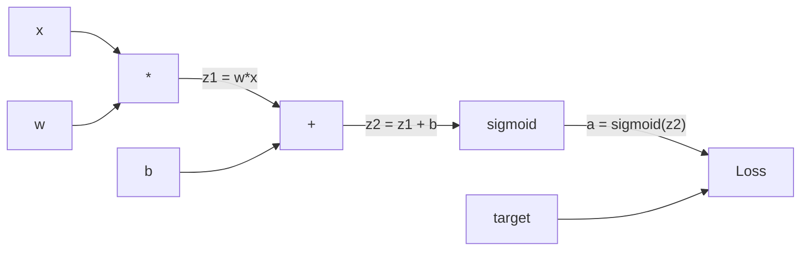
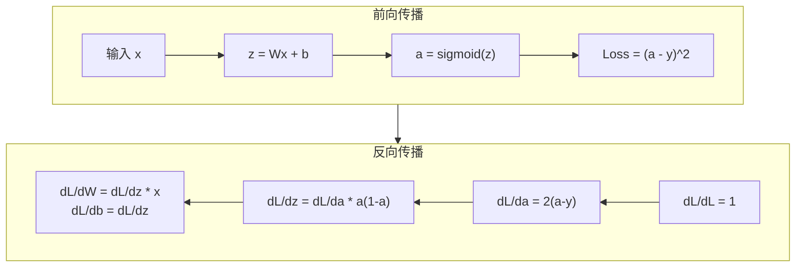

# 从零开始实现反向传播（Backpropagation）

> 反向传播是使学习成为可能的算法。没有它，神经网络只是高昂成本的随机数生成器。

**类型：** 构建  
**语言：** Python  
**先决条件：** Lesson 03.02（多层网络）  
**时间：** 约120分钟

## 学习目标

- 实现一个基于 Value（值）的自动微分引擎，能够构建计算图并通过拓扑排序计算梯度
- 利用链式法则推导加法、乘法和 sigmoid 的反向传播过程
- 使用你从零实现的反向传播引擎训练一个多层网络完成 XOR 和圆形分类任务
- 识别深层 sigmoid 网络中的梯度消失问题，并解释梯度为何呈指数缩小

## 问题

你的网络有一层隐藏层，输入维度是768，输出维度是3072。这意味着有2,359,296个权重。网络做出了错误的预测。是哪些权重导致了错误？如果一个个测试每个权重，那就需要进行230多万个前向传播。反向传播只需一次后向传播，就能计算出全部2,359,296个梯度。这不是优化技巧，而是可训练性和不可行之间的区别。

最天真的做法是：取一个权重，微调一点，再跑一次前向传播，看看损失是增大还是减小。这样得到该权重的梯度。然后对网络中所有权重重复这个步骤。再乘以成千上万的训练步数和数百万的数据点。你得需要地质时代的时间才能训练有用的模型。

反向传播解决了这个问题。一次前向传播，一次反向传播，所有梯度计算完成。秘诀是微积分中的链式法则，系统地应用于计算图上。这就是让深度学习成为可能的算法。没有它，我们还停留在玩具问题上。

## 概念解析

### 链式法则在线性网络中的应用

你在第01阶段第05课见过链式法则。快速回顾：若 \(y = f(g(x))\)，则 \(\frac{dy}{dx} = f'(g(x)) \times g'(x)\)。你要沿着链条乘以导数。

在神经网络中，这条“链”是从输入到损失的一系列操作。每层都应用权重，添加偏置，再传递激活函数。损失函数比较最终输出和目标。反向传播就是沿着这条链条向后追踪，计算每个操作对误差的贡献。

### 计算图

每次前向传播都会构建一个图。节点表示操作（乘法、加法、sigmoid），边向前传递值，向后传递梯度。



前向传播：值从左流向右。x 和 w 相乘产生 \(z_1 = w \times x\)。加上 b 得到 \(z_2\)。sigmoid 得到激活值 a。用损失函数比较 a 和目标 y。

反向传播：梯度从右向左流。先从 \(\frac{dL}{da}\)（损失对激活的变化率）开始，乘以 \(\frac{da}{dz_2}\)（sigmoid 的导数），得到 \(\frac{dL}{dz_2}\)。再拆分成 \(\frac{dL}{db} = \frac{dL}{dz_2}\)（因 \(z_2 = z_1 + b\)）和 \(\frac{dL}{dz_1}\)。接着 \(\frac{dL}{dw} = \frac{dL}{dz_1} \times x\)，\(\frac{dL}{dx} = \frac{dL}{dz_1} \times w\)。

图中每个节点在反向传播时有一项任务：接受从上方传来的梯度，乘以自身局部的导数，然后传递下去。

### 前向传播与反向传播



前向传播存储每个中间值：z、a，以及每层的输入。反向传播需要这些存储值来计算梯度。这就是反向传播核心的内存与计算权衡。你用内存（保存激活）换取速度（只需一次而非百万次计算）。

### 梯度在网络中的流动

对一个三层网络，梯度沿着每层链式传递：


每层梯度乘以sigmoid导数。sigmoid导数为 \(a \times (1 - a)\)，最大值为0.25（当 \(a=0.5\) 时）。三层后，梯度最多乘以 \(0.25^3 = 0.0156\)。十层后：\(0.25^{10} = 0.000001\)。

### 梯度消失问题

这就是梯度消失问题。sigmoid 将输出限制在0到1之间，导数永远低于0.25。堆叠足够多的sigmoid层，梯度将消失接近于零。早期层几乎学不到东西，因为它们收到的梯度非常微弱。

```text
sigmoid(z):     输出范围 [0, 1]
sigmoid'(z):    最大值 0.25（z=0时）

5层后:          梯度 * 0.25^5 = 原梯度的0.001倍
10层后:         梯度 * 0.25^10 = 原梯度的0.000001倍
```

这也说明了为什么深层 sigmoid 网络几乎无法训练。解决方案 —— ReLU 及其变体 —— 是第04课的主题。目前需要理解的是反向传播本身是没问题的，问题是它遇到的激活函数和网络结构。

### 2层网络梯度推导

针对输入x，隐藏层和输出层均采用sigmoid激活，损失为均方误差（MSE）的网络进行具体数学推导。

前向传播：
```text
z1 = W1 * x + b1
a1 = sigmoid(z1)
z2 = W2 * a1 + b2
a2 = sigmoid(z2)
L = (a2 - y)^2
```

反向传播（链式法则逐步应用）：
```text
dL/da2 = 2(a2 - y)
da2/dz2 = a2 * (1 - a2)
dL/dz2 = dL/da2 * da2/dz2 = 2(a2 - y) * a2 * (1 - a2)

dL/dW2 = dL/dz2 * a1
dL/db2 = dL/dz2

dL/da1 = dL/dz2 * W2
da1/dz1 = a1 * (1 - a1)
dL/dz1 = dL/da1 * da1/dz1

dL/dW1 = dL/dz1 * x
dL/db1 = dL/dz1
```

每个梯度都是从损失反向追踪的局部导数的乘积。这就是反向传播算法的本质。

## 构建过程

### 步骤1：Value 节点

计算中的每个数值都成为一个 Value。它保存数据、本地梯度，以及如何产生（以便反向计算梯度）。

```python
class Value:
    def __init__(self, data, children=(), op=''):
        self.data = data
        self.grad = 0.0
        self._backward = lambda: None
        self._children = set(children)
        self._op = op

    def __repr__(self):
        return f"Value(data={self.data:.4f}, grad={self.grad:.4f})"
```

当前没有梯度（0.0），没有反向函数（无操作）。`_children` 用于追踪生成当前 Value 的父节点，以便后续拓扑排序。

### 步骤2：带反向函数的运算

每个操作返回新的 Value，并定义梯度如何反向流动。

```python
def __add__(self, other):
    other = other if isinstance(other, Value) else Value(other)
    out = Value(self.data + other.data, (self, other), '+')

    def _backward():
        self.grad += out.grad
        other.grad += out.grad

    out._backward = _backward
    return out

def __mul__(self, other):
    other = other if isinstance(other, Value) else Value(other)
    out = Value(self.data * other.data, (self, other), '*')

    def _backward():
        self.grad += other.data * out.grad
        other.grad += self.data * out.grad

    out._backward = _backward
    return out
```

加法微分：\(d(a+b)/da = 1\), \(d(a+b)/db = 1\)，因此输入梯度直接累加输出梯度。

乘法微分：\(d(a*b)/da = b\), \(d(a*b)/db = a\)，梯度乘以对方的值再累加。

使用 `+=` 是因为一个 Value 可能被多次使用，梯度是所有路径上的梯度求和。

### 步骤3：Sigmoid 和损失函数

```python
import math

def sigmoid(self):
    x = self.data
    x = max(-500, min(500, x))
    s = 1.0 / (1.0 + math.exp(-x))
    out = Value(s, (self,), 'sigmoid')

    def _backward():
        self.grad += (s * (1 - s)) * out.grad

    out._backward = _backward
    return out
```

sigmoid 的导数是 \(sigmoid(x) \times (1 - sigmoid(x))\)。我们前向运行中算出了 \(s\)，所以复用它，无需额外计算。

```python
def mse_loss(predicted, target):
    diff = predicted + Value(-target)
    return diff * diff
```

单个输出的均方误差：\((predicted - target)^2\)。用加一个负的 Value 表示减法。

### 步骤4：反向传播

拓扑排序确保节点按正确顺序处理——某节点的梯度累计完成后再传递。

```python
def backward(self):
    topo = []
    visited = set()

    def build_topo(v):
        if v not in visited:
            visited.add(v)
            for child in v._children:
                build_topo(child)
            topo.append(v)

    build_topo(self)
    self.grad = 1.0
    for v in reversed(topo):
        v._backward()
```

从损失开始（梯度设为1，因为 \(\frac{dL}{dL} = 1\)），沿拓扑顺序反向遍历，每个节点执行自己的 `_backward`，将梯度传递给父节点。

### 步骤5：层和网络

```python
import random

class Neuron:
    def __init__(self, n_inputs):
        scale = (2.0 / n_inputs) ** 0.5
        self.weights = [Value(random.uniform(-scale, scale)) for _ in range(n_inputs)]
        self.bias = Value(0.0)

    def __call__(self, x):
        act = sum((wi * xi for wi, xi in zip(self.weights, x)), self.bias)
        return act.sigmoid()

    def parameters(self):
        return self.weights + [self.bias]


class Layer:
    def __init__(self, n_inputs, n_outputs):
        self.neurons = [Neuron(n_inputs) for _ in range(n_outputs)]

    def __call__(self, x):
        out = [n(x) for n in self.neurons]
        return out[0] if len(out) == 1 else out

    def parameters(self):
        params = []
        for n in self.neurons:
            params.extend(n.parameters())
        return params


class Network:
    def __init__(self, sizes):
        self.layers = []
        for i in range(len(sizes) - 1):
            self.layers.append(Layer(sizes[i], sizes[i + 1]))

    def __call__(self, x):
        for layer in self.layers:
            x = layer(x)
            if not isinstance(x, list):
                x = [x]
        return x[0] if len(x) == 1 else x

    def parameters(self):
        params = []
        for layer in self.layers:
            params.extend(layer.parameters())
        return params

    def zero_grad(self):
        for p in self.parameters():
            p.grad = 0.0
```

神经元（Neuron）接受输入，计算加权和加偏置，然后应用sigmoid。权重初始化采用 \(\sqrt{2/n\_inputs}\) 的缩放，避免深层网络sigmoid饱和。层（Layer）是神经元的列表，网络是层的列表。`parameters()` 收集所有可学习的 Value，以便更新。

### 步骤6：在 XOR 上训练

```python
random.seed(42)
net = Network([2, 4, 1])

xor_data = [
    ([0.0, 0.0], 0.0),
    ([0.0, 1.0], 1.0),
    ([1.0, 0.0], 1.0),
    ([1.0, 1.0], 0.0),
]

learning_rate = 1.0

for epoch in range(1000):
    total_loss = Value(0.0)
    for inputs, target in xor_data:
        x = [Value(i) for i in inputs]
        pred = net(x)
        loss = mse_loss(pred, target)
        total_loss = total_loss + loss

    net.zero_grad()
    total_loss.backward()

    for p in net.parameters():
        p.data -= learning_rate * p.grad

    if epoch % 100 == 0:
        print(f"Epoch {epoch:4d} | Loss: {total_loss.data:.6f}")

print("\nXOR 结果:")
for inputs, target in xor_data:
    x = [Value(i) for i in inputs]
    pred = net(x)
    print(f"  {inputs} -> {pred.data:.4f} (预期 {target})")
```

观察损失的下降。从随机预测到正确的 XOR 输出，完全由反向传播（backpropagation）计算梯度并推动权重朝正确方向调整驱动。

### 第7步：圆形分类

在第02课中，你通过手动调节权重实现了圆形分类。现在让网络自己学习这些权重。

```python
random.seed(7)

def generate_circle_data(n=100):
    data = []
    for _ in range(n):
        x1 = random.uniform(-1.5, 1.5)
        x2 = random.uniform(-1.5, 1.5)
        label = 1.0 if x1 * x1 + x2 * x2 < 1.0 else 0.0
        data.append(([x1, x2], label))
    return data

circle_data = generate_circle_data(80)

circle_net = Network([2, 8, 1])
learning_rate = 0.5

for epoch in range(2000):
    random.shuffle(circle_data)
    total_loss_val = 0.0
    for inputs, target in circle_data:
        x = [Value(i) for i in inputs]
        pred = circle_net(x)
        loss = mse_loss(pred, target)
        circle_net.zero_grad()
        loss.backward()
        for p in circle_net.parameters():
            p.data -= learning_rate * p.grad
        total_loss_val += loss.data

    if epoch % 200 == 0:
        correct = 0
        for inputs, target in circle_data:
            x = [Value(i) for i in inputs]
            pred = circle_net(x)
            predicted_class = 1.0 if pred.data > 0.5 else 0.0
            if predicted_class == target:
                correct += 1
        accuracy = correct / len(circle_data) * 100
        print(f"Epoch {epoch:4d} | Loss: {total_loss_val:.4f} | Accuracy: {accuracy:.1f}%")
```

这里使用的是在线随机梯度下降（SGD）——即在每个样本之后更新权重，而不是累积完整批次后更新。这种做法可以更快地打破对称性，避免在整个损失曲面上 sigmoid 激活的饱和问题。每个 epoch 打乱数据顺序防止网络记忆样本顺序。

不需要手动调节，网络自主发现了圆形的决策边界。这就是反向传播的威力：你定义架构、损失函数和数据，算法自动求出权重。

## 使用它

PyTorch 仅用几行代码实现了上述所有功能。核心思想完全相同——autograd 在前向传播时构建计算图，并在反向传播时追踪它以计算梯度。

```python
import torch
import torch.nn as nn

model = nn.Sequential(
    nn.Linear(2, 4),
    nn.Sigmoid(),
    nn.Linear(4, 1),
    nn.Sigmoid(),
)
optimizer = torch.optim.SGD(model.parameters(), lr=1.0)
criterion = nn.MSELoss()

X = torch.tensor([[0,0],[0,1],[1,0],[1,1]], dtype=torch.float32)
y = torch.tensor([[0],[1],[1],[0]], dtype=torch.float32)

for epoch in range(1000):
    pred = model(X)
    loss = criterion(pred, y)
    optimizer.zero_grad()
    loss.backward()
    optimizer.step()

print("PyTorch XOR Results:")
with torch.no_grad():
    for i in range(4):
        pred = model(X[i])
        print(f"  {X[i].tolist()} -> {pred.item():.4f} (expected {y[i].item()})")
```

`loss.backward()` 就是你代码中的 `total_loss.backward()`。`optimizer.step()` 是你手动执行的 `p.data -= lr * p.grad`。`optimizer.zero_grad()` 是你实现的 `net.zero_grad()`。是同一个算法的工业级实现。PyTorch 还会自动支持 GPU 加速、混合精度、梯度检查点（gradient checkpointing）以及数百种不同层类型。但反向传播始终是同一个链式法则（chain rule）应用于同一个计算图。

训练过程依次运行前向传播、反向传播，然后更新权重。推理（inference）只运行前向传播，没有梯度计算和权重更新。这一点很重要，因为推理是生产环境中实际发生的。当你调用诸如 Claude 或 GPT 之类的 API 时，实际上是在运行推理——你的提示（prompt）经过网络正向传播，输出生成令牌，权重不会改变。理解反向传播很重要，因为它决定了网络中每个权重的值。

## 部署它

本课程生成：
- `outputs/prompt-gradient-debugger.md` —— 一个可复用的提示（prompt），用于诊断任何神经网络中的梯度问题（消失、爆炸、NaN）

## 练习

1. 给 Value 类添加一个 `__sub__` 方法（a - b = a + (-1 * b)）。然后实现一个 `__neg__` 方法。通过对类似 `(a - b)^2` 的简单表达式手工求导，验证梯度是否正确。

2. 给 Value 增加一个 `relu` 方法（输出 max(0, x)，导数在 x>0 时为 1，否则为 0）。将隐藏层中的 sigmoid 换成 relu，重新训练 XOR。对比收敛速度。你会看到训练加速——这预示着第04课内容。

3. 给 Value 实现一个整数幂的 `__pow__` 方法。用它替代 `mse_loss` 中的平方误差表达式 `(predicted - target) ** 2`。验证梯度和原实现是否匹配。

4. 在训练循环中添加梯度裁剪（gradient clipping）：调用 `backward()` 后，将所有梯度限制在 [-1, 1] 范围内。训练一个更深的网络（4层及以上，使用 sigmoid），对比有无裁剪时的损失曲线。这是防止梯度爆炸的第一道防线。

5. 制作一个可视化：XOR 训练完后，打印网络中每个参数的梯度。找出哪个层的梯度最小。这展示了你在概念部分学到的梯度消失问题。

## 关键词

| 术语 | 人们常说 | 实际含义 |
|------|---------|---------|
| Backpropagation（反向传播） | “网络学会了” | 通过链式法则逆向计算计算图中每个权重的损失导数 dL/dw 的算法 |
| Computational graph（计算图） | “网络结构” | 一个有向无环图，节点是操作，边传递值（正向）和梯度（反向） |
| Chain rule（链式法则） | “乘以导数” | 若 y = f(g(x))，则 dy/dx = f'(g(x)) * g'(x)，是反向传播的数学基础 |
| Gradient（梯度） | “最陡上升方向” | 损失对某个参数的偏导数，指示如何调整该参数以降低损失 |
| Vanishing gradient（梯度消失） | “深层网络学不来” | 在多层网络中，梯度在饱和激活函数如 sigmoid 下逐层指数级减小 |
| Forward pass（前向传播） | “运行网络” | 依次应用各层操作计算输出并保存中间值 |
| Backward pass（反向传播） | “计算梯度” | 按计算图反方向遍历节点，利用链式法则累积梯度 |
| Learning rate（学习率） | “学习快慢” | 控制权重更新步长的标量：w_new = w_old - lr * gradient |
| Topological sort（拓扑排序） | “正确顺序” | 一种节点排序，使每个节点在其依赖节点之后出现，确保梯度充分累积后反传 |
| Autograd（自动微分） | “自动求导” | 一个系统，在前向计算时构建计算图，自动计算梯度——PyTorch 的核心引擎 |

## 深入阅读

- Rumelhart, Hinton & Williams，《通过反向传播误差学习表示》（1986）——使反向传播普及，解锁多层网络训练的开创性论文
- 3Blue1Brown，《神经网络》系列（https://www.youtube.com/playlist?list=PLZHQObOWTQDNU6R1_67000Dx_ZCJB-3pi）——最直观的反向传播和梯度流动网络可视化解释
