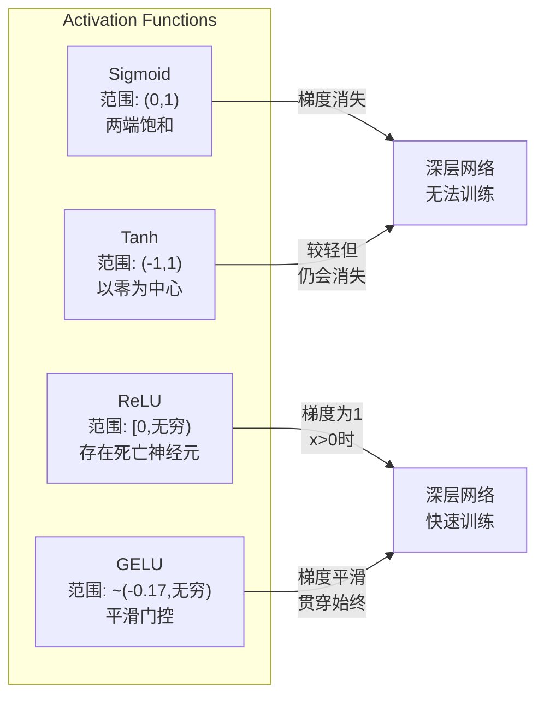
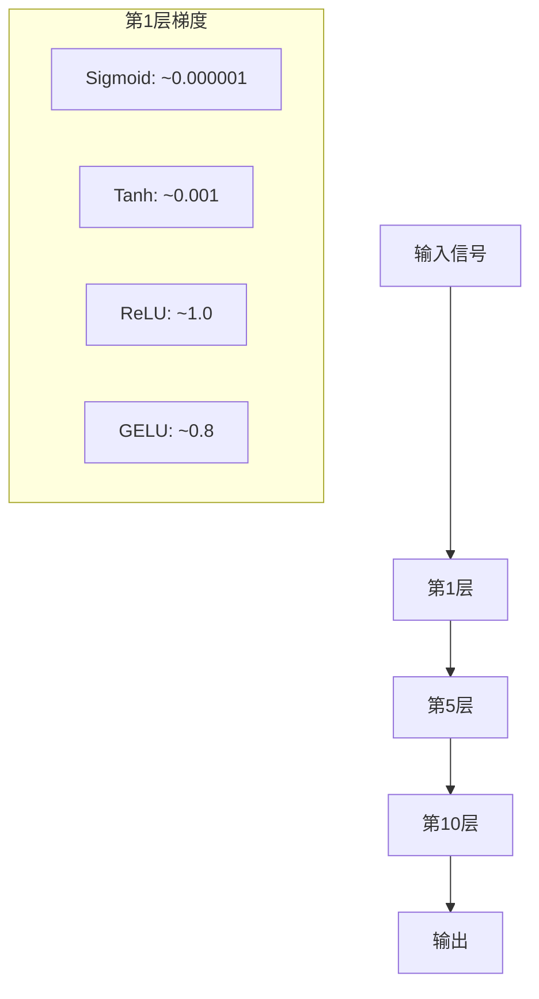
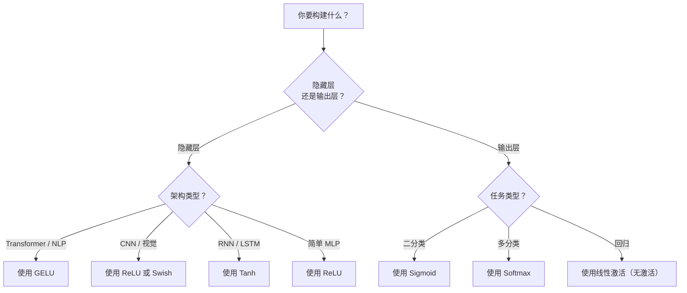

# 激活函数

> 没有非线性，你的100层网络只是一个复杂的矩阵乘法。激活函数是让神经网络能够进行曲线思考的门。

**类型：** 构建  
**语言：** Python  
**先决条件：** 课程 03.03（反向传播）  
**时间：** 约75分钟

## 学习目标

- 从零实现 sigmoid、tanh、ReLU、Leaky ReLU、GELU、Swish 和 softmax 及其导数  
- 通过测量不同激活函数下的10层以上网络中的激活幅度来诊断梯度消失问题  
- 在 ReLU 网络中检测死亡神经元，并解释为何 GELU 避免此失败模式  
- 根据给定架构（transformer（Transformer 架构）、CNN、RNN、输出层）选择正确的激活函数  

## 问题描述

将两个线性变换叠加：y = W2(W1x + b1) + b2。展开：y = W2W1x + W2b1 + b2。等同于 y = Ax + c — 一个单线性变换。不论你叠加多少线性层，结果都会退化成一个矩阵乘法。你的100层网络的表达能力等同于单层。

这不仅仅是理论上的趣事。它意味着深线性网络根本无法学习XOR，无法分类螺旋数据集，无法识别人脸。没有激活函数，深度只是幻觉。

激活函数打破了线性性质。它们通过非线性函数扭曲每一层的输出，使网络能够弯曲决策边界，逼近任意函数，真正地学习。但选择错误的激活可能导致梯度消失（深层网络中的sigmoid），爆炸（无界激活且初始化不当），或者神经元永久死亡（ReLU配合大负偏置）。激活函数的选择直接决定网络是否能够学习。

## 概念讲解

### 为什么需要非线性

矩阵乘法是可组合的。向量先乘矩阵A再乘矩阵B，等同于乘以矩阵AB。这意味着堆叠十个线性层等价于用一个大矩阵的单层。所有那些参数、所有深度——都浪费了。你需要某种东西来打破这个链条，这就是激活函数的作用。

证明如下。一个线性层计算 f(x) = Wx + b。堆叠两个层：

```text
Layer 1: h = W1 * x + b1
Layer 2: y = W2 * h + b2
```

代入：

```text
y = W2 * (W1 * x + b1) + b2
y = (W2 * W1) * x + (W2 * b1 + b2)
y = A * x + c
```

只有一层。在线之间插入一个非线性激活 g() ：

```text
h = g(W1 * x + b1)
y = W2 * h + b2
```

现在不能化简。W2 * g(W1 * x + b1) + b2 不能归结为单个线性变换。网络可以表示非线性函数。每多一层激活，表示能力就增加。

### Sigmoid

神经网络最初的激活函数。

```text
sigmoid(x) = 1 / (1 + e^(-x))
```

输出范围：(0, 1)。平滑且可微，将任意实数映射为概率型值。

导数公式：

```text
sigmoid'(x) = sigmoid(x) * (1 - sigmoid(x))
```

导数最大值为0.25，出现在 x = 0 。反向传播时梯度在层间相乘。10层 sigmoid 相当于梯度被最多乘以 0.25 十次：

```text
0.25^10 = 0.000000953674
```

小于百万分之一的原始信号。即梯度消失问题。早期层的梯度极小，权重几乎不更新。网络看似学习——后面的层损失下降——但前几层被冻结。深层 sigmoid 网络根本无法训练。

额外问题：sigmoid 输出总为正（0 到 1），导致权重上的梯度符号恒定。梯度下降会产生锯齿式震荡。

### Tanh

sigmoid 的中心化版本。

```text
tanh(x) = (e^x - e^(-x)) / (e^x + e^(-x))
```

输出范围：(-1, 1)。以0为中心，解决了锯齿问题。

导数：

```text
tanh'(x) = 1 - tanh(x)^2
```

最大导数为1，位于 x=0 ，比 sigmoid 好4倍。但梯度消失问题依然存在。极大或极小输入下导数趋近零。10层仍然会使梯度压缩，只是幅度小一些。

### ReLU：突破点

Rectified Linear Unit（修正线性单元）。2010年由Nair和Hinton推广至深度学习（其本身源自1969年Fukushima的工作），彻底改变了团队做法。

```text
relu(x) = max(0, x)
```

输出范围：[0, ∞)。导数非常简单：

```text
relu'(x) = 1  if x > 0
            0  if x <= 0
```

正输入无梯度消失，梯度恰好为1，直接传递。这使得深层网络可训练——ReLU保持了梯度幅度。

但存在失败模式：死亡神经元问题。若神经元加权输入总为负（大负偏置或不当初始化），输出永远为0，梯度为0，永远无法更新，永久死亡。实践中，10-40% ReLU神经元在训练中可能死亡。

### Leaky ReLU

死亡神经元的最简单修复。

```text
leaky_relu(x) = x        if x > 0
                alpha * x if x <= 0
```

alpha 是小常数，通常为0.01。负侧有小斜率而非零，死亡神经元仍有梯度信号，可以恢复。

### GELU：现代默认

Gaussian Error Linear Unit（高斯误差线性单元）。2016年由Hendrycks和Gimpel提出。是BERT、GPT和大多数现代transformer（Transformer 架构）的默认激活。

```text
gelu(x) = x * Phi(x)
```

其中 Phi(x) 是标准正态分布的累积分布函数。实际使用的近似：

```text
gelu(x) ~= 0.5 * x * (1 + tanh(sqrt(2/pi) * (x + 0.044715 * x^3)))
```

GELU 在所有点均平滑，允许小负值（不同于将负值硬截断为零的ReLU），且有概率解释：按高斯分布的正值概率对输入加权。此平滑门控优于ReLU，因其在transformer中提供更好的梯度流，且完全避免死亡神经元问题。

### Swish / SiLU

Ramachandran等人在2017年通过自动搜索发现的自门控激活函数。

```text
swish(x) = x * sigmoid(x)
```

Swish形式为 x * sigmoid(x)。Google通过自动搜索激活函数空间发现它——即神经网络设计神经网络部件。

类似GELU，它平滑、非单调，允许小负值。区别在于Swish使用sigmoid门控，而GELU使用高斯CDF。实际表现几乎相同。Swish用于EfficientNet和一些视觉模型。GELU则主导语言模型。

### Softmax：输出激活

不用于隐藏层。Softmax将一组原始分数（logits）转为概率分布。

```text
softmax(x_i) = e^(x_i) / sum(e^(x_j) for all j)
```

所有输出均在0到1间，总和为1。使其成为多分类的标准最终激活。最大logit对应最高概率，但不同于argmax，softmax可微且保留相对置信度信息。

### 形状比较



### 梯度流动比较



### 何时用何种激活



## 亲自构建

### 第1步：实现所有激活函数及其导数

每个函数输入单个浮点，返回浮点。每个导数函数使用相同输入，返回梯度。

```python
import math

def sigmoid(x):
    x = max(-500, min(500, x))
    return 1.0 / (1.0 + math.exp(-x))

def sigmoid_derivative(x):
    s = sigmoid(x)
    return s * (1 - s)

def tanh_act(x):
    return math.tanh(x)

def tanh_derivative(x):
    t = math.tanh(x)
    return 1 - t * t

def relu(x):
    return max(0.0, x)

def relu_derivative(x):
    return 1.0 if x > 0 else 0.0

def leaky_relu(x, alpha=0.01):
    return x if x > 0 else alpha * x

def leaky_relu_derivative(x, alpha=0.01):
    return 1.0 if x > 0 else alpha

def gelu(x):
    return 0.5 * x * (1 + math.tanh(math.sqrt(2 / math.pi) * (x + 0.044715 * x ** 3)))

def gelu_derivative(x):
    phi = 0.5 * (1 + math.erf(x / math.sqrt(2)))
    pdf = math.exp(-0.5 * x * x) / math.sqrt(2 * math.pi)
    return phi + x * pdf

def swish(x):
    return x * sigmoid(x)

def swish_derivative(x):
    s = sigmoid(x)
    return s + x * s * (1 - s)

def softmax(xs):
    max_x = max(xs)
    exps = [math.exp(x - max_x) for x in xs]
    total = sum(exps)
    return [e / total for e in exps]
```

### 第2步：可视化梯度消失位置

在-5到5间均匀采样100点，计算梯度。打印文本直方图显示各激活梯度近零区域。

```python
def gradient_scan(name, derivative_fn, start=-5, end=5, n=100):
    step = (end - start) / n
    near_zero = 0
    healthy = 0
    for i in range(n):
        x = start + i * step
        g = derivative_fn(x)
        if abs(g) < 0.01:
            near_zero += 1
        else:
            healthy += 1
    pct_dead = near_zero / n * 100
    print(f"{name:15s}: {healthy:3d} healthy, {near_zero:3d} near-zero ({pct_dead:.0f}% 死区)")

gradient_scan("Sigmoid", sigmoid_derivative)
gradient_scan("Tanh", tanh_derivative)
gradient_scan("ReLU", relu_derivative)
gradient_scan("Leaky ReLU", leaky_relu_derivative)
gradient_scan("GELU", gelu_derivative)
gradient_scan("Swish", swish_derivative)
```

### 第3步：梯度消失实验

使用 sigmoid（Sigmoid）和 ReLU（ReLU）函数将信号正向传递通过 N 层。测量激活值的大小如何变化。

```python
import random

def vanishing_gradient_experiment(activation_fn, name, n_layers=10, n_inputs=5):
    random.seed(42)
    values = [random.gauss(0, 1) for _ in range(n_inputs)]

    print(f"\n{name} through {n_layers} layers:")
    for layer in range(n_layers):
        weights = [random.gauss(0, 1) for _ in range(n_inputs)]
        z = sum(w * v for w, v in zip(weights, values))
        activated = activation_fn(z)
        magnitude = abs(activated)
        bar = "#" * int(magnitude * 20)
        print(f"  Layer {layer+1:2d}: magnitude = {magnitude:.6f} {bar}")
        values = [activated] * n_inputs

vanishing_gradient_experiment(sigmoid, "Sigmoid")
vanishing_gradient_experiment(relu, "ReLU")
vanishing_gradient_experiment(gelu, "GELU")
```

### 第4步：死神经元检测器

创建一个 ReLU 网络，传入随机输入，统计有多少神经元从未被激活。

```python
def dead_neuron_detector(n_inputs=5, hidden_size=20, n_samples=1000):
    random.seed(0)
    weights = [[random.gauss(0, 1) for _ in range(n_inputs)] for _ in range(hidden_size)]
    biases = [random.gauss(0, 1) for _ in range(hidden_size)]

    fire_counts = [0] * hidden_size

    for _ in range(n_samples):
        inputs = [random.gauss(0, 1) for _ in range(n_inputs)]
        for neuron_idx in range(hidden_size):
            z = sum(w * x for w, x in zip(weights[neuron_idx], inputs)) + biases[neuron_idx]
            if relu(z) > 0:
                fire_counts[neuron_idx] += 1

    dead = sum(1 for c in fire_counts if c == 0)
    rarely_fire = sum(1 for c in fire_counts if 0 < c < n_samples * 0.05)
    healthy = hidden_size - dead - rarely_fire

    print(f"\nDead Neuron Report ({hidden_size} neurons, {n_samples} samples):")
    print(f"  Dead (never fired):     {dead}")
    print(f"  Barely alive (<5%):     {rarely_fire}")
    print(f"  Healthy:                {healthy}")
    print(f"  Dead neuron rate:       {dead/hidden_size*100:.1f}%")

    for i, c in enumerate(fire_counts):
        status = "DEAD" if c == 0 else "WEAK" if c < n_samples * 0.05 else "OK"
        bar = "#" * (c * 40 // n_samples)
        print(f"  Neuron {i:2d}: {c:4d}/{n_samples} fires [{status:4s}] {bar}")

dead_neuron_detector()
```

### 第5步：训练比较——Sigmoid vs ReLU vs GELU

在 circle（圆形）数据集上训练相同的两层网络（圆内的点为类别 1，圆外为类别 0），使用三种不同的激活函数。对比收敛速度。

```python
def make_circle_data(n=200, seed=42):
    random.seed(seed)
    data = []
    for _ in range(n):
        x = random.uniform(-2, 2)
        y = random.uniform(-2, 2)
        label = 1.0 if x * x + y * y < 1.5 else 0.0
        data.append(([x, y], label))
    return data


class ActivationNetwork:
    def __init__(self, activation_fn, activation_deriv, hidden_size=8, lr=0.1):
        random.seed(0)
        self.act = activation_fn
        self.act_d = activation_deriv
        self.lr = lr
        self.hidden_size = hidden_size

        self.w1 = [[random.gauss(0, 0.5) for _ in range(2)] for _ in range(hidden_size)]
        self.b1 = [0.0] * hidden_size
        self.w2 = [random.gauss(0, 0.5) for _ in range(hidden_size)]
        self.b2 = 0.0

    def forward(self, x):
        self.x = x
        self.z1 = []
        self.h = []
        for i in range(self.hidden_size):
            z = self.w1[i][0] * x[0] + self.w1[i][1] * x[1] + self.b1[i]
            self.z1.append(z)
            self.h.append(self.act(z))

        self.z2 = sum(self.w2[i] * self.h[i] for i in range(self.hidden_size)) + self.b2
        self.out = sigmoid(self.z2)
        return self.out

    def backward(self, target):
        error = self.out - target
        d_out = error * self.out * (1 - self.out)

        for i in range(self.hidden_size):
            d_h = d_out * self.w2[i] * self.act_d(self.z1[i])
            self.w2[i] -= self.lr * d_out * self.h[i]
            for j in range(2):
                self.w1[i][j] -= self.lr * d_h * self.x[j]
            self.b1[i] -= self.lr * d_h
        self.b2 -= self.lr * d_out

    def train(self, data, epochs=200):
        losses = []
        for epoch in range(epochs):
            total_loss = 0
            correct = 0
            for x, y in data:
                pred = self.forward(x)
                self.backward(y)
                total_loss += (pred - y) ** 2
                if (pred >= 0.5) == (y >= 0.5):
                    correct += 1
            avg_loss = total_loss / len(data)
            accuracy = correct / len(data) * 100
            losses.append(avg_loss)
            if epoch % 50 == 0 or epoch == epochs - 1:
                print(f"    Epoch {epoch:3d}: loss={avg_loss:.4f}, accuracy={accuracy:.1f}%")
        return losses


data = make_circle_data()

configs = [
    ("Sigmoid", sigmoid, sigmoid_derivative),
    ("ReLU", relu, relu_derivative),
    ("GELU", gelu, gelu_derivative),
]

results = {}
for name, act_fn, act_d_fn in configs:
    print(f"\n=== Training with {name} ===")
    net = ActivationNetwork(act_fn, act_d_fn, hidden_size=8, lr=0.1)
    losses = net.train(data, epochs=200)
    results[name] = losses

print("\n=== Final Loss Comparison ===")
for name, losses in results.items():
    print(f"  {name:10s}: start={losses[0]:.4f} -> end={losses[-1]:.4f} (improvement: {(1 - losses[-1]/losses[0])*100:.1f}%)")
```

## 使用方式

PyTorch 提供了这些激活函数的函数式（functional）和模块（module）形式：

```python
import torch
import torch.nn as nn
import torch.nn.functional as F

x = torch.randn(4, 10)

relu_out = F.relu(x)
gelu_out = F.gelu(x)
sigmoid_out = torch.sigmoid(x)
swish_out = F.silu(x)

logits = torch.randn(4, 5)
probs = F.softmax(logits, dim=1)

model = nn.Sequential(
    nn.Linear(10, 64),
    nn.GELU(),
    nn.Linear(64, 32),
    nn.GELU(),
    nn.Linear(32, 5),
)
```

Transformer（Transformer 架构）中的隐藏层使用 GELU，卷积神经网络（CNN）中的隐藏层使用 ReLU。分类的输出层用 softmax，回归的输出层不用激活（线性）。概率输出层用 sigmoid。就是这样。先用这些默认配置，只有有证据时才更改。

循环神经网络（RNNs）和长短时记忆网络（LSTMs）隐藏状态用 tanh，门控用 sigmoid，但如果你今天从零开始构建网络，恐怕不会用 RNN。如果你的 ReLU 网络中神经元死亡，改用 GELU。除非有具体理由，否则不要轻易用 Leaky ReLU —— GELU 既解决了死神经元问题，又提供了更好的梯度流。

## 交付

本课生成：
- `outputs/prompt-activation-selector.md` —— 一个可复用的提示，帮助你为任意架构选择合适的激活函数

## 练习

1. 实现参数化 ReLU（Parametric ReLU，PReLU），其中负斜率 alpha 是可学习参数。在圆形数据集上训练，并与固定的 Leaky ReLU 比较。

2. 使用 50 层替代 10 层运行梯度消失实验。绘制 sigmoid、tanh、ReLU 和 GELU 在每层的激活大小。每种激活的信号在哪一层实际上接近零？

3. 实现 ELU（指数线性单元）：elu(x) = x 如果 x > 0，否则 elu(x) = alpha * (e^x - 1)。比较它与 ReLU 在同一网络上的死神经元率。

4. 构建一个“梯度健康监测器”，在训练时运行：每个 epoch 计算每层梯度平均大小。当任一层梯度低于 0.001 或超过 100 时发出警告。

5. 修改训练比较实验，改用第01课的 XOR 数据集替代圆形数据集。哪种激活在 XOR 上收敛最快？为什么与圆形数据集结果不同？

## 关键词

| 术语 | 俗称 | 实际含义 |
|------|----------------|----------------------|
| Activation function（激活函数） | “非线性部分” | 作用于每个神经元输出的函数，打破线性，使网络能学习非线性映射 |
| Vanishing gradient（梯度消失） | “深层网络中梯度消失” | 当激活导数小于 1 时，梯度在各层中指数衰减，导致前层无法训练 |
| Exploding gradient（梯度爆炸） | “梯度爆炸” | 当有效乘子大于 1 时，梯度在各层中指数增长，导致训练不稳定 |
| Dead neuron（死神经元） | “停止学习的神经元” | 输入始终为负的 ReLU 神经元，输出恒为零且梯度为零 |
| Sigmoid（Sigmoid） | “压缩到 0-1 之间” | 逻辑函数 1/(1+e^-x)，历史重要，但会导致深层网络梯度消失 |
| ReLU（ReLU） | “负值截断为零” | max(0, x)——使深度学习实用的激活函数，保留梯度大小 |
| GELU（GELU） | “Transformer 激活” | 高斯误差线性单元，对输入按其为正的概率加权的平滑激活函数 |
| Swish/SiLU（Swish/SiLU） | “自门控 ReLU” | x * sigmoid(x)，通过自动搜索发现，应用于 EfficientNet |
| Softmax（Softmax） | “将分数转成概率” | 将 logits 向量归一化为所有值都在 (0,1) 且和为 1 的概率分布 |
| Leaky ReLU（Leaky ReLU） | “永不死的 ReLU” | max(alpha*x, x)，其中 alpha 取小值（0.01），通过允许小的负梯度避免死神经元 |
| Saturation（饱和） | “sigmoid 的平坦区” | 激活导数接近零的区域，阻断梯度流动 |
| Logit（Logit） | “softmax 前的原始分数” | 最后一层未归一化的输出，softmax 或 sigmoid 之前的值 |

## 延伸阅读

- Nair & Hinton, "Rectified Linear Units Improve Restricted Boltzmann Machines" (2010) —— 引入 ReLU，开启深度网络训练
- Hendrycks & Gimpel, "Gaussian Error Linear Units (GELUs)" (2016) —— 提出成为 transformer 标准激活的 GELU
- Ramachandran et al., "Searching for Activation Functions" (2017) —— 通过自动搜索发现 Swish，表明激活设计可自动化
- Glorot & Bengio, "Understanding the difficulty of training deep feedforward neural networks" (2010) —— 分析梯度消失/爆炸，提出 Xavier 初始化
- Goodfellow, Bengio, Courville, "Deep Learning" 第6.3章 (https://www.deeplearningbook.org/) —— 对隐藏单元和激活函数的严谨阐述
