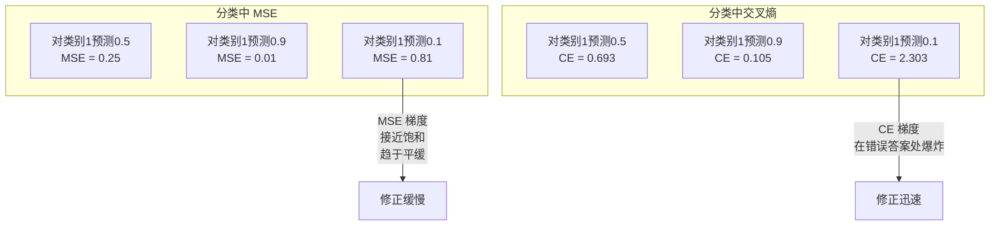
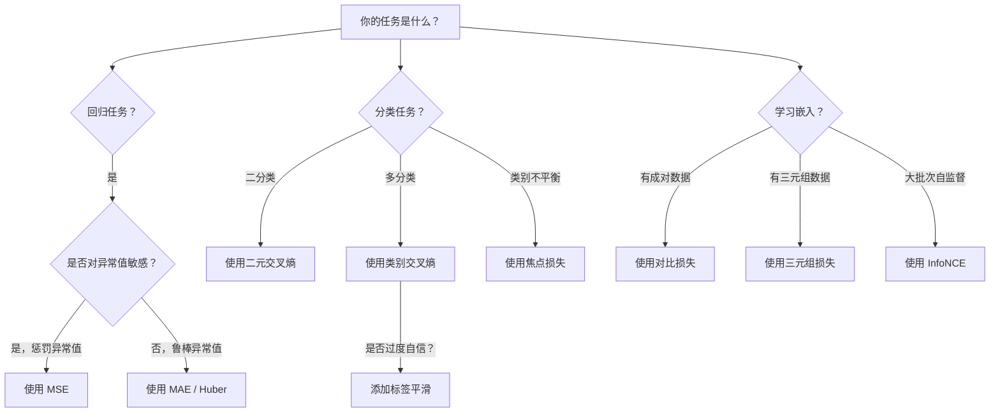
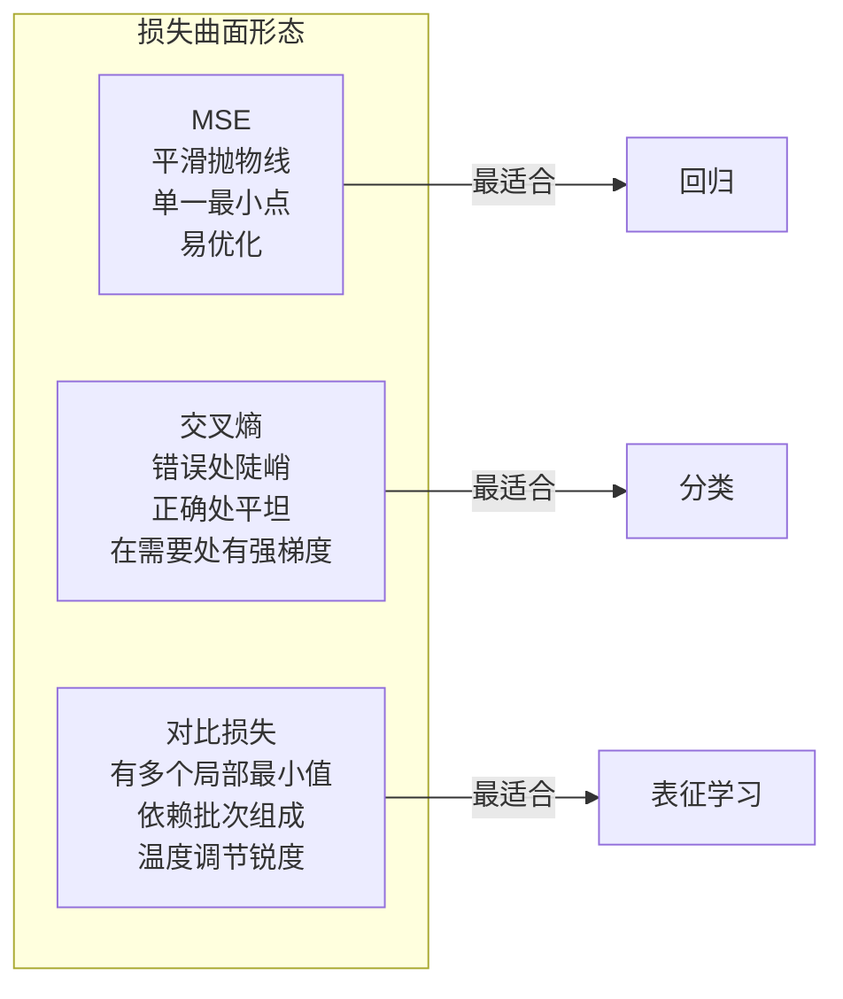

# 损失函数（Loss Functions）

> 你的网络做出了预测。真实标签（ground truth）却告诉你答案不是这样。错误有多大？这个数值就是损失（loss）。选择错误的损失函数，模型将完全优化错误的目标。

**类型：** 构建  
**语言：** Python  
**先决条件：** 课程 03.04（激活函数（Activation Functions））  
**时间：** 约 75 分钟

## 学习目标

- 从头实现均方误差（MSE）、二元交叉熵（binary cross-entropy）、类别交叉熵（categorical cross-entropy）和对比损失（InfoNCE）的计算及其梯度
- 通过展示“对所有类别预测0.5”的失败模式，解释为什么 MSE 不适合分类任务
- 应用标签平滑（label smoothing）到交叉熵并描述它如何防止过度自信的预测
- 针对回归、二分类、多分类和嵌入学习任务选择合适的损失函数

## 问题描述

用 MSE 最小化分类问题的模型会自信地对所有输入预测 0.5。它在最小化损失，却毫无用处。

损失函数是模型实际优化的唯一目标。不是准确率（accuracy），不是 F1 分数，也不是你向经理汇报的任何指标。优化器使用损失函数的梯度来调整权重，使损失值变小。如果损失函数不能体现你关心的目标，模型会找到数学上最便宜的满足方式，而这种方式几乎从来不是你想要的。

举个具体例子。你有一个二分类任务，两个类别各占 50%。你用 MSE 作为损失。模型对每个输入都预测 0.5，平均 MSE 是 0.25，这是没有真正学习到任何东西的最低损失值。模型没有任何区分能力，但技术上已经最小化了损失函数。换成交叉熵，模型会被迫将预测推向 0 或 1，因为 -log(0.5) = 0.693 是很差的损失，而 -log(0.99) = 0.01 对自信且正确的预测给予奖励。损失函数的选择决定了模型是学习还是“钻空子”。

情况更糟。自监督学习中，甚至没有标签。对比损失完全定义了学习信号：什么是相似，什么是不同，模型应该把它们推开多远。对比损失定义错误，嵌入会崩溃到同一个点——所有输入映射到相同的向量，技术上损失为零，但毫无价值。

## 概念解析

### 均方误差（Mean Squared Error，MSE）

回归任务的默认选择。计算预测值和目标的平方差，所有样本取平均。

```text
MSE = (1/n) * sum((y_pred - y_true)^2)
```

平方的意义：它对大错误二次惩罚。误差为2时损失是误差为1时的4倍，误差为10时损失是误差为1时的100倍。这使 MSE 对异常值敏感——一个严重错误的预测会主导损失。

举例：如果模型预测房价，大多数房子误差在 1 万美元以内，但一栋豪宅误差达到 20 万美元，MSE 会极力修正这栋豪宅，可能影响其他99栋房的表现。

MSE 相对于预测的梯度为：

```text
dMSE/dy_pred = (2/n) * (y_pred - y_true)
```

梯度与误差线性相关。误差越大梯度越大。对回归很合适（大误差需要大调整），但对分类来说是缺陷（分类时应对自信错误给予指数级惩罚，而非线性惩罚）。

### 交叉熵损失（Cross-Entropy Loss）

分类任务常用，非常信息论（information theory）根源——测量预测的概率分布和真实分布的差异。

**二元交叉熵（BCE）：**

```text
BCE = -(y * log(p) + (1 - y) * log(1 - p))
```

其中 y 为真实标签（0 或 1），p 为预测概率。

为什么 -log(p) 有效：当真实标签为 1，预测为 p=0.99 时，损失为 -log(0.99)=0.01；预测为 p=0.01 时，损失为 -log(0.01)=4.6。这个460倍的差距解释了交叉熵的效果。它严厉惩罚自信错误的预测，同时几乎不处罚自信正确的预测。

梯度同样体现该机制：

```text
dBCE/dp = -(y/p) + (1-y)/(1-p)
```

当 y=1 且 p 接近0时，梯度趋近负无穷，模型得到巨大信号来修正错误。p 接近1时，梯度很小，表明已正确无需修改。

**类别交叉熵（Categorical Cross-Entropy）：**

用于带有 one-hot 目标的多分类问题。

```text
CCE = -sum(y_i * log(p_i))
```

只有真实类别贡献损失（其它 y_i 为0）。如果有10类，正确类别概率为0.1（随机猜测），损失为 -log(0.1)=2.3；如果概率为0.9，则损失为 -log(0.9)=0.105。模型学习将概率质量集中到正确类别。

### 为什么 MSE 不适合分类



MSE 在预测接近 0 或 1 时梯度趋于平缓（由于 sigmoid 饱和）。交叉熵梯度抵消了 sigmoid 的平缓区间，在最需要调整的地方提供强梯度。

### 标签平滑（Label Smoothing）

标准的 one-hot 标签表示“这是100%类别3，其它类别0%”，声明过于绝对。标签平滑对其做软化：

```text
smooth_label = (1 - alpha) * one_hot + alpha / num_classes
```

以 alpha=0.1、10个类别为例，原始 [0, 0, 1, 0, ...] 变为 [0.01, 0.01, 0.91, 0.01, ...]，模型训练目标从1.0变为0.91。

作用是：模型若要输出软最大（softmax）完全为1.0，须把 logits 推向无穷大，导致过度自信，影响泛化，并对分布漂移敏感。标签平滑限制目标最大至0.9（alpha=0.1时），logits保持合理范围。GPT 和大多数现代模型都使用标签平滑或其等价方法。

### 对比损失（Contrastive Loss）

无标签，无类别。只有输入对和问题：它们相似还是不同？

**SimCLR 风格的对比损失（NT-Xent / InfoNCE）：**

取一张图片，增强出两张视图（裁剪、旋转、颜色扰动）。它们是“正样本对”，应有相似的嵌入。批次中的所有其它图片与该样本形成“负样本对”，应有不同的嵌入。

```text
L = -log(exp(sim(z_i, z_j) / tau) / sum(exp(sim(z_i, z_k) / tau)))
```

其中 sim() 是余弦相似度，z_i 与 z_j 是正样本对，求和在所有负样本上，tau（温度）控制分布的锐度。温度越低=负样本越难区分=分离越激进。

实际数字：批次大小256意味着每个正样本对有255个负样本。tau=0.07（SimCLR默认）。损失形似一个关于相似度的 softmax——它让正样本对的相似度在所有256个选项中最高。

**三元组损失（Triplet Loss）：**

取三个输入：锚点（anchor）、正样本（同类）、负样本（异类）。

```text
L = max(0, d(anchor, positive) - d(anchor, negative) + margin)
```

margin（通常0.2-1.0）强制正负距离有最小差距。负样本若已经足够远，损失为零——无梯度无更新。这样训练更高效，但需要仔细的三元组采样（找难负样本即接近锚点的负样本）。

### 焦点损失（Focal Loss）

针对样本类别不平衡。标准交叉熵对所有正确分类样本给同等权重。焦点损失对简单样本降权：

```text
FL = -alpha * (1 - p_t)^gamma * log(p_t)
```

p_t 是真实类的预测概率，gamma 控制聚焦程度。gamma=0 时为标准交叉熵。gamma=2（默认）时：

- 简单样本（p_t=0.9）：权重为 (0.1)^2 = 0.01，几乎被忽略。
- 难样本（p_t=0.1）：权重为 (0.9)^2 = 0.81，保留完整梯度。

焦点损失由 Lin 等人在目标检测中提出，检测背景占99%，为简单负样本。无焦点损失时，模型被海量简单背景淹没，无法学到有效物体检测。加了焦点损失，模型能关注关键的难样本。

### 损失函数决策树



### 损失曲面（Loss Landscape）



## 实战构建

### 第一步：实现 MSE 及其梯度

```python
def mse(predictions, targets):
    n = len(predictions)
    total = 0.0
    for p, t in zip(predictions, targets):
        total += (p - t) ** 2
    return total / n

def mse_gradient(predictions, targets):
    n = len(predictions)
    grads = []
    for p, t in zip(predictions, targets):
        grads.append(2.0 * (p - t) / n)
    return grads
```

### 第二步：实现二元交叉熵

log(0)问题是真实存在的。如果模型预测正样本的概率恰为0，log(0)为负无穷，截断成防止该情况。

```python
import math

def binary_cross_entropy(predictions, targets, eps=1e-15):
    n = len(predictions)
    total = 0.0
    for p, t in zip(predictions, targets):
        p_clipped = max(eps, min(1 - eps, p))
        total += -(t * math.log(p_clipped) + (1 - t) * math.log(1 - p_clipped))
    return total / n

def bce_gradient(predictions, targets, eps=1e-15):
    grads = []
    for p, t in zip(predictions, targets):
        p_clipped = max(eps, min(1 - eps, p))
        grads.append(-(t / p_clipped) + (1 - t) / (1 - p_clipped))
    return grads
```

### 第3步：带Softmax的分类交叉熵（Categorical Cross-Entropy）

Softmax将原始logits转换为概率。然后我们计算与one-hot目标的交叉熵。

```python
def softmax(logits):
    max_val = max(logits)
    exps = [math.exp(x - max_val) for x in logits]
    total = sum(exps)
    return [e / total for e in exps]

def categorical_cross_entropy(logits, target_index, eps=1e-15):
    probs = softmax(logits)
    p = max(eps, probs[target_index])
    return -math.log(p)

def cce_gradient(logits, target_index):
    probs = softmax(logits)
    grads = list(probs)
    grads[target_index] -= 1.0
    return grads
```

softmax + 交叉熵的梯度计算简化得非常优雅：对于真实类别是（预测概率 - 1），对于其他类别是（预测概率）。这个优雅的简化绝非偶然——这正是softmax和交叉熵配对使用的原因。

### 第4步：标签平滑（Label Smoothing）

```python
def label_smoothed_cce(logits, target_index, num_classes, alpha=0.1, eps=1e-15):
    probs = softmax(logits)
    loss = 0.0
    for i in range(num_classes):
        if i == target_index:
            smooth_target = 1.0 - alpha + alpha / num_classes
        else:
            smooth_target = alpha / num_classes
        p = max(eps, probs[i])
        loss += -smooth_target * math.log(p)
    return loss
```

### 第5步：对比损失（简化版InfoNCE）

```python
def cosine_similarity(a, b):
    dot = sum(x * y for x, y in zip(a, b))
    norm_a = math.sqrt(sum(x * x for x in a))
    norm_b = math.sqrt(sum(x * x for x in b))
    if norm_a < 1e-10 or norm_b < 1e-10:
        return 0.0
    return dot / (norm_a * norm_b)

def contrastive_loss(anchor, positive, negatives, temperature=0.07):
    sim_pos = cosine_similarity(anchor, positive) / temperature
    sim_negs = [cosine_similarity(anchor, neg) / temperature for neg in negatives]

    max_sim = max(sim_pos, max(sim_negs)) if sim_negs else sim_pos
    exp_pos = math.exp(sim_pos - max_sim)
    exp_negs = [math.exp(s - max_sim) for s in sim_negs]
    total_exp = exp_pos + sum(exp_negs)

    return -math.log(max(1e-15, exp_pos / total_exp))
```

### 第6步：分类中的MSE与交叉熵对比

使用第04课（圆形数据集）中的相同网络，分别使用两种损失函数训练。观察交叉熵收敛更快。

```python
import random

def sigmoid(x):
    x = max(-500, min(500, x))
    return 1.0 / (1.0 + math.exp(-x))

def make_circle_data(n=200, seed=42):
    random.seed(seed)
    data = []
    for _ in range(n):
        x = random.uniform(-2, 2)
        y = random.uniform(-2, 2)
        label = 1.0 if x * x + y * y < 1.5 else 0.0
        data.append(([x, y], label))
    return data


class LossComparisonNetwork:
    def __init__(self, loss_type="bce", hidden_size=8, lr=0.1):
        random.seed(0)
        self.loss_type = loss_type
        self.lr = lr
        self.hidden_size = hidden_size

        self.w1 = [[random.gauss(0, 0.5) for _ in range(2)] for _ in range(hidden_size)]
        self.b1 = [0.0] * hidden_size
        self.w2 = [random.gauss(0, 0.5) for _ in range(hidden_size)]
        self.b2 = 0.0

    def forward(self, x):
        self.x = x
        self.z1 = []
        self.h = []
        for i in range(self.hidden_size):
            z = self.w1[i][0] * x[0] + self.w1[i][1] * x[1] + self.b1[i]
            self.z1.append(z)
            self.h.append(max(0.0, z))

        self.z2 = sum(self.w2[i] * self.h[i] for i in range(self.hidden_size)) + self.b2
        self.out = sigmoid(self.z2)
        return self.out

    def backward(self, target):
        if self.loss_type == "mse":
            d_loss = 2.0 * (self.out - target)
        else:
            eps = 1e-15
            p = max(eps, min(1 - eps, self.out))
            d_loss = -(target / p) + (1 - target) / (1 - p)

        d_sigmoid = self.out * (1 - self.out)
        d_out = d_loss * d_sigmoid

        for i in range(self.hidden_size):
            d_relu = 1.0 if self.z1[i] > 0 else 0.0
            d_h = d_out * self.w2[i] * d_relu
            self.w2[i] -= self.lr * d_out * self.h[i]
            for j in range(2):
                self.w1[i][j] -= self.lr * d_h * self.x[j]
            self.b1[i] -= self.lr * d_h
        self.b2 -= self.lr * d_out

    def compute_loss(self, pred, target):
        if self.loss_type == "mse":
            return (pred - target) ** 2
        else:
            eps = 1e-15
            p = max(eps, min(1 - eps, pred))
            return -(target * math.log(p) + (1 - target) * math.log(1 - p))

    def train(self, data, epochs=200):
        losses = []
        for epoch in range(epochs):
            total_loss = 0.0
            correct = 0
            for x, y in data:
                pred = self.forward(x)
                self.backward(y)
                total_loss += self.compute_loss(pred, y)
                if (pred >= 0.5) == (y >= 0.5):
                    correct += 1
            avg_loss = total_loss / len(data)
            accuracy = correct / len(data) * 100
            losses.append((avg_loss, accuracy))
            if epoch % 50 == 0 or epoch == epochs - 1:
                print(f"    Epoch {epoch:3d}: loss={avg_loss:.4f}, accuracy={accuracy:.1f}%")
        return losses
```

## 使用方法

PyTorch提供了所有标准损失函数，并内置数值稳定性：

```python
import torch
import torch.nn as nn
import torch.nn.functional as F

predictions = torch.tensor([0.9, 0.1, 0.7], requires_grad=True)
targets = torch.tensor([1.0, 0.0, 1.0])

mse_loss = F.mse_loss(predictions, targets)
bce_loss = F.binary_cross_entropy(predictions, targets)

logits = torch.randn(4, 10)
labels = torch.tensor([3, 7, 1, 9])
ce_loss = F.cross_entropy(logits, labels)
ce_smooth = F.cross_entropy(logits, labels, label_smoothing=0.1)
```

使用 `F.cross_entropy`（不要用 `F.nll_loss` 加手动softmax）。它组合了log-softmax和负对数似然（negative log-likelihood）于一个数值稳定的操作。单独先用softmax再取log的方式数值稳定性差——大指数相减时会丢失精度。

对于对比学习，大多数团队使用自定义实现或库如 `lightly` 或 `pytorch-metric-learning`。核心流程总是一样：计算成对相似度，对正负样本做softmax，反向传播。

## 发布内容

本课产出：
- `outputs/prompt-loss-function-selector.md` —— 可重用的选择合适损失函数的提示词
- `outputs/prompt-loss-debugger.md` —— 当损失曲线异常时的诊断提示词

## 练习

1. 实现Huber损失（平滑L1损失），对小误差用MSE，对大误差用MAE。训练一个回归网络预测 y = sin(x)，训练数据中5%的目标带随机噪声（离群点），比较MSE和Huber的最终测试误差。
2. 在二分类训练循环中添加focal loss。创建一个不平衡数据集（90%类0，10%类1）。比较标准BCE与focal loss（gamma=2）对少数类召回率的影响，训练200轮。
3. 实现带半难负样本挖掘的三元组损失（triplet loss）。生成5类2D嵌入数据。对每个锚点，找到“半难负样本”——比正样本远且是最难的负样本。比较与随机选负样本的收敛速度。
4. 运行MSE vs交叉熵的对比，同时追踪训练中每层的梯度幅度。绘制每轮平均梯度范数。验证交叉熵在模型最不确定的早期阶段产生更大的梯度。
5. 实现KL散度损失，验证最小化 KL(true || predicted) 时梯度与交叉熵在真实分布为one-hot时相同。然后尝试软目标（如知识蒸馏），其中“真实”分布是教师模型的softmax输出。

## 关键词

| 术语 | 常见说法 | 实际含义 |
|------|----------|---------|
| Loss function（损失函数） | “模型错误有多大” | 一个可微函数，将预测和目标映射为标量，由优化器最小化 |
| MSE（均方误差） | “平均平方误差” | 预测和目标差平方的均值；对大误差有二次惩罚 |
| Cross-entropy（交叉熵） | “分类损失” | 测量预测概率分布与真实分布的差异，计算 -log(p) |
| Binary cross-entropy（二分类交叉熵） | “BCE” | 两分类交叉熵：-(y*log(p) + (1-y)*log(1-p)) |
| Label smoothing（标签平滑） | “软化目标” | 用软值（如0.1/0.9）替代硬0/1标签，防止过度自信，提升泛化能力 |
| Contrastive loss（对比损失） | “拉近相似，推远不同” | 通过让相似对在嵌入空间靠近，不同对远离，学习表示的损失 |
| InfoNCE | “CLIP/SimCLR 损失” | 温度归一化的交叉熵，基于相似度分数，将对比学习视为分类问题 |
| Focal loss | “不平衡数据的解决方案” | 用 (1-p_t)^γ 加权交叉熵，降低易样本权重，聚焦困难样本 |
| Triplet loss（三元组损失） | “锚点-正样本-负样本” | 使锚点与正样本距离比与负样本距离至少小一个margin |
| Temperature（温度系数） | “分布尖锐度调节” | logits/相似度的标量除数，控制分布的尖锐程度；数值越低越尖锐 |

## 参考阅读

- Lin et al., "Focal Loss for Dense Object Detection" (2017) —— 提出focal loss，解决目标检测中的极端类别不平衡（RetinaNet）
- Chen et al., "A Simple Framework for Contrastive Learning of Visual Representations" (SimCLR, 2020) —— 定义了现代对比学习框架和NT-Xent损失
- Szegedy et al., "Rethinking the Inception Architecture" (2016) —— 引入标签平滑作为正则化技术，现为大型模型的标准做法
- Hinton et al., "Distilling the Knowledge in a Neural Network" (2015) —— 使用软目标和KL散度的知识蒸馏，开创性工作，奠定模型压缩基础
