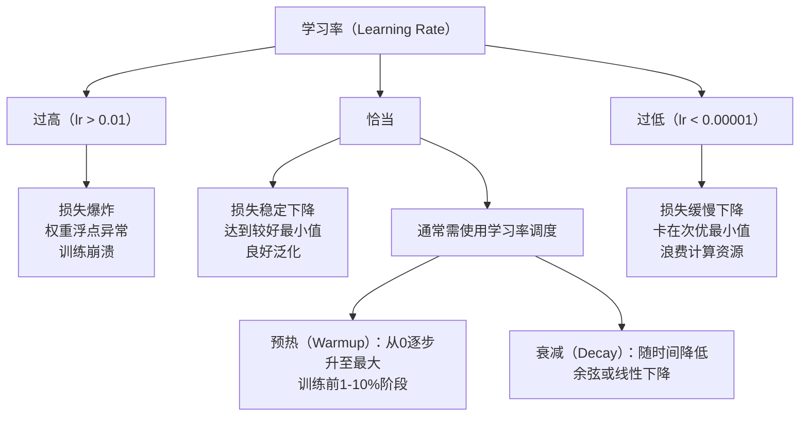
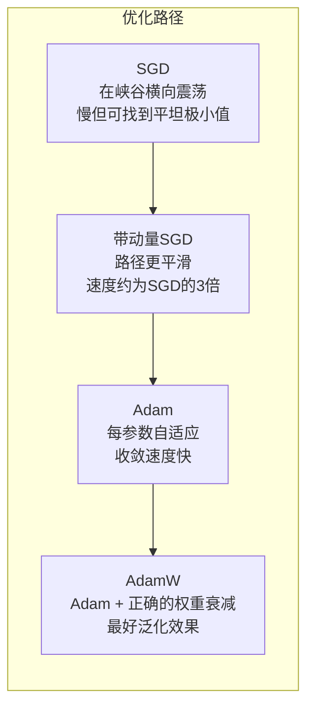
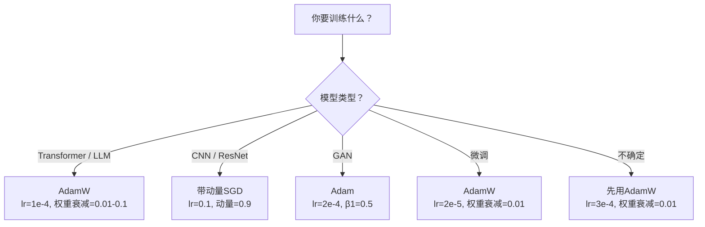

# 优化器（Optimizers）

> 梯度下降告诉你移动的方向，但不说明移动的距离或速度。SGD 是指南针，Adam 是带有交通信息的 GPS。

**类型：** 构建  
**语言：** Python  
**先决条件：** 课程 03.05（损失函数）  
**时间：** ~75 分钟

## 学习目标

- 从零实现 SGD、带动量的 SGD、Adam 和 AdamW 优化器（优化算法）
- 解释 Adam 的偏差校正如何补偿训练初期零初始化动量估计的影响
- 演示为什么 AdamW 在同一任务上比带 L2 正则化的 Adam 产生更好的泛化能力
- 为 Transformer（变换器）、CNN（卷积神经网络）、GAN（生成对抗网络）和微调选择适当的优化器及默认超参数

## 问题描述

你已经计算了梯度。你知道第4,721个权重应减少0.003以降低损失。但0.003是什么单位？如何缩放？第1步应移动多少，第1000步又应移动多少？

普通梯度下降（vanilla gradient descent）在每一步对每个参数应用相同的学习率：w = w - lr * gradient。这造成三个问题，使得神经网络训练在实践中变得痛苦。

首先，震荡。损失曲线通常不像光滑的碗形，而更像狭长的峡谷。梯度指向峡谷的横跨方向（陡峭方向），而非沿着峡谷的方向（浅方向）。梯度下降在狭窄维度上来回反弹，在有用方向上只做微小进展。你见过这种情况：损失迅速下降然后停滞，原因不是模型收敛了，而是处于震荡状态。

其次，为所有参数使用单一学习率是错误的。有些权重需要大幅更新（它们处于早期欠拟合阶段），而有些权重则需要很小的更新（接近最优值）。适合前者的学习率会毁掉后者，反之亦然。

第三，鞍点问题。在高维空间中，损失曲线有大量梯度接近零的平坦区。普通 SGD 以梯度的大小爬行，通过速度接近零的区域时，模型看似停滞。其实并未停滞，只是在平坦区，真正有用的下降方向在另一边，但 SGD 没有穿越这些区域的机制。

Adam 解决这三个问题。它为每个参数维护两个运行平均值——梯度均值（动量，用于处理震荡）和梯度平方均值（自适应步长，处理不同尺度）。结合针对前几步的偏差校正，它给你一个单一的优化器，以默认超参数适用于80%的问题。本课程从零构建 Adam，帮助你确切理解它何时以及为何在20%的情况下失败。

## 概念讲解

### 随机梯度下降（SGD）

最简单的优化器。计算小批量（mini-batch）上的梯度，沿梯度反方向走一步。

```text
w = w - lr * gradient
```

“随机”指的是使用数据的随机子集（小批量）估计梯度，而非使用整个数据集。这种噪声实际上有用——帮助模型逃离尖锐的局部最小值。但噪声也引起震荡。

学习率是唯一的调节旋钮。太高：损失发散。太低：训练太慢。最佳学习率依赖架构、数据、批大小和当前训练阶段。现代网络上的普通 SGD，学习率典型范围是0.01到0.1。但即使在一次训练中，理想学习率也会变化。

### 动量（Momentum）

滚雪球类比虽然被过度使用，但很准确。不仅用当前梯度更新参数，而是维护一个累积过去梯度的速度。

```text
m_t = beta * m_{t-1} + gradient
w = w - lr * m_t
```

Beta（通常是0.9）控制历史保留多少。β=0.9时，动量是近似最近10步梯度的均值（1/(1-0.9)=10）。

为什么能解决震荡：指向相同方向的梯度会累积，梯度方向反转会相互抵消。在狭窄峡谷，“横跨”方向的梯度每步变号，被抑制；“沿着”方向的梯度保持一致并被放大。效果是在有用方向上的加速更加平滑。

实际效果：在条件较差的损失曲面上，普通 SGD 可能要1万步，带动量的 SGD（β=0.9）同问题通常3,000-5,000步解决，提升显著。

### RMSProp

第一个真正可行的按参数自适应学习率方法。由 Hinton 在 Coursera 课程中提出（未正式发表）。

```text
s_t = beta * s_{t-1} + (1 - beta) * gradient^2
w = w - lr * gradient / (sqrt(s_t) + epsilon)
```

s_t 追踪梯度平方的运行平均。梯度持续大参数被除以较大数（有效学习率减小），梯度小的参数被除以小数（有效学习率增大）。

解决了“一刀切学习率”的问题。持续大更新的权重往往接近目标——减缓速度。持续小更新的权重可能未得到充分训练——加速更新。

Epsilon（通常1e-8）防止未更新参数时除零错误。

### Adam：动量 + RMSProp

Adam 结合了上述两种思想，每个参数维护两个指数移动平均：

```text
m_t = beta1 * m_{t-1} + (1 - beta1) * gradient        （一阶矩，均值）
v_t = beta2 * v_{t-1} + (1 - beta2) * gradient^2      （二阶矩，方差）
```

**偏差校正**是大多数解释忽略的关键细节。第1步时，m_1 = (1 - beta1) * gradient。β1=0.9时，仅为真实梯度的0.1，移动平均尚未“预热”。偏差校正补偿了这一点：

```text
m_hat = m_t / (1 - beta1^t)
v_hat = v_t / (1 - beta2^t)
```

第1步，β1=0.9时：m_hat = m_1 / 0.1 = 实际梯度；第100步后，(1 - 0.9^100)约为1，校正消失。偏差校正对前约10步重要，50步后无关紧要。

更新公式：

```text
w = w - lr * m_hat / (sqrt(v_hat) + epsilon)
```

Adam 默认学习率 lr=0.001，β1=0.9，β2=0.999，ε=1e-8。这组默认值适用于80%的问题。失效时，优先调整 lr，然后 β2，几乎不改 β1 和 ε。

### AdamW：正确的权重衰减（Weight Decay）

L2 正则化向损失中添加 λ * w^2。在普通 SGD 中，相当于权重衰减（每步减去 λ * w）。但在 Adam 中，这种等价关系失效。

Loshchilov & Hutter指出：加 L2 后，再用 Adam 处理梯度时，自适应步长也缩放了正则项。梯度方差大的参数正则化减弱，方差小的参数正则化增强。你想要的是无关梯度统计的均匀正则化。

AdamW 修正方式是在 Adam 更新后，直接对权重应用衰减：

```text
w = w - lr * m_hat / (sqrt(v_hat) + epsilon) - lr * lambda * w
```

权重衰减项（lr * λ * w）不受 Adam 自适应因子缩放，所有参数均匀受缩减。

这细节看似小巧，实则关键。AdamW 在几乎所有任务上比 Adam + L2 正则化实现更好收敛效果。PyTorch 训练 Transformer、扩散模型和大多数现代架构时默认优化器是 AdamW。BERT、GPT、LLaMA、Stable Diffusion 都用的是 AdamW。

### 学习率：最重要的超参数



调超参数首选学习率。学习率变化十倍的影响远超任何架构调整。常用默认值：

- SGD：lr=0.01 ~ 0.1  
- Adam/AdamW：lr=1e-4 ~ 3e-4  
- 预训练模型微调：lr=1e-5 ~ 5e-5  
- 学习率预热：线性提升，覆盖训练最初1-10%的步骤

### 优化器对比



### 各优化器适用场景



## 构建步骤

### 第1步：普通 SGD

```python
class SGD:
    def __init__(self, lr=0.01):
        self.lr = lr

    def step(self, params, grads):
        for i in range(len(params)):
            params[i] -= self.lr * grads[i]
```

### 第2步：带动量的 SGD

```python
class SGDMomentum:
    def __init__(self, lr=0.01, beta=0.9):
        self.lr = lr
        self.beta = beta
        self.velocities = None

    def step(self, params, grads):
        if self.velocities is None:
            self.velocities = [0.0] * len(params)
        for i in range(len(params)):
            self.velocities[i] = self.beta * self.velocities[i] + grads[i]
            params[i] -= self.lr * self.velocities[i]
```

### 第3步：Adam

```python
import math

class Adam:
    def __init__(self, lr=0.001, beta1=0.9, beta2=0.999, epsilon=1e-8):
        self.lr = lr
        self.beta1 = beta1
        self.beta2 = beta2
        self.epsilon = epsilon
        self.m = None
        self.v = None
        self.t = 0

    def step(self, params, grads):
        if self.m is None:
            self.m = [0.0] * len(params)
            self.v = [0.0] * len(params)

        self.t += 1

        for i in range(len(params)):
            self.m[i] = self.beta1 * self.m[i] + (1 - self.beta1) * grads[i]
            self.v[i] = self.beta2 * self.v[i] + (1 - self.beta2) * grads[i] ** 2

            m_hat = self.m[i] / (1 - self.beta1 ** self.t)
            v_hat = self.v[i] / (1 - self.beta2 ** self.t)

            params[i] -= self.lr * m_hat / (math.sqrt(v_hat) + self.epsilon)
```

### 第4步：AdamW

```python
class AdamW:
    def __init__(self, lr=0.001, beta1=0.9, beta2=0.999, epsilon=1e-8, weight_decay=0.01):
        self.lr = lr
        self.beta1 = beta1
        self.beta2 = beta2
        self.epsilon = epsilon
        self.weight_decay = weight_decay
        self.m = None
        self.v = None
        self.t = 0

    def step(self, params, grads):
        if self.m is None:
            self.m = [0.0] * len(params)
            self.v = [0.0] * len(params)

        self.t += 1

        for i in range(len(params)):
            self.m[i] = self.beta1 * self.m[i] + (1 - self.beta1) * grads[i]
            self.v[i] = self.beta2 * self.v[i] + (1 - self.beta2) * grads[i] ** 2

            m_hat = self.m[i] / (1 - self.beta1 ** self.t)
            v_hat = self.v[i] / (1 - self.beta2 ** self.t)

            params[i] -= self.lr * m_hat / (math.sqrt(v_hat) + self.epsilon)
            params[i] -= self.lr * self.weight_decay * params[i]
```

### 第5步：训练比较

使用所有四种优化器，在第05课的圆形数据集上训练同一个两层网络。比较收敛情况。

```python
import random

def sigmoid(x):
    x = max(-500, min(500, x))
    return 1.0 / (1.0 + math.exp(-x))

def make_circle_data(n=200, seed=42):
    random.seed(seed)
    data = []
    for _ in range(n):
        x = random.uniform(-2, 2)
        y = random.uniform(-2, 2)
        label = 1.0 if x * x + y * y < 1.5 else 0.0
        data.append(([x, y], label))
    return data


class OptimizerTestNetwork:
    def __init__(self, optimizer, hidden_size=8):
        random.seed(0)
        self.hidden_size = hidden_size
        self.optimizer = optimizer

        self.w1 = [[random.gauss(0, 0.5) for _ in range(2)] for _ in range(hidden_size)]
        self.b1 = [0.0] * hidden_size
        self.w2 = [random.gauss(0, 0.5) for _ in range(hidden_size)]
        self.b2 = 0.0

    def get_params(self):
        params = []
        for row in self.w1:
            params.extend(row)
        params.extend(self.b1)
        params.extend(self.w2)
        params.append(self.b2)
        return params

    def set_params(self, params):
        idx = 0
        for i in range(self.hidden_size):
            for j in range(2):
                self.w1[i][j] = params[idx]
                idx += 1
        for i in range(self.hidden_size):
            self.b1[i] = params[idx]
            idx += 1
        for i in range(self.hidden_size):
            self.w2[i] = params[idx]
            idx += 1
        self.b2 = params[idx]

    def forward(self, x):
        self.x = x
        self.z1 = []
        self.h = []
        for i in range(self.hidden_size):
            z = self.w1[i][0] * x[0] + self.w1[i][1] * x[1] + self.b1[i]
            self.z1.append(z)
            self.h.append(max(0.0, z))

        self.z2 = sum(self.w2[i] * self.h[i] for i in range(self.hidden_size)) + self.b2
        self.out = sigmoid(self.z2)
        return self.out

    def compute_grads(self, target):
        eps = 1e-15
        p = max(eps, min(1 - eps, self.out))
        d_loss = -(target / p) + (1 - target) / (1 - p)
        d_sigmoid = self.out * (1 - self.out)
        d_out = d_loss * d_sigmoid

        grads = [0.0] * (self.hidden_size * 2 + self.hidden_size + self.hidden_size + 1)
        idx = 0
        for i in range(self.hidden_size):
            d_relu = 1.0 if self.z1[i] > 0 else 0.0
            d_h = d_out * self.w2[i] * d_relu
            grads[idx] = d_h * self.x[0]
            grads[idx + 1] = d_h * self.x[1]
            idx += 2

        for i in range(self.hidden_size):
            d_relu = 1.0 if self.z1[i] > 0 else 0.0
            grads[idx] = d_out * self.w2[i] * d_relu
            idx += 1

        for i in range(self.hidden_size):
            grads[idx] = d_out * self.h[i]
            idx += 1

        grads[idx] = d_out
        return grads

    def train(self, data, epochs=300):
        losses = []
        for epoch in range(epochs):
            total_loss = 0.0
            correct = 0
            for x, y in data:
                pred = self.forward(x)
                grads = self.compute_grads(y)
                params = self.get_params()
                self.optimizer.step(params, grads)
                self.set_params(params)

                eps = 1e-15
                p = max(eps, min(1 - eps, pred))
                total_loss += -(y * math.log(p) + (1 - y) * math.log(1 - p))
                if (pred >= 0.5) == (y >= 0.5):
                    correct += 1
            avg_loss = total_loss / len(data)
            accuracy = correct / len(data) * 100
            losses.append((avg_loss, accuracy))
            if epoch % 75 == 0 or epoch == epochs - 1:
                print(f"    Epoch {epoch:3d}: loss={avg_loss:.4f}, accuracy={accuracy:.1f}%")
        return losses
```

## 使用方法

PyTorch 优化器处理参数组（parameter groups）、梯度裁剪（gradient clipping）和学习率调度（learning rate scheduling）：

```python
import torch
import torch.optim as optim

model = torch.nn.Sequential(
    torch.nn.Linear(784, 256),
    torch.nn.ReLU(),
    torch.nn.Linear(256, 10),
)

optimizer = optim.AdamW(model.parameters(), lr=3e-4, weight_decay=0.01)

scheduler = optim.lr_scheduler.CosineAnnealingLR(optimizer, T_max=100)

for epoch in range(100):
    optimizer.zero_grad()
    output = model(torch.randn(32, 784))
    loss = torch.nn.functional.cross_entropy(output, torch.randint(0, 10, (32,)))
    loss.backward()
    torch.nn.utils.clip_grad_norm_(model.parameters(), max_norm=1.0)
    optimizer.step()
    scheduler.step()
```

惯用模式始终是：zero_grad，前向传播（forward），计算损失（loss），反向传播（backward），（裁剪）（clip），一步更新（step），（调度）（schedule）。牢记这个顺序。弄错（例如先调用 `scheduler.step()` 再调用 `optimizer.step()`）是常见的微妙错误来源。

对于卷积神经网络（CNNs），许多实践者仍然偏好使用带动量（momentum） 的SGD（学习率 lr=0.1，动量 momentum=0.9，权重衰减 weight_decay=1e-4），配合 step 或余弦调度。SGD 找到的极小值往往更平坦，泛化能力更好。对于 Transformer（Transformer 架构）和大语言模型（LLMs），AdamW 配合预热（warmup）+余弦衰减是通用默认方案。没有充分理由不要去对抗这种共识。

## 交付成果

本课会产生：
- `outputs/prompt-optimizer-selector.md` -- 一个决策提示，用于为任何架构选择合适的优化器和学习率

## 练习

1. 实现 Nesterov 动量，其中梯度在“前瞻”位置（w - lr * beta * v）计算，而非当前位置。将其在圆形数据集上的收敛情况与标准动量比较。

2. 实现学习率预热调度：在训练开始的 10% 步骤内线性攀升从 0 到 max_lr，之后余弦衰减至 0。用 Adam + 预热与不带预热的 Adam 对比训练。测量达到圆形数据集90%准确率所需的 epoch 数。

3. 追踪 Adam 训练期间每个参数的有效学习率。有效学习率是 lr * m_hat / (sqrt(v_hat) + eps)。绘制第10步、第50步和第200步后有效学习率的分布。所有参数的更新速率是否一致？

4. 实现梯度裁剪（按全局范数裁剪），最大梯度范数设为1.0。用较大学习率（Adam lr=0.01）计算，分别有无裁剪训练。用10个随机种子测试，统计发散（loss变为NaN）的运行次数。

5. 比较 Adam 与 AdamW 在权重较大的网络上的表现。初始化所有权重为[-5, 5]区间内随机值（远大于常规范围），训练200个epoch，权重衰减 weight_decay=0.1。绘制两种优化器训练过程中权重 L2 范数的变化。AdamW 应该表现出更快的权重缩小。

## 关键术语

| 术语 | 大众说法 | 实际含义 |
|------|----------|----------|
| Learning rate（学习率） | “步长” | 梯度更新的标量乘数；训练中最关键的超参数 |
| SGD（随机梯度下降） | “基本梯度下降” | 在小批量上计算梯度，更新权重：权重 -= lr * 梯度 |
| Momentum（动量） | “滚动球比喻” | 过去梯度的指数移动平均；减缓振荡，加速一致方向 |
| RMSProp | “自适应学习率” | 将每个参数的梯度除以其近期梯度的RMS；平衡学习率 |
| Adam | “默认优化器” | 结合动量（第一矩）和 RMSProp（第二矩），并有偏差校正 |
| AdamW | “正确的 Adam” | Adam 的权重量衰减版本；权重正则化与梯度分开应用 |
| Bias correction（偏差校正） | “运行均值的预热” | 除以 (1 - beta^t)，补偿 Adam 初始时刻估算偏差 |
| Weight decay（权重衰减） | “缩小权重” | 每步从权重中减去一部分；正则化惩罚大权重 |
| Learning rate schedule（学习率调度） | “随时间调整学习率” | 训练期间动态调整学习率的函数；预热+余弦衰减是现代默认 |
| Gradient clipping（梯度裁剪） | “限制梯度范数” | 当梯度范数超过阈值时缩放梯度；防止梯度爆炸 |

## 延伸阅读

- Kingma & Ba, "Adam: A Method for Stochastic Optimization" (2014) -- Adam 原始论文，含收敛分析和偏差校正推导
- Loshchilov & Hutter, "Decoupled Weight Decay Regularization" (2017) -- 证明L2正则化和权重衰减在Adam中非等价，提出 AdamW
- Smith, "Cyclical Learning Rates for Training Neural Networks" (2017) -- 引入LR区间测试和周期调度，免去调参固定学习率
- Ruder, "An Overview of Gradient Descent Optimization Algorithms" (2016) -- 最佳单篇优化器综述，包含清晰比较与直观解释
